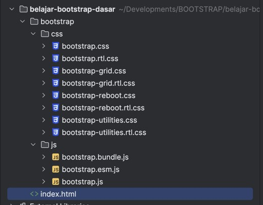

# Bootstrap Dasar

## Sebelum Belajar

- Kelas HTML dari Programmer Zaman Now
- Kelas CSS dari Programmer Zaman Now
- Kelas JavaScript dari Programmer Zaman Now

## #1 Pengenalan Bootstrap

### Sejarah Bootstrap

- Bootstrap pertama kali dikembangkan di Twitter sebagai project internal bernama Twitter Blueprint, tujuannya untuk membuat CSS library agar tampilan frontend di internal Twitter konsisten
- Twitter akhirnya merilis Twitter Blueprint sebagai project opensource tahun 2011 dengan nama Bootstrap
- Saat ini Bootstrap sudah rilis versi 5, dan menjadi salah satu CSS framework terpopuler di Github
- <https://getbootstrap.com>
- <https://github.com/twbs/bootstrap>

### Kenapa Belajar Bootstrap?

- Bootstrap didesain agar responsive dan bisa berjalan di semua browser modern
- Bootstrap memiliki banyak sekali komponen, seperti `navbar`, `dropdown`, `label`, `alert`, dan lain-lain
- Bootstrap bisa mudah dikembangkan dan disesuaikan sesuai dengan kebutuhan kita
- Bootstrap tidak membutuhkan library lain, sehingga sangat optimal untuk kita gunakan
- Banyak sekali template-template yang gratis dan berbayar dibuat menggunakan Bootstrap, sehingga sangat bermanfaat ketika kita mengerti Bootstrap

## #2 Dokumentasi Resmi

### Dokumentasi Resmi

- Cara belajar terbaik adalah dengan membaca dokumentasi resminya
- Bootstrap memiliki dokumentasi yang baik, sehingga untuk belajar Bootstrap kita bisa baca dokumentasinya secara langsung
- Pada kelas ini, kita akan gunakan dokumentasi resmi sebagai acuan untuk belajar Bootstrap
- <https://getbootstrap.com/>

## #3 Menginstall Bootstrap

- <https://getbootstrap.com/docs/5.3/getting-started/download/>

### Isi Bootstrap

- <https://getbootstrap.com/docs/5.3/getting-started/contents/>

## #4 Membuat Project

- Buatlah folder dengan nama `belajar-bootstrap-dasar`
- Download file Bootstrap dan extract ke dalam folder `belajar-bootstrap-dasar` dengan nama bootstrap

### Struktur FOlder Project

## #5 Hello World

- Saat kita menggunakan Bootstrap, secara otomatis semua pengaturan default Bootstrap akan ditambahkan
- <https://getbootstrap.com/docs/5.3/getting-started/introduction/>

## #6 Reboot

- Saat kita menambahkan Bootstrap ke halaman HTML, Bootstrap akan melakukan Reboot seluruh format CSS
- Reboot digunakan agar halaman HTML konsisten di semua Web Browser
- Sederhananya Reboot melakukan pengaturan ulang seluruh nilai default CSS sehingga tidak mengikuti pengaturan Web Browser, dengan begitu otomatis tampilan di semua Web Browser akan konsisten sama
- Ada banyak sekali yang di Reboot oleh Bootstrap, kita bisa lihat di halaman berikut :
- <https://getbootstrap.com/docs/5.3/content/reboot/>
- Semua pengaturan Reboot bisa kita lihat di file `bootstrap-reboot.css`

## #7 Typography

- Di Pengaturan Reboot, Bootstrap juga mengubah default Typography yang digunakan seperti font family dan font size nya
- Detail dari Typography apa saja yang digunakan di Bootstrap, kita bisa lihat di halaman dokumentasinya :
- <https://getbootstrap.com/docs/5.3/content/typography/>

## #8 Breakpoint

- Breakpoint adalah ukuran lebar (width) yang mendefinisikan layout responsive di Bootstrap
- Bootstrap memiliki beberapa ukuran breakpoint
- Kedepannya, jika kita menggunakan nama class yang mengandung nama breakpoint, berarti kita bisa tahu bahwa class tersebut digunakan pada breakpoint yang ditentukan
- <https://getbootstrap.com/docs/5.3/layout/breakpoints/>

## #9 Background

- Bootstrap menyediakan banyak class untuk mengubah gaya background
- <https://getbootstrap.com/docs/5.3/utilities/background/>

## #10 Color

- Bootstrap menyediakan banyak class untuk digunakan mengubah gaya color
- <https://getbootstrap.com/docs/5.3/utilities/colors/>

## #11 Text

- Bootstrap menyediakan banyak class untuk digunakan mengubah gaya text
- <https://getbootstrap.com/docs/5.3/utilities/text/>

## #12 Spacing

- Bootstrap menyediakan banyak class untuk digunakan mengubah gaya margin dan juga padding
- <https://getbootstrap.com/docs/5.3/utilities/spacing/>

## #13 Border

- Bootstrap menyediakan banyak class untuk digunakan mengubah gaya border
- <https://getbootstrap.com/docs/5.3/utilities/borders/>

## #14 Sizing

- Bootstrap menyediakan banyak class untuk digunakan mengubah ukuran tinggi (height) dan lebar (width)
- <https://getbootstrap.com/docs/5.3/utilities/sizing/>

## #15 Shadow

- Bootstrap menyediakan banyak class untuk digunakan mengubah gaya box shadow
- <https://getbootstrap.com/docs/5.3/utilities/shadows/>

## #16 Color dan Background

- Bootstrap menyediakan class untuk mengatur color dan background secara cepat
- <https://getbootstrap.com/docs/5.3/helpers/color-background/>

## #17 Visiblity

- Bootstrap menyediakan class untuk digunakan mengubah visibility
- <https://getbootstrap.com/docs/5.3/utilities/visibility/>

## #18 Opacity

- Bootstrap menyediakan class untuk digunakan mengubah opacity
- <https://getbootstrap.com/docs/5.3/utilities/opacity/>

## #19 Link

- Bootstrap menyediakan class untuk digunakan mengubah gaya Link
- <https://getbootstrap.com/docs/5.3/utilities/link/>

## #20 Display

- Bootstrap menyediakan class untuk digunakan mengubah display
- <https://getbootstrap.com/docs/5.3/utilities/display/>

## #21 Overflow

- Bootstrap menyediakan class untuk digunakan mengubah gaya overflow
- <https://getbootstrap.com/docs/5.3/utilities/overflow/>

## #22 Position

- Bootstrap menyediakan class untuk digunakan mengubah position
- <https://getbootstrap.com/docs/5.3/utilities/position/>

## #23 Quick Position

- Bootstrap menyediakan class untuk digunakan mengubah position secara cepat
- <https://getbootstrap.com/docs/5.3/helpers/position/>

## #24 Vertical Alignment

- Bootstrap menyediakan class untuk digunakan mengubah vertical alignment
- <https://getbootstrap.com/docs/5.3/utilities/vertical-align/>

## #25 Z-Index

- Bootstrap menyediakan class untuk digunakan mengubah `z-index`
- <https://getbootstrap.com/docs/5.3/utilities/z-index/>

## #26 Interaction

- Bootstrap menyediakan class untuk digunakan mengubah text interaction
- <https://getbootstrap.com/docs/5.3/utilities/interactions/>

## #27 Image

- Bootstrap menyediakan class untuk digunakan mengubah image
- <https://getbootstrap.com/docs/5.3/content/images/>

## #28 Figure

- Bootstrap menyediakan class untuk digunakan mengubah fiture
- <https://getbootstrap.com/docs/5.3/content/figures/>

## #29 Object Fit

- Bootstrap menyediakan class untuk digunakan mengatur object fit
- <https://getbootstrap.com/docs/5.3/utilities/object-fit/>

## #30 Table

- Bootstrap menyediakan class untuk digunakan mengatur table
- <https://getbootstrap.com/docs/5.3/content/tables/>

## #31 Icon

- Bootstrap menyediakan fitur icon, yang bisa digunakan untuk membuat icon dalam halaman web secara mudah
- <https://icons.getbootstrap.com/>

## #32 Color Mode

- Bootstrap menyediakan tema warna, dan kita bisa mengatur tema warna yang kita inginkan
- <https://getbootstrap.com/docs/5.3/customize/color-modes/>

## #33 Materi Selajutnya

- Bootstrap Layout
- Bootstrap Form
- Bootstrap Component
- Bootstrap Customize
