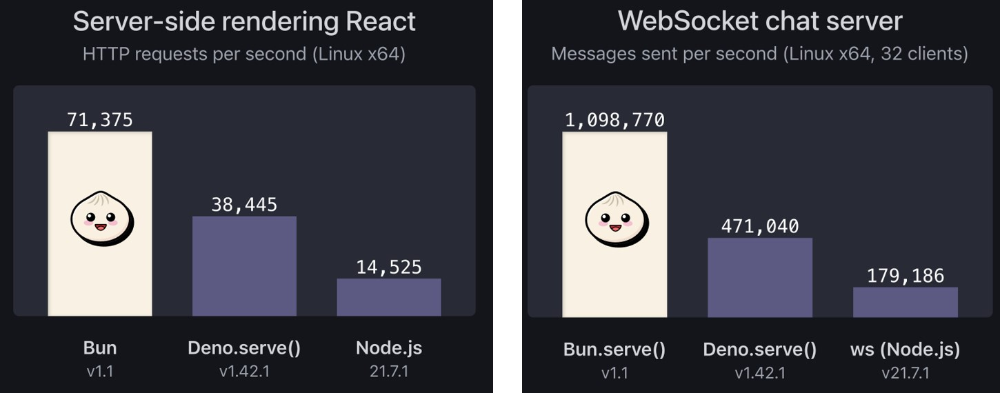

# Bun Dasar

## Sebelum Belajar

- Kelas JavaScript dari Programmer Zaman Now
- Kelas NodeJS dari Programmer Zaman Now
- Kelas TypeScript dari Programmer Zaman Now

## #1 Pengenalan Bun

- Bun merupakan teknologi mirip seperti NodeJS, yaitu tool yang digunakan untuk menjalankan kode JavaScript
- Bun dibuat pertama kali oleh Jarred Summer, sebagai pengganti NodeJS
- Bun dibuat menggunakan bahasa pemrograman Zig
- Bun dibuat dari Webkit JavaScript Core, tidak seperti NodeJS yang menggunakan V8
- Bun adalah teknologi Free dan OpenSource
- <https://bun.sh/>

### Kenapa Bun?

- Bun diklaim lebih cepat dari NodeJS
- Bun juga sekali bisa digunakan untuk JavaScript, Bun juga secara default bisa digunakan untuk TypeScript.
- Bun tidak hanya tool untuk menjalankan kode JavaScript atau TypeScript, tidak seperti NodeJS, pada Bun, semua tool sudah disediakan, seperti Runtime untuk menjalankan JavaScript / TypeScript, Test Runner untuk Unit Test, dan Package Manager yang kompatibel dengan Node Package Manager

### Benchmark Bun vs Deno vs NodeJS



## #2 Menginstall Bun

- Bun bisa di install di sistem operasi Linux, MacOS dan Windows
- <https://bun.sh/docs/installation>
- Untuk memastikan bahwa Bun sudah terinstall, kita bisa gunakan perintah :
- `bun --version`

## #3 Membuat Project

- Buatlah folder belajar-bun-dasar, lalu masuk ke dalam folder tersebut menggunakan terminal :
- `bun init`
- Saat membuat project, kita bisa memilih bahasa pemrograman sesuai dengan file entrypoint nya, misal jika `.js` artinya JavaScript, jika `.ts` artinya TypeScript

### Kode: Hello World

```js
// index.js
console.log("Hello via Bun!");
```

### Menjalankan File

- Untuk menjalankan kode program di dalam file yang sudah kita buat, kita bisa gunakan perintah :
- `bun run namafile.js/ts`

## #4 TypeScript

- Seperti yang dijelaskan di awal, Bun secara default mendukung TypeScript
- Jika kita perhatian, file `jsconfig.json` sebenarnya berisi konfigurasi dari TypeScript, kita bisa ubah menjadi tsconfig.json jika kita ingin menggunakan bahasa pemrograman TypeScript
- Selain itu, di package.json, secara default dependency TypeScript akan di install di project Bun

### Kode: TypeScript

```ts
// index.ta
console.log("Hello via Bun!");
```

## #5 JSX

- Selain JavaScript dan TypeScript, React mempopulerkan penggunakan HTML di JavaScript, atau banyak yang menyebutkan JSX
- Bun juga mendukung penggunaan JSX / TSX
- Namun kita perlu menginstall dependency react :
- `bun add react`
- `bun add @types/react --dev`

### Kode: Hello TSX

```tsx
// hello.tsx
const hello = <h1>Hello World</h1>;
console.info(hello);
```

## #6 Environment Variable

- Saat kita membuat aplikasi, kita sering membuat konfigurasi dari environment variable
- Bun secara otomatis akan membaca file `.env`, sehingga kita bisa baca konfigurasi dari file `.env` secara otomatis tanpa harus melakukannya secara manual atau menggunakan library apapun
- Untuk mendapatkan informasi dari file `.env`, kita bisa langsung menggunakan variable process di kode JavaScript/TypeScript yang kita buat

### Kode: Environment Variable

```
# .env
DATABASE_HOST=localhost
DATABASE_PORT=3306
DATABASE_USER=root
DATABASE_PASSWORD=root
DATABASE_NAME=belajar-bun
```

### Kode: Membaca Environment Variable

```ts
// env.ts
const database: object = {
	host: process.env.DATABASE_HOST,
	port: process.env.DATABASE_PORT,
	user: process.env.DATABASE_USER,
	password: process.env.DATABASE_PASSWORD,
	name: process.env.DATABASE_NAME,
};

console.info(database);
```

### `NODE_ENV`

- Secara default, Bun akan membaca file `.env`
- Namun, jika kita menambah value ke environment variable `NODE_ENV`
- Maka secara otomatis Bun akan membaca dari file `.env.{NODE_ENV}`
- Misal kita buat `.env.production`, `.env.dev`, dan lain-lain

### Mengubah `NODE_ENV`

```sh
export NODE_ENV=production
bun env.ts
{
	host: "production",
	port: "3306",
	user: "root",
	password: "root",
	name: "belajar-bun",
}
```

## #7 Watch Mode

- Bun mendukung membaca ulang file secara otomatis
- Kita bisa menggunakan tambahan parameter `--watch` ketika menjalankan aplikasi
- Ini cocok ketika dalam mode development, sehingga kita tidak perlu menjalankan ulang kode program JavaScript/TypeScript yang kita buat

### Menggunakan Watch Mode

```sh
bun --watch run index.ts
```

## #8 Package Manager

- Di NodeJS, kita mengenal NPM (Node Package Manager)
- Di Bun, secara otomatis sudah terdapat Package Manager, sehingga tidak perlu menginstalnya secara manual lagi
- Cara penggunaan Bun Package Manager hampir mirip seperti NPM

### Install

- Untuk menginstall dependency, kita bisa gunakan perintah :
- `bun install`
- Sebelumnya di NPM, semua informasi dependency yang diinstall akan disimpan di file `package.log`, namun berbeda dengan Bun
- Bun menyimpan informasi dependency yang diinstall dalam file `bun.lockb` (Binary File)
- Bun menggunakan Binary File agar lebih cepat untuk dibaca dibanding NPM yang menggunakan file JSON
- Jika kita hanya ingin menginstall production dependencies, kita bisa gunakan perintah :
- `bun install --production`

### Manahement Dependency

- Untuk menambah dependency, kita bisa gunakan perintah :
- `bun add nama-dependency`
- Untuk menghapus dependency, kita bisa gunakan perintah :
- `bun remove nama-dependency`
- Untuk mengupdate semua dependency, kita bisa gunakan perintah :
- `bun update `

### Cache

- Saat menginstall dependency, secara default biasanya dependency akan disimpan di local storage komputer kita di lokasi `$USER/.bun/install/cache`
- Oleh karena itu, jika dependency dengan versi yang sama sudah pernah di download, maka yang akan digunakan adalah yang dari local storage
- Hal ini otomatis akan mempercepat proses download dependency, dibanding harus download ulang lagi satu per satu

## #9 Test Runner

- Bun secara default memiliki fitur Test Runner yang kompatibel dengan Jest
- Jika kita sudah terbiasa menggunakan Jest, maka akan sangat mudah membuat unit test di Bun, karena kodenya kompatibel
- Untuk menjalankan Unit Test menggunakan Bun Test Runner, kita bisa gunakan perintah :
- `bun test`
- Kita juga bisa menggunakan Watch Mode ketika menjalankan unit test menggunakan perintah :
- `bun test --watch`

### Kode: Say Hello Function

```ts
// hello.ts
export function sayHello(name: string): string {
	return `Hello ${name}`;
}
```

### Kode: Say Hello Test

```ts
// hello.test.ts
import { describe, it, expect } from "bun:test";
import { sayHello } from "../src/hello.ts";

describe("Bun Test Runner", () => {
	it("should support unit test", async () => {
		const response = sayHello("Eko");
		expect(response).toBe("Hello Eko");
	});
});
```

## #10 Package Runner

- Di NPM, terdapat file npx untuk sebagai package runner, untuk menjalankan perintah yang terdapat di dependency, contoh kita sering menggunakan perintah :
- `npx prisma generate`
- Di Bun, kita bisa ganti menggunakan file `bunx`
- Contohnya, perintah yang akan dieksekusi oleh Package Runner bisa kita cek di folder `node_modules/.bin`

### Menggunakan Package Runner

```sh
bunx tsc --version
```

## #11 Workspace

- Bun Package Manager mendukung fitur bernama Workspace
- Fitur ini digunakan untuk membuat manajemen beberapa project sekaligus dalam satu repository
- Contoh di dalam project yang sudah kita buat, kita ingin membuat sub-project atau module dalam bentuk package lagi, maka kita bisa gunakan fitur Workspace ini
- Untuk memberitahu ke project utama, kita bisa menambahkan workspace di dalam `package.json`
- Kita perlu menyimpan seluruh sub-package dalam folder packages

### Kode: package.json

```json
{
	"name": "belajar-bun-dasar",
	"module": "index.ts",
	"type": "module",
	"workspaces": ["packages/*"],
	"dependencies": {
		"react": "^18.2.0"
	}
}
```

### Tugas

- Buatlah 3 package dalam folder modules, user, contact dan address

### Menginsatall Pacakge ke Node Modules

- Setelah kita menambah sub package, kita bisa menginstall seluruh sub packages ke Node Modules dengan perintah :
- `bun install`
- Secara otomatis akan dibuat symlink di `node_modules` yang mengacu ke sub package

### Kode: Sub Packages


### Kode: User di Sub Package User

```ts
// user.ts
export class User {
	constructor(public name: string) {}
}
```

### Kode: Menggunakan User

```ts
// user.test.ts
import { describe, it, expect } from "bun:test";
import { User } from "user/user.ts";

describe("User Package", () => {
	it("should accessed from main pacakge", async () => {
		const user = new User("Eko");
		expect(user.name).toBe("Eko");
	});
});
```

## #12 Bunfig

### Kode: `bunfig.toml`

```toml
logLevel = "debug"

[test]
root = "./tests"
coverage = true
```

## #13 NodeJS Compatibility

- Saat kita pindah dari NodeJS ke Bun, biasanya pertanyaannya, apakah kode yang sudah kita buat di NodeJS bisa berjalan dengan baik di Bun?
- Untungnya, Bun secara bertahap selalu mendukung kompatibilitas dengan NodeJS
- Walaupun belum 100% kompatibel, namun kita bisa cek NodeJS Library mana saja yang sudak kompatibel dengan Bun ataupun yang belum kompatibel
- <https://bun.sh/docs/runtime/nodejs-apis>

### Kode: NodeJS Compatibility

```ts
// os.test.ts
import { describe, it, expect } from "bun:test";
import * as os from "node:os";

describe("NodeJS API", () => {
	it("should support os", async () => {
		const arch = os.arch();
		expect(arch).toBe("arm64");

		const type = os.type();
		expect(type).toBe("Darwin");
	});
});
```

## #14 Web API

- Kita tahu bahwa saat menggunakan JavaScript di Web Browser, terdapat fitur Web API yang biasanya hanya tersedia di Web Browser
- Karena Bun akan berjalan di Server, bukan di Web Browser, jadi beberapa fitur di Web API mungkin tidak relevan untuk Bun
- Namun, Bun mendukung sebagian fitur yang terdapat di Web API, sehingga kita bisa menjalankan kode Web API dengan Bun
- <https://bun.sh/docs/runtime/web-apis>

### Kode: Fetch Menggunakan Bun

```ts
// fetch.test.ts
import { describe, it, expect } from "bun:test";

describe("Web API", () => {
	it("should support fetch", async () => {
		const resposne = await fetch("https://example.com/");
		expect(response.status).toBe(200);
		expect(response.headers.get("Content-Type")).toBe("text/html");
		expect(await response.text()).toContain("Example Domain");
	});
});
```

## #15 Bun Standard Library

### NodeJS Standard Library

- Di kelas NodeJS, kita sudah bahas banyak sekali NodeJS Standard Library
- Kita bisa praktekan ulang jika kita mau, sesuai dengan NodeJS Standard Library yang pernah kita bahas di kelas NodeJS
- Namun, perlu diperhatikan, kita harus cek kompatibilitasnya dengan Bun
- <https://bun.sh/docs/runtime/nodejs-apis>

### Bun Standard Library

- Selain kompatibel dengan NodeJS Standard Library
- Bun juga menyediakan Standard Library yang bisa kita gunakan
- Namun perlu diperhatikan, saat kita menggunakan Bun Standard Library, artinya kode ini tidak akan berjalan di NodeJS, karena hanya tersedia di Bun
- Di materi-materi selanjutnya, kita akan bahas satu persatu Standard Library yang disediakan oleh Bun

## #16 HTTP Server

- Bun menyediakan library untuk membuat HTTP Server
- <https://bun.sh/docs/api/http>

### Kode: HTTP Server

```ts
// server.ts
Bun.serve({
	port: 3000,
	fetch: (request, server) => {
		const url = new URL(request.url);
		if (url.searchParams.get("name")) {
			return new Response(`Hello ${url.searchParams.get("name")}`);
		} else {
			return new Response("Hello World!");
		}
	},
});
```

## #17 File IO

- Bun menyediakan library untuk membaca dan menulis ke file
- <https://bun.sh/docs/api/file-io>

### Kode: File IO

```ts
// file.ts

// Read file content
const file = Bun.file(".env");
const content = await file.text();
console.log(content);

// Write file content
await Bun.write(".env.test", content);
```

## #18 Hashing

- Bun menyediakan library untuk melakukan hashing
- Contohnya Bun menyediakan algoritma `bcrypt`, yang banyak digunakan untuk melakukan hashing password
- <https://bun.sh/docs/api/hashing>

### Kode: Hashing

```ts
// hashing.ts
const passwordHash = await But.password.hash("rahasia", {
	algorithm: "bcrypt",
	cost: 10,
});

const result = await Bun.password.verify("rahasia", passwordHash, "bcrypt");
console.info(result);
```

## #19 Semantic Versioning

- Saat ini, versi aplikasi banyak yang menggunakan semantic versioning :
- <https://semver.org/>
- Bun memiliki library yang bisa digunakan untuk melakukan pengecekan semantic versioning
- <https://bun.sh/docs/api/semver?>

### Kode: Semantic Versioning

```ts
// semver.ts
const appVersion = " 1.2.3";

console.info(BUn.semver.satisfies(appVersion, "1.x"));
console.info(BUn.semver.satisfies(appVersion, "2.x"));
console.info(BUn.semver.satisfies(appVersion, ">=1.0.0"));
console.info(BUn.semver.satisfies(appVersion, "<1.0.0"));
console.info(BUn.semver.satisfies(appVersion, "^1.1.1"));
```

## #20 Utilities

- Sebelum-sebelumnya kita sudah lihat, bahwa saat menggunakan library Bun, kita selalu menggunakan global variable Bun
- Banyak sekali attribute yang terdapat di global variable Bun
- Kita bisa lihat di halaman dokumentasinya
- <https://bun.sh/docs/api/utils>

### Kode: Utilities

```rs
// util.ts
console.info(Bun.version);
console.info(Bun.env);
```

## #21 Bun Ecosystem

- Salah satu pertanyaan ketika kita pindah dari NodeJS ke Bun biasanya adalah, bagaimana dengan ekosistem dari Bun?
- Apakah sudah sebanyak NodeJS atau belum?
- Pastinya jawabannya belum, karena merupakan teknologi baru dibanding NodeJS yang sudah lama
- Namun, Bun sejak awal memang ingin kompatibel dengan NodeJS, oleh karena itu banyak sekali library atau package yang dibuat di NodeJS, sekarang bisa digunakan di Bun juga
- Materi-materi selanjutnya, kita akan coba menggunakan library / package NodeJS yang sudah pernah kita bahas di kelas NodeJS dan TypeScript

### NodeJS Library

- Winston
- ExpressJS
- Zod
- Prisma ORM

## #22 Winston

- Winston adalah library untuk Logging yang paling populer di NodeJS
- Sekarang kita akan coba menggunakan Winston library menggunakan Bun
- <https://github.com/winstonjs/winston>
- Detail materi Winston pernah kita bahas di kelas NodeJS Logging

### Menginstall Library Winston

- Untuk menginstall Winston library, kita bisa gunakan perintah :
- `bun add winston`

### Kode: Menggunakan Winston

```ts
// winston.ts
import winston from "winston";

const logger = winston.createLogger({
	format: winston.format.json(),
	level: "debug",
	transports: [new winston.transports.Console()],
});

logger.info("Hello World");
```

## #23 ExpressJS

- ExpressJS merupakan salah satu library untuk membuat HTTP Server yang paling populer di NodeJS
- Sekarang kita akan coba menggunakan ExpressJS di Bun
- <https://expressjs.com/>
- Detail materi ExpressJS pernah kita bahas di kelas NodeJS ExpressJS

### Menginstall Library ExpressJS

- Untuk menginstal library ExpressJS kita bisa gunakan perintah :
- `bun add express`
- `bun add @types/express --dev`

### Kode: Menggunakan ExpressJS

```ts
// express.ts
import express from "express";

const app = express();

app.get("/", (req, res) => {
	res.send("Hello World");
});

app.listen(3000, () => {
	console.log("Server is running on http://localhost:3000");
});
```

## #24 Zod

- Zod adalah salah satu validation library yang sangat populer di TypeScript
- Sekarang kita akan coba menggunakan Zod menggunakan Bun
- <https://zod.dev/>
- Detail materi Zod pernah kita bahas di kelas TypeScript Validation

### Menginstall Library Zod

- Untuk menginstall library Zod, kita bisa menggunakan perintah :
- `bun add zod`

### Kode: Menggunakan Zod

```ts
// zod.ts
import { z } from "zod";

const loginValidation = z.object({
	username: z.string().min(1).max(50).email(),
	password: z.string().min(1).max(50),
});

const request = {
	username: "eko@example.com",
	password: "",
};

loginValidation.parse(request);
```

## #25 Prisma ORM

- Prisma ORM adalah salah satu ORM (Object Relational Mapping) Library yang populer di NodeJS
- Sekarang kita akan coba menggunakan Prisma ORM di Bun
- <https://www.prisma.io/>
- Materi Prisma sudah kita bahas di kelas NodeJS Database

### Menginstall Library Prisma ORM

- Untuk menginstall library Prisma ORM, kita bisa gunakan perintah :
- `bun add prisma --dev`
- Selanjutnya, kita bisa inisialisasi konfigurasi Prisma ORM nya menggunakan perintah :
- `bunx prisma init --datasource-provider mysql`

### Konfigurasi Database

- Buatlah database di MySQL dengan nama : `belajar_bun_dasar`
- Selanjutnya ubah konfigurasi MySQL di file `.env`

### Kode: Prisma Schema

```prisma
model Contact {
	id 		Int 		@id @default(autoincrement())
	name 	String 	@db.VarChar(100)
	phone String? @db.VarChar(20)
	email String? @db.VarChar(100)

	@@map("contacts")
}
```

### Menjalankan Migration dan Membuat Prisma Client

- Setelah selesai membuat Prisma Schema, kita bisa menjalankan database migration menggunakan perintah :
- `bunx prisma migrate dev`
- Selanjutnya kita bisa membuat kode Prisma Client secara otomatis menggunakan perintah :
- `bunx prisma generate`

### Kode: Menggunakan Prisma ORM

```ts
// prisma.ts
import { PrismaClient } from "@prisma/client";

const prisma = new PrismaClient();
const contact = await prisma.contact.create({
	data: {
		name: "Eko Kurniawan",
		email: "eko@example.com",
		phone: "0999999999",
	},
});

console.info(content);
```

## #26 Build

- Bun memiliki fitur yang bisa digunakan untuk melakukan build project yang kita buat menggunakan perintah :
- `bun build input.js/ts --outdir folder`
- Secara otomatis Bun akan melakukan kompilasi seluruh kode yang kita gunakan menjadi single file

### Kode: Hello App

```ts
// hello.ts
import { sayHello } from "./src/hello.ts";

const result = sayHello("TypeScript");

console.log(result);
```

### Kode: Hasil Build

```ts
// hello.js

// src/hello.ts
function sayHello(name) {
	return `Hello ${name}`;
}

// hello.ts
var result = sayHello("TypeScript");
console.log(result);
```

### Executable File

- Selain menjadikan single file, Bun juga bisa digunakan untuk membuat executable file dari kode program yang kita buat
- Kita hanya perlu menambahkan parameter `--compile` saat melakukan build
- Secara otomatis semua package yang kita butuhkan akan di include ke dalam executable file, dan juga Bun Runtime nya
- Direkomendasikan untuk menambahkan parameter `--minify` untuk mengecilkan ukuran file sehingga mempercepat proses aplikasi
- Dan parameter `--sourcemap` agar informasi kode program tersedia, sehingga mudah untuk men-debug ketika terjadi error
- Dan untuk `--compile`, kita tidak bisa menggunakan `--outdir`, kita harus menggunakan `--outfile`

### Kode: Express JS

```ts
// express.ts
import express from "express";

const app = express();

app.get("/", (req, res) => {
	const name = req.query["name"] || "World";
	res.send(`Hello ${name}`);
});

app.listen(3000, () => {
	console.log("Server is running on http://localhost:3000");
});
```

### Kode: Menggunakan Distribution File

```sh
bun build src/express.ts --compile --minify --sourcemap --outfile build/express
```

## #27 Penutup
