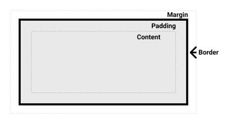

# CSS Dasar

## Sebelum Belajar

- Belajar HTTP
- HTML Dasar
- HTML Form

## #1 Membuat Project

- Buatlah folder: belajar-css-dasar

### Live Preview

- Untuk mempermudah belajar CSS, silahkan install extension Live Preview di Visual Studio Code
- <https://marketplace.visualstudio.com/items?itemName=ms-vscode.live-server>

## #2 Pengenalan CSS

- CSS singkatan dari Cascadinf Style Sheets
- HTML digunakan untuk membuat struktur konten web secara semantic, dan CSS digunakan untuk memberi style (gaya) dan layout (tata letak) pada konten HTML
- Contohnya, kita bisa menggunakan CSS untuk mengubah font, color, size dan lain-lain pada konten yang sudah kita buat menggunakan HTML

### Apa itu CSS?

- CSS adalah bahasa yang digunakan untuk mendiskripsikan bagiamana sebuah dokumen yang sudah dibuat menggunakan HTML, ditampilkan ke pengguna
- Setiap browser biasanya punya standar masing-masung ketika menampilkan dokumen HTML
- Dengan menggunakan CSS, kita bisa membuat semua browser menampilkan dokumen HTML dengan cara yang sama

### CSS Syntax

- CSS adalah bahasa yang barbasis rule/aturan
- Kita akan mendefisinikan rule/aturan untuk element yang terdapat di dokumen HTML yang kita buat
- Membuat rule di CSS biasanya dimulai dengan menyebutkan element yang akan dipilih, lalu diikuti dengan kurung kurawal buka, dilanjutkan dengan aturan-aturan yang akan kita gunakan, dan diakhiri dengan kurung kurawal tutup
- Aturan dalam CSS disebutkan dengan:
- `property: value;`

### Kode: Contoh CSS Syntax

```css
h1 {
	color: red;
	font-size: 20px;
}

h2 {
	color: blue;
	font-size: 15px;
}
```

## #3 Menambah CSS

### Menambah CSS ke HTML

- Terdapat tiga cara untuk menambah CSS ke HTML
- Cara internal, dimana CSS disimpan di file yang sama dengan HTML. Yaitu dengan menggunakan tag style
- Cara external, dimana CSS disimpan di file yang berbeda dengan HTML. Yaitu menggunakan tag link.
- Cara inline, dimana CSS disimpan dalam atribut styles poada tag html, ini pernah kita lakukan di kelas HTML, dan cara ini tidak direkomendasikan

### Kode: CSS Internal

```html
<!-- css-internal.html -->
<!doctype html>
<html>
	<head>
		<meta charset="utf-8" />
		<meta name="viewport" content="width=device-width, initial-scale=1" />
		<title>CSS Internal</title>
		<style>
			h1 {
				color: red;
				font-size: 20px;
			}

			h2 {
				color: blue;
				font-size: 15px;
			}
		</style>
	</head>
	<body>
		<h1>Belajar CSS</h1>
		<h2>Belajar CSS Internal</h2>
	</body>
</html>
```

### Kode: CSS External

```css
/* hello.css */
h1 {
	color: red;
	font-size: 20px;
}

h2 {
	color: blue;
	font-size: 15px;
}
```

```html
<!-- css-external.html -->
<!doctype html>
<html>
	<head>
		<meta charset="utf-8" />
		<meta name="viewport" content="width=device-width, initial-scale=1" />
		<title>CSS External</title>
		<link rel="stylesheet" type="text/css" href="hello.css" />
	</head>
	<body>
		<h1>Belajar CSS</h1>
		<h2>Belajar CSS External</h2>
	</body>
</html>
```

## #4 Comment

- Saat membuat kode CSS, kadang kita ingin menyisipkan komentas
- Komentar adalah kode yang tidak akan berdampak apapun
- Untuk membuat komentar kita harus mengawali dengan `/*` dan diakhiri dengan `*/`
- Komentar bisa multi baris

### Kode: Comment

```css
/* Ini adalah komentar satu baris */
h1 {
	color: red;
	font-size: 20px;
}

/*
Ini komentar 
multi barus
tidak terbatas
*/
h2 {
	color: blue;
	font-size: 15px;
}
```

## #5 ID

- Selain menggunakan memilih element menggunakan HTML Tag, kita juga bisa memilih element menggunakan ID di CSS
- Untuk menggunakan ID, kita perlu menggunakan `#` diawal nama ID nya

### Kode: ID

```html
...
<head>
	<style>
		#judul {
			color: red;
			font-size: 40px;
		}
	</style>
</head>
...
<h1 id="judul">Ini adalah judul</h1>
<h1>Ini adalah judul</h1>
...
```

## #6 Class

- Kadag ada kasus kita menambahkan style CSS ke beberapa element tag yang jenisnya berbeda
- jika kita harus buat aturan nya per tag, maka akan menyulitkan ketika banyak sekali
- Di HTML, semua tag bisa memilih atribut class, dan di CSS, kita bisa menambahkan aturan ke class dengan menggunakan awalan `.` (titik)

### Kode: Class

```html
...
<head>
	<style>
		.red {
			color: red;
		}
	</style>
</head>
...
<h1 class="red">This Is Title</h1>
<h2 class="red">This Is Sub Title</h2>
<p class="red">This Is Article</p>
...
```

### Multiple Class

- Nilai dar atribut class bisa menggunakan beberapa nilai, caranya kita bisa tambahkan pemisah menggunakan spasi

### Kode: Multiple Class

```html
...
<head>
	<style>
		.red {
			color: red;
		}
		.upper {
			text-transform: uppercase;
		}
	</style>
</head>
...
<h1 class="red upper">This Is Title</h1>
<h2 class="red upper">This Is Sub Title</h2>
<p class="red">This Is Article</p>
...
```

## #7 Selector

- Sebelumnya kita sudah tahu cara memilih elemnt yang akan ditambahkan aturan di CSS< yaitu menggunakan tag, #id atau class
- Memilih elemen d CSS dinamakan Selector
- Ada banyak jenis Selector, dan kita akan bahas di selector di materi masing-masing
- Di materi ini kita akan bahasa tentang simple selector

### Simple Selector

- Simple selector adalah selector untun memilih elemen berdasarkan nama (tag), `#id` atau `.class`
- Jika kita ingin membuat selector untuk beberapa element, kita bisa gunakan `,` (koma) sebagai pemisah

### Type Selector

- Type Selector melakukan seleksi element berdasarkan tag html
- <https://css-tricks.com/almanac/selectors/t/type>

```css
h1 {
	color: red;
}
```

### ID Selector

- ID Selector melakukan seleksi element berdasarkan ID
- <https://css-tricks.com/almanac/selectors/i/id>

```css
#title {
	color: red;
}
```

### Class Selector

- Class Selector melakukan seleksi element berdasarkan nama class
- <https://css-tricks.com/almanac/selectors/c/class>

```css
.sample {
	color: red;
}
```

### Selector List

- Selector list melakukan seleksi beberapa element sekaligus menggunakan pemisah `,` (koma)

```css
h1,
h2,
#title,
.sample {
	color: red;
}
```

## #8 Combinator Selector

- Combinator adalah sesuatu yang menjelaskan relasi antar selector
- Terdapat 4 selector untuk combinator
- discendant selector (space)
- child selector (>)
- adjacent sibling selector (+)
- general sibling selector (~)

### Descendant Selector

- Descendant Selector adalah selector untuk memilih element anak dari element yang dipilih
- Artinya kita memilih semua tag p yang terdapat di dalam element div
- <https://css-tricks.com/almanac/selectors/d/descendant>

```css
div p {
	color: red;
}
```

```html
<div>
	<article>
		<p>Ini Dipilih</p>
	</article>
	<p>Ini Dipilih</p>
</div>
<p>Ini Tidak Dipilih</p>
```

### Child Selector

- Child Selector adalah selector untuk memilih child / anak dari element yang dipilih
- Artinya kita memilih semua element p yang anaka dari div (div adalah parent element untuk p)
- <https://css-tricks.com/almanac/selectors/c/child>

```css
div > p {
	color: red;
}
```

```html
<div>
	<article>
		<p>Ini Tidak Dipilih</p>
	</article>
	<p>Ini Dipilih</p>
</div>
<p>Ini Tidak Dipilih</p>
```

### Adjacent Sibling Selector

- Adjacent Sibling Selector digunakan untuk memilih element setelah element yang dipilih
- Sibling (saudara) element harus memilih parent element yang sama
- Gambar disamping artinya memilih element p yang diletakkan setelah element di dimana p dan div memiliki parent yang sama
- <https://css-tricks.com/almanac/selectors/a/adjacent-sibling>

```css
div + p {
	color: red;
}
```

```html
<body>
	<div>
		<article>
			<p>Ini Tidak Dipilih</p>
		</article>
		<p>Ini Tidak Dipilih</p>
	</div>
	<p>Ini Dipilih</p>
	<p>Ini Tidak Dipilih</p>
</body>
```

### General Sibling Selector

- General Sibling Selector digunakan untuk memilih seluruh element saudara dari element yang dipilih, dimana harus memiliki parent element yang sama
- Contoh gambar disamping adalah memilih semua element p dari saudara element div dimana div dan parent harus memiliki parent yang sama
- <https://css-tricks.com/almanac/selectors/g/general-sibling>

```css
div ~ p {
	color: red;
}
```

```html
<body>
	<div>
		<article>
			<p>Ini Tidak Dipilih</p>
		</article>
		<p>Ini Tidak Dipilih</p>
	</div>
	<p>Ini Dipilih</p>
	<p>Ini Dipilih</p>
</body>
```

## #9 Attribute Selector

- CSS juga mendukung selector menggunakan atribut yang terdapat di tag HTML
- Terdapat banyak cara untuk menggunakan Attribute Selector

### CSS [attribute] Seelctor

- Artinya memilih semua element `a` yang memiliki atribut target
- <https://css-tricks.com/almanac/selectors/a/attribute>

```css
a[target] {
	color: red;
}
```

### CSS [atribute="value"] Selector

- Artinya memilih semua element `a` yang memiliki atribut target dengan nilai `"_blank"`
- <https://css-tricks.com/almanac/selectors/a/attribute>

```css
a[target="_blank"] {
	color: red;
}
```

### CSS [atribute~="value"] Selector

- Artinya memilih semua element `p` yang memiliki atribut title yang terdapat kata belajar
- <https://css-tricks.com/almanac/selectors/a/attribute>

```css
a[title~="belajar"] {
	color: red;
}
```

```html
<p title="belajar pemrograman">Ini Dipilih</p>
<p title="belajarpemrograman">Ini Tidak Dipilih</p>
```

### CSS [atribute|="value"] Selector

- Artinya memilih semua element `p` yang memiliki atribut title yang terdapat value `"belajar"` atau `"belajar"` yang diikuti dengan karakter `-`
- <https://css-tricks.com/almanac/selectors/a/attribute>

```css
a[title|="belajar"] {
	color: red;
}
```

```html
<p title="belajar">Ini Dipilih</p>
<p title="belajarpemrograman">Ini Tidak Dipilih</p>
<p title="belajar-pemrograman">Ini Dipilih</p>
```

### CSS [atribute^="value"] Selector

- Artinya memilih semua element `p` yang memiliki atribut title yang dimulai dengan `"belajar"`
- <https://css-tricks.com/almanac/selectors/a/attribute>

```css
a[title^="belajar"] {
	color: red;
}
```

```html
<p title="belajar pemrograman">Ini Dipilih</p>
<p title="belajar">Ini Dipilih</p>
<p title="belajar-pemrograman">Ini Dipilih</p>
<p title="pemrograman-belajar">Ini Tidak Dipilih</p>
```

### CSS [atribute$="value"] Selector

- Artinya memilih semua element `p` yang memiliki atribut title yang memiliki value diakhiri dengan `"belajar"`
- <https://css-tricks.com/almanac/selectors/a/attribute>

```css
a[title$="belajar"] {
	color: red;
}
```

```html
<p title="belajar pemrograman">Ini Tidak Dipilih</p>
<p title="belajar">Ini Dipilih</p>
<p title="belajar-pemrograman">Ini Tidak Dipilih</p>
<p title="pemrograman-belajar">Ini Dipilih</p>
```

### CSS [atribute*="value"] Selector

- Artinya memilih semua element `p` yang memiliki atribut title yang mengandung kata `"belajar"`
- <https://css-tricks.com/almanac/selectors/a/attribute>

```css
a[title*="belajar"] {
	color: red;
}
```

```html
<p title="belajar pemrograman">Ini Dipilih</p>
<p title="belajar">Ini Dipilih</p>
<p title="belajar-pemrograman">Ini Dipilih</p>
<p title="pemrograman-belajar">Ini Dipilih</p>
```

### Attribute Selector Tanpa Tag

- Saat menggunakan Attribute Selector nama tag sebenarnya tidak wajib, jadi kita bisa langsung menggunakan Attribute Selector
- Attrbute Selector juga bisa digunakan pada Class atau ID
- <https://css-tricks.com/almanac/selectors/a/attribute>

```css
[title*="belajar"] {
	color: red;
}

.article[title*="belajar"] {
	color: red;
}
```

## #10 Color

- Color merupakan rule di CSS untuk mengubah warna, biasa digunakan pada teks
- CSS mendukung banyak cara menggunakan color
- <https://developer.mozilla.org/en-US/docs/Web/CSS/color>

### HTML Color Names

- Sebelumnya kita pernah menggunakan color red, selain red, HTML mendukung banyak sekali color
- Kita bisa lihat dihalaman web ini untuk daftar warna apa saja yang didukung oleh HTML
- <https://htmlcolorcodes.com/color-names>

### HEX, RGB dan HSL

- Selain menggunakan Color Name, CSS juga mendukung color menggunakan format HEX, RGB dan HSL
- <https://colorpicker.me>

## #11 Text

- CSS bisa digunakan untuk mengubah properties atau format untuk text
- Contohnya sebenarnya kita sudah menggunakan color untuk mengubah warna text
- Selain color, masih banyak yang bisa kita ubah dari properties atau format untuk text

### Text Alignment

- Text alignment digunakan untuk mengubah rata tulisan, kita bisa menggunakan rule `text-align`, dimana memiliki beberapa nilai seperti
- <http://developer.mozilla.org/en-US/docs/Web/CSS/text-align>
- `left` untuk rata kiri
- `right` untuk rata kanan
- `center` untuk rata tengan
- `justify` untuk rata kiri dan kanan

### Text Decoration

- Text Decoration digunakan untuk menambah garis dekorasi ke text
- Kita bisa menggunakan aturan `text-decoration`
- <http://developer.mozilla.org/en-US/docs/Web/CSS/text-decoration>

### Text Transformation

- Text Transformation digunakan untuk mengubah uppercase dan lowercase untuk text
- Kita bisa menggunakan aturan `text-transform`
- <http://developer.mozilla.org/en-US/docs/Web/CSS/text-transform>

### Text Spacing

- Text Spacing digunakan untuk mengatur jarak dalam text
- Aturan `text-indent` digunakan untuk mengatur jarak di awal text
- <http://developer.mozilla.org/en-US/docs/Web/CSS/text-indent>
- Aturan `letter-spacing` digunakan untuk mengatur jarak antar huruf
- <http://developer.mozilla.org/en-US/docs/Web/CSS/letter-spacing>
- Aturan `line-height` digunakan untuk mengatur jarak antar baris
- <http://developer.mozilla.org/en-US/docs/Web/CSS/line-height>
- Aturan `word-spacing` digunakan untuk mengatur jarak antar kate
- <http://developer.mozilla.org/en-US/docs/Web/CSS/word-spacing>
- Aturan `white-space` digunakan untuk mengatur bagaimana whitespace ditampilkan
- <http://developer.mozilla.org/en-US/docs/Web/CSS/white-space>

### Text Shadow

- Text Shadow digunakan untuk menambahkan efek bayangan pada text
- Untuk menambahkan Text Shadow, kita bisa menggunakan aturan `text-shadow`
- <http://developer.mozilla.org/en-US/docs/Web/CSS/text-shadow>

### Referensi

- Untuk melihat lebih detail tentang text, kita bisa lihat referensi nya dihalaman ini:
- <http://developer.mozilla.org/en-US/docs/Web/CSS/CSS_text>
- <http://developer.mozilla.org/en-US/docs/Web/CSS/CSS_text_decoration>

## #12 Font

- Saat membuat tulisan, biasanya Web Browser akan menggunakan default font nya, tiap Web Browser memiliki default Font masing-masing
- Saat membuat web, baiknya kita menggunakan font yang sama sehingga tampilan web kita konsisten
- Kita bisa mengatur Font di halaman HTML menggunakan CSS dengan property font
- <https://developer.mozilla.org/en-US/docs/Web/CSS/font>

### Font Family

- Untuk mengubah jenis font, kita bisa menggunakan property `font-family`
- <https://developer.mozilla.org/en-US/docs/Web/CSS/font-family>
- Menggunakan `font-family` sangat tergantung dengan sistem operasi yang digunakan, jika font nya tidak ada di sistem operasi yang digunakan, maka hasilnya tidak akan sesuai dengan yang kita mau
- Kita bisa menggunakan generic font family yang sudah menjadi standar untuk CSS
- Kita bisa melihat daftar generic family name disini :
- <https://www.w3.org/TR/css-fonts-3/#generic-font-families>

### Font Style

- Untuk mengubah style dari font, kita bisa menggunakan property `font-style`
- <https://developer.mozilla.org/en-US/docs/Web/CSS/font-style>
- Untuk mengubah ketebalan dari font, kita bisa menggunakan property `font-weight`
- <https://developer.mozilla.org/en-US/docs/Web/CSS/font-weight>

### Font Size

- Untuk mengubah ukuran dari font, kita bisa menggunakan property `font-size`
- <https://developer.mozilla.org/en-US/docs/Web/CSS/font-size>

### Google Font

- Salah satu penyedia font gratis yang bisa kita gunakan adalah Google Font
- Kisa bisa mencari font di Google Font, lalu menggunakan CSS untuk menambahkan font yang kita mau di halaman Web yang kita mau
- <https://fonts.google.com/>

### Kode: Google Font

```html
<link
	rel="stylesheet"
	href="https://fonts.googleapis.com/css?family=Agbalumo"
/>
<style>
	.title {
		font-family: "Agbalumo";
	}
</style>
```

## #13 Background

- CSS bisa digunakan untuk mengubah latar belakang / background dari tiap element di HTML
- Kita bisa menggunakan property `background`
- <https://developer.mozilla.org/en-US/docs/Web/CSS/background>

### Background Color

- Background yang paling sederhana Background Color, yaitu mengubah background element menjadi color
- Sama seperti property `color`, background color juga mendukung format color `HEX`, `RGB` dan `HSL`
- Kita bisa menggunakan property `background-color` untuk mengubah background menggunakan color
- <https://developer.mozilla.org/en-US/docs/Web/CSS/background-color>

## #14 Box Model

- Saat menggunakan CSS, terdapat konsep bernama Box Model
- Biasanya digunakan ketika kita ingin mengatur tata letak / layout pada element
- Setiap element di HTML, memiliki Box yang terdiri dari `content`, `padding`, `border` dan `margin`

### Gambaran Box Model

- Content adalah isi dari element
- Padding adalah arena transparan antara content dan border
- Border adalah kotak yang mengelilingi content
- Margin adalah arena transparan paling luar setelah border



### Size

- Saat kita membuat element HTML, kita tahu bahwa beberapa element ditampilkan dalam block, dan beberapa element ditampilkan dalam inline
- Dengan menggunakan CSS, kita bisa mengubah ukuran dari tiap element menggunakan `height` dan `width`
- <https://developer.mozilla.org/en-US/docs/Web/CSS/height>
- <https://developer.mozilla.org/en-US/docs/Web/CSS/width>

### Padding

- Untuk mengatur area Padding, kita bisa menggunakan property `padding` dengan CSS
- <https://developer.mozilla.org/en-US/docs/Web/CSS/padding>

### Margin

- Untuk mengatur area Margin, kita bisa menggunakan property `margin` dengan CSS
- <https://developer.mozilla.org/en-US/docs/Web/CSS/margin>

## #15 Debug dengan Browser

- Salah satu cara saat kita ingin melihat Box Model pada halaman HTML yaitu dengan menggunakan Web Browser
- Tiap Web Browser biasanya ada fitur untuk melihat detail dari informasi halaman HTML yang sedang dibuka
- Contohnya di Google Chrome, kita bisa klik kanan element yang ingin kita lihat, lalu pilih menu Inspect Element

## #16 Min dan Max Size

- Saat menambahkan size pada element, kadang kita ingin menentukan minimal atau maksimal dari size element, hal ini untuk menjaga element tidak terlalu kecil atau tidak terlalu besar
- Kita juga bisa mengaturnya menggunakan property di CSS

### Min Size

- Untuk mengatur minimal kita bisa menggunakan property
- `min-height` untuk minimal tinggi
- <https://developer.mozilla.org/en-US/docs/Web/CSS/min-height>
- `min-width` untuk minimal lebar
- <https://developer.mozilla.org/en-US/docs/Web/CSS/min-width>

### Max Size

- Untuk mengatur maksimal kita bisa menggunakan property
- `max-height` untuk minimal tinggi
- <https://developer.mozilla.org/en-US/docs/Web/CSS/max-height>
- `max-width` untuk minimal lebar
- <https://developer.mozilla.org/en-US/docs/Web/CSS/max-width>

## #17 Border

- Dalam Box Model, terdapat bagian Border
- Untuk mengubah Border, kita bisa menggunakan property `border`
- <https://developer.mozilla.org/en-US/docs/Web/CSS/border>

### Border Detail

- Kadang, kita ingin mengubah border tiap sisi berbeda, untuk itu kita bisa menggunakan property `border-right`, `border-left`, `border-top` dan `border-bottom`
- <https://developer.mozilla.org/en-US/docs/Web/CSS/border-left>
- <https://developer.mozilla.org/en-US/docs/Web/CSS/border-right>
- <https://developer.mozilla.org/en-US/docs/Web/CSS/border-bottom>
- <https://developer.mozilla.org/en-US/docs/Web/CSS/border-top>

### Brder Radius

- Border Radius adalah untuk mengubah putaran dari ujung border
- Secara otomatis isi padding pun akan mengikuti putaran dari border
- Kita bisa menggunakan property `border-radius`
- <https://developer.mozilla.org/en-US/docs/Web/CSS/border-radius>

## #18 Outline

- Outline mirip seperti Border, lokasinya berada setelah Border
- Yang membedakan dari Border, Outline tidak mengambil area dari Box, sehingga tidak mengganggu ukuran layout / tata letak
- <https://developer.mozilla.org/en-US/docs/Web/CSS/outline>

## #19 Background Image

- Selain menggunakan Color, kita juga bisa menggunakan Image sebagai background
- Untuk menggunakan image sebagai background kita bisa menggunakan property `background-image`
- <https://developer.mozilla.org/en-US/docs/Web/CSS/background-image>

### Gradient

- Saat menggunakan `background-image`, selain menggunakan gambar, kita juga bisa menggunakan warna gradient
- Terdapat banyak sekali jenis warna gradient yang didukung oleh CSS
- <https://developer.mozilla.org/en-US/docs/Web/CSS/gradient>
- Untuk mencoba warna-warna gradient, kita bisa menggunakan website :
- <https://cssgradient.io/>

## #20 Opacity

- Element di HTML bisa diatur transparansinya menggunakan property `opacity`
- <https://developer.mozilla.org/en-US/docs/Web/CSS/opacity>
- Perlu diperhatikan, saat menggunakan opacity, semua element baik itu background dan content nya, akan berubah menjadi transparan

## #21 Value dan Unit

- Saat kita menggunakan CSS, kita sering sekali menggunakan berbagai jenis value, dari mulai number, text, color name, rgb, image, dan lain-lain
- Semua standarisasi dari CSS Value dan Unit sudah ditetapkan di spesifikasi berikut :
- <https://drafts.csswg.org/css-values/>

### Length

- Salah satu value yang penting kita mengerti adalah Value Length
- Sebelumnya kita sering menggunakan `px` untuk pixel, selain px masih banyak type yang bisa kita gunakan
- <https://developer.mozilla.org/en-US/docs/Web/CSS/length>

## #22 Writing Mode

- Writing mode digunakan untuk menentukan cara membaringkan text, apakah ingin horizontal, atau vertical
- Kita bisa mengubahnya menggunakan property `writing-mode`
- <https://developer.mozilla.org/en-US/docs/Web/CSS/writing-mode>

## #23 Overflow

- Overflow adalah kejadian dimana konten text melebihi ukuran dari Box element
- Kita bisa menentukan bagaimana cara menampilkan ketika terjadi Overflow menggunakan property `overflow`
- <https://developer.mozilla.org/en-US/docs/Web/CSS/overflow>

## #24 Pseudo-elements Selector

- Pseudo-elements Selector adalah kata kunci untuk menambah selector ke bagian tertentu dari element yang terseleksi
- Saat memilih `pseudo-elements`, kita harus gunakan pemisah tanda `::` (titik dua sebanyak dua kali)
- Ada banyak pseudo-elements, kita bisa lihat detailnya di halaman dokumentasinya :
- <https://developer.mozilla.org/en-US/docs/Web/CSS/Pseudo-elements>

## #25 Pseudo-classes Selector

- Pseudo-classes Selector adalah kata kunci yang ditambahkan ke selector yang merepresentasikan state / keadaan tertentu dari element yang diseleksi
- Untuk menambahkan `pseudo-classes`, kita bisa gunakan `:` (titik dua)
- Kita bisa lihat daftar pseudo-classes yang tersedia di halaman dokumentasinya :
- <https://developer.mozilla.org/en-US/docs/Web/CSS/Pseudo-classes>

## #26 Link

- Saat kita membuat web, kita akan sering sekali menggunakan Link menggunakan tag `a`
- Link memiliki banyak sekali `pseudo-classes` yang bisa kita gunakan untuk mengubah tampilan Link pada state tertentu
- <https://developer.mozilla.org/en-US/docs/Web/CSS/Pseudo-classes#user_action_pseudo-classes>
- <https://developer.mozilla.org/en-US/docs/Web/CSS/Pseudo-classes#location_pseudo-classes>

## #27 List

- Saat membuat daftar, kita sering menggunakan element list
- CSS memiliki beberapa property yang bisa digunakan untuk mengubah List

### CSS List

- Property list-style-type bisa kita gunakan untuk mengubah jenis list yang ditampilkan di tiap item
- <https://developer.mozilla.org/en-US/docs/Web/CSS/list-style-type>
- Property `list-style-image` bisa kita gunakan untuk mengubah item list dalam bentuk gambar
- <https://developer.mozilla.org/en-US/docs/Web/CSS/list-style-image>
- Property `list-style-position` bisa kita gunakan untuk mengubah posisi item dalam list
- <https://developer.mozilla.org/en-US/docs/Web/CSS/list-style-image>
- Atau kita bisa menggunakan shortcut menggunakan `list-style`
- <https://developer.mozilla.org/en-US/docs/Web/CSS/list-style>

## #28 Table

- Saat kita membuat element Table di HTML, kita akan banyak menggunakan Box Model

### Table Border

- Jika kita ingin mengatur border pada tabel, kita bisa menggunakan Border pada `table`, `tr`, `th`, `td`, dan lain-lain
- <https://developer.mozilla.org/en-US/docs/Web/CSS/border>
- Saat menggunakan `border`, kadang tiap kolom akan ada jarak, jika kita ingin menghilangkap jaraknya, kita bisa menggunakan `border-collapse` :
- <https://developer.mozilla.org/en-US/docs/Web/CSS/border-collapse>
- Atau kita bisa juga tambahkan padding pada bagian-bagian tabel

### Table Size

- Untuk mengatur ukuran table, kita bisa menggunakan property `width` dan `height`
- <https://developer.mozilla.org/en-US/docs/Web/CSS/height>
- <https://developer.mozilla.org/en-US/docs/Web/CSS/width>

### Table Alignment

- Untuk mengatur posisi text pada tabel, kita bisa menggunakan property `text-align` atau `writing-mode`
- <https://developer.mozilla.org/en-US/docs/Web/CSS/text-align>
- <https://developer.mozilla.org/en-US/docs/Web/CSS/writing-mode>

## #29 Form

- Saat kita membuat Form, element input yang kita buat, semua bisa diatur menggunakan Box Model di CSS
- Selain itu, khusus Form, terdapat `pseudo-classes` yang dikhususkan untuk input form :
- <https://developer.mozilla.org/en-US/docs/Web/CSS/Pseudo-classes#input_pseudo-classes>

## #30 Content

- Content adalah property yang bisa digunakan untuk mengubah isi dari element
- <https://developer.mozilla.org/en-US/docs/Web/CSS/content>
- Untuk mengganti isi Element menggunakan property `content`, kita hanya bisa menggunakan content Image, sedangkan untuk text, bisa kita lakukan di `pseudo-elements`
- <https://developer.mozilla.org/en-US/docs/Web/CSS/CSS_pseudo-elements>

## #31 Counter

- CSS memiliki kemampuan untuk membuat Counter, ini sangat cocok untuk membuat penomoran tanpa kita harus lakukan secara manual
- Kita bisa gunakan property `counter-set` untuk membuat counter
- <https://developer.mozilla.org/en-US/docs/Web/CSS/counter-set>
- Property `counter-increment` untuk menaikkan counter
- <https://developer.mozilla.org/en-US/docs/Web/CSS/counter-increment>
- Dan property `counter-reset` untuk melakukan reset counter
- <https://developer.mozilla.org/en-US/docs/Web/CSS/counter-reset>
- Untuk mengambil nilai counter, bisa menggunakan function `counter()`
- <https://developer.mozilla.org/en-US/docs/Web/CSS/counter>

## #32 Filter

- CSS bisa digunakan untuk menambahkan filter di element yang kita inginkan
- Kita bisa menggunakan property `filter`
- <https://developer.mozilla.org/en-US/docs/Web/CSS/filter>
- Terdapat banyak sekali jenis filter yang bisa kita gunakan

## #33 Import

- Sebelumnya, kita sudah tahu untuk menambahkan kode CSS dari external file, kita bisa menggunakan tag `link`
- CSS juga memiliki kemampuan untuk mengambil kode CSS dari luar menggunakan At-Rule, dimana harus ditempatkan dibagian atas kode CSS
- Kita bisa mengambil kode CSS dari external menggunakan rule `@import`
- <https://developer.mozilla.org/en-US/docs/Web/CSS/@import>

## #34 Cascade

- Saat kita menggunakan CSS, kita harus tahu konsep bernama Cascade
- Cascade adalah logika bagaimana web browser mengumpulkan property CSS dari berbagai sumber sebelum diterapkan ke element yang dipilih
- Web browser akan mengambil sumber property CSS dari tiga sumber, yaitu `User Agent`, `Author` dan `User`
- <https://developer.mozilla.org/en-US/docs/Web/CSS/Cascade>

### User Agent Stylesheet

- User Agent atau browser, biasanya memiliki nilai awal untuk stylesheet
- Tiap User Agent biasanya berbeda, oleh karena itu saat membuat CSS kita harus hati-hati dengan nilai awal User Agent, karena bisa berbeda untuk tiap browser
- Salah satu contoh yang banyak dilakukan oleh programmer web adalah, melakukan reset ke nilai kosong
- Contohnya seperti ini : <https://github.com/necolas/normalize.css/blob/master/normalize.css>

### AUthor Stylesheet

- Saat membuat web, kadang biasanya kita tidak langsung membuat file CSS, biasanya kita akan menggunakan stylesheet buatan orang lain, contoh yang populer adalah Bootstrap atau TailwindCSS
- <https://getbootstrap.com/>
- <https://tailwindcss.com/>
- Biasanya User akan melakukan import atau link untuk Author Stylesheet

### User Stylesheet

- User stylesheet adalah yang kita buat sendiri, biasanya dibuat untuk mengubah stylesheet yang sudah digunakan baik itu dari User Agent atau Author

### Cascade Order

- Saat kita menggunakan sumber-sumber tadi untuk membuat CSS, Web Browser akan menggabungkan semua property CSS untuk element menggunakan urutan sebagai berikut
  - User Agent Stylesheet
  - Author Stylesheet
  - User Stylesheet
- Jika ternyata kita membuat aturan yang sama di CSS, maka urutan posisi yang paling akhir yang akan digunakan

### `!important`

- Saat kita membuat aturan CSS, semua aturan akan mendapatkan prioritas normal
- Jika kita ingin membuat sebuah aturan menjadi sangat penting, sehingga tidak boleh digantikan setelahnya oleh aturan lain, maka kita bisa menambahkan `!important` pada aturan tersebut
- <https://developer.mozilla.org/en-US/docs/Web/CSS/important>

## #35 Layer

### Masalah dengan !important

- Menggunakan `!important` sangat tidak flexible, karena artinya kita tidak bisa mengubah propertinya lagi
- Alternatif lain yang lebih flexible adalah menggunakan `@layer`

### `@layer`

- `@layer` adalah fitur di dalam CSS Cascade, dimana kita bisa membuat layer (seperti tumpukan), dimana posisi layer bisa diurutkan sesuai dengan yang kita mau
- Dengan menggunakan `@layer`, kita bisa menentukan mana yang lebih penting dan mana yang tidak begitu penting dengan mengubah posisi layer
- Dengan begitu, kita bisa mengubah-ubah posisi, tanpa harus menggunakan `!important` lagi
- <https://developer.mozilla.org/en-US/docs/Web/CSS/@layer>

## #36 Materi Selanjutnya

- CSS Layout
- JavaScript
