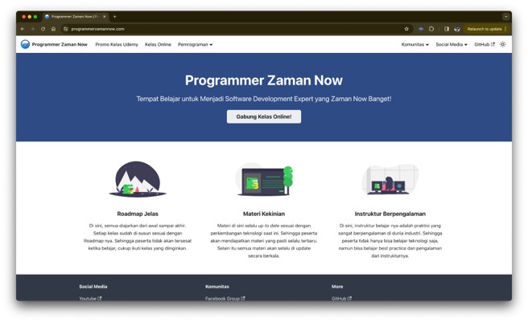
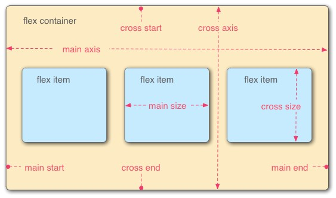
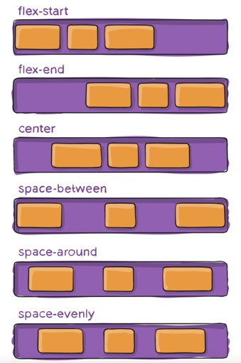
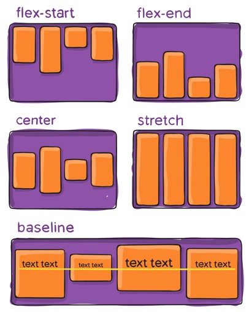
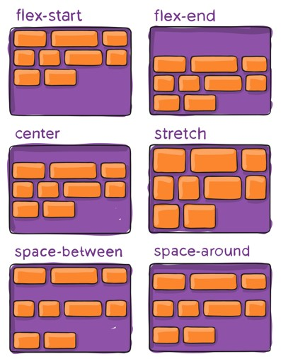
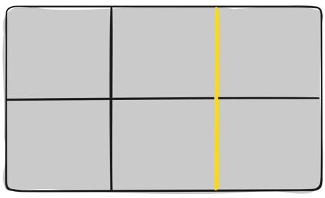
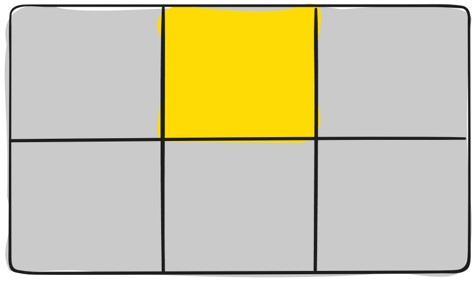
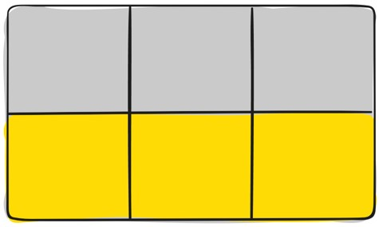
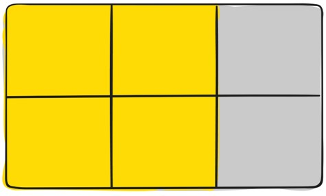

# CSS Layout

## Sebelum Belajar

- Kelas HTML dari Programmer Zaman Now
- Kelas CSS dari Programmer Zaman Now

## #1 Pengenalan CSS Layout

- Di materi CSS Dasar, kita sudah belajar bagaimana menambahkan gaya pada element-element di HTML
- Selain menambahkan gaya di element, CSS juga biasanya digunakan untuk membuat layout (tata letak) halaman web
- Hampir semua web di dunia, akan menggunakan CSS untuk melakukan layouting (tata letak) komponen-komponen HTML nya
- Salah satu tujuan melakukan tata letak adalah agar tampilan halaman web lebih menarik

### Jangan Gunakan Tabel untuk Layout

- Kadang mungkin ada beberapa pengembang web menggunakan Tabel untuk membuat tata letak, karena dianggap lebih mudah
- Namun, sangat tidak disarankan untuk menggunakan tabel, terutama pada kondisi layout yang sangat kompleks, maka akan sangat menyulitkan

## #2 Membuat Project

- Silahkan buat folder baru untuk menyimpan kode program belajar kita
- Misal nama foldernya `belajar-css-layout`
- Silahkan buka menggunakan Text Editor yang digunakan, misal Visual Studio Code

## #3 Normal Flow

- Normal Flow adalah bagaimana Web Browser menampilkan tata letak halaman HTML secara default, ketika kita tidak mengubah apapun pada tata letak nya
- Secara default, jika kita tidak menambahkan layout CSS sama sekali, maka Web Browser akan menampilkan halaman Web dalam Normal Flow
- Biasanya setiap Web Browser hampir memiliki Normal Flow yang sama

### Kode: Contoh

```html
<!doctype html>
<html>
	<head>
		<meta charset="utf-8" />
		<meta name="viewport" content="width=device-width, initial-scale=1" />
		<title>Normal Flow</title>
	</head>
	<body>
		<h1>Normal Flow</h1>

		<p>
			Lorem ipsum dolor sit amet, consectetur adipisicing elit, sed do eiusmod
			tempor incididunt ut labore et dolore magna aliqua. Ut enim ad minim
			veniam, quis nostrud exercitation ullamco laboris nisi ut aliquip ex ea
			commodo consequat. Duis aute irure dolor in reprehenderit in voluptate
			velit esse cillum dolore eu fugiat nulla pariatur. Excepteur sint occaecat
			cupidatat non proident, sunt in culpa qui officia deserunt mollit anim id
			est laborum.
		</p>

		<h2>Normal Flow</h2>

		<p>
			Lorem ipsum dolor sit amet, consectetur adipisicing elit, sed do eiusmod
			tempor incididunt ut labore et dolore magna aliqua. Ut enim ad minim
			veniam, quis nostrud exercitation ullamco laboris nisi ut aliquip ex ea
			commodo consequat. Duis aute irure dolor in reprehenderit in voluptate
			velit esse cillum dolore eu fugiat nulla pariatur. Excepteur sint occaecat
			cupidatat non proident, sunt in culpa qui officia deserunt mollit anim id
			est laborum.
		</p>
	</body>
</html>
```

### Urutan Komponen HTML

- Secara default, Web Browser akan menampilkan urutan sesuai dengan posisi kode HTML yang dibuat
- Walaupun kita tambahkan Style menggunakan CSS pada komponen HTML nya, tetap saja, urutan nya secara default akan mengikuti urutan sesuai kode HTML yang kita buat

### Kode: Normal Flow CSS

```css
body {
	width: 500px;
	margin: 0 auto;
}

p {
	background-color: aqua;
	border: 2px solid bule;
	padding: 10px;
	margin: 10px;
}
```

### Kenapa Tidak Cukup dengan Normal Flow?

- Untuk membuat halaman yang menarik, kadang butuh tata letak yang tidak bisa sesuai dengan Normal Flow
- Kadang kita butuh meletakkan beberapa posisi komponen ditempat yang kita inginkan, sehingga tidak bisa jika mengikuti aturan Normal Flow
- Contoh jika kita buka website <https://www.programmerzamannow.com>
- Maka kita bisa lihat bahwa tata letak komponen tidak ditampilkan secara Normal Flow

### Web Programmer Zaman Now



## #4 Display

- Sebelum kita belajar melakukan tata letak, kita perlu bahas ulang tentang Display
- Kita tahu bahwa komponen di HTML memiliki default display, ada yang block dan ada yang inline
- Sebenarnya, kita bisa mengubah nilai display untuk komponen HTML menggunakan atribut display di CSS
- <https://developer.mozilla.org/en-US/docs/Web/CSS/display>

### Nilai CSS Display

- `inline`, artinya komponen ditampilkan secara inline (hanya mengambil tempat secukupnya)
- `block`, artinya komponen ditampilkan secara block (mengambil tempat kiri ke kanan komponen diatasnya)
- `inline-block`, artinya komponen ditampilkan secara inline, tapi kita bisa mengubah tinggi dan lebar komponennya seperti layaknya block
- `none`, artinya komponen akan dihapus dan tidak ditampilkan

### Kode: Display HTML

```html
<!doctype html>
<html>
	<head>
		<meta charset="utf-8" />
		<meta name="viewport" content="width=device-width, initial-scale=1" />
		<title>Display HTML</title>
	</head>
	<body>
		<div class="content">
			<h1>Ini Konten 1</h1>
			<p>
				Lorem ipsum dolor sit amet, consectetur adipisicing elit, sed do eiusmod
				tempor incididunt ut labore et dolore magna aliqua.
			</p>
		</div>

		<div class="content">
			<h1>Ini Kontent 2</h1>
			<p>
				Lorem ipsum dolor sit amet, consectetur adipisicing elit, sed do eiusmod
				tempor incididunt ut labore et dolore magna aliqua.
			</p>
		</div>
	</body>
</html>
```

### Kode: Display CSS

```css
.content {
	vertical-align: top;
	display: inline-block;
	width: 200px;
	background-color: aqua;
	border: 2px solid blue;
	padding: 10px;
	margin: 10px;
}
```

## #5 Flexbox

- Flexbox Layout bertujuan untuk menyediakan cara yang lebih efisien untuk menata letak, menyelaraskan, dan mendistribusikan ruang antar item dalam wadah (container), bahkan ketika ukurannya tidak diketahui dan/atau dinamis (sehingga disebut “fleksibel”).
- Flexbox Layout paling sesuai untuk komponen aplikasi, dan tata letak skala kecil, sedangkan Grid Layout ditujukan untuk tata letak skala besar.
- Grid Layout akan dibahas di materi tersendiri

### Diagram Flexbox



### Flex Container

- Untuk membuat Flex Container, kita bisa menggunakan display value flex
- Semua child element yang terdapat di dalam Flex Container, maka kita sebut sebagai Flex Item

### Kode: Flexbox

```css
.container {
	display: flex;
}

.content {
	background-color: aquamarine;
	border: 2px solid blue;
	padding: 10px;
	margin: 10px;
}
```

```html
<div class="container">
	<div class="content">
		<h1>Ini Konten 1</h1>
		<p>
			Lorem ipsum dolor sit amet, consectetur adipisicing elit, sed do eiusmod
			tempor incididunt ut labore et dolore magna aliqua.
		</p>
	</div>

	<div class="content">
		<h1>Ini Kontent 2</h1>
		<p>
			Lorem ipsum dolor sit amet, consectetur adipisicing elit, sed do eiusmod
			tempor incididunt ut labore et dolore magna aliqua.
		</p>
	</div>

	<div class="content">
		<h1>Ini Kontent 3</h1>
		<p>
			Lorem ipsum dolor sit amet, consectetur adipisicing elit, sed do eiusmod
			tempor incididunt ut labore et dolore magna aliqua.
		</p>
	</div>
</div>
```

### Flex Direction

- Secara default, Flex Item akan ditampilkan dengan arah dari kiri ke kanan, kita bisa mengubah dengan atribut `flex-direction` :
- <https://developer.mozilla.org/en-US/docs/Web/CSS/flex-direction>

### Kode: Flex Direction

```css
.container {
	display: flex;
	flex-direction: row-reverse;
}
.content {
	background-color: aqua;
	border: 2px solud blue;
	margin: 10px;
	padding: 10px;
}
```

### Flex Wrap

- Secara default, Flex Item akan ditampilkan dalam satu garis, baik itu vertical (row) atau horizontal (column)
- Namun jika kita ingin Flex Item di wrap pada garis berbeda ketika dibutuhkan, maka kita bisa gunakan atribut `flex-wrap`
- <https://developer.mozilla.org/en-US/docs/Web/CSS/flex-wrap>

### Kode: Flex Wrap

```css
.container {
	display: flex;
	flex-direction: row;
	flex-wrap: wrap;
}
.content {
	width: 200px;
	background-color: aqua;
	border: 2px solud blue;
	margin: 10px;
	padding: 10px;
}
```

## #6 Flex Items

- Komponen yang terdapat di dalam Flex Container, kita sebut dengan nama Flex Item
- Selain melakukan pengaturan ke Flex Container, kita juga bisa melakukan pengaturan ke Flex Item

### Order

- Secara default urutan Flex Item akan ditampilkan sesuai dengan urutan kode HTML yang dibuat
- Namun, jika kita ingin mengubah urutan ditampilkannya, kita bisa menggunakan atribut order
- <https://developer.mozilla.org/en-US/docs/Web/CSS/order>

### Kode: Flex Item Order

```html
<div class="container">
	<div class="content" style="order: 2;">
		<h1>Ini Konten 1</h1>
		<p>
			Lorem ipsum dolor sit amet, consectetur adipisicing elit, sed do eiusmod
			tempor incididunt ut labore et dolore magna aliqua.
		</p>
	</div>
	<div class="content" style="order: 3;">
		<h1>Ini Konten 2</h1>
		<p>
			Lorem ipsum dolor sit amet, consectetur adipisicing elit, sed do eiusmod
			tempor incididunt ut labore et dolore magna aliqua.
		</p>
	</div>
	<div class="content" style="order: 1;">
		<h1>Ini Konten 3</h1>
		<p>
			Lorem ipsum dolor sit amet, consectetur adipisicing elit, sed do eiusmod
			tempor incididunt ut labore et dolore magna aliqua.
		</p>
	</div>
</div>
```

### Flex Grow

- Atribut `flex-grow` mendefinisikan kemampuan item fleksibel untuk berkembang jika diperlukan.
- Atribut `flex-grow` menerima nilai yang berfungsi sebagai proporsi dari total.
- Ini menentukan jumlah ruang yang tersedia di dalam wadah fleksibel yang harus digunakan oleh item tersebut.
- Misal kita punya 5 Flex Item, dimana total dari 5 Flex Item tersebut memiliki jumlah `flex-grow` 20, artinya per 1 grow adalah 100% / 20 = 5%
- Sehingga Flex Item yang memiliki nilai flex-grow 2 artinya memiliki ruang sebesar 10%
- <https://developer.mozilla.org/en-US/docs/Web/CSS/flex-grow>

### Kode: Flex Grow

```css
.container {
	display: flex;
	flex-direction: row;
}
.content {
	background-color: aqua;
	border: 2px solid blue;
	padding: 10px;
	margin: 10px;
}
.small {
	flex-grow: 1;
}
.large {
	flex-grow: 2;
}
```

```html
<body>
	<div class="container">
		<div class="content small">A</div>
		<div class="content large">B</div>
		<div class="content small">C</div>
		<div class="content large">D</div>
		<div class="content small">E</div>
	</div>
</body>
```

### Flex Shrink

- Jika `flex-grow` merupakan kemampuan untuk Flex Item untuk berkembang, maka atribut `flex-shrink` untuk menyusut ketika dibutuhkan
- Biasanya kemampuan untuk menyusut dibutuhkan ketika memang ukuran halaman tidak cukup, dan kita bisa mengatur nilai factor dari penyusutannya antar Flex Item, sama seperti `flex-grow`
- <https://developer.mozilla.org/en-US/docs/Web/CSS/flex-shrink>

### Kode: Flex Shrink

```css
.container {
	display: flex;
}
.content {
	background-color: aqua;
	border: 2px solid blue;
	padding: 10px;
	margin: 10px;
}
.content1 {
	flex-shrink: 1;
}
.content2 {
	flex-shrink: 2;
}
.content3 {
	flex-shrink: 1;
}
```

```html
<body>
	<div class="container">
		<div class="content content1">
			Lorem ipsum dolor sit amet, consectetur adipisicing elit, sed do eiusmod
			tempor incididunt ut labore et dolore magna aliqua.
		</div>
		<div class="content content2">
			Lorem ipsum dolor sit amet, consectetur adipisicing elit, sed do eiusmod
			tempor incididunt ut labore et dolore magna aliqua.
		</div>
		<div class="content content3">
			Lorem ipsum dolor sit amet, consectetur adipisicing elit, sed do eiusmod
			tempor incididunt ut labore et dolore magna aliqua.
		</div>
	</div>
</body>
```

### Flex Basis

- Atribut `flex-basis` digunakan untuk membuat Flex Item mengambil ruang sebesar yang ditentukan, atau jika ruangan tidak tersedia, ambil semampunya
- Jika kita menggunakan `flex-shrink : 0`, maka akan dipastikan bahwa Flex Item akan mengambil sejumlah `flex-basis`, walaupun ukuran layar tidak mencukupi
- <https://developer.mozilla.org/en-US/docs/Web/CSS/flex-basis>

### Kode: Flex Basis

```css
.container {
	display: flex;
}
.content {
	background-color: aqua;
	border: 2px solid blue;
	padding: 10px;
	margin: 10px;
}
.content1 {
	flex-basis: 300px;
	flex-shrink: 0;
}
```

```html
<body>
	<div class="container">
		<div class="content content1">
			Lorem ipsum dolor sit amet, consectetur adipisicing elit, sed do eiusmod
			tempor incididunt ut labore et dolore magna aliqua.
		</div>
		<div class="content content2">
			Lorem ipsum dolor sit amet, consectetur adipisicing elit, sed do eiusmod
			tempor incididunt ut labore et dolore magna aliqua.
		</div>
		<div class="content content3">
			Lorem ipsum dolor sit amet, consectetur adipisicing elit, sed do eiusmod
			tempor incididunt ut labore et dolore magna aliqua.
		</div>
	</div>
</body>
```

## #7 Flex Alignment

- Flex Item yang terdapat di dalam Flex Container, bisa kita rapikan atau selaraskan dengan beberapa atribut

### Justify Content

- Saat kita menggunakan Flexbox, kita bisa menggunakan atribut `justify-content` menentukan bagaimana Web Browser menentukan jarak antar Flex Item
  Ada banyak nilai yang bisa kita gunakan dalam `justify-content`, seperti yang terlihat di gambar
- <https://developer.mozilla.org/en-US/docs/Web/CSS/justify-content>



### Kode: Justify Content

```css
.container {
	background-color: yellow;
	height: 500px;
	display: flex;
	justify-content: center;
}
.content {
	background-color: aqua;
	border: 1px solid blue;
	padding: 10px;
	margin: 10px;
	width: 200px;
	height: auto;
}
```

```html
<div class="container">
	<div class="content">
		<h1>Content 1</h1>
		<p>
			Lorem ipsum dolor sit amet, consectetur adipisicing elit, sed do eiusmod
			tempor incididunt ut labore et dolore magna aliqua.
		</p>
	</div>
	<div class="content">
		<h1>Content 2</h1>
		<p>
			Lorem ipsum dolor sit amet, consectetur adipisicing elit, sed do eiusmod
			tempor incididunt ut labore et dolore magna aliqua.
		</p>
	</div>
	<div class="content">
		<h1>Content 3</h1>
		<p>
			Lorem ipsum dolor sit amet, consectetur adipisicing elit, sed do eiusmod
			tempor incididunt ut labore et dolore magna aliqua.
		</p>
	</div>
</div>
```

### Align Items

- Atribut `align-items` bisa digunakan untuk perataan Flex Item secara cross-axis
- <https://developer.mozilla.org/en-US/docs/Web/CSS/align-items>



### Kode: Flex Align Items

```css
.container {
	background-color: yellow;
	height: 500px;
	display: flex;
	align-items: flex-end;
}
.content {
	background-color: aqua;
	border: 1px solid blue;
	padding: 10px;
	margin: 10px;
	width: 200px;
	height: auto;
}
```

```html
<div class="container">
	<div class="content">
		<h1>Content 1</h1>
		<p>
			Lorem ipsum dolor sit amet, consectetur adipisicing elit, sed do eiusmod
			tempor incididunt ut labore et dolore magna aliqua.
		</p>
	</div>
	<div class="content">
		<h1>Content 2</h1>
		<p>
			Lorem ipsum dolor sit amet, consectetur adipisicing elit, sed do eiusmod
			tempor incididunt ut labore et dolore magna aliqua.
		</p>
	</div>
	<div class="content">
		<h1>Content 3</h1>
		<p>
			Lorem ipsum dolor sit amet, consectetur adipisicing elit, sed do eiusmod
			tempor incididunt ut labore et dolore magna aliqua.
		</p>
	</div>
</div>
```

### Align Content

- Atribut `align-content` digunakan agar menyelaraskan Flex Item seperti justify-content
- Namun pada `align-content`, ini hanya bisa dilakukan jika menggunakan `flex-wrap `dengan nilai wrap atau `wrap-reverse`
- <https://developer.mozilla.org/en-US/docs/Web/CSS/align-content>



### Kode: Align Content

```css
.container {
	background-color: yellow;
	height: 1000px;
	display: flex;
	flex-wrap: wrap;
	align-items: flex-start;
}
.content {
	background-color: aqua;
	border: 1px solid blue;
	padding: 10px;
	margin: 10px;
	width: 200px;
	height: auto;
}
```

```html
<div class="container">
	<div class="content">
		<h1>Content 1</h1>
		<p>
			Lorem ipsum dolor sit amet, consectetur adipisicing elit, sed do eiusmod
			tempor incididunt ut labore et dolore magna aliqua.
		</p>
	</div>
	<div class="content">
		<h1>Content 2</h1>
		<p>
			Lorem ipsum dolor sit amet, consectetur adipisicing elit, sed do eiusmod
			tempor incididunt ut labore et dolore magna aliqua.
		</p>
	</div>
	<div class="content">
		<h1>Content 3</h1>
		<p>
			Lorem ipsum dolor sit amet, consectetur adipisicing elit, sed do eiusmod
			tempor incididunt ut labore et dolore magna aliqua.
		</p>
	</div>
	<div class="content">
		<h1>Content 4</h1>
		<p>
			Lorem ipsum dolor sit amet, consectetur adipisicing elit, sed do eiusmod
			tempor incididunt ut labore et dolore magna aliqua.
		</p>
	</div>
	<div class="content">
		<h1>Content 5</h1>
		<p>
			Lorem ipsum dolor sit amet, consectetur adipisicing elit, sed do eiusmod
			tempor incididunt ut labore et dolore magna aliqua.
		</p>
	</div>
</div>
```

### Gap

- Sebelumnya, untuk menambahkan gap (jarak) antar Flex Item, kita biasanya menggunakan `margin`
- Saat menggunakan Flexbox, lebih baik gunakan Gap untuk menentukan jarak dalam row (baris) atau column (kolom)
- <https://developer.mozilla.org/en-US/docs/Web/CSS/ga>
- <https://developer.mozilla.org/en-US/docs/Web/CSS/row-ga>
- <https://developer.mozilla.org/en-US/docs/Web/CSS/column-gap>

### Kode: Flex Gap

```css
.container {
	background-color: yellow;
	height: 1000px;
	display: flex;
	flex-wrap: wrap;
	/*	gap: 10px 20px;*/
	row-gap: 10px;
	column-gap: 20px;
	padding: 20px;
}
.content {
	background-color: aqua;
	border: 1px solid blue;
	padding: 10px;
	width: 200px;
}
```

```html
<div class="container">
	<div class="content">
		<h1>Content 1</h1>
		<p>
			Lorem ipsum dolor sit amet, consectetur adipisicing elit, sed do eiusmod
			tempor incididunt ut labore et dolore magna aliqua.
		</p>
	</div>
	<div class="content">
		<h1>Content 2</h1>
		<p>
			Lorem ipsum dolor sit amet, consectetur adipisicing elit, sed do eiusmod
			tempor incididunt ut labore et dolore magna aliqua.
		</p>
	</div>
	<div class="content">
		<h1>Content 3</h1>
		<p>
			Lorem ipsum dolor sit amet, consectetur adipisicing elit, sed do eiusmod
			tempor incididunt ut labore et dolore magna aliqua.
		</p>
	</div>
	<div class="content">
		<h1>Content 4</h1>
		<p>
			Lorem ipsum dolor sit amet, consectetur adipisicing elit, sed do eiusmod
			tempor incididunt ut labore et dolore magna aliqua.
		</p>
	</div>
	<div class="content">
		<h1>Content 5</h1>
		<p>
			Lorem ipsum dolor sit amet, consectetur adipisicing elit, sed do eiusmod
			tempor incididunt ut labore et dolore magna aliqua.
		</p>
	</div>
</div>
```

## #8 Grids

- Grid Layout adalah sistem tata letak berbasis grid dua dimensi
- Flexbox adalah Layout yang bagus, tapi hanya satu arah, dan cocok pada kasus tertentu
- Grid Layout adalah fitur CSS yang dibuat untuk mengatasi permasalahan tata letak yang kompleks

### Grid Container

- Untuk membuat Grid Container, kita bisa menggunakan atribut display dengan nilai grid
- Tidak seperti Flexbox, saat menggunakan Grid Container, secara default akan terdapat satu kolom, sehingga tampilan awal mungkin tidak akan berbeda dengan Normal Flow

### Kode: Grid

```css
.container {
	display: grid;
}
.content {
	background-color: aqua;
	border: 1px solid blue;
	padding: 10px;
	margin: 10px;
}
```

```html
<div class="container">
	<div class="content">
		<h1>Content 1</h1>
		<p>
			Lorem ipsum dolor sit amet, consectetur adipisicing elit, sed do eiusmod
			tempor incididunt ut labore et dolore magna aliqua.
		</p>
	</div>
	<div class="content">
		<h1>Content 2</h1>
		<p>
			Lorem ipsum dolor sit amet, consectetur adipisicing elit, sed do eiusmod
			tempor incididunt ut labore et dolore magna aliqua.
		</p>
	</div>
	<div class="content">
		<h1>Content 3</h1>
		<p>
			Lorem ipsum dolor sit amet, consectetur adipisicing elit, sed do eiusmod
			tempor incididunt ut labore et dolore magna aliqua.
		</p>
	</div>
	<div class="content">
		<h1>Content 4</h1>
		<p>
			Lorem ipsum dolor sit amet, consectetur adipisicing elit, sed do eiusmod
			tempor incididunt ut labore et dolore magna aliqua.
		</p>
	</div>
	<div class="content">
		<h1>Content 5</h1>
		<p>
			Lorem ipsum dolor sit amet, consectetur adipisicing elit, sed do eiusmod
			tempor incididunt ut labore et dolore magna aliqua.
		</p>
	</div>
</div>
```

## #9 Grid Terminology

- Sebelum kita lanjut tentang Grid Container, kita akan bahas dulu tentang Grid Terminology, agar tidak bingung di materi selanjutnya
- Seperti yang sudah kita tahu, bentuk dari Grid itu mirip seperti tabel

### Grid Container

- Komponent yang menggunakan `display: grid`, kita sebut dengan Grid Container

### Grid Item

- Komponen Children dari Grid Container kita sebut dengan nama Grid Item

### Grid Line

- Garis pemisah dalam grid baik itu yang vertical atau horizontal, kita sebut dengan Grid Line



### Grid Cell

- Area yang terdapat didalam kolom dan baris yang dipisah oleh Grid Line, kita sebut dengan Grid Cell



### Grid Track

- Bagian antara dua Grid Line, atau bisa dibilang baris, kita sebut dengan Grid Track



### Grid Area

- Total area dari beberapa Grid Cell, kita sebut dengan Grid Area



## #10 Grid Templates

- Untuk menentukan kolom dan baris dalam Grid, kita bisa menggunakan Grid Template
- Atribut `grid-template-columns` digunakan untuk menentukan kolom
- <https://developer.mozilla.org/en-US/docs/Web/CSS/grid-template-columns>
- Atribut `grid-template-rows` digunakan untuk menentukan baris
- <https://developer.mozilla.org/en-US/docs/Web/CSS/grid-template-rows>

### Kode: Grid Template

```css
.container {
	display: grid;
	grid-template-columns: 200px auto 200px;
	grid-template-rows: 500px auto;
}
.content {
	background-color: aqua;
	border: 1px solid blue;
	padding: 10px;
	margin: 10px;
}
```

```html
<div class="container">
	<div class="content">
		<h1>Content 1</h1>
		<p>
			Lorem ipsum dolor sit amet, consectetur adipisicing elit, sed do eiusmod
			tempor incididunt ut labore et dolore magna aliqua.
		</p>
	</div>
	<div class="content">
		<h1>Content 2</h1>
		<p>
			Lorem ipsum dolor sit amet, consectetur adipisicing elit, sed do eiusmod
			tempor incididunt ut labore et dolore magna aliqua.
		</p>
	</div>
	<div class="content">
		<h1>Content 3</h1>
		<p>
			Lorem ipsum dolor sit amet, consectetur adipisicing elit, sed do eiusmod
			tempor incididunt ut labore et dolore magna aliqua.
		</p>
	</div>
	<div class="content">
		<h1>Content 4</h1>
		<p>
			Lorem ipsum dolor sit amet, consectetur adipisicing elit, sed do eiusmod
			tempor incididunt ut labore et dolore magna aliqua.
		</p>
	</div>
	<div class="content">
		<h1>Content 5</h1>
		<p>
			Lorem ipsum dolor sit amet, consectetur adipisicing elit, sed do eiusmod
			tempor incididunt ut labore et dolore magna aliqua.
		</p>
	</div>
</div>
```

## #11 Grid Items

- Komponen Children langsung dari Grid Container kita sebut dengan Grid Item
- Ada banyak hal yang bisa kita lakukan di Grid Item, seperti memilih kolom, baris atau area

### Grid Item Start dan End

- Grid Item bisa ditentukan mau mulai dari kolom atau baris berapa
- Bahkan, untuk mempermudah, ketika membuat row template dan column template, kita bisa memberi nama sehingga mudah digunakan
- <https://developer.mozilla.org/en-US/docs/Web/CSS/grid-column-star>
- <https://developer.mozilla.org/en-US/docs/Web/CSS/grid-column-en>
- <https://developer.mozilla.org/en-US/docs/Web/CSS/grid-row-start>
- <https://developer.mozilla.org/en-US/docs/Web/CSS/grid-row-end>

### Grid Line Name

- Sebelum kita praktek tentang Grid Start dan End, kadang ada baiknya kita membuat nama untuk Grid Line saat membuat Grid Template
- Kita bisa buat Grid Line dengan menggunakan `[namaline]`

### Kode: Grid Line Name

```css
.container {
	display: grid;
	grid-template-columns: [cline1] 100px [cline2] auto [cline3] 100px [cline4];
	grid-template-rows: [cline1] 50px [cline2] auto [cline3] 100px [cline4];
}
```

### Kode: Grid Item Start dan End

```css
.header {
	background-color: aqua;
	grid-column-start: cline1;
	grid-column-end: cline4;
	grid-tow-start: cline1;
	grid-tow-end: cline1;
}
.content {
	background-color: bisque;
	grid-area: content;
	grid-column-start: cline2;
	grid-column-end: cline3;
	grid-tow-start: cline2;
	grid-tow-end: cline3;
}
.footer {
	background-color: aqua;
	grid-column-start: cline1;
	grid-column-end: cline4;
	grid-tow-start: cline3;
	grid-tow-end: cline4;
}
```

```html
<div class="container">
	<div class="header">Selamat Datang di web Programmer Zaman Now</div>
	<div class="content">
		<h1>Programmer Zaman Now</h1>
		<p>
			Lorem ipsum dolor sit amet, consectetur adipisicing elit, sed do eiusmod
			tempor incididunt ut labore et dolore magna aliqua.
		</p>
		<p>
			Lorem ipsum dolor sit amet, consectetur adipisicing elit, sed do eiusmod
			tempor incididunt ut labore et dolore magna aliqua.
		</p>
	</div>
	<div class="footer">Develop with Love by Programmer Zaman Now</div>
</div>
```

### Grid Area

- Saat kita membuat Grid, kita bisa membuat Grid Area dengan menentukan nama dari Grid Area tersebut
- Untuk membuat Grid Area, kita bisa menggunakan atribut `grid-template-areas`
- <https://developer.mozilla.org/en-US/docs/Web/CSS/grid-template-areas>
- Dan untuk menentukan Grid Item muncul di area mana, kita bisa gunakan atribut grid-area
- <https://developer.mozilla.org/en-US/docs/Web/CSS/grid-area>
- Penggunaan Grid Area lebih mudah dibanding Grid Item Start dan End

### Kode: Grid Template Area

```css
.container {
	display: grid;
	grid-template-columns: 100px auto 100px;
	grid-template-rows: 50px auto 100px;
	grid-template-areas:
		"header header header"
		". content ."
		"footer footer footer";
}
.header {
	background-color: aqua;
	grid-area: header;
}
.content {
	background-color: bisque;
	grid-area: content;
}
.footer {
	background-color: aqua;
	grid-area: footer;
}
```

```html
<div class="container">
	<div class="header">Selamat Datang di web Programmer Zaman Now</div>
	<div class="content">
		<h1>Programmer Zaman Now</h1>
		<p>
			Lorem ipsum dolor sit amet, consectetur adipisicing elit, sed do eiusmod
			tempor incididunt ut labore et dolore magna aliqua.
		</p>
		<p>
			Lorem ipsum dolor sit amet, consectetur adipisicing elit, sed do eiusmod
			tempor incididunt ut labore et dolore magna aliqua.
		</p>
	</div>
	<div class="footer">Develop with Love by Programmer Zaman Now</div>
</div>
```

## #12 Grid Alignment

- Grid juga sama seperti Flexbox, kita bisa lakukan penyelarasan seperti layaknya di Flexbox
- Salah satu perbedaanya, dalam Grid, kita bisa melakukan penyelarasan Seluruh Grid Cell, atau hanya untuk satu Grid Cell saja

### Justify Content

- Saat kita menggunakan Grid, kita bisa menggunakan atribut `justify-content` menentukan bagaimana Web Browser menentukan jarak antar Grid Column
- Ada banyak nilai yang bisa kita gunakan dalam `justify-content`, seperti yang terlihat di gambar
- <https://developer.mozilla.org/en-US/docs/Web/CSS/justify-content>

### Kode: Grid Justify Content

```css
.container {
	display: grid;
	grid-template-columns: 100px 100px 100px;
	grid-template-rows: 100px 100px 100px;
	justify-content: space-evenly;
}
.content {
	background-color: bisque;
	border: 1px solid black;
	padding: 10px;
	text-align: center;
}
```

```html
<div class="container">
	<div class="content">1</div>
	<div class="content">2</div>
	<div class="content">3</div>
	<div class="content">4</div>
	<div class="content">5</div>
	<div class="content">6</div>
	<div class="content">7</div>
	<div class="content">8</div>
	<div class="content">9</div>
</div>
```

### Align Content

- Atribut `align-content` digunakan agar menyelaraskan Grid Row seperti `justify-content`
- <https://developer.mozilla.org/en-US/docs/Web/CSS/align-content>

### Kode: Grid Align Content

```css
.container {
	background-color: aqua;
	height: 500px;
	display: grid;
	grid-template-columns: 100px 100px 100px;
	grid-template-rows: 100px 100px 100px;
	align-content: space-evenly;
}
.content {
	background-color: bisque;
	border: 1px solid black;
	padding: 10px;
	text-align: center;
}
```

```html
<div class="container">
	<div class="content">1</div>
	<div class="content">2</div>
	<div class="content">3</div>
	<div class="content">4</div>
	<div class="content">5</div>
	<div class="content">6</div>
	<div class="content">7</div>
	<div class="content">8</div>
	<div class="content">9</div>
</div>
```

### Justify Items

- Justify Content akan melakukan penyelarasan seluruh Grid Item beserta Grid Line, namun pada Justify Items, penyelasan hanya dilakukan di level Grid Item di dalam Grid Cell, tanpa mengubah posisi Grid Line
- <https://developer.mozilla.org/en-US/docs/Web/CSS/justify-items>

### Kode: Grid Justify Items

```css
.container {
	background-color: aqua;
	height: 500px;
	display: grid;
	grid-template-columns: 100px 100px 100px;
	grid-template-rows: 100px 100px 100px;
	justify-content: center;
}
.content {
	background-color: bisque;
	border: 1px solid black;
	padding: 10px;
	text-align: center;
}
```

```html
<div class="container">
	<div class="content">1</div>
	<div class="content">2</div>
	<div class="content">3</div>
	<div class="content">4</div>
	<div class="content">5</div>
	<div class="content">6</div>
	<div class="content">7</div>
	<div class="content">8</div>
	<div class="content">9</div>
</div>
```

### Align Items

- Align Items akan melakukan penyelarasan di level Grid Cell
- <https://developer.mozilla.org/en-US/docs/Web/CSS/align-items>

### Kode: Grid Align Items

```css
.container {
	background-color: aqua;
	height: 500px;
	display: grid;
	grid-template-columns: 100px 100px 100px;
	grid-template-rows: 100px 100px 100px;
	align-items: center;
}
.content {
	background-color: bisque;
	border: 1px solid black;
	padding: 10px;
	text-align: center;
}
```

```html
<div class="container">
	<div class="content">1</div>
	<div class="content">2</div>
	<div class="content">3</div>
	<div class="content">4</div>
	<div class="content">5</div>
	<div class="content">6</div>
	<div class="content">7</div>
	<div class="content">8</div>
	<div class="content">9</div>
</div>
```

### Justify dan Align Self

- Sebelumnya untuk Justify Content / Items dan Align Content / Items, akan berdampak ke semua Grid Item
- Namun jika kita ingin membuat Justify dan Align hanya untuk salah satu Grid Item, kita bisa menggunakan Justify dan Align Self
- <https://developer.mozilla.org/en-US/docs/Web/CSS/justify-self>
- <https://developer.mozilla.org/en-US/docs/Web/CSS/align-self>

### Kode: Justify dan Align Self

```css
.container {
	background-color: aqua;
	height: 500px;
	display: grid;
	grid-template-columns: 100px 100px 100px;
	grid-template-rows: 100px 100px 100px;
}
.content {
	background-color: bisque;
	border: 1px solid black;
	padding: 10px;
	text-align: center;
}
.content1 {
	justify-self: center;
	align-self: center;
}
```

```html
<div class="container">
	<div class="content content1">1</div>
	<div class="content">2</div>
	<div class="content">3</div>
	<div class="content">4</div>
	<div class="content">5</div>
	<div class="content">6</div>
	<div class="content">7</div>
	<div class="content">8</div>
	<div class="content">9</div>
</div>
```

### Gap

- Gap, selain digunakan di Flexbox, juga bisa digunakan di Grid
- Tujuannya juga sama, untuk menambah jarak antar Grid Cell
- <https://developer.mozilla.org/en-US/docs/Web/CSS/gap>
- <https://developer.mozilla.org/en-US/docs/Web/CSS/row-gap>
- <https://developer.mozilla.org/en-US/docs/Web/CSS/column-gap>

### Kode: Grid Gap

```css
.container {
	background-color: aqua;
	height: 500px;
	display: grid;
	grid-template-columns: 100px 100px 100px;
	grid-template-rows: 100px 100px 100px;
	row-gap: 10px;
	column-gap: 10px;
}
.content {
	background-color: bisque;
	border: 1px solid black;
	padding: 10px;
	text-align: center;
}
```

```html
<div class="container">
	<div class="content content1">1</div>
	<div class="content">2</div>
	<div class="content">3</div>
	<div class="content">4</div>
	<div class="content">5</div>
	<div class="content">6</div>
	<div class="content">7</div>
	<div class="content">8</div>
	<div class="content">9</div>
</div>
```

## #13 Subgrid

- Saat kita membuat tata letak yang sangat kompleks, kadang kita sering menjadikan Grid Item menjadi Grid Container lagi
- Pada kasus tertentu, walaupun Grid Item tersebut merupakan Grid Container, namun kadang kita ingin aturan row dan column nya ingin mengikuti aturan Grid Container yang ada diatasnya
- Pada kasus seperti ini, kita bisa menggunakan Subgrid

### Kode: Grid di dalam Grid

```css
.container {
	background-color: aqua;
	height: 500px;
	width: 500px;
	display: grid;
	grid-template-columns: 100px 100px 100px 100px 100px;
	grid-template-rows: 100px 100px 100px 100px 100px;
}
.content1 {
	display: grid;
	grid-column: 2 / 5;
	grid-row: 2 / 5;
	background-color: bisque;
	border: 1px solid black;
	grid-template-columns: 100px 100px 100px;
	grid-template-rows: 100px 100px 100px;
}
.inner {
	background-color: brown;
	border: 1px solid black;
	grid-column: 2 / 4;
	grid-row: 2 / 4;
}
```

```html
<div class="container">
	<div class="content1">
		<div class="inner"></div>
	</div>
</div>
```

### Kode: Subgrid

```css
.container {
	background-color: aqua;
	height: 500px;
	width: 500px;
	display: grid;
	grid-template-columns: 100px 100px 100px 100px 100px;
	grid-template-rows: 100px 100px 100px 100px 100px;
}
.content1 {
	display: grid;
	grid-column: 2 / 5;
	grid-row: 2 / 5;
	background-color: bisque;
	border: 1px solid black;
	grid-template-columns: subgrid;
	grid-template-rows: subgrid;
}
.inner {
	background-color: brown;
	border: 1px solid black;
	grid-column: 2 / 4;
	grid-row: 2 / 4;
}
```

```html
<div class="container">
	<div class="content1">
		<div class="inner"></div>
	</div>
</div>
```

## #14 Multiple Column

- Multiple column layout adalah cara untuk membuat tata letak seperti kolom dalam koran
- Cara untuk membuat column adalah dengan menggunakan attribute `column-count`
- <https://developer.mozilla.org/en-US/docs/Web/CSS/column-count>
- Atau jika kita ingin menentukan lebar kolom, tanpa peduli jumlah kolom yang akan dibuat, kita bisa gunakan atribut `column-width`
- <https://developer.mozilla.org/en-US/docs/Web/CSS/column-width>

### Kode: Multiple Column

```html
<style>
	.container {
		column-width: 200px;
	}
</style>
<body>
	<div class="container">
		<h1>Judul Artikel</h1>
		<p>
			Lorem ipsum dolor sit amet, consectetur adipisicing elit, sed do eiusmod
			tempor incididunt ut labore et dolore magna aliqua.
		</p>
		<p>
			Lorem ipsum dolor sit amet, consectetur adipisicing elit, sed do eiusmod
			tempor incididunt ut labore et dolore magna aliqua.
		</p>
		<p>
			Lorem ipsum dolor sit amet, consectetur adipisicing elit, sed do eiusmod
			tempor incididunt ut labore et dolore magna aliqua.
		</p>
	</div>
</body>
```

### Column Style

- Kita juga bisa mengubah Style untuk Column
- Atribut `column-gap` untuk mengatur jarak Column
- <https://developer.mozilla.org/en-US/docs/Web/CSS/column-gap>
- Atribut `column-rule` untuk mengatur border dari Column
- <https://developer.mozilla.org/en-US/docs/Web/CSS/column-rule>

### Kode: Column Style

```html
<style>
	.container {
		column-width: 200px;
		column-gap: 20px;
		column-rule: 1px solid black;
	}
</style>
<body>
	<div class="container">
		<h1>Judul Artikel</h1>
		<p>
			Lorem ipsum dolor sit amet, consectetur adipisicing elit, sed do eiusmod
			tempor incididunt ut labore et dolore magna aliqua.
		</p>
		<p>
			Lorem ipsum dolor sit amet, consectetur adipisicing elit, sed do eiusmod
			tempor incididunt ut labore et dolore magna aliqua.
		</p>
		<p>
			Lorem ipsum dolor sit amet, consectetur adipisicing elit, sed do eiusmod
			tempor incididunt ut labore et dolore magna aliqua.
		</p>
	</div>
</body>
```

## #15 Float

- CSS memiliki atribut `float`, yang sebelum ada Flexbox dan Grid, dulu Float biasanya digunakan untuk membuat Layout
- Atribut float digunakan untuk memposisikan elemen pada web, sekarang biasanya digunakan untuk gambar
- <https://developer.mozilla.org/en-US/docs/Web/CSS/float>

### Kode: Float

```css
.container {
	background-color: aqua;
}
.image {
	float: right;
	width: 200px;
	height: 200px;
	background-color: pink;
	text-align: center;
}
```

```html
<div class="container">
	<h1>Judul Artikel</h1>
	<p>
		Lorem ipsum dolor sit amet, consectetur adipisicing elit, sed do eiusmod
		tempor incididunt ut labore et dolore magna aliqua.
	</p>
	<p>
		Lorem ipsum dolor sit amet, consectetur adipisicing elit, sed do eiusmod
		tempor incididunt ut labore et dolore magna aliqua.
	</p>
	<p>
		Lorem ipsum dolor sit amet, consectetur adipisicing elit, sed do eiusmod
		tempor incididunt ut labore et dolore magna aliqua.
	</p>
</div>
```

## #16 Positioning

- Positioning memungkinkan kita meletakkan posisi elemen di tempat yang tidak sesuai dengan Normal Flow
- Misal meletakkan elemen di atas elemen lain, atau meletakkan elemen di posisi yang selalu sama di Viewport browser
- Untuk mengubah posisi elemen, kita bisa menggunakan atribut `position`
- <https://developer.mozilla.org/en-US/docs/Web/CSS/position>
- Secara default, position bernilai static, artinya dia akan ditempatkan sesuai dengan Normal Flow

### Top, Bottom, Left dan Right

- Jika kita ubah atribut position dari default value-nya, kita bisa mengatur elemen menggunakan atribut `top`, `bottom`, `left` dan `right`
- <https://developer.mozilla.org/en-US/docs/Web/CSS/top>
- <https://developer.mozilla.org/en-US/docs/Web/CSS/bottom>
- <https://developer.mozilla.org/en-US/docs/Web/CSS/left>
- <https://developer.mozilla.org/en-US/docs/Web/CSS/right>

### Relative Positioning

- Relative positioning adalah posisi mirip seperti static positioning, dimana element akan ditempatkan sesuai Normal Flow.
- Namun setelah ditempatkan, kita bisa mengubah posisi elemen.
- Pada static positioning, mengubah posisi tidak akan berdampak apapun

### Kode: Relative Positioning

```css
.content {
	background-color: aqua;
	width: 200px;
	height: 200px;
	display: inline-block;
}
.content2 {
	background-color: pink;
	position: relative;
	top: 20px;
	left: 20px;
}
```

```html
<div class="content content1">
	<h1>Content 1</h1>
</div>
<div class="content content2">
	<h1>Content 2</h1>
</div>
<div class="content content3">
	<h1>Content 3</h1>
</div>
```

### Absolute Positioning

- Absolute positioning adalah menghapus elemen dari Normal Flow, bahkan tidak ada space yang digunakan sama sekali
- Posisi awal untuk elemen absolute adalah relative ke posisi terdekat dengan elemen sebelumnya, atau jika tidak ada, berarti di awal block element parent nya
- Jika elemen absolute tidak memiliki parent, maka parent nya adalah html

### Kode: Absolute

```css
.content {
	background-color: aqua;
	width: 200px;
	height: 200px;
	display: inline-block;
}
.content2 {
	background-color: pink;
	position: absolute;
	top: 20px;
	left: 20px;
}
```

```html
<div class="content content1">
	<h1>Content 1</h1>
</div>
<div class="content content2">
	<h1>Content 2</h1>
</div>
<div class="content content3">
	<h1>Content 3</h1>
</div>
<p>
	Lorem ipsum dolor sit amet, consectetur adipisicing elit, sed do eiusmod
	tempor incididunt ut labore et dolore magna aliqua.
</p>
<p>
	Lorem ipsum dolor sit amet, consectetur adipisicing elit, sed do eiusmod
	tempor incididunt ut labore et dolore magna aliqua.
</p>
<p>
	Lorem ipsum dolor sit amet, consectetur adipisicing elit, sed do eiusmod
	tempor incididunt ut labore et dolore magna aliqua.
</p>
```

### Z-Index

- Saat kita menggunakan Relative dan Absolute Positioning, yang mulai mengganggu adalah elemen akan saling bertumpuk
- Secara default saat menggunakan relative dan absolute, maka posisi akan diatas element yang static, tapi bagaimana jika ternyata kita ingin mengubah posisi tumpukan?
- Untuk mengubah posisi tumpukan elemen, kita bisa menggunakan atribut `z-index`, yang secara default bernilai `auto` atau `0`
- Semakin tinggi nilai z-index, artinya posisi akan semakin diatas
- <https://developer.mozilla.org/en-US/docs/Web/CSS/z-index>

### Kode: Absolute Positioning dengan Z-Index

```css
.content {
	background-color: aqua;
	width: 200px;
	height: 200px;
	display: inline-block;
}
.content2 {
	background-color: pink;
	position: absolute;
	top: 20px;
	left: 20px;
	z-index: -1;
}
```

```html
<div class="content content1">
	<h1>Content 1</h1>
</div>
<div class="content content2">
	<h1>Content 2</h1>
</div>
<div class="content content3">
	<h1>Content 3</h1>
</div>
<p>
	Lorem ipsum dolor sit amet, consectetur adipisicing elit, sed do eiusmod
	tempor incididunt ut labore et dolore magna aliqua.
</p>
<p>
	Lorem ipsum dolor sit amet, consectetur adipisicing elit, sed do eiusmod
	tempor incididunt ut labore et dolore magna aliqua.
</p>
<p>
	Lorem ipsum dolor sit amet, consectetur adipisicing elit, sed do eiusmod
	tempor incididunt ut labore et dolore magna aliqua.
</p>
```

### Fixed Positioning

- Fixed positioning adalah menghapus elemen dari Normal Flow, bahkan tidak ada space yang digunakan sama sekali, jadi sama seperti Absolute positioning
- Posisi awal untuk elemen `absolute` adalah `relative` ke posisi terdekat dengan elemen sebelumnya, atau jika tidak ada, berarti di awal block element parent nya
- Namun yang membedakan dari Absolute adalah, perubahan posisi pada element fixed, dia akan relative ke viewport (halaman web yang terlihat)
- Oleh karena itu, jika halaman web kita scroll, maka elemen fixed akan diam ditempat, dan tidak akan mengikuti scroll

### Kode: Fixed Positioning

```css
.content {
	background-color: aqua;
	width: 200px;
	height: 200px;
	display: inline-block;
}
.content2 {
	background-color: pink;
	position: fixed;
	top: 20px;
	left: 20px;
	z-index: -1;
}
```

```html
<div class="content content1">
	<h1>Content 1</h1>
</div>
<div class="content content2">
	<h1>Content 2</h1>
</div>
<div class="content content3">
	<h1>Content 3</h1>
</div>
<p>
	Lorem ipsum dolor sit amet, consectetur adipisicing elit, sed do eiusmod
	tempor incididunt ut labore et dolore magna aliqua.
</p>
<p>
	Lorem ipsum dolor sit amet, consectetur adipisicing elit, sed do eiusmod
	tempor incididunt ut labore et dolore magna aliqua.
</p>
<p>
	Lorem ipsum dolor sit amet, consectetur adipisicing elit, sed do eiusmod
	tempor incididunt ut labore et dolore magna aliqua.
</p>
```

### Sticky Positioning

- Sticky positioning adalah gabungan antara `relative` dan `fixed` position
- Sticky positioning akan menampilkan elemen seperti relative positioning, yang artinya dalam Normal Flow, namun ketika elemen di scroll dalam ambang batas yang sudah disesuaikan, maka otomatis akan menjadi fixed positioning

### Kode: Sticky Positioning

```html
<style>
	.sticky {
		background-color: pink;
		position: sticky;
		top: 20px;
		z-index: 1;
	}
</style>
<body>
	<p>
		Lorem ipsum dolor sit amet, consectetur adipisicing elit, sed do eiusmod
		tempor incididunt ut labore et dolore magna aliqua.
	</p>
	<p>
		Lorem ipsum dolor sit amet, consectetur adipisicing elit, sed do eiusmod
		tempor incididunt ut labore et dolore magna aliqua.
	</p>
	<p class="sticky">
		Lorem ipsum dolor sit amet, consectetur adipisicing elit, sed do eiusmod
		tempor incididunt ut labore et dolore magna aliqua.
	</p>
	<p>
		Lorem ipsum dolor sit amet, consectetur adipisicing elit, sed do eiusmod
		tempor incididunt ut labore et dolore magna aliqua.
	</p>
</body>
```

## #17 Fraction Unit

- Saat kita membuat layout, kadang kita akan sering menggunakan satuan unit bernama `fr` (fraction)
- Fraction adalah sisa ruang dalam Grid, sisa ruang biasanya adalah sisa ruang yang bisa diisi setelah di kurangan Grid Item yang tidak flexible (ukurannya sudah fix)
- Cara perhitungan `fr` mirip dengan `flex-grow`, dimana ukurannya akan dihitung dari total `fr`
- Misal jika sisa ruang adalah `1000px`, dan total `fr` adalah `20fr`, maka `1fr` bernilai `50px`

### Kode: Fraction Unit

```css
.container {
	display: grid;
	grid-template-columns: 200px repeat(4, 1fr);
	column-gap: 10px;
}
.sideber {
	background-color: pink;
}
.content {
	background-color: aqua;
}
```

```html
<div class="container">
	<div class="sidebar">
		<h1>Sidebar</h1>
	</div>
	<div class="content">Content</div>
	<div class="content">Content</div>
	<div class="content">Content</div>
	<div class="content">Content</div>
</div>
```

## #18 Media Queries

- Media Queries adalah fitur di CSS yang bisa digunakan untuk memodifikasi tampilan web sesuai dengan kondisi Device, Web Browser atau System Setting milik pengguna
- Seperti yang kita tahu, saat membuat web, pastinya kita tahu bahwa perangkat pengguna pasti berbeda-beda, ada yang membuat web kita dari Smartphone, Laptop, Komputer, bahkan ukuran layarnya bisa berbeda-beda
- Oleh karena itu kadang mungkin kita ingin mengubah tampilan sesuai dengan kondisi perangkat pengguna

### Menggunakan Media Queries

- Untuk menggunakan Media Queries, kita bisa lakukan di HTML ketika menggunakan file CSS yang berbeda
- Atau bisa langsung menggunakan `@media` di file CSS yang kita buat
  Kita akan coba praktekan dua-dua nya
- <https://developer.mozilla.org/en-US/docs/Web/CSS/CSS_media_queries/Using_media_queries>

### Kode: HTML Media Query

```html
<link rel="stylesheet" href="small.css" media="(min-width: 20px)" />
<link rel="stylesheet" href="large.css" media="(min-width: 500px)" />
<body>
	<div class="container">
		<div class="content">
			Lorem ipsum dolor sit amet, consectetur adipisicing elit, sed do eiusmod
			tempor incididunt ut labore et dolore magna aliqua.
		</div>
		<div class="content">
			Lorem ipsum dolor sit amet, consectetur adipisicing elit, sed do eiusmod
			tempor incididunt ut labore et dolore magna aliqua.
		</div>
		<div class="content">
			Lorem ipsum dolor sit amet, consectetur adipisicing elit, sed do eiusmod
			tempor incididunt ut labore et dolore magna aliqua.
		</div>
		<div class="content">
			Lorem ipsum dolor sit amet, consectetur adipisicing elit, sed do eiusmod
			tempor incididunt ut labore et dolore magna aliqua.
		</div>
	</div>
</body>
```

### Kode: Large CSS

```css
.container {
	display: grid;
	grid-template-columns: repeat(4, 1fr);
	column-gap: 10px;
	row-gap: 10px;
}
.content {
	background-color: aqua;
}
```

### Kode: Small CSS

```css
.container {
	display: grid;
	grid-template-columns: repeat(1, 1fr);
	column-gap: 10px;
	row-gap: 10px;
}
.content {
	background-color: aqua;
}
```

### `@media`

- Selain menggunakan Media Query di HTML, kita juga bisa langsung menggunakan Media Query di file CSS menggunakan at-rule `@media`
- At-rule `@media` memiliki aturan penulisan seperti berikut :

> `@media` MediaType Operator MediaFeature Operator MediaFeature

### `@media` Rule

- Untuk Media Type, kita bisa lihat disini untuk daftar yang tersedia : <https://www.w3.org/TR/CSS21/media.html>
- Dan untuk Media Feature, kita bisa melihat disini untuk daftar yang tersedia : <https://web.dev/learn/design/media-features>
- Dan untuk Operator terdapat tiga pilihan :
  - `and` untuk kombinasi beberapa media feature, dan semua media feature wajib terpenuhi
  - `or`, menggunakan `,` (koma), untuk kombinasi beberapa media feature yang hanya wajib salah satunya
  - `not` untuk menyatakan tidak boleh memenuhi aturan media feature yang ditentukan

### Kode: CSS Media Query

```css
@media all {
	.container {
		display: grid;
		column-gap: 10px;
		row-gap: 10px;
	}
	.content {
		background-color: aqua;
	}
}

@media screen and (min-width: 10px) and (max-width: 500px) {
	.container {
		grid-template-columns: repeat(1, 1fr);
	}
}

@media screen and (min-width: 500px) {
	.container {
		grid-template-columns: repeat(4, 1fr);
	}
}
```

### Kode: HTML Media Query

```html
<link rel="stylesheet" href="media-query.css" />
<body>
	<div class="container">
		<div class="content">
			Lorem ipsum dolor sit amet, consectetur adipisicing elit, sed do eiusmod
			tempor incididunt ut labore et dolore magna aliqua.
		</div>
		<div class="content">
			Lorem ipsum dolor sit amet, consectetur adipisicing elit, sed do eiusmod
			tempor incididunt ut labore et dolore magna aliqua.
		</div>
		<div class="content">
			Lorem ipsum dolor sit amet, consectetur adipisicing elit, sed do eiusmod
			tempor incididunt ut labore et dolore magna aliqua.
		</div>
		<div class="content">
			Lorem ipsum dolor sit amet, consectetur adipisicing elit, sed do eiusmod
			tempor incididunt ut labore et dolore magna aliqua.
		</div>
	</div>
</body>
```

### Referensi

- Berikut contoh Media Feature untuk ukuran-ukuran layar dan perangkat yang banyak digunakan : <https://www.w3schools.com/css/css_rwd_mediaqueries.asp>

## #19 Display None

- Sebelumnya, di materi Display kita bahas sedikit bahwa atribut display bisa memiliki value none (dihapus / dihilangkan)
- Pertanyaannya, untuk apa kita membuat elemen, tapi harus dihilangkan?
- Sebenarnya banyak kegunaannya, contohnya di materi ini, kita akan coba membuat Menu Bar memanfaatkan Display None

### Kode: HTML Menu Bar

```html
<div class="menubar">
	<button class="menu">Social Media</button>
	<div class="menulist">
		<a href="#">Facebook</a>
		<a href="#">Instagram</a>
		<a href="#">Tiktok</a>
		<a href="#">Youtube</a>
	</div>
</div>
<p>
	Lorem ipsum dolor sit amet, consectetur adipisicing elit, sed do eiusmod
	tempor incididunt ut labore et dolore magna aliqua.
</p>
<p>
	Lorem ipsum dolor sit amet, consectetur adipisicing elit, sed do eiusmod
	tempor incididunt ut labore et dolore magna aliqua.
</p>
```

### Kode: Menu Bar CSS

```css
.menubar {
	display: inline-block;
}
.menu {
	background-color: aqua;
	color: black;
	padding: 10px;
	border: none;
	cursor: pointer;
}
.menulist {
	display: nont;
	position: absolute;
	background-color: aqua;
	z-index: 1;
}
.menulist a {
	color: black;
	text-decoration: none;
	display: block;
	padding: 10px;
}
.menulist a:hover {
	background-color: bisque;
}
.menubar:hover .menu {
	background-color: bisque;
}
.menubar:hover .menulist {
	display: block;
}
```

## #20 Penutup

### Belajar Apa Lagi?

- Belajar JavaScript
- Latihan membuat halaman web dari yang sederhana sampai yang kompleks menggunakan HTML dan CSS
- Belajar Library CSS
  - Bootstrap : <https://getbootstrap.com/>
  - Tailwind CSS : <https://tailwindcss.com/>
