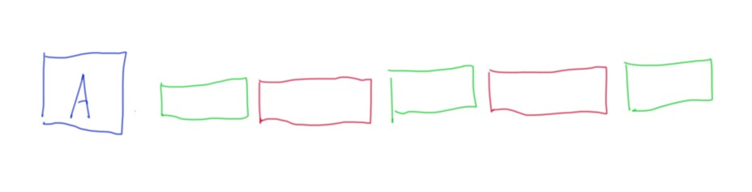
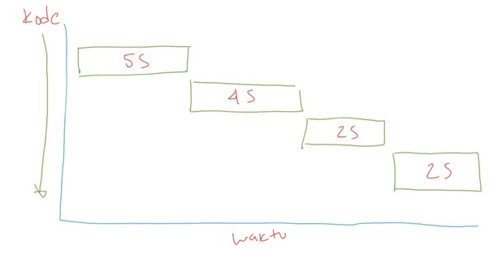
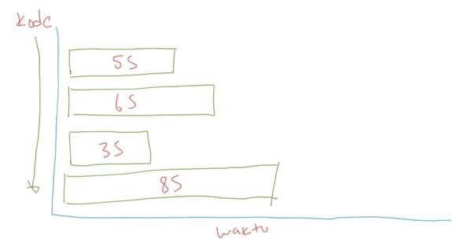
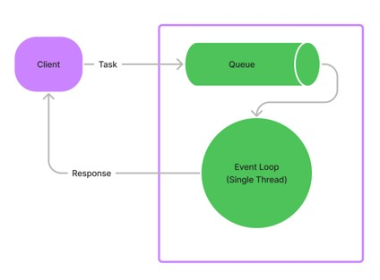
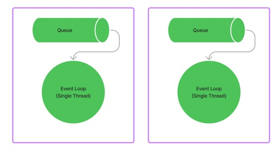
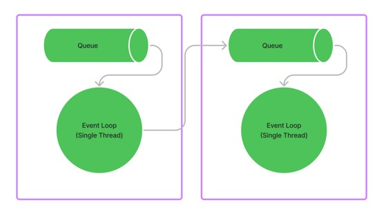

# Dart Async

## Sebelum Belajar

- Dart Dasar
- Dart Object Oriented Programming
- Dart Generic
- Dart Packages
- Dart Collection
- Dart Unit Test

## Agenda

- Pengenalan Concurrency
- Pengenalan Dart Async
- Dart Event Loop
- Dart Isolates
- Future
- Stream
- Async Await
- Dan lain-lain

## #1 Pengenalan Concurrency

### Sejarah Concurrency

- Dahulu, komputer hanya menjalankan sebuah program pada satu waktu
- Karena hanya bisa menjalankan satu program pada satu waktu, hal ini tidak efisien dan memakan waktu lama karena hanya bisa mengerjakan satu tugas pada satu waktu
- Semakin kesini, sistem operasi untuk komputer semakin berkembang, sekarang sistem operasi bisa menjalankan program secara bersamaan dalam proses yang berbeda-beda, terisolasi dan saling independen antar program

### Sejarah Thread

- Program biasanya berjalan dalam sebuah proses, dan proses akan memiliki resource yang independen dengan proses lain
- Sekarang, sistem operasi tidak hanya bisa menjalankan multiple proses, namun dalam proses kita bisa menjalankan banyak pekerjaan sekaligus, atau bisa dibilang proses ringan atau lebih dikenal dengan nama Thread
- Thread membuat proses aplikasi bisa berjalan tidak harus selalu sequential, kita bisa membuat proses aplikasi berjalan menjadi asynchronous atau parallel

### Era Multicore

- Sekarang kita sudah ada di zaman multicore, dimana smartphone pun sudah menggunakan multicore
- Multicore sangat menguntungkan kita karena bisa membuat aplikasi yang bisa menjalankan proses dan thread secara bersamaan

### Concurrency vs Parallel

- Kadang banyak yang bingung dengan concurrency dan parallel, sebenarnya kita tidak perlu terlalu memusingkan hal ini
- Karena saat ini, kita pasti akan menggunakan keduanya ketika membuat aplikasi
- Concurrency artinya mengerjakan beberapa pekerjaan satu persatu pada satu waktu
- Parallel artiya mengerjakan beberapa pekerjaan sekaligus pada satu waktu

### Diagram Concurrency



### Diagram Parallel


### Contoh Concurrency dan Parallel

- Browser adalah aplikasi yang concurrent dan parallel
- Browser akan melakukan proses concurrent ketika membuka web, browser akan melakukan http request, lalu mendownload semua file web (html, css, js) lalu merender dalam bentuk tampilan web
- Browser akan melakukan proses parallel, ketika kita membuka beberapa tab web, dan juga sambil download beberapa file, dan menonton video dari web streaming

### Synchronous vs Asynchronous

- Saat membuat aplikasi yang concurrent atau parallel, kadang kita sering menemui istilah synchronous dan asynchronous
- Tidak perlu bingung dengan istilah tersebut, secara sederhana
- Synchronous adalah ketika kode program kita berjalan secara sequential, dan semua tahapan ditunggu sampai prosesnya selesai baru akan dieksekusi ke tahapan selanjutnya
- Sedangkan, Asynchronous artinya ketika kode program kita berjalan dan kita tidak perlu menunggu eksekusi kode tersebut selesai, kita bisa lanjutkan ke tahapan kode program selanjutnya

### Diagram Synchronus



### Diagram Asynchronous



## #2 Pengenalan Dart Async

- Dart Async merupakan fitur di Dart untuk mendukung fitur Concurrency dan Async
- Berbeda dengan bahasa pemrograman seperti Java, dimana di Java kita perlu membuat Thread sendiri, di Dart, urusan Thread sudah dilakukan secara internal oleh Dart, sehingga kita bisa fokus membuat task yang akan dijalankan secara Concurrent dan Async

### Kenapa Async?

- Operasi Async menjadikan program kita bisa mengerjakan kode lain tanpa harus menunggu pekerjaan selesai
- Contoh, saat kita melakukan operasi yang menggunakan jaringan seperti mengambil data dari Web, Database atau bahkan membaca File. Kita tidak perlu menunggu sampai prosesnya selesai, untuk mengerjakan tugas selanjutnya
- Hal ini tidak bisa dilakukan jika kita masih menggunakan operasi Sync

## #3 Dart Event Loop

- Cara kerja Dart mirip seperti NodeJS, dimana dia bekerja dengan Event Loop
- Event Loop berisikan satu buah Thread yang akan terus bekerja, dan semua pekerjaan akan dikirim ke Queue (antrian) yang akan dieksekusi satu per satu oleh Thread Event Loop

### Diagram: Dart Event Loop



## #4 Dart Isolates

- Isolates adalah tempat semua kode Dart berjalan
- Dalam bahasa pemrograman lain, biasanya aplikasi akan berjalan di satu proses sharing memory dengan beberapa Thread
- Berbeda di Dart, di Dart, kode program berjalan dalam Isolates, yaitu Isolates memiliki memory, queue, thread dan event loop sendiri yang terpisah.
- Kita bisa membuat beberapa Isolates di Dart, namun tiap Isolates akan terpisah secara memory, queue, thread dan event loop, walaupun di aplikasi Dart yang sama

### Diagram: Isolates



### Komunikasi Antar Isolates

- Walaupun secara memory, queue, thread dan event loop berbeda, namun antar Isolates bisa saling berkomunikasi
- Selain itu salah satu keuntungan menggunakan Isolates, kita tidak perlu takut dengan Race Condition dan Locking ketika menjalankan beberapa Thread, karena tiap Thread akan berjalan di Isolates berbeda-beda

### Diagram: Komunikasi Isolates



## #5 Membuat Project

- Clone Project : <https://github.com/ProgrammerZamanNow/belajar-dart-unit-test>

## #6 Future

- Tipe data Future di Dart mirip seperti di bahasa pemrograman lain, di Java ada Future, atau di JavaScript ada Promise
- Future adalah hasil dari asynchronous computation
- Anggap saja ini seperti return value, yang value ada ketika nanti async computation nya selesai
- <https://api.dart.dev/stable/2.18.4/dart-async/Future-class.html>

### Future State

- Yang namanya computation, bisa sukses bisa gagal, begitu juga di Dart
- Future di Dart memiliki dua states
- `Uncompleted`, artinya Future belum memiliki value, kemungkinan karena proses computation nya belum selesai
- `Completed`, artinya Future susah memiliki value hasil computation, namun perlu diingat, value bisa sukses atau gagal

### Future Value

- Future adalah tipe data Generic, dimana dia menyimpan data aslinya
- Misal jika menyimpan data String, artinya `Future<String>`
- Jika menyimpan data int, artinya `Future<int>`
- Jika Future tidak mengembalikan nilai apapun, kita bisa gunakan `Future<void>`

### Future Constructor

- Ada banyak cara membuat Future
- `Future(computation)` : membuat Future dengan computation function
- `Future.delayed(duration, computation)` : membuat Future dengan melakukan delay durasi tertentu
- `Future.error(error)` : membuat Future berisi data error
- `Future.value(value)` : membuat Future berisi data sukses

### Kode: Membuat Future

```dart
Future<void> hello() {
	return Future.delayed(Duration(seconds: 2), () {
		print("Programmer Zaman Now");
	}); // Future.delayed
}

void main() {
	hello();
	print("Done");
}
```

## #7 Future Method

- Future memiliki banyak sekali method, yang bisa kita gunakan untuk meregistrasikan callback/function yang akan dipanggil ketika perubahan state di Future
- <https://api.dart.dev/stable/2.18.4/dart-async/Future-class.html#instance-methods>
- `whenComplete(FutureOr<void> callback(T)) : Future<T>`, dipanggil ketika Future selesai, baik itu sukses atau error
- `then(FutureOr<R> callback(T)) : Future<R>`, dipanggil ketika Future sukses, dan diubah menjadi nilai lainnya
- `onError(FutureOr<R> callback(Error, StackTrace)) : Future<R>`, dipanggil ketika Future error, untuk di ubah menjadi nilai lainnya
- `catchError(callback(Error))`, dipanggil ketika Future error

### Kode: Future Then Method

```dart
Future<String> sayHello(String name) {
	return Future.delayed(Duration(seconds: 2), () {
		return "Hello $name";
	}); // Future.delayed
}

void main() {
	sayHello("Eko")
		.then((value) => print(value));
	print("Done");
}
```

### Kode: Future On Error Method

```dart
Future<String> sayHello(String name) {
	return Future.delayed(Duration(seconds: 2), () {
		return "Hello $name";
	}); // Future.delayed
}

void main() {
	sayHello("Eko")
		.onError((error, stackTrace) => "Fallback")
		.then((value) => print(value));
	print("Done");
}
```

### Kode: Future Catch Error Method

```dart
Future<String> sayHello(String name) {
	return Future.error(Exception("Ups"));
}

void main() {
	sayHello("Eko")
		.then((value) => print(value))
		.catchError((error) => print("Error with message ${error.message}"));
	print("Done");
}
```

### Kode: Future When Complete

```dart
Future<String> sayHello(String name) {
	return Future.error(Exception("Ups"));
}

void main() {
	sayHello("Eko")
		.whenComplete(() => print("Done Future"))
		.then((value) => print(value))
		.catchError((error) => print("Error with message ${error.message}"));
	print("Done");
}
```

## #8 Transform Future

- Method `then()` milik Future bisa digunakan untuk mengubah bentuk isi Future menjadi Future tipe lain
- Kita cukup return kan value yang baru di callback `then()` nya

### Kode: Transform Future

```dart
Future<String> name() {
	return Future.value("Eko Kurniawan Khannedy");
}

void main() {
	name()
		.then((value) => value.split(" "))
		.then((value) => value.reversed)
		.then((value) => value.map((e) => e.toUpperCase()))
		.then((value) => print(value));
	print("Done");
}
```

## #9 Try Catch Finally

- Menggunakan Future, kita tidak bisa menggunakan perintah try catch finally
- Namun, dengan menggabungkan beberapa method di Future, kita bisa implementasikan try catch finally dengan method `then()`, `catchError()` dan `whenComplete()`

### Kode: Future Try Catch Finally

```dart
Future<String> sayHello(String name) {
	return Future.value("Eko Kurniawan Khannedy");
}

void main() {
	sayHello()
		.then((value) => print(value))
		.catchError((error) => print("Error with messahe ${error.message}"))
		.whenComplete(() => print("All Done"));
	print("Done");
}
```

## #10 Stream

- Future adalah object async yang digunakan untuk membuat sebuah object, bagaimana jika object-nya lebih dari satu? Anggap saja seperti Future Collection
- Dart menyediakan tipe data Stream, yaitu Future yang value nya bisa lebih dari satu
- Apa bedanya dengan `Future<List<T>> ?` Pada `Future<List<T>>` data `List<T>` harus lengkap baru Future bisa complete, pada `Stream<T>`, kita bisa mengirim data `T` ke `Stream<T>` secara bertahap, tidak perlu harus lengkap terlebih dahulu
- <https://api.dart.dev/stable/2.18.4/dart-async/Stream-class.html>

### Stream Constructor

Ada banyak sekali Constructor untuk Stream

- `empty()` untuk membuat Stream kosong
- `value(T)` untuk membuat `Stream<T>` dengan satu value
- `fromFuture(Future<T>)` untuk membuat `Stream<T>` dengan satu value dari `Future<T>`
- `fromFutures(Iterable<Future<T>>)` untuk membuat `Stream<T>` dengan beberapa value dari Iterable `Future<T>`
- `fromIterable(Iterable<T>)` untuk membuat `Stream<T>` dengan beberapa value dari `Iterable<T>`
- `periodic(duration, computation)` untuk membuat `Stream<T>` secara periodik

### Kode: Membuat Stream

```dart
Stream<String> stream() {
	return Stream.periodic(Duration(seconds: 2), (i) {
		if (i % 2 == 0) {
			return "$i : Gemap";
		} else {
			return "$i : Ganjil";
		}
	}); // Stream.periodic
}
```

## #11 Stream Subscription

- Berbeda dengan Future, pada Stream, karena bentuk datanya seperti aliran data, kita perlu melakukan subscribe jika ingin tahu data yang terdapat di Stream
- Stream hanya bisa di subscribe sebanyak satu kali, jika kita melakukan subscribe lagi terhadap stream yang sama, maka otomatis akan error
- Untuk melakukan subscribe terhadap stream, kita bisa menggunakan method `listen(callback)`, otomatis mengembalikan object `StreamSubscription<T>`
- <https://api.dart.dev/stable/2.18.4/dart-async/StreamSubscription-class.html>

### Kode: Stream Subscription

```dart
void main() {
	Stream<String> flow = stream();
	StreamSubscription<String> listen = flow.listen((data) {
		print(data);
	});

	print("Done");
}
```

### Kode: Double Stream Subscription

```dart
void main() {
	Stream<String> flow = stream();
	StreamSubscription<String> listen = flow.listen((data) {
		print(data);
	});

	// error
	StreamSubscription<String> listen2 = flow.listen((data) {
		print(data);
	});

	print("Done");
}
```

### Stream Subscription Method

Stream Subscription memiliki banyak method seperti di Future

- `onData(callback)` ketika stream menerima data
- `onError(callback)` ketika stream error
- `onDone(callback)` ketika stream selesai
- `cancel()` membatalkan subscription
- `pause()` menghentikan sementara subscription
- `resume()` melanjutkan subscription

### Stream Listen

- Saat kita membuat Stream Subscription menggunakan method `Stream.listen(callback)`, parameter callback tersebut secara otomatis menjadi onData callback di Stream Subscription
- Jika kita mengubah `onData(callback)` lagi, maka secara otomatis callback di `listen()` akan diganti

### Kode: Stream Subscription Method

```dart
void main() {
	Stream<String> flow = stream();
	StreamSubscription<String> listen = flow.listen((data) {
		print(data);
	});
	listen.onData((data) {
		print("Stream Subscription $data");
	});
	listen.onDone(() {
		print("Stream Subscription Done");
	});

	print("Done");
}
```

## #12 Transform Stream

- Stream memiliki banyak method yang bisa kita gunakan untuk memanipulasi data Stream sebelum dikirim ke Stream Subscription
- Hal ini sangat cocok ketika misal kita ingin melakukan transform data sebelum data tersebut diterima oleh Stream Subscription
- Ada banyak sekali jenis method di Stream, seperti untuk filtering, transformation, dan lain-lain
- <https://api.dart.dev/stable/2.18.4/dart-async/Stream-class.html#instance-methods>

### Filter Method

- `take(int) : Stream<T>` untuk mengambil data Stream sejumlah tertentu
- `takeWhile(test): Stream<T>` untuk mengambil data Stream selama kondisi test masih ok
- `where(test) : Stream<T>` untuk hanya mengambil data Stream jika sesuai kondisi test
- `lastWhere(test): Future<T>` hanya mengambil satu data Stream terakhir sesuai kondisi test
- `firstWhere(test): Future<T>` hanya mengambil satu data Stream pertama sesuai kondisi test
- `drain() : Future<T>` untuk meng-ignore semua data Stream, namun mengirim signal ketika telah selesai
- `distinct() : Stream<T>` untuk meng-ignore data yang sama dengan data sebelumnya
- `skip(int) : Stream<T>` untuk meng-ignore jumlah data diawal
- `skipeWhile(test) : Stream<T>` untuk meng-ignore jumlah di awal ketika kondisi test masih oke

### Kode: Stream Filter Method

```dart
Stream<int> numbers() {
	return Stream.fromIterable([1, 2, 3, 4, 5, 6, 7, 8, 9, 10]);
}

void main() {
	numbers()
		.where((number) => number % 2 == 0)
		.listen((event) => print(event));

	print("Done");
}
```

### Transform Method

- `cast<R> : Stream<R>` untuk mengkonversi value Stream
- `map(R convert(T)) : Stream<R>` untuk mengkonversi value Stream dengan function convert
- `expand(Iterable<R> convert(T)) : Stream<R>` untuk mengkonversi value Stream menjadi `Iterable<R>` namun hasil iterable dijadikan data Stream selanjutnya
- `asyncMap(Future<R> convert(T)) : Stream<R>` sama seperti `map()` namun hasil convert nya adalah `Future<R>`
- `asyncExpand(Stream<R> convert(T)) : Stream<R>` sama seperti `expand()`, namun hasil convert nya adalah `Stream<R>`

### Kode: Stream Transform Method

```dart
Stream<int> numbers() {
	return Stream.fromIterable([1, 2, 3, 4, 5, 6, 7, 8, 9, 10]);
}

void main() {
	numbers()
		.where((number) => number % 2 == 0)
		.map((event) => event * 10)
		.listen((event) => print(event));

	print("Done");
}
```

### Fold and Reduce

Kadang ada kebutuhan kita ingin membuat perhitungan data dari tiap Stream, contoh kita ingin melakukan total untuk semua data di `Stream<int>`, kita bisa gunakan method fold dan reduce

- `fold(initial, combine) : Future<R>`, untuk melakukan combine data dari tiap data di stream, dengan initial data yag diberikan
- `reduce(combine) : Future<R>`, untuk melakukan combine data dari tiap data di stream, namun tidak dengan initial data

### Kode: Stream Fold Method

```dart
Stream<int> numbers() {
	return Stream.fromIterable([1, 2, 3, 4, 5, 6, 7, 8, 9, 10]);
}

void main() {
	Future<int> total = numbers()
		.fold(0, (previous, element) => prevous + element);

	total.then((value) => print("Total is $value"));

	print("Done");
}
```

## #13 Broadcast Stream

- Seperti yang sudah kita bahas di awal, Stream hanya bisa di subscribe oleh satu Stream Subscription
- Namun ada jenis Stream yang bisa di subscribe oleh lebih dari satu Stream Subscription, yaitu Broadcast Stream
- Untuk membuat Broadcast Stream, kita bisa gunakan method `asBroadcastStream()` pada Stream yang sudah kita buat

### Kode: Broadcast Stream

```dart
Stream<int> numbers() {
	return Stream.periodic(Duration(seconds: 1), (i) => i);
}

void main() {
	Stream<int> numberStream = numbers();
	Stream<int> broadcastStream = numberStream.asBroadcastStream();

	broadcastStream.listen((event) {
		print(event);
	});
	broadcastStream.listen((event) {
		print(event);
	});

	print("Done");
}
```

## #14 Timer

- Timer adalah class di Dart yang bisa kita gunakan untuk membuat pekerjaan yang terjadwal secara periodik
- <https://api.dart.dev/stable/2.18.4/dart-async/Timer-class.html>

### Delayed Timer

- Jenis Timer pertama timer delayed task, dimana kita bisa meminta Timer untuk menjalankan sebuah task setelah batas waktu tertentu
- Kita bisa gunakan constuctor
- `Timer(duration, callback)` untuk membuat delayed job di callback yang akan di jalankan setelah waktu duration tercapai

### Kode: Delayed Timer

```dart
import 'dart:async';

void main() {
	Timer(Duration(seconds: 2), () => print("Hello World"));

	print("Done");
}
```

### Periodic Timer

- Jenis Timer kedua adalah periodic timer, dimana kita bisa meminta Timer untuk menjalankan sebuah pekerjaan secara periodik, misal tiap 2 detik
- Kita bisa gunakan constructor
- `Timer.periodic(duration, callback)` untuk membuat periodic timer

### Kode: Periodic Timer

```dart
import 'dart:async';

void main() {
	Timer.periodic(Duration(seconds: 1), (timer) {
		print("Timer ke ${timer.tick}");
		if (timer.tick >= 5) {
			timer.cancel();
		}
	}); // Timer.periodic
	print("Done");
}
```

## #15 Async

- Dart mirip seperti di JavaScript, dimana kita bisa membuat sebuah kode Asynchronous menggunakan kata kunci `async`
- Di Dart, kita bisa membuat function `Future<T>` dengan menggunakan async, sehingga kode yang kita buat terlihat seperti kode Synchronous

### Kode: Async

```dart
Future<String> sayHello(String name) async {
	return "Hello $name";
}

void main() {
	sayHello("World").then((String message) {
		print(message);
	});
	print("Done");
}
```

## #16 Await

### Masalah di Future

- Saat kita menggunakan banyak sekali kode Asynchronous menggunakan Future, kadang ketika melakukan manipulasi datanya akan membuat kode kita sulit untuk dibaca

### Kode: Future Problem

```dart
Future<String> firstName() async {
	return "Eko";
}

Future<String> lastName() async {
	return "Kurniawan";
}

Future<String> sayHello(String name) async {
	return "Hello $name";
}

void main() {
	firstName().then((firstName) {
		return lastName().then((lastName) {
			var fullName = "$firstName, lastName";
			return sayHello(fullName);
		});
	}).then((response) => print(response));

	print("Done");
}
```

### Await

- Saat kita membuat function dengan kata kunci async, didalamnya kita bisa menggunakan kata kunci `await`
- Kata kunci `await` terlihat seperti melihat response dari Future, tapi sebenarnya cara kerjanya tidak seperti itu, cara kerjanya tetap seperti `then()` method di Future, hanya saja dengan menggunakan await, kode akan terlihat lebih mudah dibaca karena seperti gaya kode Synchronous
- Cara menggunakan kata kunci await cukup tambahkan di Future yang ingin kita ambil datanya

### Kode: Await

```dart
Future<void> say() async {
	var first = await firstName();
	var last = await lastName();
	var hello = await sayHello("$first $last");
	print(hello);
}

void main() {
	say();
	print("Done");
}
```

## #17 Try Catch Async Await

- Salah satu keunggulan menggunakan Async Await, selain kode kita terlihat seperti kode Synchronous
- Kita juga bisa menggunakan Try Catch Finally layaknya di kode Synchronous

### Kode: Try Catch Async Await

```dart
Future<void> say() async {
	try {
		var first = await firstName();
		var last = await lastName();
		var hello = await sayHello("$first $last");
		print(hello);
	} catch (e) {
		print(e);
	} finally {
		print("Done Say");
	}
}
```

## #18 Async Await Stream

- Selain digunakan untuk Future, Async Await juga bisa digunakan dalam Stream
- Dengan begitu kita bisa menggunakan Stream seperti perulangan biasa
- Namun perlu diperhatikan, saat menggunakan Async Await Stream, pastikan Stream akan selesai

### Kode: Async Await Stream

```dart
Future<String> names() {
	return Stream.fromIterable(["Eko", "Kurniawan", "Khannedy"]);
}

Future<String> fullName() async {
	String name = "";
	await for (String n in names()) {
		name += "$n ";
	}
	return name.trim();
}

void main() {
	fullName().then((value) => print(value));
	print("Done");
}
```

## #19 Isolate

- Seperti yang diawal dijelaskan, bahwa semua kode Dart dijalankan di dalam Isolate dengan single thread
- Karena hanya menggunakan satu thread, ketika ada kode yang melakukan blocking, maka secara otomatis kode tersebut akan melakukan blocking seluruh event loop
- Hal ini sangat berbahaya, karena bisa membuat semua proses stuck, tidak berjalan
- <https://api.dart.dev/stable/2.18.4/dart-isolate/Isolate-class.html>

### Kode: Isolate Stuck

```dart
import 'dart:io';

Future<String> block() async {
	sleep(Duration(seconds: 2));
	return "Block";
}

void main() {
	block().then((value) => print(value));
	print("Done");
}
```

### Membuat Isolate

- Pada kasus diatas, kita bisa coba jalankan function `block()` di Isolate berbeda, sehingga tidak mengganggu Isolate utama yang sedang digunakan untuk menjalankan aplikasi
- Untuk membuat Isolate kita bisa gunakan static method :
- `Isolate.spawn(function(T), T)`
- Dimana function akan dieksekusi di Isolate berbeda dengan mengirim parameter `T`

### Kode: Membuat Isolate

```dart
import 'dart:io';
import 'dart:isolate';

Future<void> sayHello(String name) async {
	sleep(Duration(seconds: 2));
	print("Hello $name");
	Isolate.exit();
}

void main() {
	Isolate.spawn(sayHello, "Eko");
	print("Done");
}
```

## #20 Receive dan Send Port

### Komunikasi Antar Isolate

- Karena Isolate berjalan terpisah dengan Isolate lainnya, bagaimana pada kasus kita ingin mendapatkan nilai hasil dari perhitungan Isolate lain
- Misal kita ingin mengeksekusi function di Isolate lain, namu hasil dari function nya ingin kita simpan dapatkan di Isolate utama misalnya

### Receive dan Send Port

- Pada kasus ini, kita bisa menggunakan Receive dan Send Port
- Ini mirip channel jika di Golang, dimana kita bisa mengirim dan menerima data dari Isolate lain
- Kita cukup buat ReceivePort, lalu kirim SendPort yang terdapat di ReceivePort nya ke Isolate lain
- Di Isolate lain, kita bisa mengirim data menggunakan SendPort tersebut
- ReceivePort mirip seperti Stream, jadi kita bisa listen data dari ReceivePort
- <https://api.dart.dev/stable/2.18.4/dart-isolate/ReceivePort-class.html>
- <https://api.dart.dev/stable/2.18.4/dart-isolate/SendPort-class.html>

### Kode: Send Port

```dart
import 'dart:io';
import 'dart:isolate';

Future<void> numbers(SendPort sendPort) async {
	for (var i = 0; i < 10; I++) {
		sleep(Duration(seconds: 1));
		sendPort.send(i);
	}
	Isolate.exit();
}
```

### Kode: Receive Port

```dart
void main() {
	final receivePort = ReceivePort();
	Isolate.spawn(numbers, receivePort.sendPort);

	receivePort.take(5).listen((event) {
		print(event);
	});

	print("Done");
}
```

## #21 Completer

- Dart memiliki class bernama Completer, yang bisa kita gunakan untuk mempermudah membuat Future
- Saat misal kita integrasi dengan library orang lain yang menggunakan Callback, kita ingin melakukan wrapping menjadi Future, kita bisa menggunakan Completer
- <https://api.dart.dev/stable/2.18.4/dart-async/Completer-class.html>

### Kode: Contoh Callback Function

```dart
void longRunningTask(void Function(String) onDone, void Function(Object?) onError) {
	Future.delayed(Duration(secods: 5))
		.onError((error, stackTrace) => onError(error))
		.then((value) => onDone("Task Completed"));
}
```

### Kode: Completer

```dart
Future<String> runLongRunningTask() {
	Completer<String> completer = Completer<String>();

	longRunningTask((data) {
		completer.complete(data);
	}, (error){
		completer.completeError(error!);
	});

	return completer.future;
}

void main() {
	runLongRunningTask().then((value) => print(value));
	print("Done");
}
```

## #22 Stream Controller

- Selain Completer yang bisa digunakan untuk membuat Future, Dart juga menyediakan class Stream Controller untuk membuat Stream
- Kasusnya juga cocok ketika kita membuat Stream misal ketika kita menggunakan library orang lain yang menggunakan callback
- <https://api.dart.dev/stable/2.18.4/dart-async/StreamController-class.html>

### Kode: Contoh Callback Function

```dart
void longRunningStream(void Function(String) onNext,
		void Function(Error?) onError, void FUnction() onDone) {
	var listen = Stream.periodic(Duration(seconds: 1)).take(10).listen((event) {
		onNext("Eko");
	});

	listen.onError((error) => onError(error));
	listen.onDone(() => onDone);
}
```

### Kode: Stream Controller

```dart
Stream<String> runLongRunningStream() {
	StreamController<String> streamController = StreamController<String>();

	longRunningStream((event) {
		streamController.add(event);
	}, (error) {
		streamController.addError(error!);
	}, () {
		streamController.close();
	});

	return streamController.stream;
}

void main() {
	runLongRunningStream().listen((event) {
		print(event);
	});
	print("Done");
}
```

## #23 Generator

- Dart memiliki fitur bernama Generator, yang bisa digunakan untuk membuat data collection Sync ataupun Async
- Data Sync akan mengembalikan `Iterable<T>` sedangkan data Async akan mengembalikan `Stream<T>`
- Untuk membuat generator Sync, kita bisa tambahkan `sync*` di function
- Untuk membuat generator Async, kita bisa tambahkan `async*` di function
- Untuk mengembalikan value nya, kita bisa gunakan `yield` value

### Kode: Generator Sync

```dart
Iterable<int> syncNumber() sync* {
	for (int i = 0; i < 10; i++) {
		yield i;
	}
}

void main() {
	syncNumber().forEach((element) {
		print(element);
	});
}
```

### Kode: Generator Async

```dart
Stream<int> syncNumber() async* {
	for (int i = 0; i < 10; i++) {
		yield i;
	}
}

void main() {
	syncNumber().listen((element) {
		print(element);
	});
}
```

### yield\*

- Selain yield, untuk mengirim value di Generator, terdapat `yield*`, yang bisa digunakan untuk mengirim seluruh data `Iterable<T>` atau `Stream<T>`

### Kode: yield\*

```dart
Stream<int> doubleNumber(int number) async* {
	yield number;
	yield number;
}

Stream<int> asyncNumber() async* {
	for (int i = 0; i < 10; i++) {
		yield* doubleNumber(i);
	}
}
```

## #24 Async Package

- Semua class Dart Async terdapat di package `dart:async`
- Namun diluar itu, tim Dart membuat package khusus yang berisi class-class bantuan untuk fitur Dart Async, yaitu package `async`
- <https://pub.dev/packages/async>

### Kode: Menginstall Package Async

```yaml
dev_dependencies:
	lints: ^2.0.0
	test: ^1.21.6
	mockito: ^5.3.1
	build_runner: ^2.2.1
	async: ^2.10.0
```

## #25 Async Cache

- AsyncClass merupakan class di Async Package yang digunakan untuk menjalankan async function, namun hasilnya disimpan di memory selama durasi waktu tertentu
- Jika durasi waktu sudah lewat, maka async function akan di eksekusi lagi
- <https://pub.dev/documentation/async/latest/async/AsyncCache-class.html>

### Kode: Async Cache

```dart
import 'package:async/async.dart';

Future<String> getData() {
	return Future<String>.delayed(Duration(seconds: 2), () {
		return "Get Data";
	}); // Future.delayed
}

void main() async {
	final asyncCache = AsyncCache<String>(Duration(seconds: 10));

	final result1 = await asyncCache.fetch(() => getData());
	print(result1);

	final result2 = await asyncCache.fetch(() => getData());
	print(result2);
}
```

## #26 Async Memoizer

- AsyncMemoizer adalah class yang mirip dengan Async Cache, yang membedakan adalah Async Memoize akan menyimpan data secara permanen, tanpa ada durasi waktu
- <https://pub.dev/documentation/async/latest/async/AsyncMemoizer-class.html>

### Kode: Async Memoizer

```dart
import 'package:async/async.dart';

Future<String> getData() {
	return Future<String>.delayed(Duration(seconds: 2), () {
		return "Get Data";
	}); // Future.delayed
}

void main() async {
	final asyncMemoizer = AsyncMomoizer<String>();

	final result1 = await asyncMemoizer.fetch(() => getData());
	print(result1);

	final result2 = await asyncMemoizer.fetch(() => getData());
	print(result2);
}
```

## #27 Future Test

- Package test di Dart dapat digunakan untuk melakukan pengetesan kode Async dalam bentuk Future
- Hal ini bisa mempermudah ketika kita akan membuat unit test kode Asynchronous
- Di dalam `test()`, kita bisa masukkan function async, sehingga bisa menggunakan await

### Kode: Future Test

```dart
import 'package:test/test.dart';

Future<String> getName() async {
	return "Eko Kurniawan";
}

void main() {
	test("Future Test", () async {
		final name = await getName();
		expect(name, "Eko Kurniawan");
	});
}
```

### Future Matcher

- Jika kita menggunakan async await, kita bisa mengetest kode Future seperti kode Syncronous
- Namun jika kita tidak menggunakan async await, kita bisa menggunakan function `completion()` untuk membantu melakukan matcher data Future

### Kode: Future Matcher

```dart
import 'package:test/test.dart';

Furure<String> getName() async {
	return Future.delayed(Duration(seconds: 2), () => "Eko Kurniawan");
}

void main() {
	test("Future Matcher", () {
		final name = getName();
		expect(name, completion(equals("Eko Kurniawan")));
	});
}
```

## #28 Stream Test

- Package test juga menyediakan banyak function matcher untuk membantu kita ketika melakukan pengetesan terhadap jenis data Stream

### Stream Matcher

- `emits()` match untuk single event
- `emitsError()` match untuk single error event
- `emitsDone` match untuk single done event
- `emitsAnyOf()` consume event match satu untuk beberapa kemungkinan data
- `emitsInOrder()` consume event match multiple matcher dengan urutan yang sudah ditentukan
- `emitsInAnyorder()` seperti `emitsInOrder()`, tapi tidak peduli urutannya
- `neverEmits()` memastikan stream selesai tanpa match data sama sekali

### Kode: Stream Matcher

```dart
import 'package:test/test.dart';

void main() {
	test('Stream Test', () {
		final stream = Stream.periodic(Duration(seconds: 1), (i) => i).take(5);

		expect(stream, emitsOrder([
			emits(0),
			emits(1),
			emits(2),
			emits(3),
			emits(4),
			emitsDone
		]));
	});
}
```

## #29 Materi Selanjutnya

- Belajar Class-Class di Dart dan Package Populer:
- <https://api.dart.dev/stable/2.18.5/index.html>
- <https://pub.dev/>
- Banyak Praktek Dart
- Belajar Flutter
