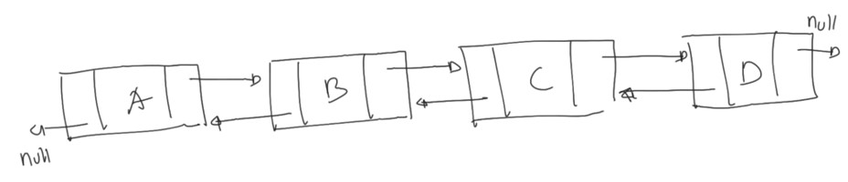
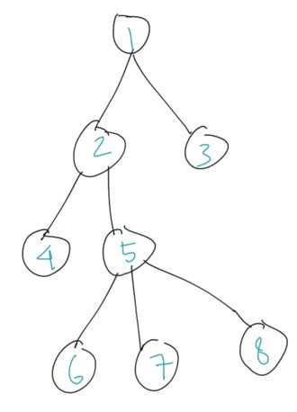
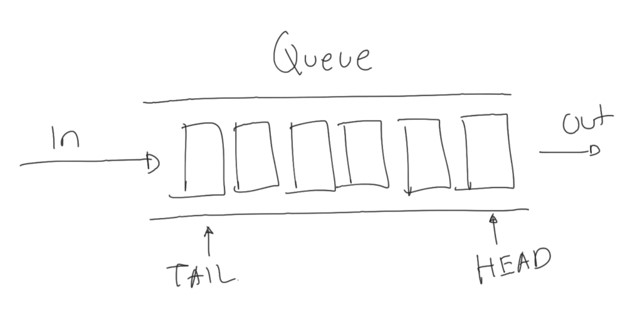
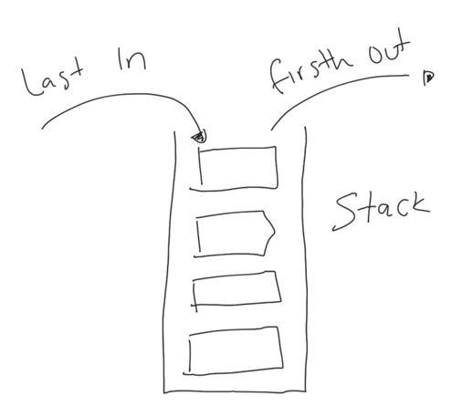

# Dart Collection

## Sebelum Belajar

- Dart Dasar
- Dart OOP
- Dart Generic
- Dart Packages
- Sudah Mengikuti Kelas Git dari Programmer Zaman Now

## Agenda

- Pengenalan Dart Collection
- Iterable, Iterator
- List, Linked List
- Set, Hash Set, Tree Set, Linked Set
- Map, Hash Map, Linked Map, Tree Map
- Dan Lain-Lain

## #1 Pengenalan Dart Collection

- Sebelumnya di materi Dart Dasar, kita sudah berkenalan dengan tipe data seperti List, Set dan Map
- Semua tipe data tersebut disebut Collection, atau bisa dibilang adalah kumpulan data
- Di Dart sendiri, terdapat package yang khusus menyediakan class-class untuk tipe data Collection
- Pada kelas ini, kita akan bahas tuntas tentang tipe data Collection tersebut
- <https://api.dart.dev/stable/2.17.6/dart-collection/dart-collection-library.html>

## #2 Membuat Project

### Membuat Dart Project

```sh
dart create --template=console-simple belajar_dart_collection
```

## #3 Iterable

- Sebelum kita bahas tentang Dart Collection, ada satu class yang teman-teman wajib tau, yaitu Iterable
- Iterable adalah parent class dari class-class Collection di Dart
- Sederhananya, Iterable adalah kumpulan data yang bisa diakses secara sequential atau satu per satu
- <https://api.dart.dev/stable/2.17.6/dart-core/Iterable-class.html>
- List dan Set adalah class turunan dari Iterable

## #4 Iterator

- Salah satu fitur di Dart yang bisa digunakan untuk melakukan iterasi data, atau mengakses data di Iterable satu persatu adalah menggunakan `for in`
- Jika tipe data memiliki property dengan nama iterator dan tipe Iterator, secara otomatis kita bisa menggunakan perulangan `for in`
- Contohnya di Iterable terdapat property iterator, oleh karena itu kita bisa mengakses data di Iterable menggunakan `for in`
- <https://api.dart.dev/stable/2.17.6/dart-core/Iterator-class.html>

### Kode: Iterator For In

```dart
// iterable.dart
void main() {
	var names = ['Seth', 'Logan', 'Mack'];

	for (var value in names) {
		print(value);
	}
}
```

### Iterasi Manual

- Sebenarnya, ketika kita menggunakan perulangan `for in`, secara tidak langsung kita melakukan perulangan terhadap Iterator menggunakan method-method yang tersedia di Iterator
- `Iterator.moveNext()` digunakan untuk berpindah ke data selanjutnya
- `Iterator.current` digunakan untuk mendapatkan data saat ini

### Kode: Iterasi Manual

```dart
// iterator.dart
void main() {
	var names = ['Seth', 'Logan', 'Mack'];
	var iterator = names.iterator;

	while (iterator.moveNext()) {
		print(iterator.current);
	}
}
```

## #5 List

- List adalah tipe data yang berisikan kumpulan data yang memiliki index angka
- Tipe data List sudah kita bahas di materi Dart Dasar
- Saat membuat List, kita bisa buat dengan ukuran fix (tidak bisa berubah), atau bisa bertambah secara otomatis seiring penambahan data ke List
- <https://api.dart.dev/stable/2.17.6/dart-core/List-class.html>

### Kode: Growable List

```dart
void main() {
	final list = <int>[];

	print(list);

	list.add(100);

	print(list);
}
```

### Kode: Fixed List

```dart
void main() {
	final list = List<int>.filled(10, 0);

	print(list);

	list.add(100); // error
}
```

## #6 Linked List

- List di Dart mirip seperti Array di bahasa pemrograman lain, untuk mengubah atau mengakses datanya kita menggunakan Index
- Di Dart juga tersedia collection bernama Linked List, ini adalah implementasi dari struktur data Double Linked List
- <https://api.dart.dev/stable/2.17.6/dart-collection/LinkedList-class.html>

### Diagram: Double Linked List



### List vs Linked List

| Operasi     | List                                                             | Linked List                                                          |
| ----------- | ---------------------------------------------------------------- | -------------------------------------------------------------------- |
| tambah data | Cepat jika kapasitas Array masih cukup, lambat jika, sudah penuh | Cepat karena hanya menambah node di akhir                            |
| ambil data  | Cepat karena tinggal gunakan index array                         | Lambat karena harus di cek dari node awal sampai ketemu index nya    |
| ubah data   | Cepat karena tinggal gunakan index array                         | Lambar karena harus di cek dari node awal sampai ketemu              |
| hapus data  | Lambat karena harus menggeser data di belakang yang dihapus      | Cepat karena tinggal ubah prev dan next di node sebelah yang dihapus |

### Fokus Linked List

- Fokus Linked List adalah pada performa penambahan data dan penghapusan data yang cepat, oleh karena ini di Linked List tidak terdapat operasi pengubahan data menggunakan Index seperti di List
- Linked List juga turunan langsung dari Iterable, bukan List

### Linked List Entry

- Node di Linked List direpresentasikan dalam class `LinkedListEntry`
- Oleh karena itu, jika kita ingin membuat Node, kita perlu membuat class turunan LinkedListEntry
- Pada class tersebut sudah disediakan implementasi property next dan prev nya
- <https://api.dart.dev/stable/2.17.6/dart-collection/LinkedListEntry-class.html>

### Kode: Class String Entry

```dart
class StringEntry extends LinkedListEntry<StringEntry> {

	String value;

	StringEntry(this.value);
}
```

### Kode: Linked List

```dart
void main() {
	var linkedList = LinkedList<StringEntry>();
	linkedList.addAll([StringEntry('Eko'), StringEntry('Kurniawan'), StringEntry('Khannedy')]);

	for (var value in linkedList) {
		print(value.value);
	}
}
```

## #7 Unmodifiable List

- Collection List, walaupun kita buat dalam bentuk Fix atau Growable, data di dalam List, tetap bisa kita modifikasi
- Dart menyediakan collection bernama Unmodifiable List, yaitu List yang setelah dibuat, data di dalamnya tidak bisa diubah lagi
- Cara menggunakan Unmodifiable List adalah dengan cara membungkus List yang sudah kita buat sebelumnya
- <https://api.dart.dev/stable/2.17.6/dart-collection/UnmodifiableListView-class.html>

### Kode: Unmodifiable List

```dart
import 'dart:collection';

void main() {
	final list = [1, 2, 3];
	final unmodifiableList = UnmodifiableListView(list);

	unmodifiableList.add(100); // error
}
```

## #8 Linked Hash Set

### Set

- Set sudah pernah dibahas di materi Dart Dasar
- Set adalah collection yang berisikan kumpulan data `unique`, ketika kita menambahkan data yang sudah ada, maka otomatis data tersebut akan diabaikan
- <https://api.dart.dev/stable/2.17.6/dart-core/Set-class.html>

### Linked Hash Set

- Saat kita membuat Set, implementasi default dari Set sendiri adalah class `LinkedHashSet`
- Seperti terlihat dari namanya, LinkedHashSet menggunakan struktur data double linked list sebagai implementasinya
- Hal ini menjadikan, urutan data di Set sesuai dengan urutan ketika kita memasukkan data ke Set
- <https://api.dart.dev/stable/2.17.6/dart-collection/LinkedHashSet-class.html>

### Kode: Linked Hash Set

```dart
void main() {
	final set = <String>{}; // LinkedHashSet<String>();

	set..add("Eko")..add("Kurniawan")..add("Khannedy");

	print(set);
}
```

## #9 Hash Set

- Hash Set adalah implementasi Set yang tidak menggunakan struktur data double linked list
- Hal ini menyebabkan urutan di Hash Set tidak tentu, karena tergantung dari hash code data yang kita masukkan
- Hash Set membuat proses insert data menjadi cepat karena tidak perlu melakukan pengecekan satu per satu di double linked list, cukup langsung menggunakan hash code
- <https://api.dart.dev/stable/2.17.6/dart-collection/HashSet-class.html>

### Kode: Hash Set

```dart
import 'dart:collection';

void main() {
	final set = HashSet<String>();

	set..add("Eko")..add("Kurniawan")..add("Khannedy");

	print(set);
}
```

## #10 Splay Tree Set

- Splay Tree Set merupakan implementasi dari `Set` yang menggunakan struktur data `Tree`
- Hal ini menyebabkan data di Splay Tree Set akan secara otomatis berurut sesuai comparator nya, defaultnya adalah `ascending`
- <https://api.dart.dev/stable/2.17.6/dart-collection/SplayTreeSet-class.html>

### Diagram: Tree



### Kode: Splay Tree Set

```dart
import 'dart:collection';

void main() {
	final treeSet = SplayTreeSet<int>();
	treeSet.addAll([1, 6, 4, 3, 3, 2, 7, 8, 9]);

	print(treeSet);
}
```

## #11 Comparable

- Comparable adalah sebuah kontrak yang digunakan untuk membuat tipe data yang bisa diurutkan
- Hampir semua tipe data di Dart implement kontrak Comparable, seperti number, string, boolean, dan lain-lain, oleh karena itu, data-data tersebut bisa diurutkan secara otomatis ketika menggunakan SplayTreeSet misalnya
- Bagaimana jika kita ingin membuat class sendiri? Secara default, class kita tidak bisa diurutkan datanya oleh SplayTreeSet, kita wajib implement kontrak Comparable
- <https://api.dart.dev/stable/2.17.6/dart-core/Comparable-class.html>

### Kode: Class Category

```dart
class Category {
	String id;
	String name;

	Category(this.id, this.name);
}
```

### Kode: Splay Tree Set Error

```dart
void main() {
	final treeSet = SplayTreeSet<Category>;
	treeSet.add(Category("2", "Category 2"));
	treeSet.add(Category("1", "Category 1"));
	treeSet.add(Category("3", "Category 3"));

	print(treeSet);
}
```

### Kode: Implement Comparable

```dart
class Category implements Comparable<Category> {
	String id;
	String name;

	Category(this.id, this.name);

	@override
	int compareTo(Category other) {
		return id.compareTo(other.id);
	}
}
```

## #12 Comparator

- Secara default, ketika mengurutkan data, SplayTreeSet akan menggunakan Comparable yang terdapat pada data nya
- Bagaimana jika kita ingin memodifikasi cara melakukan pengurutan data nya? - Tapi tidak mau mengubah class data tersebut? Atau bahkan tidak bisa mengubahnya, seperti tipe data number, boolean, String dan lain-lain
- Pada kasus ini, kita bisa membuat Comparable, yaitu function yang bisa kita gunakan untuk menentukan cara melakukan pengurutan data
- <https://api.dart.dev/stable/2.17.6/dart-core/Comparator.html>

### Kode: Comparator

```dart
import 'dart:collection';

void main() {
	final treeSet = SplayTreeSet<int>((first, second) => second.compareTo(first));
	treeSet.addAll([1, 6, 5, 4, 3, 2, 7, 8, 9]);

	print(treeSet);
}
```

## #13 Unmodifiable Set

- Sama seperti List, di Set pun terdapat class Unmodifiable Set, yang digunakan untuk membungkus Set agar tidak bisa dimodifikasi lagi
- <https://api.dart.dev/stable/2.17.6/dart-collection/UnmodifiableSetView-class.html>

### Kode: Unmodifiable Set

```dart
import 'dart:collection';

void main() {
	final set = <int>{1, 6, 5, 4, 3, 2, 7, 8, 9};
	final unmodifiableSet = UnmodifiableSetView<int>(set);

	unmodifiableSet.add(10); // error
}
```

## #14 List Queue

- Queue adalah collection implementasi dari struktur data Stack (tumpukan) atau Queue (antrian)
- Queue mirip seperti List, namun yang membedakan, pada Queue, modifikasi data bisa dilakukan di depan (HEAD) atau di belakang (TAIL)
- <https://api.dart.dev/stable/2.17.6/dart-collection/Queue-class.html>

### List Queue

- List Queue merupakan implementasi default dari Queue di Dart
- Saat kita membuat object Queue, sebenarnya kita membuat List Queue
- <https://api.dart.dev/stable/2.17.6/dart-collection/ListQueue-class.html>

### Diagram: Queue



### Kode: Queue

```dart
import 'dart:collection';

void main() {
	final queue = Queue<String>();

	queue.addLast("Eko");
	queue.addLast("Kurniawan");
	queue.addLast("Khannedy");

	print(queue.removeFirst());
	print(queue.removeFirst());
	print(queue.removeFirst());
}
```

### Diagram: Stack



### Kode: Stack

```dart
import 'dart:collection';

void main() {
	final stack = Queue<String>();

	stack.addLast("Eko");
	stack.addLast("Kurniawan");
	stack.addLast("Khannedy");

	print(stack.removeLast());
	print(stack.removeLast());
	print(stack.removeLast());
}
```

## #15 Double Linked Queue

- Double Linked Queue merupakan implementasi dari Queue dengan struktur data Double Linked List
- Sebenarnya penggunaan Double Linked Queue sangat cocok untuk queue, karena struktur data Double Linked List sangat cepat untuk modifikasi data di awal dan akhir, sehingga cocok untuk Queue ataupun Stack
- <https://api.dart.dev/stable/2.17.6/dart-collection/DoubleLinkedQueue-class.html>

### Kode: Double Linked Queue

```dart
import 'dart:collection';

void main() {
	final stack = DoubleLinkedQueue<String>();

	stack.addLast("Eko");
	stack.addLast("Kurniawan");
	stack.addLast("Khanendy");

	print(stack.removeLast());
	print(stack.removeLast());
	print(stack.removeLast());
}
```

## #16 Iterable Method

- Sampai saat ini, kita hanya membahas tentang class-class yang terdapat di Dart Collection, namun belum membahas tentang fitur method apa saja yang dimiliki oleh Dart Collection
- Sebenarnya di dalam class Iterable, sudah banyak method yang tersedia untuk bisa kita gunakan ketika butuh melakukan operasi terhadap data collection
- Di materi-materi selanjutnya, kita akan coba bahas lebih detail tentang Iterable Method tersebut
- <https://api.dart.dev/stable/2.17.6/dart-core/Iterable-class.html>

## #17 Check Method

- Salah satu yang biasa kita lakukan saat menggunakan collection (List, Set, Queue dan lain-lain), adalah melakukan pengecekan data
- Iterable memiliki beberapa method untuk melakukan pengecekan data

### Check Method

| Method                      | Keterangan                                                     |
| --------------------------- | -------------------------------------------------------------- |
| `any(bool test(E)): bool`   | Mengecek apakah terdapat data yang sesuai dengan test function |
| `every(bool test(E)): bool` | Mengecek apakah semua data sesuai dengan test function         |
| `contains(E): bool`         | Mengecek apakah data E terdapat di iterable                    |

### Kode: Check Method

```dart
void main() {
	final numbers = {2, 4, 6, 8, 10};

	print(numbers.any((element) => element > 5));
	print(numbers.every((element) => element > 5));
}
```

## #18 Filter Method

- Iterable juga memiliki banyak sekali method untuk melakukan filtering data yang terdapat di Iterable

### Filter Method

| Method                                   | Keterangan                                                                                                                                    |
| ---------------------------------------- | --------------------------------------------------------------------------------------------------------------------------------------------- |
| `firstWhere(bool test(E), E orElse): E`  | Mengambil data pertama yang sesuai dengan kondisi test, jika tidak ada, maka hasilnya data orElse                                             |
| `lastWhere(bool test(E), E orElse): E`   | Mengambil data terakhir yang sesuai dengan kondisi test, jika tidak ada, maka hasilnya data orElse                                            |
| `singleWhere(bool test(E), E orElse): E` | Memastikan hanya ada satu data yang sesuai kondisi test, jika tidak ada, maka hasilnya data orElse, jika lebih dari sau maka akan throw error |
| `skip(count): Iterable<E>`               | Membuat iterable baru dengan menghapus data di awal sejumlah count                                                                            |
| `skipWhile(bool test(E)): Iterable<E>`   | Membuat iterable baru dengan menhapus data di awal selama kondisi test terpenuhi                                                              |
| `take(count): Iterable<E>`               | Membuat iterable baru dengan hanya mengambil sejumlah count di awal                                                                           |
| `takeWhile(bool test(E)): Iterable<E>`   | Membuat iterable baru dengan mengambil data di awal selama kondisi test terpenuhi                                                             |
| `where(bool test(E))`                    | Membuat iterable baru dengan semua data yang sesuai kondisi test                                                                              |

### Kode: Filter Method

```dart
void main() {
	final numbers = {1, 2, 3, 4, 5, 6, 7, 8, 9, 10};

	final evenNumbers = numbers.where((number) => number % 2 == 0);
	final oddNumbers = numbers.where((number) => number % 2 != 0);

	print(evenNumbers);
	print(oddNumbers);
}
```

## #19 Transform Method

- Iterable juga memiliki method untuk melakukan transformasi (mengubah) data menjadi data baru

### Transform Method

| Method                                          | Keterangan                                                                                                                                 |
| ----------------------------------------------- | ------------------------------------------------------------------------------------------------------------------------------------------ |
| `expand(Iterable<T toElements(E)): Iterable<T>` | Mengubah tiap element menjadi `Iterable<T>` dan menggabungkan semuanya                                                                     |
| `map(T toElement(E)): Iterable<T>`              | Mengubah tiap element menggunakan function toElement                                                                                       |
| `join(separator): String`                       | Mengubah element menjadi string, lalu menggabungkan dengan separator                                                                       |
| `fold(T initial, T combine(T, E)): T`           | Mengubah iterable dengan melakukan iterasi satu persatu element dari mulai data initial, lalu hasil iterasi dikirim ke iterasi selanjutnya |
| `reduce(E combine(E, E)): E`                    | Sama dengan fold, namun hasilnya tetap tiap data yang sama dengan element                                                                  |

### Kode: Transform Method

```dart
void main() {
	final numbers = {1, 2, 3, 4, 5, 6, 7, 8, 9, 10};

	print(numbers.map((e) => e * 2));
	print(numbers.reduce((value, element) => value * element));
	print(numbers.expand((element) => [element, element, element]));
	print(numbers.join("-"));
}
```

## #20 Convert Method

- Iterable juga memiliki method yang bisa digunakan untuk melakukan konversi tipe data Collection menjadi tipe data lain

### Convert Method

| Method                              | Keterangan                       |
| ----------------------------------- | -------------------------------- |
| `toSet(): Set<E>`                   | Mengubah iterable menjadi Set    |
| `toList({growable: bool}): List<E>` | Mengubah iterable manjadi List   |
| `toString(): String`                | Mengubah iterable menjadi String |

### Kode: Convert Method

```dart
void main() {
	ver numebrs = {1, 2, 3, 4, 5, 6, 7, 8, 9, 10};
	var numberSet = numbers.toSet();

	print(numbers);
	print(numberSet);
}
```

## #21 Iterable Properties

- Selain banyak sekali method yang dimiliki oleh Iterable
- Iterable juga memiliki banyak sekali property yang bisa kita gunakan untuk mendapatkan informasi dan data dari Iterable
- <https://api.dart.dev/stable/2.17.6/dart-core/Iterable-class.html#instance-properties>

### Kode: Iterable Properties

```dart
void main() {
	final names = ["Eko", "Kurniawan", "Khannedy"];

	print(names.first);
	print(names.last);
	print(names.length);
}
```

## #22 List Method

- List dan Set karena turunan dari Iterable, secara otomatis dapat menggunakan semua method di Iterable
- Namun karena sifat dari List dan Set itu berbeda, List sendiri memiliki method lain yang khusus untuk List
- <https://api.dart.dev/stable/2.17.6/dart-core/List-class.html#instance-methods>

### Kode: List Method

```dart
void main() {
	final names = ["Eko", "Kurniawan"];
	names.insert(1, "Kurniawan");

	print(names);
}
```

### List Operator

- Selain method, List juga memiliki banyak Operator
- <https://api.dart.dev/stable/2.17.6/dart-core/List-class.html#operators>

### Kode: List Operator

```dart
void main() {
	final names = ["Eko", "Kurniawan"];
	final authores = ["Programmer", "Zaman", "Now"];

	final combine = names + authors;

	print(combine);

}
```

## #23 Set Method

- Selain List, Set juga memiliki method yang spesial terdapat di Set
- <https://api.dart.dev/stable/2.17.6/dart-core/Set-class.html#instance-methods>

### Kode: Set Method

```dart
void main() {
	final names1 = {"Eko", "Kurniawan", "Khannedy"};
	final names2 = {"Budi", "Kurniawan", "Nugraha"};

	print(names1.union(names2));
	print(names1.intersection(names2));
	print(names1.difference(names2));
}
```

## #24 Map

- Map sebenarnya mirip dengan tipe data List, dimana memiliki index dan value
- Hanya saja, berbeda dengan List, pada Map, kita bisa menentukan data index dengan tipe data dan data index sesuai yang kita mau
- Di Map, index disebut dengan key
- Detail tentang Map sudah kita bahas di materi Dart Dasar
- <https://api.dart.dev/stable/2.17.6/dart-core/Map-class.html>

### Kode: Map

```dart
void main() {
	final Map<String, String> person = {
		'firstName': 'Eko',
		'lastName': 'Khannedy',
	};

	person['middleName'] = 'Kurniawan';

	print(person);
}
```

## #25 Map Entry

- Map sendiri bukanlah turunan dari Iterable, oleh karena itu secara default tidak bisa di iterasi menggunakan perulangan for
- Namun, Map memiliki property bernama entries, yang mengembalikan Iterable berisi MapEntry
- MapEntry adalah gabungan antara satu buah Key + Value
- <https://api.dart.dev/stable/2.17.6/dart-core/MapEntry-class.html>

### Kode: Map Entry

```dart
void main() {
	final Map<String, String> person = {
		'firstName': 'Eko',
		'lastName': 'Khannedy',
	};

	for (var entry in person.entires) {
		print('${entry.key}: ${entry.value}')
	}
}
```

## #26 Hash Map

- Hash Map merupakan implementasi dari Map yang tidak menggunakan struktur data Double Linked List
- Sama seperti Hash Set, urutan key pada Hash Map tidak bisa di jamin berurut
- <https://api.dart.dev/stable/2.17.6/dart-collection/HashMap-class.html>

### Kode: Hash Map

```dart
import 'dart:collection';

void main() {
	final scores = HashMap<String, int>();

	scores['Eko'] = 100;
	scores['Budi'] = 800;
	scores['Joko'] = 120;
	scores['Dimas'] = 140;
	scores['Kurnia'] = 115;

	print(scores);
}
```

## #27 Linked Hash Map

- Linked Hash Map merupakan implementasi dari Map yang menggunakan struktur data Double Linked List
- Hal ini menjadikan Linked Hash Map datanya terurut sesuai dengan urutan kita memasukkan data ke Linked Hash Map
- Linked Hash Map merupakan default implementasi untuk Map
- <https://api.dart.dev/stable/2.17.6/dart-collection/LinkedHashMap-class.html>

### Kode: Linked Hash Map

```dart
void main() {
	final scores = LinkedHashMap<String, int>();

	scores['Eko'] = 100;
	scores['Budi'] = 800;
	scores['Joko'] = 120;
	scores['Dimas'] = 140;
	scores['Kurnia'] = 115;

	print(scores);
}
```

## #28 Splay Tree Map

- Splay Tree Map merupakan implementasi dari Map yang menggunakan struktur data Tree
- Data di Splay Tree Map secara otomatis akan berurut sesuai dengan data nya, atau bisa menggunakan Comparator, mirip dengan Splay Tree Set
- <https://api.dart.dev/stable/2.17.6/dart-collection/SplayTreeMap-class.html>

### Kode: Splay Tree Map

```dart
void main() {
	final scores = SplayTreeMap<String, int>();

	scores['Eko'] = 100;
	scores['Budi'] = 800;
	scores['Joko'] = 120;
	scores['Dimas'] = 140;
	scores['Kurnia'] = 115;

	print(scores);
}
```

## #29 Unmodifiable Map

- Unmodifiable Map merupakan implementasi Map yang tidak bisa diubah lagi
- Cara penggunaannya adalah membungkus Map yang sudah ada, dengan Unmodifiable Map, sehingga tidak bisa dimodifikasi lagi
- <https://api.dart.dev/stable/2.17.6/dart-collection/UnmodifiableMapView-class.html>

### Kode: Unmodifiable Map

```dart
void main() {
	final Map<String, String> person = {
		'firstName': 'Eko',
		'lastName': 'Khannedy',
	};

	final finalPerson = UnmodifiableMapView(person);

	finalPerson['middleName'] = 'Kurniawan'; // error
}
```

## #30 Materi Selanjutnya

- Dart Unit Test
- Dart Async
