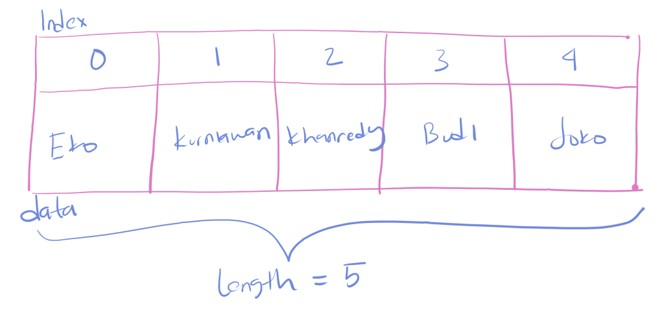

# Dart Dasar

## Agenda

- Pengenalan Dart
- Menginstall Dart
- Membuat Project Dart
- Tipe Data
- Operator
- Percabangan
- Perulangan
- Function
- Dan lain-lain

## #1 Pengenalan Dart

- Dart merupakan bahasa pemrograman baru yang pertama kali diperkenalkan tahun 2011
- Dart dibuat di Google oleh Lars Bak dan Kasper Lund
- Dart merupakan bahasa pemrograman yang awal nya di buat untuk Frontend (web dan mobile), namun Dart juga sebenarnya bisa digunakan untuk Backend, namun memang lebih populer penggunaannya di Frontend
- Dart merupakan bahasa pemrograman yang Open Source
- <https://dart.dev/>

### Dart Software Development Kit

- Dart merupakan bahasa pemrograman yang multi platform, artinya bisa di install di berbagai sistem operasi, seperti Windows, Linux dan Mac
- Untuk membuat aplikasi menggunakan bahasa pemrograman Dart, kita membutuhkan Dart SDK (Software Development Kit)
- SDK ini digunakan untuk melakukan kompilasi kode program Dart yang kita buat dan juga menjalankan kode program Dart yang kita buat

### Menginstall Dart SDK

- Untuk menginstall Dart SDK, kita bisa download aplikasi Dart SDK sesuai sistem operasi yang kita gunakan
- <https://dart.dev/get-dart>

### Text Editor

- Untuk membuat kode program Dart, kita membutuhkan Text Editor yang bagus, terdapat beberapa aplikasi yang populer untuk membuat kode program Dart
- Visual Studio Code : <https://code.visualstudio.com/>
- IntelliJ IDEA : <https://www.jetbrains.com/idea/>
- Android Studio : <https://developer.android.com/studio>

## #2 Dart SDK

- Saat kita menginstall Dart SDK, Dart memiliki banyak sekali executable file yang bisa diakses via terminal / command line
- Aplikasi tersebut bisa digunakan untuk membuat project, melakukan kompilasi sampai menjalankan kode program
- Banyak aplikasi yang terdapat di dalam Dart SDK, yang akan kita pelajari secara bertahap
- <https://dart.dev/get-dart>

### Dart SDK Executable File


### Executable File dart

- Salah satu executable yang akan banyak kita gunakan adalah menggunakan executable file dart di dalam folder bin
- file dart ini digunakan untuk membuat project, melakukan kompilasi kode program, dan menjalankan aplikasi dart

### Kode: Menjalankan File dart

```sh
dart --help
```


## #3 Membuat Project

- Untuk membuat project Dart, kita bisa gunakan perintah :
- `dart create nama_project`

### Kode: Membuat Project Dart

```sh
dart create belajar_dart_dasar
```


### Membuka Project

- Saat membuat project, secara otomatis akan dibuat folder baru dengan nama sesuai dengan nama projectnya
- Selanjutnya, silahkan buka project tersebut menggunakan Text Editor yang kita gunakan

### Struktur Project


## #4 Program Hello World

- Saat belajar bahasa pemrograman, biasanya hal yang pertama dilakukan adalah membuat aplikasi Hello World
- Aplikasi Hello World adalah aplikasi sederhana yang menampilkan tulisan Hello World
- Kode program Dart, disimpan dalam file dengan file extension `.dart`
- Dart mirip dengan bahasa pemrograman Java, setiap akhir statement dalam kode program, diakhiri dengan karakter titik koma.

### Dart Main Function

- Dart hampir mirip dengan bahasa pemrograman seperti C, Java, Kotlin, atau Go-Lang
- Saat kita membuat kode program Dart, kita harus membuat main function terlebih dahulu
- Main function merupakan fungsi utama yang akan dieksekusi oleh Dart

### Kode: Dart Main Function

```dart
void main() {

}
```

### Function print

- Untuk menampilkan tulisan di Dart, kita bisa menggunakan function `print`
- `print` memiliki parameter data string / text, dimana data tersebut bisa menggunakan kutip satu atau kutip dua
- Misal jika kita ingin menampilkan tulisan : Hello World, kita bisa membuat kode program `print('Hello World')` atau `print("Hello World")`

### Kode: Hello World

```dart
void main() {
	print('Hello World');
}
```

### Menjalankan Kode Program Dart

- Untuk menjalankan kode program yang sudah kita buat, kita bisa menggunakan executable file dart, caranya dengan cara menggunakan perintah run, lalu diikuti lokasi file dart yang ingin kita eksekusi, misal
- `dart run bin/hello_world.dart`

### Kode: Menjalankan Kode Program Dart

```sh
dart run bin/hello_world.dart
```


## #5 Variable

- Variable merupakan tempat untuk menyimpan data, ada banyak sekali tipe data di Dart, akan kita bahas di materi-materi tersendiri
- Variable sangat berguna ketika kita ingin menggunakan data yang sama berkali-kali, dibandingkan kita buat berulang-ulang, lebih baik kita simpan data tersebut dalam variable
- Variable wajib memiliki tipe data dan nama variable, ketika kita akan mengakses variable tersebut, kita cukup menyebutkan nama variable nya

### Kode: Tanpa Variable

```dart
print('Eko Kurniawan Khannedy');

print('Eko Kurniawan Khannedy');

print('Eko Kurniawan Khannedy');

print('Eko Kurniawan Khannedy');
```

### Membuat Variable

- Untuk membuat deklarasi variable, kita bisa gunakan format :
- `TipeData namaVariable;`
- Biasanya penamaan variable di Dart menggunakan `camelCase`, seperti firstName, lastName, thisIsLongVariableName
- Setelah mendeklarasikan variable, kita bisa mengubah isi variable dengan cara :
- `namaVariable = isi value nya`

### Kode: Variable

```dart
String name;
name = 'Eko Kurniawan Khannedy';

print(name);
print(name);
print(name);
print(name);
```

### Deklarasi Langsung

- Variable juga bisa dibuat langsung dengan deklarasi nilai nya, ini sangat cocok jika kita ingin membuat variable langsung dengan value dari variable nya
- Cara membuatnya kita bisa gunakan perintah :
- `TipeData namaVariable = isi variable;`

### Kode: Deklarasi Variable Langsung

```dart
String name = 'Eko Kurniawan Khannedy';

print(name);
print(name);
print(name);
print(name);
```

### Kata Kunci var

- Saat kita membuat variable langsung dengan nilainya, kita bisa menggunakan kata kunci `var` sebagai pengganti TipeData nya
- Ini mirip dengan bahasa pemrograman seperti Java, Go-Lang, Kotlin dan lain-lain
- TipeData akan dibaca sesuai dengan isi nilai nya secara otomatis oleh Dart, sehingga kita tidak perlu menyebutkan TipeData nya lagi
- Cara menggunakan kata kunci `var`, seperti ini :
- `var namaVariable = value;`

### Kode: Kata Kunci `var`

```dart
var name = 'Eko Kurniawan Khannedy';

print(name);
print(name);
print(name);
print(name);
```

### Kata Kunci `final`

- Secara default, variable di Dart bisa dideklarasikan ulang, artinya jika sebelumnya kita membuat variable name dengan value `"Eko"`, kita bisa ubah variable tersebut menjadi `"Joko"` dengan cara `namaVariable = "Joko"`
- Kadang ada kasus dimana kita tidak ingin sebuah variable bisa dideklarasikan ulang, untuk melakukan itu kita bisa gunakan kata kunci `final` :
- `final TipeData namaVariable = value;`
- `final namaVariable = value;`

### Kode: Kata Kunci `final`

```dart
var firstName = 'Eko';
final lastName = 'Khannedy';

firstName = "Budi";
lastName = "Nugraha";
```

### Kata Kunci `const`

- Kata kunci `final` digunakan agar variable tidak bisa dideklarasikan ulang, namun nilai dari variable nya sendiri bisa diubah
- Di Dart terdapat kata kunci `constant`, digunakan untuk menjadikan variable dan nilainya menjadi immutable (tidak bisa diubah sama sekali)
- Kata kunci `const` akan menjadikan data di hardcode pada saat Dart melakukan kompilasi kode program, jadi hati-hati ketika menggunakan kata kunci `const`
- Misal jika kita membuat data waktu saat ini menggunakan `final`, maka variable waktu akan selalu mengikuti waktu saat ini, namun jika menggunakan `const`, nilai waktu akan di hardcode ketika kode program di kompilasi, sehingga tidak akan pernah berubah

### Kode: Kata Kunci `const`

```dart
final array1 = [1, 2, 3];
const array1 = [1, 2, 3];

array1[0] = 5;
array2[0] = 5;

print(array1);
print(array2);
```

### Kata Kunci Late

- Di Dart, secara standar, variable akan dideklarasikan nilainya ketika variable dibuat
- Namun kadang ada kasus dimana kita ingin variable dideklarasikan nanti saja, ketika memang variable tersebut diakses, jika tidak diakses, tidak perlu dideklarasikan
- Untuk melakukan hal ini, kita bisa tambahkan kata kunci `late` di awal deklarasi variable

### Kode: Kata Kunci `late`

```dart


void main() {
	late var value = getValue();
	print('Display Value');
	print(value);
}

String getValue() {
	print('getValue dipanggil');
	return 'Eko Kurniawan Khannedy';
}
```

## #6 Komentar

- Komentar adalah kode program yang akan diabaikan ketika kode program di compile atau dijalankan
- Biasanya komentar digunakan untuk menambahkan dokumentasi pada kode program
  Di Dart, ada banyak jenis komentar

### Jenis Komentar

- Single-line atau satu baris, bisa menggunakan perintah :
- `// silahkan masukkan komentar disini`
- Multi-line atau lebih dari satu baris, bisa menggunakan perintah :
- `/*isi komentar*/`
- Documentation, ini adalah jenis komentar yang biasanya digunakan sebagai dart documentation :
- `/// isi dokumentasi`

### Kode: Komentar

```dart
/// ini adalah documentation
/// yang biasanya akan digenerate menjadi dart doc
void main() {
	// This is variable
	var name = 'Eko Kurniawan';

	/**
	 * Ini adalah komentar
	 * lebih dari satu baris
	 */
	print(name);
}
```

## #7 Number

- Number adalah tipe data angka, terdapat dua jenis tipe data Number, `int` dan `double`
- `int` adalah tipe data bilangan bulat
- `double` adalah tipe data bilangan desimal
- Penulisan koma dalam double menggunakan titik, bukan koma, jadi jika kita akan membuat bilangan desimal `0,5` (nol koma lima), maka ditulis `0.5`

### Kode: Tipe Data Number

```dart
int number1 = 10;
double number2 = 10.5;

print(number1);
print(number2);
```

### `num`

- Jika kita ingin menggunakan tipe data number yang bisa int ataupun double, kita bisa menggunakan tipe data `num`

### Kode: `num`

```dart
num number = 10;
print(number);

number = 10.5;
print(number);
```

## #8 Boolean

- Boolean adalah tipe data yang hanya memiliki dua nilai, yaitu benar atau salah
- Boolean direpresentasikan dengan kata kunci `bool`
- Untuk nilai benar, menggunakan kata kunci `true`
- Untuk nilai salah, menggunakan kata kunci `false`

### Kode: Boolean

```dart
bool finish = false;

print(finish);

finish = true;

print(finish);
```

## #9 String

- String merupakan tipe data text atau tulisan
- Untuk membuat String, kita bisa menggunakan tanda kutip satu atau kutip dua, lalu di dalamnya berisi nilai text nya
- Walaupun String bisa menggunakan kutip dua, tapi disarankan untuk menggunakan kutip satu saja

### Kode: String

```dart
String firstName = 'Eko';

String lastName = "Khannedy";

print(firstName);
print(lastName);
```

### String Interpolation

- String mendukung expression, dimana di dalam expression kita bisa mengambil data dari variable lain
- Untuk membuat expression, kita bisa menggunakan format `${isiExpression}`, jika sederhana kita bisa langsung menggunakan `$isiExpression`

### Kode: Expression

```dart
String firstName = 'Eko';
String lastName = "Khannedy;

var fullName = '$firstName ${lastName}';

print(fullName);
```

### Karakter Backslah

- Karakter `\` (backslash) di String bisa digunakan untuk menekankan bahwa karakter setelahnya dianggap benar karakter tersebut
- Seperti contohnya sebelumnya karakter `$` dianggap expression, jika kita memang mau membuat karakter `$` dalam string, maka kita bisa gunakan `\$`, atau jika kita mau membuat karakter `'` (petik satu), kita bisa gunakan `\'`

### Kode: Karakter Backslash

```dart
var text = 'this is \'dart\' \$cool';
print(text);
```

### Menggabungkan String

- Kadang ada kebutuhan kita perlu menggabungkan beberapa data String
- Untuk menggabungkan beberapa data String, kita bisa menggunakan karakter `+` (tambah)
- Atau jika datanya tidak dalam bentuk variable, kita bisa langsung tambahkan hanya dengan karakter whitespace (spasi, enter, tab)

### Kode: Menggabungkan String

```dart
var name1 = firstName + lastName;
var name2 = 'Eko' 'Kurniawan' 'Khannedy';

print(name1);
print(name2);
```

### Multiline String

- Kadang kita butuh membuat String yang sangat panjang, sehingga jika kita buat dalam satu baris kode, kode tersebut akan terlalu panjang
- String mendukung pembuatan data secara multiline, caranya dengan menggunakan petik satu atau petik dua sebanyak tiga karakter

### Kode: Multiline String

```dart
var longString = '''
string ini sangat panjang
sehingga sulit dibuat dalam
satu baris kode program
''';

print(longString);
```

## #10 Dynamic

- Kadang ada kebutuhan kita ingin membuat variable yang bisa menampung semua jenis tipe data
- Pada kasus ini, kita bisa menggunakan tipe data `dynamic`

### Kode: Dynamic

```dart
dynamic variable = 100;
print(variable);

variable = true;
print(variable);

variable = 'Eko';
print(variable);
```

## #11 Konversi Tipe Data

- Kadang ada kebutuhan kita melakukan konversi tipe data, terutama dari tipe data String ke Number dan Boolean, atau bahkan kebalikannya
- Hal ini biasa kita lakukan ketika misal menerima input dari pengguna aplikasi kita, dimana biasanya inputnya dalam bentuk String, dan kita butuh melakukan konversi ke tipe data yang kita inginkan, misal Number atau Boolean

### Konversi Number dan String

- Dart merupakan bahasa pemrograman berorientasi objek, semua tipe data di Dart adalah object, dimana object memiliki method/function
- Kita bisa menggunakan method `toString()` untuk melakukan konversi dari Number ke String
- Sedangkan untuk melakukan konversi dari String ke Number, kita bisa gunakan method `parse()`, baik itu di int ataupun di double
- Sedangkan jika kita ingin melakukan konversi dari Number ke Number lain, kita bisa gunakan method `toInt()` atau `toDouble()`

### Kode: Konversi String dan Number

```dart
var inputString = '1000';
var inputInt = int.parse(inputString);
var inputDouble = double.parse(inputString);

var doubleFromInt = inputInt.toDouble();
var intFromDouble = inputDouble.toInt();

var stringFromInt = inputInt.toString();
var stringFromDouble = inputDouble.toString();
```

### Konversi Boolean dan String

- Untuk melakukan konversi tipe data Boolean ke String, kita bisa gunakan method `toString()`
- Sedangkan untuk melakukan konversi tipe data String ke Boolean, tidak ada caranya, oleh karena itu untuk melakukan hal ini, biasanya menggunakan operator perbandingan, yang akan kita bahas di materi tersendiri

### Kode: Konversi Boolean dan String

```dart
var inputString = 'true';
var inputBool = inputString == 'true';

var stringFromBool = inputBool.toString();
```

## #12 Operator Aritmatika

| Operator         | Keterangan               |
| ---------------- | ------------------------ |
| `+`              | Pertambahan              |
| `-, -expression` | Pengurangan atau Negatif |
| `*`              | Perkalian                |
| `/`              | Pembagian, Hasil double  |
| `~/`             | Pembagian, Hasil int     |
| `%`              | Sisa Bagi                |

### Kode: Operator Aritmatika

```dart
var result1 = 10 + 10;
var result2 = 100 - 10;
var result3 = -5;
var result4 = 5;
var result5 = 5 * 5;
var result6 = 10 / 3;
var result7 = 10 ~/ 3;
var result8 = 10 % 3;
```

## #13 Operator Perbandingan

- Operator perbandingan adalah operator yang hasilnya adalah `bool`
- Operator perbandingan bisa digunakan di tipe data `number` dan `string`

### Operator Perbandingan

| Operator | Keterangan                   |
| -------- | ---------------------------- |
| `==`     | Sama dengan                  |
| `!=`     | Tidak sama dengan            |
| `>`      | Lebih dari                   |
| `<`      | Kurang dari                  |
| `>=`     | Lebih dari atau sama dengan  |
| `<=`     | Kurang dari atau sama dengan |

## #14 Operator Penugasan

| Operator      | Keterangan |
| ------------- | ---------- |
| `a = a + 10`  | `a += 10`  |
| `a = a - 10`  | `a -= 10`  |
| `a = a * 10`  | `a *= 10`  |
| `a = a / 10`  | `a /= 10`  |
| `a = a ~/ 10` | `a ~/= 10` |
| `a = a % 10`  | `a %= 10`  |

### Increment dan Decrement

| Operator | Keterangan                              |
| -------- | --------------------------------------- |
| `++var`  | `var = var + 1 (expression is var + 1)` |
| `var++`  | `var = var + 1 (expression is var)`     |
| `--var`  | `var = var - 1 (expression is var - 1)` |
| `var--`  | `var = var - 1 (expression is var)`     |

## #15 Operator Logika

- Operator logika adalah operator untuk dua buah data bool
- Hasil dari operator logika adalah bool lagi

| Operator | Keterangan |
| -------- | ---------- |
| `&&`     | Dan        |
| `\|\|`   | Atau       |
| `!`      | Kebalikan  |

### Operator `&&`

| Nilai 1 | Operator | Nilai 2 | Hasil   |
| ------- | -------- | ------- | ------- |
| `true`  | `&&`     | `true`  | `true`  |
| `true`  | `&&`     | `false` | `false` |
| `false` | `&&`     | `true`  | `false` |
| `false` | `&&`     | `false` | `false` |

### Operator `\|\|`

| Nilai 1 | Operator | Nilai 2 | Hasil   |
| ------- | -------- | ------- | ------- |
| `true`  | `\|\|`   | `true`  | `true`  |
| `true`  | `\|\|`   | `false` | `true`  |
| `false` | `\|\|`   | `true`  | `true`  |
| `false` | `\|\|`   | `false` | `false` |

### Operator `!`

| Operator | Nilai 2 | Hasil   |
| -------- | ------- | ------- |
| `!`      | `true`  | `false` |
| `!`      | `false` | `true`  |

## #16 Operator Type Test

| Operator | Keterangan                                          |
| -------- | --------------------------------------------------- |
| `as`     | Typecast, melakukan konversi tipe data secara paksa |
| `is`     | `true`, jika object sesuai tipe data                |
| `is!`    | `true`, jika object tidak sesuai tipe data          |

### Kode: Operator Type Test

```dart
dynamic variable = 100;

var variableTest = variable as int;

var isInt = variable is int;
var isNotBoolean = variable is! bool;
```

## #17 List

- List merupakan tipe data yang berisikan kumpulan data
- Di bahasa pemrograman lain, tipe data ini dikenal dengan tipe data Array
- Saat kita membuat List, kita perlu menentukan isi dari tipe data List
  Untuk membuat data List, kita bisa menggunakan `[]`
- Di Dart, semua tipe data adalah object, dimana List sendiri memiliki property, method dan operator
- Sekarang kita akan bahas beberapa method dan operator di List, untuk lebih detail nanti kita akan bahas
- <https://api.dart.dev/stable/2.13.4/dart-core/List-class.html>

### Membuat List

- Untuk membuat list, kita bisa tentukan tipe datanya, misal :
- `List<TipeData> namaVariable = [];`
  Atau bisa menggunakan kata kunci var atau final :
- `var namaVariable = <TipeData>[];`
- `final namaVariable = <TipeData>[];`

### Kode: Membuat List

```dart
// Create list of int
List<int> listInt = [];

// Create list of String
var listString = <String>[];
```

### Menambah Data di List

- Data di dalam List, bisa kita tambah lebih dari satu, anggap aja List adalah sebuah tabel, dimana kita bisa menambah banyak baris di tabel nya
- Ukuran List akan secara otomatis bertambah ketika kita menambahkan data ke dalam list
- Untuk menambahkan data ke List, kita bisa gunakan method `add(value)`
- Dan untuk mengetahui berapa jumlah data yang ada di List, kita bisa gunakan property length

### Kode: Menambah Data di List

```dart
var names = <String>[];

names.add('Eko');
names.add('Kurniawan');
names.add('Khannedy');

print(names);
print(names.length);
```

### Index

- Selain menambahkan data di List, kita juga bisa mengubah data di List atau mendapatkan data di List
- Saat kita menambahkan data di List, secara otomatis data tersebut memiliki index (int), index ini digunakan untuk kita mengakses, mengubah atau menghapus data di List
- Index di List dimulai dari angka `0`, dan akan terus bertambah seiring jumlah data yang kita masukkan
- Artinya jika kita memiliki jumlah data di List sebanyak length, index terakhir di List adalah `length - 1`

### Diagram List



### Manipulasi Data di List

| Operator / Method      | Keterangan                                                 |
| ---------------------- | ---------------------------------------------------------- |
| `list.add(value)`      | Menambah data ke List                                      |
| `list[index]`          | Mengambil data di List                                     |
| `list[index] = value`  | Mengubah data di List                                      |
| `list.removeAt(index)` | Menghapus data di List, index secara otomatis akan begeser |

### Kode: Manipulasi Data di List

```dart
print(names[0]);
names[0] = 'Budi';
names.removeAt(2);
print(names);
```

### Deklarasi List Secara Langsung

- List juga mendukung deklarasi data secara langsung ketika pembuatan variable List
- Ini mempermudah kita ketika membuat list jika memang datanya sudah siap
- Caranya bisa gunakan perintah :
- `var namaVariable = [value1, value2, value3]`
- `var namaVariable = <TipeData>[value1, value2, value3]`
- ```dart
  var namaVariable = [
  	value1,
  	value2,
  	value3,
  ]
  ```

## #18 Set

- Set merupakan tipe data sama seperti List, namun ada beberapa hal yang berbeda dengan List
- Set tidak menerima duplikat data, artinya jika kita memasukkan data duplikat, hanya satu yang diterima, yang lainnya akan dihiraukan
- Set tidak menjamin urutan data, jika dalam List, urutan data sudah pasti menggunakan index, pada Set tidak ada index

### Membuat Set

- Untuk membuat Set, tidak sama dengan membuat List
- Untuk membuat Set, kita menggunakan `{}` (kurung kurawal)
- `Set<TipeData> namaVariable = {};`
- `var namaVariable = <TipeData>{};`

### Kode: Membuat Set

```dart
Set<int> numbers = {};
var names = <String>{};
final numberDouble = <String>{};
```

### Manipulasi Set

| Operator / Method / Property | Keterangan              |
| ---------------------------- | ----------------------- |
| `set.length`                 | Mendapatkan panjang Set |
| `set.add(value)`             | Menambah data ke Set    |
| `set.remove(value)`          | Menghapus data dari Set |

### Kode: Manipulasi Set

```dart
var names = <String>{};
names.add('Eko');
names.add('Kurniawan');
names.add('Khannedy');

print(names);

names.remove('Eko');
print(names);
```

### Deklarasi Set Secara Langsung

- Set juga mendukung deklarasi data secara langsung ketika pembuatan variable Set
- Ini mempermudah kita ketika membuat Set jika memang datanya sudah siap
- Caranya bisa gunakan perintah :
- `var namaVariable = {value1, value2, value3}`
- `var namaVariable = <TipeData>{value1, value2, value3}`
- ```dart
  var namaVariable = {
  	value1,
  	value2,
  	value3,
  }
  ```

## #19 Map

- Map adalah tipe data key-value, key mirip seperti index, value adalah data nya
- Sekilas mirip dengan List, yang membedakan adalah, index pada List sudah diatur oleh List secara otomatis, dan nilainya berupa int auto increment dimulai dari nol
- Sedangkan pada Map, key nya bisa ditentukan dengan tipe data apapun, dan kita perlu tentukan secara manual key nya ketika memasukkan value nya
- Jika kita memasukkan dengan key yang sudah ada, secara otomatis data dengan key lama akan diganti dengan data yang baru

### Membuat Map

- Untuk membuat Map, kita menggunakan perintah sebagai berikut :
- `Map<TipeKey, TipeValue> namaVariable = {};`
- `var namaVariable = Map<TipeKey, TipeValue>();`
- `var namaVariable = <TipeKey, TipeValue>{};`

### Kode: Membuat Map

```dart
Map<String, String> person = {};
var product = Map<String, String>();
var address = <String, String>{};

print(person);
print(product);
print(address);
```

### Manipulasi Map

| Operator / Method / Property | Keterangan              |
| ---------------------------- | ----------------------- |
| `map.length`                 | Mendapatkan panjang Map |
| `map[key]`                   | Mendapatkan data di Map |
| `map[key] = value`           | Mengubah data di Map    |
| `map.remove(key)`            | Menghapus data di Map   |

### Kode: Manipulasi Map

```dart
var name = <String, String>{};

name['first'] = 'Eko';
name['middle'] = 'Kurniawan';
name['last'] = 'Khannedy';

print(name['first']);

name['middle'] = 'Nugroho';
print(name);

name.remove('last');
print(name);
```

### Deklarasi Map Secara Langsung

- Map juga mendukung deklarasi data secara langsung ketika pembuatan variable Map
- Ini mempermudah kita ketika membuat Map jika memang datanya sudah siap
- Caranya bisa gunakan perintah :
- ```dart
  var namaVariable = {
  	key1 : value1,
  	key2: value2,
  	key3: value3,
  }
  ```

## #20 Symbol

- Symbol merupakan tipe data yang sebenarnya jarang sekali digunakan
- Symbol sebenarnya bisa digunakan sebagai constant
- Untuk membuat Symbol, kita bisa menggunakan tanda `#`, atau jika kita butuh membuat Symbol dengan nama yang mengandung spasi, kita bisa gunakan `Symbol("text")`

### Kode: Symbol

```dart
Symbol symbol1 = Symbol('Eko Kurniawan');
var symbol2 = #belajar;

print(symbol1);
print(symbol2);
```

## #21 If dan Else

### If

- Dalam Dart, `if` adalah salah satu kata kunci yang digunakan untuk percabangan
- Percabangan artinya kita bisa mengeksekusi kode program tertentu ketika suatu kondisi terpenuhi
- Hampir di semua bahasa pemrograman mendukung percabagan `if`

### Kode: If

```dart
var nilai = 70;
var absen = 90;

if (nilai >= 75 && absen >= 75) {
	print('Anda Lulus');
}
```

### Else

- Blok `if` akan dieksekusi ketika kondisi `if` bernilai `true`
- Kadang kita ingin melakukan eksekusi program tertentu jika kondisi `if` bernilai `false`
- Hal ini bisa dilakukan menggunakan `else`

### Kode: Else

```dart
var nilai = 70;
var absen = 90;

if (nilai >= 75 && absen >= 75) {
	print('Anda Lulus');
} else {
	print('Anda Tidak Lulus');
}
```

### Else If

- Kada dalam If, kita butuh membuat beberapa kondisi
- Kasus seperti ini, kita bisa menggunakan `else if`
- Else if bisa ditambahkan sebanyak-banyaknya
- Ketika salah satu kondisi terpenuhi, maka otomatis akan berhenti, if else selanjutnya tidak akan dieksekusi

### Kode: Else If

```dart
if (nilai >= 80 && absen >= 80) {
	print('Nilai Anda A');
} else if (nilai >= 70 && absen >= 70) {
	print('Nilai Anda B');
} else if (nilai >= 60 && absen >= 60) {
	print('Nilai Anda C');
} else if (nilai >= 50 && absen >= 50) {
	print('Nilai Anda D');
} else {
	print('Nilai Anda E');
}
```

## #22 Switch Case

- Kadang kita hanya butuh menggunakan kondisi sederhana di if, seperti hanya menggunakan perbandingan `==`
- Switch adalah statement percabangan yang sama dengan if, namun lebih sederhana cara pembuatannya
- Kondisi di switch statement hanya untuk perbandingan `==`

## #23 Kode: Switch Case

```dart
switch (nilai) {
	case 'A:
		print('Wow Anda Lulus Dengan Baik');
		break;
	case 'B':
	case 'C':
		print('Anda Lulus');
		break;
	case 'D:
		print('Anda Tidak Lulus');
		break;
	default:
		print('Mungkin Anda Salah Jurusan');
}
```

## #24 Null

- Kata kunci null merupakan tipe data representasi data kosong
- Secara default, saat kita membuat variable, data harus diisi, jika tidak diisi, maka variable tidak bisa digunakan
- Namun jika kita ingin membuat sebuah variable bisa diisi data null, kita bisa tambahkan karakter `?` (tanda tanya), seperti :
- `TipeData? namaVariable  = null;`

### Kode: Null

```dart
int number1;
int? number2;

print(number1); // error
print(number2); // null
```

## #25 Ternary Operator

- Ternary operator adalah operator sederhana dari if
- Ternary operator terdiri dari kondisi yang dievaluasi, jika menghasilkan true maka nilai pertama diambil, jika false, maka nilai kedua diambil

### Kode: Tanpa Tenary Operator

```dart
var nilai = 75;
String ucapan;

if (nilai >= 75) {
	ucapan = 'Selamat Anda Lulus';
} else {
	ucapan = 'Silahkan Coba Lagi';
}
```

### Kode: Ternary Operator

```dart
var nilai = 75;
var ucapan = nilai >= 75 ? 'Selamat Anda Lulus' : 'Silahkan Coba Lagi';
```

## #26 Null Safety

- Di beberapa bahasa pemrograman, `NullPointerException` adalah salah satu kesalahan yang sangat sering dilakukan oleh programmer
- Biasanya `NullPointerException` terjadi ketika kita mengakses sebuah data, yang ternyata data tersebut adalah null
- Dart mendukung Null Safety, dimana ini bisa membantu programmer dari melakukan kesalahan mengakses data yang bisa null

### Null Check

- Secara default, saat kita akan mengakses property, method atau operator terhadap data yang nullable (bisa null), maka Dart akan memberi compile error
- Dart akan meminta kita melakukan Null Check terlebih dahulu, sebelum mengakses data nullable nya

### Kode: Null Check

```dart
int? age = null;

print(age.toDouble()); // error
```

```dart
int? age = null;

if (age != null) {
	print(age.toDouble());
}
```

### Konversi Nullable ke Non Nullable

- Untuk melakukan konversi tipe data non nullable ke nullable, kita bisa langsung masukkan data nya saja
- Namun untuk melakukan konversi tipe data nullable ke non nullable, kita wajib melakukan null check terlebih dahulu

### Kode: Konversi Nullable ke Non Nullable

```dart
String name = 'Eko';
String? nullableName = name;

int? nullableNumber;
if (nullableNumber != null) {
	int number = nullableNumber;
}
```

### Default Value

- Kada kita butuh melakukan konversi dari tipe data nullable ke non nullable, namun jika data nya ternyata null, kita ganti dengan default value
- Untuk melakukan hal tersebut, kita tidak perlu menggunakan if else, kita cukup menggunakan operator `??` (tanda tanya dua kali)

### Kode: Default Value

```dart
String? guest;

var guestName = guest ?? 'Guest';
```

### Konversi Secara Paksa

- Dart mendukung konversi secara paksa dari tipe data nullable ke non nullable dengan menggunakan karakter `!` (tanda seru) setelah nama variable nullable nya
- Namun konsekuensinya, jika ternyata datanya null, maka otomatis akan terjadi error ketika aplikasi berjalan, jadi gunakan secara bijak

### Kode: Konversi Secara Paksa

```dart
int? nullableNumber;
var number = nullableNumber!;
```

### Mengakses Nullable Member

- Saat kita mengakses nullable member (property, method, operator), maka secara default Dart akan memberi peringatan untuk melakukan null check
- Namun Kita bisa mengakses nullable member secara aman, tanpa harus memaksa melakukan konversi, caranya dengan menggunakan tanda tanya `(?)`
- Namun konsekuensinya, ketika mengakses nullable member, hasil dari member tersebut bisa jadi null kalo datanya ternyata null

### Kode: Mengakses Nullable Member

```dart
int? intNumber;
double? doubleNumber = intNumber?.toDouble();

print(doubleNumber);
```

## #27 For Loop

- For adalah salah satu kata kunci yang bisa digunakan untuk melakukan perulangan
- Blok kode yang terdapat di dalam for akan selalu diulangi selama kondisi for terpenuhi

### Sintak Perulangan For

```dart
for(init statement; kondisi; post statement){
   // block
}
```

- Init statement akan dieksekusi hanya sekali di awal sebelum perulangan
- Kondisi akan dilakukan pengecekan dalam setiap perulangan, jika true perulangan akan dilakukan, jika false perulangan akan berhenti
- Post statement akan dieksekusi setiap kali diakhir perulangan
- Init statement, Kondisi dan Post Statement tidak wajib diisi, jika Kondisi tidak diisi, berarti kondisi selalu bernilai true

### Kode: Perulangan Tanpa Henti

```dart
for (;;) {
	print('Perulangan Tanpa Henti');
}
```

### Kode: Perulanagan Dengan Kondisi

```dart
var counter = 1;

for (; counter <= 10 ;) {
	print('Perulangan Ke-$counter');
	counter++;
}
```

### Kode: Perulanagan Dengan Init Statement

```dart
var counter = 1;

for (var counter = 1; counter <= 10 ;) {
	print('Perulangan Ke-$counter');
	counter++;
}
```

### Kode: Perulanagan Dengan Post Statement

```dart
var counter = 1;

for (var counter = 1; counter <= 10; counter++) {
	print('Perulangan Ke-$counter');
}
```

## #28 While Loop

- While loop adalah versi perulangan yang lebih sederhana dibanding for loop
- Di while loop, hanya terdapat kondisi perulangan, tanpa ada init statement dan post statement

### Kode: While Loop

```dart
var counter = 1;

while (counter <= 10) {
	print('Perulangan Ke-$counter');
	counter++;
}
```

## #29 Do While Loop

- Do While loop adalah perulangan yang mirip dengan while
- Perbedaannya hanya pada pengecekan kondisi
- Pengecekan kondisi di while loop dilakukan di awal sebelum perulangan dilakukan, sedangkan di do while loop dilakukan setelah perulangan dilakukan
- Oleh karena itu dalam do while loop, minimal pasti sekali perulangan dilakukan walaupun kondisi tidak bernilai true

### Kode: Do While Loop

```dart
var counter = 100;

do {
	print('Perulangan Ke-$counter');
	counter++;
} while (counter <= 10);
```

## #30 Break dan Continue

- Pada switch case, kita sudah mengenal kata kunci break, yaitu untuk menghentikan case dalam switch
- Sama dengan pada perulangan, break juga digunakan untuk menghentikan seluruh perulangan.
- Namun berbeda dengan continue, continue digunakan untuk menghentikan perulangan saat ini, lalu melanjutkan ke perulangan selanjutnya

### Kode: Break

```dart
var counter = 1;

while (true) {
	print('Perulangan Ke-$counter');
	counter++;

	if (counter > 10) {
		break;
	}
}
```

### Kode: Continue

```dart
for (var counter = 1; counter <= 100; counter++) {
	if (counter % 2 == 0) {
		continue;
	}

	print('Perulangan Ganjil-$counter');
}
```

## #31 For In

- Kadang kita biasa mengakses data List menggunakann perulangan
- Mengakses data List menggunakan perulangan sangat bertele-tele, kita harus membuat counter, lalu mengakses List menggunakan counter yang kita buat
- Namun untungnya, terdapat perulangan for in, yang bisa digunakan untuk mengakses seluruh data di List secara otomatis

### Kode: Tanpa For In

```dart
var array = <String>['Eko', 'Kurniawan', 'Khannedy'];

for (var i = 0; i < array.length; i++) {
	print(array[i]);
}
```

### Kode: Menggunakan For In

```dart
var array = <String>['Eko', 'Kurniawan', 'Khannedy'];

for (var value in array) {
	print(array[i]);
}
```

## #32 Function

- Function adalah blok kode program yang akan berjalan saat kita panggil
- Sebelumnya kita sudah menggunakan method `print()` untuk menampilkan tulisan di console
- Untuk membuat function, kita bisa menggunakan kata kunci `void`, lalu diikuti dengan nama function, kurung `()` dan diakhiri dengan block
- Kita bisa memanggil function dengan menggunakan nama function lalu diikuti dengan kurung `()`
- Di bahasa pemrograman lain, Function juga disebut dengan Method

### Kode: Function

```dart
void sayHello() {
	print('Hello World');
}

void main() {
	sayHello();
	sayHello();
}
```

## #33 Function Parameter

- Kita bisa mengirim informasi ke function yang ingin kita panggil
- Untuk melakukan hal tersebut, kita perlu menambahkan parameter atau argument di function yang sudah kita buat
- Cara membuat parameter sama seperti cara membuat variabel
- Parameter ditempatkan di dalam kurung `()` di deklarasi function
- Parameter bisa lebih dari satu, jika lebih dari satu, harus dipisah menggunakan tanda koma
- Ketika memanggil function, kita bisa sebut nama function nya, lalu gunakan kurung `()`, jika terdapat parameter dalam kurung `()`, silahkan masukkan parameter sesuai dengan jumlah parameter nya

### Kode: Function Parameter

```dart
void sayHello(String firstName, String lastName) {
	print('Hello $firstName $lastName');
}

void main() {
	sayHello('Eko', 'Kurniawan');
	sayHello('Eko', 'Kurniawan');
}
```

## #34 Optional Parameter

- Secara default, parameter wajib dikirim ketika kita memanggil function
- Namun jika kita ingin membuat parameter yang optional, artinya tidak wajib dikirim, kita bisa wrap dalam kurung `[]`
- Dan parameter optional haruslah nullable

### Kode: Optional Parameter

```dart
void sayHello(String firstName, [String? lastName]) {
	print('Hello $firstName $lastName');
}

void main() {
	sayHello('Eko');
	sayHello('Eko', 'Kurniawan');
}
```

### Default Value

- Jika optional parameter tidak ingin nullable, maka kita wajib menambahkan default value
- Caranya, setelah nama parameter, kita tambahkan `=` default value

### Kode: Default Value

```dart
void sayHello(String firstName, [String lastName = '']) {
	print('Hello $firstName $lastName');
}

void main() {
	sayHello('Eko');
	sayHello('Eko', 'Kurniawan');
}
```

## #35 Named Parameter

- Secara default, posisi parameter ketika kita memanggil function harus sesuai dengan posisi parameter di function tersebut
- Dart memiliki fitur dengan named parameter, dimana saat memanggil parameter kita bisa menyebutkan nama parameter nya, sehingga posisinya tidak perlu harus sesuai dengan posisi parameter nya
- Namun ketika membuat function nya, kita perlu melakukan perubahan ketika membuat parameter nya, yaitu dengan menggunakan kurung kurawal `{}`
- Secara default, named parameter adalah nullable, sehingga kita perlu tambahkan karakter `?`

### Kode: Named Parameter

```dart
void sayHello({String? firstName, String? lastName}) {
	print('Hello $firstName $lastName');
}

void main() {
	sayHello(firstName: 'Eko', lastName: 'Khannedy');
	sayHello(lastName: 'Nugraha', firstName: 'Budi');
	sayHello();
	sayHello(firstName: 'Eko');
	sayHello(lastName: 'Eko');
}
```

### Default Parameter Value

- Karena secara default, named parameter adalah nullable, sehingga secara otomatis ketika memanggil function, kita tidak wajib mengirim parameter tersebut
- Agar nilai parameter tidak null, kita juga bisa memberikan default value dengan menambah `=` nilai default nya

### Kode: Default Parameter Value

```dart
void sayHello({String? firstName, String lastName = 'Default'}) {
	print('Hello $firstName $lastName');
}

void main() {
	sayHello(firstName: 'Eko', lastName: 'Khannedy');
	sayHello(lastName: 'Nugraha', firstName: 'Budi');
	sayHello();
	sayHello(firstName: 'Eko');
	sayHello(lastName: 'Eko');
}
```

### Required Parameter

- Pada named parameter, kita juga bisa memaksa sebuah parameter menjadi mandatory, sehingga kita memanggil function tersebut, parameter nya wajib ditambahkan
- Caranya kita bisa tambahkan kata kunci `required` di awal parameter

### Kode: Required Parameter

```dart
void sayHello({required String firstName, String lastName = 'Default'}) {
	print('Hello $firstName $lastName');
}

void main() {
	sayHello(firstName: 'Eko', lastName: 'Khannedy');
	sayHello(lastName: 'Nugraha', firstName: 'Budi');
	sayHello(firstName: 'Budi');
	sayHello(firstName: 'Eko');
	sayHello(firstName: 'Budi', lastName: 'Eko');
}
```

## #36 Function Return Value

- Secara default, function itu menghasilkan value `null`, namun jika kita ingin, kita bisa membuat sebuah function yang mengembalikan nilai
- Agar function bisa menghasilkan value, kita harus mengubah kata kunci `void` dengan tipe data yang dihasilkan
- Dan di dalam block function, untuk menghasilkan nilai tersebut, kita harus menggunakan kata kunci `return`, lalu diikuti dengan data yang sesuai dengan tipe data yang sudah kita deklarasikan di function
- Kita hanya bisa menghasilkan 1 data di sebuah function, tidak bisa lebih dari satu

### Kode: Function Return Value

```dart
int sum(List<int> numbers) {
	var total = 0;
	for (var value in numbers) {
		total += value;
	}
	return total;
}

void main() {
	print(sum([10, 10, 10, 10]));
	print(sum([5, 5, 5, 5]));
}
```

## #37 Function Short Expression

- Dart mendukung function short expression
- Dimana jika terdapat sebuah function yang hanya satu baris, kita bisa menyingkatnya secara sederhana
- Untuk membuat function short expression, kita tidak butuh kurung `{}` dan juga tidak butuh kata kunci `return`

### Kode: Function Short Expression

```dart
int sum(int fist, int second) => first + second;

void main() {
	print(sum(10, 10));
	print(sum(20, 20));
}
```

## #38 Inner Function

- Di Dart, kita bisa membuat inner function di dalam outer function
- Namun perlu diperhatikan, inner function yang dibuat di dalam outer function, hanya bisa diakses dari outer function saja, tidak bisa diakses dari luar outer function
- Untuk lebih detail tentang ini akan kita bahas di materi tentang Scope

### Kode: Inner Function

```dart
void main() {

	void sayHello() {
		print('Hello Inner Function');
	}

	sayHello();
	sayHello();
}

```

## #39 Math Function

- Kita sudah tahu dari awal, bahkan main function adalah function yang digunakan sebagai gerbang masuk aplikasi Dart
- Function main adalah function yang akan dijalankan pertama kali oleh Dart

### Main Function Parameter

- Main function memiliki sebuah parameter optional, yaitu adalah arguments, dimana data parameter tersebut berupa `List<String>`
- Data `List<String>` tersebut diambil secara otomatis ketika kita menjalankan file dart menggunakan perintah :
- `dart namafile.dart arg1 arg2 arg3`
- `dart namafile.dart  "argument 1" "argument  2" "argument 3"`

### Kode: Main Function Parameter

```dart
void main(List<String> args) {
	print('Arguments : $args');
}
```


## #40 Higher Order Function

- Higher-Order Function adalah function yang menggunakan function sebagai variable, parameter atau return value
- Penggunaan Higher-Order Function kadang berguna ketika kita ingin membuat function yang general dan ingin mendapatkan input yang flexible beruba function, yang bisa dideklarasikan oleh pengguna ketika memanggil function tersebut

### Kode: Function as Parameter

```dart
void sayHello(String name, String Function(String) filter) {
	var filterName = filter(name);
	print('HI $filterName');
}
```

### Kode: Higher Order Function

```dart
String filterBadWord(String name) {
	if (name == 'gila') {
		return '****';
	} else {
		return name;
	}
}

void main() {
	sayHello('Eko', filterBadWord);
	sayHello('gila', filterBadWord);
}
```

### Anonymous Function

- Kebanyakan function biasanya memiliki nama, seperti `sayHello()`, `print()` dan lain-lain
- Kita juga bisa membuat function yang tidak memiliki nama, atau disebut anonymous function. Di bahasa pemrograman lain ada yang memanggilnya `lambda`
- Pembuatan anonymous function mirip seperti function bisanya, namun yang membedakan adalah tidak ada nama function nya
- Biasanya anonymous function sering digunakan ketika memanggil function yang membutuhkan parameter berupa function

### Kode: Anonymous Function as Variable

```dart
var upperFunction = (String name) {
	return name.toUpperCase();
}

var lowerFunction = (String name) => name.toLowerCase();

print(upperFunction('Eko'));
print(lowerFunction('Eko'));
```

### Kode: Anonymous Function as Parameter

```dart
void sayHello(String name, String Function(String) filter) {
	var filteredName = filter(name);
	print('Hi $filteredName');
}

void main() {
	sayHello('Eko Kurniawan Khannedy', (name) {
		return name.toUpperCase();
	});
	sayHello('Eko Kurniawan Khannedy', (String name) => name.toLowerCase());
}
```

## #41 Scope

- Variable atau Function hanya bisa diakses di dalam area dimana mereka dibuat.
- Hal ini disebut scope
- Contoh, jika sebuah variable dibuat di function, maka hanya bisa diakses di method tersebut, atau jika dibuat didalam block, maka hanya bisa diakses didalam block tersebut

### Kode: Scope

```dart
void main() {
	var name = 'Eko';

	void sayHello() {
		var hello = 'Hello $name';
		print(hello);
	}

	sayHello();
	print(hello); // error tidak bisa diakses
}
```

## #42 Closure

- Closure adalah kemampuan sebuah function atau anonymous function berinteraksi dengan data-data disekitarnya dalam scope yang sama
- Harap gunakan fitur closure ini dengan bijak saat kita membuat aplikasi

### Kode: Closure

```dart
void main() {
	var counter = 0;
	void increment() {
		print('Increment');
		counter++;
	}

	increment();
	increment();
	print(counter);
}
```

## #43 Recursive Function

- Recursive function adalah function yang memanggil function dirinya sendiri
- Kadang dalam pekerjaan, kita sering menemui kasus dimana menggunakan recursive function lebih mudah dibandingkan tidak menggunakan recursive function
- Contoh kasus yang lebih mudah diselesaikan menggunakan recursive adalah Factorial

### Kode: Factorial

```dart
int factorialLoop(int value) {
	var result = 1;
	for (var i = 1; i <= value; i++) {
		result *= i;
	}
	return result;
}
```

### Kode: Factorial Recursive

```dart
int factorialRecursive(int value) {
	if (value == 1) {
		return 1;
	} else {
		return value * factorialRecursive(value - 1);
	}
}
```

### Masalah Dengan Recursive

- Walaupun recursive function itu sangat menarik, namun kita perlu berhati-hati
- Jika recursive terlalu dalam, maka akan ada kemungkinan terjadi error StackOverflow, yaitu error dimana stack pemanggilan function terlalu banyak
- Kenapa problem ini bisa terjadi? Karena ketika kita memanggil function, Dart akan menyimpannya dalam stack, jika function tersebut memanggil function lain, maka stack akan menumpuk terus, dan jika terlalu dalam, maka stack akan terlalu besar, dan bisa menyebabkan error StackOverflow

### Kode: Masalah Dengan Recursive

```dart
void loop(int value) {
	if (value == 0) {
		print('Selesai');
	} else {
		print('loop-$value');
		loop(value - 1);
	}
}
```


## #44 Materi Selanjutnya

- Dart Object Oriented Programming
- Dart Standard Library
- Dart Packages
- Dart Unit Test
- Dart Async
