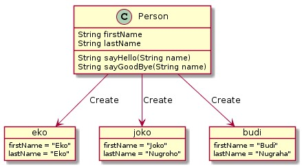
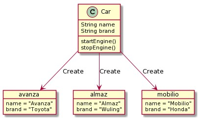
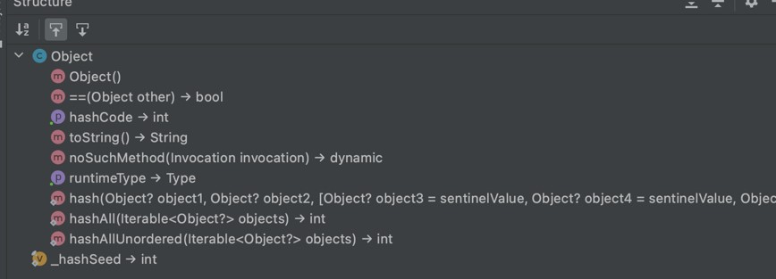

# Dart Object Oriented Programming

## Sebelum Belajar

- Dart Dasar

## Agenda

- Pengenalan Object Oriented Programming
- Class
- Field
- Method
- Constructor
- Inheritance
- Exception
- Dan lain-lain

## #1 Pengenalan Object Oriented Programming

### Apa itu Object Oriented Programming

- Object Oriented Programming adalah sudut pandang bahasa pemrograman yang berkonsep `"objek"`
- Ada banyak sudut pandang bahasa pemrograman, namun OOP adalah yang sangat populer saat ini.
- Ada beberapa istilah yang perlu dimengerti dalam OOP, yaitu: `Object` dan `Class`

### Apa itu Object?

- Object adalah data yang berisi field / properties / attributes dan method / function / behavior
- Semua data di Dart adalah Object

### Apa itu Class?

- Class adalah blueprint, prototype atau cetakan untuk membuat Object
- Class berisikan deklarasi semua properties dan functions yang dimiliki oleh Object
- Setiap Object selalu dibuat dari Class
- Dan sebuah Class bisa membuat Object tanpa batas

### Class dan Object: Person



### Class dan Object : Car



## #2 Membuat Project

- `dart create belajar_dart_oop`

## #3 Class

### Membuat Class

- Untuk membuat class, kita bisa menggunakan kata kunci `class`
- Penamaan class biasa menggunakan format `PascalCase`

### Kode: Class

```dart
class Person {

}
```

## #4 Object

### Membuat Object

- Object adalah hasil instansiasi dari sebuah class
- Untuk membuat object kita bisa menggunakan nama class lalu diikuti dengan kurung `()`

### Kode: Object

```dart
var person1 = Person();

Person person2 = Person();
```

## #5 Field

- Fields / Properties / Attributes adalah data yang bisa kita sisipkan di dalam Object
- Namun sebelum kita bisa memasukkan data di fields, kita harus mendeklarasikan data apa saja yang dimiliki object tersebut di dalam deklarasi class-nya
- Membuat field sama seperti membuat variable, namun ditempatkan di block class
- Field wajib dimasukkan nilai nya, kecuali field yang nullable

### Kode: Field

```dart
class Person {

	String name = "Guest";
	String? address;
	final String country = "Indonesia";
}
```

### Manipulasi Field

- Fields yang ada di object, bisa kita manipulasi. Tergantung final atau bukan.
- Jika final, berarti kita tidak bisa mengubah data field nya, namun jika tidak, kita bisa mengubah field nya
- Untuk memanipulasi data field, sama seperti cara pada variable
- Untuk mengakses field, kita butuh kata kunci `.` (titik) setelah nama object dan diikuti nama field nya

### Kode: Manipulasi Field

```dart
var person = Person();
person.name = "Eko Kurniawan";
person.address = "Subang";
// person.country = "Tidak Bisa Diubah";

print(person.name);
print(person.address);
print(person.country);
```

## #6 Method

- Selain menambahkan field, kita juga bisa menambahkan method ke object
- Method adalah function yang terdapat di dalam class
- Cara dengan mendeklarasikan method tersebut di dalam block class
- Sama seperti function biasanya, kita juga bisa menambahkan return value, parameter di method yang ada di dalam block class
- Untuk mengakses method tersebut, kita bisa menggunakan tanda titik `(.)` dan diikuti dengan nama method nya. Sama seperti mengakses field

### Kode: Method

```dart
class Person {

	String name = "Guest";
	String? address;
	final String country = "Indonesia";

	void sayHello(String paramName) {
		print("Hello $paramName, My Name is $name");
	}
}
```

### Kode: Memanggil Method

```dart
var person = Person();
person.name = "Eko Kurniawan";

person.sayHello("Budi");
```

## #7 Method Expression Body

- Saat membuat method, kadang-kadang kita hanya menggunakan satu baris kode
- Jika kita membuat method dengan body yang sangat sederhana, kita bisa gunakan expression body
- Expression body mirip seperti ketika kita membuat anonymous function

### Kode: Method Expression Body

```dart
class Computer {

	void startup() => print("computer is starting");

	void shutdown() => print("computer is shutting down");

	String getOperatingSystem() => "linux";
}
```

### Kode: Memanggil Method Expression Body

```dart
void main() {
	var computer = Computer();
	computer.startup();
	computer.shutdown();
	print(computer.getOperatingSystem());
}
```

## #8 Extension Method

- Extension Method adalah cara menambahkan method terhadap Class yang sudah ada, tanpa harus mengubah Class tersebut
- Hal ini kadang bermanfaat jika misal Class nya adalah Class milik library yang bukan kita yang membuatnya

### Membuat Extension Method

- Membuat Extension Method hampir mirip dengan membuat class, namun kita perlu menggunakan kata kunci extension diikuti nama extension lalu diikuti kata kunci on dan nama Class yang ingin kita tambahkan extension method nya

### Kode: Extension Method

```dart
extension GoodByeOnPerson on Person {

	void sayGoodBye(String paramName) {
		print('Good Bye $paramName, from $name');
	}
}
```

### Kode: Menggunakan Extension Method

```dart
void main() {
	var person = Person();
	person.name = "Eko";
	person.sayGoodBye("Budi");
}
```

## #9 Operator

- Operator adalah method dengan nama yang spesial
- Dart memperbolehkan kita membuat method dengan nama operator

### Daftar Operator

`<`, `+`, `|`, `>>>`
`>`, `/`, `^`, `[]`
`<=`, `~/`, `&`, `[]=`
`>=`, `*`, `<<`, `~`
`-`, `%`, `>>`, `==`

### Membuat Operator

- Untuk membuat operator, kita bisa seperti membuat Method, namun nama method diganti menjadi kata kunci operator diikuti dengan operator nya

### Kode: Membuat Operator

```dart
class Orange {
	int quantity = 0;

	Orange operator +(Orange orange) {
		var result = Orange();
		result.quantity = quantity + orange.quantity;
		return result;
	}
}
```

### Kode: Menggunakan Operator

```dart
void main() {
	var orange1 = Orange();
	orange1.quantity = 10;

	var orange2 = Orange();
	orange2.quantity = 10;

	var orange3 = orange1 + orange2;
	print(orange3.quantity);
}
```

## #10 Constructor

- Saat kita membuat Object, maka kita seperti memanggil sebuah method, karena kita menggunakan kurung `()`
- Di dalam class, kita bisa membuat constructor, constructor adalah method yang akan dipanggil saat pertama kali Object dibuat.
- Mirip seperti di method, kita bisa memberi parameter pada constructor
- Nama constructor harus sama dengan nama class, dan tidak membutuhkan kata kunci void atau return value
- Ketika kita menambahkan Constructor pada class, maka saat membuat Object baru, kita wajib mengikuti parameter yang ada di Constructor

### Kode: Membuat Constructor

```dart
class Person {

	String name = "Guest";
	String? address;
	final String  country = "Indonesia";

	Person(String paramName, String paramAdress) {
		name = paramName;
		address = paramAddress;
	}

	void sayHello(String paramName) {
		print("Hello $paramName, My Name is $name");
	}
}
```

### Kode: Menggunakan Constructor

```dart
var person = Person("Eko Kurniawan", "Subang");

person.name = "Eko Khannedy";
person.sayHello("Budi");
```

## #11 Variable Shadowing

- Variable shadowing adalah kejadian ketika kita membuat nama variable dengan nama yang sama di scope yang menutupi variable dengan nama yang sama di scope diatasnya
- Ini biasa terjadi seperti kita membuat nama parameter di method sama dengan nama field di class
- Saat terjadi variable shadowing, maka secara otomatis variable di scope diatasnya tidak bisa diakses

### Kode: Variable Shadowing

```dart
class Person {

	String name = "Guest";
	String? address;
	final String  country = "Indonesia";

	Person(String name, String address) {
		name = name; // field name tidak berubah
		address = address; //  field address tidak berubah
	}
}
```

## #12 This Keyword

- Saat kita membuat kode di dalam block constructor atau method di dalam class, kita bisa menggunakan kata kunci this untuk mengakses object saat ini
- Misal kadang kita butuh mengakses sebuah field yang namanya sama dengan parameter method, hal ini tidak bisa dilakukan jika langsung menyebut nama field, kita bisa mengakses nama field tersebut dengan kata kunci this
- This juga tidak hanya digunakan untuk mengakses field milik object saat ini, namun juga bisa digunakan untuk mengakses method
- This bisa digunakan untuk mengatasi masalah variable shadowing

### Kode: This Keyword

```dart
class Person {

	String name = "Guest";
	String? address;
	final String  country = "Indonesia";

	Person(String name, String address) {
		this.name = name;
		this.address = address;
	}
}
```

## #13 Initializing Formal Parameter

- Kadang saat membuat Constructor, biasanya kita membuat parameter yang hanya digunakan untuk mengubah nilai yang ada di field
- Untuk kasus ini, kita bisa menggunakan fitur Formal Parameter, dimana pada parameter kita bisa langsung sebutkan field mana yang akan diubah
- Formal Parameter hanya bisa digunakan di Constructor, tidak bisa digunakan di Method
- Caranya kita cukup ubah parameternya dengan menggunakan this.namaField nya, tanpa perlu menggunakan tipe data

### Kode: Initializing Formal Parameter

```dart
class Person {

	String name = "Guest";
	String? address;
	final String  country = "Indonesia";

	Person(this.name, this.address) {

	}
}
```

## #14 Named Constructor

- Constructor hanya bisa dibuat satu saja, mirip seperti function atau method, kita tidak bisa membuat beberapa dengan nama yang sama.
- Namun terdapat fitur yang bernama Named Constructor, yaitu Constructor dengan nama yang berbeda
- Dengan menggunakan Named Constructor, kita bisa membuat Constructor lebih dari satu, namun wajib menggunakan nama yang berbeda
- Untuk membuatnya kita bisa menggunakan nama `Class.namaConstructor` nya
  Named Constructor bisa lebih dari satu

### Kode: Named Constructor

```dart
Person(this.name, this.address) {

}

Person.withName(this.name) {

}

Person.withAddress(this.address) {

}
```

### Menggunalan Named Constructor

- Untuk membuat Object menggunakan Named Constructor, kita bisa langsung mengakses menggunakan `Class.namedConstructor()`

### Kode: Menggunakan Named Constructor

```dart
var person1 = Person.withName("Eko Kurniawan");
var person2 = Person.withAddress("Subang");
var person3 = Person("Eko", "Subang");
```

## #15 Redirecting Constructor

- Saat membuat Named Constructor, kita bisa memanggil Default Constructor, atau istilahnya adalah melakukan Redirecting Constructor
- Cara membuat Redirecting Constructor adalah dengan menambahkan `:` (titik dua), lalu diikuti dengan memanggil `this(parameter)`, dimana `this()` disini adalah dianggap mengakses Default Constructor
- Saat membuat Redirecting Constructor, kita tidak bisa menambahkan body pada Redirecting Constructor

### Kode: Redirecting Constructor

```dart
Person(this.name, this.address) {

}

Person.withName(String name): this(name, "");

Person.withAddress(String address): this("", address);
```

## Redirecting ke Named Constructor

- Redirecting juga bisa dilakukan ke Named Constructor
- Caranya kita ganti ketika memanggil this menjadi `this.namedConstructor()`

### Kode: Redirecting Named Constructor

```dart
Person(this.name, this.address) {

}

Person.withName(String name) : this(name, "");

Person.withAddress(String address) : this("", address);

Person.fromJakarta() : this.withAddress("Jakarta");
```

## #16 Initializer List

- Saat kita membuat Constructor atau Named Constructor, terdapat fitur yang bernama Initializer List
- Initializer List merupakan tempat dimana kita bisa mengubah field pada Object, sebelum block body Constructor
- Hal ini menjadi lebih mudah dibanding mengubah field di dalam block Constructor

### Kode: Initializer List

```dart
class Customer {
	String firstName = '';
	String lastName = '';
	String fullName = '';

	Customer(this.fullName)
		: firstName = fullName.split(" ")[0],
		  lastName = fullName.split(" ")[1] {
		print('Create new Customer');
	}
}
```

## #17 Constant Constructor

- Saat kita membuat Class yang tidak pernah berubah datanya (immutable data), ada baiknya kita buat Constructor nya dalam bentuk constant
- Untuk membuat constant constructor kita bisa gunakan kata kunci `const`
- Keuntungan saat menggunakan Constant Constructor adalah, ketika kita membuat constant object, secara otomatis object yang sama akan digunakan

### Kode: Constant Constructor

```dart
class ImmutablePoint {
	final int x;
	final int y;

	const ImmutablePoint(this.x, this.y);
}
```

### Kode: Menggunakan Constant Constructor

```dart
void main() {
	var point1 = const ImmutablePoint(10, 10);
	var point2 = const ImmutablePoint(10, 10);

	print(point1, point2)
}
```

## #18 Factory Constructor

- Factory Constructor adalah sebuah fitur dimana kita bisa membuat constructor untuk membuat object baru, namun logika cara pembuatan object barunya bisa kita sesuaikan dengan yang kita inginkan
- Misal kita ingin mengembalikan object yang sama berkali-kali, kita bisa menggunakan Factory Constructor
- Untuk membuat Factory Constructor kita bisa menggunakan kata kunci factory sebelum pembuatan Constructor nya

### Kode: Factory Constructor

```dart
class Database {
	Database() {
		print('Create new Database');
	}

	static Database database = Database();

	factory Database.get() {
		return database;
	}
}
```

### Kode: Menggunakan Factory Constructor

```dart
void main() {
	var database1 = Database.get();
	var database2 = Database.get();

	print(database1, database2);
}
```

## #19 Cascade Notation

- Cascade Notation merupakan operator yang bisa kita gunakan untuk memberikan beberapa operasi pada object yang sama
- Ada dua jenis Cascase Notation, yaitu `..` (titik titik), dan `?..` (tanda tanya titik titik)
- `..` digunakan untuk object yang tidak nullable, sedangkan `?..` digunakan untuk object yang nullable

### Kode: Tanpa Cascade Notation

```dart
class User {
	String? username;
	String? name;
	String? email;
}

void main() {
	var user = User();
	user.username = "eko";
	user.name = "Eko Kurniawan";
	user.email = "eko@example.com";
}
```

### Kode: Menggunakan Cascade Notation

```dart
void main() {
	var user = User()
		..username = "eko"
		..name = "Eko Kurniawan"
		..email = "eko@example.com";
}
```

### Kode: Nullable Cascade Notation

```dart
User? createUser() {
	return null;
}

void main() {
	User? user = creteUser()
		?..username = "eko"
		..name = "Eko Kurniawan"
		..email = "eko@example.com";
}
```

## #20 Inheritance

- Inheritance atau pewarisan adalah kemampuan untuk menurunkan sebuah class ke class lain
- Dalam artian, kita bisa membuat class Parent dan class Child
- Class Child, hanya bisa punya satu class Parent, namun satu class Parent bisa punya banyak class Child
- Saat sebuah class diturunkan, maka semua field dan method yang ada di class Parent, secara otomatis akan dimiliki oleh class Child
- Untuk melakukan pewarisan, di class child, kita harus menggunakan kata kunci extends lalu diikuti dengan nama class parent nya.

### Kode: Inheritance

```dart
class Manager {
	String? name;

	void sayHello(String name) {
		print('Hello $name, my name is ${this.name}');
	}
}

class VicePresident extends Manager {

}
```

### Kode: Mengakses Method Parent

```dart
void main() {
	var manager = Manager();
	manager.name = 'Eko';
	manager.sayHello('Budi');

	var vp = VicePresident();
	vp.name = "Kurniawan";
	vp.sayHello("Budi");
}
```

## #21 Method Overriding

- Method overriding adalah kemampuan mendeklarasikan ulang method di child class, yang sudah ada di parent class
- Saat kita melakukan proses overriding tersebut, secara otomatis ketika kita membuat object dari class child, method yang di class parent tidak bisa diakses lagi
- Saat melakukan method overriding, kita harus pastikan deklarasi method nya harus sama dengan di parent class nya

### Kode: Method Overriding

```dart
class Manager {
	String? name;

	void sayHello(String name) {
		print('Hello $name, my name is Manager ${this.name}');
	}
}

class VicePresident extends Manager {

	void sayHello(String name) {
		print('Hello $name, my name is VP ${this.name}');
	}
}
```

### Kode: Mengakses Method Overriding

```dart
void main() {
	var manager = Manager();
	manager.name = 'Budi';
	manager.sayHello('Joko');

	var vp = VicePresident();
	vp.name = "Eko";
	vp.sayHello("Joko");
}
```

## #22 Field Overriding

- Field overriding adalah kemampuan mendeklarasikan ulang field di child class, yang sudah ada di parent class
- Saat kita melakukan proses overriding tersebut, secara otomatis ketika kita membuat object dari class child, field yang di class parent tidak bisa diakses lagi
- Saat melakukan method overriding, kita harus pastikan deklarasi field nya harus sama dengan di parent class nya

### Kode: Field Overriding

```dart
class Person {
	String name = "Person";

	void sayHello(String name) {
		print('Hello ${name}, my name is ${this.name}');
	}
}

class OtherPerson extends Person {
	String name = "Other Person";
}
```

### Kode: Mengakses Field Overriding

```dart
void main() {
	ver person = OtherPerson();
	person.sayHello("Eko");
}
```

## #23 Super Keyword

- Kadang kita ingin mengakses method yang terdapat di class parent yang sudah terlanjur kita override di class child
- Untuk mengakses method milik class parent, kita bisa menggunakan kata kunci super
- Sederhananya, super digunakan untuk mengakses class parent
- Tidak hanya method, field milik parent class pun bisa kita akses menggunakan kata kunci super

### Kode: Super Keyword

```dart
class Shape {
	int getCorner() {
		return 0;
	}
}

class Rectangle extends Shape {
	int getCorner() {
		return 4;
	}

	int getParentCorner() {
		return super.getCorner();
	}
}
```

### Kode: Mengakses Super Keyword

```dart
void main() {
	var rectangle = Rectangle();

	print(rectangle.getCorner());
	print(rectangle.getParentCorner());
}
```

## #24 Super Constructor

- Tidak hanya untuk mengakses method atau field yang ada di parent class, kata kunci super juga bisa digunakan untuk mengakses constructor
- Namun syaratnya untuk mengakses parent class constructor, kita harus mengaksesnya di dalam class child constructor
- Memanggil super constructor hanya bisa dilakukan dalam bentuk Redirecting Constructor

### Kode: Super Constructor

```dart
class Manager {
	String? name;

	Manager(String name) {
		this.name = name;
	}
}

class VicePresident extends Manager {

	VicePresident(String name) : super(name) {

	}
}
```

### Kode: Menggunakan Super Constructor

```dart
void main() {
	var manager = Manager('Eko');
	manager.sayHello('Budi');

	var vp = VicePresident("Kurniawan");
	vp.sayHello("Budi")
}
```

## #25 Object Class

- Setiap class yang kita buat secara otomatis adalah turunan dari class Object, kecuali null
- Walaupun tidak secara langsung kita eksplisit menyebutkan extends Object, tapi secara otomatis akan membuat class kita extends Object
- Bisa dikatakan class Object adalah superclass untuk semua class
- <https://api.dart.dev/stable/2.14.4/dart-core/Object-class.html>

### Isi Class Object



### Kode: Menggunakan Class Object Method

```dart
class Person {}

void main() {
	var number = 100;
	print(number.toString());

	var person = Person();
	print(person.toString());
}
```

## #26 Polymorphism

- Polymorphism berasal dari bahasa Yunani yang berarti banyak bentuk.
- Dalam OOP, Polymorphism adalah kemampuan sebuah object berubah bentuk menjadi bentuk lain
- Polymorphism erat hubungannya dengan Inheritance

### Kode: Inheritance

```dart
class Employee {
	String? name;

	Employee(this.name);
}

class Manager extends Employee {
	Manager(String name) : super(name);
}

class ViceManager extends Manager {
	VicePresident(String name) : super(name);
}
```

### Kode: Polymorphism

```dart
void main() {
	Employee employee = Employee('Eko');
	print(employee);

	employee = Manager("eko");
	print(employee);

	employee = VicePresident("eko");
	print(employee);
}
```

### Kode: Method Polymorphism

```dart
void sayHello(Employee employee) {
	print('Hello ${employee.name}');
}

void main() {
	sayHello(Employee('Eko'));
	sayHello(Manager('Eko'));
	sayHello(VicePresident('Eko'));
}
```

## #27 Type Check & Casts

- Saat menggunakan polimorfisme, kadang kita ingin melakukan konversi tipe data ke tipe data aslinya
- Namun agar aman, sebelum melakukan konversi, pastikan kita melakukan type check (pengecekan tipe data), dengan menggunakan kata kunci `is`
- Hasil operator is adalah `boolean`, true jika tipe data sesuai, false jika tidak sesuai
- Untuk melakukan konversi tipe data Object, kita bisa gunakan kata kunci `as`

### Kode: Type Check & Casts

```dart
void sayHello(Employee employee) {
	if (employee is VicePresident) {
		VicePresident vicePresident = employee as VicePresident;
		print('Hello Vice President ${vicePresident.name}');
	} else if (employee is Manager) {
		Manager manager = employee as Manager;
		print('Hello Manager ${manager.name}');
	} else {
		print('Hello ${employee.name}');
	}
}
```

## #28 Import

- Import adalah kemampuan untuk menggunakan class, function atau variable yang berada di file yang berbeda
- Import sangat cocok digunakan ketika kode program kita sudah banyak dan ditempatkan di bayak file

### Kode: Class Category di data/category.dart

```dart
class Category {
	String id = "";
	String name = "";

	Category(this.id, this.name);
}
```

### Kode: Import

```dart
import 'data/category.dart';

void main() {
	var category = Category("1", "Gadget");

	print(category.id);
	print(category.name);
}
```

## #29 Abstract Class

- Saat kita membuat class, kita bisa menjadikan sebuah class sebagai abstract class.
- Abstract class artinya, class tersebut tidak bisa dibuat sebagai object secara langsung, hanya bisa diturunkan
- Untuk membuat sebuah class menjadi abstract, kita bisa menggunakan kata kunci abstract sebelum kata kunci class
- Dengan demikian abstract class bisa kita gunakan sebagai kontrak untuk class child

### Kode: Abstract Class

```dart
abstract class Location {
	String? name;
}

class City extends Location {
	City(String name) {
		this.name = name;
	}
}
```

### Kode: Membuat Abstract Class

```dart
import 'data/category.dart';

void main() {
	var city = City('Subang');
	var location = Location(); // error
}
```

## #30 Abstract Method

- Saat kita membuat class yang abstract, kita bisa membuat abstract method juga di dalam class abstract tersebut
- Saat kita membuat sebuah abstract method, kita tidak boleh membuat block method untuk method tersebut
- Artinya, abstract method wajib di override di class child

### Kode: Abstract Method

```dart
abstract class Animal {
	String? name;

	void run();
}

class Cat extends Animal {
	void run() {
		print('Cat $name is running');
	}
}
```

### Kode: Menggunakan Abstract Method

```dart
import 'dart/animal.dart';

void main() {
	Animal animal = Cat();
	animal.name = "Puss";
	animal.run();
}
```

## #31 Access Modifier

- Secara default, saat kita membuat Field atau Method dalam sebuah class, maka semua Field dan Method tersebut bisa diakses oleh siapa saja
- Kadang-kadang kita ingin menyembunyikan Field atau Method
- Untuk menyembunyikan akses Field atau Method, kita bisa menambahkan `_` (underscore) di awal Field atau Method nya
- Secara otomatis Field atau Method tersebut, hanya bisa di akses dari file tersebut, dan artinya tidak bisa diakses dari luar file

### Kode: Access Modifier

```dart
class Product {
	String? id;
	String? name;
	Int? _quantity; // tidak bisa diakes diluar directory

	int? getQuantity() {
		return _quantity;
	}
}
```

### Kode: Menggunakan Access Modifier

```dart
import 'data/product.dart';

void main() {
	var product = Product();
	product.id = "1";
	product.name = "Mac Book Pro";
	product._quantity = 100; // error
}
```

## #32 Getter dan Setter

### Encapsulation

- Encapsulation artinya memastikan data sensitif sebuah object tersembunyi dari akses luar
- Hal ini bertujuan agar kita bisa menjaga agar data sebuah object tetap baik dan valid
- Untuk mencapai ini, biasanya kita akan membuat semua field yang tidak bisa diakses dari luar
- Agar bisa diubah, kita akan menyediakan method untuk mengubah dan mendapatkan field tersebut

### Getter dan Setter

- Proses encapsulation sudah dibuat standarisasinya, dimana kita bisa menggunakan Getter dan Setter method.
- Getter adalah function yang dibuat untuk mengambil data field
- Setter ada function untuk mengubah data field
- Untuk Getter, kita bisa menggunakan kata kunci `get`
- Untuk Setter, kita bisa menggunakan kata kunci `set`

### Kode: Getter dan Setter

```dart
class Rectangle {
	int _width = 0;
	int _length = 0;

	int get width {
		return _width;
	}

	set with(int value) {
		_width = value;
	}
}
```

### Expression Body

- Jika Getter dan Setter yang kita buat isinya hanya mengambil dan mengubah field, disarankan untuk menggunakan Expression Body
- Cara membuat Expression Body mirip seperti Anonymous Function

### Kode: Getter dan Setter Expression Body

```dart
class Rectangle {
	int _width = 0;
	int _length = 0;

	int get width => _width;

	set width(int value) => _width = value;

	int get length => _length;

	set length(int value) => _length = value;
}
```

### Getter dan Setter Yang Tidak Perlu

- Dalam bahasa pemrograman seperti Java atau C#, penggunaan Getter dan Setter sudah menjadi sesuatu yang sangat lumrah, hal ini karena mengakses Field dan Method sangatlah berbeda, oleh karena itu dari awal selalu dibuat Getter dan Setter
- Di Dart, hal ini tidak berlaku, jika isi Getter dan Setter hanya melakukan redirect data ke Field, disarankan tidak perlu menggunakan Getter dan Setter, cukup langsung saja menggunakan Field
- Hal ini dikarenakan dalam Dart, jika kedepannya kita ingin menambah Getter dan Setter, kita bisa tambahkan, tanpa harus mengubah kode client
- <https://dart-lang.github.io/linter/lints/unnecessary_getters_setters.html>

### Kode: Validation di Setter

```dart
class Rectangle {
	int _width = 0;
	int _length = 0;

	int get width => _width;

	set width(int value) {
		if (value >= 1) {
			_width = value;
		}
	}
}
```

## #33 Interface

- Sebelumnya kita sudah tahu bahwa abstract class bisa kita gunakan sebagai kontrak untuk class child nya.
- Namun sebenarnya yang lebih tepat untuk kontrak adalah Interface
- Jangan salah sangka bahwa Interface disini bukanlah User Interface
- Interface mirip seperti abstract class, yang membedakan adalah di Interface, semua method otomatis abstract
- Untuk mewariskan interface, kita tidak menggunakan kata kunci extends, melainkan implements

### Membuat Interface

- Hal yang sangat berbeda di Dart dan bahasa pemrograman Java, PHP dan lain-lain adalah saat kita membuat Interface
- Interface di Dart bisa diambil dari class apapun, saat kita membuat sebuah class, secara otomatis class tersebut merupakan interface untuk class itu sendiri
- Interface dari class tersebut, bisa kita gunakan pada class lain jika kita ingin
- Maka secara otomatis, kita harus mendeklarasikan semua method dan field yang terdapat pada class tersebut, karena yang kita ambil sebenarnya adalah interface nya, bukan class nya
- Anggap saja Interface adalah kontrak dari pembuatan Class

### Kode: Membuat Class

```dart
class Car {
	String name = "";

	void drive() {}

	int getTrie() {
		return 0;
	}
}
```

### Kode: Implement Interface

```dart
class Avanza implements Car {
	String name = 'Avanza';

	void drive() {
		print('Drive Avanza');
	}

	int getTire() {
		return 4;
	}
}
```

## #34 Multiple Interface Inheritance

- Hal yang membedakan ketika kita melakukan pewarisan adalah, kita hanya bisa melakukan extends terhadap satu class, namun kita bisa melakukan implements terhadap beberapa class
- Hal ini dikarenakan sebenarnya implements bukanlah melakukan pewarisan, melainkan mendeklarasikan ulang seluruh method dan field
- Anggap saja ini seperti membuat class yang berbeda, namun memiliki field dan method yang sama
- Untuk melakukan multiple implements, kita bisa gunakan pemisah tanda koma antar class yang kita implements

### Kode: Multiple Interface

```dart
abstract class HasBrand {
	String getBrand();
}

class Avanza implements Car, HasBrand {
	String name = "Avanza";

	String getBrang() => "Toyoya";
}
```

## #35 Mixin

- Mixin merupakan reusable code yang bisa digunakan di kelas lain tanpa harus terkendala dengan pewarisan
- Mixin mirip melakukan copy paste code di beberapa tempat, namun dengan cara yang lebih baik
- Dengan Mixin, kita bisa membuat kode yang sama pada beberapa class
- Satu Class bisa menambah lebih dari satu mixin, sama seperti interface
- Untuk membuat Mixin, kita bisa menggunakan kata kunci `mixin`
- Untuk menggunakan Mixin, kita bisa menggunakan kata kunci `with`, diikuti dengan Mixin nya

### Kode: Membuat Mixin

```dart
mixin Playable {
	String? name;

	void play() {
		print('Play $name');
	}
}

mixin Stoppable {
	String? name;

	void stop() {
		print('Stop $name');
	}
}
```

### Kode: Menggunakan Mixin

```dart
class Video with Playable, Stoppable {

}

class Audio with Playable, Stoppable {

}
```

### Membatasi Mixin

- Secara default, semua class bisa menggunakan Mixin
- Namun jika kita ingin membatasi hanya class turunan tertentu, kita bisa tambahkan kata kunci `on`, diikuti dengan class yang kita batasi pada Mixin nya

### Kode: Membatasi Mixin

```dart
abstract class Multimedia {}

mixin Playable on Multimedia {
	String? name;

	void play() {
		print('Play $name');
	}
}
```

### Kode: Menggunakan Mixin

```dart
class Video extends Multimedia with Playable, Stoppable {}

class Audio extends Multimedia with Playable, Stoppable {}

void main() {
	var video = Video();
	video.play();

	var audio = Audio();
	audio.play();
}
```

## #36 ToString Method

- Sebelumnya kita sudah bahas bahwa parent class untuk semua class kecuali null adalah Object
- Di dalam Object, terdapat method bernama `toString()`, method ini merupakan method untuk representasi String dari object
- Contohnya, saat kita menggunakan function `print(object)`, sebenarnya yang dipanggil adalah `print(object.toString())`
- Kita bisa meng-override method `toString()` jika ingin mengimplementasikan representasi data String dari Class yang kita buat

### Kode: ToString Method

```dart
class Product {
	String? id;
	String? name;
	int? _quantity; // tidak bisa diakses diluar directory

	int? getQuantity() {
		return _quantity;
	}

	String toString() {
		return 'Product{id: $id, name: $name, quantity: $_quantity}';
	}
}
```

### Kode: Menggunakan ToString Method

```dart
import 'data/product.dart';

void main() {
	var product = Product();
	print(product.toString());
	print(product);
}
```

## #37 Equals Operator

- Untuk membandingkan dua buah object apakah sama atau tidak, biasanya kita menggunakan operator `==`
- Secara default operator `==` adalah milik class Object, implementasinya jika kita menggunakan operator `==` milik class Object adalah akan melakukan pengecekan kesamaan object dari lokasi di memory
- Kadang-kadang, kita ingin mengimplementasikan logika untuk membandingkan object
- Untuk hal ini, kita bisa melakukan override operator `==` yang ada di class Object

### Kode: Equals Salah

```dart
import 'data/category.dart';

void main() {
	var category1 = Category('1', 'Laptop');
	var category2 = Category('1', 'Laptop');

	print(category1 == category2);
}
```

### Kode: Override Equals Method

```dart
bool operator ==(Object other) {
	if (other is Category) {
		if (id != other.id) return false;
		if (name != other.name) return false;
		return true;
	} else {
		return false;
	}
}
```

## #38 HashCode Getter

- HashCode Getter adalah representasi integer object kita, mirip toString yang merupakan representasi String, hashCode adalah representasi integer
- HashCode sangat bermanfaat untuk membuat struktur data unique seperti HashMap, HashSet, dan lain-lain, karena cukup menggunakan hashCode method untuk mendapatkan identitas unique object kita
- Secara default hashCode akan mengembalikan nilai integer sesuai data di memory, namun kita bisa meng-override nya jika kita ingin

### Kontrak HashCode Method

Tidak mudah meng-override method hashCode, karena ada kontraknya :

- Sebanyak apapun hashCode dipanggil, untuk object yang sama, harus menghasilkan data integer yang sama
- Jika ada 2 object yang sama jika dibandingkan menggunakan method equals, maka nilai hashCode nya juga harus sama

### Kode: Override HashCode Method

```dart
class Category {
	String id = "";
	String name = "";

	Category(this.id, this.name);

	int get hasCode {
		var result = id.hashCode;
		result += name.hashCode;
		return result;
	}
}
```

### Kode: Menggunakan HashCode

```dart
import 'data/category.dart';

void main() {
	var category1 = Category('1', 'Laptop');
	print(category1.hashCode);

	var category2 = Category('1', 'Laptop');
	print(category2.hashCode);

	print(category1.hashCode == category2.hashCode);
}
```

## #39 No Such Method

- NoSuchMethod merupakan sebuah method yang terdapat di class Object yang bisa kita override untuk mendeteksi atau bereaksi ketika sebuah method yang tidak ada dipanggil
- NoSuchMethod hanya bisa digunakan ketika tipe objectnya adalah dynamic atau sebuah abstract class
- <https://api.dart.dev/stable/2.14.4/dart-core/Object/noSuchMethod.html>
- <https://api.dart.dev/stable/2.14.4/dart-core/Invocation-class.html>

### Kode: Membuat NoSuchMethod

```dart
class Repository {
	final String _name;

	Repository(this._name);

	noSuchMethod(Invocation invocation) {
		var column = MirrorSystem.getName(invocation.memberName);
		ver value = invocation.positionalArguments.first;
		var sql = "select * from $_name where $colum = '$value'";
		print(sql);
	}
}
```

### Kode: Menggunakan NoSuchMethod

```dart
import 'dart/repository.dart';

void main() {
	dynamic repository = Repository('product');

	repository.id('1234');
}
```

### NoSuchMethod untuk Abstract Class

- Salah satu penggunaan NoSuchMethod yang biasanya digunakan adalah sebagai implementasi Abstract Class
- Dengan menggunakan NoSuchMethod, kita tidak perlu mengimplementasikan method yang terdapat di abstract class lagi

### Kode: NoSuchMethod Abstract Class

```dart
abstract class CategoryRepository {
	void id(String id);

	void name(String name);
}

class Repository extends CategoryRepository {
	final String _name;
}
```

### Kode: Menggunakan NoSuchMethod

```dart
import 'dart/repository.dart';

void main() {
	CategoryRepository categoryRepository = Repository('category');
	categoryRepository.id('1234');
	categoryRepository.name('Laptop');
}
```

### NoSuchMethod untuk Interface

- Selain Abstract Class, NoSuchMethod juga bisa digunakan sebagai implementasi untuk Interface

## #40 Callable Class

- Callable Class merupakan class yang bisa dipanggil seperti function
- Untuk membuat Callable Class, kita perlu menambahkan sebuah method bernama `call()` di class tersebut
- Parameter dan Return Value dari Method tersebut bisa disesuaikan sesuai keinginan kita
- Setelah membuat objectnya, kita bisa langsung memanggil method `call()` tersebut menggunakan nama objectnya saja

### Kode: Callable Class

```dart
class Sum {
	int first;
	int second;

	Sum(this.first, this.second);

	int call() => first + second;
}
```

### Kode: Menggunakan Callable Class

```dart
import 'dart/sum.dart';

void main() {
	var sum = Sum(10, 10);

	var total = sum();
	print(total);
}
```

## #41 Typedef

- Typedef merupakan fitur dimana kita bisa membuat alias untuk tipe data lainnya
- Ini cocok ketika misal terdapat class dengan nama yang sama, sehingga kita bisa menggunakan alias untuk nama lain
- Atau kita bisa mempersingkat nama class yang panjang dengan alias

### Kode: Typedef

```dart
class Sum {
	int first;
	int second;

	Sum(this.first, this.second);

	int call() => first + second;
}

typedef Total = Sum;
typedef Jumlah = Sum;
```

### Kode: Menggunakan Typedef

```dart
import 'dart/sum.dart';

void main() {
	var jumlah = Jumlah(10, 10);
	print(jumlah());

	var total = Total(10, 10);
	print(total());
}
```

### Typedef untuk Function

- Typedef juga tidak hanya bisa digunakan untuk membuat alias untuk Class, tapi juga bisa digunakan untuk membuat alias untuk Function
- Namu perlu diperhatikan, sangat direkomendasikan tetap mendeklarasikan Function menggunakan deklarasi function nya, dibandingkan menggunakan `typedef`
- <https://dart.dev/guides/language/effective-dart/design#prefer-inline-function-types-over-typedefs>

### Kode: Typedef untuk Function

```dart
typedef Filter = String Function(String);

void sayHello(String name, Filter filter) {
	print('Hello ${filter(name)}');
}

void main() {
	sayHello('Eko', (name) => name.toUpperCase());
}
```

## #42 Static

- Static merupakan sebuah kata kunci yang digunakan untuk membuat field dan method yang bisa diakses tanpa harus membuat object nya
- Saat kita membuat field atau method yang static, artinya dia secara otomatis bisa diakses oleh object manapun, oleh karena itu perlu hati-hati ketika membuat field atau method status
- Field atau Method static bisa diakses oleh Method yang tidak static
  Namun Field atau Method static tidak bisa mengakses Field atau Method yang tidak static
- Biasanya static digunakan untuk membuat utility
- Untuk mengakses static Field atau Method, kita bisa langsung menggunakan nama Class diikuti dengan titik dan static Field atau Method nya

### Kode: Static Field

```dart
class Application {
	static final String author = "Eko Kurniawan Khannedy";
	static final String name = "Belajar Pemrograman Dart";
}

void main() {
	print(Application.name);
	print(Application.author);
}
```

### Kode: Static Method

```dart
class Math {
	static int sum(int first, int second) => first + second;
}

void main() {
	var result = Math.sum(10, 10);
	print(result);
}
```

## #43 Enum

- Enum merupakan fitur untuk membuat tipe data yang sudah jelas nilainya
- Untuk membuat Enum, kita bisa menggunakan kata kunci `enum`

### Kode: Membuat Enum

```dart
enum CustomerLevel = { regular, premium, vip };

class Customer {
	String name;
	CustomerLevel level;

	Customer(this.name, this.level);
}
```

### Kode: Menggunakan Enum

```dart
import 'data/customer.dart';

void main() {
	var customer = Customer("Eko", CustomerLavel.vip);

	print(customer.name);
	print(customer.level);

	print(CustomerLevel.values);
}
```

## #44 Exception

- Saat kita membuat aplikasi, kita tidak akan terhindar dengan yang namanya error
- Error direpresentasikan dengan istilah exception, dan semua direpresentasikan dalam bentuk class exception
- Kita bisa menggunakan class exception sendiri, atau menggunakan yang sudah disediakan
- Untuk membuat sebuah exception, kita bisa menggunakan kata kunci `throw`, diikuti dengan object exception nya
- <https://api.dart.dev/stable/2.14.4/dart-core/Exception-class.html>

### Kode: Membuat Exception

```dart
class Validation {
	static void validate(String username, String password) {
		if (username == "") {
			throw Exception("Username is blank");
		} else if (password == "") {
			throw Exception("Password is blank");
		}
	}
}
```

### Membuat Class Exception

- Selain menggunakan class Exception yang sudah tersedia, kita juga bisa membuat class Exception sendiri
- Tidak ada kontrak dalam pembuatan class exception, kita bisa membuat class biasa
- Namun sangat direkomendasikan jika membuat class exception baru, kita melakukan implements ke class Exception

### Kode: Membuat Class Exception

```dart
class ValidationException implements Exception {
	String message;

	ValidationException(this.message);
}

class Validation {
	static void validate(String username, String password) {
		if (username == "") {
			throw ValidationException("Username is blank");
		} else if (password == "") {
			throw ValidationException("Password is blank");
		}
	}
}
```

### Try Catch

- Saat kita memanggil sebuah method yang bisa menyebabkan exception, maka secara otomatis program akan berhenti.
- Jika kita tidak ingin program berhenti, kita perlu menangkap exception tersebut, dan melakukan sesuatu ketika terjadi exception
- Untuk menangkap exception, kita bisa menggunakan try-catch
- Cara menggunakan try-catch sangat mudah, di block try, kita tinggal panggil method yang bisa menyebabkan exception, dan di block catch, kita bisa melakukan sesuatu jika terjadi exception

### Kode: Try Catch

```dart
void main() {
	try {
		Validation.validate("", "");
	} on ValidationException {
		print('Validation Error');
	}
}
```

### Kode: Menngkap Object Exception

```dart
void main() {
	try {
		Validation.validate("", "");
	} on ValidationException catch (exception) {
		print('Error : ${exception.message}');
	}
}
```

### Kode: Multiple Try Catch

```dart
class Validation {
	static void validate(String username, String password) {
		if (username == "") {
			throw ValidationException("Username is blank");
		} else if (password == "") {
			throw ValidationException("Password is blank");
		} else if (password != "eko" || password != "eko") {
			throw Exception("Login failed");
		}
	}
}

void main() {
	try {
		Validation.validate("", "");
	} on ValidationException catch (exception) {
		print('Error : ${exception.message}');
	} on Exception catch (exception) {
		print('Error : ${exception.message}');
	}
}
```

### Finally

- Dalam try-catch, kita bisa menambahkan block finally
- Block finally ini adalah block dimana akan selalu dieksekusi baik terjadi exception ataupun tidak
- Ini sangat cocok ketika kita ingin melakukan sesuatu, tidak peduli sukses ataupun gagal

### Kode: Finally

```dart
void main() {
	try {
		Validation.validat("eko", "salah");
	} on ValidationException catch (exception) {
		print('Error : ${exception.message}');
	} on Exception catch (exception) {
		print('Error : ${exception.message}');
	} finally {
		print('Program Selesai');
	}
}
```

### Try Catch Semua Exception

- Kadang kita tidak terlalu peduli dengan jenis class Exception
- Pada kasus seperti ini, kita bisa tidak menyebutkan class nya ketika melakukan try-catch

### Kode: Try Catch Semua Exception

```dart
void main() {
	try {
		Validation.validat("eko", "salah");
	} on ValidationException catch (exception) {
		print('Error : ${exception.message}');
	} catch (exception) {
		print('Error : ${exception.toString()}');
	} finally {
		print('Program Selesai');
	}
}
```

### Stack Trace

- Saat kita menangkap exception, object exception tidak memiliki informasi posisi atau lokasi terjadinya error
- Jika kita ingin mengetahui posisi atau lokasi terjadinya error, kita bisa menambahkan parameter kedua pada catch
- Secara otomatis parameter kedua tersebut adalah sebuah object StackTrace
- <https://api.dart.dev/stable/2.14.4/dart-core/StackTrace-class.html>

### Kode: Stack Trace

```dart
void main() {
	try {
		Validation.validat("eko", "salah");
	} on ValidationException catch (exception, stackTrace) {
		print('Error : ${exception.message}');
		print('Stack Trace : ${stackTrace.toString()}');
	} catch (exception, stackTrace) {
		print('Error : ${exception.toString()}');
		print('Stack Trace : ${stackTrace.toString()}');
	} finally {
		print('Program Selesai');
	}
}
```

## #45 Error

- Selain Exception, ada jenis kesalahan lagi yaitu Error
- Berbeda dengan Exception, Error adalah jenis kesalahan yang harus dihindari, dan jika terjadi, lebih baik segera hentikan program nya
- Error biasanya terjadi karena ada kesalahan pada kode program kita
- Contoh, kita mengakses index yang salah di List
- <https://api.dart.dev/stable/2.14.4/dart-core/Error-class.html>

### Kode: Error

```dart
void main() {
	var list = ["Eko", "Kurniawan", "Khannedy"];

	print(list[10]); // error
}
```

## #46 Metadata

- Metadata merupakan fitur yang digunakan untuk menambah informasi tambahan pada kode program yang kita buat
- Untuk menambahkan informasi tambahan ke dalam kode program kita, kita bisa menggunakan Annotation yang dimulai dengan karakter `@` lalu diikuti dengan constant atau memanggil constant constructor

### Standard Annotation

| Annotation    | Keterangan                                                                     |
| ------------- | ------------------------------------------------------------------------------ |
| `@Deprecated` | Menandai bahwa kode tersebut sudah tidak direkomendasikan digunakan            |
| `@override`   | Menandai bahwa field atau method tersebut merupakan overriding dari parent nya |

### Kode: Standard Annotatoin

```dart
class Sample {
	@override
	String toString() {
		return "Sample";
	}

	@Deprecated("Don's use it anymore")
	void doNotCallMe() {}
}
```

### Membuat Annotation

- Membuat Annotation sangat mudah, kita bisa membuat constant atau bisa membuat Class dengan menggunakan Constant Constructor

### Kode: Membuat Annotation

```dart
class Todo {
	final String todo;

	const Todo(this.todo);
}

class ApplicationLogic {
	@Todo("Will be implemented in next feature")
	void run() {}
}
```

### Manfaat Metadata

- Saat ini, metadata mungkin tidak terlihat begitu berguna
- Namun saat nanti kita sudah belajar tentang Reflection, maka kita akan bisa tahu manfaat yang bisa kita dapat ketika menggunakan Metadata

## #47 Materi Selanjutnya

- Dart Generic
- Dart Packages
- Dart Unit Test
- Dart Standard Library
- Dart Async
- Dart Reflection
