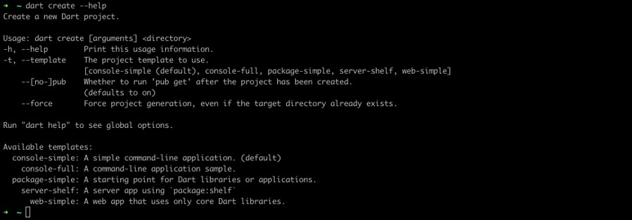
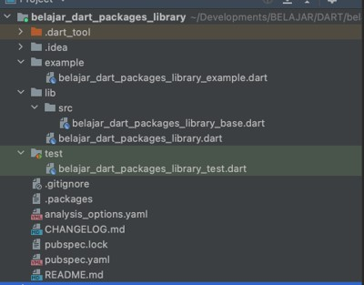
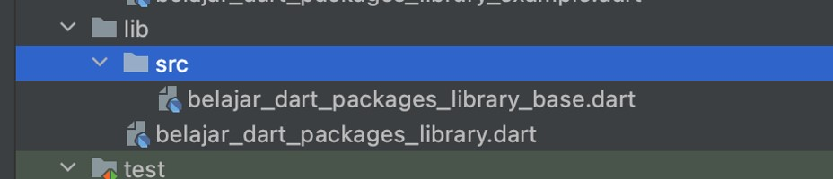
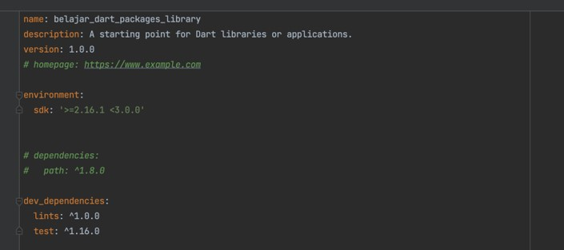
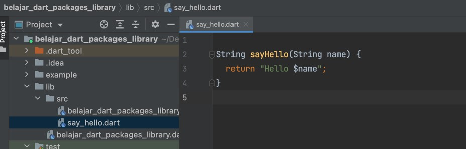
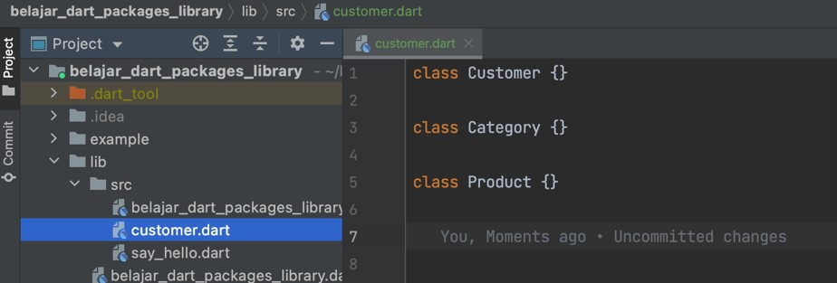
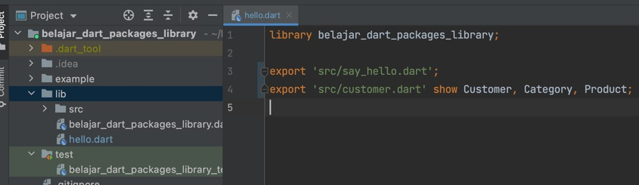
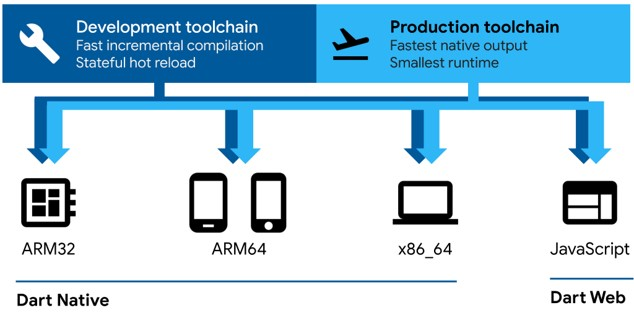
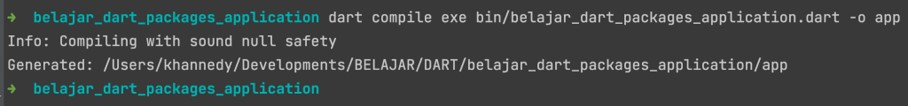
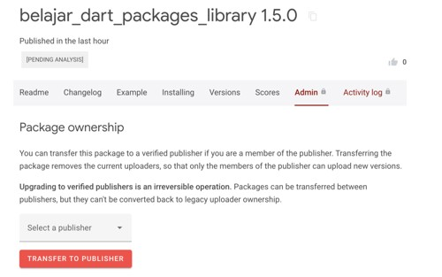

# Dart Packages

## Sebelum Belajar

- Dart Dasar
- Dart OOP
- Dart Generic
- Sudah Mengikuti Kelas Git dari Programmer Zaman Now

## Agenda

- Pengenalan Dart Packages
- Membuat Library dan Project
- Dependency
- Import
- Export
- Upgrade Package
- Compile
- Dan lain-lain

## #1 Pengenalan Dart Packages

### Dart Packages

- Ekosistem Dart menggunakan packages untuk melakukan manajemen software yang bisa di sharing, seperti library atau tool
- Saat kita membuat project di Dart, sebenarnya secara tidak langsung kita membuat packages
- Packages bisa dalam bentuk aplikasi atau library (yang digunakan pada aplikasi)

### Keuntungan Menggunakan Packages

- Dengan menggunakan packages, kita akan mengikuti cara management kode Dart
- Dengan packages juga kisa bisa melakukan dependency management secara otomatis tanpa harus download library yang kita butuhkan secara manual

## #2 Membuat Project Library

### Bantuan Membuat Dart Project



### Membuat Dart Library

```sh
dart create --template=package-simple belajar_dart_packages_library
```

## #3 Struktur Directory Packages

- Salah satu keuntungan menggunakan packages adalah, struktur directory yang standard untuk project di Dart
- Secara minimal, saat kita membuat dart packages, hanya butuh file `pubspec.yaml` dan folder `lib`
- `pubspec.yaml` digunakan untuk konfigurasi dart packages nya, sedangkan folder `lib` untuk menyimpan kode program dart kita
- Namun saat kita membuat project menggunakan perintah dart create, struktur direktorinya lebih kompleks

### Struktur Directory Dart Packages



### Directory src

- Salah satu best practice di dart packages adalah, tidak mengekspos kode dart kecuali memang dibutuhkan
- Dan salah satu best practice yang dilakukan di dart packages, biasanya kode program dart akan di tempatkan di folder `src` di dalam folder `lib`
- Semua kode program dart di dalam `src`, secara default tidak diekspos ke luar
- Ketika kita butuh mengekspos keluar (artinya bisa diakses oleh project lain), maka biasanya dilakukan secara eksplisit di kode dart di dalam folder `lib`

### Directory src



## #4 Pubspec

- Saat kita membuat dart packages, hal yang paling utama adalah file `pubspec.yaml`
- Pubspec.yaml merupakan konfigurasi dari dart packages
- Di dalam pubspec, kita perlu tentukan nama dart packages yang kita buat, termasuk dependency yang kita butuhkan di dart package tersebut

### Kode: pubspec.yaml

```yaml
name: belajar_dart_packages_library
description: A starting point for Dart libraries or applications.
version: 1.0.0
# repository: https://github.com/my_org/my_repo

environment:
  sdk: ^3.2.0

# Add regular dependencies here.
dependencies:
  # path: ^1.8.0

dev_dependencies:
  lints: ^2.1.0
  test: ^1.24.0
```



## #5 Membuat Library

- Saat membuat kode dart di dart packages, disarankan lakukan di dalam folder src
- Dan ketika melakukan import kode dart dari library, jangan import dari folder src, hal ini karena kode di src biasanya digunakan sebagai internal library, dan tidak dijamin akan backward compatible ketika terjadi update library

### Kode: Membuat Library (1)

```dart
// lib/src/say_hello.dart
String sayHello(String name) {
	return 'Hello $name';
}
```



### Kode: Membuat Library (2)

```dart
// lib/src/customer.dart
class Customer {}

class Category {}

class Product {}
```



### Export Library

- Setelah membuat kode dart di dalam folder src, kita bisa buat kode dart di lib yang digunakan untuk mengekspos bagian mana yang ingin kita ekspos
- Kita bisa menggunakan kata kunci `export` jika ingin mengekspos semua kode di dalam file dart, atau gunakan export `show` jika hanya beberapa saja
- Jangan lupa untuk menambahkan kata kunci library dan diikuti dengan nama library yang kita buat, walaupun tidak wajib, tapi direkomendasikan menggunakan nya, karena secara default jika kita tidak menambahkan library, secara otomatis nama library nya adalah string kosong

### Kode: Export Library

```dart
// lib/hello.dart
import belajar_dart_packages_library

export 'src/say_hello.dart';
export 'src/customer.dart' show Customer, Category, Product;
```



### Import Library

- Setelah membuat library, jika kita ingin menggunakannya, kita bisa mencobanya di folde example
- Kita bisa melakukan import dengan pola :
- `package:nama_library/file.dart`

### Kode: Menggunakan Library

```dart
// tests/hello.dart
import "package:belajar_dart_packages_library/hello.dart";

void main()  {
	print(sayHello("Eko"));

	var customer = Customer();
	var prouct = Product();
	var category = Category();
}
```

## #6 Publish Packages ke Github

- Setelah membuat library menggunakan dart packages, kita bisa menyimpannya di Git Server, contohnya Github
- Dart packages terintegrasi dengan baik dengan Git, sehingga kita bisa menambahkan library yang sudah kita buat ke aplikasi melalui Git

## #7 Membuat Project Aplikasi

```sh
dart create --template=console-full belajar_dart_packages_application
```

### Menjalankan Aplikasi

```sh
dart run
```

## #8 Dependency

- Ketika kita membutuhkan library di aplikasi dart, kita bisa tambahkan dependency tersebut di file `pubspec.yaml` pada bagian dependencies
- Misal kita akan coba tambahkan dependencies library yang sudah kita buat

### Kode: Pubsub

```dart
publish_to: none # must publish to none if using git
dependencies:
	belajar_dart_packages_library:
		git:
			url: git:github.com:khannedy/belajar_dart_packages_library.git
			ref: 1.0.0 # branch or tag
```

### Download Dependency

- Setelah kita tambahkan dependency di file `pubspec.yaml`, selanjutnya kita perlu download dependency tersebut ke local kita dengan perintah :
- `dart pub get`
- Semua dependency akan di download ke local di folder `HOME/.pub-cache/`

## #9 Import

- Setelah kita menambah dan download dependency ke aplikasi, selanjutnya kita bisa gunakan library dependency tersebut menggunakan Import

### Kode: Import

```dart
// belajar_dart_packages_application.dart
import 'package:belajar_dart_packages_library/hello.dart';

void main() {
	print(sayHello("Eko"));
}
```

### Import As

- Kadang saat melakukan import beberapa packages, ada kalanya terdapat conflict, misal ada function dengan nama yang sama, atau class dengan nama yang sama
- Pada kasus seperti ini, salah satu hal yang cocok adalah membuat prefix untuk packages yang kita import
- Untuk menambah prefix atau alias, kita bisa gunakan kata kunci `as` diikuti nama prefix/alias nya setelah import
- Ketika menggunakan Import As, maka kita wajib menggunakan prefix/alias tersebut sebelum memanggil function atau class yang terdapat di packages tersebut

### Kode: Import As

```dart
// belajar_dart_packages_application.dart
import 'package:belajar_dart_packages_library/hello.dart' as belajar;

void main() {
	print(belajar.sayHello("Eko"));

	var customer = balajar.Customer();
	var product = balajar.Product();
	var category = balajar.Category();
}
```

## #10 Compile

### Dart Platform

- Teknologi Compiler Dart memungkinkan kita menjalankan aplikasi dengan beberapa cara
- Native Platform, untuk aplikasi dengan target perangkat mobile atau desktop. Dart menyertakan Dart VM dengan just-in-time (JIT) compilation dan ahead-of-time (AOT) untuk memproduksi kode mesin.
- Web Platform, untuk aplikasi dengan target web. Dart menyertakan development time compiler (dartdevc) dan production time compiler (dart2js). Keduanya melakukan kompilasi dari kode Dart ke JavaScript
- Pada kelas ini kita fokus membahas Dart Native Platform dengan target perangkat desktop

### Diagram: Dart Platform



### Cross Operating System

- Dart tidak mendukung kompilasi untuk target sistem operasi berbeda
- Oleh karena itu, jika kita ingin membuat distribusi file untuk sistem operasi berbeda, maka kita harus melakukannya di sistem operasi tersebut, misal mac untuk mac, linux untuk linux, dan windows untuk windows
- <https://github.com/dart-lang/sdk/issues/28617>

### Dart Compile

- Untuk melakukan kompilasi kode program kita menjadi distribusi file aplikasi desktop, kita bisa menggunakan perintah :
- `dart compile exe file.dart -o fileoutput`



## #11 Upgrade Packages

- Melakukan upgrade library adalah hal yang sudah biasa
- Hal yang perlu kita lakukan ketika upgrade library adalah, menaikkan versi dart packages di file `pubspec.yaml`
- Jika menggunakan Git, disarankan untuk menambah tag baru untuk versi baru

### Kode: Mengubah Library

```dart
// say_hello.dart

String sayHello(String name) {
	return "Hello $name, Noce To See You!";
}
```

### Kode: Pubspec Library

```yaml
name: belajar_dart_packages_library
description: A starting point for Dart libraries or applications.
version: 1.5.0
# repository: https://github.com/my_org/my_repo
```

### Kode: Pubspec Application

```yaml
publish_to: none # must publish to none if using git
dependencies:
	belajar_dart_packages_library:
		git:
			url: git:github.com:khannedy/belajar_dart_packages_library.git
			ref: 1.5.0 # branch or tag
```

### Upgrade Dependency

- Selanjutnya setelah kita mengubah versi dari dependency di `pubspec.yaml`, kita perlu download dependency terbaru menggunakan perintah :
- `dart pub upgrade`

## #12 Pub.dev

- Sebelumnya kita menggunakan Git untuk menyimpan dart packages yang kita buat. Git cocok ketika kita misal dart packages untuk kebutuhan internal perusahaan kita, namun jika kita ingin membuat dart packages misal untuk opensource, Google telah menyediakan website bernama <https://pub.dev/>
- Namun untuk menyimpan dart packages di pub.dev, kita harus terverifikasi sebagai publisher, dengan syarat memiliki domain
- Silahkan daftar dan registrasi sebagai publisher di [pub.dev](https://pub.dev)

## #13 Publish Packages ke pub.dev

- Perlu diingat, ketika kita publish dart packages kita ke pub.dev, maka ini akan ada selamanya. Kita tidak bisa menghapus yang sudah kita publish, karena ditakutkan ketika banyak yang menggunakan dart packages kita, lalu kita hapus, maka otomatis semua project dart orang lain akan rusak
- Selain itu, pastikan kita menambahkan LICENSE file dan ukuran dart packages kita tidak lebih dari 100MB

### Dry Run

- Sebelum publish packages kita, kita bisa mencoba memastikan tidak ada masalah, dengan mencoba dry run, caranya gunakan perintah :
- `dart pub publish --dry-run`

### Publish Packages

- Jika sudah tidak ada masalah dengan dart packages kita, kita bisa publish ke pub.dev dengan perintah :
- `dart pub publish`
- Ketika pertama kali publish, biasanya kita akan diminta untuk login menggunakan google account

### Transfer ke Publisher



### Download Dependency dari Pub.dev

- Selanjutnya, jika kita sudah upload dart packages ke pub.dev, kita bisa ubah dependency di aplikasi kita, agar tidak menggunakan Git lagi

### Kode: Dependency dari pub.dev

```yaml
dependencies:
	belajar_dart_packages_library: 1.5.0
```

## #14 Materi Selanjutnya

- Dart Collection
- Dart Unit Test
- Dart Standard Library
- Dart Async
- Dart Reflection
