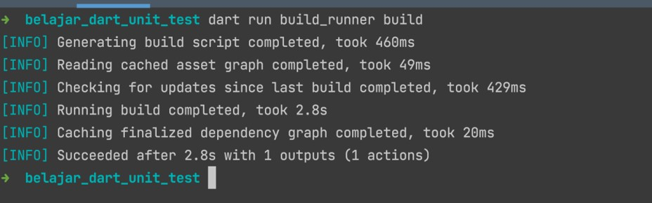

# Dart Unit Test

## Sebelum Belajar

- Dart Dasar
- Dart Object Oriented Programming
- Dart Generic
- Dart Packages
- Dart Collection

## Agenda

- Pengenalan Software Testing
- Testing Package
- Test dan Group Function
- Expect Function
- Matcher
- Mock Object
- Mockito
- Dan lain-lain

## #1 Pengenalan Software Testing

- Software testing adalah salah satu disiplin ilmu dalam software engineering
- Tujuan utama dari software testing adalah memastikan kualitas kode dan aplikasi kita baik
- Ilmu untuk software testing sendiri sangatlah luas, pada materi ini kita hanya akan fokus ke unit testing

### Test Pyramid


### Contoh High Level Architecture Aplikasi


### UI Test / End to End Test


### Service Test / Integration Test


### Contoh Internal Architecture Aplikasi


### Unit Test


### Unit Test

- Unit test akan fokus menguji bagian kode program terkecil, biasanya menguji sebuah method
- Unit test biasanya dibuat kecil dan cepat, oleh karena itu biasanya kadang kode unit test lebih banyak dari kode program aslinya, karena semua skenario pengujian akan dicoba di unit test
- Unit test bisa digunakan sebagai cara untuk meningkatkan kualitas kode program kita

## #2 Membuat Project

```sh
dart create --template console-simple belajar_dart_unit_test
```

## #3 Testing Package

- Dart memiliki package khusus untuk membuat unit test, yaitu package `test`
- Sebelum kita membuat unit test, kita perlu menambahkan package `test` terlebih dahulu ke project dart kita
- <https://pub.dev/packages/test>

### Kode: Menambah Test Package

```yaml
dev_dependencies:
	lints: ^2.0.0
	test: ^1.21.6
```

## #4 test Function

### Membuat Test

- Dart memiliki standarisasi untuk struktur folder pembuatan unit test, biasanya dibuat menggunakan nama folder `test`
- Selanjutnya nama file dart biasanya akan memiliki akhiran `_test`, misal `contoh_test.dart`
- Sama seperti ketika membuat aplikasi, saat membuat file unit test, kita juga perlu menambahkan main function di file test tersebut

### Folder Test


### Test Function

- Untuk membuat unit test, kita bisa menggunakan function test yang terdapat di package `test`
- test function tersebut memiliki parameter nama function dan juga anonymous function yang berisikan kode unit test nya

### Kode: Test Function

```dart
import 'package:test/test.dart';

void main() {
	test("Contoh Test", () => {
		// kode unit test
	});
}
```

## #5 Menjalankan Test

- Untuk menjalankan file test, kita bisa menggunakan perintah :
- `dart test test/namafile_test.dart`
- Atau jika kita ingin menjalankan semua unit file unit test, kita bisa gunakan perintah :
- `dart test`
- Secara otomatis dart akan menjalankan semua unit test di folder test

### Kode: Manjalankan Test


## #6 expect Function

### Expect Function

- Saat kita membuat unit test, salah satu yang paling penting adalah memastikan apakah data yang kita test benar atau salah
- Hal ini disebut assertion
- Di dart, untuk melakukan assertion, kita bisa menggunakan function `expect`, dimana terdapat dua parameter, pertama adalah data yang akan di test, dan kedua adalah harapan datanya
- Jika ternyata data tidak sesuai yang diharapkan, maka secara otomatis akan terjadi error yang menyebabkan unit test dianggap gagal

### Kode: Expect Function

```dart
import 'package:test/test.dart';

String sayHello(String name) {
	return "Hello $name";
}

void main() {
	test('Test Say Hello', () {
		var response = sayHello("Dart");
		expect(response, "Hello Dart");
	});
}

```

## #7 Matcher

### Matcher Package

- Saat kita membuat assertion pada unit test, pengecekannya tidak hanya menggunakan kondisi equals, kadang ada kondisi lain
- Kita bisa menggunakan Matcher Package, dimana terdapat banyak sekali function dan constant yang bisa kita gunakan untuk mempermudah kita melakukan assertion
- <https://pub.dev/packages/matcher>
- Saat menginstall Test Package, Matcher Package otomatis terinstall, sehingga - kita tidak perlu menginstalnya secara manual

### Menggunakan Matcher

- <https://pub.dev/documentation/matcher/latest/matcher/Matcher-class.html>
- Cara penggunaan matcher, kita bisa menggunakannya pada parameter kedua pada expect function:
- `expect(value, matcher)`

### Kode: Matcher

```dart
test('Say Hello With Matcher', () {
	expect(sayHallo("Eko"), endsWith("Eko"));
	expect(sayHallo("Eko"), startsWith("Hello"));
	expect(sayHallo("Eko"), equalsIgnoringCase("Hhello eko"));
});
```

## #8 group Function

- `group()` function merupakan sebuah function yang bisa digunakan untuk melakukan grouping test function
- Melakukan grouping lebih bagus dilakukan ketika sebuah file unit test berisikan bayak sekali test function

### Kode: group Function

```dart
int sum(int a, int b) => a + b;

void main() {
	group('Group', () {
		test('sum first', () {
			expect(sum(1, 2), equals(3));
		});
		test('sum second', () {
			expect(sum(10, 10), equals(20));
		});
	});
}
```

## #9 setUp Function

- `setUp` function merupakan sebuah function yang bisa kita gunakan untuk meregistrasi kode yang selalu dieksekusi setiap kalo test function di eksekusi
- `setUp` function cocok sekali ketika kita butuh membuat sebuah kode yang berulang di awal test function
- Jika `setUp` function di tempatkan di dalam group function, maka `setUp` function ini hanya berlaku untuk test function di dalam group function tersebut

### Kode: setUp Function

```dart
void main() {
	var data = "Eko";

	setUp(() {
		data = "Eko";
	});

	group('String', () {
		test('string first', () {
			data = "$data Kurniawan";
			expect(data, "Eko Kurniawan");
		});
		test('string second', () {
			data = "$data Khannedy";
			expect(data, "Eko Khannedy");
		});
	});
}
```

## #10 tearDown Function

- Jika setUp function adalah function yang selalu dieksekusi di awal unit test, maka `tearDown` adalah function yang selalu dieksekusi di akhir unit test
- Cocok untuk melakukan hal yang harus dilakukan setelah semua unit test berjalan
- Jika `tearDown` function di tempatkan di dalam group function, maka `tearDown` function ini hanya berlaku untuk test function di dalam group function tersebut

### Kode: tearDown Function

```dart
void main() {
	var data = "Eko";

	setUp(() {
		data = "Eko";
	});

	tearDown(() {
		print(data);
	});

	group('String', () {
		test('string first', () {
			data = "$data Kurniawan";
			expect(data, "Eko Kurniawan");
		});
		test('string second', () {
			data = "$data Khannedy";
			expect(data, "Eko Khannedy");
		});
	});
}
```

## #11 setUpAll Function

- Jika setUp function akan dieksekusi di awal sebelum tiap test function di eksekusi
- `setUpAll` function hanya dieksekusi sekali saja, di awal sebelum semua test function di eksekusi
- Jika `setUpAll` function di tempatkan di dalam group function, maka `setUpAll` function ini hanya berlaku untuk test function di dalam group function tersebut

### Kode: setUpAll Function

```dart
void main() {
	var data = "Eko";

	setUpAll(() {
		print("Start Unit Test");
	});

	setUp(() {
		data = "Eko";
	});

	tearDown(() {
		print(data);
	});

	group('String', () {
		test('string first', () {
			data = "$data Kurniawan";
			expect(data, "Eko Kurniawan");
		});
		test('string second', () {
			data = "$data Khannedy";
			expect(data, "Eko Khannedy");
		});
	});
}
```

## #12 tearDownAll Function

- Jika tearDown function akan dieksekusi di akhir setelah tiap test function di eksekusi
- `tearDownAll` function hanya dieksekusi sekali saja, di akhir setelah semua test function di eksekusi
- Jika `tearDownAll` function di tempatkan di dalam group function, maka `tearDownAll` function ini hanya berlaku untuk test function di dalam group function tersebut

### Kode: tearDownAll Function

```dart
void main() {
	var data = "Eko";

	setUpAll(() {
		print("Start Unit Test");
	});

	setUp(() {
		data = "Eko";
	});

	tearDown(() {
		print(data);
	});

	tearDownAll(() {
		print("End Unit Test");
	});

	group('String', () {
		test('string first', () {
			data = "$data Kurniawan";
			expect(data, "Eko Kurniawan");
		});
		test('string second', () {
			data = "$data Khannedy";
			expect(data, "Eko Khannedy");
		});
	});
}
```

## #13 Platform Selector

- Pada beberapa kasus, mungkin kita membuat kode Dart yang dikhususkan untuk platform tertentu, misal untuk sistem operasi tertentu misalnya
- Kita bisa menandai sebuah unit test dengan annotation `@TestOn`, untuk memberi tahu bahwa unit test ini untuk platform yang kita sebutkan, sehingga jika kita menjalankan unit test tersebut di platform yang berbeda, secara otomatis unit test tersebut akan di skip
- Platform selector mendukung operator boolean, seperti `&&`, `||` dan `!`

### Daftar Platform

- `vm` : test di command line Dart VM
- `chrome` : test di browser Chrome
- `firefox` : test di browser Firefox
- `safari` : test di browser Safari
- `ie` : test di browser Internet Explorer
- `node` : test di NodeJS
- `browser` : test di browser apapun
- `js` : test telah di compile ke JavaScript
- `blink` : test di browser yang memiliki blinkn render engine
- `windows` : test di os Windows
- `mac` -os: test di os Mac
- `linux` : test di os Linux
- `android` : test di os Android
- `ios` : test di os iOS
- `posix` : test di os POSIX

### Kode: Platform Selector

```dart
@TestOn("windows || mac-os || linux")

import 'package:test/test.dart';

int sum(int a, int b) => a + b;

void main() {
	group('Group', () {
		test('sum first', () {
			expect(sum(1, 2), equals(3));
		});
	});
}
```

### Platform Selector Parameter

- Saat menggunakan annotation `@TestOn`, maka seluruh unit test di file tersebut akan menggunakan platform selector yang sudah ditentukan
- Kadang, kita hanya ingin beberapa test function atau group function saja misalnya, pada kasus ini kita bisa menambahkan parameter `testOn`

### Kode: Platform Selector Parameter

```dart
void main() {
	group('Group', () {
		test('sum first', () {
			expect(sum(1, 2), equals(3));
		});
		test('sum second', () {
			expect(sum(10, 10), equals(20));
		}, testOn: 'windows');
	});
}
```

## #14 Skip Test

- Saat kita membuat unit test, kadang ada kalanya sebuah unit test bermasalah dan belum bisa diperbaiki
- Pada kasus ini, jangan hapus unit test tersebut, tapi tandai unit test tersebut agar tidak dijalankan, atau skip
- Kita bisa menggunakan annotation `@Skip` untuk menandai sebuah file unit test agar di skip

### Kode: Skip File Unit Test

```dart
@Skip("This is unit test still broken")

import 'package:test/test.dart';

void main() {
	group('Test', () {
		test('test first', () {
			expect(1, 1);
		});
		test('test second', () {
			expect(1, 2);
		});
	});
}
```

### Skip Parameter

- Menggunakan Annotation `@Skip` secara otomatis akan melakukan skip seluruh test di file tersebut
- Kadang, ada kalanya kita hanya ingin melakukan skip satu buah test function atau group function
- Kita bisa menambahkan object parameter `skip` pada test function dan group function

### Kode: Skip Parameter

```dart
void main() {
	group('Test', () {
		test('test first', () {
			expect(1, 2);
		}, skip: "this test is broken");
		test('test second', () {
			expect(1, 2);
		});
		test('test third', () {
			expect(1, 2);
		});
	});
}
```

## #15 Tag

- Saat membuat unit test yang banyak, kadang kita ingin menambahkan tag terhadap unit test nya
- Biasanya ini digunakan sebagai penanda untuk tag
- Kita bisa menggunakan annotation `@Tags`, atau menggunakan named parameter tags di test atau group function
- Salah satu keuntungan menambahkan tag, kita bisa meminta Dart untuk menjalankan unit test dengan tag tertentu saja misalnya, dengan perintah :
- `dart test --tags "tag dengan boolean selector"`

### Kode: Tag

```dart
@Tags(["pzn", "eko"])
import 'package:test/scaffolding.dart';

void main() {
	test('first', () {
		print('first');
	}, tags: ['first']);
	test('second', () {
		print('second');
	}, tags: ['second']);
}
```

### Menjalankan Unit Test Tag Tertentu


## #16 Retry Test

- Saat membuat unit test, kadang ada kalanya unit test tersebut tidak stabil, misal butuh konek ke database atau ke sistem lain
- Hal ini menyebabkan kadang unit test sering gagal, bukan karena kode salah, tapi karena faktor seperti koneksi network, dan lain-lain
- Dart memiliki fitur untuk melakukan retry ketika unit test gagal dilakukan
- Kita bisa menggunakan annotation `@Retry` dan secara otomatis unit test akan di retry sejumlah yang kita tentukan

### Kode: Retry

```dart
@Retry

import 'package:test/test.dart';

void main() {
	test('test failed', () {
		expect(1, 2);
	});
}
```

### Retry Parameter

- Jika kita hanya ingin melakukan retry pada test atau group function tertentu, kita juga bisa menambahkan named parameter `retry`

### Kode: Retry Parameter

```dart
import 'package:test/test.dart';

void main() {
	test('test failed', () {
		expect(1, 2);
	}, retry: 5);
}
```

## #17 Platform Specific Configuration

- Saat menggunakan `@Skip`, secara otomatis tidak akan melihat platform apapun, dia akan di skip secara otomatis
- Bagaimana jika kasusnya misalnya, kita ingin melakukan Skip, namun hanya untuk platform `"mac-os"` saja?
- Pada kasus seperti ini, kita bisa menggunakan annotation `@OnPlatform`

### Kode: Platform Specific

```dart
@OnPlatform({
	"mac-os": Skip("This test is not supported on macOS"),
})

import 'package:test/test.dart';

int sum(int a, int b) => a + b;

void main() {
	group('Group', () {
		test('sum first', () {
			expect(sum(1, 2), equals(3));
		});
	});
}
```

### Platform Specific Parameter

- Sama dengan annotation lainnya, jika misal kita hanya ingin menambahkan konfigurasi platform pada test atau group tertentu, kita bisa tambahkan named parameter `onPlatform`

### Kode: Platform Specific Parameter

```dart
void main() {
	group('Group', () {
		test('sum first', () {
			expect(sum(1, 2), equals(3));
		}, onPlatform: {
			"mac-os": Skip("This test is not supported on macOS")
		});
	});
}
```

## #18 Package Configuration

- Sebelumnya, kita hanya melakukan pengaturan di file unit test dart saja
- Apa yang terjadi jika misal kita butuh pengaturan yang sama, untuk semua file unit test? Misal kita ingin semua hanya jalan di windows, atau semua memiliki tag, dan lain-lain. Maka, kita harus lakukan satu persatu di file dart nya
- Untungnya, dart memiliki package configuration file untuk unit test, dimana kita bisa gunakan file yaml untuk menambah informasi unit test di seluruh package hanya dengan satu file, yaitu `dart_test.yaml`

### Configuration Format

- Banyak sekali yang bisa kita atur di package configuration file
- Kita bisa melihat detail nya di dokumentasi resminya
- <https://github.com/dart-lang/test/blob/master/pkgs/test/doc/configuration.md>

### Kode: Package Config File

```yaml
test_on: "mac-os"

tags:
	second:
		skip: "Second tag are skipped"
```

## #19 Mock Object

- Saat kita membuat unit test, kadang tidak semua object bisa kita test
- Contoh, misal kita memiliki object yang harus mengirim API Request ke Payment Gateway, atau sistem lain yang diluar kontrol kita
- Pada kasus seperti ini, kita tidak bisa memaksakan untuk membuat unit test yang mengirim request ke sistem lain, karena jika kita paksakan, bisa jadi nanti hasil unit testnya tidak konsisten
- Pada kasus sepert ini, kita bisa menggunakan konsep bernama Mock Object, yaitu membuat object tiruan yang bisa kita atur tingkah lakunya agar sesuai dengan yang kita inginkan

### Contoh Kasus

- Sebelum belajar Mock Object, sekarang kita akan coba buat contoh kasus, misal kita memiliki class dengan nama BookService dan BookRepository
- `BookRepository` merupakan class yang berisikan kode untuk memanipulasi data Book ke dalam sistem lain, misal database atau API lain
- `BookService` merupakan class yang berisikan kode untuk business logic aplikasi kita
- `BookService` memiliki method yang bisa digunakan untuk membuat Book, mengubah Book, mengambil Book dan menghapus Book

### Kode: Book

```dart
class Book {
	String id;
	String name;
	int price;

	Book(this.id, this.name, this.price);

	@override
	bool operator ==(Object other) =>
		identicial(this, other) ||
		other is Book &&
			runtimeType == other.runtimeType &&
			id == other.id &&
			name == other.name &&
			price == other.price;

	@override
	int get hasCode => id.hashCode ^ name.hashCode ^ proce.hashCode;
}
```

### Kode: Book Repository

```dart
class BookRepository {
	void save(Book book) {
		print("Save $book");
		throw UnsupportedError("not implemented");
	}

	void update(Book book) {
		print("Update $book");
		throw UnsupportedError("not implemented");
	}

	void delete(Book book) {
		print("Delete $book");
		throw UnsupportedError("not implemented");
	}

	Book findById(String id) {
		print("Find by id $id");
		throw UnsupportedError("not implemented");
	}
}
```

### Kode: Book Service

```dart
class BookService {
	BookRepository bookRepository;

	BookService(this.bookRepository);

	void save(String id, String name, int price) {
		if (id == "" || name == "" || price <= 0) {
			throw Exception("invalid data");
		}
		bookRepository.save(Book(id, name, price));
	}

	void update(String id, String name, int price) {
		if (id == "" || name == "" || price <= 0) {
			throw Exception("invalid data");
		}
		var book = bookRepository.findById(id);
		if (book == null) {
			throw Exception("book not found");
		} else {
			book.name = name;
			book.price = price;
			bookRepository.update(book);
		}
	}

	Book find(String id) {
		var book = bookRepository.findById(id);
		if (book == null) {
			throw Exception("book not found");
		} else {
			return book;
		}
	}

	void delete(String id) {
		var book = bookRepository.findById(id);
		if (book == null) {
			throw Exception("book not found");
		} else {
			bookRepository.delete(book);
		}
	}
}
```

### Kode: Book Library

```dart
library belajar_dart_unit_test;

export 'package:belajar_dart_unit_test/src/book.dart';
export 'package:belajar_dart_unit_test/src/book_repository.dart';
export 'package:belajar_dart_unit_test/src/book_service.dart';
```

## #20 Mockito

- Dart sudah menyediakan package khusus untuk membuat mock object yaitu `Mockito`
- <https://pub.dev/packages/mockito>
- Mockito merupakan package yang terinspirasi dari library mock object Java dengan nama sama, yaitu Mockito <https://github.com/mockito/mockito>

### Menginstall Mockito

- Sebelum kita menggunakan Mockito, silahkan tambahkan package `mockito` terlebih dahulu
- Selain itu, mockito juga membutuhkan package `build_runner`, jadi pastikan kita menambahkan package `build_runner` juga
- <https://pub.dev/packages/build_runner>

### Kode: Menambah Mockito Package

```yaml
dev_dependencies:
	lints: ^2.0.0
	test: ^1.21.6
	mockito: ^5.3.1
	build_runner: ^2.2.1
```

## #21 Membuat Mock Object

- Cara kerja Mockito adalah dengan membuat generated file berisi mock class yang bisa kita gunakan sebagai pengganti class aslinya
- Pertama, kita perlu memberitahu Mockito untuk membuat mock object dengan menggunakan annotation `GenerateNiceMocks`, dan lakukan import ke file dengan format `namafile_test.mocks.dart`
- Selanjutnya, kita perlu menjalankan `build_runner`, agar file mock otomatis dibuatkan oleh Mockito

### Kode: Generate Nice Mock

```dart
import 'package:belajar_dart_packages_library/mock.dart';
import 'package:mockito/annotations.dart';
import 'package:test/test.dart';

@GenerateNiceMocks([MockSpec<BookRepository>()])
import 'mock_object_test_mocks.dart';

void main() {

}

```

### Kode: Menjalankan Build Runner

```sh
dart run build_runner build
```



### Kode: Hasil Mock Object File

```dart
// Mocks generated by Mockito 5.3.1 from annotations
// in belajar_dart_unit_test/test/mock_object_test.dart.
// Do not manually edit this file.

// ignore_for_file: no_leading_underscores_for_library_prefixes
import 'package:belajar_dart_unit_test/src/book.dart' as _i3;
import 'package:belajar_dart_unit_test/src/book_repository.dart' as _i2;
import 'package:mockito/mockito.dart' as _i1;

// ignore_for_file: type=lint
// ignore_for_file: avoid_redundant_argument_values
// ignore_for_file: avoid_setters_without_getters
// ignore_for_file: comment_references
// ignore_for_file: implementation_imports
// ignore_for_file: invalid_use_of_visible_for_testing_member
// ignore_for_file: prefer_const_constructors
// ignore_for_file: unnecessary_parenthesis
// ignore_for_file: camel_case_types
// ignore_for_file: subtype_of_sealed_class

/// A class which mocks [BookRepository].
///
/// See the documentation for Mockito's code generation for more information.
class MockBookRepository extends _i1.Mock implements _i2.BookRepository {
  @override
  void save(_i3.Book? book) => super.noSuchMethod(
        Invocation.method(
          #save,
          [book],
        ),
        returnValueForMissingStub: null,
      );
  @override
  void update(_i3.Book? book) => super.noSuchMethod(
        Invocation.method(
          #update,
          [book],
        ),
        returnValueForMissingStub: null,
      );
  @override
  void delete(_i3.Book? book) => super.noSuchMethod(
        Invocation.method(
          #delete,
          [book],
        ),
        returnValueForMissingStub: null,
      );
  @override
  _i3.Book? findById(String? id) => (super.noSuchMethod(
        Invocation.method(
          #findById,
          [id],
        ),
        returnValueForMissingStub: null,
      ) as _i3.Book?);
}
```

### Kode: Test Mock Object

```dart
void main() {
	group("BookService", () {
		var bookRepository = MockBookRepository();
		var bookService = BookService(bookRepository);

		test('Save new book must success', () {
			bookService.save("1", "Tutorial Dart", 100000);
		});
	});
}
```

## #22 Verifikasi Mock Object

- Saat kita membuat unit test menggunakan Mock Object, yang perlu diperhatikan adalah, kita harus bisa memastikan bahwa Mock Object tersebut benar-benar dipanggil, karena jika tidak, resikonya unit test kita menjadi tidak valid
- Contoh, misal kita hapus kode yang memanggil BookRepository di BookService, dan lihat apa yang terjadi

### Kode: Book Service

```dart
class BookService {
	BookRepository bookRepository;

	BookService(this.bookRepository);

	void save(String id, String name, int price) {
		if (id == "" || name == "" || price <= 0) {
			throw Exception("invalid data");
		}
		// bookRepository.save(Book(id, name, price));
	}
}
```

### Kenapa Unit Test Sukses?

- Walaupun kode BookRepository sudah dihapus, namun unit test tetap sukses, hal ini dikarenakan kita tidak melakukan verifikasi apapun pada unit test nya
- Oleh karena itu, ketika menggunakan Mock Object, biasakan kita selalu melakukan verifikasi interaksi yang terjadi
- Kita bisa menggunakan function verify untuk memastikan bahwa Mock Object dipanggil

### Kode: Verifikasi Mock Object

```dart
group("BookService", () {
	var bookRepository = MockBookRepository();
	var bookService = BookService(bookRepository);

	test('Save new book must success', () {
		bookService.save("1", "Tutorial Dart", 100000);
		verify(bookRepository.save(Book("1", "Tutorial Dart", 100000)));
	});
});
```

### Called Function

- Selain melakukan verifikasi terhadap mock object, kita juga wajib memastikan jumlah eksekusi kode mock object
- Misal, saat save data Book, kita harus pastikan bahwa, `BookRepository.save()` hanya dipanggil satu kali
- Kita bisa menggunakan `called()` function setelah melakukan verify

### Kode: Called Function

```dart
group("BookService", () {
	var bookRepository = MockBookRepository();
	var bookService = BookService(bookRepository);

	test('Save new book must success', () {
		bookService.save("1", "Tutorial Dart", 100000);
		verify(bookRepository.save(Book("1", "Tutorial Dart", 100000))).called(1);
	});
});
```

## #23 Stubing

- Stubing adalah mengubah tingkah laku mock object sebelum digunakan
- Saat kita membuat mock object, kadang beberapa function butuh mengembalikan value misalnya
- Kita bisa menambahkan tingkah laku ke mock object ketika mock object tersebut dipanggil, dengan menggunakan `when` function
- Selanjutnya, kita bisa menentukan reaksi apa yang perlu dilakukan oleh mock stub tersebut dengan menggunakan `thenReturn`, `thenAnswer` atau `thenThrow` function

### Kode: Stubing

```dart
test("Find book by id", () {
	when(bookRepository.findById("1"))
		.thenReturn(Book("1", "Tutorial Dart", 100000));

	var book = bookService.find("1");
	expect(book, equals(Book("1", "Tutorial Dart", 100000)))

	verify(bookRepository.findById("1")).called(1);
});
```

## #24 Argument Matcher

- Mockito juga mendukung Matcher ketika membuat stubing atau melakukan verifikasi
- Kita bisa menggunakan constant any jika ingin menerima argument apapun, atau bisa menggunakan `argThat(matcher)` jika ingin menggunakan matcher

### Kode: Argument Matcher

```dart
test("Find book by id eko123", () {
	when(bookRepository.findById(argThat(startsWith("eko"))))
		.thenReturn(Book("eko123", "Tutorial Dart", 100000));

	var book = bookService.find("eko123");
	expect(book, equals(Book("eko123", "Tutorial Dart", 100000)))

	verify(bookRepository.findById(any)).called(1);
});
```

## #25 Best Practice Mock Object

- Testing menggunakan real object lebih baik dibandingkan menggunakan mock object
- Selama kita bisa membuat real objectnya, selalu gunakan real object, dibandingkan menggunakan mock object
- Gunakan mock object, hanya ketika kita tidak bisa membuat real object nya di unit test
- Jika menggunakan mock object, pastikan selalu melakukan verifikasi interaksi yang terjadi terhadap mock object tersebut

## #26 Materi Selanjutnya

- Dart Async
