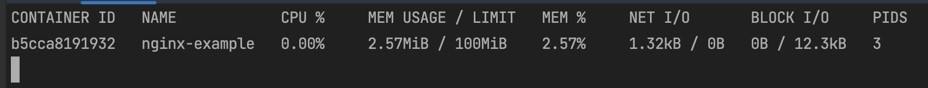

# Docker Compose

## Sebelum Belajar

- Docker Dasar
- Docker Dockerfile

## Agenda

- Pengenalan Docker Compose
- Configuration File
- Services
- Project
- Environment Variable
- Volume
- Network
- Dan lain-lain

## #1 Pengenalan Docker Compose

- Docker Compose adalah tool yang digunakan untuk mendefinisikan dan menjalankan multiple Docker Container secara sekaligus
- Dengan menggunakan Docker Compose, kita bisa menggunakan fiile YAML untuk melakukan konfigurasi Docker Container nya
- Lalu dengan sebuah perintah, kita bisa membuat semua Docker Container dan menjalankannya sekaligus dari file konfigurasi tersebut
- Dengan begitu, kita tidak perlu lagi mengetikan perintah docker create secara manual ketika ingin membuat Docker Container

### Fitur Docker Compose

- Memiliki multiple isolated environment dalam satu docker host / server, atau dibilang project. Hal ini memungkinkan kita bisa membuat banyak sekali jenis environment untuk Docker Compose. Secara default nama project akan menggunakan nama folder konfigurasi
- Hanya membuat container yang berubah. Docker Compose bisa mendeteksi container mana yang harus dibuat dan tidak perlu dibuat ulang dari perubaha file konfigurasi

### Kapan Menggunakan Docker Compose

- Membuat Development Environment. Ketika kita develop aplikasi, kita sering butuh tool-tool berbeda untuk tiap project. Kita bisa gunakan Docker Compose untuk melakukan setup nya
- Automated Testing. Kadang ketika kita membuat automation testing, banyak sekali hal yang harus kita jalankan secara manual. Docker Compose bisa membantu kita untuk otomatisasi proses setup nya
- Deployment. Docker Compose juga bisa digunakan untuk kasus deployment aplikasi kita. Jadi kita tidak perlu lakukan start manual aplikasi kita di server, cukup jalankan menggunakan Docker Compose

## #2 Menginstall Docker Compose

- Dulu, aplikasi Docker Compose terpisah dengan aplikasi Docker.
- Dulu, kita perlu menggunakan perintah docker-compose untuk menggunakan Docker Compose
- Namu di Docker versi terbaru, Docker Compose sudah tersedia secara otomatis di dalam Docker nya
- Dan untuk menggunakan Docker Compose, kita bisa gunakan perintah :
- `docker compose`

### Kode: Docker Compose

```sh
docker compose version
```

## #3 Configuration File

- Docker Compose menyimpan konfigurasi nya dalam bentuk file YAML : <https://yaml.org/>
- File YAML mirip JSON, namun lebih sederhana
- Biasanya file konfigurasinya disimpan dalam file bernama `docker-compose.yaml`
- Seperti yang dibahas di awal, nama project secara default akan menggunakan nama folder lokasi `docker-compose.yaml` tersebut berada

### Versi Konfigurasi

- Saat video ini dibuat, sekarang konfigurasi Docker Compose masih menggunakan versi `3.x`
- Kita bisa lihat versi terbaru di halaman ini :
- <https://docs.docker.com/compose/compose-file/compose-file-v3/>
- Ingat ini adalah versi konfigurasi file, bukan versi aplikasi Docker Compose

### Kode: Docker Compose File

```yaml
# docker-compose.yaml
version: "3.8"
```

## #4 Yaml

- Yaml adalah sebuah jenis file yang biasa digunakan untuk menyimpan konfigurasi
- Yaml mirip seperti JSON, hanya saja tidak menggunakan kurung kurawal
- Yaml akan memiliki attribute dan value
- <https://yaml.org/>

### Kode: Yaml Attribute

> user.yaml

```yml
firstName: Eko
middleName: Kurniawan
lastName: Khanendy
```

> user.json

```json
{
	"firstName": "Eko",
	"middleName": "Kurniawan",
	"lastName": "Khanendy"
}
```


### Kode: Yaml Array

> user.yaml

```yaml
firstName: Eko
middleName: Kurniawan
lastName: Khanendy
hobbies:
	- Coding
	- Reading
	- Gaming
```

> user.json

```json
{
	"firstName": "Eko",
	"middleName": "Kurniawan",
	"lastName": "Khanendy",
	"hobbies": ["Coding", "Reading", "Gaming"]
}
```

### Kode: Yaml Nested Object

> user.yaml

```yaml
firstName: Eko
middleName: Kurniawan
lastName: Khanendy
hobbies:
	- Coding
	- Reading
	- Gaming
address:
	street: Jl. Kelibarang KM 14
	city: Yogyakarta
	country: Indonesia
```

> user.json

```json
{
	"firstName": "Eko",
	"middleName": "Kurniawan",
	"lastName": "Khanendy",
	"hobbies": ["Coding", "Reading", "Gaming"],
	"address": {
		"street": "Jl. Kelibarang KM 14",
		"city": "Yogyakarta",
		"country": "Indonesia"
	}
}
```

### Kode: Yaml Array Nested Object

> user.yaml

```yaml
firstName: Eko
middleName: Kurniawan
lastName: Khanendy
hobbies:
	- Coding
	- Reading
	- Gaming
address:
	street: Jl. Kelibarang KM 14
	city: Yogyakarta
	country: Indonesia
wallet:
	- type: cash
		amount: 100000
	- type: debit
		amount: 500000
```

> user.json

```json
{
	"firstName": "Eko",
	"middleName": "Kurniawan",
	"lastName": "Khanendy",
	"hobbies": ["Coding", "Reading", "Gaming"],
	"address": {
		"street": "Jl. Kelibarang KM 14",
		"city": "Yogyakarta",
		"country": "Indonesia"
	},
	"wallet": [
		{
			"type": "cash",
			"amount": "100000"
		},
		{
			"type": "debit",
			"amount": "500000"
		}
	]
}
```

### JSON to Yaml

- <https://www.json2yaml.com/>

## #5 Membuat Container

- Sebelumnya untuk membuat container, kita selalu menggunakan perintah docker create
- Namun sekarang kita bisa buat container hanya menggunakan configuration file di Docker Compose
- Pada file yaml, kita bisa tambahkan bagian services untuk menentukan container-nya
- Dalam service tersebut, kita bisa tentukan container name dan image untuk docker container yang akan kita buat

### Kode: Membuat Container

```yaml
version: "3.8"

services:
	nginx-example:
		container_name: nginx-example
		image: nginx:latest
```

### Membuat Container

- Setelah membuat konfigurasi file, Container tidak langsung jadi, kita harus membuatnya dengan menggunakan Docker Compose, yaitu dengan perintah :
- `docker compose create`

### Kode: Membuat Container

```sh
docker compose create
```


## #6 Menjalankan Container

- Setelah membuat Container, Container tidak akan berjalan otomatis
- Kita harus menjalankannya secara manual, bisa menggunakan perintah `docker container start`, atau bisa menggunakan Docker Compose
- Untuk menggunakan Docker Compose, kita bisa gunakan perintah `docker compose start`

### Kode: Menjalankan Container

```sh
docker compose start
```


## #7 Melihat Container

- Biasanya, saat kita ingin melihat Container, kita biasanya gunakan perintah docker container ls
- Namun menggunakan perintah itu, akan melihatkan semua container, baik itu yang dibuat oleh Docker Compose, atau dibuat manual
- Jika kita ingin melihat status Container yang hanya terdapat di konfigurasi file Docker Compose, kita bisa gunakan perintah :
- `docker compose ps`

### Kode: Melihat Container

```sh
docker compose ps
```


## #8 Menghentikan Container

- Untuk menghentikan Container, kita bisa menggunakan perintah :
- `docker compose stop`
- Menghentikan Container hanya men-stop Container, tidak akan menghapus Container nya

### Kode: Menghentikan Container

```sh
docker compose stop
```


## #9 Menghapus Container

- Jika kita sudah tidak butuh lagi container yang terdapat di file konfigurasi, kita bisa menghapusnya
- Kita bisa hapus secara manual menggunakan perintah `docker container rm`, atau menggunakan Docker Compose
- Untuk menghapus container menggunakan Docker Compose, kita bisa gunakan perintah :
- `docker compose down`
- Secara otomatis semua Container dan Network dan Volume yang digunakan oleh Container tersebut akan dihapus

### Kode: Menghapus Container

```sh
docker compose down
```


## #10 Project Name

- Seperti yang sudah dijelaskan di awal, saat kita menggunakan Docker Compose, informasi konfigurasi Docker Compose akan disimpan dalam project
- Secara default nama project-nya adalah nama folder lokasi file `docker-compose.yaml`
- Untuk melihat daftar project yang sedang berjalan, kita bisa gunakan perintah :
- `docker compose ls`

### Kode: Project Name

```sh
docker compose ls
```


## #11 Service

- Dalam konfigurasi Docker Compose, container disimpan dalam konfigurasi bernama `services`
- Kita bisa menambahkan satu atau lebih services dalam konfigurasi file nya
- <https://docs.docker.com/compose/compose-file/compose-file-v3/#service-configuration-reference>

### Kode: Service

```yaml
version: "3.8"

services:
	nginx-example:
		image: nginx:latest
		container_name: nginx-example
	mongodb-example:
		image: mongo:latest
		container_name: mongodb-example
```

### Kode: Menjalankan Container

```sh
docker compose create

docker compose start
```


## #12 Komentar

- Salah satu keunggunlan menggunakan Yaml dari pada JSON adalah, di Yaml kita bisa menambahkan komentar dengan diawali karakter `#`
- Di JSON kita tidak bisa menambahkan komentar
- Komentar secara otomatis akan dihiraukan oleh Docker Compose

### Kode: Komentar

```yaml
services:

	# This is example nginx
	nginx-example:
		image: nginx:latest
		container_name: nginx-example

	# This is example mongodb
	mongodb-example:
		image: mongo:latest
		container_name: mongodb-example
```

## #13 Port

- Saat membuat Container, kita bisa mengekspose port di Container keluar menggunakan Port Forwarding
- Kita juga bisa melakukan hal tersebut di konfigurasi file Docker Compose dengan menggunakan attribute ports
- Attribute ports berisi `array` object `port`
- <https://docs.docker.com/compose/compose-file/compose-file-v3/#ports>

### Short Syntax

- Saat menentukan port, kita bisa gunakan dua cara, pertama adalah short sytax, yang berisi string port `HOST:CONTAINER`
- Misal `“8080:80”`, artinya kita akan menggunakan port 8080 di Host untuk di forward ke port `80` di Container

### Logn Syntax

- Sedangkan untuk long syntax, kita bisa buat dalam bentuk object yang berisi :
- `target`: Port di dalam container
- `published`: Port yang digunakan di host
- `protocol`: Protocol port (tcp atau udp)
- `mode`: host untuk port di tiap Node, atau ingress untuk swarm mode. Karena kita tidak menggunakan docker swarm, jadi kita cukup gunakan nilai host

### Kode: Port

```yaml
version: "3.8"

services:
	nginx-port1:
		image: nginx:latest
		container_name: nginx-port1
		ports:
			- protocol: tcp
				published: 8080
				target: 80
	nginx-port2:
		image: mongo:latest
		container_name: nginx-port2
		ports:
			- "8081:80"
```

### Kode: Menjalankan Container

```sh
docker compose create

docker compose start
```


## #14 Environment Variable

- Saat membuat container, kita juga menambahkan environment variable untuk digunakan di dalam container
- Saat menggunakan konfigurasi file Docker Compose, kita bisa tambahkan environment variable dengan menggunakan attribute environment

### Kode: Environment Variable

```yaml
version: "3.8"

services:
	mongodb-example:
		image: mongo:latest
		container_name: mongodb-example
		ports:
			- "27017:27017"
		environment:
			MONGO_INITDB_ROOT_USERNAME: khannedy
			MONGO_INITDB_PASSWORD: khannedy
			MONGO_INITDB_DATABASE: admin
```

### Kode: Menjalankan Container

```sh
docker compose create

docker compose start
```


## #15 Bind Mount

- Untuk melakukan bind mount, kita juga bisa lakukan di konfigurasi file Docker Compose
- Kita bisa gunakan attribute volumes di services
- Kita bisa tambahkan satu atau lebih bind mount jika kita mau
- <https://docs.docker.com/compose/compose-file/compose-file-v3/#volumes>

### Short Syntax

- Untuk Bind Mount, kita bisa gunakan short sytax dan long syntax
- Untuk short syntax, kita bisa gunakan nilai `SOURCE:TARGET:MODE`, dimana `SOURCE` adalah lokasi di host, dan TARGET adalah lokasi di container
- `MODE` adalah mode bind mount, `ro` untuk readonly, `rw` untuk read write (default)
- `SOURCE` bisa menggunakan relative path dengan diawali `.` (titik), atau absolute path

### Kode: BInd Mount Short Syntax

```yaml
version: "3.8"

services:
	mongodb-example:
		image: mongo:latest
		container_name: mongodb-example
		ports:
			- "27017:27017"
		environment:
			MONGO_INITDB_ROOT_USERNAME: khannedy
			MONGO_INITDB_PASSWORD: khannedy
			MONGO_INITDB_DATABASE: admin
		volumes:
			- "./data-mongo1:/data/db"
```

### Log Syntax

- Untuk menggunakan long syntax, kita bisa buat dalam bentuk nested object di volumes dengan attribute
- `type`: tipe mounth, volume atau bind. Volume akan dibahas di materi selanjutnya
- `source`: sumber path di host atau nama volume
- `target`: target path di container
- `read_only`: flag readonly atau tidak, default nya false

### Kode: Bind Mount Long Syntax

```yaml
version: "3.8"

services:
	mongodb-example:
		image: mongo:latest
		container_name: mongodb-example
		ports:
			- "27017:27017"
		environment:
			MONGO_INITDB_ROOT_USERNAME: khannedy
			MONGO_INITDB_PASSWORD: khannedy
			MONGO_INITDB_DATABASE: admin
		volumes:
			- type: bind
				source: "./data-mongo1"
				format: "/data/db"
				read_only: false
```

## #16 Volume

- Docker Compose juga tidak hanya bisa digunakan untuk membuat container, tapi bisa juga digunakan untuk membuat volume
- Kita bisa menggunakan attribute volumes pada konfigurasi file
- <https://docs.docker.com/compose/compose-file/compose-file-v3/#volume-configuration-reference>

### Kode Volume

```yaml
version: "3.8"

volumes:
	mongo-data1:
		name: mongo-data1
	mongo-data2:
		name: mongo-data2
```

### Menggunakan Volume

- Untuk menggunakan Volume, kita gunakan seperti menggunakan bind mount, dengan ketentuan :
- Pada short sytax, kita bisa ganti SOURCE dengan nama volume
- Pada long syntax, kita bisa ganti type menjadi volume, dan source menjadi nama volume

### Kode: Menggunakan Volune Short Syntax

```yaml
version: "3.8"

services:
	mongodb1:
		image: mongo:latest
		container_name: mongodb1
		ports:
			- "27017:27017"
		environment:
			MONGO_INITDB_ROOT_USERNAME: khannedy
			MONGO_INITDB_PASSWORD: khannedy
			MONGO_INITDB_DATABASE: admin
		volumes:
			- "./mongo-data1:/data/db"
```

### Kode: Menggunakan Volume Long Syntax

```yaml
version: "3.8"

services:
	mongodb2:
		image: mongo:latest
		container_name: mongodb2
		ports:
			- "27017:27017"
		environment:
			MONGO_INITDB_ROOT_USERNAME: khannedy
			MONGO_INITDB_PASSWORD: khannedy
			MONGO_INITDB_DATABASE: admin
		volumes:
			- type: volume
				source: "./mongo-data2"
				format: "/data/db"
				read_only: false
```

### Menghapus Volume

- Saat kita menggunakan perintah `docker compose down`, yang dihapus hanyalan Container dan Network saja
- Volume tidak akan dihapus, hal ini agar jangan sampai kita tidak sengaja menghapus volume
- Jika ingin menghapus volume, kita bisa lakukan manual dengan perintah `docker volume rm` nama-volume

## #17 Network

- Selain membuat Container dan Volume, kita juga bisa menggunakan Docker Compose untuk membuat Network secara otomatis

### Default Network

- Saat kita menjalankan file menggunakan Docker Compose, secara default semua container akan dihubungkan dalam sebuah Network bernama `nama-project_default`
- Jadi sebenarnya kita tidak perlu membuat Network secara manual
- Silahkan inspect container yang sudah berjalan menggunakan Docker Compose, lalu lihat pada bagian Network

### Kode: Default Network


### Membuat Network

- Tapi jika kita ingin membuat Network secara manual, kita juga bisa menggunakan Docker Compose
- Kita bisa buat satu atau lebih Network menggunakan attribute networks, dimana kita perlu tentukan :
- `name`: Nama network
- `driver`: Driver network seperti bridge, host atau none

### Kode: Membuat Network

```yaml
version: "3.9"

networks:
	network_example:
		name: network_example
		driver: bridge
```

### Menggunakan Network

- Setelah membuat Network, jika kita ingin menggunakan Network tersebut di Container
- Kita bisa menggunakan attribute networks, dan sebutkan satu atau lebih Network yang ingin kita gunakan

### Kode: Menggunakan Network

```yaml
version: "3.8"

services:
	mongodb-example:
		name: mongo:latest
		container_name: mongodb-example
		ports:
			- "27017:27017"
		environment:
			MONGO_INITDB_ROOT_USERNAME: khannedy
			MONGO_INITDB_PASSWORD: khannedy
			MONGO_INITDB_DATABASE: admin
		network:
			- network_example
```

## #18 Depends On

- Saat membuat file Docker Compose yang berisi banyak Container
- Kadang kita membuat Container yang butuh Container lain sebelum berjalan
- Atau sederhananya, kita ingin ada urutan Container berjalan
- Secara default, Docker Compose akan menjalankan semua Container secara bersamaan, tanpa ada urutan pasti
- Kita bisa membuat urutan menjalankan Container dengan menggunakan attribute `depends_on`
- Kita bisa sebutkan pada Container, bahwa Container ini hanya bisa berjalan, kalo Container yang lain sudah berjalan
- Kita bisa sebutkan satu atau lebih Container lainnya pada attribute `depends_on`

### Kode: Depends On

```yaml
services:
	mongodb-express-example:
		image: mongo-express:latest
		container_name: mongodb-express-example
		depends_on:
			- mongodb-example
		ports:
			- "27017:27017"
		environment:
			MY_CONFIG_MONGODB_ADMINUSERNAME: khannedy
			MY_CONFIG_MONGODB_ADMINPASSWORD: khannedy
			MY_CONFIG_MONGODB_SERVER: mongodb-example
		network:
			- network_example
```

## #19 Restart

- Secara default, saat Container mati, maka Docker tidak akan menjalankan lagi Container nya
- Kita harus menjalankan lagi Container nya secara manual
- Kita bisa memaksa sebuah container untuk selalu melakukan restart jika misal terjadi masalah pada Container nya
- Kita bisa tambahkan attribute restart, dengan beberapa value :
  no: default nya tidak pernah restart
- `always`: selalu restart jika container berhenti, tapi jika di hentikan manual, dia akan restart ketiak pertama kali docker restart
- `on-failure`: restart jika container error dengan indikasi error ketika exit
- `unless-stopped`: selalu restart container, kecuali ketika dihentikan manual

### Kode: Restart

```yaml
services:
	mongodb-express-example:
		image: mongo-express:latest
		container_name: mongodb-express-example
		restart: always
		depends_on:
			- mongodb-example
		ports:
			- "27017:27017"
		environment:
			MY_CONFIG_MONGODB_ADMINUSERNAME: khannedy
			MY_CONFIG_MONGODB_ADMINPASSWORD: khannedy
			MY_CONFIG_MONGODB_SERVER: mongodb-example
		network:
			- network_example
```

### Mnitor Docker Events

- Untuk melihat kejadian apa saja yang terjadi di Docker secara realtime, kita bisa menggunakan perintah :
- `docker events`
- <https://docs.docker.com/engine/reference/commandline/events/>
- Contohnya kita bisa memonitor kejadian yang terjadi pada sebuah contanier dengan perintah :
- `docker events --filter 'container=nama'`

## #20 Resource Limit

- Kita juga bisa menggunakan file konfigurasi Docker Compose untuk mengatur Resource Limit untuk CPU dan Memory dari tiap Container yang akan kita buat
- Kita bisa menggunakan attribute deploy, lalu didalamnya menggunakan attribute resources
- Di dalam attribute resources kita bisa tentukan limit dan reservations
- `reservation` adalah resource yang dijamin bisa digunakan oleh container
- `limit` adalah limit maksimal untuk resource yang diberikan ke container, namun ingat bisa saja limit ini rebutan dengan container lain

### Kode: Resource Limit

```yaml
services:
	nginx-example:
		image: nginx:latest
		container_name: nginx-example
		ports:
			- "8080:80"
		deploy:
			resources:
				reservations:
					cpus: "0.25"
					memory: 50M
				limits:
					cpus: "0.5"
					memory: 100M
```

### Kode: docker container stats

```sh
docker container stats
```



## #21 Dockerfile

- Sebelumnya kita selalu membuat Container dari Image yang sudah ada
- Docker Compose juga bisa digunakan untuk membuat Container dari Dockerfile yang kita buat
- Hal ini mempermudah kita sehingga tidak perlu membuat Image nya terlebih dahulu secara manual, semua bisa dilakukan otomatis oleh Docker Compose

### Membuat Dockerfile

- Sekarang kita akan buat contoh Dockerfile
- File `main.go` :
- <https://github.com/ProgrammerZamanNow/belajar-docker-dockerfile/blob/main/env/main.go>
- File Dockerfile :
- <https://github.com/ProgrammerZamanNow/belajar-docker-dockerfile/blob/main/env/Dockerfile>

### Build

- Ketika kita ingin membuat Container dari Dockerfile, kita tidak menggunakan attribute image lagi di service nya
- Kita harus menggunakan attribute build, dimana terdapat attribute :
- `context`: berisi path ke file Dockerfile
- `dockerfile`: nama file Dockerfile, bisa diganti jika mau
- `args`: argument yang dibutuhkan ketika melakukan docker build
- <https://docs.docker.com/compose/compose-file/compose-file-v3/#build>

### Image Name

- Secara default, Docker Compose akan membuat Image dengan nama random ketika melakukan build Dockerfile
- Jika kita ingin menentukan namanya, kita bisa tambahkan attribute image pada service, secara otomatis Docker Compose akan membuat image dengan nama sesuai dengan itu

### Kode: Struktur Folder


### Kode: Build

```yaml
services:
	app:
		container_name: app
		build:
			contaxt: "./app"
			dockerfile: Dockerfile
		image: "app-golang:1.0.0"
		environment:
			- "APP_PORT=8080"
		ports:
			- "8080:8080"
```

### Build Dockerfile

- Ketika kita menggunakan perintah `docker compose start`, secara otomatis Docker Compose akan melakukan build terlebih dahulu jika Image nya belum terbuat
- Tapi jika kita hanya ingin melakukan build Image saja, tanpa membuat Container, kita juga bisa menggunakan perintah : docker `compose build`

### Mengahpus Image

- Hasil Image dari Docker Compose tidak akan dihapus ketika melakukan perintah `docker image down`
- Jadi untuk menghapusnya kita harus hapus manual menggunakan perintah `docker image rm nama-image:tag`

### Build Ulang

- Perlu diingat, ketika kita mengubah kode program, lalu kita coba stop dan start ulang container menggunakan Docker Compose, bukan berarti kode program terbaru akan berjalan
- Hal ini karena Image versi baru otomatis terbuat, sehingga jika kita kita ingin menggunakan Image versi baru, kita harus hapus dulu Container nya, lalu buat ulang dengan Image baru

## #22 Health Check

- Kita pernah bahas tentang Container Health Check di materi Docker Dockerfile
- Secara default Container yang dibuat, baik itu secara manual ataupun menggunakan Docker Compose, pasti akan selalu menggunakan Health Check yang dibuat di Dockerfile
- Namun, jika kita ingin mengubah Health Check tersebut, itu juga bisa kita lakukan
- Kita bisa ubah di file konfigurasi Docker Compose pada attribute healthcheck di services

### Health CHeck Attribute

- Health Check memiliki banyak attribute, seperti
- `test`: berisikan cara melakukan test health check
- `interval`: interval melakukan health check
- `timeout`: timeout melakukan health check
- `retries`: total retry ketika gagal
- `start_period`: waktu mulai melakukan health check
- Hampir mirip dengan ketika kita membuat Health Check di Dockerfile

### Dockerfile

- Gunakan file `main.go` : <https://github.com/ProgrammerZamanNow/belajar-docker-dockerfile/blob/main/health/main.go>
- Gunakan Dockerfile : <https://github.com/ProgrammerZamanNow/belajar-docker-dockerfile/blob/main/health/Dockerfile> dan hapus bagian `HEALTHCHECK` nya

### Kode: Health Check

```yaml
services:
	app:
		container_name: app
		build:
			contaxt: "./app"
			dockerfile: Dockerfile
		image: "app-golang:1.0.0"
		environment:
			- "APP_PORT=8080"
		ports:
			- "8080:8080"
		healthcheck:
			test: ["CMD", "curl", "-f", "http://localhost:8080/health"]
			interval: 5s
			timeout: 5s
			retries: 3
			start_period: 5s
```

### Disable Health Check

- Jika kita tidak mau ada health check, kita juga bisa menonaktifkan nya
- Secara otomatis health check bawaan dari Docker Image nya pun tidak akan diaktifkan
- Cukup di attribute healthcheck, tambahkan attribute `disabled: true`

## #23 Extend Service

### Masalah Banyak File Konfigurasi

- Saat membuat aplikasi menggunakan Docker, kadang kita ingin menjalankan aplikasi tersebut ke beberapa server
- Baik itu di local laptop, di server development, atau server production
- Kadang ada kalanya beberapa hal berbeda, misal konfigurasi misalnya
- Pada kasus ini, mau tidak mau kita harus membuat banyak file konfigurasi Docker Compose, misal untuk di local, di development dan di production

### Extend Service

- Docker Compose memiliki fitur bernama extend service, dimana kita bisa melakukan merge beberapa file konfigurasi sekaligus
- Dengan begitu, kita bisa membuat file konfigurasi umum, dan spesial untuk setiap jenis environment misalnya
- Saat menjalankan Docker Compose, kita bisa gunakan perintah `-f namafile.yaml` jika ingin menggunakan nama file yang bukan `docker-compose.yaml`

### Contoh Program

- Kode main.go : <https://gist.github.com/khannedy/b20b0ef60d2febafe2acda690fff4a57>
- Kode Dockerfile : <https://gist.github.com/khannedy/60d4a23b7f744d12d2d84c63952ae744>

### Kode: Konfigurasi Utama

```yaml
services:
	app:
		container_name: app
		build:
			contaxt: "./app"
			dockerfile: Dockerfile
		image: "app-golang:1.0.0"
		environment:
			- "APP_PORT=8080"
			- "NODE=local"
		ports:
			- "8080:8080"
```

### Kode: Konfigurasi Dev dan Prod

```yaml
version: "3.9"

services:
	app:
		environment:
			- "NODE=dev"
```

```yaml
version: "3.9"

services:
	app:
		environment:
			- "NODE=prod"
```

### Kode: Extend Service

```sh
docker compose -f docker-compose.yaml -f dev.yaml create

docker compose -f docker-compose.yaml -f dev.yaml start
```


## #24 Materi Selanjutnya

- Integrasikan teknologi yang digunakan dengan Docker
- Belajar Kubernetes
