# Git Branching

## Sebelum Belajar

- Git Dasar

## Agenda

- Pengenalan Branch
- Menglola Branch
- Merge Branch
- Merge Conflict
- Cherry Pick
- Rebase
- Stash
- Dan lain-lain

## #1 Pengenalan Branching

- Saat ini, hampir semua VCS pasti memiliki fitur branching
- Branching artinya kita membuat timeline baru yang berbeda dari timeline utama
- Biasanya timeline utama, atau branch utama disebut dengan master atau main
- Saat kit membuat timeline branch baru, semua perubahan yang kita lakukan tidak akan merusak timeline branch utama
- Oleh karea itu fitur branching itu sangat cocok digunakan misal ketika akan menambah fitur di Repository, sehingga jika ternyata bermasalah, kita tinggal mudah pindah ke timeline utama
- Tidak ada batasan berapa banyak branch yang bisa kita buat di Git, kita bisa bahas membuat branch dari branch manapun

### Kapan Branch Digunakan?

- Dalam pengemabangan perangkat lunak, BRanch bisasnya dibuta ketika kita akan menamabahkan fitur baru
- Fitur baru akan ditambahkan di branch baru, sehingga kita bisa bebas menambahkan fitur tanpa takut melakukan kesalahan di branch utama
- Ketika fitur sudah siap, kita bisa melakukan merge (menggabungkan) branch fitur baru tersebut ke branch utama

### Diagram Branch

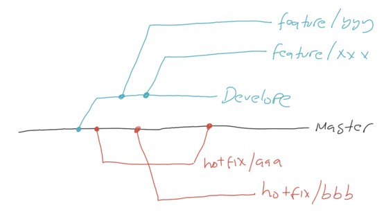

## #2 Branch

### Melihat Branch Saat ini

- Secara default, Git pasti akan membuat branch utama, biasanya master atau main
- Untuk melihat nama branch saat ini, kita bisa gunakan perintah:
- `git brnch --show-current`

### Membuat Branch

- Untuk membuat branch baru, caranya sangat mudah, kita bisa gunakan perintah:
- `git branch namabranchbaru`
- Saat kita buat branch baru, secara otomatis branch baru dimulai dari posisi branch kita saat ini, jika kita membuat branch baru ketika posisi kita sedang di branch master, maka branch baru tersebut akan dibuat dari branch master

### Diagram Membuat Branch Baru

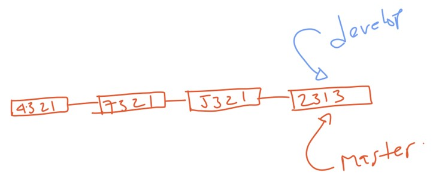

### Melihat Semua Branch

- Untuk melihat semua branch yang ada di Repository kita, kita bisa gunakan perintah:
- `git branch --list`
- Atau lebih singat:
- `git branch`

### Pindah ke Branch Lain

- Setelah kita membuat branch baru, kita tidak secara otomatis akan pindah branch
- Untuk pindah ke branch lain, kita perlu lakukan secara manual
- Caranya kita bisa gunakan perintah:
- `git switch namabranch`
- `git checkout namabranch`

### Mengubah Nama Branch

- Jika kita melakukan kesalahan pembuatan nama branah, kita juga bisa lakukan perubahan nama branch
- Namun untuk melakukannya, kita perlu pindah terlebih dahulu e branch yang ingin kita ubah namanya
- Setelah pindah kita bisa gunakan perintah:
- `git branch -m namabranchbaru`

### Menghapus Branch

- Jika sebuah branch sudah tidak digunakan lagi, idealnya kita perlu menghapus branch tersebut
- Untuk menghapus branch, kita perlu keluar terlebih dahulu dari branch tersebut
- Lalu gunakan perinah:
- `git branch -d namabranch`
- `git branch --delete namabranch`

## #3 Multiple Branch

- Pada kenyataanya, saat membuat aplikasi, branch biasanya akan dibuat banyak sekali
- Git mendukung multiple branch, artinya sebanyak apapun branch yang kita buat, Git bisa menanganinya dengan baik

### Tugas

- Buatlah 4 branch: feature/1, feature/2, feature/3, feature/4

### Diagram Multiple Branch

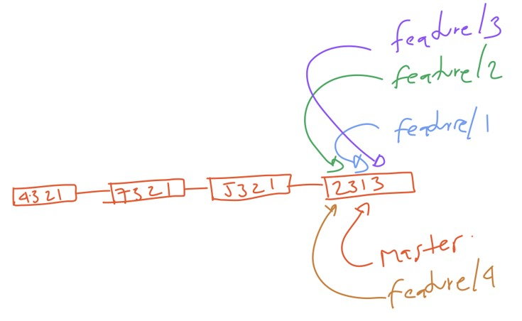

### Tugas

- Lalu di tiap branch lakukan commit untuk perubahan file:
- feature/1 untuk file1.txt
- feature/2 untuk file2.txt
- feature/3 untuk file3.txt
- feature/4 untuk file4.txt

### Diagram Multiple Branch

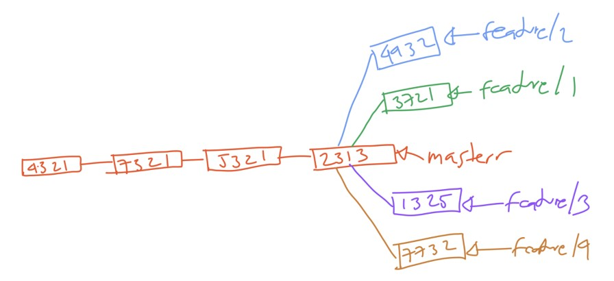

## #4 Merge

- Merge adalah proses dimaan kita melakukan penggabungan dua buah branch
- Merge biasanya dilakukan setelah kita selesai membuat kode program di sebuah branch, dan ingin menggabungakan fitur tersebut ke branch lain, misal ke branch utama
- Saat kita melakukan merge, branch tidak akan dihapus, artinya kita masih tetap bisa melakukan commit di branch yang ada
- Jika kita ingin menghapus branch yang sudah di merge, kita perlu lakukan secara manual

### Melakukan Merge

- Untuk melakukan merge, pertama kita perlu pindah ke branch dimana kita lokasi merge akan dilakukan
- Selanjutnya gunakan perintah:
- `git merge namabranch`
- Artinya branch dari namabranch akan di merge ke dalam branch saat ini kita berada

### Diagram Merge

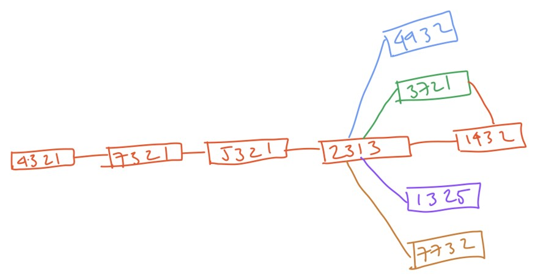

### Tugas

- Merge branch feature/1, feature/2, feature/3 dan feature/3 ke branch master

### Diagram Merge

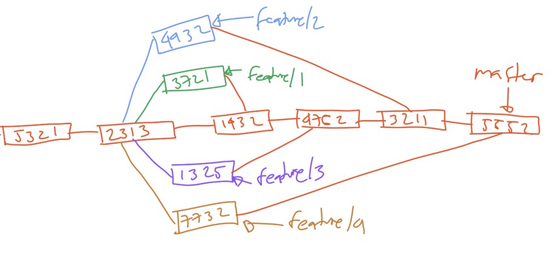

### Graph Log

- Lihat log git dalam bentuk graph menggunakan perintah:
- `git log --oneline --graph`

## #5 Merge Conflict

- Dalam pembuatan aplikasi, biasanya setiap programmer akan melakukan penambahkan kode program di Repository secara parallal
- Biasanya tiap programmer akan membuat branch masing-masing
- Dan tidak bisa dihindari, kadang programmer akan melakukan perubahan pada kode file yang sama di branch berbeda
- Dan biasanya ketika melakukan merge, akan terjadi yang namanya conflict
- Hal ini disebabkan, satu file diubah di branch yang berbeda, sehingga ketika di merge, kita perlu melakukan yang namanya Merge Conflict

### Tugas

- Buat dua branch dari branch utama
- Branch feature/1 mengubah file 1 dan file 2
- Branch feature/b mengubah file 1 dan file 3
- Merge branch feature/a ke branch utama
- Merge branch feature/b ke branch utama, hal ini akan memicu conflict

### Membatalkan Conflict

- Jika teradi conflict, maka kita wajib memperbaikinya terlebih dahulu
- Semua perubahan yang tidak konflik akan secara otomatis berada di Staging Index
- Sedangakan perubahan yang konflik akan secara otomatis berada di Working Directory
- Jika kita ingin membatalkan merge, kita bisa gunakan perintah:
- `git merge --abort`
- Secara otomatis semua perubahan di branch yang ingin kita merge akan dihapus

### Memperbaiki Conflict

- Saat terjadi conflict, tidak ada cara otomatis memperbaikinya
- Kita perlu memperbaiki conflict secara manual
- Dan jika perubahan conflict sudah dilakukan, maka kita perlu melakukan commit perubahan tersebut

### File Conflict

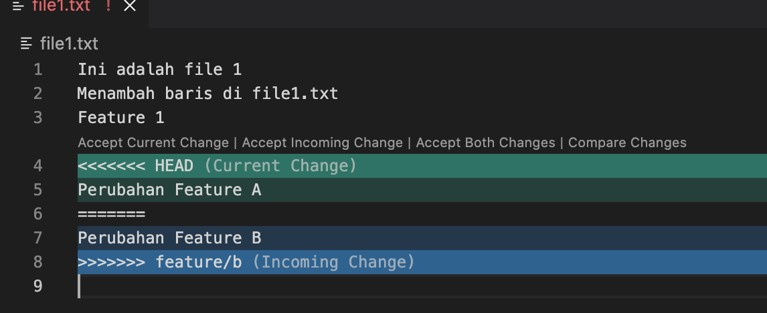

### Diagram Merge Conflict

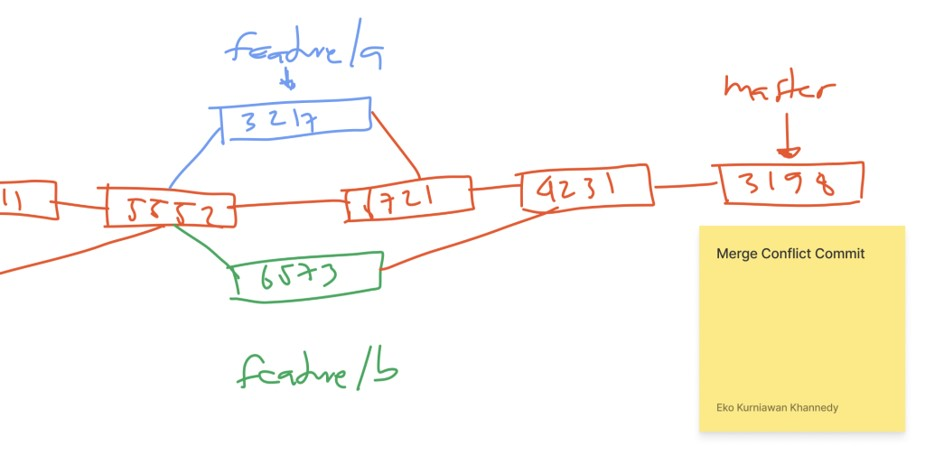

## #6 Cherry Pick

- Kadang ada kasus, ketika kita membuat kode program di sebuah branch kita ingin melakukan merge, namun tidak ingin melakukan merge semua branch nya, mungkin hanya sebagian commit saja
- Cerry Pick merupakan fitur yang digunakan untuk mengambil commit dari branch manapun dan kita merge ke dalam branch saat ini

### Tugas

- Buat branch feature/c
- Edit file1.txt lalu commit
- Edit file2.txt lalu commit
- Edit file3.txt lalu commit
- Edit file4.txt lalu commit

### Diagram Branch

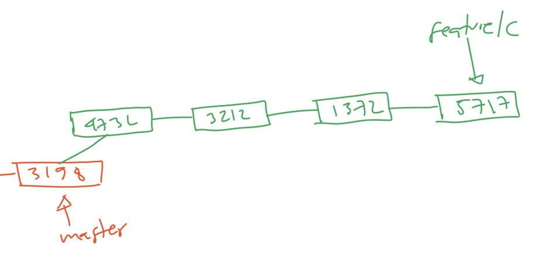

### Melakukan Cherry Pick

- Misal sekarang kita ingin melakukan merge branch feature/c, namun kita tidak ingin merge semua perubahan
- Misal saja kita hanya ingin melakukan merge perubahan di file1.txt dan file3.txt
- Maka kita bisa melakukan cherry pick untuk commut prubahan tersebut, caranya gunakan perintah:
- `git cherry-pick commitId`

### Diagram Hasil Cherry Pick

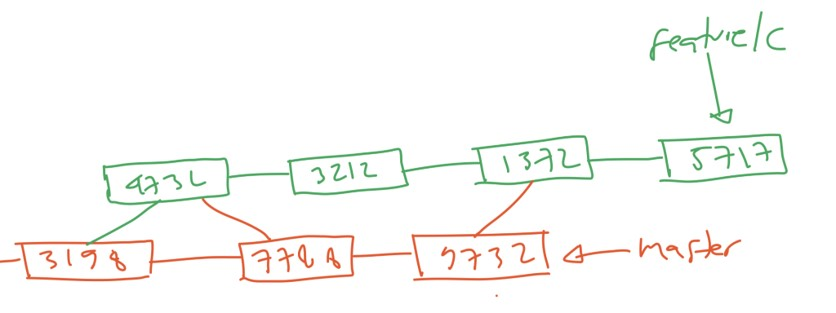

## #7 Tag

- Tag merupakan fitur, dimana kita bisa menandai sebuah commit id
- Sebelumnya kita sudah tahu denga HEAD, yaitu reference ke commit terakhir di branch kita saat ini
- Jika kita ingin membuat reference ke sebuah commit, kita bisa menggunakan Tag
- Dalam pengembangan perangkat lunak, biasanya Tag digunakan sebagai penanda versi rilis dari aplikasi, miasl Tag 1.0.0, Tag 1.0.2, dan lain-lain
- Karena Tag merupakan reference ke commit, jadi Tag bisa dilakukan di branch manapun

### Membuat Tag

- Tag adalah sesuatu yang untuk, artinya jika kita sudah membuat tag dengan nama A, maka kita tidak bisa membuat tag dengan nama yang sama lagi
- Untuk membuat tag, kita bisa gunakan perintah:
- `git tag tagName commitId`

### Tugas

- Buat file version.txt, lalu isi dengan informasi versi aplikasi
- Lakukan:
- Ubah file dengan isi 1.0.0 lalu commit dan buat tag untuk commit tersebut
- Ubah file dengan isi 1.0.1 lalu commit dan buat tag untuk commit tersebut
- Ubah file dengan isi 1.0.2 lalu commit dan buat tag untuk commit tersebut

### Menampilkan Tag

- Untuk menampilkan semua tag yang ada di Repository, kita bisa menggunakan perintah:
- `gat tag -l`
- `gat tag --list`

### Checkout ke Tag

- Seperti yang sudah dijelaskan di kelas Git Dasar, kita bisa melihat snapshot sebelumnya di Git
- Sekarang dengan menggunakan Tag, kita juga bisa melihat snapshot sebelumnya tanpa harus menggunaka commitId, cukup menggunaakn Tag:
- `git checkiut tagname`

### Menghapus Tag

- Tidak ada cara untuk mengubah Tag, jika kita ingin mengubah Tag, kita bisa membuat Tag baru ke commit yang sama, lalu menghapus Tag yang lama
- Untuk menghapus Tag, kita bisa gunakan perintah:
- `git tag -d namatag`
- `git tag --delete namatag`

### Tugas

- Silahkan hapus tag untuk versi rilis 1.0.1

## #8 Stash

- Kadang ada keadaan, dimana kita sedang melakukan perubahan di sebuah branch, namun perubahan nya belum disimpan di Repository, misal masih di Working atau Staging index
- Lalu kita butuh secepatnya melakukan prubahan di branch lain
- Jika pribahan tersebut belum siap kita commit, kita bisa menyimpan semua prubahan tersebut ke Stash
- Stash adalah sebuah tempat dimaan kita bisa menyimpan perubahan di Working atau Staging Index secara sementara agar branch saat ini menjadi bersih kembali, sehingga kita bisa pindah ke branch lain

### Tugas

- Di branch utama
- Buat branch baru dengan nama feature/d
- Di branch utama, buat perubahan di file1.txt, lalu commit
- Pindah ke branch feature/d
- Lakukan perubahan file1.txt, tambahkan ke Staging Index
- Lakukan perubahan file2.txt, biarkan di Working
- Pindahkan ke branch utama

### Error Ketika Pindah Branch

- Secara default, ketika kita melakukan perpindahan branch, Git akan secara pintas membawa perubahan yang terjadi di branch saat ini ke branch tujuan pindah
- Namun jika ternyata terdapat conflict, pada kasus kita, pada file1.txt terdapat conflict, maka secara otomatis kita tidak bisa pindah ke branch tersebut

### Menyimpan Perubahan ke Stash

- Untuk menyimpan semua perubahan yang terjadi di Working dan Staging Index, kita bisa menggunakan Stash
- Untuk menyimpan perubahan ke Stash, kita bisa gunakan perintah:
- `git stash push -m "messsage stash"`
- Untuk melihat semua Stash, kita bisa gunakan perintah:
- `git stash list`
- Untuk melihat perubahan yang terjadi di Stash, kita bisa gunakan perintah:
- `git stash show stashid`

### Tugas

- Simpan semua perubahan ke stash
- Pindah ke branch utama

### Mengambil Perubahan di Stash

- Untuk mengambil perubaha di stash, kita bisa gunakaan perintah:
- `git stash apply stashid`
- Untuk menghapus stash, kita bisa gunakan perintah:
- `git stash drop stashid`
- Untuk menghapus semua stash, kita bisa gunakan perintah
- `git stash clear`

### Tugas

- Pindah ke branch feature/d
- Ambil perubahan di stash
- Lalu hapus data stash
- Commit perubahan di branch

## #9 Rebase

- Sebelumnya untuk menggabungkan dua buah branch, kita sudah belajar yang namanya merge
- Sekarang kita akan bahas tentang cara lain menggabungkan dua buah branch, yaitu rebase
- Rebase agak sedikit kompleks, jadi kita akan coba bahas secara visual

### Diagram Branch

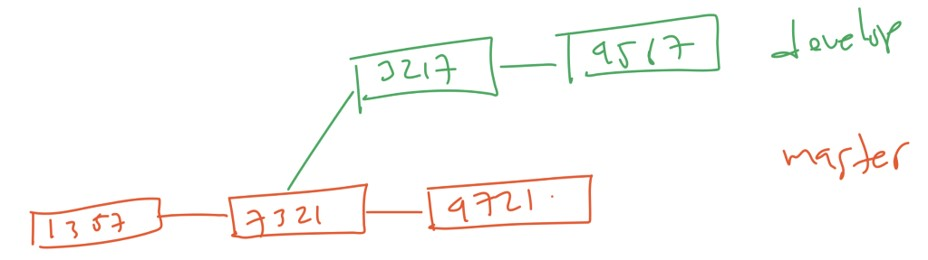

### Diagram Merge Branch

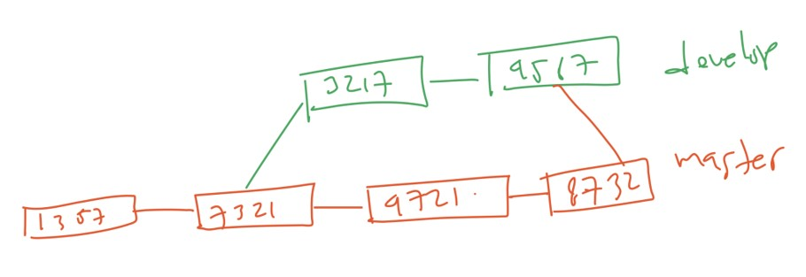

### Diagram Rebase Branch

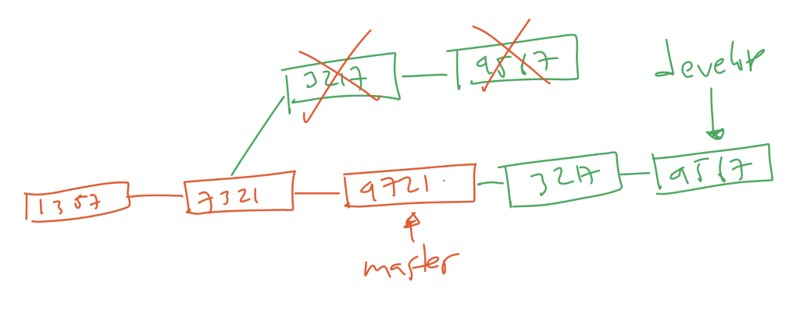

### Tugas

- Di branch utama, buat branch feature/rebase
- Di branch utma, ubah file1.txt lalu commit
- Pindah ke branch feature/rebase
- Di branch feature/rebase, ubah file2.txt lalu commit
- Di branch feature/rebase, ubah file3.txt lalu commit

### Melakukan Rebase

- Untuk melakukan rebase, kita bisa lakukan perintah:
- `git rebase namabranch`
- Jika sekarang kita ada di branch feature/rebase, lalu menggunakan perintah:
- `git rebase master`
- Artinya kita melakukan rebase semua commit di master ke branch develop

### Tugas

- Pindah ke branch feature/rebase
- Lakukan rebase dengan branch master

### Merge Branch

- Setelah melakukan rebase, bukan berarti branch yang di rebase sekarang posisinya ada di branch yang melakukan rebase, posisinya tetap ada di commit terakhir di branch tersebut
- Seperti yang terlihat pada gambar Diagram Rebase Branch
- Agar posisinya sama dengan branch yang melakukan rabase, kita bisa menggunaakan perintah merge

### Diagram Seteleh Merge

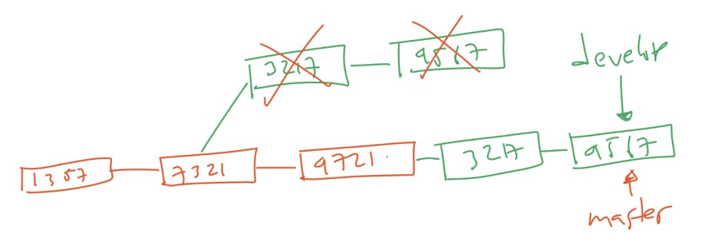

### Merge vs Rebase

- Rebase akan terlihat sangat rapih, karena timeline nya seakan terlihat hanya ada satu timeline pada Repository
- Namun, rebase sebenarnya secara otomatis menulis ulang semua commit yang kita lakukan dalam antrian commit id pasti berubah, artinya semua referensi ke commut id sebelum-sebelumnya akan rusak dan hilang
- Tidak ada mana yang lebih baik, semua tergantung kebutuhan

## #10 Squash

- Saat kita melakukan merge atau rebase, semua commit history akan tetap ada
- Jika kita di branch tersebut melakukan commit sebanyak 10 kali, ketiak kita lakukan merge atau rebase, maka 10 commit tersebut akan tetap ada
- Kadang ada kasus dimana kita ingin melakukan penggabungan commut tersebut menjadi 1 commit saja, hal ini dinamakan Squash
- Squash akan membuat 10 commit history tersetbut menjadi 1 commit, dimana semua 10 perubahan tersebut akan digabungkan menjadi 1 commit saja

### Diagram Merge Tanpa Squash

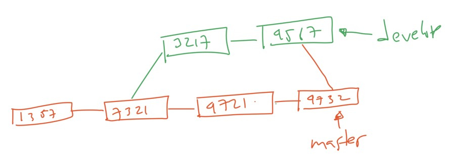

### Diagram Merge Mengguanakan Squash

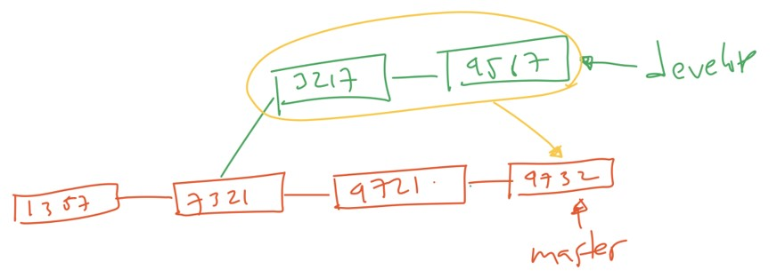

### Melakukan Squash

- Squash bisa dilakukan ketika merge atau ketika rebase
- Untuk melakukan squash ketika merge, kita bisa gunakan perintah:
- `git merge --squash namabranch`

### Tugas

- Di branch master, buat branch feature/merge-squash
- Di branch master, buat perubahan file version.txt
- Di branch feature/merge-squash, buat commut file 1 dan file 2
- Di branch master, merge dengan branch feature/merge-squash menggunakan squash

### Git Branching Strategy

- Materi untuk Git Branching sebenarnya sudah selesai
- Kita sudah mulai bisa menggunakan fitur branching untuk mulai membuat aplikasi kita
- Namun sebelum selesai, kita akan bahas beberapa strategy Git Branching yang populer, yang bisa kita tiru ketika membuat aplikasi

### Git Branching Strategy Populer

- Gitflow Workflow
- Trunk Based Development Workflow
- Forking Workflow

## #11 Gitflow Workflow

- Gitflow adalah strategy git branching yang paling tua dan paling banyak diadopsi
- <https://nvie.com/posts/a-successful-git-branching-model/>

## #12 Trunk Based Development

- Trunk Based Development sekarang merupakan salah satu strategy git branching yang sedang populer
- Tujuan dari workflow ini adalah, sederhana dan deliver pekerjaan secepatnya
- <https://trunkbaseddevelopment.com/>

## #13 Forking Workflow

- Forking workflow merupakan salah satu strategy git branching yang populer dalam project OpenSource
- Forking adalah mekanisme menduplikasi repository, biasanya hal ini dilakukan karena contributor tidak memiliki akses untuk melakukan perubahan ke repository utama
- <https://www.atlassian.com/git/tutorials/comparing-workflows/forking-workflow>

## #14 Materi Selanjutnya

- Git Remote
