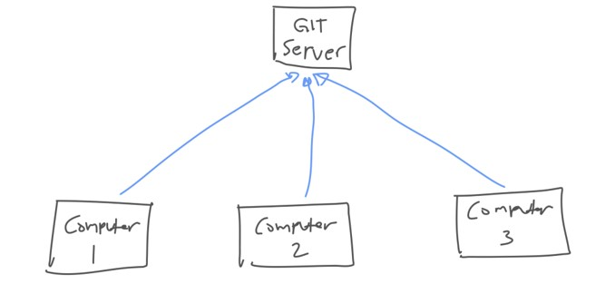
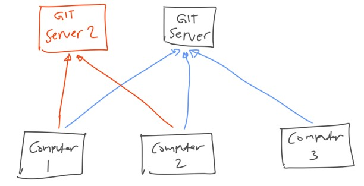
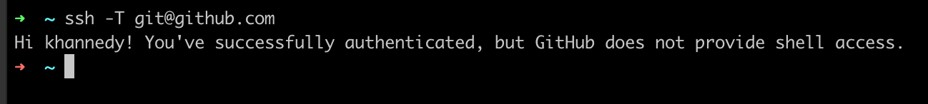
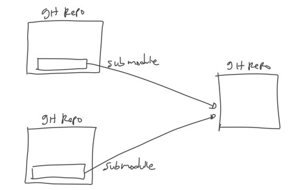

# Git Remote

## Sebelum Balajar

- Git Dasar
- Git Branching

## Agenda Git Remote

- Pengenalan Git Remote
- Git Server
- Git Server Repository
- Push
- Fetch
- Pull
- Dan lain-lain

## #1 Pengenalan Git Remote

### Git Remote

- Sebelumnya kita sudah belajar semua fitur yang terdapat di Git
- Namun semua fitur yang sudah kita bahas. masih kita lakukan di local komputer kita masing-masing
- Saat nanti bekerja dengan tim, atau berkolaborasi, kita tidak hanya akan menyimpan git repository pada satu komputer saja
- Tiap anggota tim, kemungkunan akan meng-copy git repository yang kita buat, dan juga melakukan kontribusi ke git repository nya
- Git mendukung centralized server, dimana kita bisa menyimpan perubahan git repository di komputer ke Git server
- Karena Git merupakan distributed version control, walaupun kita gunakan Git Server, tpi kita tidak wajib terkoneksi ketika ingin mengelola git repository
- Hanya ketika kita ingin mengirim perubahan atau mengambil perubahan, baru kita butuh terkoneksi ke Git Server

### Diagram Git Remote

### Multiple Git Server

- Karena Git merupakan distributed system, jadi kita tidak hanya bisa menggunakan satu Git Server
- jadi kita mau, kita juga bisa menggunakan beberapa Git Server sekaligus ketika membuat git repository
- Nanti kita bisa memilih, mau mengirim perubahan atau mengambil perubahan ke Git Server yang mana

### Diagram Multipe Git Server

## #2 Git Server

- Git Server adalah Server yang bisa digunakan untuk menyimpan repository git yang sudah kita buat di local
- Ada banyak sekali Git Server yang tersedia, baik itu yang gratis atau pun berbayar
- Kelebihan ketika kita menggunakan Git Server adalah, data repository aman tersimpan di Server sehingga jika kita hapus git repository nya di local, repository akan tetap aman di Server

### Contoh Git Server

- Ada banyak sekali Git Server yang tersedia, kita bisa gunakan salah satunya
- Github: <https://github.com>
- Gitlab: <https://gitlab.com>
- Bitbucket: <https://bitbucket.org>
- Dan lain-lain

### Github

- Pada kelas ini, kita akan menggunakan Git Server yang paling populer dan banyak digunakan, yaitu Github
- Github memiliki veri gratis dan versi bebayar
- Banyak sekali project Open Source yang menggunakan Github untuk menyimpan git repository nya
- Silahkan membuat akun terlebih dahulu di Github
- <https://github.com>

## #3 Git Server Repository

- Tiap Git Server biasanya memiliki fitur untuk membuat Git Repository
- Tidak wajib hasus membuat Git Repository di local dulu jika ingin membuat Git repository di Git Server
- Sekarang silahkan buat Git Repository di Github dengan nama belajar-git-remote
- <https://github.com/new>

## #4 SSH

- SSH adalah singkatan dari Secure Shell
- SSH merupakan protokol jaringan untuk komunikasi jaringan yang aman dan terenkripsi
- Pengguna sistem operasi Linux atau Mac biasanya sudah sangat familiar dengan SSH
- SSH merupakan aplikasi berbasis terminal
- Di Linux dan Mac, SSH sudah terinstall secara otomatis, sedangkan di Windows, ketika kita menginstall Git, secara otomatis Git akan menginstall SSH juga

### Git SSH

- Git sendiri memiliki beberapa mekanisme untuk berkomunikasi dengan Git Server, seperti http dan SSH
- Pada kelas ini, kita akan menggunakan SSH untuk berkomunikasi dengan Git Server
- Hal ini karena SSH merupakan protokol yang direkomendasikan ketika berkomunikasi dengan Git Server

### SSH Key

- Hal pertama yang perlu kita lakukan ketika menggunakan SSH adalah, membuat SSH Key
- SSH Key merupakan kunci yang digunakan untuk autentikasi ke SSH Server
- Untuk membuat SSH Key, kita bisa gunakan perintah `ssh-keygen` di terminal
- Setelah selesai, maka secara otomatis akan terdapat 2 key di local kita, yaitu private key dan public key
- Kita bisa melihatnya di dalam folder `.ssh` di Home directory kita
- File `id_rsa` adalah private key, dan `id_rsa.pub` adalah public key

### Menambahkan SSH Public Key ke Github

- Setelah kita membuat SSH Key, selanjutnya kita perlu meregistrasikan SSH public key ke Github
- Hal ini dilakukan, agar ketika kita nanti terkoneksi ke Git Server di Github, kita tidak perlu melakukan autentikasi lagi
- <https://github.com/settings/keys>

### Test SSH ke Github

- Selanjutnya untuk memastikan apakah kita sudah bisa terkoneksi ke Github menggunakan SSH kita bsia gunakan perintah:
- `ssh -T git@github.com`

## #5 Remote Repository

- Ketika kita membuat Git Project, secara default, Git tidak tahu tentang Remote Repository
- Kita perlu memberi tahu ke git project yang sudah kita buat tentang lokasi git repository

### Menambahkan Remote Repository

- Untuk menambahkan remore repository, kita bisa gunakan perintah
- `git remote add nama ssh-url`
- Salah satu kebiasaan di Git, biasanya memberi nama untuk remote repository dengan nama origin

### Melihat Remote Repository

- Untuk melihat remote repository yang ada di git project, kita bisa gunakan perintah:
- `git remote`
- Untuk melihat URL detail remote repository, kita bisa gunakan perintah:
- `git remote get-url nama`

### Menghapus Remote Repository

- Untuk menghapus remote repository. kita bisa gunakan perintah:
- `git remote rm nama`

## #6 Push

- Walaupun kita sudah menyimpan perubahan di Git Project di local, tapi tidak secara otomatis akan di sync dengan Remote Repository
- Hal ini karena sejak awal Git di desain sebagai distributed version control, artinya kita bisa melakukan perubahan dimanapun dan kapanpun, tanpa harus terkoneksi ke Git Server
- Oleh karena itu, jika kita ingin mengirim perubahan yang terjadi ke Git Project di local kita, kita perlu mengirimnya secara manual ke Git Server
- Untu mengirim perubahan di local ke git server, kita bisa gunakan perintah yang bernama push

### Push Branch

- Untuk mengirim peribahan branch ke remote repository dengan nama branch sama:
- `git push namaremote localbranch`
- Untuk mengirim perubahan branch ke remote repository dengan nama branch yang berbeda, kita bisa gunakan perintah
- `git push namaremote localbranch:remotebranch`

### Push Semua Branch

- Jika kita ingin mengirim semua perubahan di semua branch ke remote repository, kita bisa gunakan perintah:
- `git push origin --all`

### Menghapus Branch

- Perintah Push juga bisa digunakan untu menghapus branch yang ada di remote repository
- Kita bisa gunakan perintah:
- `git push --delete namaremote namabranch`
- Perlu diingat, menghapus remote branch bukan berarti menghapus branch ke local, jadi jika kita ingin hapus di local, kita harus lakukan secara manual

## #7 Clone

- Apa yang harus dilakukan jika misal kita ingin download project Git yang ada di Server ke komputer baru?
- Hal ini dinamakan perintah clone
- Dengan perintah clone, kita bisa download project di remote repository ke local dan secara otomatis di download sebagai git project

### Melakukan Clone

- Untuk melakukan cline, kita bisa gunakan perintah
- `git clone urlremoterepository`
- Secara default, clone akan membuat project dengan nama folder sama dengan nama project remote repository
- Jika kita ingin melakukan clone, dengan nama folder yang bebeda dengan naam project remote repository, kita bisa gunakan perintah:
- `git clone urlremoterepository namafolder`

### Default Hasil Clone

- Default clone akan berisi remote repository origin ke git remote repository yang kita clone
- Default clone akan berisikan branch di remote repository

### Tugas

- Simulasikan terdapat dua pengguna
- Clone project Git di remote di folder yang berbeda

## #8 Remote Branch

### Melihat Remote Branch

- Secara default, saat kita melakukan clone, tidak semua remote branch akan di buat di local git project
- Jika kita ingin melihat semua daftar branch yang ada di remote repository, kita bisa gunakan perintah:
- `git branch -r`
- Atau jika kita ingin melihat semua branch di lcoal dan remote, kita bisa gunakan perintah:
- `git branch -a`

### Membuat Branch dari Remote Branch

- Karena secara default hanya branch utama yang di buat di local project ketika kita clone, kadang kita ingin membuat local branch yang berisikan data dari remote branch
- Untuk melakukan hal itu, kita bisa gunakan perintah:
- `git checkout -b local branch namaremote/remotebranch`

## #9 Fetch

- Fetch adalah perintah di Git yang digunakan untuk mendapatkan perubahan terakhir dari remote repository
- Hal ini berguna ketika misal kita ingin mengetahui perubahan apa aja yang sudah terjadi pada remote repository, mungkin rekan kerja kita sudah menambah perubahan ke remote repository
- Fetch itu tidak akan mengubah isi local Git Project kita

### Melakukan Fetch

- Untuk mealakukan fetch untuk semua branch di remote repository, kita bisa gunakan perintah:
- `git fetch namaremote`
- Atau jika kita ingin melakukan fetch untuk branch tertentu saja di remote, kita bisa gunakan:
- `git fetch namaremote remotebranch`

### Tugas

- Lakukan commit dan push di user pertama
- Lakukan fetch di user kedua
- Di user kedua Lakukan git diff dari branch local dan branch remote

## #10 Pull

- Jika fetch hanya melakukan untuk mendapatkan perubahan di remote repository tanpa mengubah local repository
- Dengan menggunakan pull, kita akan mengambil perubahan yang ada di remote repository dan disimpan di local repository
- Hati-hati jangan sampai terjadi merge conflict, jika teradi merge conflict, kita harus perbaiki secara manual seperti yang sudah kita pelajari di materi merge
- Saat kita melakukan pull, secara otomatis kita akan melakukan fetch terlebih dahulu

### Melakukan Pull

- Untuk melakukan pull ke local branch saat ini, kita bisa gunakan perintah git pull namaremote namaremotebranch

### Tugas

- Lakukan commut dan push di user pertama
- Lakukan pull di user kedua
- Bandingkan local branch dan remote branch di user kedua

## #11 Tag

- Saat kita melakukan push data ke remote repository, data Tas tidak akan di push juga ke remote repository
- Jika kita ingin mengirim data Tag juga, kita perlu melakukan push tag tersebut

### Mengirim Tag

- Untuk mengirim Tag ke remote repository, kita bisa gunakan perintah:
- `git push namaremote namatag`
- Atau juga kita ingin mengirim semua Tag ke remote repository, kita bisa gunakan perintah:
- `git push namaremote --tags`

### Mengambil Tag

- Untuk mengambil Tag, kita bisa gunakan perintah:
- `git fetch namaremote namatag`
- Atau jika kita ingin mengambil semua Tag, kita bisa gunakan perintah:
- `git fetch namaremote`

### Menghapus Tag

- Saat kita menghapus Tag di local repository, data tag tersebut tetap ada di remote repository
- Jika kita ingin menghapus Tag di remote repository, kita bisa gunakan perintah:
- `git push --delete namaremote namatag`

## #12 Pull Request

- Saat kita bekerja dengan tim, biasanya saat melakukan perubahan kita akan membuat di branch yang berbeda dengan branch utama
- Seteleh selesai, kita bisa melakukan yang namanya merge ke branch utama
- Namun, beberapa fitur di remote git repository mendukung fitur yang namanya Pull Request atau Merge Request
- Fitur ini sangat cocok untuk melakukan review otomatis di remote git repository, tanpa harus manual melakukan review dengan git diff

## #13 Merge Conflict

- Ketika melakukan Pull Request, kadang sering terjadi Merge Conflict, yang menyebabkan tidak bisa lakukan proses merge otomatis
- Pada kasus seperti itu, kita perlu melakukan merge dari branch asal nya terlebuh dahulu, lalu memperbaiki conflict nya

## #14 Submodule

- Saat kita membuat project aplikasi, kadang kita ingin membuat library yang berisi kode program yang ingin digunakan di beberapa aplikasi
- Pada kasus seperti ini, fitur Git Submodule sangat bermanfaat
- Git Submodule memungkinkan kita menambahkan git repository ke git repository yang lain,, atau dinamakan submodule
- Dengan menggunakan submodule, kita bisa melakukan management git repository terpisah namun kisa bisa mengakses git repository lain

### Diagram Submodule

### Menambah Submodule

- Untuk menambah submodule ke dalam git repository, kita bisa gunakan perintah:
- `git submodule add urlgitrepo namafolder`
- Saat kita menambah submodule, secara otomatis semua git repository submodule tersebut akan di clone ke dalam folder yang kita tentukan
- Bagaimana git mendeteksi bahwa folder itu adalah submodule?
- Git akan mendeteksinya dari file `.gitmodules`

### Submodule Repository

- Saat kita masuk ke folder submodule, sebenarnya akan seperti berada di project git repository
- Kita bisa melakukan management git repository di submodule tersebut, seperti melakukan commit, mengelola branch dan lain-lain
- Namun tidak disarankan untuk melakukan perubahan di submodule, lakukan perubahan langsung di gir repository nya, anggap submodule hanya digunakan untuk meduplikasi perubahan yang terjadi di git repository sumber asli nya

### Update Submodule

- Jika terjadi perubahan di repository submodule, kita bisa mendapat update perubahannya dengan menggunakan perintah:
- `git submodule update --remote namafolder`
- Atau jika ingin semua submodule di update, kita bisa gunakan perintah:
- `git submodule update --remote`
- Atau jika kita melakukan update manual, kita bisa masuk ke dalam folder submodule, lalu melakukan pull ke git remote submodule tersebut
- Selanjutnya untuk download submodule git repository nya, kita bisa gunakan perintah submodule update

### Mengubah Branch Submodule

- Untuk mengubah branch di submodule, sebenarnya kita bisa lakukan secara manual menggunakan perintah git branch
- Namun hal ini tidak akan membuat konsisten, karena bisa jadi tiap orang bisa bebeda-beda branch submodule nya
- Agar sama, kita bisa gunakan perintah submodule `set-branch` untuk mengubah branch submodule, sehingga secara otomatis semua git repo akan menggunakan branch yang sudah ditentukan
- Caranya kita bisa gunakan perintah:
- `git submodule set-branch --branch namabranch namafolder`

### Menghapus Submodule

- Untuk menghapus submodule, kita bisa hapus folder submodule, lalu ubah file `.gitmodules` nya

## #15 Fork

- Salah satu git workflow yang sebelumnya kita jelaskan di kelas Git Branching adalah Forking Worklow
- Forking Workflow biasanya digunakan ketika kita ingin kontribusi ke project opensource, dimana kita tidak punya akses langsung ke git repository nya, sehingga kita melakukan forking (duplikasi) git repository ke tempat kita
- Pada kasus menggunakan github, misal kita melakukan forking dari ProgrammerZamanNow ke github profile kita

### Pull Request

- Semua perubahan nanti dilakukan di git repository profile kita
- Dan setelah selesai, kita bisa melakukan pull request ke repository forking kita
- Seperti inilah cara kerja ketika kita berkontribusi ke project opensource

## #16 Materi Selanjutnya

- Mulai gunakan Git untuk semua Project Aplikasi
