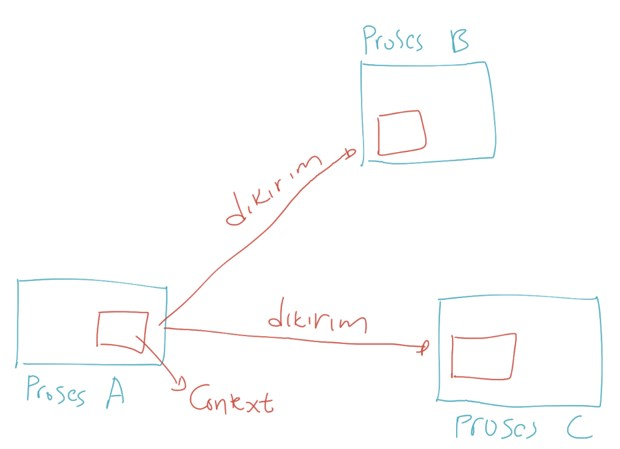
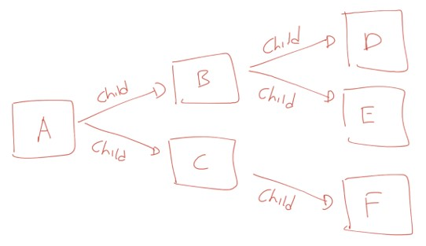

# Golang Context

## Sebelum Belajar

-  Go-Lang Dasar
-  Go-Lang Modules
-  Go-Lang Unit Test
-  Go-Lang Goroutines

## Agenda

-  Pengenalan Context
-  Membuat Context
-  Context With Value
-  Context With Cancel
-  Context With Timeout
-  Context With Deadline

## #1 Pengenalan Context

-  Context merupakan sebuat data yang membawa value, sinyal cancel, sinyal timeout dan sinyal deadline
-  Context biasanya dibuat per request (musal setiap ada request masuk ke server web melalui http request)
-  Context digunakan untuk mempermudah kita meneruskan value, dan sinyal antar proses

### Kenapa Context Perlu Dipelajari?

-  Context di Golang biasa digunakan untuk mengirim data request atau sinyal ke proses lain
-  Dengan menggunakan context, ketika kita ingin membatalkan semua proses, kita cukup mengirim sinyal ke context, maka secara otomatis semua proses akan dibatalkan
-  Hampir semua bagian di Golang memanfaatkan context, seperti database, http server, http client dan lain-lain
-  Bahkan di Google sendiri, ketika menggunakan Golang, context wajib digunakan dan selalu dikirim ke setiap function yang dikirim

### Cara Kerja Context



### Pacakge Context

-  Context direpresentasikan di dalam sebuah interface Context
-  interface Context terdapat pada package context
-  <https://golang.org/pkg/context>

### Kode: Interface Context

```go
type Contect interface {
	Deadline() (deadline time.Time, ok bool)

	Done() <-chan struct{}

	Err() error

	Value(key interface{}) interface{}
}
```

## #2 Membuat Context

-  Karena Context adalah sebuah interface, untuk membuat context kita butuh sebuah struct yang sesuai dengan kontrak interface Context
-  Namun kita tidak perlu membuatnya secara manual
-  Di Golang package context terdapat function yang bisa kita gunakan untuk membuat Context

### Function Memebuat Context

| Function               | Keterangan                                                                                                                                                                                          |
| ---------------------- | --------------------------------------------------------------------------------------------------------------------------------------------------------------------------------------------------- |
| `context.Background()` | Membuat context kosong. Tidak pernah dibatalkan, tidak pernah timeout, dan tidak memiliki value apapun. Biasanya digunakan di main function atau dalam test. atau dalam awal proses request terjadi |
| `context.TODO()`       | Membuat context kosong seperti `Background()`, namun biasanya menggunakan ini ketika belum jelas context apa yang ingin digunakan                                                                   |

### Kode: Membuat Context

```go
func TestContext(t *testing.T) {
	background := context.Background()
	fmt.Println(Background)

	todo := context.TODO()
	fmt.Println(todo)
}
```

## #3 Parent dan Child Context

-  Context manganut konsep parent dan child
-  Artinya, saat kita membuat context, kita bisa membuat child context dari context yang sudah ada
-  Parent context bisa memiliki banyak child, namun child hanya bisa memiliki satu parent context
-  Konsep ini mirip dengan pewarisan di pemrograman berorientasi object

### Diagram: Parent dan Child Context



### Hubungan Antara Parent dan Child Context

-  Parent dan Child ontext akan selalu terhubung
-  Saat nanti kita melakukan misal pembatalan context A, maka samua child dan sub child dari context A akan ikut dibatalkan
-  Namun jika misal kita membatalkan context B, hanya context B dan semua child dan sub child nya yang dibatalkan, parent context B tidak akan ikut dibatalkan
-  Begitu juga nanti saaat kita menyisipkan data ke dalam context A, semua chils dan sub child nya bisa mendapatkan data tersebut
-  Namun jika kita menyisipkan data di context B, hanya context B dan semua child dan sub child nya yang mendapat data, parent context B tidak akan mendapat data

### Immutable

-  Context merupakan object yang Immutable, artinya setelah Context dibuat, dia tidak bisa diubah lagi
-  Ketika kita menambahkan value ke dalam context, atau menambahkan pengaturan timeout dan yang lainnya, secara otomatis akan membentuk child context baru, bukan merubah context tersebut

### Cara Membuat Child Context

-  Cara membuat child context ada banyak caranya, yang akan kita bahas di materi-materi selanjutnya

## #4 Context With Value

-  Pada saat awal membuat context, context tidak memiliki value
-  Kita bisa menambah sebuah value dengan data Pair (key - value) ke dalam context
-  Saat kita menambah value ke context, secara otomatis akan tercipta child context baru, artinya original context nya tidak akan berubah sama sekali
-  Untuk membuat menambahkan value ke context, kita bisa menggunakan function
-  `context.WithValue(parent, key, value)`

### Kode: Context With Value

```go
contextA := context.Background()

contextB := context.WithValue(contextA, "b", "B")
contextC := context.WithValue(contextA, "c", "C")

contextD := context.WithValue(contextB, "d", "D")
contextE := context.WithValue(contextB, "e", "E")

contextF := context.WithValue(contextC, "f", "F")
```

### Kode: Context Get Value

```go
fmt.Println(contextF.Value("f")) // dapat
fmt.Println(contextF.Value("c")) // dapat milik parent
fmt.Println(contextF.Value("b")) // tidak dapat, beda parent
fmt.Println(contextF.Value("b")) // tidak bisa mengambil data child
```

## #5 Context With Cancel

-  Selain menambahkan value ke context, kita juga bisa menambahkan sinyal cancel ke context
-  Kapan sinyal cancel diperlukan dalam context?
-  Biasanya ketika kita butuh menjalankan proses lain, dan kita bisa memberi sinyal cancal ke proses tersebut
-  Biasanya proses ini berupa goroutine yang berbeda, sehingga dengan mudah jika kita ingin membatalkan eksekusi goroutine, kita bisa mengirim sinyal cancel ke context nya
-  Namun ingat, goroutine yang menggunakan context, tetap harus melakukakn pengecekan terhadap context nya, jika tidak, tidak ada gunanya
-  Untuk membuat context dengan cancel signal, kita bisa menggunakan function
-  `context.WithCancel(parent)`

### Kode: Contoh Goroutine Leak(1)

```go
func CreateCounter() chan int {
	destination := make(chan int)
	go func() {
		defer close(destination)
		counter := 1
		for {
			destination <- counter
			counter++
		}
	}()
	return destination
}
```

### Kode: Contoh Goroutine Leak(2)

```go
fmt.Println(runtime.NumGoroutine())

destination := CreateCounter()
for n := range destination {
	fmt.Println("Counter", n)
	if n == 10 {
		break
	}
}

fmt.Println(runtime.NumGoroutine())
```

### Kode: Context With Cancel (1)

```go
func CreateCounter(ctx context.Context) chan int {
	destination := make(chan int)
	go func() {
		defer close(destination)
		counter := 1
		for {
			select {
			case <-crx.Done():
				return
			default:
				destination <- counter
				counter++
			}
		}
	}()
	return destination
}
```

### Kode: Context With Cancel (2)

```go
fmt.Println(runtime.NumGoroutine())
parent := context.Background()
ctx, cancel := context.WithCancel(parent)

destination := CreateCounter(ctx)
for n := range destination {
	fmt.Println("Counter", n)
	if n == 10 {
		break
	}
}
cancel()

fmt.Println(runtime.NumGoroutine())
```

## #6 Context With Timeout

-  Selain menambahkan value ke context, dan juga sinyal cancel, kita juga bisa menambahkan sinyal cancel ke context secara otomatis dengan menggunakan pengaturan timeout
-  Dengan menggunakan pengaturan timeout, kita tidak perlu melakukan eksekusi cancel secara manual, cancel akan otomatis di eksekusi jika waktu timeout sudah terlewati
-  Penggunaan context dengan timeout sangat cocok ketika misal kita melakukan query ke database atau http api, namun ingin menentukan batas maksimal timeout nya
-  Untuk membuat context dengan cancel signal secara otomatis menggunakan timeout, kita bisa menggunakan function `context.WithTimeout(parent, duration)`

### Kode: Context With Timeout (1)

```go
func CreateCounter(ctx context.Context) chan int {
	destination := make(chan int)
	go func() {
		defer close(destination)
		counter := 1
		for {
			select {
			case <-crx.Done():
				return
			default:
				destination <- counter
				counter++
				time.Sleep(1 * time.Second) // simulate slow process
			}
		}
	}()
	return destination
}
```

### Kode: Context With Timeout (2)

```go
fmt.Println(runtime.NumGoroutine())
parent := context.Background()
ctx, cancel := context.WithTimeout(parent, 5 *time.Second)
defe cancel()

destination := CreateCounter(ctx)
for n := range destination {
	fmt.Println("Counter", n)
}

fmt.Println(runtime.NumGoroutine())
```

## #7 Context With Deadline

-  Selain menggunakan timeout untuk melakukan cancel secara otomatis, kita juga bisa menggunakan deadline
-  Pengaturan deadline sedikit berbeda dengan timeout, jika timeout kita beri waktu dari sekarang kalo deadline ditentukan kapan waktu timeout nya, misal jam 12 siang hari ini
-  Untuk membuat context dengan cancel signal secara otomatis menggunakan deadine, kita bisa menggunakan function `context.WithDeadline(parent, time)`

### Kode: Context With Deadline

```go
fmt.Println(runtime.NumGoroutine())
parent := context.Background()
ctx, cancel := context.WithDeadline(parent, time.Now().Add(5*time.Second))
defer cancel()

destination := CreateCounter(ctx)
for n := range destination {
	fmt.Println("Counter", n)
}

fmt.Println(runtime.NumGoroutine())
```

## #8 Materi Selanjutnya

-  Go-Lang Database
-  Go-Lang Web
