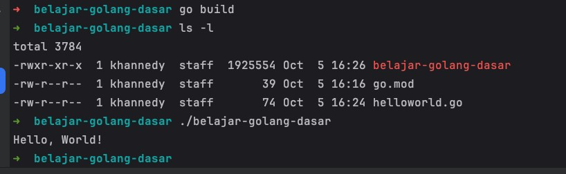
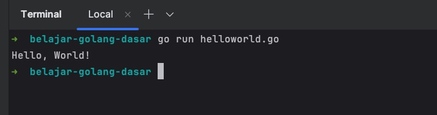
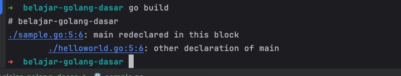
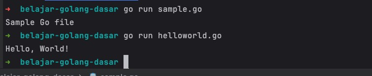
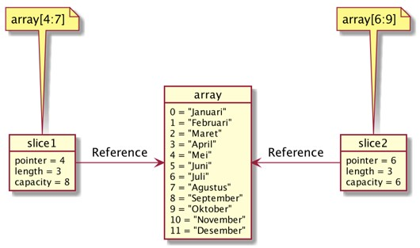
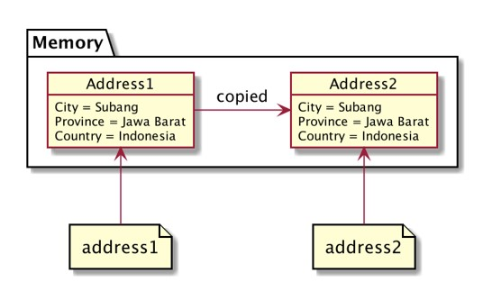
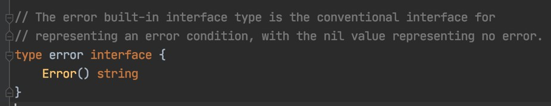

# Golang Dasar 2023

## Sebelum Belajar

- Mengerti cara menggunakan komputer
- Mengerti cara menginstall aplikasi
- Mengerti cara menggunakan terminal/command prompt

## #1 Pengenalan Go-Lang

- Dibuat di Google menggunakan bahasa pemrograman C
- Di Rilis ke public sebagai open source pada tahun 2009
- Go-Lang populer sejak digunakan untuk membuat Docker pada tahun 2011
- Saat ini mulai banyak teknologi baru yang dibuat menggunakan bahasa Go-Lang dibanding bahasa C, seperti Kubernetes, Prometheus, CockroachDB, dan lain-lain
- Saat ini mulai populer untuk pembuatan Backend API di Microservices

### Kenapa Belajar Go-Lang?

- Bahasa Go-Lang sangat sederhana, tidak butuh waktu lama untuk mempelajarinya
- Go-Lang mendukung baik concurrency programming, dimana saat ini kita hidup di zaman multicore processor
- Go-Lang mendukung garbage collector, sehingga tidak butuh melakukan management memory secara manual seperti di bahasa C
- Salah satu bahasa pemrograman yang sedang naik daun

### Proses Development Program Go-Lang


## #2 Menginstall Go-Lang

### Software Development

- <https://golang.org/>
- Download Compiler Go-Lang
- Install Compiler Go-Lang
- Cek menggunakan perintah : `go version`

### Text Editor atau IDE

- Visual Studio Code
- JetBrains GoLand

## #3 Membuat Project

- Project di Go-Lang biasanya dibuat sebagai module
- Untuk membuat module, kita bisa menggunakan perintah berikut di folder tempat kita akan membuat module:
- `go mod init nama-module`
- Fitur Go-Lang Modules sebenarnya masih banyak, namun akan kita bahas di kelas khusus membahas tentang Go-Lang Modules

### Kode: Membuat Module

```sh
go mod init belajar-golang-dasar
```

## #4 Program Hello World

- Go-Lang, itu mirip seperti bahasa pemrograman C/C++, dimana perlu ada yang namanya main function
- Main function adalah sebuah fungsi yang akan dijalankan ketika program berjalan
- Untuk membuat function, kita bisa menggunakan kata kunci `func`
- Main function harus terdapat didalam main package
- Titik koma di Golang, tidaklah wajib, artinya kita bisa menambahkan titik koma atau tidak, diakhir kode program kita

### Kode: Main Function

```go
package main

func main() {

}
```

### Println

- Untuk menulis tulisan, kita perlu melakukan import module `fmt` terlebih dahulu
- Mirip ketika kita belajar Java
- Materi tentang import, akan kita bahas di bagian tersendiri

### Program Hello World

```go
package main

import "fmt"

func main() {
	fmt.Println("Hello, World")
}
```

### Kode: Kompilasi File Go-Lang

```sh
go build
```



### Kode: Menjalankan Tanpa Kompilasi

```sh
go run helloworld.go
```



## #5 Multiple Main Function

- Di Golang, function dalam module / project adalah unik, artinya kita tidak boleh membuat nama function yang sama
- Oleh karena itu, jika kita membuat file baru, misal `sample.go`, lalu membuat nama function yang sama yaitu main
- Maka kita tidak bisa melakukan build module, karena main function tersebut duplikat dengan yang ada di main function `helloworld.go`

### Kode: Sample

```go
package main

import "fmt"

func main() {
	fmt.Println("Sample Go file")
}
```

### Kode: Compile Error

```sh
go build
```



### Solusinya?

- Karena sekarang kita masih dalam fase belajar, oleh karena itu kita tidak akan melakukan build project module terlebih dahulu
- Sekarang kita akan fokus menjalankan file Golang satu persatu, sehingga tidak akan terjadi error jika dijalankan file nya satu persatu
- Tapi INGAT, pada kenyataannya nanti, saat kita membuat project, kita hanya akan membuat satu main function saja

### Kode: Menjalankan Golang

```sh
go run sample.go

go run helloworld.go
```



## #6 Tipe Data Number

- Ada dua jenis tipe data Number, yaitu :
  - Integer
  - Floating Point

### Tipe Data Integer

| Tipe Data | Nilai Minimum          | Nilai Maksimum         |
| --------- | ---------------------- | ---------------------- |
| `int8`    | `128`                  | `127`                  |
| `int16`   | `-32766`               | `32767`                |
| `int32`   | `-2147483648`          | `2147483647`           |
| `int64`   | `-9223372036854775808` | `9223372036854775807`  |
| `uint8`   | `0`                    | `255`                  |
| `uint16`  | `0`                    | `65535`                |
| `uint32`  | `0`                    | `4294967295`           |
| `uint64`  | `0`                    | `18446744073709551615` |

### Tipe Data Floating Point

| Tipe Data    | Nilai Minimum                                          | Nilai Maksimum |
| ------------ | ------------------------------------------------------ | -------------- |
| `float32`    | `1.18×10−38`                                           | `3.4×1038`     |
| `float64`    | `2.23×10−308`                                          | `1.80×10308`   |
| `complex64`  | complex numbers with float32 real and imaginary parts. |                |
| `complex128` | complex numbers with float64 real and imaginary parts. |                |

### Alias

| Tipe Data | Alias untuk      |
| --------- | ---------------- |
| `byte`    | `uint8`          |
| `rune`    | `int32`          |
| `int`     | Minimal `int32`  |
| `uint`    | Minimal `uint32` |

### Kode: Program Number

```go
package main

import "fmt"

func main() {
	fmt.Println("Satu = ", 1)
	fmt.Println("Dua = ", 2)
	fmt.Println("Tiga Koma Lima = ", 3.5)
}
```

## #7 Tipe Data Boolean

- Tipe data boolean adalah tipe data yang memiliki nilai dua nilai, yaitu benar atau salah
- Di Go-Lang, tipe data boolean direpresentasikan menggunakan kata kunci bool

### Boolean

| Nilai Boolean | Keterangan |
| ------------- | ---------- |
| `true`        | Benar      |
| `false`       | Salah      |

### Kode: Program Boolean

```go
package main

import "fmt"

func main() {
	fmt.Println("Benar = ", true)
	fmt.Println("Salah = ", false)
}
```

## #8 Tipe Data String

- String ada tipe data kumpulan karakter
- Jumlah karakter di dalam String bisa nol sampai tidak terhingga
- Tipe data String di Go-Lang direpresentasikan dengan kata kunci string
- Nilai data String di Go-Lang selalu diawali dengan karakter `"` (petik dua) dan diakhiri dengan karakter `"` (petik dua)

### Kode: Program String

```go
package main

import "fmt"

func main() {
	fmt.Println("Eko")
	fmt.Println("Eko Kurniawan")
	fmt.Println("Eko Kurniawan Khannedy")
}
```

### Function untuk String

| Function         | Keterangan                                     |
| ---------------- | ---------------------------------------------- |
| `len("string")`  | Menghitung jumlah karakter di String           |
| `string[number]` | Mengambil karakter pada posisi yang ditentukan |

### Kode: Program String

```go
package main

import "fmt"

func main() {
	fmt.Println(len("Eko"))
	fmt.Println("Eko Kurniawan"[0])
	fmt.Println("Eko Kurniawan Khannedy"[1])
}
```

## #9 Variable

- Variable adalah tempat untuk menyimpan data
- Variable digunakan agar kita bisa mengakses data yang sama dimanapun kita mau
- Di Go-Lang Variable hanya bisa menyimpan tipe data yang sama, jika kita ingin menyimpan data yang berbeda-beda jenis, kita harus membuat beberapa variable
- Untuk membuat variable, kita bisa menggunakan kata kunci `var`, lalu diikuti dengan nama variable dan tipe datanya

### Kode: Program Variable

```go
func main() {
	var name string

	name = "Eko Kurniawan"
	fmt.Println(name)

	name = "Eko Khannedy"
	fmt.Println(name)
}
```

### Tipe Data Variable

- Saat kita membuat variable, maka kita wajib menyebutkan tipe data variable tersebut
- Namun jika kita langsung menginisialisasikan data pada variable nya, maka kita tidak wajib menyebutkan tipe data variable nya

### Kode: Program Variable

```go
import "fmt"

func main() {
	var name = "Eko Kurniawan"
	fmt.Println(name)

	name = "Eko Khannedy"
	fmt.Println(name)
}
```

### Kata Kunci Var

- Di Go-Lang, kata kunci var saat membuat variable tidak lah wajib.
- Asalkan saat membuat variable kita langsung menginisialisasi datanya
- Agar tidak perlu menggunakan kata kunci `var`, kita perlu menggunakan kata kunci `:=` saat menginisialisasikan data pada variable tersebut

### Kode Program Variable

```go
import fmt

func main() {
	name := "Eko Kurniawan"
	fmt.Println(name)

	name = "Eko Khannedy"
	fmt.Println(name)
}
```

### Deklarasi Multiple Variable

- Di Go-Lang kita bisa membuat variable secara sekaligus banyak
- Code yang dibuat akan lebih bagus dan mudah dibaca

### Kode: Program Variable

```go
import "fmt"

func main() {
	var (
		firstName = "Eko Kurniawan"
		lastName = "Khannedy"
	)

	fmt.Println(firstName)
	fmt.Println(lastName)
}
```

## #10 Constant

- Constant adalah variable yang nilainya tidak bisa diubah lagi setelah pertama kali diberi nilai
- Cara pembuatan constant mirip dengan variable, yang membedakan hanya kata kunci yang digunakan adalah `const`, bukan `var`
- Saat pembuatan constant, kita wajib langsung menginisialisasikan datanya

### Kode: Program Constant

```go
func main() {
	const firstName string = "Eko"
	const lastName = "Khannedy"

	// error
	firstName = "Tidak Bisa Diubah"
	lastName = "Tidak Bisa Diubah"
}
```

### Deklarasi Multiple Constant

- Sama seperti variable, di Go-Lang juga kita bisa membuat constant secara sekaligus banyak

### Kode: Program Constant

```go
func main() {
	const (
		firstName string = "Eko"
		lastName = "Khannedy"
	)

	// error
	firstName = "Tidak Bisa Diubah"
	lastName = "Tidak Bisa Diubah"
}
```

## #11 Konversi Tipe Data

- Di Go-Lang kadang kita butuh melakukan konversi tipe data dari satu tipe ke tipe lain
- Misal kita ingin mengkonversi tipe data `int32` ke `int63`, dan lain-lain

### Kode: Program Konversi Tipe Data

```go
func main() {
	var nilai32 int32 = 32768
	var nilai64 int64 = int64(nilai32)

	var nilai16 int64 = int16(nilai32)

	fmt.Println(nilai32)
	fmt.Println(nilai64)
	fmt.Println(nilai16)

	var name = "Eko Kurniawan"
	var e = name[0]
	var eString = string(e)

	fmt.Println(name)
	fmt.Println(eString)
}
```

## #12 Type Declarations

- Type Declarations adalah kemampuan membuat ulang tipe data baru dari tipe data yang sudah ada
- Type Declarations biasanya digunakan untuk membuat alias terhadap tipe data yang sudah ada, dengan tujuan agar lebih mudah dimengerti

### Kode: Program Type Declarations

```go
import "fmt"

func main() {
	type NoKTP string

	var ktpEko NoKTP = "1111111"
	fmt.Println(ktpEko)
	fmt.Println(NoKTP("222222222"))
}
```

## #13 Operasi Matematika

| Operator | Keterangan     |
| -------- | -------------- |
| `+`      | Penjumlahan    |
| `-`      | Pengurangan    |
| `*`      | Perkalian      |
| `/`      | Pembagian      |
| `%`      | Sisa Pembagian |

### Kode: Program Operasi Matematika

```go
import "fmt"

func main() {
	var a = 10
	var b = 10
	var c = a + b
	fmt.Println(c)
}
```

### Augmented Assignments

| Operasi Matematika | Augmented Assignments |
| ------------------ | --------------------- |
| `a = a + 10`       | `a += 10`             |
| `a = a - 10`       | `a -= 10`             |
| `a = a * 10`       | `a *= 10`             |
| `a = a / 10`       | `a /= 10`             |
| `a = a % 10`       | `a %= 10`             |

### Kode: Program Augmented Assignments

```go
var i = 10
i += 10

fmt.Println(i)
```

### Unary Operator

| Operator | Keterangan        |
| -------- | ----------------- |
| `++`     | `a = a + 1`       |
| `--`     | `a = a - 1`       |
| `-`      | Negative          |
| `+`      | Positive          |
| `!`      | Boolean kebalikan |

### Kode: Program Unary Operator

```go
var j = 1
j++
j++

fmt.Println(j)
```

## #14 Operasi Perbandingan

- Operasi perbandingan adalah operasi untuk membandingkan dua buah data
- Operasi perbandingan adalah operasi yang menghasilkan nilai boolean (benar atau salah)
- Jika hasil operasinya adalah benar, maka nilainya adalah `true`
- Jika hasil operasinya adalah salah, maka nilainya adalah `false`

### Operasi Perbandingan

| Operator | Keterangan              |
| -------- | ----------------------- |
| `>`      | Lebih Dari              |
| `<`      | Kurang Dari             |
| `>=`     | Lebih Dari Sama Dengan  |
| `<=`     | Kurang Dari Sama Dengan |
| `==`     | Sama Dengan             |
| `!=`     | Tidak Sama Dengan       |

### Kode: Program Operasi Perbandingan

```go
import "fmt"

func main() {
	var name1 = "Eko"
	var name2 = "Eko"

	var result bool = name1 == name2

	fmt.Println(result)
}
```

## #15 Operasi Boolean

| Operator | Keterangan |
| -------- | ---------- |
| `&&`     | Dan        |
| `\|\|`   | Atau       |
| `!`      | Kebalikan  |

### Operasi &&

| Nilai 1 | Operator | Nilai 2 | Hasil   |
| ------- | -------- | ------- | ------- |
| `true`  | `&&`     | `true`  | `true`  |
| `true`  | `&&`     | `false` | `false` |
| `false` | `&&`     | `true`  | `false` |
| `false` | `&&`     | `false` | `false` |

### Operasi `||`

| Nilai 1 | Operator | Nilai 2 | Hasil   |
| ------- | -------- | ------- | ------- |
| `true`  | `\|\|`   | `true`  | `true`  |
| `true`  | `\|\|`   | `false` | `true`  |
| `false` | `\|\|`   | `true`  | `true`  |
| `false` | `\|\|`   | `false` | `false` |

### Operasi !

| Operator | Nilai 2 | Hasil   |
| -------- | ------- | ------- |
| `!`      | `true`  | `false` |
| `!`      | `false` | `true`  |

### Kode: Program Operasi Boolean

```go
func main() {
	var nilaiAkhir = 90
	var absensi = 88

	var lulusNilaiAkhir bool = nilaiAkhir > 80
	var lulusAbsensi bool = absensi > 80

	var lulus bool = lulusNilaiAkhir && lulusAbsensi

	fmt.Println(lulus)
}
```

## #16 Tipe Data Array

- Array adalah tipe data yang berisikan kumpulan data dengan tipe yang sama
- Saat membuat array, kita perlu menentukan jumlah data yang bisa ditampung oleh Array tersebut
- Daya tampung Array tidak bisa bertambah setelah Array dibuat

### Index di Array

| Index | Data      |
| ----- | --------- |
| 0     | Eko       |
| 1     | Kurniawan |
| 2     | Khannedy  |

### Kode: Program Array

```go
func main() {
	var names [3]string
	names[0] = "Eko"
	names[1] = "Kurniawan"
	names[2] = "Khannedy"

	fmt.Println(names[0])
	fmt.Println(names[1])
	fmt.Println(names[2])
}
```

### Membuat Array Langsung

- Di Go-Lang kita juga bisa membuat Array secara langsung saat deklarasi variable

### Kode: Program Array

```go
var values = [3]int{
	90,
	80,
	95,
}

fmt.Println(values)
```

### Function Array

| Operasi                | Keterangan                      |
| ---------------------- | ------------------------------- |
| `len(array)`           | Untuk mendapatkan panjang Array |
| `array[index]`         | Mendapat data di posisi index   |
| `array[index] = value` | Mengubah data di posisi index   |

### Kode: Program Array

```go
var values = [...]int{
	90,
	80,
	95,
}

fmt.Println(values)
fmt.Println(len(values))
values[0] = 100
fmt.Println(values)
```

## #17 Tipe Data Slice

- Tipe data Slice adalah potongan dari data Array
- Slice mirip dengan Array, yang membedakan adalah ukuran Slice bisa berubah
- Slide dan Array selalu terkoneksi, dimana Slice adalah data yang mengakses sebagian atau seluruh data di Array

### Detail Tipe Data Slice

- Tipe Data Slice memiliki 3 data, yaitu pointer, length dan capacity
- Pointer adalah penunjuk data pertama di array para slice
- Length adalah panjang dari slice, dan
- Capacity adalah kapasitas dari slice, dimana length tidak boleh lebih dari capacity

### Membuat Slice Dari Array

| Membuat Slice     | Keterangan                                                             |
| ----------------- | ---------------------------------------------------------------------- |
| `array[low:high]` | Membuat slice dari array dimulai index low sampai index sebelum high   |
| `array[low:]`     | Membuat slice dari array dimulai index low sampai index akhir di array |
| `array[:high]`    | Membuat slice dari array dimulai index 0 sampai index sebelum high     |
| `array[:]`        | Membuat slice dari array dimulai index 0 sampai index akhir di array   |

### Slice dan Array



### Kode: Program Slice

```go
package main

import "fmt"

func main() {
	names := [...]string{"Eko", "Kurniawan", "Khannedy", "Joko", "Budi", "Nugraha"}
	slice := names[4:6]

	fmt.Println(slice[0])
	fmt.Println(slice[1])
}
```

### Function Slice

| Operasi                              | Keterangan                                                                                                                 |
| ------------------------------------ | -------------------------------------------------------------------------------------------------------------------------- |
| `len(slice)`                         | Untuk mendapatkan panjang                                                                                                  |
| `cap(slice)`                         | Untuk mendapat kapasitas                                                                                                   |
| `append(slice, data)`                | Membuat slice baru dengan menambah data ke posisi terakhir slice, jika kapasitas sudah penuh, maka akan membuat array baru |
| `make([]TypeData, length, capacity)` | Membuat slice baru                                                                                                         |
| `copy(destination, source)`          | Menyalin slice dari source ke destination                                                                                  |

### Kode: Program Append Slice

```go
days := [...]string{"Senin", "Selasa", "Rabu", "Kamis", "Jumat", "Sabtu", "Minggu"}
daySlice1 := days[5:]
daySlice1[0] = "Sabtu Baru"
daySlice1[1] = "Minggu Baru"
fmt.Println(days) // [Senin, Selasa, Rabu, Kamis, Jumat, Sabtu Baru, Minggu Baru]

daySlice2 := append(daySlice1, "Libur Baru")
daySlice2[] = "Ups"
fmt.Println(daySlice2) // [Ups, Minggu Baru, Libur Baru]
fmt.Println(days) // [Senin, Selasa, Rabu, Kamis, Jumat, Sabtu Baru, Minggu Baru]
```

### Kode: Program Make Slice

```go
newSlice := make([]string, 2, 5)
newSlice[0] = "Eko"
newSlice[1] = "Eko"

fmt.Println(newSlice)
fmt.Println(len(newSlice))
fmt.Println(cap(newSlice))
```

### Kode: Program Copy Slice

```go
fromSlice := days[:]
toSlice := make([]string, len(fromSlice), cap(fromSlice))

copy(toSlice, fromSlice)

fmt.Println(toSlice)
```

### Hati-Hati Saat Membuat Array

- Saat membuat Array, kita harus berhati-hati, jika salah, maka yang kita buat bukanlah Array, melainkan Slice

### Kode: Program Array vs Slice

```go
intArray := [...]int{1, 2, 3, 4, 5}
intSlice := []int{1, 2, 3, 4, 5}

fmt.Println(intArray)
fmt.Println(intSlice)
```

## #18 Tipe Data Map

- Pada Array atau Slice, untuk mengakses data, kita menggunakan index Number dimulai dari `0`
- Map adalah tipe data lain yang berisikan kumpulan data yang sama, namun kita bisa menentukan jenis tipe data index yang akan kita gunakan
- Sederhananya, Map adalah tipe data kumpulan key-value (kata kunci - nilai), dimana kata kuncinya bersifat unik, tidak boleh sama
- Berbeda dengan Array dan Slice, jumlah data yang kita masukkan ke dalam Map boleh sebanyak-banyaknya, asalkan kata kunci nya berbeda, jika kita gunakan kata kunci sama, maka secara otomatis data sebelumnya akan diganti dengan data baru

### Kode: Program Map

```go
func main() {
	person := map[string]string{
		"name": "Eko",
		"address": "Subang",
	}

	fmt.Println(person)
	fmt.Println(person["name"])
	fmt.Println(person["address"])
}
```

### Function Map

| Operasi                       | Keterangan                           |
| ----------------------------- | ------------------------------------ |
| `len(map)`                    | Untuk mendapatkan jumlah data di map |
| `map[key]`                    | Mengambil data di map dengan key     |
| `map[key] = value`            | Mengubah data di map dengan key      |
| `make(map[TypeKey]TypeValue)` | Membuat map baru                     |
| `delete(map, key)`            | Menghapus data di map dengan key     |

### Kode: Program Map

```go
book := make(map[string]string)
book["title"] = "Buku Go-Lang"
book["author"] = "Eko Kurniawan"
book["wrong"] = "Ups"

delete(book, "wrong")

fmt.Println(book)
```

## #19 If Expression

- If adalah salah satu kata kunci yang digunakan untuk percabangan
- Percabangan artinya kita bisa mengeksekusi kode program tertentu ketika suatu kondisi terpenuhi
- Hampir di semua bahasa pemrograman mendukung if expression

### Kode: Program If

```go
func main() {
	name := "Eko"

	if name == "Eko" {
		fmt.Println("Hello Eko")
	}
}
```

### Else Expression

- Blok if akan dieksekusi ketika kondisi if bernilai true
- Kadang kita ingin melakukan eksekusi program tertentu jika kondisi if bernilai false
- Hal ini bisa dilakukan menggunakan else expression

### Kode: Program Else

```go
func main() {
	name := "Eko"

	if name == "Eko" {
		fmt.Println("Hello Eko")
	} else {
		fmt.Println("Hi, Boleh Kenalan?")
	}
}
```

### Else If Expression

- Kadang dalam If, kita butuh membuat beberapa kondisi
- Kasus seperti ini, kita bisa menggunakan Else If expression

### Kode: Program If Else

```go
func main() {
	name := "Eko"

	if name == "Eko" {
		fmt.Println("Hello Eko")
	} else if name == "Joko" {
		fmt.Println("Hello Joko")
	} else {
		fmt.Println("Hi, Boleh Kenalan?")
	}
}
```

### If dengan Short Statement

- If mendukung short statement sebelum kondisi
- Hal ini sangat cocok untuk membuat statement yang sederhana sebelum melakukan pengecekan terhadap kondisi

### Kode: Program If Short Statement

```go
if length := len(name); length > 5 {
	fmt.Println("Nama terlalu panjang")
} else {
	fmt.Println("Nama anda benar")
}
```

## #20 Switch Expression

- Selain if expression, untuk melakukan percabangan, kita juga bisa menggunakan Switch Expression
- Switch expression sangat sederhana dibandingkan if
- Biasanya switch expression digunakan untuk melakukan pengecekan ke kondisi dalam satu variable

### Kode: Program Switch

```go
func main() {
	name := "Eko"

	switch name {
	case "EKo":
		fmt.Println("Hello Eko")
	case "Joko":
		fmt.Println("Hello Joko")
	default:
		fmt.Println("Hi, Boleh Kenalan?")
	}
}
```

### Switch dengan Short Statement

- Sama dengan If, Switch juga mendukung short statement sebelum variable yang akan di cek kondisinya

### Kode: Program Switch dengan Short Statement

```go
switch length := len(name); length > 5 {
case true:
	fmt.Println("Nama Terlalu Panjang")
case false:
	fmt.Println("Nama Sudah Benar")
}
```

### Switch Tanpa Kondisi

- Kondisi di switch expression tidak wajib
- Jika kita tidak menggunakan kondisi di switch expression, kita bisa menambahkan kondisi tersebut di setiap case nya

### Kode: Program Switch Tanpa Kondisi

```go
length := len(name)
switch {
case length > 10:
	fmt.Println("Nama Terlalu Panjang")
case length > 5:
	fmt.Println("Nama Lumayan Panjang")
default:
	fmt.Println("Nama Sudah Benar")
}
```

## #21 For Loops

- Dalam bahasa pemrograman, biasanya ada fitur yang bernama perulangan
- Salah satu fitur perulangan adalah for loops

### Kode: Program For

```go
func main() {
	counter := 1

	for counter <= 10 {
		fmt.Println("Perulangan ke ", counter)
		counter++
	}
}
```

### For dengan Statement

- Dalam for, kita bisa menambahkan statement, dimana terdapat 2 statement yang bisa tambahkan di for
- Init statement, yaitu statement sebelum for di eksekusi
- Post statement, yaitu statement yang akan selalu dieksekusi di akhir tiap perulangan

### Kode: Program For dengan Statement

```go
for couter := 1; counter <= 10; counter++ {
	fmt.Println("Perulangan ke", counter)
}
```

### For Range

- For bisa digunakan untuk melakukan iterasi terhadap semua data collection
- Data collection contohnya Array, Slice dan Map

### Kode: Program For Range

```go
names := []string{"Eko", "Kurniawan", "Khannedy"}
for index, name := range names {
	fmt.Println("index", index, "=", name)
}
```

## #22 Break & Continue

- Break & continue adalah kata kunci yang bisa digunakan dalam perulangan
- Break digunakan untuk menghentikan seluruh perulangan
- Continue adalah digunakan untuk menghentikan perulangan yang berjalan, dan langsung melanjutkan ke perulangan selanjutnya

### Kode: Program Break

```go
func main() {
	for i := 0; i < 10; i++ {
		if i == 5 {
			break
		}
		fmt.Println("Perulangan ke", i)
	}
}
```

### Kode: Program Continue

```go
func main() {
	for i := 0; i < 10; i++ {
		if i % 2 == 0 {
			continue
		}
		fmt.Println("Perulangan ke", i)
	}
}
```

## #23 Function

- Sebelumnya kita sudah mengenal sebuah function yang wajib dibuat agar program kita bisa berjalan, yaitu function main
- Function adalah sebuah blok kode yang sengaja dibuat dalam program agar bisa digunakan berulang-ulang
- Cara membuat function sangat sederhana, hanya dengan menggunakan kata kunci func lalu diikuti dengan nama function nya dan blok kode isi function nya
- Setelah membuat function, kita bisa mengeksekusi function tersebut dengan memanggilnya menggunakan kata kunci nama function nya diikuti tanda kurung buka, kurung tutup

### Kode: Program Function

```go
func sayHello() {
	fmt.Println("Hello")
}

func main() {
	sayHello()
}
```

## #24 Function Parameter

- Saat membuat function, kadang-kadang kita membutuhkan data dari luar, atau kita sebut parameter.
- Kita bisa menambahkan parameter di function, bisa lebih dari satu
- Parameter tidaklah wajib, jadi kita bisa membuat function tanpa parameter seperti sebelumnya yang sudah kita buat
- Namun jika kita menambahkan parameter di function, maka ketika memanggil function tersebut, kita wajib memasukkan data ke parameternya

### Kode: Program Function Parameter

```go
func sayHelloTo(firstName string, lastName string) {
	fmt.Println("Hello", firstName, lastName)
}

func main() {
	sayHelloTo("Eko", "Khannedy")
}
```

## #25 Function Return Value

- Function bisa mengembalikan data
- Untuk memberitahu bahwa function mengembalikan data, kita harus menuliskan tipe data kembalian dari function tersebut
- Jika function tersebut kita deklarasikan dengan tipe data pengembalian, maka wajib di dalam function nya kita harus mengembalikan data
- Untuk mengembalikan data dari function, kita bisa menggunakan kata kunci `return`, diikuti dengan datanya

### Kode: Program Function Return Value

```go
func getHello(name string) string {
	return "Hello " + name
}

func main() {
	result := getHello("Eko")
	fmt.Println(result)
}
```

## #26 Returning Multiple Values

- Function tidak hanya dapat mengembalikan satu value, tapi juga bisa multiple value
- Untuk memberitahu jika function mengembalikan multiple value, kita harus menulis semua tipe data return value nya di function

### Kode: Program Returning Multiple Values

```go
func getFUllName() (string, string) {
	return "Eko", "Khannedy"
}

func main() {
	firstName, lastName := getFullName()
	fmt.Println(firstName, lastName)
}
```

### Menghiraukan Return Value

- Multiple return value wajib ditangkap semua value nya
- Jika kita ingin menghiraukan return value tersebut, kita bisa menggunakan tanda `_` (garis bawah)

### Kode: Program Menghiraukan Return Values

```go
func getFUllName() (string, string) {
	return "Eko", "Khannedy"
}

func main() {
	firstName, _ := getFullName()
	fmt.Println(firstName)
}
```

## #27 Named Return Value

- Biasanya saat kita memberi tahu bahwa sebuah function mengembalikan value, maka kita hanya mendeklarasikan tipe data return value di function
- Namun kita juga bisa membuat variable secara langsung di tipe data return function nya

### Kode: Program Named Return Value

```go
func getCompleteName() (firstName, middleName, lastName string) {
	firstName = "Eko"
	middleName = "Kurniawan"
	lastName = "Khannedy"

	return firstName, middleName, lastName
}

func main() {
	firstName, middleName, lastName := getCompleteName()
	fmt.Println(firstName, middleName, lastName)

}
```

## #28 Variadic Function

- Parameter yang berada di posisi terakhir, memiliki kemampuan dijadikan sebuah varargs
- Varargs artinya datanya bisa menerima lebih dari satu input, atau anggap saja semacam Array.
- Apa bedanya dengan parameter biasa dengan tipe data Array?
- Jika parameter tipe Array, kita wajib membuat array terlebih dahulu sebelum mengirimkan ke function
- Jika parameter menggunakan varargs, kita bisa langsung mengirim data nya, jika lebih dari satu, cukup gunakan tanda koma

### Kode: Program Variadic Function

```go
func sumAll(numebrs ...int) int {
	total := 0
	for _, number := range numbers {
		total += number
	}

	return total
}

func main() {
	total := sumAll(10, 10, 10, 10, 10, 10)
	fmt.Println(total)
}
```

### Slice Parameter

- Kadang ada kasus dimana kita menggunakan Variadic Function, namun memiliki variable berupa slice
- Kita bisa menjadikan slice sebagai vararg parameter

### Kode: Program Slice Parameter

```go
func main() {
	total := sumAll(10, 10, 10, 10, 10, 10)
	fmt.Println(total)

	numbers := []int{10, 10, 10, 10, 10, 10}
	total := sumAll(numbers...)
	fmt.Println()
}
```

## #29 Function Value

- Function adalah first class citizen
- Function juga merupakan tipe data, dan bisa disimpan di dalam variable

### Kode: Program Function Value

```go
func getGoodBye(name string) string {
	return "Good Bye " + name
}

func main() {
	goodbye := getGoodBye
	fmt.Println(goodbye("Eko"))
}
```

## #30 Function as Parameter

- Function tidak hanya bisa kita simpan di dalam variable sebagai value
- Namun juga bisa kita gunakan sebagai parameter untuk function lain

### Kode: Program Function as Parameter

```go
func sayHelloWithFilter(name string, filter func(string) string) {
	fmt.Println("Hello", filter(name))
}

func spamFilter(name string) string {
	if name == "Anjing" {
		return "..."
	}
	return name
}

func main() {
	sayHelloWithFilter("Eko", spamFilter)

	filter :+ spamFilter
	sayHelloWithFilter("Anjing", filter)
}
```

### Function Type Declarations

- Kadang jika function terlalu panjang, agak ribet untuk menuliskannya di dalam parameter
- Type Declarations juga bisa digunakan untuk membuat alias function, sehingga akan mempermudah kita menggunakan function sebagai parameter

### Kode: Program Function Type Declarations

```go
type Filter func(string) string

func sayHelloWithFilter(name string, filter Filter) {
	fmt.Println("Hello", filter(name))
}

func spamFilter(name string) string {
	if name == "Anjing" {
		return "..."
	}
	return name
}
```

## #31 Anonymous Function

- Sebelumnya setiap membuat function, kita akan selalu memberikan sebuah nama pada function tersebut
- Namun kadang ada kalanya lebih mudah membuat function secara langsung di variable atau parameter tanpa harus membuat function terlebih dahulu
- Hal tersebut dinamakan anonymous function, atau function tanpa nama

### Kode: Program Anonymous Function

```go
type Blacklist func(string) bool

func registerUser(name string, blackList Blacklist) {
	if blacklist(name) {
		fmt.Println("You Are Blocked", name)
	}
	fmt.Println("Welcome", name)
}

func main() {
	blacklist := func(name string) bool {
		return name == "anjing"
	}

	registerUser("eko", blackList)
	registerUser("anjing", func(name string) bool {
		return name == "anjing"
	})
}
```

## #32 Recursive Function

- Recursive function adalah function yang memanggil function dirinya sendiri
- Kadang dalam pekerjaan, kita sering menemui kasus dimana menggunakan recursive function lebih mudah dibandingkan tidak menggunakan recursive function
- Contoh kasus yang lebih mudah diselesaikan menggunakan recursive adalah Factorial

### Kode: Program Factorial For Loop

```go
func factorialLoop(value int) int {
	result := 1
	for i := value; i > 0; i-- {
		result *= i
	}
	return result
}

func main() {
	fmt.Println(factorialLoop(10))
}
```

### Kode: Program Factorial Recursive

```go
func factorialRecursive(value int) int {
	if value == 1 {
		return 1
	}
	return result * factorialRecursive(value-1)
}

func main() {
	fmt.Println(factorialRecursive(10))
}
```

## #33 Closure

- Closure adalah kemampuan sebuah function berinteraksi dengan data-data disekitarnya dalam scope yang sama
- Harap gunakan fitur closure ini dengan bijak saat kita membuat aplikasi

### Kode: Program Function

```go
func main() {
	counter := 0
	increment := func() {
		fmt.Println("Increment")
		counter++
	}

	increment()
	increment()
	fmt.Println(counter)
}
```

## #34 Defer, Panic dan Recover

- Defer function adalah function yang bisa kita jadwalkan untuk dieksekusi setelah sebuah function selesai di eksekusi
- Defer function akan selalu dieksekusi walaupun terjadi error di function yang dieksekusi

### Kode: Program Defer

```go
func logging() {
	fmt.Println("Selesai memanggil function")
}

func runApplication() {
	defer logging()
	fmt.Println("Run Application")
}

func main() {
	runApplication()
}
```

### Panic

- Panic function adalah function yang bisa kita gunakan untuk menghentikan program
- Panic function biasanya dipanggil ketika terjadi panic pada saat program kita berjalan
- Saat panic function dipanggil, program akan terhenti, namun defer function tetap akan dieksekusi

### Kode: Program Panic

```go
func endApp() {
	fmt.Println("End App")
}

func runApp(error bool) {
	defer endApp()
	if err {
		panic("ERROR")
	}
}
```

### Recover

- Recover adalah function yang bisa kita gunakan untuk menangkap data panic
- Dengan recover proses panic akan terhenti, sehingga program akan tetap berjalan

### Kode: Program Recover Salah

```go
func runApp(error bool) {
	defer endApp()
	if error {
		panic("ERROR")
	}
	message := recover()
	fmt.Println("Terjadi Error", message)
}
```

### Kode: Program Recover Benar

```go
func endApp() {
	fmt.Println("End App")
	message := recover()
	fmt.Println("Terjadi Error", message)
}

func runApp(error bool) {
	defer endApp()
	if error {
		panic("ERROR")
	}
}
```

## #35 Komentar

- Komentar terbaik pada kode adalah kode itu sendiri
- Saat membuat kode, kita perlu membuat kode semudah mungkin untuk dibaca
- Namun kadang juga kita butuh menambahkan komentar di kode kita

### Kode: Program Komenter

```go
package main

/**
 * This is multi line comment
 * You can add a lost of comments here
 *
 */
func main() {
	// this is single line comment
}
```

## #36 Struct

- Struct adalah sebuah template data yang digunakan untuk menggabungkan nol atau lebih tipe data lainnya dalam satu kesatuan
- Struct biasanya representasi data dalam program aplikasi yang kita buat
- Data di struct disimpan dalam field
- Sederhananya struct adalah kumpulan dari field

### Kode: Program Struct

```go
type Customer struct {
	Name, Address string
	Age 					int
}
```

### Membuat Data Struct

- Struct adalah template data atau prototype data
- Struct tidak bisa langsung digunakan
- Namun kita bisa membuat data/object dari struct yang telah kita buat

### Kode: Program Membuat Dat Struct

```go
func main() {
	var eko Customer
	eko.Name = "Eko Kurniawan"
	eko.Address = "Indonesia"
	eko.Age = 30

	fmt.Println(eko)
}
```

### Struct Literals

- Sebelumnya kita telah membuat data dari struct, namun sebenarnya ada banyak cara yang bisa kita gunakan untuk membuat data dari struct

### Kode: Program Struct Literals

```go
joko := Customer{
	Name: 	"Joko"
	Addres: "Indonesia",
	Age: 		30,
}
fmt.Println(joko)

budi := Customer{"Budi", "Indonesia", 30}
fmt.Println(budi)
```

## #37 Struct Method

- Struct adalah tipe data seperti tipe data lainnya, dia bisa digunakan sebagai parameter untuk function
- Namun jika kita ingin menambahkan method ke dalam structs, sehingga seakan-akan sebuah struct memiliki function
- Method adalah function

### Kode: Program Struct Method

```go
func (customer Customer) sayHello() {
	fmt.Println("Hello, My name is", customer.name)
}

func main() {
	rully := Customer{Name: "Rully"}
	rully.sayHello()
}
```

## #38 Interface

- Interface adalah tipe data Abstract, dia tidak memiliki implementasi langsung
- Sebuah interface berisikan definisi-definisi method
- Biasanya interface digunakan sebagai kontrak

### Kode: Program Interface

```go
type HasName interface {
	GetName() string
}

func SayHello(hasName HasName) {
	fmt.Println("Hello", hasName.GetName())
}
```

### Implementasi Interface

- Setiap tipe data yang sesuai dengan kontrak interface, secara otomatis dianggap sebagai interface tersebut
- Sehingga kita tidak perlu mengimplementasikan interface secara manual
- Hal ini agak berbeda dengan bahasa pemrograman lain yang ketika membuat interface, kita harus menyebutkan secara eksplisit akan menggunakan interface mana

### Kode: Program Implementasi Interface (1)

```go
type Person struct {
	Name string
}

func (person Person) GetName() string {
	return person.Name
}

func main() {
	person := Person{Name: "Eko"}
	SayHello(person)
}
```

### Kode: Program Implementasi Interface (2)

```go
type Animal struct {
	Name string
}

func (animal Animal) GetName() string {
	return animal.Name
}

func main() {
	animal := Animal{Name: "Kucing"}
	SayHello(animal)
}
```

## #39 Interface Kosong

- Go-Lang bukanlah bahasa pemrograman yang berorientasi objek
- Biasanya dalam pemrograman berorientasi objek, ada satu data parent di puncak yang bisa dianggap sebagai semua implementasi data yang ada di bahasa pemrograman tersebut
- Contoh di Java ada `java.lang.Object`
- Untuk menangani kasus seperti ini, di Go-Lang kita bisa menggunakan interface kosong
- Interface kosong adalah interface yang tidak memiliki deklarasi method satupun, hal ini membuat secara otomatis semua tipe data akan menjadi implementasi nya
- Interface kosong, juga memiliki type alias bernama `any`

### Penggunaan Interface Kosong di Go-Lang

- Ada banyak contoh penggunaan interface kosong di Go-Lang, seperti :
- `fmt.Println(a ...interface{})`
- `panic(v interface{})`
- `recover() interface{}`
- dan lain-lain

### Kode: Program Interface Kosong

```go
func Ups() interface{} {
	// return 1
	// return true
	return "Ups"
}

func main() {
	kosong := Ups()
	fmt.Println(kosong)
}
```

## #40 Nil

- Biasanya di dalam bahasa pemrograman lain, object yang belum diinisialisasi maka secara otomatis nilainya adalah null atau nil
- Berbeda dengan Go-Lang, di Go-Lang saat kita buat variable dengan tipe data tertentu, maka secara otomatis akan dibuatkan default value nya
- Namun di Go-Lang ada data nil, yaitu data kosong
- Nil sendiri hanya bisa digunakan di beberapa tipe data, seperti interface, function, map, slice, pointer dan channel

### Kode: Program Nil

```go
func NewMap(name string) map[string]string {
	if name == "" {
		return nil
	} else {
		return map[string]string{
			"name": name,
		}
	}
}

func main() {
	data := NewMap("")
	if data == nil {
		fmt.Println("Data Kosong")
	} else {
		fmt.Println(data)
	}
}
```

## #41 Type Assertions

- Type Assertions merupakan kemampuan merubah tipe data menjadi tipe data yang diinginkan
- Fitur ini sering sekali digunakan ketika kita bertemu dengan data interface kosong

### Kode: Program Type Assertions

```go
func random() interface{} {
	return "OK"
}

func main() {
	result := random()
	resultString := result.(string)
	fmt.Println(resultString)

	resultInt := result.(int) // panic
	fmt.Println(resultInt)
}
```

### Type Assertions Menggunakan Switch

- Saat salah menggunakan type assertions, maka bisa berakibat terjadi panic di aplikasi kita
- Jika panic dan tidak ter-recover, maka otomatis program kita akan mati
- Agar lebih aman, sebaiknya kita menggunakan switch expression untuk melakukan type assertions

### Kode: Program Type Assertions Switch

```go
func main() {
	result := random()
	switch value := result.(type) {
	case string:
		fmt.Println("String", value)
	case int:
		fmt.Println("Int", value)
	default:
		fmt.Println("Unknown")
	}
}
```

## #42 Pointer

- Secara default di Go-Lang semua variable itu di passing by value, bukan by reference
- Artinya, jika kita mengirim sebuah variable ke dalam function, method atau variable lain, sebenarnya yang dikirim adalah duplikasi value nya

### Kode: Program Pass by Value

```go
func main() {
	address1 := Address{"Subang", "Jawa Barat", "Indonesia"}
	address2 := address1

	address2.City = "Bandung"

	fmt.Println(address1) // address1 tidak berubah
	fmt.Println(address2)
}
```

### Penjelasan Detail Pass By Value



### Pointer

- Pointer adalah kemampuan membuat reference ke lokasi data di memory yang sama, tanpa menduplikasi data yang sudah ada
- Sederhananya, dengan kemampuan pointer, kita bisa membuat pass by reference

### Pass by Reference dengan Pointer


### Operator &

- Untuk membuat sebuah variable dengan nilai pointer ke variable yang lain, kita bisa menggunakan operator `&` diikuti dengan nama variable nya

### Kode: Program Operator &

```go
func main() {
	address1 := Address{"Subang", "Jawa Barat", "Indonesia"}
	address2 := &address1

	address2.City = "Bandung"

	fmt.Println(address1)
	fmt.Println(address2)
}
```

## #43 Asterisk Operator

### Operator \*

- Saat kita mengubah variable pointer, maka yang berubah hanya variable tersebut.
  Semua variable yang mengacu ke data yang sama tidak akan berubah
- Jika kita ingin mengubah seluruh variable yang mengacu ke data tersebut, kita bisa menggunakan operator `*`

### Variable Pointer Mengacu ke Data yang Sama


### Kode: Program Operator \* (1)

```go
func main() {
	address1 := Address{"Subang", "Jawa Barat", "Indonesia"}
	address2 := &address1

	address2.City = "Bandung"

	address2 = &Address{"Jakarta", "DKI Jakarta", "Indonesia"}

	fmt.Println(address1) // address 1 tidak berubah
	fmt.Println(address2)
}
```

### Tanpa Operator \*


### Kode: Program Operator \* (2)

```go
func main() {
	address1 := Address{"Subang", "Jawa Barat", "Indonesia"}
	address2 := &address1

	address2.City = "Bandung"

	*address2 = Address{"Jakarta", "DKI Jakarta", "Indonesia"}

	fmt.Println(address1) // address 1 berubah
	fmt.Println(address2)
}
```

### Dengan Operator \*


## #44 Operator New

- Sebelumnya untuk membuat pointer dengan menggunakan operator `&`
- Go-Lang juga memiliki function new yang bisa digunakan untuk membuat pointer
- Namun function new hanya mengembalikan pointer ke data kosong, artinya tidak ada data awal

### Kode: Program Dunction new

```go
func main() {
	alamat1 := new(Address)
	alamat2 := alamat1

	alamat2.Country = "Indonesia"

	fmt.Println(alamat1) // alamat 1 berubah
	fmt.Println(alamat2)
}
```

## #45 Pointer di Function

- Saat kita membuat parameter di function, secara default adalah pass by value, artinya data akan di copy lalu dikirim ke function tersebut
- Oleh karena itu, jika kita mengubah data di dalam function, data yang aslinya tidak akan pernah berubah.
- Hal ini membuat variable menjadi aman, karena tidak akan bisa diubah
- Namun kadang kita ingin membuat function yang bisa mengubah data asli parameter tersebut
- Untuk melakukan ini, kita juga bisa menggunakan pointer di function
- Untuk menjadikan sebuah parameter sebagai pointer, kita bisa menggunakan operator `*` di parameternya

### Kode: Program Pointer di Function (1)

```go
func ChangeAddressToIndonesia(address Address) {
	address.Country = "Indonesia"
}

func main() {
	address := Address1{"Subang", "Jawa Barat", ""}
	ChangeAddressToIndonesia(address)

	fmt.Println(address) // tidak berubah
}
```

### Kode: Program Pointer di Function (2)

```go
func ChangeAddressToIndonesia(address *Address) {
	address.Country = "Indonesia"
}

func main() {
	address := Address1{"Subang", "Jawa Barat", ""}
	ChangeAddressToIndonesia(&address)

	fmt.Println(address) // berubah
}
```

## #46 Pointer di Method

- Walaupun method akan menempel di struct, tapi sebenarnya data struct yang diakses di dalam method adalah pass by value
- Sangat direkomendasikan menggunakan pointer di method, sehingga tidak boros memory karena harus selalu diduplikasi ketika memanggil method

### Kode: Program Pointer di Method (1)

```go
type Man struct {
	Name string
}

func (man Man) Married() {
	man.Name = "Mr. " + man.Name
}

func main() {
	eko := Man{"Eko"}
	eko.Married()
}
```

### Kode: Program Pointer di Method (2)

```go
type Man struct {
	Name string
}

func (man *Man) Married() {
	man.Name = "Mr. " + man.Name
}

func main() {
	eko := Man{"Eko"}
	eko.Married()
}
```

## #47 Package & Import

- Package adalah tempat yang bisa digunakan untuk mengorganisir kode program yang kita buat di Go-Lang
- Dengan menggunakan package, kita bisa merapikan kode program yang kita buat
- Package sendiri sebenarnya hanya direktori folder di sistem operasi kita

### Kode: Program Package

```go
package helper

func SayHello(name string) string {
	return "Hello " + name
}
```

### Import

- Secara standar, file Go-Lang hanya bisa mengakses file Go-Lang lainnya yang berada dalam package yang sama
- Jika kita ingin mengakses file Go-Lang yang berada diluar package, maka kita bisa menggunakan Import

### Kode: Program Import

```go
import (
	"belajar-golang/helper"
	"fmt"
)

func main() {
	result := helper.SayHello("Eko")
	fmt.Println(result)
}
```

## #48 Access Modifier

- Di bahasa pemrograman lain, biasanya ada kata kunci yang bisa digunakan untuk menentukan access modifier terhadap suatu function atau variable
- Di Go-Lang, untuk menentukan access modifier, cukup dengan nama function atau variable
- Jika nama nya diawali dengan hurup besar, maka artinya bisa diakses dari package lain, jika dimulai dengan hurup kecil, artinya tidak bisa diakses dari package lain

### Kode: Program Access Modifier

```go
package helper

var version = "1.0.0" // tidak bisa diakses dari luar
var Application = "golang"

// Tidak bisa diakses dari luar package
func sayGoodBye(name string) string {
	return "Hello " + name
}

func SayHello(name string) string {

}
```

## #49 Package Initialization

- Saat kita membuat package, kita bisa membuat sebuah function yang akan diakses ketika package kita diakses
- Ini sangat cocok ketika contohnya, jika package kita berisi function-function untuk berkomunikasi dengan database, kita membuat function inisialisasi untuk membuka koneksi ke database
- Untuk membuat function yang diakses secara otomatis ketika package diakses, kita cukup membuat function dengan nama `init`

### Kode: Program Package Initialization (1)

```go
package database

var connection string

func init() {
	connection = "MySQL"
}

func GetConnection() string {
	return connection
}
```

### Kode: Program Package Initialization (2)

```go
package main

import (
	"belajar-golang/database"
	"fmt"
)

func main() {
	fmt.Println(database.GetDatabase())
}
```

### Blank Identifier

- Kadang kita hanya ingin menjalankan init function di package tanpa harus mengeksekusi salah satu function yang ada di package
- Secara default, Go-Lang akan komplen ketika ada package yang di import namun tidak digunakan
- Untuk menangani hal tersebut, kita bisa menggunakan blank identifier `(_)` sebelum nama package ketika melakukan import

## #50 Error

### error interface

- Go-Lang memiliki interface yang digunakan sebagai kontrak untuk membuat error, nama interface nya adalah error



### Membuat Error

- Untuk membuat error, kita tidak perlu manual.
- Go-Lang sudah menyediakan library untuk membuat helper secara mudah, yang terdapat di package errors (Package akan kita bahas secara detail di materi tersendiri)

### Kode: Program error Interface

```go
import (
	"errors"
	"fmt"
)

func Pembagian(nilai ing, pembagi int) (int, error) {
	if pembagi == 0 {
		return 0, errors.New("Pembagian Dengan NOL")
	} else {
		return nilai / pembagi, nil
	}
}

func main() {
	hasil, err := Pembagian(100, 10)
	if err == nil {
		fmt.Println("Hasil", hasil)
	} else {
		fmt.Println("Error", err.Error())
	}
}
```

## #51 Membuat Custom Error

- Karena error adalah sebuah interface, jadi jika kita ingin membuat error sendiri, kita bisa membuat struct yang mengikuti kontrak dari interface error

### Kode: Custom Error

```go
type validationError struct {
	Message struct
}

func (v *validationError) Error() string {
	return v.Message
}

type notFoundError struct {
	Message struct
}

func (v *notFoundError) Error() string {
	return v.Message
}
```

### Kode: Menggunakan Custom Error

```go
func SaveData(id string, data any) error {
	if id == "" {
		return &validationError{Message: "validation error"}
	}

	if id != "eko" {
		return &notFoundError{Message: "data not found"}
	}

	return nil
}
```

### Kode: Mengecek Jenis Error

```go
err := SaveData("", nil)
if err != nil {
	if validationError, ok := err.(*validationError); ok {
		fmt.Println("validation error:", validationError.Message)
	} else if notFoundError, ok := err.(*notFoundError); ok {
		fmt.Println("not found error:", notFoundError.Message)
	} else {
		fmt.Println("unknown error", err.Error())
	}
}
```

## #52 Materi Selanjutnya

- Go-Lang Standard Library
- Go-Lang Modules
- Go-Lang Unit Test
- Go-Lang Goroutine
- Go-Lang Database
- Go-Lang Web
