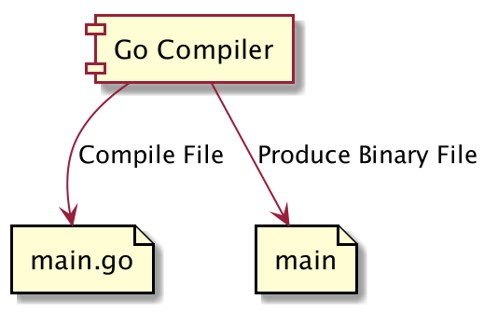
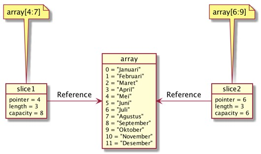
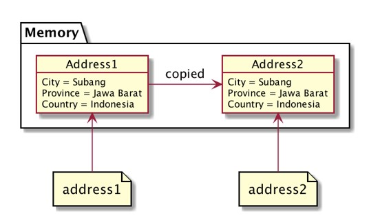
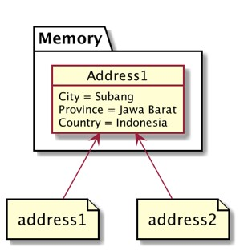
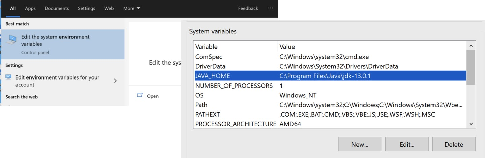
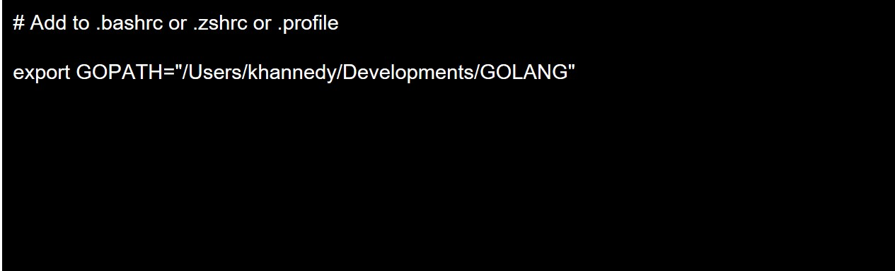
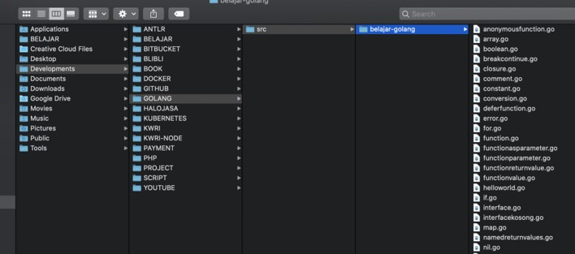
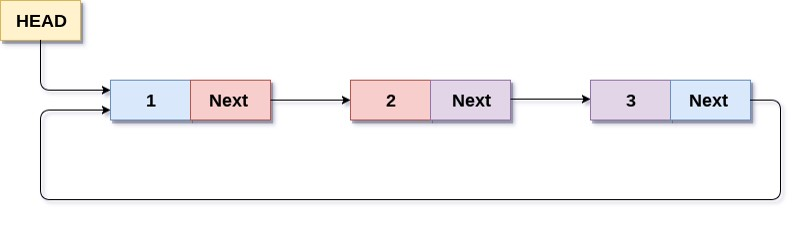

# Golang Dasar

## #1 Sejarah Go-Lang

- Dibuat di Google menggunakan bahasa pemrograman C
- Di Rilis ke public sebagai open source pada tahun 2009
- Go-Lang populer sejak digunakan untuk membuat Docker pada tahun 2011
- Saat ini mulai banyak teknologi baru yang dibuat menggunakan bahasa Go-Lang dibandingkan bahasa C, seperti Kubernetes, Prometheus, CockroachDB, dan lain-lain.
- Saat ini mulai populer untuk pembuatan Backed API di Microservices

### Kenapa Belajar Go-Lang?

- Bahasa Go-Lang sanget sederhana, tidak buth waktu lama untuk mempelajarinya
- Go-Lang mendukung baik concurrency programming, dimana saat ini kita hidup di zaman multicore processor
- Go-Lang mendukung garbage collector, sehingga tidak butuh melakukan management memory secara manual seperti di bahasa C
- Salah satu bahasa pemrogramman yang sedang naik daun

### Software Development Kit

- <https://golang.org>
- Download Compiler Go-Lang
- Install Compiler Go-Lang
- Cek menggunakan perintah: `go version`

### Proses Development Program Go-lang



### Text Editor atau IDE

- Visual Studio Code
- JetBrains GoLand

## #2 Program Hello World

```go
package main

import "fmt"

func main() {
	fmt.Println("Hello World")
}
```

### Kompilasi File Go-Lang

```bash
go build helloworld.go
```

### Menjalankan Tanpa Kompilasi

```go
go run helloworld.go
```

## #3 Tipe data Number

- Ada dua jenis tipe data Number, yaitu:
  - Integer
  - Floating Point

### Tipe Data Integer

| Tipe Data | Nilai Ninimunm       | Nulai Maximum        |
| --------- | -------------------- | -------------------- |
| int8      | -128                 | 127                  |
| int16     | -32768               | 3276                 |
| int32     | -2147483648          | 2147483647           |
| int64     | -9223372036854775808 | 9223372036854775807  |
| uint8     | 0                    | 255                  |
| uint16    | 0                    | 65535                |
| uint32    | 0                    | 4294967295           |
| uint64    | 0                    | 18446744073709551615 |

### Tipe Data Floating Point

| Tipe Data  | Nilai Ninimunm                                         | Nulai Maximum |
| ---------- | ------------------------------------------------------ | ------------- |
| float32    | 1.18x10 -38                                            | 3.4x10 38     |
| float64    | 2.23x10 -308                                           | 1.80x10 308   |
| complex64  | complex numbers with float32 real and imaginary parts. |               |
| complex128 | complex numbers with float64 real and imaginary parts. |               |

### Alias

| Tipe Data | Alias untuk    |
| --------- | -------------- |
| byte      | uint8          |
| rune      | int32          |
| int       | Minimal int32  |
| uint      | Minimal uint32 |

### Kode Program Number

```go
package main

import "fmt"

func main() {
	fmt.Println("Satu = ", 1)
	fmt.Println("Dua = ", 2)
	fmt.Println("Tiga Koma Lima = ", 3.5)
}
```

## #4 Tipe Data Boolean

- Tipe data boolean adalah tipe data yang memiliki nilai dua nilai, yaitu benar atau salah
- Di Go-Lang, tipe data boolean direpresentasikan menggunakan kata kunci `bool`

### Boolean

| Nilai Boolean | Keterangan |
| ------------- | ---------- |
| true          | Benar      |
| false         | Salah      |

### Kode Program Boolean

```go
package main

import "fmt"

func main() {
	fmt.Println("Benar = ", true)
	fmt.Println("Salah = ", false)
}
```

## #5 Tipe Data String

- String adalah tipe data kumpulan karakter
- Jumlah karakter di dalam String bisa not sampai tidak tehingga
- Tipe data String di Go-Lang direpresentasikan dengan kata kunci string
- Nilai data String di Go-Lang selalu diawali dengan karakter `"` (petik dua) dan diakhiri dengan karakter `"` (petik dua)

### Kode Program String

```go
package main

import "fmt"

func main() {
	fmt.Println("Eko")
	fmt.Println("Eko Kurniawan")
	fmt.Println("Eko Kurniawan Khannedy")
}
```

### Function untuk String

| Function         | Keterangan                                     |
| ---------------- | ---------------------------------------------- |
| len("string")    | Menghitung jumlah karakter di String           |
| "string"[number] | Mengambil karakter pada posisi yang ditentukan |

### Kode Program String

```go
package main

import "fmt"

func main() {
	fmt.Println(len("Eko"))
	fmt.Println("Eko Kurniawan"[0])
	fmt.Println("Eko Kurniawan Khannedy"[1])
}
```

## #6 Variable

- Variable adalah tempat untuk menyimpan data
- Variable digunakan agar kita bisa mengakses data yang sama dimanapun kita mau
- Di Go-Lang Variable hanya bisa menyimpan tipe data yang sama, jika kit ingin menyimpan data yange berbeda-beda jenis, kita harus membuat beberapa variable
- Untuk membuat variable, kita bisa menggunakan kata kunci `var`, lalu diikuti dengan nama variable dan tipe datanya

### Kode Program Variable

```go
func main() {
	var name string

	name = "Eko Kurniawan"
	fmt.Println(name)

	name = "Eko Khannedy"
	fmt.Println(name)
}
```

### Tipe Data Variable

- Saat kita membuat variable, maka kita wajib menyebutkan tipe data variable tersebut
- Namun jika kita langsung menginisialisasikan data pada variable nya, maka kita tidak wajib menyebutkan tipe data variable nya

### Kode Program Variable

```go
func main() {
	var name = "Eko Kurniawan"
	fmt.Println(name)

	name = "Eko Khannedy"
	fmt.Println(name)
}
```

### Kata Kunci Var

- Di Go-Lang, kata kunci `var` saat membuat variable tidak lah wajib.
- Asalkan saat membuat variable kita langsung menginisialisasi datanya
- Agar tidak perlu menggunakan kata kunci `var`, kita perlu menggunakan kata kunci `:=` saat menginisialisasikan data pada variable tersebut

### Kode Program Variable

```go
func main() {
	name := "Eko Kurniawan"
	fmt.Println(name)

	name = "Eko Khannedy"
	fmt.Println(name)
}
```

### Deklarasi Multiple Variable

- Di Go-Lang kita bisa membuat variable secara sekaligus banyak
- Code yang dibuat akan lebih bagus dan mudah dibaca

```go
func main() {
	var (
		fistName = "Eko Kurniawan"
		lastName = "Eko Khannedy"
	)

	fmt.Println(fistName)
	fmt.Println(lastName)
```

## #7 Constant

- Constant adalah variable yang nilainya tidak bisa diubah lagi setelah pertama kali diberi nilai
- Cara pembuatan constant mirip dengan variable, yang membedakan hanya kata kunci yang digunakan adalah `const`, bukan `var`
- Saat pembuatan constant, kita wajib langsung menginisialisasikan datanya

### Kode Program Constant

```go
func main() {
	const fistName string = "Eko Kurniawan"
	const lastName = "Eko Khannedy"

	// error
	fistName = "Tidak bisa diubah"
	lastName = "Tidak bisa diubah"
```

### Deklarasi Multiple Constant

- Sama seperti variable, di Go-Lang juga kita bisa membuat constant secara sekaligus banyak

### Kode Program Constant

```go
func main() {
	const (
		fistName string = "Eko Kurniawan"
		lastName = "Eko Khannedy"
	)

	// error
	fistName = "Tidak bisa diubah"
	lastName = "Tidak bisa diubah"
```

## #8 Konversi Tipe Data

- Di Go-Lang kadang kita butuh melakukan konversi tipe data dari satu tipe data ke tipe lain
- Misal kita ingin mengkonversi tipe data int32 ke int64, dan lain-lain

### Kode Program Konversi Tipe Data

```go
func main() {
	var nilai32 int32 = 32768
	var nilai64 int64 = int64(nilai32)
	var nilai16 int16 = int16(nilai32)

	fmt.Println(nilai32)
	fmt.Println(nilai64)
	fmt.Println(nilai16)

	var name = "Eko Kurniawan"
	var e = name[0]
	var eString = string(e)

	fmt.Println(name)
	fmt.Println(eString)
}
```

## #9 Type Declarations

- Type Declarations adalah kemampuan membuat ulang tipe data baru dari tipe data yang sudah ada
- Type Declarations biasanya digunakan untuk membuat alias terhadap tipe data yang sudah ada, dengan tujuan agar lebih mudah dimengerti

### Kode Program Type Declarations

```go
func main() {
	type NoKTP string
	type Married bool

	var ktpEko NoKTP = "1111111111"
	var marriedStatus Married = true
	fmt.Println(ktpEko)
	fmt.Println(NoKTP("11111111111"))
	fmt.Println(marriedStatus)
}
```

## #10 Operasi Matematika

| Operator | Keterangan     |
| -------- | -------------- |
| +        | Penjumlahan    |
| -        | Pengurangan    |
| \*       | Perkalian      |
| /        | Pembagian      |
| %        | Sisa Pembagian |

### Kode Program Operasi Matematika

```go
func main() {
	var a = 10
	var b = 10
	var c = a + b
	fmt.Println(c)
}
```

### Augmented Assignments

| Operasi Matematika | Augmented Assignments |
| ------------------ | --------------------- |
| a=a+10             | a+=10                 |
| a=a-10             | a-=10                 |
| a=a\*10            | a\*=10                |
| a=a/10             | a/=10                 |
| a=a%10             | a%=10                 |

### Unary Operator

| Operator | Keterangan        |
| -------- | ----------------- |
| ++       | a=a+1             |
| --       | a=a-1             |
| -        | Negative          |
| +        | Positive          |
| !        | Boolean kebalikan |

## #11 Operasi Perbandingan

- Operasi perbandingan adalah operasi untuk membandingkan dua buah data
- Operasi perbandingan adalah operasi yang menghasilkan nilai boolean (benar atau salah)
- Jika hasil operasinya adalah benar, maka nilainya adalah `true`
- Jika hasil operasinya adalah salah, maka nilainya adalah `false`

### Operasi Perbandingan

| Operator | Keterangan              |
| -------- | ----------------------- |
| >        | Lebih Dari              |
| <        | Kurang Dari             |
| >=       | Lebih Dari Sama Dengan  |
| <=       | Kurang Dari Sama Dengan |
| ==       | Sama Dengan             |
| !=       | Tidak Sama Dengan       |

### Kode Program Operasi Perbandingan

```go
func main() {
	var name1 = "Eko"
	var name2 = "Eko"

	var result bool = name1 == name2

	fmt.Println(result)

	var value1 = 100
	var value2 = 200

	fmt.Println(value1 > value2)
	fmt.Println(value1 < value2)
	fmt.Println(value1 == value2)
	fmt.Println(value1 != value2)
}
```

## #12 Operasi Boolean

| Operator | Keterangan |
| -------- | ---------- |
| &&       | Dan        |
| \|\|     | Atau       |
| !        | Kebalikan  |

### Operasi &&

| Nilai | Operator | Nilai 2 | Hasil |
| ----- | -------- | ------- | ----- |
| true  | &&       | true    | true  |
| true  | &&       | false   | false |
| false | &&       | true    | false |
| false | &&       | false   | false |

### Operasi \|\|

| Nilai | Operator | Nilai 2 | Hasil |
| ----- | -------- | ------- | ----- |
| true  | \|\|     | true    | true  |
| true  | \|\|     | false   | true  |
| false | \|\|     | true    | true  |
| false | \|\|     | false   | false |

### Operasi !

| Operator | Nilai 2 | Hasil |
| -------- | ------- | ----- |
| !        | true    | false |
| !        | false   | true  |

### Kode Program Operasi Boolean

```go
func main() {
	var nilaiAkhir = 90
	var absensi = 80

	var lulusNilaiAkhir bool = nilaiAkhir > 80
	var lulusAbsensi bool = absensi > 80

	var lulus bool = lulusNilaiAkhir && lulusAbsensi

	fmt.Println(lulus)
}
```

## #13 Tipe Data Array

- Array adalah tipe data yang berisikan kumpulan data dengan tipe yang sama
- Saat membuat array, kita perlu menentukan jumlah data yang bisa ditampung oleh Array tersebut
- Daya tampung Array tidak bisa bertambah setelah Array dibuat

### Index di Array

| Index | Data      |
| ----- | --------- |
| 0     | Eko       |
| 1     | Kurniawan |
| 2     | Khannedy  |

### Kode Program Array

```go
func main() {
	var names [3]string

	names[0] = "Eko"
	names[1] = "Kurniawan"
	names[2] = "Khannedy"

	fmt.Println(names[0])
	fmt.Println(names[1])
	fmt.Println(names[2])
}
```

### Membuat Array Langsung

- Di Go-Lang kita juga bisa membuat Array secara langsung saat deklarasi variable

### Kode Program Array

```go
func main() {
	var values = [3]int{
		80,
		90,
		95,
	}

	fmt.Println(values)
}
```

### Function Array

| Operasi              | Keterangan                       |
| -------------------- | -------------------------------- |
| len(array)           | Untuk mendapatkan panjang Array  |
| array[index]         | Mendapatkan data di posisi index |
| array[index] = value | Mengubah data di posisi index    |

### Kode Program Array

```go
func main() {
	var values = [3]int{
		80,
		90,
		95,
	}

	fmt.Println(len(values))
	fmt.Println(values[1])
	values[1] = 100
	fmt.Println(values[1])
}
```

## #14 Tipe Data Slice

- Tipe data Slice adalah potongan dari data Array
- Slice mirip dengan Array, yang membedakan adalah ukuran Slice bisa berubah
- Slice dan Array selalu terkoneksi, dimana Slice adalah data yang mengakses sebagaian atau seluruh data di Array

### Detail Tipe Data Slice

- Tipe Data Slice memiliki 3 data, yaitu pointer, length dan capacity
- Pointer adalah penunjuk data pertama di array per slice
- Length adalah panjang dari slice, dan
- Capacity adalah kapasitas dari slice, dimana length tidak boleh lebih dari capacity

### Membuat Slice dari Array

| Membuat Slice   | Keterangan                                                              |
| --------------- | ----------------------------------------------------------------------- |
| array[low:high] | Membuat slice dari array dimulai index low sampai index sebelum high    |
| array[low:]     | Membuat slice dari array dimulai index low sampai index akhir di array  |
| array[:high]    | Membuat slice dari array dimulai index 0 sampai index sebelum high      |
| array[:]        | Membuat slice dari array dimulai index 0 sampai index terakhir di array |

### Slice dan Array



### Kode Program Slice

```go
func main() {
	names := [...]string{"Eko","Kurniawan","Khannedy","Joko","Budi","Nugraha"}
	slice := names[4:6]

	fmt.Println(slice[0])
	fmt.Println(slice[1])
}
```

### Function Slice

| Operasi                            | Keterangan                                                                                                                 |
| ---------------------------------- | -------------------------------------------------------------------------------------------------------------------------- |
| len(slice)                         | Untuk mendapatkan panjang                                                                                                  |
| cap(slice)                         | Untuk mendapatkan kapasitas                                                                                                |
| append(slice, data)                | Membuat slice baru dengan menambah data ke posisi terakhir slice, jika kapasitas sudah penuh, maka akan membuat array bary |
| make([]TypeData, length, capacity) | Membuat slice baru                                                                                                         |
| copy(destination, source)          | Menyalin slice dari source ke destination                                                                                  |

### Kode Program Append Slice

```go
days := [...]string{"Senin","Selasa","Rabu","Kamis","Jumat","Sabtu","Minggu"}
daySlice1 :+ days[5:]
daySlice1[0] = "Sabtu Baru"
daySlice1[1] = "Minggu Baru"
fmt.Println(days) // [Senin,Selasa,Rabu,Kamis,Jumat,Sabtu Baru,Minggu Baru]

daySlice2 := append(daySlice1, "Libur Baru")
daySlice2[0] = "Ups"
fmt.Println(daySlice2) // [Ups, Minggu Baru, Libur Baru]
fmt.Println(days) // [Senin,Selasa,Rabu,Kamis,Jumat,Sabtu Baru,Minggu Baru]
```

### Kode Program Make Slice

```go
newSlice := make([]string, 2, 5)
newSlice[0] = "Eko"
newSlice[1] = "Eko"

fmt.Println(newSlice)
fmt.Println(len(newSlice))
fmt.Println(cap(newSlice))
```

### Kode Program Copy Slice

```go
days := [...]string{"Senin","Selasa","Rabu","Kamis","Jumat","Sabtu","Minggu"}
fromSlice := days[:]
toSlice := make([]string, len(fromSlice), cap(fromSlice))

copy(toSlice, fromSlice)

fmt.Println(toSlice)
```

### Hati-Hati Saat Membuaat Array

- Saat membuat Array, kita harus berhati-hati, jika salah, maka yang kita buat bukanlah Array, melainkan Slice

### Kode Program Array vs Slice

```go
iniArray := [...]int{1,2,3,4,5}
iniSlice := []int{1,2,3,4,5}

fmt.Println(iniArray)
fmt.Println(iniSlice)
```

## #15 Tipe Data Map

- Pada Array atau Slice, untuk mengakses data, kita menggunakan index Number dimulai dari 0
- Map adalah tipe data lain yang berisikan kumpulan data yang sama, namun kita bisa menentukan jenis tipe data index yang akan kita gunakan
- Sederhananya, Map adalah tipe data kumpulan key-value (kata kunci - nilai), dimana kata kuncinya bersifat unik, tidak boleh sama
- Berbeda dengan Array dan Slice, jumlah data yang kita masukan ke dalam Map boleh sebanyak-banyaknya, asalkan kata kunci nya berbeda, jika kita gunakan kata kunci sama, maka secara otomatis data sebelumnya akan digantikan dengan data baru

### Kode Program Map

```go
func main() {
	person := map[string]string{
		"name": "Eko",
		"address": "Subang"
	}

	fmt.Println(person)
	fmt.Println(person["name"])
	fmt.Println(person["address"])
}
```

### Function Map

| Operasi                     | Keterangan                           |
| --------------------------- | ------------------------------------ |
| len(map)                    | Untuk mendapatkan jumlah data di map |
| map[key]                    | Mengambil data di map dengan key     |
| map[key] = value            | Mengubah data di map dengan key      |
| make(map[TypeKey]TypeValue) | Membuat map baru                     |
| delete(map, key)            | Menghapus data di map dengan key     |

### Kode Program Map

```go
book := make(map[string]string)
book["title"] = "Buku Go-Lang"
book["author"] = "EKo Kurniawan"
book["wrong"] = "Ups"

delete(book, "wrong")

fmt.Println(book)
```

## #16 If Expression

- If adalah salah satu kta kunci yang digunakan untuk percabangan
- Percabangan artinya kita bisa mngeksekusi kode program tertenru ketika suatu kondisi terpenuhi
- Hampir di semua bahasa pemrogramman mendukung if expression

### Kode Program If

```go
func main() {
	name := "Eko"

	if name == "Eko" {
		fmt.Println("Hello Eko")
	}
}
```

### Else Expression

- Block if akan dieksekusi ketika kondisi if bernilai true
- Kadang kita ingin melakukan eksekusi program tertentu jika kondisi if bernilai false
- Hal ini bisa dilakukan menggunakan else expression

### Kode Program Else

```go
func main() {
	name := "Eko"

	if name == "Eko" {
		fmt.Println("Hello Eko")
	} else {
		fmt.Println("Hi, Boleh Kenalan?")
	}
}
```

### Else If Expression

- Kadang dalam if, kita butuh membuat beberapa kondisi
- Kasus seperti ini, kita bisa menggunakan Else if expression

### Kode Program If Else

```go
func main() {
	name := "Budi"

	if name == "Eko" {
		fmt.Println("Hello Eko")
	} else if == "Joko" {
		fmt.Println("Hello Joko")
	} else if == "Budi" {
		fmt.Println("Hello Budi")
	} else {
		fmt.Println("Hi, Boleh Kenalan?")
	}
}
```

### If denga Short Statement

- If mendukung short statement sebelum kondisi
- Hal ini sangat cocok untuk membuat statement yang sederhana sebelum melakukan pengecekan terhadap kondisi

### Kode Program If Short Statement

```go
func main() {
	name := "Budi"

	if length := len(name); length > 5 {
		fmt.Println("Nama terlalu panjang")
	} else {
		fmt.Println("Nama sudah benar")
	}
}
```

## #17 Switch Expression

- Selain if expression, untuk melakukan percabangan, kita juga bisa menggunakan Switch Expression
- Switch expression sangat sederhana dibandingkan if
- Biasanya switch expression digunakan untuk melakukan pengecekan ke kondisi dalam satu variable

### Kode Program Switch

```go
func main() {
	name := "Eko"

	switch name {
	case "Eko":
		fmt.Println("Hello Eko")
	case "Joko":
		fmt.Println("Hello Joko")
	default:
		fmt.Println("Hi, Boleh Kenalan?")
	}
}
```

### Switch dengan Short Statement

- Sama dengan if, Switch juga mendukung short statement sebelum variable yang akan di cek kondisinya

### Kode Program

```go
func main() {
	name := "Eko"

	switch length := len(name); length > 5 {
	case true:
		fmt.Println("Nama terlalu panjang")
	case: false:
		fmt.Println("Nama sudah benar")
	}
}
```

### Switch Tanpa Kondisi

- Kondisi di switch expression tidak wajib
- Jika kita tidak menggunakan kondisi di switch expression, kita bisa menambahkan kondisi tersebut di setiap case nya

### Kode Program Switch Tanpa Kondisi

```go
func main() {
	name := "Eko"

	length := len(name)
	switch {
	case length > 10:
		fmt.Println("Nama terlalu panjang")
	case: length > 5:
		fmt.Println("Nama lumayan panjang")
	default:
		fmt.Println("Nama sudah benar")
	}
}
```

## #18 For Loops

- Dalam bahasa pemrograman, biasanya ada fitur yang bernama perulangan
- Salah satu fitur perulangan adalah for loops

## Kode Program For

```go
func main() {
	counter := 1

	for counter <= 10 {
		fmt.Println("Perulangan ke ", counter)
		counter++
	}
}
```

### For dengan Statement

- Dalam for, kita bisa menambahkan statement, dimana terdapat 2 statement yang bisa tambahkan di for
- Init statement, yaitu statement sebelum for di eksekusi
- Post statement, yaitu statement yang akan selalu dieksekusi di akhir tiap perulangan

### Kode Program For dengan Statement

```go
func main() {
	for counter := 1; counter <= 10; counter ++ {
		fmt.Println("Perulangan ke ", counter)
	}
}
```

### For Range

- For bisa digunakan untuk melakukan iterasi terhadap semua data collection
- Data collection contohnya Array, Slice dan Map

### Kode Program For Range

```go
names := []string{"Eko", "Kurniawan", "Khannedy"}
for index, name := range names {
	fmt.Println("index", index, "=", name)
}
```

## #19 Break & Continue

- Break & Continue adalah kata kunci yang bisa digunakan dalam perulangan
- Break digunakan untuk menghentikan seluruh perulangan
- Continue adalah digunakan untuk menghentikan perulangan yang berjalan, dan langsung melanjutkan ke perulangan selanjutnya

### Kode Program Break

```go
func main() {
	for i := 10; i < 10; i++ {
		if i == 5 {
			break
		}

		fmt.Println("Perulangan ke", i)
	}
}
```

### Kode Program Continue

```go
func main() {
	for i := 10; i < 10; i++ {
		if i%2 == 0 {
			continue
		}

		fmt.Println("Perulangan ke", i)
	}
}
```

## #20 Function

- Sebelumnya kita sudah mengenal sebuah function yang wajib dibuat agar program kita bisa berjalan, yaitu function main
- Function adalah sebuah blok kode yang sengaja dibuat dalm program agar bisa digunakan berulang-ulang
- Cara membuat function sangat sederhana, hanya dengan menggunakan kata kunci func lalu diikuti dengan nama function nya dan block isi function nya
- Setelah membuat function, kita bisa mengeksekusi function tersebut dengan memanggilnya menggunakan kata kunci nama function nya diikuti tanda kurung buka, kurung tutup

### Kode Program Function

```go
func sayHello() {
	fmt.Println("Hello")
}

func main() {
	sayHello()
}
```

## #21 Function Parameter

- Saat membuat function, kadang-kadang kita membutuhkan data dari luar, atau kita sebut parameter.
- Kita bisa menambahkan parameter di function, bisa lebih dari satu
- Parameter tadaklah wajub, jadi kita bisa membuat function tanpa parameter seperti sebelumnya yang sudah kita buat
- Namun jika kita menambahkan parameter di function, maka ketika memanggil function tersebut kita wajib memasukkan data ke parameternya

### Kode Program Function Parameter

```go
func sayHello(firsName string, lastName string) {
	fmt.Println("Hello", firsName, lastName)
}

func main() {
	sayHello("Eko", "Kurniawan")
}
```

## #22 Function Return Value

- Function bisa mengembalikan data
- Untuk memberitahu bahwa function mengembalikan data, kita harus menuliskan tipe data kembalian dari function tersebut
- Jika function tersebut kita deklarasikan dengan tipe data pengembalian, maka wajib di dalam function nya kita harus mengembalikan data
- Untuk mengembalikan data dari function, kita bisa menambahkan kata kunci return, diikuti dengan datanya

### Kode Program Function Return Value

```go
func sayHello(name string) string {
	if name == "" {
		return "Hello Bro"
	}

	return "Hello " + name
}

func main() {
	result: = sayHello("Eko")
	fmt.Println(result)

	fmt.Println(sayHello(""))
}
```

## #23 Returning Multiple Values

- Function tidak hanya dapat mengembalikan satu value, tapi juga bis multiple value
- Untuk memberitahu jika function mengembalikan multiple value, kita harus menulis semua tipe data return value nya di function

### Kode Program Returning Multiple Values

```go
func getFullName() (string, string) {
	return "Eko", "Khannedy"
}

func main() {
	firsName, lastName := getFullName()
	fmt.Println(firsName, lastName)
}
```

### Menghiraukan Return Value

- Multiple return value wajib ditangkap semua value nya
- Jika kita ingin menghiraukan return value tersebut, kita bisa menggunakan tanda `_` (garis bawah)

### Kode Program Menghiraukan Return Value

```go
func getFullName() (string, string) {
	return "Eko", "Khannedy"
}

func main() {
	firsName, _ := getFullName()
	fmt.Println(firsName)
}
```

## #24 Named Retune Values

- Biasanya ssat kita memberi tahu bahwa sebuah function mengembalikan value, maka kita hanya mendeklarasikan tipe data return value di function
- Namun kita juga bisa membuat variable secara langsung di tipe data return function nya

### Kode Program Named Return Values

```go
func getFullName() (firsName, middleName, lastName string) {
	firstName = "Eko"
	middleName = "Kurniawan"
	lastName = "Khannedy"

	return
}

func main() {
	firsName, middleName, lastName := getFullName()
	fmt.Println(firsName, middleName, lastName)
}
```

## #25 Variadic Function

- Parameter yang berada di posisi terakhir, memilik kemampuan dijadikan sebuah varargs
- Varargs artinya datanya bisa menerima lebih dari satu input, atau dianggap saja semacam Array.
- Apa bedanya dengan parameter biasanya dengan tipe data ARray?
  - Jika parameter tipe Array, kita wajib membuat array terlebih dahulu sebelum mengirimkan ke function
  - Jika parameter menggunakan varargs, kita bisa langsung mengirimkan data nya, jika lebih dari satu, cukup gunakan tanda koma

### Kode Program Variadic Function

```go
func sumAll(numbers ...int) int {
	total :=
	for _, number := range numbers {
		total += number
	}

	return total
}

func main() {
	total := sumAll(10, 10, 10, 10, 10)
	fmt.Println(total)
}
```

### Slice Parameter

- Kadang ada kasus dimana kita menggunakan Variadic Function, namun memiliki variable berupa slice
- Kita bisa menjadikan slice sebagai varargs parameter

### Kode Program Slice Parameter

```go
func main() {
	total := sumAll(10, 10, 10, 10, 10)
	fmt.Println(total)

	numbers := []int{10, 10, 10, 10, 10}
	total = sumAll(numbers...)
	fmt.Println(total)
}
```

## #26 Function Value

- Function adalah first class citizen
- Function juga merupakan tipe data, dan bisa disimpan di dalam variable

### Kode Program Function Value

```go
func getGoodBye(name string) string {
	return "Good Bye " + name
}

func main() {
	goodbye := getGoodBye
	fmt.Println(goodbye("Eko"))
}
```

## #27 Function as Parameter

- Function tidak hanya bisa kita simpan di dalam variable sebagai value
- Namun juga bisa kita gunakan sebagai parameter untuk function lain

### Kode Program Function as Parameter

```go
func sayHelloWithFilter(name string, filter func(string) string) {
	fmt.Println("Hello ", filter(name))
}

func spamFilter(name string) string {
	if name == "Anjing" {
		return "..."
	}

	return name
}

func main() {
	sayHelloWithFilter("Eko", spamFilter)

	filter := spamFilter
	sayHelloWithFilter("Anjing", filter)
}
```

### Function Type Declarations

- Kadang jika function terlalu panjang, agak ribet untuk menuliskannya di dalam parameter
- Type Declarations juga bisa digunakan untuk mmebuat alias function, sehingga akan mempermudah kita menggunakan function sebagai parameter

### Kode Program Function Type Declarations

```go

type Filter func(string) string

func sayHelloWithFilter(name string, filter Filter) {
	fmt.Println("Hello ", filter(name))
}

func spamFilter(name string) string {
	if name == "Anjing" {
		return "..."
	}

	return name
}

func main() {
	sayHelloWithFilter("Eko", spamFilter)

	filter := spamFilter
	sayHelloWithFilter("Anjing", filter)
}
```

## #28 Anonymous Function

- Sebelumnya setiap membuat function, kita akan selalu memberikan sebuah nama pada function tersebut
- Namun kadang ada kalanya lebih mudah membuat function secara langsung di variable atau parameter tanpa harus membuat function terlebih dahulu
- Hal tersebut dinamakan anonymous function, atau function tanpa nama

### Kode Program Anonymous Function

```go
type BlackList func(string) bool

func registerUser(name, blackList lackList) {
	if backList(name) {
		fmt.Println("You Are Blocked", name)
	} else {
		fmt.Println("Welcome", name)
	}
}

// func blackListAdmin(name string) bool {
// 	return name == "admin"
// }

func main() {
	blackList := func(name string) bool {
		return name == "anjing"
	}

	registerUser("eko", blackList)
	registerUser("anjing", func(name string) bool {
		return name == "anjing"
	})
}
```

## #29 Recursive Function

- Recursive function adalah function yang memanggil function dirinya sendiri
- Kadang dalam pekerjaan, kita sering menemui kasus dimana menggunakan recursive function lebih mudah dibandingkan tidak menggunakan recursive function
- Contoh kasus yang lebih mudah diselesaikan menggunakan recursive adalah Factorial

### Kode Program Factorial For Loop

```go
func factorialLoop(value int) int {
	result := 1
	for i := value; i > 0; i-- {
		result *= i
	}

	return result
}

func main() {
	fmt.Println(factorialLoop(10))
}
```

### Kode Program Factorial Recursive

```go
func factorialLoop(value int) int {
	if value == 1 {
		return 1
	}
	return value * factorialLoop(value-1)
}

func main() {
	fmt.Println(factorialLoop(10))
}
```

## #30 Closure

- Closure adalah kemampuan sebuah function berinteraksi dengan data-data disekitarnya dalam scope yang sama
- Harap gunakan fitur closure ini dengan bijak saat kita membuat aplikasi

### Kode Program Function

### Kode Program Function

```go
func main() {
	name := "Eko"
	counter := 0
	increment := func() {
		name = "Eko"
		fmt.Println("increment")
		counter++
	}

	increment()
	increment()
	fmt.Println(name)
	fmt.Println(counter)
}
```

## #31 Defer, Panic dan Recover

### Defer

- Defer function adalah function yang bisa kita jadwalkan untuk dieksekusi setelah sebuah function selesai di eksekusi
- Defer function akan selalu dieksekusi walaupun terjadi error di function yang dieksekusi

### Kode Program Defer

```go
func logging() {
	fmt.Println("Selesai memanggil function")
}

func runApplication() {
	defer logging()
	fmt.Println("Run application")
}

func main() {
	runApplication()
}
```

### Panic

- Panic function adalah function yang bisa kita gunakan untuk menghentikan program
- Panic function biasanya bisanya dipanggil ketika terjadi error pada saat program kita berjalan
- Saat panic function dipanggil, program akan terhenti, namun defer function tetap akan dieksekusi

### Kode Program Panic

```go
func endApp() {
	fmt.Println("End App")
}

func runApp(error bool) {
	defer endApp()

	if error {
		panic("ERROR")
	}
}

func main() {
	runApp(false)
}
```

### Recover

- Recover adalah function yang bisa kita gunakan untuk menangkap data panc
- Dengan recover process panic akan terhenti, sehingga program akan tetap berjalan

### Kode Program Revover Salah

```go
func runApp(error bool) {
	defer endApp()

	if error {
		panic("ERROR")
	}

	message := recover()
	fmt.Println("Terjadi Error", message)
}
```

### Kode Program Revover Benar

```go
func endApp() {
	fmt.Println("End App")
	message := recover()
	fmt.Println("Terjadi Error", message)
}

func runApp(error bool) {
	defer endApp()

	if error {
		panic("ERROR")
	}
}
```

## #32 Komentar

- Komentar tarbaik pada kode adalah kode itu sendiri
- Saat membuat kode, kita perlu membuat kode semudah mungkin untuk dibaca
- Namun kadang juga kita butuh menambahkan komentar di kode kita

### Kode Program Komentar

```go
package main

/*
This is multi line comment
You can add a lot of comments here
*/
func main() {
	// this is single line comment
}
```

## #33 Struct

- Struct adalah sebuah template data yang digunakan untuk menggabungkan nol atau lebih tipe data lainnya dalam satu kesatuan
- Struct biasanya representasi data dalam program aplikasi yang kita buat
- Data di struct disimpan dalam field
- Sederhananya struct adalah kumpulan dari field

### Kode Program Struct

```go
type Customer struct {
	Name, Address string
	Age 					int
}
```

### Membuat Data Struct

- Struct adalah template data atau prototype data
- Struct tidak bisa langsung digunakan
- Namun kita bisa membuat data/object dari struct yang telah kita buat

### Kode Program Membuat Data Struct

```go
func main() {
	var eko Customer
	eko.Name = "Eko Kurniawan"
	eko.Address = "Indonesia"
	eko.Age = 30

	fmt.Println(eko)
}
```

### Struct Literals

- Sebelumnya kita telah membuat data dari struct, namun sebenarnya ada banyak cara yang bisa kita gunakan untuk membuat data dari struct

### Kode Program Struct Lietrals

```go
joko := Customer{
	Name: 	 "Joko",
	Address: "Indonesia",
	Age: 		 30,
}
fmr.Println(joko)

budi := Customer{"Budi", "Indonesia", 30} // not recommended
fmt.Println(budi)
```

## #34 Struct Method

- Struct adlah tipe data seperti tipe data lainnya, dia bisa digunakan sebagai parameter untuk function
- Namun jika kita ingin menambahkan method ke dalam struct, sehingga seakan-akan sebuah struct memiliki function
- Method adalah function

### Kode Program Struct Method

```go
func (customer Customer) sayHello() {
	fmt.Println("Hello, My Name is", customer.Name)
}

func main() {
	rully := Customer{Name: "Rully"}
	rully.sayHello()
}
```

## #35 Interface

- Interface adalah tipe data Abstract, dia tidak memiliki implementasi langsung
- Sebuah interface berisikan definisi-definisi method
- Biasanya interface degunakan sebagai kontrak

### Kode Program Interface

```go
type HasName interface {
	GetName() string
}

func SayHello(hasName HasName) {
	fmt.Println("Hello", hasName.GetName())
}

func main() {
	var eko HasName

	SayHello(eko)
}
```

### Implementasi Interface

- Setiap tipe data yang sesuai dengan kontrak interface, secara otomatis dianggap sebagai interface tersebut
- Sehingga kita tidak perlu mengimplementasikan interface secara manual
- Hal ini agak berbeda dengan bahasa pemrogramman lain yang ketika membuat interface, kita harus menyebutkan secara explisit akan menggunakan interface mana

### Kode Program Implementasi Interface (1)

```go
type HasName interface {
	GetName() string
}

func SayHello(hasName HasName) {
	fmt.Println("Hello", hasName.GetName())
}

type Person struct {
	Name string
}

func (person Person) GetName() string {
	return person.Name
}

func main() {
	person := Person{Name: "Eko"}
	SayHello(person)
}
```

### Kode Program Implementasi Interface (2)

```go
type HasName interface {
	GetName() string
}

func SayHello(hasName HasName) {
	fmt.Println("Hello", hasName.GetName())
}

type Animal struct {
	Name string
}

func (animal Animal) GetName() string {
	return animal.Name
}

func main() {
	animal := Animal{Name: "Kucing"}
	SayHello(animal)
}
```

## #36 Interface Kosong

- Go-Lang bukanlah bahasa pemrograman yang berorientasi object
- Biasanya dalam pemrograman berorientasi objek, ada satu data parent di puncak yang bisa dianggap sebagai semua implementasi data yang ada di bahasa pemrograman tersebut
- Contoh di Java ada `java.lang.Object`
- Untuk menangani kasus seperti ini, di Go-Lang kita bisa menggunakan interface kosong
- Interface kosong adalah interface yang tidak memiliki deklarasi method satupun, hal ini membuat secara otomatis semua tipe dat akan menjadi implementasi nya

### Penggunaan interface Kosong di Go-Lang

- Ada banyak contoh penggunaan interface kosong di Go-Lang, seperti:
  - fmt.Println(a ...interface{})
  - panic(v interface{})
  - recover() interface()
  - dan lain-lain

### Kode Program Interface Kosong

```go
func Ups() interface {} {
	// return 1
	// return true
	return "Ups"
}

func main() {
	kosong := Ups()
	fmt.Println(kosong)
}
```

## #37 Nil

- Biasanya di dlam bahasa pemrograman lain, object yang belum diinisialisasi maka secara otomatis nilainya adalah null atau nil
- Berbeda dengan Go-Lang, di Go-Lang saat kita buat variable dengan tipe data tertentu, make secara otomatis akan dibuatkan default value nya
- Namun di Go-Lang ada data nil, yaitu data kosong
- Nil sendiri hanya bisa digunakan di beberapa tipe data, seperti interface, function, map, slice, pointer dan channel

### Kode Program Nil (1)

```go
func NewMap(name string) map[string]string {
	if name == "" {
		return nil
	}

	return map[string]string{
		"name": name,
	}
}

func main() {
	data := NewMap("")
	if data == nil {
		fmt.Println("Data Kosong")
	} else {
		fmt.Println(data)
	}
}
```

## #38 error Interface

- Go-Lang memiliki interface yang digunakan sebagai kontrak untuk membuat error, nama interface nya adalah error

```go
// The error built-in interface type is the conventual interface for
// representing an error condition, with the nil value representing no error.
type error interface {
	 Error() string
}
```

### Membuat Error

- Untuk membuat error, kita tidak pelu manual.
- Go-Lang sudah menyediakan library untuk membuat helper secara mudah, yang terdapat di package errors (Package akan kita bahas secara detail di materi tersendiri)

### Kode Program error Interface (1)

```go
import (
	"errors"
	"fmt"
)

func Pembagian(nilai int, pembagi int) (int, error) {
	if pembagi == 0 {
		return 0, errors.New("Pembagian Dengan NOL")
	}

	return nilai / pembagi, nil
}

func main() {
	var contohError error = errors.New("Ups Error")
	fmt.Println(contohError.Error())
}
```

## Kode Program error Interface (2)

```go
func main() {
	hasil, err := Pembagian(100, 10)
	if err == nil {
		fmt.Println("Hasil", hasil)
	} else {
		fmt.Println("Error", err.Error())
	}
}
```

## #39 Type Assertions

- Type Assertions merupakan kemampuan merubah tipe data menjadi tipe data yang diinginkan
- Fitur ini sering sekali digunakan ketika kita bertemu dengan data interface kosong

### Kode Program Type Assertions

```go
func random() interface {
	return "OK"
}

func main() {
	result := random()
	resultString := result.(string)
	fmt.Println(resultString)

	resultInt := result.(int) // panic
	fmt.Println(resultInt)
}
```

### Type Assertions Menggunakan Switch

- Saat salah menggunakan type assertions, make bisa berakibat terjadi panic di aplikasi kita
- Jika panic dan tidak ter-recover, maka otomatis program kita akan mati
- Agar lebih aman, sebaiknya kita menggunakan switch expression untuk melakukan type assertions

### Kode Program Type Assertions Switch

```go
func main() {
	result := random()
	switch value := result.(type) {
	case string:
		fmt.Println("String", value)
	case int:
		fmt.Println("Int", value)
	default:
		fmt.Println("Unknown")
	}
}
```

## #40 Pointer

- Secara default di Go-Lang semua variable itu di passing by value, bukan by reference
- Artinya, jika kita mengirim variable ke dalam function, method atau variable lain, sebenarnya yang dikirim adalah duplikasi value nya

### Kode Program Pass by Value

```go
type Address struct {
	City, Provice, Country string
}

func main() {
	address1 := Address{"Subang", "Jawa Barat", "Indonesia"}
	address2 := address1

	address2.City = "Bandung"

	fmt.Println(address1) // address1 tidak berubah
	fmt.Println(address2)
}
```

### Penjelasan Detail Pass by Value



### Pointer

- Pointer adalah kemampuan membuat reference ke lokasi data di memory yang sama, tanpa menduplikast data yang sudah ada
- Sederhananya, dengan kemampuan pointer, kita bisa membuat pass by reference

### Pass by Reference dengan Pointer



### Operator` &`

Untuk membuat sebuah variable dengan nilai pointer ke variable yang lain, kita bisa menggunakan operator` &` diikuti dengan variable nya

### Kode Program Operator` &`

```go
func main() {
	address1 := Address{"Subang", "Jawa Barat", "Indonesia"}
	address2 := &address1

	address2.City = "Bandung"

	fmt.Println(address1)
	fmt.Println(address2)
}
```

### Operator `*`

- Saat kita mengubah variable pointer, maka yang berubah hanya variable tersebut
- Semua variable yang mengacu ke data yang dama tidak akan berubah
- Jika kita ingin mengubah seluruh variable yang mengacu ke data tersebut, kita bisa menggunakan operator `*`

### Kode Program Operator `*` (1)

```go
func main() {
	address1 := Address{"Subang", "Jawa Barat", "Indonesia"}
	address2 := &address1

	address2.City = "Bandung"

	address2 = &Address{"Jakarta", "Jawa Barat", "Indonesia"}

	fmt.Println(address1)
	fmt.Println(address2)
}
```

### Tanpa Operator `*`


### Kode Program Operator `*` (2)

```go
func main() {
	address1 := Address{"Subang", "Jawa Barat", "Indonesia"}
	address2 := &address1

	address2.City = "Bandung"

	*address2 = Address{"Jakarta", "Jawa Barat", "Indonesia"}

	fmt.Println(address1)
	fmt.Println(address2)
}
```

### Dengan Operator `*`


### Function `new`

- Sebelumnya untuk membuat pointer dengan menggunakan operator &
- Go-Lang juga memiliki function new yang bisa digunakan untuk membuat pointer
- Namun function new hanya mengemballikan pointer ke data kosong, artinya tidak ada data awal

### Kode Program Function New

```go
alamat1 := new(Address)
alamat2 := alamat1

alamat2.Country = "Indonesia"

fmt.Println(address1) // alamat 1 berubah
fmt.Println(address2)
```

## #41 Pointer di Function

- Saat kita membuat parameter di function, secara default adalah pass by value, artinya data akan di copy lalu dikirim ke function tersebut
- Oleh karena itu, jika kite mengubah data di dalam function, data yang aslinya tidak pernah berubah
- Hal ini membuat variable menjadi aman, karena tidak akan bisa diubah
- Namun kadang kita ingin membuat function yang bisa mengubah data asli parameter tersebut
- Untuk melakukan ini, kita juga bisa menggunakan pointer di function
- Untuk menjadikan sebuah parameter sebagai pointer, kita bisa menggunakan operator `*` di parameternya

### Kode Program Pointer di Fuunction (1)

```go
func ChangeAddressToIndonesia(address Address) {
	address.Country = "Indonesia"
}

func main() {
	address := Address{"Subang", "Jawa Barat", ""}
	ChangeAddressToIndonesia(address)

	fmt.Println(address) // tidak berubah
}
```

### Kode Program Pointer di Fuunction (2)

```go
func ChangeAddressToIndonesia(address *Address) {
	address.Country = "Indonesia"
}

func main() {
	address := Address{"Subang", "Jawa Barat", ""}
	ChangeAddressToIndonesia(&address)

	fmt.Println(address) // tidak berubah
}
```

## #42 Pointer di Method

- Walaupun method akan menempel di struct, tapi sebenarnya data struct yang diakses di dalam method adalah pass by value
- Sangat direkomendasikan menggunakan pointer di mether, sehingga tidak boros memory karena harus diduplikasi ketika memanggil method

### Kode Program Pointer di Method (1)

```go
type Man struct {
	Name string
}

func (man Man) Married() {
	man.Name = "Mr. " + man.Name
}

func main() {
	eko := Man{"Eko"}
	eko.Married()

	fmt.Println(eko.Name)
}
```

### Kode Program Pointer di Method (2)

```go
type Man struct {
	Name string
}

func (man *Man) Married() {
	man.Name = "Mr. " + man.Name
}

func main() {
	eko := Man{"Eko"}
	eko.Married()

	fmt.Println(eko.Name)
}
```

## #43 GOPATH

- Sebelumnya saat kita membuat project aplikasi Go-Lang kita belum membahas tentang GOPATH
- GOPATH adalah environment variable yang berisikan lokasi tempat kita menyimpan project dan libray Go-Lang
- GOPATH wajib di buat ketika kita mulai membuat aplikasi lebih dari satu file atau butuh menggunakan library dari luar

### Setting GOPATH di Windows



### Setting GOPATH di Linux atau Mac



### Struktur Direktori GOPATH



## #44 Package & Import

- Package adalah tempat yang bisa digunakan untuk mengorganisir kode program yang kita buat di Go-Lang
- Dengan menggunakan package, kita bisa merapikan kode program yang kita buat
- Package sendiri sebenarnya hanya direktori folder di sistem operasi kita

### Kode Program Package

```go
package helper

func SayHello(name string) string {
	return "Hello " + name
}
```

### Import

- Secare standar, file Go-Lang hanya bisa mengakses file Go-Lang lainnya yang berada dalam package yang sama
- Jika kita ingin mengakses file Go-Lang yang berada diluar package, maka kita bisa menggunakan import

### Kode Program Import

```go
package main

import (
	"belajar-golang/helper"
	"fmt"
)

func main() {
	result := helper.SayHello("Eko")
	fmt.Println(result)
}
```

## #45 Access Modifier

- Di bahasa pemrograman lain, biasanya ada kata kunci yang bisa digunakan untuk menentukan access modifier terhadap suatu function atau variable
- Di Go-Lang, untuk menentukan access modifier, cukup dengan nama function atau variable
- Jika nama nya diawali dengan huruf besar, maka artinya bisa diakses dari package lain, jika dimulai dengan huruf kecil, artinya tidak bisa diakses dari package lain

### Kode Program Access Modifier

```go
package helper

var version = "1.0.0" // tidak bisa diakses dari luar
var Application = "golang"

// tidak bisa diakses dari luar package
func sayGoodBye(name string) string {
	return "Hello " + name
}

func SayGoodBye(name string) string {
	return "Hello " + name
}
```

## #46 Package Initialization

- Saat kita membuat package, kita bisa membuat sebuah function yang akan diakses ketika package kita diakses
- Ini sange cocok ketika contohnya, jika package kita berisi function-function untuk berkomunikasi dengan database, kita membuat function initialisasi untuk membuka koneksi ke database
- Untuk membuat function yang diakses secara otomatis ketika package diakses, kita cukup membuat function dengan nama init

### Kode Program Packaeg Initialization (1)

```go
package database

var connection string

func init() {
	connection = "MySQL"
}

func GetDatabase() string {
	return connection
}
```

### Kode Program Packaeg Initialization (2)

```go
package main

import (
	"belajar-golang/database"
	"fmt"
)

func main() {
	fmt.Println(datbase.GetDatabase())
}
```

### Blank Identifier

- Kadang kita hanya ingin menjalankan init function di package tanpa harus mengeksekusi salah satu function yang ada di package
- Secara default, Go-Lang akan komplen ketika ada package yang di import namun tidak digunakan
- Untuk menangani hal tesebut, kita bisa menggunakan blank identifier `(_)` sebelum nama package ketika melakukan import

### Kode Program Blank Identifier

```go
package main

import (
	_ "belajar-golang/database"
)
```

## #47 Package `os`

- Go-Lang telah menyediakan banyak sekali package bawaan, salah stunya adalah package os
- Package os berisikan fungsionalitas untuk mengakses fitur sietem operasi secara independent (bisa digunakan disemua sistem operasi)
- <https://golang.org/pkg/os>

### Kode Program Package os (1)

```go
package main

import (
	"fmt"
	"os"
)

func main() {
	args := os.Args
	fmt.Println(args)
}
```

### Kode Program Package os (2)

```go
package main

import (
	"fmt"
	"os"
)

func main() {
	hostname, err := os.Hostname()
	if err == nil {
		fmt.Println(hostname)
	} else {
		fmt.Println("Error", err.Error())
	}
}
```

### Kode Program Package os (3)

```go
package main

import (
	"fmt"
	"os"
)

func main() {
	username := os.Getenv("APP_USERNAME")
	password := os.Getenv("APP_PASSWORD")

	fmt.Println(username)
	fmt.Println(password)
}
```

## #48 Package `flag`

- Package flag berisikan fungsionalitas untuk memparsing command line argument
- <https://golang.org/pkg/flag>

### Kode Program Package flag

```go
package main

import (
	"fmt"
	"flag"
)

func main() {
	host := flag.String("host" "localhost", "Put your database host")
	username := flag.String("username" "root", "Put your database host")
	password := flag.String("password" "root", "Put your database password")
	number := flag.Int("number" 100, "Put your number")

	flag.Parse()

	fmt.Println(*host, *username, *password, *number)
}
```

## #49 Package `strings`

- Package strings adalah package yang berisikan function-function untuk memanipulasi tipe data String
- Ada banyak sekali function yang bisa kita gunakan
- <https://golang.org/pkg/strings>

### Beberapa Function di Package strings

| Function                             | Kegunaan                                         |
| ------------------------------------ | ------------------------------------------------ |
| strings.Trim(string, cutset)         | Memotong cutset di awal dan akhir string         |
| strings.ToLower(string)              | Membuat semua karakter string manjadi lower case |
| strings.ToUpper(string)              | Membuat semua karakter string manjadi upper case |
| strings.Split(string, separator)     | Memotong string berdasarkan separator            |
| strings.Contains(string, search)     | Mengecek apakah string mengandung string lain    |
| strings.ReplaceAll(string, from, to) | Mengubah semua string dari from ke to            |

### Kode Program Packaage strings

```go
package main

import (
	"fmt"
	"strings"
)
func main() {
	fmt.Println(strings.Contains("Eko Kurniawan", "Eko"))
	fmt.Println(strings.Split("Eko Kurniawan", " "))
	fmt.Println(strings.ToLower("Eko Kurniawan"))
	fmt.Println(strings.ToUpper("Eko Kurniawan"))
	fmt.Println(strings.Trim("   Eko Kurniawan    "), " ")
	fmt.Println(strings.ReplaceAll("Eko Kurniawan", "Eko", "Budi"))
}
```

## #50 Package `strconv`

- Sebelumnya kita sudah belajar cara konversi tipe data, misal dari in32 ke int64
- Bagaimana jika kita butuh melakukan konversi yang tipe datanya berbeda? Misal dari int ke string, atau sebaliknya
- Hal tersebut bisa kita lakukan dengan bantuan package strconv (string conversion)
- <https://golang.go/pkg/strconv>

### Beberapa Function di Package strconv

| Function                        | Kegunaan                   |
| ------------------------------- | -------------------------- |
| strconv.parseBool(string)       | Mengubah string ke bool    |
| strconv.parseFloat(string)      | Mengubah string ke float   |
| strconv.parseInt(string)        | Mengubah string ke int64   |
| strconv.FormatBool(bool)        | Mengubah bool ke string    |
| strconv.FormatFloat(float, ...) | Mengubah float64 ke string |
| strconv.FormatInt(int, ...)     | Mengubah int64 ke string   |

### Kode Program Package strconv

```go
package main

import (
	"fmt"
	"strconv"
)

func main() {
	boolean, err := strconv.ParseBool("true")
	if err == nil {
		fmt.Println(boolean)
	} else {
		fmt.Println("Error", err.Error())
	}

	valueInt, _ := strconv.Atoi("2000")
	fmt.Println(valueInt)
}
```

## #51 Package `math`

- Package math merupakan package yang berisikan constant dan fungsi matematika
- <https://golang.org/pkg/math>

### Beberapa Function di Package math

| Function                   | Kegunaan                                                                 |
| -------------------------- | ------------------------------------------------------------------------ |
| math.Round(float64)        | Membulatkan float64 keatas atau kebawah, sesuai dengan yang paling dekat |
| math.Floor(float64)        | Membulatkan float64 kebawah                                              |
| math.Ceil(float64)         | Membulatkan float64 keatas                                               |
| math.Max(float64, float64) | Mengembalikan nilai float64 paling besar                                 |
| math.Min(float64, float64) | Mengembalikan nilai float64 paling kecil                                 |

### Kode Program math

```go
package main

import (
	"fmt"
	"math"
)

func main() {
	fmt.Println(math.Ceil(1.38))
	fmt.Println(math.Floor(1.68))
	fmt.Println(math.Round(1.38))
	fmt.Println(math.Max(1, 2))
	fmt.Println(math.Min(1, 2))
}
```

## #52 Package `container/list`

- Package container/list adalah implementasi struktur data double linked list di Go-Lang
- <https://golang.org/pkg/container/list>

### Struktur Data Double Linked List


### Kode Program container/list

```go
package main

import (
	"fmt"
	"container/list"
)

func main() {
	data := list.New()
	data.PushBack("Eko")
	data.PushBack("Kurniawan")
	data.PushBack("Khannedy")

	for e := data.Front(); e != nil; e = e.Next() {
		fmt.Println(e.Value)
	}

	// reverse
	for e := data.Back(); e != nil; e = e.Prev() {
		fmt.Println(e.Value)
	}
}
```

## #53 Package `container/ring`

- Package container/ring adalah implementasi struktur data circular list
- Circular list adalah struktur data ring, dimana diakhir element akan kembali ke element awal (HEAD)
- <https://golang.org/pkg/container/ring>

### Struktur Data Circular List



### Kode Program Package container/ring

```go
package main

import (
	"fmt"
	"strconv"
	"container/ring"
)

func main() {
	data := ring.New(5)
	for i := 0; i < data.Len(); i++ {
		data.Value = "Value " + strconv.FormatInt(int64(i), 10)
		data = data.Next()
	}

	data.Do(func(value interface{})) {
		fmt.Println(value)
	}
}
```

## #54 Package `sort`

- Package sort adalah package yang berisikan utilitas untuk proses pengurutan
- Agar data kita bisa diurutkan, kita harus mengimplemtasikan kontrak di interface `sort.Interface`
- <https://golang.org/pkg/sort>

### sort.Interface

```go
// elements of the collection be enumerated by an integer index.
type Interface interface {
	// Len is the number of elements in the collection.
	Len() int
	// Less reports whether the element with
	// indei should sort before the element with index j.
	Less(i, j int) bool
	// Swap swaps the elements with indexes i and j.
	Swap(i, j int)
}
```

### Kode Program Pacakge sort (1)

```go
type User struct {
	Name string
	Age int
}

type UserSlice []User

func (userSlice UserSlice) Len() int {
	return len(userSlice)
}

func (userSlice UserSlice) Less(i, j int) int {
	return userSlice[i].Age < userSlice[j].Age
}

func (userSlice UserSlice) Swap(i, j int) int {
	userSlice[i], userSlice[j] = userSlice[j], userSlice[i]
}

func main() {
	users := []User{
		{"Eko", 30},
		{"Budi", 35},
		{"Joko", 25},
		{"Adit", 24},
	}

	sort.Sort(UserSlice(users))

	fmt.Println(users)
}
```

## #55 Package `time`

- Package time adalah package yang berisikan fungsionalitas untuk management waktu di Go-Lang
- <https://golang.org/pkg/time>

### Beberapa Function di Package time

| Function                   | Kegunaan                           |
| -------------------------- | ---------------------------------- |
| time.Now()                 | Untuk mendapatkan waktu saat init  |
| time.Date(...)             | Untuk membuat waktu                |
| time.Parse(layout, string) | Untuk memparsing waktu dari string |

### Kode Program Package time

```go
package main

import(
	"fmt"
	"time"
)

func main() {
	now := time.Now()
	fmt.Println(now.Local())

	utc := time.Date(2009, time.November, 10, 23, 0, 0, 0, time.UTC)
	fmt.Println(utc.Local())

	parse, _ := time.Parse(time.RFC3339, "2006-01-02T15:04:05Z")
	fmt.Println(parse)
}
```

## #56 Package `reflect`

- Dalam bahasa pemrograman, biasanya ada fitur Reflection, dimana kita bisa melihat struktur kode kita pada saat aplikasi sedang berjalan
- Hal ini bisa dilakukan di Go-Lang dengan menggunakan package reflect
- Fitur ini mungkin tidak bisa dibahas secara lengkap dalam satu video, Anda bisa explorisasi package reflect ini secara otodidak
- Reflection sanget beguna ketika kita ingin membuat libray yang general sehingga mudah digunakan
- <https://golang.org/pkg/reflect>

### Kode Program Package reflect

```go
package main

import (
	"fmt"
	"reflect"
)

type Sample struct {
	Name string
}

func main() {
	sample := Sample{"Eko"}
	sampleType := reflect.TypeOf(sample)
	structField := sampleType.Field(0)

	fmt.Println(structField.Name)
}
```

### Kode Program StructTag

```go
package main

import (
	"fmt"
	"reflect"
)

type Sample struct {
	Name string `required:"true" max:"10"`
}

func main() {
	sample := Sample{"Eko"}
	sampleType := reflect.TypeOf(sample)
	structField := sampleType.Field(0)
	required := sampleType.Tag.Get("required")

	fmt.Println(required)
}
```

### Kode Program Validation Library

```go
func IsValid(data interface{}) bool {
	t := reflect.TypeOf(data)
	for i := 0; i < t.NumField(); i++ {
		field := t.Field(i)
		if field.Tag.Get("required") == "true" {
			return reflect.ValueOf(data).Field(i).Interface() != ""
		}
	}
	return true
}
```

## #57 Package `regex`

- Package regexp adalah utilitas di Go-Lang untuk melakukan pencarian regular expression
- Regular expresion di Go-Lang menggunakan library C yang dibuat Google bernama RE2
- <https://github.com/google/re2/wiki/Syntax>
- <https://golang.org/pkg/regexp>

### Beberapa Function di Package regexp

| Function                          | Kegunaan                                              |
| --------------------------------- | ----------------------------------------------------- |
| regexp.MustCompile(string)        | Membuat Regexp                                        |
| regexp.MatchString(string) bool   | Mengecek apakah Regexp match dengan string            |
| regexp.FindAllString(string, max) | Mencari string yang match dengan maximum jumlah hasil |

### Kode Program Package regexp

```go
func main() {
	var regex = regexp.MustCompile(`e([a-z])o`)

	fmt.Println(regex.MatchString("eko"))
	fmt.Println(regex.MatchString("edo"))
	fmt.Println(regex.MatchString("eKo"))

	fmt.Println(regex.FindAllString("eko edo egi ego e1o eto", -1))
}
```

## #58 Materi Selanjutnya

- Go-Lang Unit Test
- Go-Lang Modules
- Go-Lang Concurrency
- Go-Lang Database
- Go-Lang Web
