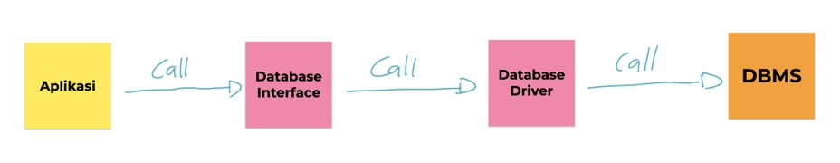
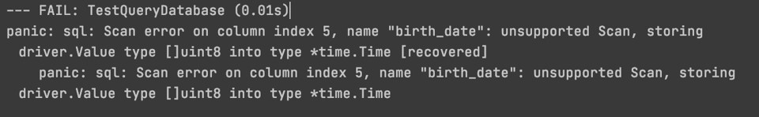
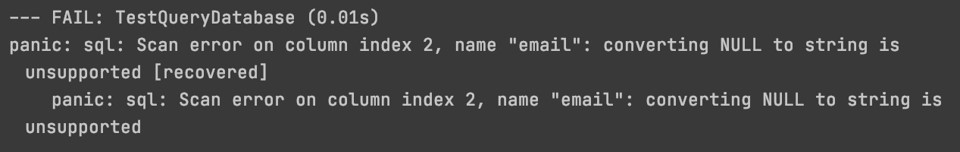
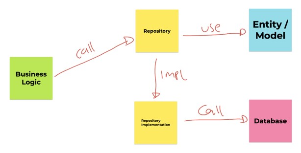

# Golang Database MySQL

## Sebelum Belajar

- Go-Lang Dasar
- Go-Lang Modules
- Go-Lang Unit Test
- Go-Lang Goroutines
- Go-Lang Context
- MySQL

## Agenda

- Pengenalan Golang Database
- Package Database
- Membuat Koneksi Database
- Eksekusi Perintah SQL
- SQL Injection
- Prepare Statement
- Database Transaction

## #1 Pengenalan Golang Database

- Bahasa pemrograman Go-Lang secara default memiliki sebuah package bernama database
- Pacakge database adalah package yang berisikan kumpulan standard interface yang menjadi standard untuk berkomunikasi ke database
- Hal ini menjadikan kode program yang kita buat untuk mengakses jenis database apapun bisa menggunakan kode yang sama
- Yang berbeda hanya kode SQL yang perlu kita gunakan sesuai dengan database yang kita gunakan

### Cara Kerja Pakcage Database



### MySQL

- Pada materi kali ini kita akan menggunakan MySQL sebagai Database Management System
- Jadi pastikan teman-teman sudah mengerti tentang MySQL

## #2 Menambah Database Driver

### Database Driver

- Sebelim kita membuat kide program menggunakan database di Go-Lang, terlebih dahulu kita wajib menambahkan driver database nya
- Tanpa driver database, maka package database di Go-Lang tidak mengerti apapun, karena hanya berisi kontrak interface saja
- <https://goang.org/s/sqldrivers>

### Menambahkan Module Database MySQL

```bash
go get -u github.com/go-sql-drover/mysql
```

### import Pacakge MySQL

```go
import (
	"database/sql"
	"fmt"
	_ "github.com/go-sql-driver/mysql"
	"testing"
)
```

## #3 Membuat Koneksi Database

- Hal yang pertama akan kita lakukan ketika membuat aplikasi yang akan menggunakan database adalah melakukan koneksi ke database nya
- Untuk melakukan koneksi database di Golang, kita bisa membuat object `sql.DB` menggunakan function `sql.Open(driver, dataSourceName`
- Untuk menggunakan database MySQL, kita bisa menggunakan driver "mysql"
- Sedangkan untuk `dataSourceName` tiap database biasanya punya cara penulisan masing-masing misal di MySQL, kita bisa menggunakan `dataSourceName` seperti dibawah ini:
- `username:password@tcp(host:port)/database_name`
- Jika object `sql.DB` sudah tidak digunakan lagi disarankan untuk menutupnya menggunkan function `Close()`

### Kode: Membuka Koneksi ke Database

```go
db, err := sql.Open("mysql", "user:password@tcp(host:3306)/dbname")
if err != nil {
	panic(err)
}
defer db.Close()
```

## #4 Database Pooling

- `sql.DB` di Golang sebenarnya bukanlah sebuah koneksi ke database
- Melainkan sebuah pool ke database, atau dikenal dengan konsep Database Pooling
- Di dalam `sql.DB`, Golang melakukan management koneksi ke database secara otomatis. Hal ini menjadikan kita tidak perlu melakukan management koneksi database secara manual
- Dengan kemampuan database pooling ini, kita bisa menentukan jumlah minimal dan maksimal konekso yang dibuat oleh Golang, sehingga tidak membanjiri koneksi ke database, karena biasanya ada batas maksimal koneksi yang bisa ditangani oleh database yang kita gunakan

### Pengaturan Database Pooling

| Method                            | Keterangan                                                             |
| --------------------------------- | ---------------------------------------------------------------------- |
| `(DB) SetMaxIdleConns(number)`    | Pengaturan berapa jumlah koneksi minimal yang dibuat                   |
| `(DB) SetMaxOpenConns(number)`    | Pengaturan berapa jumlah koneksi maksimal yang dibuat                  |
| `(DB) SetConnMaxIdleTime(number)` | Pengaturan berapa lama koneksi yang sudah tidak digunakan akan dihapus |
| `(DB) SetConnMaxLifetime(number)` | Pengaturan berapa lama koneksi boleh digunakan                         |

### Database Pooling di Go-Lang Database

```go
func GetConnection() *sql.DB {
	db, err := sql.Open("mysql", "root:@tcp(localhost:3306)/belajar_golang_database")
	if err != nil {
		panic(err)
	}

	db.SetMaxIdleConns(10)
	db.SetMaxOpenConns(100)
	db.SetConnMaxIdleTime(5 * time.Minute)
	db.SetConnMaxLifetime(60 * time.Minute)
}
```

## #5 Eksekusi Perintah SQL

- Saat membuat aplikasi menggunakan database, sudah pasti kita ingin berkomunikasi dengan database menggunakan perintah SQL
- Di Golang juga menyediakan function yang bisa kita gunakan untuk mengirim perintah SQL ke databse menggunakan function `(DB) ExecContext(context, sql, params)`
- Ketika mengirim perintah SQL, kita butuh mengirimkan context, dan seperti yang sudah pernah kita pelajari di course Golang Context, dengan context, kita bisa mengirim sinyal cancel jika kita ingin membatalkan pengiriman perintah SQL nya

### Kode: Membuat Table Customer

```sql
CREATE TABLE customer
(
		id 	 VARCHAR(100) NOT NULL,
		name VARCHAR(100) NOT NULL,
		PRIMARY KEY (id)
) ENGINE = InnoDB;
```

### Kode: Mengirim Perintah SQL Insert

```go
db := GetConnection()
defer db.Close()

ctx := context.Background()

_, err := db.ExecContext(ctx, "INSERT INTO customer(id, name) VALUES ('eko', 'Eko')")
if err != nil {
	panic(err)
}
fmt.Println("Success Insert Data to Database")
```

## #6 Query SQL

- Untuk operasi SQL yang tidak membutuhkan hasil, kita bisa menggunakan perintah Exec, namin jika kita membutuhkan result, seperti SELECT SQL, kita bisa menggunakan function yang berbeda
- Function untuk melakukan query ke database, bisa menggunakan function `(DB) QuertContext(context, sql, params)`

### Kode: Query SQL

```go
db := GetConnection()
defer db.Close()

ctx := context.Background()
rows, err := db.QueryContext(ctx, "SELECT id, name FROM customer")
if err != nil {
	panic(err)
}
defer rows.Close()
```

### Rows

- Hasil Query function adalah sebuah data structs `sal.Rows`
- Rows digunakan untuk melakukan iterasi terhadap hasil dari query
- Kita bisa menggunakan function `(Rows) Next() (boolean)` untuk melakukan iterasi terhadap data hasil query, jika return data false, artinya sudah tidak ada data lagi didalam result
- Untuk membaca tiap data, kita bisa menggunakan `(Rows) Scan(columns...)`
- Dan jangan lupa, setelah menggunakan Rows, jangan lupa untuk menutupnya menggunakan `(Rows) Close()`

### Kode: Rows

```go
for rows.Next() {
	var id, name string
	err := rows.Scan(&id, &name)
	if err != nil {
		panic(err)
	}
	fmt.Println("Id :", id)
	fmt.Println("Name :", name)
}
defer rows.Close()
```

## #7 Tipe Data Column

- Sebelumnya kita hanya membuat table dengan tipe data di kolom nya berupa VARCHAR
- Untuk VARCHAR di database, biasanys kita gunakan String di Golang
- Bagaimana dengan tipe data yang lain?
- Apa representasi di Golang, misal tipe data timestamp, date dan lain-lain

### Kode: Alter Table Customer

```sql
DELETE FORM customer;

ALTER TABLE customer
	ADD COLUMN email VARCHAR(100),
	ADD COLUMN balance INTEGER DEFAULT 0,
	ADD COLUMN rating DOUBLE DEFAULT 0.0,
	ADD COLUMN created_at TIMESTAMP DEFAULT CURRENT_TIMESTAMP,
	ADD COLUMN birth_date DATE,
	ADD COLUMN married BOOLEAN DEFAULT false;
```

### Mapping Tipe Data

| Tipe Data Database              | Tipe Data Golang |
| ------------------------------- | ---------------- |
| VARCHAR, CHAR                   | string           |
| INT, BIGINT                     | int32. int64     |
| FLOAT, DOUBLE                   | float32. float64 |
| BOOLEAN                         | bool             |
| DATE, DATETIME, TIME, TIMESTAMP | time.Time        |

### Kode: Insert Data Customer

```sql
INSERT INTO customer(id, name, email, balance, rating, birth_date, married)
VALUES ('eko', "Eko", "eko@example.com", 100000, 5.0,
'1999-9-9', true);

INSERT INTO customer(id, name, email, balance, rating, birth_date, married)
VALUES ('budo', "Budi", "budo@example.com", 100000, 5.0,
'1999-9-9', true);
```

### Kode: Query SQL (1)

```go
ctx := context.Background()
sql := "SELECT id, name, rmail, balance, rating, brith_date, married, created_at FROM customer"
rows, err := db.QueryContext(ctx, sql)
if err != nil {
	panic(err)
}
```

### Kode: Query SQL (2)

```go
for rows.Next() {
	var id, name, email string
	var balance int32
	var rating float64
	var birthDate, createdAt time.Time
	var married bool
	err := rows.Scan(&id, &name, &email, &balance, &rating, &birthDate, &married, &createdAt)
	if err != nil {
		panic(err)
	}
	fmt.Println("id:", id, "Name:", name, "Email:", email, "Balance:", balance, "Rating:", rating, "Birth Date:", birthDate, "Married:", married, "Created At:", createdAt)
}
defer rows.Close()
```

### Error Tipe Data Date



- Secara default, Driver MySQL untuk Golang akan melakukan query tipe data `DATE`, `DATETIME`, `TIMESTAMP` manjedi `[]byte/[]uint8`. Dimana ini bisa dikonversi menjadi String, lalu di parsing menjadi `time.Time`
- Namun hal ini merepotkan jika dilakukan manual, kita bisa meminta Driver MySQL untuk Golang secara otomatis melakukan parsing dengan menambahkan parameter `parseDate=true`

### Kode: Get Connection

```go
func GetConnection() *sql.DB {
	dataSource := "root:@tcp(localhost:3306)/belajar_golang_database?parseTime=true"
	db, err := sql.Open("mysql", dataSource)
	if err != nil {
		panic(err)
	}
}
```

### Nullable Type

- Golang database tidak mengerti dengan tipe data `NULL` di database
- Oleh karena itu, khusus untuk kolom yang bisa `NULL` di database, akan jadi masalah jika kita melakukan Scan secara bulat-bulat menggunakan tipe data representasinya di Golang

### Kode: Insert Data Null

```sql
INSERT INTO customer(id, name, email, balance, rating, birth_date, married)
VALUES ('joko', "Joko", NULL, 100000, 5.0, NULL, true);
```

### Error Data Null



- Konversi secara otomatis `NULL` tidak didukung oleh Driver MySQL Golang
- Oleh karena itu, khusus tipe kolom yang bisa `NULL`, kita perlu menggunaka tipe data yang ada dalam package sql

### Tipe Data Nullable

| Tipe Data Golang | Tipe Data Nullable         |
| ---------------- | -------------------------- |
| `string`         | `database/sql.NullString`  |
| `bool`           | `database/sql.NullBool`    |
| `float64`        | `database/sql.NullFloat64` |
| `int32`          | `database/sql.NullInt32`   |
| `int64`          | `database/sql.NullInt64`   |
| `time.Time`      | `database/sql.NullTime`    |

### Kode: Tipe Data Nullable

```go
var id, name string
var email sql.NullString
var balance
var rating float64
var birthDate sql.NullTime
var createdAt time.Time
var married bool
err := rows.Scan(&id, &name, &email, &balance, &rating, &birthDate, &married, &createdAt)
if err != nil {
	panic(err)
}
```

### Kode: Mengecek Null Atau Tidak

```go
if email.Valid {
	fmt.Println("Email:", email.String)
}
if birthDate.Valid {
	fmt.Println("Birth Date:", birthDate.Time)
}
```

## #8 SQL Injection

### SQL Dengan Parameter

- Saat membuat aplikasi, kita tidak mungkin akan melakukan hardcode perintah SQL di kode Golang kita
- Biasanya kita akan menerima input data dari user, lalu membuat perintah SQL dari input user, dan mengirimnya menggunakan perintah SQL

### Kode: Membuat Table User

```sql
CREATE TABLE user
(
	username VARCHAR(100) NOT NULL,
	password VARCHAR(100) NOT NULL,
	PRIMARY KEY (username)
) ENGINE InnoDB;
```

### Kode: Query SQL dengan Parameter

```go
username := "admin"
password := "admin"

ctx := context.Background()
sqlQuery := "SELECT username FROM user WHERE username = '" + username + "' AND password = '" + password "' LIMIT 1"
rows, err := db.QueryContext(ctx, sqlQuery)
if err != nil {
	panic(err)
}
```

### SQL Injection

- SQL Injection adalah sebuah teknik yang menyalahgunakan sebuah celah keamanan yang terjadi dalam lapisan basis data sebuah aplikasi.
- Biasa, SQL Injection dilakukan dengan mengirim input dari user dengan perintah yang salah, sehingga menyebabkan hasil SQL yang kita buat menjadi tidak valid
- SQL Injection sangat berbahaya, jika sampai kita salah membuat SQL, bisa jadi data kita tidak aman

### Kode: SQL Injection

```go
username := "admin'; #"
password := "salah"
```

### Solusinya?

- Jangan membuat query SQL secara manual dengan menggabungkan String secara bulat-bulat
- Jika kita membutuhkan parameter ketika membuat SQL, kita bisa menggunakan function Execute atau Query dengan parameter yang akan kita bahas di chapter selanjutnya

## #9 SQL Dengan Parameter

- Sekarang kita sudah tahu bahaya nya SQL Injection jika menggabungkan string ketika membuat query
- Jika ada kebutuhan seperti itu, sebenarnya function `Exec` dan `Query` memiliki parameter tambahan yang bisa kita gunakan untuk mensubtitusi parameter dari function tersebut ke SQL query yang kita buat.
- Untuk menandai sebuah SQL membutuhkan parameter, kita bisa gunakan karakter `?` (tanda tanya)

### Contoh SQL

- `SELECT username FROM user WHERE username = ? AND password = ? LIMIT 1`
- `INSERT INTO user(username, password) VALUES (?, ?)`
- Dan lain-lain

### Kode: Query Dengan Parameter

```go
username := "admin'; #"
password := "salah"

ctx := context.Background()
sqlQuery := "SELECT username FROM user WHERE username = ? AND password = ? LIMIT 1"
rows, err := db.QueryContext(ctx, sqlQuery, username, password)
if err != nil {
	panic(err)
}
```

### Kode: Exec Dengan Parameter

```go
username := "eko"
password := "eko"

ctx := context.Background()
sqlQuery := "INSERT INTO user(username, password) VALUES (?, ?)"
rows, err := db.ExecContext(ctx, sqlQuery, username, password)
if err != nil {
	panic(err)
}
```

## #10 Auto Increment

- Kadang kita membuat sebuah table dengan id auto increment
- Dan kadang pula, kita ingin mengambil data id yang sudah kita insert ke dalam MySQL
- Sebenarnya kita bisa melakukan query ulang ke database menggunakan `SELECT LAST_INSERT_ID()`
- Tapi untungnya di Golang ada cara yang lebih mudah
- Kita bisa menggunakan function `(Result) LastInsertId()` untuk mendapatkan Id terakhir yang dibuat secara auto increment
- Result adalah object yang dikembalikan ketika kita menggunakan function `Exec`

### Kode: Membuat Table

```sql
CREATE TABLE comments
(
	id INT NOT NULL AUTO_INCREMENT,
	email VARCHAR(100) NOT NULL,
	comment TEXT,
	PRIMARY KEY (id)
) ENGINE InnoDB;
```

### Kode: (Result) LastInsertedId()

```go
ctx := context.Background()
sqlQuery := "INSERT INTO comments(email, comment) VALUES (?, ?)"
result, err := db.ExecContext(ctx, sqlQuery, email, comment)
if err != nil {
	panic(err)
}
insertId, err := result.LastInsertId()
if err != nil {
	panic(err)
}
fmt.Println("Last Insert Id:", insertId)
```

## #11 Prepare Statement

### Query atu Exec dengan Parameter

- Saat kita menggunakan Function Query atau Exec yang menggunakan parameter, sebenarnya implementasi dibawah nya menggunakan Prepare Statement
- Jadi tahapan pertama statement nya disiapkan terlebih dahulu, setelah itu baru di isi dengan parameter
- Kadang ada kasus kita ingin melakukan beberapa hal yang sama sekaligus, hanya berbeda parameternya. Misal insert data langsung banyak
- Pembuatan Prepare Statement bisa dilakukan dengan manual, tanpa harus mennggunakan Query atau Exec dengan parameter

### Prepare Statement

- Saat kita membuat Prepare Statement, secara otomatis akan mengenali koneksi database yang digunakan
- Sehingga ketika kita mengeksekusi Prepare Statement berkali-kali, maka akan menggunakan koneksi yang sama dan lebih efisien karena pembuatan prepare statement nya hanya sekali diawal saja
- Jika menggunakan Query dan Exec dengan parameter, kita tidak bisa menjamin bahwa koneksi yang digunakan akan sama, oleh karena itu, bisa jadi prepare statement akan selalu dibuat berkali-kali walaupun kita menggunakan SQL yang sama
- Untuk membuat Prepare Statement, kita bisa menggunakan function `(DB) Prepare(context, sql)`
- Prepare Statement direpresentasikan dalam struct `database/sql.Stmt`
- Sama seperti resource sql lainnya, Stmt harus di `Close()` jika sudah tidak digunakan lagi

### Kode: Membuat Prepare Statement

```go
ctx := context.Background()
stmt, err := db.PrepareContext(ctx, "INSERT INTO comments (email, comment) VALUES (?, ?)")
if err != nil {
	panic(err)
}
defer stmt.Close()
```

### Kode: Eksekusi Prepare Statement

```go
for i := 0; i < 10; i++ {
	email := "eko" + strconv.Itoa(i) + "@gmail.com"
	comment := "Ini komen ke " + strconv.Itoa(i)
	result, err := stmt.ExecContext(ctx, email, comment)
	if err != nil {
		panic(err)
	}
	lastInsertId, _ := result.LastInsertId()
	fmt.Println("Comment Id:", lastInsertId)
}
```

## #12 Database Transaction

- Salah satu fitur andalan di database adalah transaction
- Materi database transaction sudah saya bahas dengan tuntas di materi MySQL database, jadi silahkan pelajari di course tersebut
- Di course ini kita akan fokus bagaimana menggunakan database transaction di Golang

### Transaction di Golang

- Secara default, semua perintah SQL yang kita kirim menggunakan Golang akan otomatis di commit, atau istilahnya auto commit
- Namun kita bisa menggunakan fitur transaksi sehingga SQL yang kita kirim tidak secara otomatis di commit ke database
- Untuk memulai transaksi, kita bisa menggunakan function `(DB) Begin()`, dimana akan menghasilkan `struct Tx` yang merupakan representasi Transaction
- Struct Tx ini yang kita gunakan sebagai pengganti DB untuk melakukan transaksi, dimana hampir semua function di `DB` ada di `Tx`, seperti Exec, Query atau Prepare
- Setelah selesai proses transaksi, kita bisa gunakan function `(Tx) Commit()` untuk melakukan commit atau `Rollback()`

### Kode: Database Transaction

```go
tx, err := db.Begin()
if err != nil {
	panic(err)
}

// do transaction here

tx.Commit()
```

### Kode: Contoh Transaction

```go
ctx := context.Background()
sqlQuery := "INSERT INTO comments(email, comment) VALUES (?, ?)"
for i := 0; i < 10; i++ {
	email := "eko" + strconv.Itoa(i) + "@gmail.com"
	comment := "Ini komen ke " + strconv.Itoa(i)
	result, err := stmt.ExecContext(ctx, email, comment)
	if err != nil {
		panic(err)
	}
}
```

## #13 Repository Pattern

- Dalam buku Domain-Driven Design, Eric Evans menjelaskan bahwa `“repository is a mechanism for encapsulating storage, retrieval, and search behavior, which emulates a collection of objects”`
- Pattern Repository ini biasanya digunakan sebagai jembatan antar business logic aplikasi kita dengan semua perintah SQL ke database
- Jadi semua perintah SQL akan ditulis di Repository, sedangkan business logic kode program kita hanya cukup menggunakan Repository tersebut

### Diagram Repository Pattern



### Entity / Model

- Dalam pemrograman berorientasi object, biasanya sebuah tabel di database akan selalu dibuat representasinya sebagai class Entity atau Model, namun di Golang, karena tidak mengenal Class, jadi kita akan representasikan data dalam bentuk Struct
- Ini bisa mempermudah ketika membuat kode program
- Misal ketika kita query ke Repository, dibanding mengembalikan array, alangkah baiknya Repository melakukan konversi terlebih dahulu ke struct Entity / Model, sehingga kita tinggal menggunakan objectnya saja

### Kode: Struct Model / Entity

```go
package entity

type Comment struct {
	Id 		int32
	Email 	string
	Comment string
}
```

### Kode: Interface Repository

```go
package repository

import (
	"belajar-golang-database/entity"
	"context"
)

type CommentRepository interface {
	Insert(ctx context.Context, comment entity.Comment) (entity.Comment, error)
	FindById(ctx context.Context, id int32) (entity.Comment, error)
	FindAll(ctx context.Context) ([]entity.Comment, error)
}
```

### Kode: Implementasi Repository

```go
type commentRepositoryImpl struct {
	DB *sql.DB
}

func (repo *commentRepositoryImpl) Insert(ctx context.Context, comment entity.Comment) (entity.Comment, error) {
	sqlExec := "INSERT INTO comments(email, comment) VALUES (?, ?)"
	result, err :+ repo.DB.ExecContext(ctx, sqlExec, comment.Email, comment.Comment)
	if err != nil {
		return comment, err
	}
	id, err := result.LastInsertId()
	if err != nil {
		return comment, err
	}
	comment.Id = int32(id)
	return comment, nil
}
```

### Kode: Implementasi New Repository

```go
type commentRepositoryImpl struct {
	DB *sql.DB
}

func NewCommentRepository(db *sql.DB) CommentRepository {
	return &commentRepositoryImpl{DB: db}
}
```

## #14 Materi Selanjutnya

- Go-Lang Web
- Go-Lang Library dan Framework
