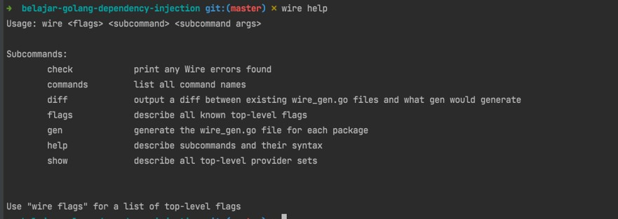

# Golang Dependency Injection

## Sebelum Balajar

- Go-Lang Modules
- Go-Lang RESTful API

## Agenda

- Pengenalan Dependency Injection
- Pengenalan Google Wire
- Dependency Injection Secara Manual
- Dependency Injection Secara Otomatis

## #1 Pengenalan Dependency Injection

- Dalam pembuatan perangkat lunak, Dependency Injection merupakan sebuah teknik dimana sebuah object menerima object lain yang dibutuhkan (dependencies) ketika pembuatan object itu sendiri
- Biasanya object yang menerima dependencies disebut client, proses mengirim dependencies ke object tersebut biasa dibilang inject
- Dependency Injection sebenarnya sudah sering sekali kita lakukan, misal membuat object Controller yang membutuhkan dependencies object Service, atau membuat object Service yang membutuhkan dependencies object Repository

### Function Sebagai Constructor (1)

- Dalam bahasa pemrograman berorientasi object, ada istilah yang bernama Constructor, yaitu sebuah function yang digunakan ketika sebuah object dibuat
- Di Go-Lang, biasanya kita juga membuat sebuah function untuk membuat object, dan ini mirip seperti Constructor tugasnya, yaitu membuat object baru

```go
func NewCategoryController(categoryService service.CategoryService) CategoryController {
	return &CategoryControllerImpl{
		CategoryService: categoryService,
	}
}
```

- Biasanya kita akan membuat object dengan memanggil function Constructor tersebut, lalu mengirimkan dependencies yang dibutuhkan pada function Constructor tersebut
- Cara seperti ini mudah dilakukan ketika kode program aplikasi kita tidak terlalu besar
- Namun saat kode program aplikasi kita semakin besar, akan semakin sulit melakukan hal ini, terutama kita harus tahu urutan object mana yang harus dibuat terlebih dahulu
- Oleh karena ini, proses Dependency Injection sebenarnya bisa kita permudah dengan memanfaatkan library

### Kode: Manual Dependency Injection

```go
db := app.NewDB()
validate := validator.New()
categoryRepository := repository.NewCategoryRepository()
categoryService := service.NewCategoryService(categoryRepository, db, validate)
CategoryController := controller.NewCategoryController(categoryService)
router := app.NewRouter(CategoryController)

server := http.Server{
	Addr: "localhost:3000",
	Handler: middleware.NewAuthMiddleware(router)
}
```

## #2 Library Dependency Injection

- Banyak sekali library Dependency Injection yang bisa kita gunakan di Go-Lang, misalnya
- <https://github.com/google/wire>
- <https://github.com/uber-go/fx>
- <https://github.com/golobby/container>
- Dan lain-lain

### Google Wire

- Pada kelas ini, kita akan menggunakan Google Wire sebagai Dependency Injection library nya
- Salah satu kenapa Google Wire menjadi pilihan, karena saat ini Google Wire adalah library paling populer untuk melakukan Dependency Injection di Go-Lang
- Selain itu, Google Wire merupakan library Dependency Injection yang berbasis compile, artinya kodenya akan di generate, bukan menggunakan reflection
- Hal ini membuat Google Wire menjadi cepat, karena hasil kompilasi nya adalah kode yang sudah di generate melakukan Dependency Injection, tanpa perlu menggunakan reflection lagi

## #3 Membuat Project

### Clone Project Go-Lang Restful API

- <https://github.com/ProgrammerZamanNow/belajar-golang-restful-api>

### Tambah Dependency Goole Wire

- `go get github.com/google/wire`

## #4 Menginstall Wire

- Google Wire membutuhkan aplikasi command line wire untuk melakukan auto generate kode Dependency injection ketika kita nanti membuat kode
- Program ini perlu kita install manual di komputer kita dengan perintah :
- `go install github.com/google/wire/cmd/wire@latest`
- Secara otomatis akan ada file binary di `$GOPATH/bin/wire`
- Agar aplikasi command line wire tersebut bisa diakses, jangan lupa masukkan ke `$PATH` sistem operasi kita, seperti yang pernah kita lakukan ketika belajar setting `$PATH` Go-Lang di kelas Go-Lang Dasar

### Program Wire



## #5 Provider

- Untuk melakukan Dependency Injection, kita perlu buat dalam bentuk function constructor
- Dalam Google Wire, function constructor tersebut kita sebut dengan Provider

### Kode: Struct

```go
type SimpleRepository struct {

}

type SimpleService struct {
	*SimpleRepository
}
```

### Kode: Provider

```go
func NewSimpleRepository() *SimpleRepository {
	return &SimpleRepository{}
}

func NewSimpleService(repository *SimpleRepository) *SimpleService {
	return &SimpleService{
		SimpleRepository: repository,
	}
}
```

## #6 Injector

- Setelah kita membuat Provider untuk nanti kita gunakan, selanjutnya kita perlu membuat Injector
- Injector sendiri adalah sebuah function constructor, namun isinya berupa konfigurasi yang kita beritahukan ke Google Wire
- Injector ini sendiri sebenarnya tidak akan digunakan oleh kode program kita, Injector ini adalah function yang akan digunakan oleh Google Wire untuk melakukan auto generate kode Dependency Injection
- Khusus ketika membuat Injector, pada file nya kita perlu tambahkan komentar penanda :
- `go:build wireinject`
- `+build wireinject`

### Kode: File Injector

```go
// go:build wireinject
// +build wireinject
```

### Kode: Injector

```go
import (
	"github.com/google/wire"
	"programmerzamannow/belajar-restful-api/simple"
)

func InitializedService() *simple.SimpleService {
	wire.Build(simple.NewSimpleRepository, simple.NewSimpleService)
	return nil
}
```

## #7 Dependency Injection

- Setelah kita membuat Injector dan Provider, selanjutnya yang perlu kita lakukan adalah menggunakan aplikasi command line Google Wire untuk melakukan auto generate kode Dependency Injection
- Kita bisa menggunakan perintah ini untuk melakukan auto generate kode dependency injection :
- `wire gen namapackage`
- Secara otomatis aplikasi Google Wire akan mencari kode Injector di package tersebut, lalu membuat file wire_gen.go yang isinya adalah kode otomatis dependency injection

### Kode: File wire_go.gen

```go
import (
	"programmerzamannow/belajar-restful-api/simple"
)

// Injectors from simple.go

func InitializedService() *simple.SimpleService {
	simpleRepository := simple.NewSimpleRepository()
	simpleService := simple.NewSimpleService(simpleRepository)
	return simpleService
}
```

## #8 Error

- Google Wire juga bisa mendeteksi jika terjadi error pada Provider kita
- Jika terdapat error, secara otomatis akan mengembalikan error ketika kita melakukan dependency injection
- Caranya sederhana, kita cukup buat di Provider return value kedua berupa error, dan di Injector nya juga perlu kita tambahkan return value kedua berupa error

### Kode: Provider

```go
type SimpleRepository struct {
	Error bool
}

func NewSimpleService(repository *SimpleRepository) (*SimpleService, error) {
	if repository.Error {
		return nil, errors.New("failed create service")
	} else {
		return &SimpleService{
			SimpleRepository: repository,
		}, nil
	}
}
```

### Kode: Injector

```go
import (
	"github.com/google/wire"
	"programmerzamannow/belajar-restful-api/simple"
)

func InitializedService() (*simple.SimpleService, error) {
	wire.Build(simple.NewSimpleRepository, simple.NewSimpleService)
	return nil, nil
}
```

### Kode: Hasil Generate

```go
func InitializedService() (*simple.SimpleService, error) {
	simpleRepository := simple..NewSimpleRepository()
	simpleService, err := simple.NewSimpleService(simpleRepository)
	if err != nil {
		return nil, err
	}
	return simpleService, nil
}
```

## #9 Injector Parameter

### Injector Signature

- Saat membuat Injector, kadang kita butuh parameter yang dinamis
- Dengan Google Wire, kita juga bisa mengirim parameter pada Injector yang akan di generate secara otomatis
- Secara otomatis jika ada Provider yang membutuhkan data dengan tipe parameter yang sama, secara otomatis data di parameter akan digunakan

### Kode: Provider

```go
func NewSimpleRepository(isError bool) *SimpleRepository {
	return &SimpleRepository{
		Error: isError,
	}
}
```

### Kode: Injector

```go
import (
	"github.com/google/wire"
	"programmerzamannow/belajar-restful-api/simple"
)

func InitializedService(isError bool) (*simple.SimpleService, error) {
	wire.Build(simple.NewSimpleRepository, simple.NewSimpleService)
	return nil, nil
}
```

### Kode: Hasil Auto Generate

```go
func InitializedService(isError bool) (*simple.SimpleService, error) {
	simpleRepository := simple..NewSimpleRepository(isError)
	simpleService, err := simple.NewSimpleService(simpleRepository)
	if err != nil {
		return nil, err
	}
	return simpleService, nil
}
```

## #10 Miltiple Binding

- Saat melakukan dependency injection, kadang ada kasus kita membuat beberapa Provider dengan tipe yang sama
- Hal ini akan membuat error proses auto generate kode dependency injection, karena Google Wire tidak mendukung multiple binding dengan tipe yang sama
- Pada kasus ini, kita bisa membuat tipe alias untuk multiple binding

### Kode: Struct

```go
type Database struct {
	Name string
}

type DatabasePostgreSQL Database
type DatabaseMongoDB Database

type DatabaseRepository struct {
	*DatabasePostgreSQL
	*DatabaseMongoDB
}
```

### Kode: Provider

```go
func NewDatabaseMongoDB() *DatabaseMongoDB {
	database := &Database{
		Name: "MongoDB",
	},
	return (*DatabaseMongoDB)(database)
}

func NewDatabasePostgreSQL() *DatabasePostgreSQL {
	database := &Database{
		Name: "PostgreSQL",
	},
	return (*DatabasePostgreSQL)(database)
}

func NewDatabaseRepository(
	databasePostgreSQL *databasePostgreSQL,
	databaseMongoDB *databaseMongoDB,
) *DatabaseRepository {
	return &DatabaseRepository{
		DatabasePostgreSQL: databasePostgreSQL,
		DatabaseMongoDB: 		databaseMongoDB,
	}
}
```

### Kode: Injector

```go
func InitializedDatabaseRepository() *simple.DatabaseRepository {
	wire.Build(
		simple.NewDatabasePostgreSQL,
		simple.NewDatabaseMongoDB,
		simple.NewDatabaseRepository,
	)

	return nil
}
```

## #11 Provider Set

- Google Wire memiliki fitur yang bernama Provider Set, fitur ini digunakan untuk melakukan grouping Provider
- Provider Set sangat berguna ketika kode program kita sudah banyak, dan Providernya sudah banyak, sehingga akan lebih mudah untuk dibaca ketika kita grouping data Provider nya

### Kode: Foo

```go
type FooRepository struct {

}

func NewFooRepository() *FooRepository {
	return &FooRepository{}
}

type FooService struct {
	*FooRepository
}

func NewFooService(fooRepository *FooRepository) *FooService {
	return &FooService{FooRepository: fooRepository}
}
```

### Kode: Bar

```go
type BarRepository struct {

}

func NewBarRepository() *BarRepository {
	return &BarRepository{}
}

type BarService struct {
	*BarRepository
}

func NewBarService(barRepository *BarRepository) *BarService {
	return &BarService{BarRepository: barRepository}
}
```

### Kode: Foo Bar

```go
type FooBarService struct {
	*FooService
	*BarService
}

func NewFooBarService(fooService *FooService, barService *BarService) *FooBarService {
	return &FooBarService{FooService: fooService, BarService: barService}
}
```

### Kode: Provider Set

```go
var fooSet = wire.NewSet(simple.NewFooRepository, simple.NewFooService)

var barSet = wire.NewSet(simple.NewBarRepository, simple.NewBarService)

func InitializedFooBarService() *simple.FooBarService {
	wire.Build(fooSet, barSet, simple.NewFooBarService)
	return nil
}
```

## #12 Binding Interface

- Dalam pembuatan aplikasi, sering sekali kita biasanya menggunakan Interface sebagai kontrak struct
- Secara default, Google Wire akan menggunakan tipe data asli untuk melakukan dependency injection, jadi jika terdapat parameter berupa Interface, dan tidak ada Provider yang mengembalikan Interface tersebut, maka akan dianggap error
- Pada kasus ini, kita bisa memberi tahu ke Google Wire, jika kita ingin melakukan binding interface, yaitu memberi tahu untuk sebuah interface akan menggunakan provider dengan tipe apa

### Kode: Interface

```go
type SayHello interface {
	Hello(name string) string
}

type HelloService struct {
	SayHello SayHello
}

type SayHelloImpl struct {

}

func (s SayHelloImpl) Hello(name string) string {
	return "Hello " + name
}
```

### Kode: Provider

```go
func NewSayHelloImpl() *SayHelloImpl {
	return &SayHelloImpl{}
}

func NewHelloService(sayHello SayHello) *HelloService {
	return &HelloService{
		SayHello: sayHello,
	}
}
```

### Kode: Injector Salah

```go
import (
	"github.com/google/wire"
	"programmerzamannow/belajar-restful-api/simple"
)

func InitializedHelloService() *simple.HelloService {
	wire.Build(simple.NewHelloService, simple.NewSayHelloImpl)
	return nil
}
```

### Kode: Injector

```go
var HelloSet = wire.NewSet(
	simple.NewSayHelloImpl,
	wire.Bind(new(simple.SayHello), new(*simple.SayHelloImpl))
)

func InitializedHelloService() *simple.HelloService {
	wire.Build(HelloSet, simple.NewHelloService)
	return nil
}
```

## #13 Struct Provider

- Kita juga bisa membuat Struct Provider, yaitu Struct yang bisa kita jadikan sebagai Provider
- Secara otomatis Struct yang kita sebutkan akan menjadi Provider
- Dan kita juga bisa melakukan dependency injection terhadap field yang terdapat didalam Struct tersebut, kita cukup menyebutkan field mana yang akan di inject, atau jika ingin melakukan injection ke semua field, kita bisa gunakan karakter `*` (bintang)

### Kode: Provider

```go
type Foo struct {

}

func NewFoo() *Foo {
	return &Foo{}
}

type Bar struct {

}

func NewBar() *Bar {
	return &Bar{}
}
```

### Kode: Struct Provider

```go
type FooBar struct {
	*Foo
	*Bar
}

var FooBarSet = wire.NewSet(
	simple.NewFoo,
	simple.NewBar,
)

func InitializedFooBar() *simple.FooBar {
	wire.Build(
		FooBarSet,
		wire.Struct(new(simple.FooBar), "Foo", "Bar") // * for all fields
	)
	return nil
}
```

## #14 Binding Values

- Kadang ada kasus dimana kita ingin melakukan dependency injection terhadap value yang sudah ada, tanpa harus membuat Provider terlebih dahulu
- Untuk kasus seperti, kita bisa langsung sebutkan value dari objectnya, tanpa menggunakan Provider

### Kode: Injector

```go
var FooBarValueSet = wire.NewSet(
	wire.Value(&simple.Foo{}),
	wire.Value(&simple.Bar{}),
)

func InitializedFooBarUsingValue() *simple.FooBar {
	write.Build(FooBarValueSet, wire.Struct(new(simple.FooBar), "*"))
	return nil
}
```

### Interface Value

- Seperti di awal sudah dijelaskan, bahkan Google Wire akan melakukan dependency injection sesuai tipe data Provider nya
- Pada kasus jika kita ingin menggunakan value berupa Interface, maka kita perlu melakukan Interface Binding seperti yang sudah dibahas
- Atau ada cara yang lebih mudah, kita bisa binding value sekaligus menyebutkan interface yang digunakan oleh value tersebut

### Kode: Injector Interface Value

```go
func InitializedReader() io.Reader {
	wire.Build(wire.InterfaceValue(new(io.Reader), os.Stdin))
	return nil
}
```

## #15 Struct Field Provider

- Google Wire juga mendukung pembuatan Provider dari Field sebuah Struct
- Misal pada kondisi kita ingin menggunakan sebuah Field dari Struct untuk dijadikan dependency untuk Provider lain

### Kode: Provider

```go
type Configuration struct {
	Name string
}

type Application struct {
	*Configuration
}

func NewApplication() *Application {
	return &Application{
		Configuration: &Configuration{
			Name: "Programmer Zaman Now",
		},
	}
}
```

### Kode: Injector

```go
func InitializedConfiguration() *simple.Configuration {
	wire.Build(
		simple.NewApplication,
		wire.FieldsOf(new(*simple.Application), "Configuration"),
	)
	return nil
}
```

## #16 Cleanup Function

- Jika Provider membuat object yang membutuhkan proses cleanup (pembersihan) setelah object dibuat, maka pada provider kita bisa mengembalikan closure
- Closure secara otomatis akan dipanggil dalam proses cleanup oleh Google Wire

### Kode: Provider File

```go
type File struct {
	Name string
}

func NewFile(name string) (*File, func()) {
	file := &File{Name: name}
	return file, func() {
		file.Close()
	}
}

func (f *File) Close() {
	fmt.Println("Close File", f.Name)
}
```

### Kode: Provider Connection

```go
type Connection struct {
	File *File
}

func (c *Connection) Close() {
	fmt.Println("Close Connection", c.File.Name)
}

func NewConnection(file *File) (*Connection, func()) {
	connection := &Connection{File: file}
	return connection, func() {
		connection.Close()
	}
}
```

### Kode: Injector

```go
func InitializedConnection(name string) (*simple.Connection, func()) {
	wire.Build(simple.NewConnection, simple.NewFile)
	return nil, nil
}
```

## #17 Dependency Injection di RESTful API

## #18 Materi Selanjutnya

- Belajar Framework dan Library Go-Lang
- Studi Kasus Membuat Aplikasi menggunakan Go-Lang
