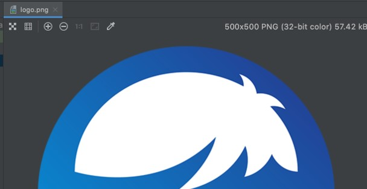
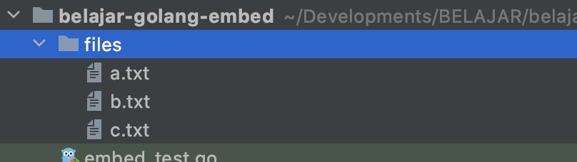
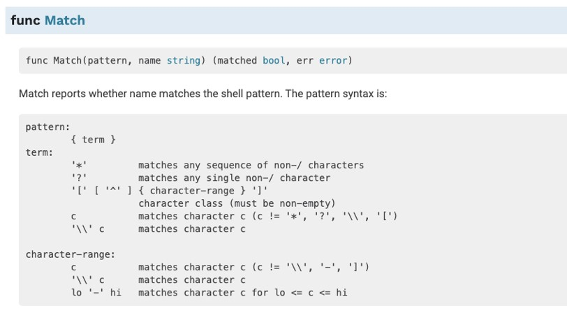

# Golang Embed

## Sebelum Belajar

- Go-Lang Dasar
- Go-Lang Modules
- Go-Lang Unit Test

## Agenda

- Pengenalan Embed Package
- Embed File ke String
- Embed File ke `Byte[]`
- Embed Multiple File
- Hasil Embed di Compile
- Dan lain-lain

## #1 Pengenalan Embed Package

### Embed Package

- Sejak Golang versi 1.16, terdapat package baru dengan nama embed
- Package embed adalah fitur baru untuk mempermudah membaca isi file pada saat compile time secara otomatis dimasukan isi file nya dalam variable
- <https://golang.org/pkg/embed>

### Cek Versi Golang

```bash
go version
```

### Cara Embed File

- Untuk melakukan embed file ke variable, kita bisa mengimport package embed terlebih dahulu
- Selanjutnya kita bisa tambahkan komenter `//go:embed` diikuti dengan nama file nya, yang kita tuju
- Variable yang dituju tersebut nanti secara otomatis akan berisi konten file yang kita inginkan secara otomatis ketika kode golang di compile
- Variable yang dituju, tidak bisa disimpan di dalam function

## #2 File Ke String

- Embed file bisa kita lakukan ke variable dengan tipe data string
- Secara otomatis isi file akan dibaca sebagai text dan masukan ke varaiable tersebut

### Kode: File version.txt

```txt
// version.txt
1.0.0-SNAPSHOT
```

### Kode: EMbed File ke String

```go
import (
	_ "embed"
	"fmt"
	"testing"
)

//go:embed version.txt
var version string

func TestString(t *testing.T) {
	fmt.Println(version)
}
```

## #3 Embed File ke `[]byte`

- Selain ke tipe data String, embed file juga bisa dilakukan ke variable tipe data `[]byte`
- Ini cocok sekali jika kita ingin melakukan embed file dalam bentuk binary, seperti gambar dan lain-lain

### Gambar Logo



### Kode: Embed File Ke `[]byte`

```go
//go:embed logo.png
var logo []byte

func TestByteArray(t *testing.T) {
	err := ioutil.WriteFile("logo_next.png", logo, fs.ModePerm)
	if err != nil {
		panic(err)
	}
}
```

## #4 Embed Multiple Files

- Kadang ada kebutuhan kita ingin melakukan embed beberapa file sekaligus
- Hal ini juga bisa dilakukan menggunakan embed pacakge
- Kita bisa menambahkan komenter `//go:embed` lebih dari satu baris
- Selain itu variable nya bisa kita gunakan tipe data embed.FS

### Kode: Multiple Files



```txt
files
	-a.txt
	-b.txt
	-c.txt
```

### Kode: Embed Multiple File

```go
//go:embed files/a.txt
//go:embed files/b.txt
//go:embed files/c.txt
var files embed.FS

func TestMultipleFiles(t *testing.T) {
	a, _ := files.ReadFile("files/a.txt")
	fmt.Println(string(a))

	b, _ := files.ReadFile("files/b.txt")
	fmt.Println(string(b))

	c, _ := files.ReadFile("files/c.txt")
	fmt.Println(string(c))
}
```

## #5 Path Matcher

- Selain manual satu per satu, kita bisa menggunakan patch matcher untuk membaca file yang kita inginkan
- Ini sangat cocok ketika misal kita punya pola jenis file yang kita inginkan untuk kita baca
- Caranya, kita prlu menggunakan path matcher seperti pada package function `path.Match`
- <https://golang.org/pkg/path@Match>



### Kode: Patch Matcher

```go
//go:embed files/*.txt
var path embed.FS

func TestPathMatcher(t *testing.T) {
	dir, _ := path.ReadDir("files")
	for _, entry := range dir {
		if !entry.IsDir() {
			fmt.Println(entry.Name())
			content, _ := path.ReadFile("files/" + entry.Name())
			fmt.Println("Content:", string(content))
		}
	}
}
```

## #6 Hasil Embed di Compile

- Perlu diketahui, bahwa hasil embed yang dilakukan oleh package embed adalah permanent dan data file yang dibaca disimpan dalam binary file golang nya
- Artinya bukan dilakukan secara realtime membaca file yang ada diluar
- Hal ini menjadikan jika binary file golang sudah di compile, kita tidak butuh lagi file external nya, dan bahkan jika diubah file external nya, isi variable nya tidak akan berubah lagi

### Kode: Main Function

```go
//go:embed version.txt
var version string

//go:embed logo.png
var logo []byte

//go:embed files/*txt
var path embed.FS

func main() {
	fmt.Println(version)

	ioutil.WriteFile("logo_next.png", logo, fs.ModePerm)
}
```

### Compile

```bash
go build
```

## #7 Materi Selanjutnya

- Go-Lang Web
