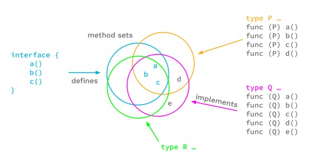
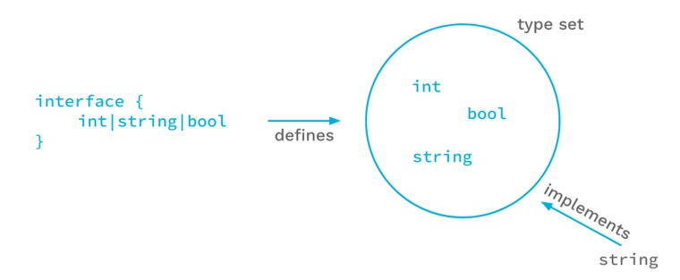

# Golang Generics

## Sebelum Balajar

- Go-Lang Dasar
- Go-Lang Modules
- Go-Lang Unit Test

## Agenda

- Pengenalan Generics
- Type Parameter
- Any dan Comparable
- Type Sets
- Type Approximation
- Type Inference
- Dan Lain-lain

## #1 Pengenalan Generics

- Generic adalah kemampuan menambahkan parameter type saat membuat function
- Berbeda dengan tipe data yang biasa kita gunakan di function, generic memungkinkan kita bisa mengubah-ubah bentuk tipe data sesuai dengan yang kita mau.
- Fitur generics baru ada sejak Go-Lang versi 1.18

### Manfaat Generic

- Pengecekan ketika proses kompilasi
- Tidak perlu manual menggunakan pengecekan tipe data dan konversi tipe data
- Memudahkan programmer membuat kode program yang generic sehingga bisa digunakan oleh berbagai tipe data

### Kode: Contoh Kode Bukan Generic

```go
func SumInt(values []int) int {
	var sum = 0
	for _, value := range values {
		sum = sum + value
	}
	return sum
}

func SUmFloat(values []float64) float64 {
	var sum float64 = 0
	for _, value := range values {
		sum = sum + value
	}
	return sum
}
```

## #2 Membuat Project

- `go mod init ProgrammerZamanNow/belajar-golang-generics`
- `go get github.com/stretchr/testify`

## #3 Type Parameter

- Untuk menandai sebuah function merupakan tipe generic, kita perlu menambahkan Type Parameter pada function tersebut
- Pembuatan Type Parameter menggunakan tanda `[]` (kurung kotak), dimana di dalam kurung kotak tersebut, kita tentukan nama Type Parameter nya
- Hampir sama dengan di bahasa pemrograman lain seperti Java, C# dan lain-lain, biasanya nama Type Parameter hanya menggunakan satu huruf, misal `T`, `K`, `V` dan lain-lain. Walaupun bisa saja lebih dari satu huruf

### Kode: Type Parameter

```go
func Length[T]() {

}
```

### Type Constraint

- Di bahasa pemrograman seperti Java, C# dan lain-lain, Type Parameter biasanya tidak perlu kita tentukan tipe datanya, berbeda dengan di Go-Lang.
- Dari pengalaman yang dilakukan para pengembang Go-Lang, akhirnya di Go-Lang, Type Parameter wajib memiliki constraint
- Type Constraint merupakan aturan yang digunakan untuk menentukan tipe data yang diperbolehkan pada Type Parameter
- Contoh, jika kita ingin Type Parameter bisa digunakan untuk semua tipe data, kita bisa gunakan `interface{}` (kosong) sebagai constraint nya
- Type Constraint yang lebih detail akan kita bahas di materi Type Sets

### Kode: Type Constraint

```go
func Length[T interface{}]() {

}
```

### Tipe Data any

- Di Go-Lang 1.18, diperkenalkan alias baru bernama `any` untuk `interface{}` (kosong), ini bisa mempermudah kita ketika membuat Type Parameter dengan constraint `interface{}`, jadi kita cukup gunakan constraint `any`

```go
// any is an alias for interface{} and is equivalent to interface{} in all ways.
type any = interface{}
```

### Kode: Tipe Data any

```go
func Length[T any]() {

}
```

### Menggunakan Type Parameter

- Setelah kita buat Type Parameter di function, selanjutnya kita bisa menggunakan Type Parameter tersebut sebagai tipe data di dalam function tersebut
- Misal nya digunakan untuk return type atau function parameter
- Kita cukup gunakan nama Type Parameter nya saja
- Type Parameter hanya bisa digunakan di functionnya saja, tidak bisa digunakan di luar function

### Kode: Menggunakan Type Parameter

```go
func Length[T any](param T) T {
	fmt.Println(param)
	return param
}

func TestLength(t *testing.T) {
	var result string Length[string]("Eko")
	fmt.Println(result)

	var resultNumber int = Length[int](100)
	fmt.Println(resultNumber)
}
```

## #4 Multiple Type Parameter

- Penggunakan Type Parameter bisa lebih dari satu, jika kita ingin menambahkan multiple Type Parameter, kita cukup gunakan tanda `,` (koma) sebagai pemisah antar Type Parameter
- Nama Type Parameter harus berbeda, tidak boleh sama jika kita menambah Type Parameter lebih dari satu

### Kode: Multiple Type Parameter

```go
func MultipleParameter(T1, any, T2, any)(param1, T1, param2, T2) {
	fmt.Println(param1)
	fmt.Println(param2)
}

func TestMultipleParameter(t *testing.T) {
	MultipleParameter[string, int]("Eko", 100)
	MultipleParameter[int, string](100, "Eko")
}
```

## #5 Comparable

- Selain any, di Go-Lang versi 1.18 juga terdapat tipe data bernama `comparable`
- comparable merupakan interface yang diimplementasikan oleh tipe data yang bisa dibandingkan (menggunakan operator != dan ==), seperti booleans, numbers, strings, pointers, channels, interfaces, array yang isinya ada comparable type, atau structs yang fields nya adalah comparable type

### Kode: Comparable

```go
func IsSame[T comparable](value1, value2 T) bool {
	if value1 == value2 {
		return true
	} else {
		return false
	}
}

func TestIsSame(t *testing.T) {
	assert.Equal(t, true, IsSame[string]("eko", "eko"))
	assert.Equal(t, true, IsSame[int](100, 100))
}
```

## #6 Type Parameter Inheritance

- Go-Lang sendiri sebenarnya tidak memiliki pewarisan, namun seperti kita ketahui, jika kita membuat sebuah type yang sesuai dengan kontrak interface, maka dianggap sebagai implementasi interface tersebut
- Type Parameter juga mendukung hal serupa, kita bisa gunakan constraint dengan menggunakan interface, maka secara otomatis semua interface yang compatible dengan type constraint tersebut bisa kita gunakan

### Diagram: Type Interface



### Kode: Employee Interface

```go
type Employee interface {
	GetName() string
}

func GetName[T Employee](parameter T) string {
	return parameter.GetName()
}
```

### Kode: Manager Interface

```go
type Manager interface {
	GetName() string
	GetManagerName() string
}

type MyManager string {
	Name string
}

func (m *MyManager) GerName() string {
	return m.Name
}

func (m *MyManager) GetManagerName() string {
	return m.Name
}
```

### Kode: Vice President Interface

```go
type VicePresident interface {
	GetName() string
	GetVicePresidentName() string
}

type MyVicePresident struct {
	Name string
}

func (m *MyVicePresident) GetName() string {
	return m.Name
}

func (m *MyVicePresident) GetVicePresidentName() string {
	return m.Name
}
```

### Kode: Type Parameter Inheritance

```go
func TestGetName(t *testing.T) {
	assert.Equal(t, "Eko", GetName[Manager](&MyManager{Name: "Eko"}))
	assert.Equal(t, "Eko", GetName[VicePresident](&MyVicePresident{Name: "Eko"}))
}
```

## #7 Type Sets

- Salah satu fitur yang menarik di Go-Lang Generic adalah Type Sets
- Dengan fitur ini, kita bisa menentukan lebih dari satu tipe constraint yang diperbolehkan pada type parameter

### Membuat Type Set

- Type Set adalah sebuah interface
- Cara membuat Type Set :

`type NamaTypeSet interface {
	    P | Q | R
}`

- TypeSet hanya bisa digunakan pada type parameter, tidak bisa digunakan sebagai tipe data field atau variable
- Jika operator bisa digunakan di semua tipe data di dalam type set, maka operator tersebut bisa digunakan dalam kode generic

### Diagram Type Set



### Kode: Type Set Interface

```go
func Number interface {
	int | int8 | int16 | int32 | int64 | float32 | float64
}

func Min[T Number](first T, second T) T {
	if first < second {
		return first
	} else {
		return second
	}
}
```

### Kode: Unit Test Type Set

```go
func TestMin(t *testing.T) {
	assert.Equal(t, int(100), Min[int](100, 200))
	assert.Equal(t, int64(100), Min[int64](100, 200))
	assert.Equal(t, float64(100.0), Min[float64](100.0, 200.0))
}
```

## #8 Type Approximation

- Kadang, kita sering membuat Type Declaration di Golang untuk tipe data lain, misal kita membuat tipe data Age untuk tipe data `int`
- Secara default, jika kita gunakan Age sebagai type declaration untuk int, lalu kita membuat Type Set yang berisi constraint int, maka tipe data Age dianggap tidak compatible dengan Type Set yang kita buat

#### Kode: Type Declaration

```go
type Age int

type Number interface {
	int | int8 | int16 | int32 | int64 | float32 | float64
}
```

### Kode: Test Type Declaration

```go
func TestMin(t *testing.T) {
	assert.Equal(t, int(100), Min[int](100, 200))
	assert.Equal(t, int64(100), Min[int64](100, 200))
	assert.Equal(t, float64(100), Min[float64](100.0, 200.0))
	assert.Equal(t, Age(100), Min[Age](Age(100), Age(200)))
}
```

### Type Approximation

- Untungnya, Go-Lang memiliki feature bernama Type Approximation, dimana kita bisa menyebutkan bahwa semua constraint dengan tipe tersebut dan juga yang memiliki tipe dasarnya adalah tipe tersebut, maka bisa digunakan
- Untuk menggunakan Type Approximation, kita bisa gunakan tanda ~ (tilde)

### Kode: Type Approximation

```go
type Age int

type Number interface {
	~int | int8 | int16 | int32 | int64 | float32 | float64
}
```

## #9 Type Inference

- Type Inference merupakan fitur dimana kita tidak perlu menyebutkan Type Parameter ketika memanggil kode generic
- Tipe data Type Parameter bisa dibaca secara otomatis misal dari parameter yang kita kirim
- Namun perlu diingat, pada beberapa kasus, jika terjadi error karena Type Inference, kita bisa dengan mudah memperbaikinya dengan cara menyebutkan Type Parameter nya saja

### Kode: Type Inference

```go
func TestMin(t *testing.T) {
	assert.Equal(t, int(100), Min[int](100, 200))
	assert.Equal(t, int64(100), Min[int64](100, 200))
	assert.Equal(t, float64(100), Min[float64](100.0, 200.0))
	assert.Equal(t, Age(100), Min[Age](Age(100), Age(200)))
}

func TestTypeInference(t *testing.T) {
	assert.Equal(t, int(100), Min(100, 200))
	assert.Equal(t, int64(100), Min(100, 200))
	assert.Equal(t, float64(100), Min(100.0, 200.0))
	assert.Equal(t, Age(100), Min(Age(100), Age(200)))
}
```

## #10 Generic Type

- Sebelumnya kita sudah bahas tentang generic di function
- Generic juga bisa digunakan ketika membuat type

### Kode: Generic Type

```go
type Bag[T any] []T

func PrintBag[T any](bag Bag[T]) {
	for _, vlaue := range bag {
		fmt.Println(value)
	}
}

func TestBag(t *testing.T) {
	numbers := Bag[int]{1, 2, 3, 4, 5}
	PrintBag[int](numbers)

	names := Bag[string]{"Eko", "Budi", "Joko"}
	fmt.Println(names)
	PrintBag[string](names)
}
```

## #11 Generice Struct

- Struct juga mendukung generic
- Dengan menggunakan generic, kita bisa membuat Field dengan tipe data yang sesuai dengan Type Parameter

### Kode: Generic Struct

```go
type Data[T any] struct {
	First T
	Second T
}

func TestData(t *testing.T) {
	data ;+ Data[string]{
		First: "Eko",
		Second: "Khannedy",
	}
	fmt.Println(data)
}
```

### Generic Method

- Selain di function, kita juga bisa tambahkan generic di method (function di struct)
- Namun, generic di method merupakan generic yang terdapat di struct nya.
- Kita wajib menyebutkan semua type parameter yang terdapat di struct, walaupun tidak kita gunakan misalnya, atau jika tidak ingin kita gunakan, kita bisa gunakan `_` (garis bawah) sebagai pengganti type parameter nya
- Method tidak bisa memiliki type parameter yang mirip dengan di function

### Kode: Generic Method

```go
func (d *Data[_]) SayHello(name string) string {
	return "Hello" + name
}

func (d *Data[T]) ChangeFirst(first T) T {
	d.First = first
	return first
}
```

### Kode: Test Generic method

```go
func TestGenericMethod(t *testing.T) {
	data := Data[string]{
		First: "Eko",
		Second: "Khannedy",
	}

	assert.Equal(t, "Budi", data.ChangeFirst("Budi"))
	assert.Equal(t, "Hello Eko", data.ChangeFirst("EKo"))
}
```

## #12 Generic Interface

- Generic juga bisa kita gunakan di Interface
- Secara otomatis, semua struct yang ingin mengikuti kontrak interface tersebut harus menggunakan generic juga

### Kode: Generic Interface

```go
type GetterSetter[T any] interface {
	GetValue() T
	setValue(value T)
}

func ChangeValue[T any](param GetterSetter[T], value T) T {
	param.setValue(value)
	return param.GetValue()
}
```

### Kode: Implementasi Struct

```go
type MyData[T any] struct {
	Value T
}

func (m *MyData[T]) GetValue() T {
	return m.Value
}

func (m *MyData[T])(SetValue(value T) }
	m.Value = value
```

### Kode: Test Generic Interface

```go
func TestInterface(t *testing.T) {
	myData := MyData[string]{}
	result := ChangeValue[string](&myData, "Eko")

	assert.Equal(t, "Eko", result)
}
```

## #13 In Line Type Constraint

- Sebelum-sebelumnya, kita selalu menggunakan type declaration atau type set ketika membuat type constraint di type parameter
- Sebenarnya tidak ada kewajiban kita harus membuat type declaration atau type set jika kita ingin membuat type parameter, kita bisa gunakan secara langsung (in line) pada type constraint, misalnya di awal kita sudah bahas tentang `interface {}` (kosong), tapi kita selalu gunakan type declaration any
- Jika kita mau, kita juga bisa langsung gunakan `interface { int | float32 | float64}` dibanding membuat type set Number misalnya

### Kode: In Line Type Constraint

```go
func FindMin[T interface { int | int64 | float64 }](first T, seconds T) T {
	if first < second {
		return first
	} else {
		return second
	}
}

func TestFundMin(t *testing.T) {
	assert.Equal(t, 100, FindMin(100, 200))
	assert.Equal(t, int64(100), FindMin(int64(100), int64(200)))
	assert.Equal(t, 100.0, FindMin(100.0, 200.0))
}
```

### Generic di Type Parameter

- Pada kasus tertentu, kadang ada kebutuhan kita menggunakan type parameter yang ternyata type ternyata type tersebut juga generic atau memiliki type parameter
- Kita juga bisa menggunakan in line type constraint agar lebih mudah, dengan cara menambahkan type parameter selanjutnya, misal
- `[S interface{[]E}, E interface{}]`, artinya `S` harus slice element `E`, dimana `E` boleh tipe apapun
- `[S []E, E any]`, artinya `S` harus slice element `E`, dimana `E` boleh tipe apapun

### Kode: Generic di Type Parameter

```go
func GetFirst[T []E, E any](data T) E {
	first = data[0]
	return firstValue
}
func TestGetFirst(t *testing.T) {
	names := []string{
		"Eko", "Kurniawan", "Khannedy",
	}

	first := GetFirst[[string], string](names)
	assert.Equal(t, "Eko", first)
}
```

## #14 Experimental Pacakge

- Saat versi Go-Lang 1.18, terdapat experimental package yang banyak menggunakan fitur Generic, namun belum resmi masuk ke Go-Lang Standard Library
- Kedepannya, karena ini masih experimental (percobaan), bisa jadi package ini akan berubah atau bahkan mungkin akan dihapus
- <https://pkg.go.dev/golang.org/x/exp>
- Silahkan install sebagai dependency di Go Modules menggunakan perintah
- `go get golang.org/x/exp`

### Constraints Package

- Package berisi type declaration yang bisa kita gunakan untuk tipe data bawaan Go-Lang, misal ConstraintsNumber, Complex, Ordered, dan lain-lain
- <https://pkg.go.dev/golang.org/x/exp/constraints>

### Kode: Experimental Constraints

```go
import "golang.org/x/emp/constraints"

func ExperimentalMin[T constraints.Ordered](first T, secod T) T {
	if first < second {
		return first
	} else {
		return second
	}
}
```

### Map & Slices Packages

- Terdapat juga package maps dan slices, yang berisi function untuk mengelola data Map dan Slice, namun sudah menggunakan fitur Generic
- <https://pkg.go.dev/golang.org/x/exp/maps>
- <https://pkg.go.dev/golang.org/x/exp/slices>

### Kode: Experimental Maps

```go
func TestExperimentalMaps(t *testing.T) {
	first := map[string]string{
		"Name": "Eko",
	}
	second := map[string]string{
		"Name": "Eko"
	}

	assert.True(t, maps.Equal(first, second))
}
```

### Kode: Experimental Slices

```go
func TestExperimentalSlices(t *testing.T) {
	first := []string{"Eko"}
	second := []string{"Eko"}

	assert.True(t, slices.Equal(first, second))
}
```

## #15 Materi Selanjutnya

- Belajar Framework dan Library Go-Lang
- Studi Kasus Membuat Aplikasi menggunakan Go-Lang
