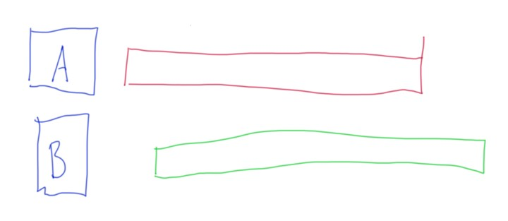
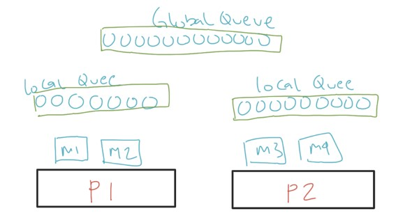
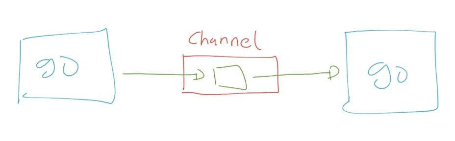

# Golang Goroutines

## Sebelum Belajar

- Go-Lang Dasar
- Go-Lang Modules
- Go-Lang Unit Test

## Agenda

- Concurrency & Parallel Programming
- Goroutines
- Channel
- Buffered Channel
- Mutex
- WaitGroup
- Atomic
- Ticker
- Dan lain-lain

## #1 Pengenalan Concurrency dan Parallel Programming

### Pengenalan Parallel Programming

- Saat ini kita hidup di era multicore, dimana jarang sekali kita menggunakan prosesor yang single core
- Semakin canggih perangkat keras, maka software pun akan mengikuti, dimana sekarang kita bisa dengan mudah membuat proses parallel di aplikasi
- Parallel programming sederhananya adalah memecahkan suatu masalah dengan cara membaginya menjadi yang lebih kecil, dan dijadikan secara beramaan pada waktu yang bersamaan pula

### Contoh Parallel

- Menjalankan beberapa aplikasi sekaligus di sistem operasi kita (office, editor, browser, dan lain-lain)
- Beberapa koki menyiapkan makanan di restoran, dimana tiap koki membuat makanan masing-masing
- Antrian di Bank, dimana tiap teller melayani nasabah nya masing-masing

### Process vs Thread

| Process                                       | Thread                                                      |
| --------------------------------------------- | ----------------------------------------------------------- |
| Process adalah sebuah eksekusi program        | Thread adalah segmen dari process                           |
| Process mengkonsumsi memory besar             | Thread menggunakan memory kecil                             |
| Process saling terisolasi dengan process lain | Thread bisa saling berhubungan jika dalam process yang sama |
| Process lama untuk dijalankan dihentikan      | Thread cepat untuk dijalankan dan dihentikan                |

### Parallel vs Concurrency

- Berbeda dengan paralel (menjalankan beberapa pekerjaan secara bersamaan), concurrency adalah menjalankan beberapa pekerjaan secara bergantian
- Dalam parallel kita biasanya membutuhkan banyak Thread, sedangkan dalam concurrency, kita hanya membutuhkan sedikit Thread

### Diagram Parallel



### Diagram Concurrency


### Contoh Concurrency

- Saat kita makan di cafe, kita bisa makan, lalu ngobrol, lalu minum, ngobrol lagi, minum lagi, dan seterusnya. Tetapi kita tidak bisa pada saat yang bersamaan minum, makan dan ngobrol, hanya bisa melakukan satu hal pada satu waktu, namun bisa berganti kapanpun kita mau.

### CPU-bound

- Banyak algoritma dibuat yang membutuhkan CPU untuk menjalankannya. Algoritma jenis ini biasanya sangat tergantung dengan kecepatan CPU.
- Contoh yang paling populer adalah Machine Learning, oleh karena itu sekarang banyak sekali teknologi Mechine Learning yang banyak menggunakan GPU karena memiliki core yang lebih banyak dibanding CPU biasanya.
- Jenis algoritma seperti ini tidak ada benefitnya menggunakan Concurrency Programming, namun bisa dibantu dengan implementasi Parallel Programming

### I/O-bound

- I/O-bound adalah kebalikan dari sebelumnya, dimana biasanya algoritma atau aplikasinya sangat tergantung dengan kecepatan input output devices yang digunakan
- Contohnya aplikasi seperti membaca data dari file, database, dan lain-lain.
- Kebanyakan saat ini, biasanya kita akan membuat aplikasi jenis seperti ini.
- Aplikasi jenis I/O-bound, walupun bisa terbantu dengan implementasi Parallel Programming, tapi benefitnya akan lebih baik jika menggunakan Concurrency Programming.
- Bayangkan kita membaca data dari database, dan Thread harus menunggu 1 detik untuk mendapatkan balasan dari database. padahal waktu 1 detik itu jika menggunakan Concurrency Programming. bisa digunakan untuk melakukan hal lain lagi.

## #2 Pengenalan Goroutines

- Goroutine adalah sebuah thread ringan yang dikelola oleh Go Runtime
- Ukuran Goroutine sangat kecil, sekitar 2kb, jauh lebih kecil dibandingkan Thread yang bisa sampai 1mb atau 1000kb
- Namun tidak seperti thread yang berjalan parallel, goroutine berjalan secara concurrent

### Cara Kerja Goroutine

- Sebenarnya, Goroutine dijalankan oleh Go Scheduler dalam thread, dimana jumlah thread nya sebanyak GOMAXPROCS (biasanya sejumlah core CPU)
- Jadi sebenarnya tidak bisa dibilang Goroutine itu pengganti Thread, karena Goroutine sendiri berjalan di atas Thread
- Namun yang mempermudah kita adalah, kita tidak perlu melakukan manajemen Thread secara manual, semua sudah diatur oleh Go Scheduler

### Cara Kerja Go Scheduler

Dalam Go-Scheduler, kita akan mengenal beberapa terminologi

- G: Goroutine
- M: Thread (Machine)
- P: Processor

### Cara Kerja Go-Scheduler



## #3 Membuat Project

- Buat folder belajar-golang-goroutine
- Buat module: `go mod init belajar-golang-goroutine`

## #4 Membuat Goroutine

- Untuk membuat goroutine di Golang sengatlah sederhana
- Kita hanya cukup menambahkan perintah `go` sebelum memanggil function yang akan kita jalankan dalam goroutine
- Saat sebuah function kita jalankan dalam goroutine, function tersebut akan berjalan secara asynchronus, artinya tidak akan ditunggu sampai function tersebut selesai.
- Aplikasi akan lanjut berjalan ke kode program selanjutnya tanpa menunggu goroutine yang kita buat selesai

### Kode: Membuat Goroutine

```go
func RunHelloWorld() {
	fmt.Println("Hello World")
}

func TestCreateGoroutine(t *testing.T) {
	go RunHelloWorld()
	fmt.Println("Ups")

	time.Sleep(1 * time.Second)
}
```

### Menjalankan Test

`go test -v -run=TestCreateGoroutine`

## #5 Goroutine Sangat Ringan

- Seperti yang sebelumnya dijelaskan, bahwa goroutine itu sangat ringan
- Kita bisa membuat ribuan, bahkan sampai jutaan goroutine tanpa takut boros memory
- Tidak seperti thread yang ukurannya berat, goroutine sangatlah ringan

### Kode: Membuat Banyak Goroutine

```go
func DisplayNumber(number int) {
	fmt.Println("Display", number)
}

func TestManyGoroutine(t *testing.T) {
	for i := 0; i < 100000; i++ {
		go DisplayNumber(i)
	}
	time.Sleep(10 * time.Second)
}
```

## #6 Pengenalan Channel

- Channel adalah tempat komunikasi secara synchronous yang bisa dilakukan oleh goroutine
- Di Channel terdapat pengirim dan penerima, biasanya pengirim dan penerima adalah goroutine yang berbeda
- Saat melakukan pengiriman data ke Channel, goroutine akan ter-block, sampai ada yang menerima data tersebut
- Maka dari itu, channel disebut sebagai alat komunikasi synchronous (blocking)
- Channel cocok sekali sebagai alternatif seperti mekanisme async await yang terdapat di beberapa bahasa pemrograman lain

### Diagram Channel



### Karakteristik Channel

- Secara default channel hanya bisa menampung satu data, kika kita ingin menambahkan data lagi, hasus menunggu data yang ada di channel diambil
- Channel hanya bisa menerima satu jenis data
- Channel bisa diambil dari lebih dari satu goroutine
- Channel harus di close jika tidak digunakan, atau bisa menyebabkan memory leak

## #7 Membuat Channel

- Channel di Go-Lang direpresentasikan dengan tipe data `chan`
- Untuk membuat channel sangat mudah, kita bisa menggunakan `make()`, mirip ketika membuat map
- Namun saat pembuatan channel, kita harus tentukan tipe data apa yang bisa dimasukan kedalam channel tersebut

### Kode: Membuat Channel

```go
channel := make(chan string)
```

### Mengirim dan Menerima Data dari Channel

- Seperti yang sudah dibahas sebelumnya, channel bisa digunakan untuk mengirim dan menerima data
- Untuk mengirim data, kita bisa gunakan kode : `channel <- data`
- Sedangkan untuk menerima data, bisa gunakan kode : `data <- channel`
- Jika selesai, jangan lupa untuk menutup channel menggunakan function `close()`

### Kode: Channel

```go
channel := make(chan string)

go func() {
	time.Sleep(2 * time.Second)
	channel <- "EKo Kurniawan Khannedy"
}()

data := <-channel
fmt.Println(data)
close(channel)
```

## #8 Channel Sebagai Parameter

- Dalam kenyataan pembuatan aplikasi, seringnya kita akan mengirim channel ke function lain via parameter
- Sebelumnya kita tahu bahkan di Go-Lang by default, parameter adalah pass by value, artinya value akan diduplikasi lalu dikirim ke function parameter, sehingga jika kita ingin mengirim data asli, kita biasa gunakan pointer (agar pass by reference)
- Berbeda dengan Channel, kita tidak perlu melakukan hal tersebut

### Kode: Channel Sebagai Parameter

```go
func TestChannelAsParameter(t *testing.T) {
	channel := make(chan string)

	go GiveMeResponse(channel)

	data := <-channel
	fmt.Println(data)
	close(channel)
}

func GiveMeResponse(channel chan string) {
	time.Sleep(2 * time.Second)
	channel <- "Eko Kurniawan Khannedy"
}
```

## #9 Channel In dan Out

- Saat kita mengirim channal sebagai parameter, isi function tersebut bisa mengirim dan menerima data dari channel tersebut
- Kadang kita ingin memberi tahu, terhadap function, misal bahwa channel tersebut hanya digunakan untuk mengirim data, atau hanya dapat digunakan untuk menerima data
- Hal ini bisa kita lakukan di parameter dengan cara menandai apakah channel ini digunakan untuk in (mengirim data) atau out (menerima data)

### Kode: channel In dan Out

```go
func OnlyIn(channel chan<- string) {
	time.Sleep(2 * time.Second)
	channel <- "Eko Kurniawan Khannedy"
}

func OnlyOut(channel <-chan string) {
	data := <-channel
	fmt.Println(data)
}

func TestInOutChannel(t *testing.T) {
	channel := make(chan string)

	go OnlyIn(channel)
	go OnlyOut(channel)

	time.Sleep(3 * time.Second)
	close(channel)
}
```

## #10 Buffered Channel

- Seperti yang dijelaskan sebelumnya, bahwa secara default channel itu hanya bisa menerima 1 data
- Artinya jika kita menambah data ke-2, maka kita akan diminta menunggu sampai data ke1 ada yang mengambil
- Kadang-kadang ada kasus dimana pengirim lebih cepat dibanding penerima, dalam hal ini jika kita menggunakan channel, maka otomatis pengirim akan ikut lambat juga
- Untuknya ada Buffered Channel, yaitu yang bisa digunakan untuk menampung data antrian di Channel

### Buffer Capacity

- Kita bebas memasukan berapa jumlah kapasitas antrian di dalam buffer
- Jika kita set misal 5, artinya kita bisa menerima 5 data di buffer
- Jika kita mengirim data ke 6, maka kita diminta untuk menunggu sampai buffer ada yang kosong
- Ini cocok sekali ketika memang goroutine yang menerima data lebih lambad dari yang mengirim data

### Diagram Channel Buffer

### Kode: Membuat Buffered Channel

```go
channel := make(chan string, 3)

fmt.Println(cap(channel)) // melihat panjang buffer
fmt.Println(len(channel)) // melihat jumlah data di buffer
```

## #11 Range Channel

- Kadang-kadang ada kasus sebuah channel dikirim data secara terus menerus oleh pengirim
- Dan kadang tidak jelas kapan channel tersebut akan berhenti menrima data
- Salah satu yang bisa kita lakukan adalah dengan menggunakan perulangan range ketika menerima data dari channel
- Ketika sebuah channel di `close()`, maka secara otomatis perulangan tersebut akan berhenti
- Ini lebih sederhana dari pada kita melakukan pengecekan channel secara manual

### Kode: Range Channel

```go
channel := make(chan string)

go func() {
	for i := 0; i < 10; i++ {
		channel < "Perulangan ke " + strconv.Itoa(i)
	}
	close(channel)
}()

for data := range channel {
	fmt.Println(data)
}

fmt.Println("DONE")
```

## #12 Select Channel

- Kadang ada kasus dimana kita membuat beberapa channel, dan menjalankan beberapa goroutine
- Lalu kita ingin mendapatkan data dari semua channel tersebut
- Untuk melakukan hal tersebut, kita bisa menggunakan select channel di Go-Lang
- Dengan select channel kita bisa memilih data tercepat dari beberapa channel, jika data datang secara bersamaan di beberapa channel, maka akan dipilih secara random

### Kode: Select Multiple Channel

```go
counter := 0
for {
	select {
	case data := <-channel1:
		fmt.Println("Data dari Channel 1", data)
		counter++
	case data := <-channel2:
		fmt.Println("Data dari Channel 2", data)
		counter++
	}
	if counter == 2 {
		break
	}
}
```

## #13 Default Select

- Apa yang terjadi jika kita melakukan select terhadap channel yang ternyata tidak ada datanya?
- Maka kita akan menunggu sampai data ada
- Kadang mungkin kita ingin melakukan sesuatu jika misal semua channel tidak ada datanya ketika kita melakukan select channel
- Dalam select, kita bisa menambahkan default, dimana ini akan dieksekusi jika memang di semua channel yang kita select tidak ada datanya

### Kode: Default Select

```go
counter := 0
for {
	select {
	case data := <-channel1:
		fmt.Println("Data dari Channel 1", data)
		counter++
	case data := <-channel2:
		fmt.Println("Data dari Channel 2", data)
		counter++
	default:
		fmt.Println("Menunggu Data")
	}
	if counter == 2 {
		break
	}
}
```

## #14 Race Condition

## Masalah Dengan Goroutine

- Saat kita menggunakan goroutine, dia tidak hanya berjalan secara concurrent, tapi bisa parallel juga, karena bisa ada beberapa thread yang berjalan secara parallel
- Hal ini sangat berbahaya ketika kita melakukan manipulasi data variable yang sama oleh beberapa goroutine secara bersamaan
- Hal ini bisa menyebabkan masalah yang namanya Race Condition

### Kode: Race Condition

```go
var x = 0
for i := 1; i < 1000; i++ {
	go func() {
		for j ;= i; j <= 100; j++ {
			x = x + 1
		}
	}()
}

time.Sleep(5 * time.Second)
fmt.Println("Counter :", x)
```

## #15 sync.Mutex

### Mutex (Mutual Exclusion)

- Untuk mengatasi masalah race condition tersebut, di Go-Lang terdapat sebuah struct bernama sync.Mutex
- Mutex bisa digunakan untuk melakukan locking dan unlocking, dimana ketika kita melakukan locking terhadap mutex, maka tidak ada yang bisa melakukan locking lagi sampai kita melakukan unlock
- Dengan demikian, jika ada beberapa gorutine tersebut melakukan unlock, bari goroutine selanjutnya diperbolehkan melakukan lock lagi
- Ini sangat cocok sebagai solusi ketika ada masalah race condition yang sebelumnya kita hadapi

### Kode: Mutex

```go
var x = 0
var mutex sync.Mutex
for i := i <= 1000; i++ {
	go func() {
		for j := 1; j<= 100; j++ {
			mutex.Lock()
			x = x + 1
			mutex.Unlock()
		}
	}()
}
time.Sleep(5 * time.Second)
fmt.Println("Counter :", x)
```

## #16 sync.RWMutex

### RWMutex (Read Write Mutex)

- Kadang ada kasus dimana kita ingin locking tidak hanya pada proses mengubah data, tapi juga membaca data
- Kita sebenarnya bisa menggunakan Mutex saja, namun masalahnya nanti akan rebutan antara proses membaca dan mengubah
- Di Go-Lang telah disediakan struct RWMutex (Read Write Mutex) untuk menangani hal ini, dimana Mutex jenis ini memiliki dua lock, lock untuk Read dan lock untuk Write

### Kode: RWMutex

```go
type BankAccount struct {
	RWMutex sync.RWMutex
	Balance int
}

func (account *BankAccount) AddBalance(amount int) {
	account.RWMutex.Lock()
	account.Balance = account.Balance + amount
	account.RWMutex.Unlock()
}

func (account *BankAccount) GetBalance() int {
	account.RWMutex.RLock()
	balance := account.Balance
	account.RWMutex.RUnlock()
	return balance
}

func TestReadWriteMutex(t *testing.T) {
	account := BankAccount{}

	for i := 0; i < 100; i++ {
		go for() {
			for j := 0; l < 100; j++ {
				account.AddBalance(1)
				fmt.Println(account.GetBalance())
			}
		}()
	}

	time.Sleep(5 * time.Second)
	fmt.Println("Final Balance: ", account.GetBalance())
}
```

## #17 Deadlock

- Hati-hati saat membuat aplikasi yang parallel atau concurrent, masalah yang sering kita hadapi adalah Deadlock
- Deadlock adalah keadaan dimana sebuah proses goroutine saling menunggu lock sehingga tidak ada satupun goroutine yang bisa jalan
- Sekarang kita coba simulasikan proses deadlock

### Kode: Simulasi Deadlock(1)

```go
type UserBalance struct {
	sync.Mutex
	Name string
	Balance int
}

func (user *UserBalance) Lock() {
	user.Mutex.Lock()
}

func (user *UserBalance) Unlock() {
	user.Mutex.Unlock()
}

func (user *UserBalance) Change(amount int) {
	user.Balance = user.Balance + amount
}

func Transfer(user1 *UserBalance, user2 *UserBalance, amount int) {
	user1.Lock()
	fmt.Println("Lock", user1.Name)
	user1.Change(amount)

	time.Sleep(1 * time.Second)

	user2.Lock()
	fmt.Println("Lock", user2.Name)
	user2.Change(amount)

	time.Sleep(1 * time.Second)

	user1.Unlock()
	user2.Unlock()
}
```

### Kode: Simulasi Deadlock(2)

```go
func TestDeadlock(t *testing.T) {
	user1 := UserBalance{
		Name: "Eko",
	}
	user2 := UserBalance{
		Name: "Budi",
	}

	go Transfer(&user1, &user2, 1000)
	go Transfer(&user2, &user1, 1000)

	time.Sleep(5 * time.Second)
}
```

## #18 sync.WaitGroup

### WaitGroup

- WaitGroup adalah fitur yang bisa digunakan untuk menunggu sebuah proses selesai dilakukan
- Hal ini kadang diperlukan, misal kita ingin menjalankan beberapa proses menggunakan goroutine tapi kita ingin semua proses selesai terlebih dahulu sebelum aplikasi kita selesai
- Kasus seperti ini bisa menggunakan WaitGroup
- Untuk menandai bahwa ada proses goroutine, kita bisa menggunakan method Add`(int)`, setelah proses goroutine selesai, kita bisa gunakan method `Done()`
- Untuk menunggu semua proses selesai, kita bisa menggunakan method `Wait()`

### Kode: WaitGroup

```go
func RunAsynchronus(group *sync.WaitGroup) {
		defer group.Done()

		group.Add(1)

		fmt.Println("Hello")
		time.Sleep(1 * time.Second)
}

func TestWaitGroup(t *testing.T) {
	group := &sync.WaitGroup{}

	for i := 0; i < 100; i++ {
		go RunAsynchronus(group)
	}

	group.Wait()
	fmt.Println("Complete")
}
```

## #19 sync.Once

### Once

- Once adalah fitur di Go-Lang yang bisa kita gunakan untuk memastikan bahwa sebuah function di eksekusi hanya sekali
- Jadi berapa banyak pun goroutine yang mengakses, bisa dipastikan bahwa groutine yang pertama yang bisa mengeksekusi function nya
- Goroutine yang lain akan di hiraukan, artinya tidak akan dieksekusi lagi

### Kode: Once

```go
var counter = 0

func OnlyOnce() {
	counter++
}

func TestOnce(t *testing.T) {
	var once sync.Once
	var group sync.WaitGroup

	for i := 0; i < 100; i++ {
		go func() {
			group.Add(1)
			once.Do(OnlyOnce)
			group.Done()
		}()
	}

	group.Wait()
	fmt.Println(counter)
}
```

## #20 sync.Pool

## Pool

- Pool adalah implementasi design pattern bernama object pool pattern
- Sederhananya, design pattern Pool ini digunakan untuk menyimpan data, selanjutnya untuk menggunakan datanya, kita bisa mengambil dari Pool, dan seteah selesai menggunakan datanya kita bisa menyimpan kembail ke Pool nya
- Implementasi Pool di Go-Lang ini sudah aman dari problem race condition

### Kode: Membuat Pool

```go
var pool sync.ParseBool

pool.Put("Eko")
pool.Put("Kurniawan")
pool.Put("Khannedy")

for i := 0; i < 100; i++ {
	go func() {
		data := pool.Get()
		fmt.Println(data)
		pool.Put(data)
	}()
}

time.Sleep(3 * time.Second)
```

### Kode: Membuat Data Pool Otomatis

```go
var pool = sync.Pool{
	New: func() interface{} {
		return "New"
	},
}
```

## #21 sync.Map

### Map

- Go-Lang memiliki sebuah struct bernama sync.Map
- Map ini mirip Go-Lang map, namun yang membedakan, Map ini aman untuk menggunakan concurrent menggunakan goroutine
- Ada beberapa function yang bisa kita gunakan di Map:
  - `Store(key, value)` untuk menyimpan data ke Map
  - `Load(key)` untuk mengambil data di Map menggunakan key
  - `Delete(key)` untuk menghapus data di Map menggunakan key
  - `Range(function(key, value))` digunakan untuk melakukan iterasi seluruh data di Map

### Kode: Menggunakan Map

```go
var data sync.Map
var addToMap = func(value int) {
	data.Store(value, value)
}

for i := 0; i < 100; i++ {
	go addToMap(i)
}

time.Sleep(3 * time.Second)
data.Range(func(key, value interface{}) bool {
	fmt.Println(key, ":", value)
	return true
})
```

## #22 sync.Cond

### Cond

- Cond adalah implementasi locking berbasis kondisi
- Cond membutuhkan Locker (bisa menggunakan Mutex atau RWMutex) untuk implementasi locking nya, namun berbeda dengan Locker biasanya, di Cond terdapat function `Wait()` untuk menunggu apakah perlu menunggu atau tidak
- Function `Signal()` bisa digunakan untuk memberi tahu sebuah goroutine agar tidak pelu menunggu lagi, sedangkan function `Broadcast()` digunakan untuk memberi tahu semua goroutine agar tidak pelu menunggu lagi
- Untuk membuat Cond, kita bisa menggunakan function `sync.NewCond(Locker)`

### Kode: Cond

```go
var cond = sync.NewCond(&sync.Mutex{})
var group = &sync.WaitGroup{}

func WaitCondition(value int) {
	cond.L.Lock()
	cond.Wait()
	fmt.Println("Done", value)
	cond.L.Unlock()
	cond.Done()
}

func TestCond(t *testing.T) {
	for i := 0; i < 10; i++ {
		group.Add(1)
		go WaitCondition(i)
	}

	go func() {
		for i := 0; i < 10; i++ {
			time.Sleep(1 * time.Second)
			cond.Signal()
		}
	}()

	group.Wait()
}
```

## #23 Atomic

- Go-Lang memiliki package yang bernama sync/atomic
- Atomic merupakan package yang digunakan untuk menggunakan data primitive secara aman pada proses concurrent
- Contohnya sebelumnya kita telah menggunakan Mutex untuk melakukan locking ketika ingin menaikan angka di counter. Hal ini sebenarnya bisa digunakan menggunakan Atomic package
- Ada banyak sekali function di atomic package, kita bisa explore sendiri di halaman dikumentasinya
- <https://golang.org/pkg/sync/atomic>

### Kode: Menggunakan Atomic

```go
var group sync.WaitGroup
var counter int64 = 0

for i := 0; i < 100; i++ {
	group.Add(1)
	go func() {
		for j := 0; j < 100; j++ {
			atomic.AddInt64(&counter, 1)
		}
		group.Done()
	}()
}


group.Wait()
fmt.Println("Counter", counter)
```

## #24 tine.Timer

- Timer adalah representasi satu kejadian
- Ketika waktu timer sudah expire, maka event dikirim ke dalam channel
- Untuk membuat Timer kita bisa menggunakan `timer.NewTimer(duration)`

### Kode: Timer

```go
func TestTimer(t *testing.T) {
	timer := timer.NewTimer(5 * time.Second)
	fmt.Println(time.Now())

	time := <- timer.C
	fmt.Println(time)
}
```

### time.After()

- Kadang kita hanya butuh channel nya saja, tidak membutuhkan data Timer nya
- Untuk melakukan hal itu kita bisa menggunakan function `time.After(duration)`

### Kode: Menggunakan Function After

```go
func TestAfter(t *testing.T) {
	channel := time.After(1 * time.Second)

	tick := <-channel
	fmt.Println(tick)
}
```

### time.AfterFunc()

- Kadang ada kebutuhan kita ingin menjalankan sebuah function dengan delay waktu tertentu
- Kita bisa memanfaatkan Timer dengan menggunakan function `time.AfterFunc()`
- Kita tidak perlu lagi menggunakan channel nya, cukup kirim kan function yang akan dipanggil ketika Timer mengirim kejadiannya

### Kode: Menggunakan Function AfterFunc

```go
func TestAfterFunc(t *testing.T) {
	group := sync.WaitGroup{}
	group.Add(1)

	time.AfterFunc(1*time.Second, func() {
		fmt.Println("Execute after 1 second")
		group.Done()
	})

	group.Wait()
}
```

## #25 time.Ticker

- Ticker adalah representasi kejadian yang berulang
- Ketika waktu ticker sudah expire, maka event akan dikirim ke dalam channel
- Untuk membuat ticker, kita bisa menggunakan `timer.NewTicker(duration)`
- Untuk menghentikan ticker, kita bisa menggunakan `Ticker.Stop()`

### Kode: Menggunakan Ticker

```go
func TestTicker(t *testing.T) {
	ticker := time.NewTicker(1 * time.Second)

	for tick := range ticker.C {
		fmt.Println(tick)
	}
}
```

### time.Tick()

- Kadang kita tidak butuh data Ticker nya, kita hanya butuh channel nya saja
  -Jika demikian, kita bisa menggunakan function `timer.Tick(duration)`, function ini tidak akan mengembalikan Ticker, hanya mengembalikan channel timer nya saja

### Kode: Menggunakan Function Tick

```go
func TestTick(t *testing.T) {
	channel := time.Tick(1 * time.Second)

	for tick := range channel {
		fmt.Println(tick)
	}
}
```

## #26 GOMAXPROCS

- Sebelumnya diawal kita sudah bahas bahwa goroutine itu sebenarnya dijalankan di dalam Thread
- Pertanyaanya, sebenarnya banyak Thread yang ada di Go-Lang ketika aplikasi kita berjalan?
- Untuk mengetahui berapa jumlah Thread, kita bisa menggunakan GOMAXPROCS, yaitu sebuah function di pacakge runtime yang bisa kita gunakan untuk mengubah jumlah thread atau mengambil jumlah thread
- Secara default, jumlah thread di Go-Lang sebanyak jumlah CPU di komputer kita
- Kita juga bisa melihat berapa jumlah CPU kita dengan menggunakan function `runtime.NumCpu()`

### Kode: Melihat Jumlah Thread

```go
totalCpu := runtime.NumCpu()
fmt.Println("CPU", totalCpu)

totalThread := runtime.GOMAXPROCS(-1)
fmt.Println("Thread", totalThread)

totalGoroutine := runtime.NumGoroutine()
fmt.Println("Goroutine", totalGoroutine)
```

### Kode: Mengubah Jumlah Thread

```go
totalCpu := runtime.NumCpu()
fmt.Println("CPU", totalCpu)

runtime.GOMAXPROCS(20)
totalThread := runtime.GOMAXPROCS(-1)
fmt.Println("Thread", totalThread)

totalGoroutine := runtime.NumGoroutine()
fmt.Println("Goroutine", totalGoroutine)
```

### Peringatan

- Menambah jumlah thread tidak berarti membuat aplikasi kita menjadi lebih cepat
- Karena pada saat yang sama, 1 CPU hanya akan menjalankan 1 goroutine dengan 1 thread
- Oleh karena itu, jika ingin menambah throughput aplikasi, disarankan lakukan vertical scaling (dengan menambah jumlah CPU) atau horizontal scaling (menambah node baru)

## #27 Materi Selanjutnya

- Go-Lang Database
- Go-Lang Web
