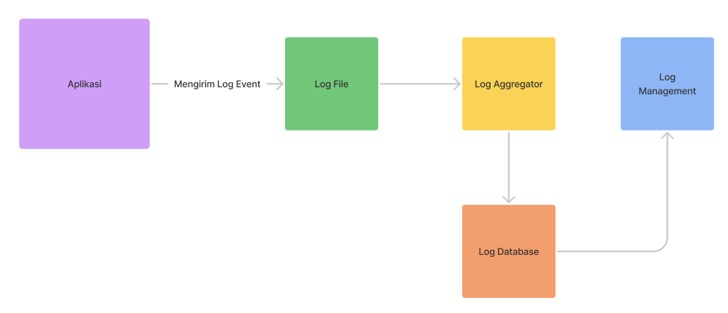

# Golang Logging

## Sebelum Balajar

- Go-Lang Dasar
- Go-Lang Modules
- Go-Lang Unit Test

## Agenda

- Pengenalan Logging
- Logging Library
- Logger
- Level
- Output
- Formatter
- Dan Lain-Lain

## #1 Pengenalan Logging

- Log file adalah file yang berisi informasi kejadian dari sebuah sistem
- Biasanya dalam log file, terdapat informasi waktu kejadian dan pesan kejadian
- Logging adlah aksi menambahkan informasi log ke log
- Logging sudah menjadi standar industri untuk menampilkan informasi yang terjadi di aplikasi yang kita buat
- Logging bukan hanya untuk menampilkan informasi, kadang digunakan untuk proses debugging ketika terjadi masalah di aplikasi kita

### Diagram Logging


### Ekosistem Logging



## #2 Logging Library

### Go-Lang Logging

- Menggunakan Go-Lang sebenarnya kita bisa gunakan package log untuk melakukan logging
- Hanya saja karena fiturnya terbatas, oleh karena itu kebanyakan programmer tidak menggunakannya
- Pada kelas ini kita tidak akan menggunakan package log di Go-Lang untuk belajar Logging

### Logging Library

Banyak sekali library yang bisa kita gunakan untuk logging di Go-Lang, seperti:

- Logrus: <https://github.com/sirupsen/logrus>
- Zap: <https://github.com/uber-go/zap>
- Zerolog: <https://github.com/rs/zerolog>
- Dan masih banyak yang lainnya

### Logrus

- Pada kelas ini kita akan menggunakan Logrus
- Logrus adalah library logging untuk Go-Lang yang saat ini paling populer
- <https://github.com/sirupsen/logrus>

## #3 Membuat Project

```bash
go mod init belajar-golang-logging
```

### Menambah Dependency

```bash
go get github.com/sirupsen/logrus
```

## #4 Logger

- Logger adalah struct utama pada Logrus untuk melakukan logging
- Untuk membuat Logger, kita bisa menggunakan function `New()` pada package logrus
- Dan hasil dari function `New()` adalah sebuah pointer Logger

### Kode: Logger

```go
import (
	"github.com/sirupsen/logrus"
	"testing"
)

func TestLogger(t *testing.T) {
	logger := logrus.New()

	logger.Println("Hello World")
}
```

## #5 Level

- Dalam Logging, hal yang paling penting adalah Level
- Level adalah pnentuan prioritas atau jenis dari sebuah kejadian
- Level itu dimulai dari level terendah sampai level tertinggi
- Logrus mendukung banyak sekali level

| Level | Function         | Keterangan                             |
| ----- | ---------------- | -------------------------------------- |
| Trace | `logger.Trace()` |                                        |
| Debug | `logger.Debug()` |                                        |
| Info  | `logger.Info()`  |                                        |
| Warn  | `logger.Warn()`  |                                        |
| Error | `logger.Error()` |                                        |
| Fatal | `logger.Fatal()` | Memanggil `os.Exit(1) setelah logging` |
| Panic | `logger.Panic()` | Memanggil `panic()` setelah loggin     |

### Kode: Logging

```go
func TestLogging(t *testing.T) {
	logger := logrus.New()

	logger.Trace("Trace")
	logger.Debug("Debug")
	logger.Info("Info")
	logger.Warn("Warn")
	logger.Error("Error")
}
```

### Logging Level

- Kenapa Trace dan Debug tidak keluar di console?
- Karena secara default, Logger Level yang digunakan adalah Info, artinya hanya prioritas Info keatas yang di log
- Untuk mengubah Logging Level, kita bisa gunakan `logger.SetLevel()`

### Kode: Logging Level

```go
func TestLoggerLevel(t *testing.T) {
	logger := logrus.New()
	logger.SetLevel(logrus.TraceLevel)

	logger.Trace("Trace")
	logger.Debug("Debug")
	logger.Info("Info")
	logger.Warn("Warn")
	logger.Error("Error")
}
```

## #6 Output

- Secara default output tujuan log yang kita kirim via Logrus adalah ke Console
- Kadang kita butuh mengubah output tujuan log misal ke File atau Database
- Output Logger adalah `io.Writer`, jadi kita bisa menggunakan `io.Writer` dari Go-Lang atau bisa membuat sendiri mengikuti kontrak `io.Writer`

### Kode: Output

```go
func TestOutput(t *testing.T) {
	logger := logrus.New()

	file, _ := os.OpenFile("application.log", os.O_APPEND|os.O_CREATE|os.O_WRONLY, 0666)
	logger.SetOutput(file)s
	
	logger.Info("Hello World")
}
````

## #7 Formatter

- Saat Logger mengirim data ke Output, log yang kita kirim akan diformat menggunakan object Foramtter
- Logrus secara default memiliki dua formatter:
- `TextFormatter`, yang secara default digunakan
- `JSONFormatter`, yang bis digunakan untuk menformat pesan log menjadi data JSON
- Untuk mengubah formatter, kita bisa gunakan function `logger.SetFormatter()`

### Kode: Formatter

```go
func TestFormatter(t *testing.T) {
	logger := logrus.New()
	logger.SetFormatter(&logrus.JSONFormatter{})
	
	logger.Info("Hello World")
}
```

## #8 Field

- Saat kita mengirim informasi log kadang kita ingin menyisipkan sesuatu pada log tersebut
- Misal saja, kita ingin menyisipkan informasi siapa yang login di log nya
- Cara manual kita bisa menambahkan informasi di message nya, tapi Logrus menyediakan cara yang lebih baik, yaitu menggunakan fitur Field
- Dengan fitur Field, kita bisa menambahkan Field tambahan di informasi Log yang kita kirim
- Sebelum melakukan logging, kita bisa gunakan function logger.WithField() untuk menambahkan Field yang kita inginkan

### Kode: Field

```go
func TestField(t *testing.T) {
	logger := logrus.New()
	logger.SetFormatter(&logrus.JSONFormatter{})

	logger.WithField("username", "Khannedy").Info("Hello World")
	
	logger.WithField("username", "eko")
		.WithField("name", "Eko")
		.Info("Hello World")
}
```

### Fields

- Atau, kita juga bisa langsung memasukkan beberapa Field dengan menggunakan Fields
- Fields adalah alias untuk `map[string]interface{}`
- Caranya kita bisa menggunakan function `logger.WithFields()`

### Kode: Fields

```go
func TestFields(t *testing.T) {
	logger := logrus.New()
	logger.SetFormatter(&logrus.JSONFormatter{})
	
	logger.WithFields(logrus.Fields{
		"username": "eko"	,
		"name": "Eko",
	}).Info("Hello World")
}
```

## #9 Entry

- Entry adalah sebuah Struct representasi dari log yang kita kirim menggunakan Logrus Logger
- Setiap log yang kita kirim, maka akan dibuatkan object Entry
- Contohnya ketika kita membuat Formatter sendiri, maka parameter yang kita dapat untuk melakukan formatting bukanlah string message, malainkan object Entry
- <https://github.com/sirupsen/logrus/blob/master/entry.go>
- Untuk membuat entry, kita bisa menggunakan function `logrus.NewEntry()`

### Kode: Entry

```go
func TestEntry(t *testing.T) {
	logger := logrus.New()
	logger.SetFormatter(&logrus.JSONFormatter{})

	entry := logrus.NewEntry(logger)
	
	entry.WithField("username", "Khannedy")
	entry.Info("Hello World")
```

## #10 Hook

- Hook adalah sebuah Struct yang bisa kita tambahkan ke Logger sebagai callback yang akan dieskekusi terdapat kejadian log untuk level tertentu
- Contohnya musal, ketika ada log error, kita ingin mengirim notifikasi via chat ke programmer, dan lain-lain
- Kita bisa menambahkan Hook ke Logger dengan menggunakan function `logger.AddHook()`
- Dan kita juga bisa menambahkan lebih dari satu Hook ke Logger

### Kode: Membuat Hook

```go
type SimpleHook struct {

}

func (s *SimpleHook) Levels() []logrus.Level {
	return []logrus.Level{logrus.ErrorLevel, logrus.WarnLevel}
}

func (s *SimpleHook) Fire(entry *logrus.Entry) error {
	fmt.Println("Sample Hook", entry.Level, entry.Message)
	return nil
}
```

### Kode: Hook

```go
func TestHook(t *testing.T) {
	logger := logrus.New()
	logger.AddHook(&SampleHook{})
	
	logger.Info("Hello World")
	logger.Warn("Hello World")
	logger.Errorf("Hello World")
```

## #11 Singleton

- Logrus sendiri memiliki singleton object untuk Logger, sehingga kita tidak pelu membuat object Logger sendiri sebenarnya
- Namun artinya, jika kita ubah data Logger tersebut, maka secara otomatis yang menggunakan Logger tersebut akan berubah
- Secara default, Logger singleton uang ada di logrus menggunakan `TextFormatter` dan info Level
- Cara menggunakan Logger singleton ini, kita bisa langsung menggunakan package logrus nya saja

### Kode: Logrus Singleton

```go
func TestSingleton(t *testing.T) {
	logrus.Info("Hello World")
	logrus.Warn("Hello World")

	logrus.SetFormatter(&logrus.JSONFormatter{})


	logrus.Info("Hello World")
	logrus.Errorf("Hello World")
```

## #12 Materi Selanjutnya

- Belajar Framework dan Libray Go-Lang
- Studi Kasus Membuat Aplikasi menggunakan Go-Lang
