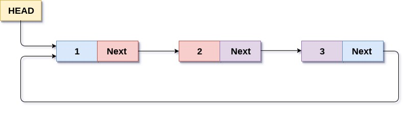

# Golang Standard Library

## Sebelum Belajar

- Go-Lang Dasar

## #1 Standard Library

- Go-Lang selain merupakan bahasa pemrograman, Go-Lang juga menyediakan Standard Libray (package bawaan) tnpa harus menggunakan package di luar buatan orang lain
- Contoh pada Kelas Go-lang Dasar, kita sudah belajar package bernama `fmt` atau `errors`
- Selain package tersebut, sebenarnya masih banyak package lainnya yang bisa kita gunakan
- Pada materi ini, kita akan coba bahasa lebih detail package-package yang terdapat sebagai Standard Library di Go-Lang yang sering digunakan saat kita membuat aplikasi
- <https://pkg.go.dev/std>

## #2 Membuat Project

- Buatlah folder belajar-golang-standard-library
- `go mod init belajar-golang-standard-library`

## #3 Package fmt

- Sebelumnya kita sudah sering menggunakan package `fmt` dengan menggunakan function `Println`
- Selain `Println`, masih banyak function yang terdapat di package `fmt`, contohnya banyak digunakan untuk melakukan format
- <https://pkg.go.dev/fmt>

### Kode: Package fmt

```go
func main() {
	fmt.Println("Hello, World!")

	firstName := "Eko"
	lastName := "Khannedy"

	fmt.Printf("Hello %s %s!\n", firstName, lastName)
}
```

## #4 Package errors

- Sebelumnya kita sudah membahas tentang interface error yang merupakan representasi dari error di Go-Lang, dan membuat error menggunakan function `errors.New()`
- Sebenarnya masih banyak yang bisa kita lakukan menggunakan package errors, contohnya ketika kita ingin membuat beberapa value error yang berbeda
- <https://pkg.go.dev/errors>

### Kode: Membuat Error

```go
var (
	ValidationError = errors.New("validation error")
	NotFoundError = errors.New("not found error")
)
```

### Kode: Menggunakan Error

```go
func GetById(id string) error {
	if id == "" {
		return ValidationError
	}

	if id != "eko" {
		return NotFoundError
	}

	return nil
}
```

### Mengecek Jenis Error

- Misal kita membuat jenis error sendiri, lalu kita ingin mengecek jenis errornya
- Kita bisa menggunakan `errors.Is()` untuk mengecek jenis type error nya

### Kode: Mengecek Jenis Error

```go
func main() {
	err := GetById("")
	if err != nil {
		if errors.Is(err, ValidationError) {
			fmt.Println("validation error")
		} else if errors.Is(err, NotFoundError) {
			fmt.Println("not found error")
		} else {
			fmt.Println("unknown error")
		}
	}
}
```

## #5 Package os

- Go-Lang telah menyediakan banyak sekali package bawaan, salah satunya adalah package `os`
- Package os berisikan fungsionalitas untuk mengakses fitur sistem operasi secara independen (bisa digunakan disemua sistem operasi)
- <https://golang.org/pkg/os/>

### Kode: Program Package os (1)

```go
package main

import (
	"fmt"
	"os"
)

func main() {
	args := os.Args
	fmt.Println(args)
	hostname, err := os.Hostname()
	if err == nil {
		fmt.Println(hostname)
	} else {
		fmt.Println("Error", err.Error())
	}
}
```

## #6 Package flag

- Package flag berisikan fungsionalitas untuk memparsing command line argument
- <https://golang.org/pkg/flag/>

### Kode: Program Package flag

```go
func main() {
	host := flag.String("host", "localhost", "Put your database host")
	username := flag.String("username", "root", "Put your database username")
	password := flag.String("password", "root", "Put your database password")

	flag.Parse()

	fmt.Println(*host, *username, *password)
}
```

## #7 Package strings

- Package strings adalah package yang berisikan function-function untuk memanipulasi tipe data String
- Ada banyak sekali function yang bisa kita gunakan
- <https://golang.org/pkg/strings/>

### Beberapa Function di Package strings

| Function                               | Kegunaan                                         |
| -------------------------------------- | ------------------------------------------------ |
| `strings.Trim(string, outset)`         | Memotong outset di awal dan akhir string         |
| `strings.ToLower(string)`              | Membuat semua karakter string menjadi lower case |
| `strings.ToUpper(string)`              | Membuat semua karakter string menjadi upper case |
| `strings.Split(string, separator)`     | Memotong string berdasaran separator             |
| `strings.Contains(string, search)`     | Mengecek apakah string mengandung string lain    |
| `strings.ReplaceAll(string, from, to)` | Mengubah semua string dari from ke to            |

### Kode: Program Package strings

```go
func main() {
	fmt.Println(strings.Contains("Eko Kurniawan", "Eko"))
	fmt.Println(strings.Split("Eko Kurniawan", " "))
	fmt.Println(strings.ToLower("Eko Kurniawan"))
	fmt.Println(strings.ToUpper("Eko Kurniawan"))
	fmt.Println(strings.Trip("    Eko Kurniawan    ", " "))
	fmt.Println(strings.ReplaceAll("Eko Eko Eko Eko", "Eko", "Budi"))
}
```

## #8 Package strconv

- Sebelumnya kita sudah belajar cara konversi tipe data, misal dari `int32` ke `int34`
- Bagaimana jika kita butuh melakukan konversi yang tipe datanya berbeda? Misal dari int ke string, atau sebaliknya
- Hal tersebut bisa kita lakukan dengan bantuan package `strconv` (string conversion)
- <https://golang.org/pkg/strconv/>

### Beberapa Function di Package strconv

| Function                        | Kegunaan                   |
| ------------------------------- | -------------------------- |
| `strconv.ParseBool(string)`     | Mengubah string ke bool    |
| `strconv.ParseFloat(string)`    | Mengubah string ke float   |
| `strconv.ParseInt(string)`      | Mengubah string ke int64   |
| `strconv.FormatBool(bool)`      | Mengubah bool ke string    |
| `strconv.FormatFloat(float...)` | Mengubah float64 ke string |
| `strconv.FormaatInt(int...)`    | Mengubah int64 ke string   |

### Kode: Program Package strconv

```go
func main() {
	boolean, err := strconv.ParseBool("true")
	if err == nil {
		fmt.Println(boolean)
	} else {
		fmt.Println("Error", err.Error())
	}
}
```

## #9 Package math

- Package math merupakan package yang berisikan constant dan fungsi matematika
- <https://golang.org/pkg/math/>

### Beberapa Funtion di Package math

| Function                     | Kegunaan                                                                 |
| ---------------------------- | ------------------------------------------------------------------------ |
| `math.Round(float64)`        | Membulatkan float64 keatas atau kebawah, sesuai dengan yang paling dekat |
| `math.Floor(float64)`        | Membulatkan float64 kebawah                                              |
| `math.Ceil(float64)`         | Membulatkan float64 keatas                                               |
| `math.Max(float64, float64)` | Mengembalikan nilai float64 paling besar                                 |
| `math.Min(float64, float64)` | Mengembalikan nilai float64 paling kecil                                 |

### Kode: Program Package math

```go
import (
	"fmt"
	"math"
)

func main() {
	fmt.Println(mat.Ceil(1.40))
	fmt.Println(mat.Floor(1.60))
	fmt.Println(mat.Round(1.60))
	fmt.Println(mat.Max(1, 3))
	fmt.Println(mat.Min(1, 3))
}
```

## #10 Package container/list

- Package container/list adalah implementasi struktur data double linked list di Go-Lang
- <https://golang.org/pkg/container/list/>

### Struktur Data Double Linked List


### Kode: Program Package container/list

```go
func main() {
	data := list.New()
	data.PushBack("Eko")
	data.PushBack("Kurniawan")
	data.PushBack("Khannedy")

	for e := data.Front(); e != nil; e = e.Next() {
		fmt.Println(e.Value)
	}
}
```

## #11 Package container/ring

- Package container/ring adalah implementasi struktur data circular list
- Circular list adalah struktur data ring, dimana diakhir element akan kembali ke element awal (HEAD)
- <https://golang.org/pkg/container/ring/>

### Struktur Data Circular List



### Kode: Program Package container/ring

```go
func main() {
	data := ring.New(5)
	for i := 0; i < data.Len(); i++ {
		data.Value = "Value " + strconv.FormatInt(int16(i), 10)
		data = data.Next()
	}

	data.Do(func(value interface{}) {
		fmt.Println(value)
	})
}
```

## #12 Package sort

- Package sort adalah package yang berisikan utilitas untuk proses pengurutan
- Agar data kita bisa diurutkan, kita harus mengimplementasikan kontrak di interface sort.Interface
- <https://golang.org/pkg/sort/>

### sort.Interface

```go
// elements if the collection in enumerated by an integer index.
type Interface interface {
	// Len is the number of elements in the collection.
	Len() int
	// Less reports whether the element with
	// index i should sort before the element with index j.
	Less(i, j int) bool
	// Swap swaps the elements with indexes i and j.
	Swap(i, j int)
}
```

### Kode: Program Package sort

```go
type User struct {
	Name string
	Age  int
}

type UserSlice []User

func (userSlice UserSlice) Len() int {
	return len(userSlice)
}

func (userSlice UserSlice) Less(i, j int) bool {
	return userSlice[i].Age < userSlice[j].Age
}

func (userSlice UserSlice) Swap(i, j int) {
	userSlice[i], userSlice[j] = userSlice[j], userSlice[i]
}

func main() {
	users := []User{
		{"Eko", 30},
		{"Budi", 35},
		{"Joko", 25},
		{"Adi", 253,
	}

	sort.Sort(UserSlice(users))

	fmt.Println(users)
}
```

## #13 Package time

- Package time adalah package yang berisikan fungsionalitas untuk management waktu di Go-Lang
- <https://golang.org/pkg/time/>

### Beberapa Function di Package time

| Function                     | Kegunaan                           |
| ---------------------------- | ---------------------------------- |
| `time.Now()`                 | Untuk mendapatkan waktu saat ini   |
| `time.Date()`                | Untuk membuat waktu                |
| `time.Parse(layout, string)` | Untuk memparsing waktu dari string |

### Kode: Program Package time

```go
func main() {
	now := time.Now()
	fmt.Println(now.Local())

	utc := time.Date(2009, time.November, 10, 24, 0, 0, 0, time.UTC)
	fmt.Println(utc.Local())

	parse, _ := time.Parse(time.RFC3339, "2006-01-02T15:04:05Z")
	fmt.Println(parse)
}
```

- Saat menggunakan tipe data waktu, kadang kita butuh data berupa durasi
- Package tipe memiliki type Duration, yang sebenarnya adalah alias untuk int64
- Namun terdapat banyak method yang bisa kita gunakan untuk memanipulasi Duration

### Kode: Duration

```go
var duration1 time.Duration = time.Second * 200
var duration2 time.Duration = time.Millisecond * 10
var duration3 time.Duration = duration1 - duration2

fmt.Println("duration: %d\n", duration3)
```

## #14 Package reflect

- Dalam bahasa pemrograman, biasanya ada fitur Reflection, dimana kita bisa melihat struktur kode kita pada saat aplikasi sedang berjalan
- Hal ini bisa dilakukan di Go-Lang dengan menggunakan package reflect
- Fitur ini mungkin tidak bisa dibahas secara lengkap dalam satu video, Anda bisa eksplorasi package reflec ini secara otodidak
- Reflection sangat berguna ketika kita ingin membuat library yang general sehingga mudah digunakan
- <https://golang.org/pkg/reflect/>

### Kode: Program Package reflect

```go
type Sample struct {
	Name string
}

func main() {
	sample := Sample{"Eko"}
	sampleType := reflect.TypeOf(sample)
	structField := sampleType.Field(0)

	fmt.Println(structField.Name)
}
```

### Kode: Program StructTag

```go
type Sample struct {
	Name string `required:"true" max:"10"`
}

func main() {
	sample := Sample{"Eko"}
	sampleType := reflect.TypeOf(sample)
	structField := sampleType.Field(0)
	required := sampleType.Tag.Get("required")

	fmt.Println(required)
}
```

### Kode: Program Validation Library

```go
func IsValid(data interface{}) bool {
	t := reflect.TypeOf(data)
	for i := 0; i < t.NumField(); i++ {
		field := t.Field(i)
		if field.Tag.Get("required") == "true" {
			return reflect.ValueOf(data).Field(i).Interface() != ""
		}
	}
	return true
}
```

## #15 Package regexp

- Package regexp adalah utilitas di Go-Lang untuk melakukan pencarian regular expression
- Regular expression di Go-Lang menggunakan library C yang dibuat Google bernama RE2
- <https://github.com/google/re2/wiki/Syntax>
- <https://golang.org/pkg/regexp/>

### Beberapa Function di Package regexp

| Function                            | Kegunaan                                              |
| ----------------------------------- | ----------------------------------------------------- |
| `regexp.MustCompile(string)`        | Membuat Regexp                                        |
| `regexp.MatchString(string) bool`   | Mengecek apakah Regexp match dengan string            |
| `regexp.FindAllString(string, max)` | Mencari string yang match dengan maximum jumlah hasil |

### Kode: Program Package regexp

```go
func main() {
	var regex = regexp.MustCompile(`e([a-z])o`)

	fmt.Println(regex.MatchString("eko"))
	fmt.Println(regex.MatchString("edo"))
	fmt.Println(regex.MatchString("odi"))

	fmt.Println(regex.FindAllString("eko edo egi ega elo eto", 10))
}
```

## #16 Package encoding

- Golang menyediakan package encoding untuk melakukan encode dan decode
- <https://pkg.go.dev/encoding>
- Golang menyediakan berbagai macam algoritma untuk encoding, contoh yang populer adalah base64, csv dan json

### Kode: Base64

```go
func main() {
	var encoded = base64.StdEncoding.EncodeToString([]byte{"Eko Kurniawan Khannedy"})
	fmt.Println(encoded)

	var decoded, err := base64.StdEncoding.DecodeString(encoded)
	if err != nil {
		fmt.Println(err.Error())
	} else {
		fmt.Println(string(decoded))
	}
}
```

### Kode: CSV Reader

```go
func main() {
	csvString := "eko,kurniawan,Khannedy\n" +
		"budi,pratama,pratama\n" +
		"joko,moro,dona"

		reader := csv.NewReader(strings.NewReader(csvString))

		for {
			record, err := reader.Read()
			if err == io.EOF {
				break
			}

			fmt.Println(record)
		}
}
```

### Kode: CSV Writer

```go
writer := csv.NewWriter(os.Stdout)
_ = writer.Write([]string{"eko", "kurniawan", "khannedy"})
_ = writer.Write([]string{"budi", "pratama", "muda"})
_ = writer.Write([]string{"joko", "moro", "dona"})
writer.Flush()
```

## #17 Package Slices

- Di Golang versi terbaru, terdapat fitur bernama Generic, fitur ini akan kita bahas khusus dikelas Golang Generic
- Fitur Generic ini membuat kita bisa membuat parameter dengan tipe yang bisa berubah-ubah, tanpa harus menggunakan interface kosong / any
- Salah satu package yang menggunakan fitur Generic ini adalah package slices
- Package slices ini digunakan untuk memanipulasi data di slice
- <https://pkg.go.dev/slices>

### Kode: Package slices

```go
func main() {
	names := []string{"John", "Paul", "George", "Ringo"}
	values := []int{100, 95, 80, 70}

	fmt.Println(slices.Min(values))
	fmt.Println(slices.Max(values))
	fmt.Println(slices.Contains(names, "Paul"))
	fmt.Println(slices.Index(names, "George"))
}
```

## #18 Package path

- Package path digunakan untuk memanipulasi data path seperti path di URL atau path di File System
- Secara default Package path menggunakan slash sebagai karakter path nya, oleh karena itu cocok untuk data URL
- <https://pkg.go.dev/path>
- Namun jika ingin menggunakan untuk memanipulasi path di File System, karena Windows menggunakan backslash, maka khusus untuk File System, perlu menggunakan pacakge `path/filepath`
- <https://pkg.go.dev/path/filepath>

### Kode: Package path

```go
func main() {
	fmt.Println(path.Dir("hello/world.go"))
	fmt.Println(path.Base("hello/world.go"))
	fmt.Println(path.Ext("hello/world.go"))
	fmt.Println(path.Join("hello", "world", "mein.go"))
}
```

### Kode: Package path/filepath

```go
func main() {
	fmt.Println(filepath.Dir("hello/world.go"))
	fmt.Println(filepath.Base("hello/world.go"))
	fmt.Println(filepath.Ext("hello/world.go"))
	fmt.Println(filepath.IsAbs("hello/world.go"))
	fmt.Println(filepath.IsLocal("hello/world.go"))
	fmt.Println(filepath.Join("hello", "world", "mein.go"))
}
```

## #19 Package io

- IO atau singkatan dari Input Output, merupakan fitur di Golang yang digunakan sebagai standard untuk proses Input Output
- Di Golang, semua mekanisme input output pasti mengikuti standard package `io`
- <https://pkg.go.dev/io>

### Reader

- Untuk membaca input, Golang menggunakan kontrak interface bernama Reader yang terdapat di package `io`

```go
// Implementation must not retain p.
type Reader interface {
	Read(p []byte) (n int, err error)
}
```

### Writer

- Untuk menulis ke output, Golang menggunakan kontrak interface bernama Writer yang terdapat di package `io`

```go
// Implemtation must not retain p.
type Writer interface {
	Write(p []byte) (n int, err error)
}
```

### Implementasi IO

- Penggunaan dari IO sendiri di Golang terdapat dibanyak package, sebelumnya contohnya kita menggunakan CSV Reader dan CSV Writer
- Karena Package IO sebenarnya hanya kontrak untuk IO, untuk implementasinya kita harus lakukan sendiri
- Tapi untungnya, Golang juga menyediakan package untuk mengimplementasikan IO secara mudah, yaitu menggunakan package `bufio`

## #20 Package bufio

- Package bufio atau singkatan dari buffered io
- Package ini digunakan untuk membuat data IO seperti Reader dan Writer
- <https://pkg.go.dev/bufio>

### Kode: Reader

```go
func main() {
	input := strings.NewReader("This is long string\nwith new line\n")

	reader := bufio.NewReader(input)

	for {
		line, _, err := reader.ReadLine()
		if err != nil {
			break
		}
		fmt.Println(string(line))
	}
}
```

### Kode: Writer

```go
writer := bufio.NewWriter(os.Stdout)
writer.WriteString("hello world \n")
writer.WriteString("selamat belajar")
writer.Flush()
```

## #21 File Manipulation

### File Management

- Di package `os`, terdapat File Management, namun sengaja ditunda pembahasannya, karena kita harus tahu dulu tentang IO
- Saat kita membuat atau membaca file menggunakan Package `os`, struct File merupakan implementasi dari `io.Reader` dan `io.Writer`
- Oleh karena itu, kita bisa melakukan baca dan tulis terhadap File tersebut menggunakan Package `io` / `bufio`

### Open File

- Untuk membuat / membaca File, kita bisa menggunakan `os.OpenFile(name, flag, permission)`
- `name` berisikan nama file, bisa absolute atau relative / local
- `flag` merupakan penanda file, apakah untuk membaca, menulis, dan lain-lain
- `permission`, merupakan permission yang diperlukan ketika membuat file, bisa kita simulasikan disini : <https://chmod-calculator.com/>

### File Flag di Package os

```go
// flags mat be implemented on a given system.
const (
	// Exactly one of O_RDONLY, O_WRONLY, ir O_RDWR must be specified.
	O_RDONLY int  = syscall.O_RDONLY // open the file read-only.
	O_WRONLY int  = syscall.O_WRONLY // open the file write-only.
	O_RDWR int  = syscall.O_RDWR // open the file write-write.
	// The remaining values may be or'ed in to control behavior.
	O_APPEND int  = syscall.O_APPEND // append data to the file when writing.
	O_CREATE int  = syscall.O_CREAT // create a new file if none exists.
	O_EXCL int  = syscall.O_EXCL // used with O_CREATE. file must not exist.
	O_SYNC int  = syscall.O_SYNC // open for synchronous I/O.
	O_TRUNC int  = syscall.O_TRUNC // truncate regular writable file when opened.
)
```

### Kode: Membuat File Baru

```go
func createNewFile(name string, message string) error {
	file, err := os.OpenFile(name, os.O_CREATE|os.O_WRONLY, 0666)
	if err != nil {
		return err
	}
	defer file.Close()
	file.WriteString(message)
	return nil
}
```

### Kode: Membaca File

```go
func readFile(name string) (string, error) {
	file, err := os.OpenFile(name, os.O_RDONLY, 0666)
	if err != nil {
		return "", err
	}
	defer file.Close()

	reader := bufio.NewReader(file)
	var message string
	for {
		line, _, err := reader.ReadLine()
		message += string(line)
		if err == io.EOF {
			break
		}
	}
	return message, nil
}
```

### Kode: Membaca dan Menambah ke File

```go
func addToFile(name string, message string) error {
	file, err := os.OpenFile(name, os.O_RDWR|os.O_APPEND, 0666)
	if err != nil {
		return err
	}
	defer file.Close()
	file.WriteString(message)
	return nil
}
```

## #22 Package Lainnya

- Sebenernya masih ada beberapa package lainnya yang tidak akan dibahas dikelas ini
- Hal ini dikarenakan package tersebut terlalu kompleks jika harus dibahas dalam 1 chapter, oleh karena itu package-package berikut akan dibahas di kelas tersendiri, seperti :
- Package Context, Net, Testing, Template, Database, JSON dan Embed

## #23 Materi Selanjutnya

- Go-Lang Modules
- Go-Lang Unit Test
- Go-Lang Goroutine
- Go-Lang Database
- Go-Lang Web
