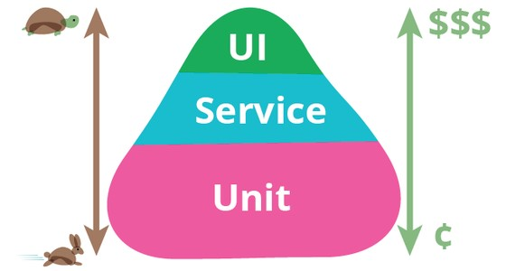

# Golang Unit Test

## Sebelum Belajar

- Go-Lang Dasar
- Go-Lang Modules

## Agenda

- Pengenalan Software Testing
- testing Package
- Unit Test
- Assertion
- Mock, dan
- Benchmark

## #1 Pengenalan Software Testing

- Software testing adalah salah satu disiplin ilmu dalam software engineering
- Tujuan utama dari software testing adalah memastikan kualitas kode dan aplikasi kita baik
- Ilmu untuk software testing sendiri sangatlah luas, pada materi ini kita hanya akan fokus ke unit testing

### Test Pyramid



### Contoh High Level Architecture Aplikasi


### UI Test / End to End Test


### Service Test / Integration Test


### Contoh Internal Architecture Aplikasi


### Unit Test


### Unit Test

- Unit test akan fokus menguji bagian kode program terkecil, biasanya menguji sebuah method
- Unit test biasanya dibuat kecil dan cepat, oleh karena itu biasanya kadang kode unit test lebih banyak dari kode program aslinya, karena semua skenario pengujian akan dicoba di unit test
- Unit test bisa digunakan sebagai cara untuk meningkatkan kualitas kode program kita

## #2 Pengenalan testing Package

- Di bahasa pemrograman lain, biasanya untuk implementasi unit test, kita buth library atau framework khusus untuk unit test
- Berbeda dengan Go-Lang, di Go-Lang sudah ada unit test disediakan sebuah package khusus bernama testing
- Selain itu untuk menjalankan unit test, di Go-Lang juga sudah disediakan perintah nya
- Hal ini membuat implementasi unit testing di golang sangat mudah dibanding dengan bahasa pemrograman yang lain
- <https://golang.org/pkg/testing>

### testing.T

- Go-Lang menyediakan sebuah struct yang bernama testing.T
- Struct ini digunakan untuk unit test di Go-Lang

### testing.M

- testing.M adlah struct yang disediakan Go-Lang untuk mengatur life cycle testing
- Materi ini nanti akan kita bahas di chapter Main

### testing.B

- testing.B adlah struct yang disediakan Go-Lang untuk melakukan benchmarking
- Di Go-Lang untuk melakukan benchmark (mengukur kecepatan kode program) pun sudah disediakan, sehingga kia tidak perlu menggunakan library atau framework tambahan

## #3 Membuat Unit Test

### Kode Hello World Function

```go
package helper

func HelloWorld(name string) string {
	return "Hello " + name
}
```

### Aturan File Test

- Go-Lang memiliki aturan cara membuat file khusus untuk unit test
- Untuk membuat file unit test, kita harus menggunakan akhiran `_test`
- Jadi kita misal kita membuat file `hello_world.go`, artinya untuk membuat unit testnya, kita harus membuat file `hello_world_test.go`

### Aturan Function Unit Test

- Selain aturan nama file, di Go-Lang juga sudah diatur untuk nama function unit test
- Nama function untuk unit test harus diawali dengan nama `Test`
- Misal jika kita ingin mengetes function HelloWorld, make kita akan membuat function unit test dengan nama `TestHelloWorld`
- Tak ada aturan untuk nama belakang function unit test harus sama dengan nama function yang akan di test, yang penting adalah harus diawali dengan kata `Test`
- Selanjutnya harus memiliki parameter `(t *testing.T)` dan tidak mengembalikan return value

### Kode: Hello World Unit Test

```go
package helper

import "testing"

func TestHelloWorld(t *testing.T) {
	result := HelloWorld("Eko")
	if result != "Hello Eko" {
		// unit test failed
		panic("Result is not Hello Eko")
	}
}
```

### Menjalankan Unit Test

- Untuk menjalankan unit test kita bisa menggunakan perintah:
- `go test`
- Jika kita ingin lihat lebih detail function test apa saja yang sudah di running, kita bisa gunakan perintah:
- `go test -v`
- Dan jika kita ingin memilih function unit test mana yang ingin di running, kita bisa gunakan perintah:
- `go test -v -run=TestNamaFunction`

### Menjalankan Semua Unit Test

- Jika kita ingin menjalankan semua unit test dari top folder module nya, kita bisa gunakan perintah:
- `go test ./...`

## #4 Menggagalkan Unit Test

- Menggagalkan unit test menggunakan panic bukanlah hal yang bagus
- Go-Lang sendiri sudah menyediakan cara untuk menggagalkan unit test menggunakan `testing.T`
- Terdapat function `Fail()`, `FailNow()`, `Error()`, dan `Fatal()` jika kita ingin menggagalkan unit test

### `t.Fail()` dan `t.FailNow()`

- Terdapat dua function untuk menggagalkan unit test, yaitu `Fail()` dan `FailNow()`. Lantas apa bedanya?
- `Fail()` akan menggagalkan unit test, namun tetap melanjutkan eksekusi unit test. Namun diakhir ketika selesai, maka unit test tersebut dianggap gagal
- `FailNow()` akan menggagalkan unit test saat ini juga, tanpa melanjutkan eksekusi unit test

### `t.Error(args...)` dan `t.Fatal(args...)`

- Selain `Fail()` dan `FailNow()`, ada juga `Error()` dan `Fatal()`
- `Error()` function lebih seperti melakukan log (print) error, namun setelah melakukan log error, dia akan secara otomatis memanggil function `Fail()`, sehingga mengakibatkan unit test dianggap gagal
- Namun karena hanya memanggil `Fail()`, artinya eksekusi unit test akan tetap berjalan sampai selesai
- `Fatal()` mirip dengan `Error()`, hanya saja, setelah melakukan log error, dia akan memanggil `FailNow()`, sehingga mengakibatkan eksekusi unit test berhenti

### Kode: Error

```go
func TestHelloWorld(t *testing.T) {
	result := HelloWorld("Eko")
	if result != "Hello Eko" {
		t.Fatal("Result is not Hello Eko")
	}

	fmt.Println("Tidak Dieksekusi")
}
```

## #5 Assertion

- Melakukan pengecekan di unit test secara manial menggunakan if else sangatlah menyebalkan
- Apalagi just result data yang di cek itu banyak
- Oleh karena itu, sangat disarankan untuk menggunakan Assertion untuk melakukan pengecekan
- Sayangnya, Go-Lang tidak menyediakan package untuk assertion, sehingga kita butuh menambahkan library untuk melakukan assertion ini

### Testify

- Salah satu library assertion yang paling populer di Go-Lang adalah Testify
- Kita bisa menggunakan library ini untuk melakukan assertion terhadap result data di unit test
- <https://github.com/stretchr/testify>
- Kita bisa menambahkan di Go module kita:
- `go get https://github.com/stretchr/testify`

### Kode: Assertion

```go
import (
	"fmt"
	"github.com/stretchr/testify/assert"
	"testing"
)

func TestHelloWorld(t *testing.T) {
	result := HelloWorld("Eko")
	assert.Equal(t, "Hello Eko", result)
	fmt.Println("Dieksekusi")
}
```

### `assert` vs `require`

- Testify menyediakan dua package untuk assertion, yaitu `assert` dan `require`
- Saat kita menggunakan `assert`, jika pengecekan gagal, maka `assert` akan memanggil `Fail()`, artinya eksekusi unit test akan tetap dilanjutkan
- Sedangkan jita kita menggunakan `require`, jika pengecekan gagal, maka `require` akan memanggil `FailNow()`, artinya eksekusi unit test tidak akan dilanjutkan

### Kode: Require

```go
import (
	"fmt"
	"github.com/stretchr/testify/require"
	"testing"
)

func TestHelloWorld(t *testing.T) {
	result := HelloWorld("Eko")
	require.Equal(t, "Hello Eko", result)
	fmt.Println("Tidak Dieksekusi")
}
```

## #6 Skip Test

- Kadang dalam keaddan tertentu, kita ingi membatalkan eksekusi unit test
- Di Go-Lang juga kita bisa membatalkan eksekusi unit test jika kita mau
- Untuk membatalkan unit test kita bisa menggunakan function `Skip()`

### Kode : Skip Test

```go
import (
	"fmt"
	"github.com/stretchr/testify/require"
	"runtime"
	"testing"
)

func TestSkip(t *testing.T) {
	if runtime.GOOS == "darwin" {
		t.Skip("Unit test tidak bisa jalan di Mac")
	}

	result := HelloWorld("Eko")
	require.Equal(t, "Hello Eko", result)
}
```

## #7 Before dan After Test

- Biasanya dalam unit test, kadang kita ingin melakukan sesuatu sebelum dan setelah sebuah unit test dieksekusi
- Jikalau kode yang kita lakukan sebelum dan setelah selalu sama anter unit test function, maka membuat manual di unit test function nya adalah hal yang membosankan dan terlalu banyak kode duplikat jadinya
- Untungnya di Go-Lang terdapat fitur yang bernama `testing.M`
- Fitur ini bernama Main, dimana digunakan untuk mengatur eksekusi unit test, namun hal ini juga bisa kita gunakan untuk melakukan Before dan After dari unit test

### `testing.M`

- Untuk mengatur eksekusi unit test, kita cukup membuat sebuah function bernama TestMain dengan parameter testing.M
- Jika terdapat function TestMain tersebut, maka secara otomatis Go-Lang akan mengeksekusi function ini tiap kali akan menjalankan unit test di sebuah package
- Dengan ini kita bisa mengatur Before dan After unit test sesuai dengan yang kita mau
- Ingat, function TestMain itu dieksekusi hanya sekali per Go-Lang package, bukan per tiap function unit test

### Kode: TestMain

```go
func TestMain(m *testing.M) {
	fmt.Println("Sebelum Unit Test")

	m.Run() // eksekusi semua unit test

	fmt.Println("Setelah Unit test")
}
```

## #8 Sub Test

- Go-Lang mendukung fitur pembuatan function unit test di dalam function unit test
- Fitur ini memang sedikit aneh dan jarang sekali dimiliki di unit test di bahasa pemrograman yang lainnya
- Untuk membuat sub test, kita bisa menggunakan function `Run()`

### Kode: Membuat Sub Test

```go
func TestSubTest(t *testing.T) {
	t.Run("Eko", func(t *testing.T) {
		result := HelloWorld("Eko")
		require.Equal(t, "Hello Eko", result)
	})
	t.Run("Kurniawan", func(t *testing.T) {
		result := HelloWorld("Kurniawan")
		require.Equal(t, "Hello Kurniawan", result)
	})
}
```

### Menjalankan Hanya Sub Test

- Kita sudah tahu jika kita menjalankan sebuah test unit test function, kita bisa gunakan perintah
- `go test -run TestNameFunction`
- Jika kita ingin menjalankan hanya salah satu sub test, kita bisa gunakan perintah:
- `go test -run TestNameFunction/NamaSubTest`
- Atau untuk semua test semua sub test di semua function, kita bisa gunakan perintah:
- `go test -run /NamaSubTest`

## #8 Table Test

- Sebelumnya kita sudah belajar tentang sub test
- Jika diperhatikan, sebenarnya dengan sub test, kita bisa membuat test secara dinamis
- Dan fitur sub test ini, biasa digunakan oleh programmer Go-Lang untuk membuat test dengan konsep table test
- Table test yaitu dimana kita menyediakan data berupa slice yang berisi parameter dan ekspektasi hasil dari unit test
- Lalu slice tersebut kita iterasi menggunakan sub test

### Kode: Table Test

```go
func TestHelloWorldTable(t *testing.T) {
	tests := []struct{
		name string
		request string
		expected string
	} {
			{
				name: "HelloWorld(Eko)",
				request: "Eko",
				expected: "Hello Eko",
			},
			{
				name: "HelloWorld(Kurniawan)",
				request: "Kurniawan",
				expected: "Hello Kurniawan",
			},
	}

	for _, test := range tests {
		t.Run(test.name, func(t *testing.T) {
			result := HelloWorld(test.request)
			require.Equal(t, test.expected, result)
		})
	}
}
```

## #9 Mock

- Mock adalah object yang sudah kita program dengan ekspektasi tertentu sehingga ketika dipanggil, dia akan menghasilkan data yang sudah kita program diawal
- Mock adalah salah satu teknik dalam unit testing, dimaan kita bisa membuat mock object dari suatu object yang memang sulit untuk di testing
- Misal kita ingin membuat unit test, namun ternyata ada kode program kita yang harus memanggil API Call ke third party service. Hal ini sangat sulit untuk di test, karena unit testing kita harus selalu memanggil third party service, dan belum tentu response nya sesuai dengan apa yang kita mau
- Pada kasus seperti ini, cocok sekali untuk menggunakan mock object

### Testify Mock

- Untuk membuat mock object, tidak ada fitur bawaan Go-Lang, namun kita bisa menggunakan library testify yang sebelumnya kita gunakan untuk assertion
- Testify mendukung pembuatan mock object, sehingga cocok untuk kita gunakan ketika ingin membuat mock object
- Namun, perlu diperhatikan, jika desain kode program kita jelek, akan sulit untuk melakukan mocking, jadi pastikan kita melakukan pembuatan desain kode program kita dengan baik
- Mari kita buat contoh kasus

### Aplikasi Query ke Database

- Kita akan coba contoh kasus dengan membuat contoh aplikasi golang yang melakukan query ke database
- Dimana kita akan buat layer Service sebagai business logic, dan layer Repository sebagai jembatan ke database
- Agar kode kita mudah untuk di test, disarankan agar membuat kontrak berupa interface

### Kode: Category Entity

```go
package entity

type Category struct {
	Id 	 string
	Name string
}
```

### Kode: Category Repository

```go
package repository

import "belajar-golang-unit-test/entity"

type CategoryRepository interface {
	FindById(id string) *entity.Category
}
```

### Kode: Category Service

```go
type CategoryService struct {
	Repository repository.CategoryRepository
}

type (service CategoryService) Get(id string) (*entity.Category, error) {
	category := service.Repository.FindById(id)
	if category == nil {
		return nil, errors.New("Category Not Found")
	}
	return category, nil
}
```

### Kode: Category Repository Mock

```go
type CategoryRepositoryMock struct {
	Mock mock.Mock
}

func (repository *CategoryRepositoryMock) FindById(id string) *entity.Category {
	arguments := repository.Mock.Called(id)
	if arguments.Get(0) == nil {
		return nil
	}
	category := arguments.Get(0).(entity.Category)
	return &category
}
```

### Kode: Category Service Unit Test (1)

```go
var categoryRepository = &repository.CategoryRepositoryMock{Mock: mock.Mock{}}
var categoryService = CategoryService{Repository: categoryRepository}

func TestCategoryService_GetNotFound(t *testing.T) {
	categoryRepository.Mock.On("FindById", "1").Return(nil)
	category, err := categoryService.Get("1")
	assert.NotNil(t, err)
	assert.Nil(t, category)
}
```

### Kode: Category Service Unit Test (2)

```go
func TestCategoryService_GetFound(t *testing.T) {
	category := entity.Category{
		Id: "2"
		Name: "Handphone",
	}
	categoryRepository.Mock.On("FindById", "2").Return(category)
	result, err := categoryService.Get("2")
	assert.NotNil(t, err)
	assert.NotNil(t, category)
	assert.Equal(t, category.Id, result.Id)
	assert.Equal(t, category.Name, result.Name)
}
```

## #10 Benchmark

- Selain unit test, Go-Lang testing package juga mendukung melakukan benchmark
- Benchmark adalah mekanisme menghitung kecepatan performa kode aplikasi kita
- Benchmark di Go-Lang dilakukan dengan cara secara otomatis melakukan iterasi kode yang kita panggil berkali-kali sampai waktu tertentu
- Kita tidak perlu menentukan jumlah iterasi dan lamanya, karena itu sudah diatur oleh `testing.B` bawaan dari testing package

### `testing.B`

- `testing.B` adalah struct yang digunakan untuk melakukan benchmark
- `testing.B` mirip dengan `testing.T`, terdapan function `Fail()`, `FailNow()`, `Error()`, `Fatal()` dan lain-lain
- Yang membedakan ada beberapa attribute dan function tambahan yang digunakan untuk melakukan bechmark
- Salah satunya adalah attribute `N`, ini digunakan untuk melakukan total iterasi sebuah bechmark

### Cara Kerja Benchmark

- Cara kerja benchmark di Go-Lang sangat sederhana
- Gimana kita hanya perlu membuat perulangan sejumlah `N` attribute
- Nanti secara otomatis Go-Lang akan melakukan eksekusi sejumlah perulangan yang ditentukan secara otomatis, lalu menditeksi beberapa lama proses tersebut berjalan, dan disimpulkan performa benchmark nya dalam waktu

## #11 Membuat Benchmark

- Mirip seperti unit test, untuk benchmark pun, di Go-Lang sudah ditentukan nama function nya, harus diawali kata Benchmark, misal BenchmarkHelloWorld, BenchmarkXxx
- Selain itu, harus memiliki parameter `(b *testing.B)`
- Dan tidak boleh mengembalikan return value
- Untuk nama file benchmark, sama seperti unit test, diakhiri dengan `_test` misal `hello_world_test.go`

### Kode: Membuat Benchmark Function

```go
func BenchmarkHelloWorld(b *testing.B) {
	for i := 0; i < b.N; i++ {
		HelloWorld("Eko")
	}
}
```

### Menjalankan Benchmark

- Untuk menjalankan seluruh benchmark di module, kita bisa menggunakan perintah sama seperti test, namun ditambahkan parameter bench:
- `go test -v -bench=.`
- Jika kita hanya ingin menjalankan benchmark tanpa unit test, kita bisa gunakan perintah:
- `go test -v -run=NotMathUnitTest -bench=.`
- Kode diatas selain menjalankan benchmark, akan menjalankan unit test juga, jika kita hanya ingin menjalankan benchmark tertentu, kita bis gunakan perintah:
- `go test -v -run=NotMathUnitTest -bench=BenchmarkTest`
- Jika kita menjalankan benchmark di root module dan ingin semua module dijalankan, kita bisa gunakan perintah:
- `go test -v -bench=. ./...`

## #12 Sub Benchmark

- Sama seperti `testing.T`, di `testing.B` juga kita bisa membuat sub benchmark menggunakan function `Run()`

### Kode: Membuat Sub Benchmark

```go
func BenchmarkHelloWorldSub(b *testing.B) {
	t.Run("Eko", func(b *testing.B) {
		for i := 0; i < b.N; i++ {
			HelloWorld("Eko")
		}
	})
	t.Run("Kurniawan", func(b *testing.B) {
		for i := 0; i < b.N; i++ {
			HelloWorld("Kurniawan")
		}
	})
}
```

### Menjalankan Hanya Sub Benchmark

- Saat kita menjalankan benchmark function, maka semua sub benchmark akan berjalan
- Namun jika kita ingin menjalankan salah satu sub benchmark saja, kita bisa gunakan perintah:
- `go test -v -bench=BenchmarkNama/NamaSub`

## #13 Table Benchmark

- Sama seperti unit test, programmer Go-Lang terbiasa membuat table benchmark juga
- Inin digunakan agar kita bisa mudah melakukan performance test dengan kombinasi data berbeda-beda tanpa harus membuat banyak benchmark function

### Kode: Membuat Benchmark Table

```go
func BenchmarkHelloWorldTable(t *testing.B) {
	benchmarks := []struct{
		name string
		request string
	} {
			{
				name: "Eko",
				request: "Eko",
			},
			{
				name: "Kurniawan",
				request: "Kurniawan",
			},
	}

	for _, benchmark := range benchmarks {
		t.Run(benchmark.name, func(b *testing.B) {
			for i := 0; i < b.N; i++ {
				HelloWorld(benchmark.name)
			}
		})
	}
}
```

## #14 Materi Selanjutnya

- Go-Lang Goroutines
- Go-Lang Database
- Go-Lang Web
