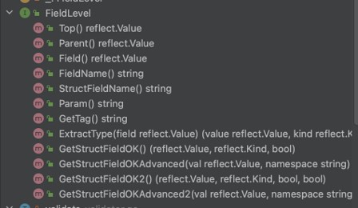

# Golang Validation

## Sebelum Belajar

- Golang Dasar
- Golang Modules
- Golang Unit Test

## Agenda

- Pengenalan Validation
- Validation Library
- Melakukan Validation
- Variable Validation
- Struct Validation
- Validation Error
- Dan lain-lain

## #1 Pengenalan Validation

- Saat kita membuat aplikasi, validasi adalah salah satu hal yang selalu dibuat
- Validasi dilakukan untuk memastikan bahwa data yang diproses sudah benar
- Validasi adalah sesuatu yang wajib dilakukan saat pembuatan aplikasi, agar kesalahan pada data bisa ditemukan secepat mungkin sebelum data tersebut di proses

### Tempat Melakukan Validasi

- Validasi sering dilakukan di banyak bagian dalam aplikasi, seperti
- Web, validasi request dari pengguna
- Business Logic, validasi data
- Database, validasi constraint
- Beberapa bagian, kadang menggunakan validasi yang sama. Oleh karena itu pembuatan validasi secara manual sangat memakan waktu, dan kesalahan sedikit bisa menyebabkan validasi tidak konsisten

### Kenapa Butuh Validasi?

- Sederhana, untuk memastikan request atau data yang dikirim oleh pengguna sudah sesuai dengan yang kita inginkan
- Never trust user input

## #2 Validator Package

### Manual Validation

- Saat kita melakukan validasi, biasanya kita akan melakukan validasi secara manual
- Rata-rata, validasi manual akan menggunakan if statement
- Semakin banyak validasi yang diperlukan, semakin banyak if statement yang harus dibuat

### Validation Library

- Penggunaan library untuk melakukan validasi sangat direkomendasikan
- Hal ini agar kode validasi bisa lebih mudah, rapi dan juga sama antar programmer
- Ada banyak sekali library yang bisa kita gunakan untuk mempermudah dalam pembuatan validasi di kode program kita
- Salah satunya, yang akan kita gunakan di kelas ini adalah `Validator Package`

### Validator Package

- Salah satu library yang banyak digunakan untuk membantu melakukan validation adalah `Validator Package`
- Validator Package adalah opensource library untuk melakukan validation di golang
- Validator Package memiliki banyak sekali fitur yang bisa kita gunakan untuk mempermudah kita melakukan validasi
- <https://github.com/go-playground/validator>

## #3 Membuat Project

- Buat folder belajar-golang-validation
- Buat sebagai Go Module :
- `go mod init github.com/ProgrammerZamanNow/belajar-golang-validation`
- Tambahkan library Validator Package :
- `go get github.com/go-playground/validator/v10`

## #4 Validate Struct

- Validator Package di desain agar thread safe dan digunakan sebagai object singleton (cukup buat satu object saja)
- Validator Package akan melakukan cache informasi seperti rules, tags, dan lain-lain yang berhubungan dengan validation kita
- Cache adalah menyimpan informasi di memory, sehingga bisa digunakan lagi tanpa harus melakukan eksekusi kode program lagi, hal ini akan mempercepat proses
- Jika kita selalu membuat object baru, maka keuntungan cache tidak bisa didapatkan
- Package Validator merepresentasikan object untuk validation nya dalam struct bernama Validate di package validator

### Kode: Membuat Validate Struct

```go
import (
	"testing"
	"github/go-playground/validator/v10"
)

func TestValidation(t *testing.T) {
	var validate *validator.Validate = validator.New()
	if validate == nil {
		t.Error("Validate is nil")
	}
}
```

## #5 Validasi Variable

- Sekarang kita akan coba melakukan validasi terhadap variable menggunakan Validator Package
- Saat kita melakukan validasi, biasanya kita akan melakukan validasi terhadap variable yang tersedia, baik itu variable yang terdapat di Struct atau function parameter
- Untuk melakukan validasi variable, kita bisa gunakan method :
  - `Validate.Var(variable, tag)`
  - `Validate.VarCtx(ctx, variable, tag)`

### Validator Tag

- Validator Package menggunakan konsep Tag untuk menyebutkan validation yang ingin digunakan
- Setiap jenis validation, memiliki nama tag masing-masing, kita akan bahas di materi khusus untuk ini
- Contoh validasi bahwa sebuah value harus ada isinya, bukan default value, misal kita bisa gunakan tag `"required"`, jika number pastikan bukan default number 0, dan jika string bukan default string `""`, dan jika `array/slice`, bukan default `array/slice` kosong

### Kode: Validasi Variable

```go
func TestValidationField(t *testing.T) {
	validate := validator.New()
	var user string = ""

	err := validate.Var(user, "required")

	if err != nil {
		fmt.Println(err.Error())
	}
}
```

## #6 Validasi Dua Variable

- Kadang, ada kasus dimana kita ingin melakukan validasi untuk membandingkan dua buah variable
- Misal kita mau memastikan variable `password` dan `confirmPassword` harus sama, kita bisa gunakan tag eqfield
- Untuk melakukan validasi dua variable, kita bisa gunakan method :
  - `Validate.VarWithValue(first, second, tag)`
  - `Validate.VarWithValueCtx(ctx, first, second, tag)`

### Kode: Validasi Dua Variable

```go
func TestValidationTwoVariables(t *testing.T) {
	validate := validator.New()

	password := "rahasia"
	confirmPssword := "salah"

	err := validate.VarWithValue(password, confirmPssword, "eqfield")
	if err != nil {
		fmt.Println(err.Error())
	}
}
```

## #7 Baked-in Validations

- Validator Package sudah menyediakan banyak sekali validation yang biasanya kita butuhkan, dari yang sederhana seperti required (string tidak boleh kosong), email (format data harus email), dan lain-lain
- Ada banyak sekali Baked-in Validation yang sudah tersedia, dan kita hanya perlu menggunakan nama tag nya saja
- <https://pkg.go.dev/github.com/go-playground/validator/v10#readme-baked-in-validations>

## #8 Multiple Tag Validation

- Tag pada validation bisa lebih dari satu, kita bisa tambahkan `,` (koma) dan diikuti dengan tag selanjutnya

### Kode: Multiple Tag Validation

```go
func TestMultipleTag(t *testing.T) {
	validate := validator.New()
	var user string = "eko1234"

	err := validate.Var(user, "required,numeric")
	if err != nil {
		fmt.Println(err.Error())
	}
}
```

## #9 Tag Parameter

- Validator Package, mendukung penggunaan parameter ketika menggunakan tag
- Ini sangat berguna pada kasus validasi yang memang butuh data parameter, contohnya min, max, length, dan lain-lain
- Untuk menggunakan parameter, kita bisa langsung menggunakan tanda `=` (sama dengan) setelah tag, dan diikuti dengan nilai parameter nya

### Kode: Tag Parameter

```go
func TestTagParameter(t *testing.T) {
	validate := validator.New()
	user := "99"

	err := validate.Var(user, "required,numeric,min=5,max=10")
	if err != nil {
		fmt.Println(err.Error())
	}
}
```

## #10 Validasi Struct

- Selain melakukan validasi variable, Validator Package juga bisa digunakan untuk melakukan validasi terhadap struct
- Dengan begitu, kita bisa langsung melakukan validasi terhadap semua field yang terdapat di Struct tersebut
- Tag untuk validasi, bisa kita tambahkan dengan menambah reflection tag di Struct field-nya dengan tag validate

### Kode: Struct

```go
type LoginRequest struct {
	Username string `validate:"required,email"`
	Password string `validate:"required,min=5"`
}
```

### Kode: Validasi Struct

```go
validate := validator.New()
loginRequest := LoginRequest{
	Username: "eko",
	Password: "eko",
}

err := validate.Struct(loginRequest)
if err != nil {
	fmt.Println(err.Error())
}
```

## #11 Validation Errros

### Error

- Saat kita melakukan validasi, Validator Package akan mengembalikan data error
- Jika error tersebut bernilai nil, artinya semua data valid, tidak terjadi validation error
- Namun jika tidak nill, artinya terdapat data yang error

### Validation Errors

- Kita tahu bahwa error adalah kontrak interface dari golang untuk membuat error
- Validator Package sendiri sebenarnya memiliki detail struct untuk implementasi error ini, yaitu `ValidationErrors`
- Kita bisa melakukan konversi ke ValidationErrors ketika terjadi validation error
- Terdapat banyak sekali informasi yang bisa kita ambil dari `ValidationErrors`
- ValidationErrors sendiri sebenarnya adalah alias untuk `[]FieldError`

### Kode: Validation Error

```go
err := validate.Struct(loginRequest)
if err != nil {
	validateErrors := err.(validator.ValidationErrors)
	for _, fieldError := range validateErrors {
		fmt.Println("error", fieldError.Field(), "on tag", fieldError.Tag(), "with error", fieldError.Error())
	}
}
```

### Validasi Cross Field

- Sebelumnya kita sudah tahu Validator Package memiliki validation khusus untuk validasi dua variable
- Validation tersebut juga bisa digunakan untuk validasi cross Field jika di dalam Struct
- Caranya kita bisa menggunakan validation tag yang sama, namun perlu sebutkan field kedua-nya
- Misal pada Field Password, kita bisa tambahkan `validate:eqfield=ConfirmPassword`

### Kode: Validasi Cross Field

```go
type RegisterUser struct {
	Username 				string `validate:"required,email"`
	Password 				string `validate:"required,emailmin=5"`
	ConfirmPassword string `validate:"required,emailmin=5,eqfield=Password"`
}
```

### Validasi Nested Struct

- Secara default, saat kita membuat Struct yang berisikan Field Struct lainnya
- Validator Package akan melakukan validasi terhadap Field Struct tersebut secara otomatis

### Kode: Validasi Nested Struct

```go
type Address struct {
	City 		string `validate:"required"`
	Country string `validate:"required"`
}

type User struct {
	Id 			string `validate:"required"`
	Name 		string `validate:"required"`
	Address Address `validate:"required"`
}
```

### Validasi Collection

- Tidak seperti tipe data Struct, jika kita memiliki field dengan tipe data Collection seperti Array, Slice atau Map, secara default Validator -Package tidak akan melakukan validasi terhadap data-data yang terdapat di dalam collection tersebut
- Namun, jika kita ingin melakukan validasi semua data yang terdapat di Collection-nya, kita bisa tambahkan tag `dive`

### Kode: Validasi Collection

```go
type Address struct {
	City 		string `validate:"required"`
	Country string `validate:"required"`
}

type User struct {
	Id 			string `validate:"required"`
	Name 		string `validate:"required"`
	Address []Address `validate:"required,dive"`
}
```

## #12 Validasi Basic Collection

- Bagaimana jika data Collection nya adalah tipe data yang bukan Struct, misal `[]String?`
- Pada kasus seperti ini, kita bisa tambahkan validation nya langsung setelah menambahkan tag dive
- Misal pada field Hobbies []String, kita bisa tambahkan tag dive,required,min=1, artinya tiap String di `[]String` harus `required` dan `min=1`

### Kode: Basic Collection

```go
type Address struct {
	City 		string `validate:"required"`
	Country string `validate:"required"`
}

type User struct {
	Id 			string `validate:"required"`
	Name 		string `validate:"required"`
	Address []Address `validate:"required,dive"`
	Hobbies []string `validate:"dive,required,min=1"`
}
```

## #13 Validasi Map

- Selain Collection Array/Slice, kita juga bisa melakukan validasi terhadap Field `Map`
- Karena dalam Map terdapat Key dan Value, kita bisa menggunakan `dive` untuk key dan `dive` untuk value
- Namun khusus untuk key, kita harus tandai dengan tag `keys` dan diakhiri dengan `endkeys`

### Kode: Validasi Map

```go
type School struct {
	Name string `validate:"required"`
}

type User struct {
	Id 			string `validate:"required"`
	Name 		string `validate:"required"`
	Address []Address `validate:"required,dive"`
	Hobbies []string `validate:"dive,required,min=1"`
	Schools map[string]School `validate:"dive,keys,required,min=2,endKeys,dive"`
}
```

## #14 Validasi Basic Map

### Basic Map

- Kadang, kita juga sering membuat tipe data Map dengan key dan value berupa tipe data bukan Struct
- Pada kasus ini, jika kita ingin menambah validasi, caranya sama seperti pada Basic Collection, namun khusus untuk `key`, perlu ditambahkan `keys` dan `endkeys`
- Field Wallet `map[string]int` dengan tag `dive,keys,required,endkeys,required,gt=0`, artinya key string `required`, dan value `required` dan `gt=0`
- Karena value bukanlah Struct, jadi kita tidak perlu menambahkan `dive` lagi pada value

### Kode: Basic Map

```go
type User struct {
	Id 			string `validate:"required"`
	Name 		string `validate:"required"`
	Address []Address `validate:"required,dive"`
	Hobbies []string `validate:"dive,required,min=1"`
	Schools map[string]School `validate:"dive,keys,required,min=2,endKeys,dive"`
	Wallet map[string]int `validate:"dive,keys,required,endKeys,required,gt=0"`
}
```

## #15 Alias Tag

- Pada beberapa kasus, kadang kita sering menggunakan beberapa tag validation yang sama untuk Field yang berbeda
- Validator Package memiliki fitur untuk menambahkan alias, yaitu nama tag baru untuk tag lain, bisa satu atau lebih tag lain
- Kita bisa meregistrasikan alias tag baru dengan menggunakan method :
- `Validate.RegisterAlias(alias, tag)`

### Kode: Alias Tag

```go
validate := validator.New()
validate.RegisterAlias("varchar", "required,max=255")

type Seller struct {
	Id 		 string `validate:"varchar"`
	Name 	 string `validate:"varchar"`
	Owner  string `validate:"varchar"`
	Slogan string `validate:"varchar"`
}
```

## #16 Custom Validation

- Bagaimana jika ternyata validation yang kita butuhkan tidak tersedia di baked-in Validator Package?
- Tenang saja, kita bisa membuat Custom Validation sendiri, dengan membuat function dengan parameter `validator.FieldLevel`, lalu registrasikan ke Validate menggunakan :
- `Validate.RegisterValidation(tag, function)`

### FieldLevel

- FieldLevel merupakan parameter dari Validation Function yang kita buat
- FieldLevel berisikan informasi Reflection seperti Field Value, Name dan lain-lain



### Kode: Username Validation Function

```go
func MustValidUsername(field validator.FieldLevel) bool {
	vaue, ok := field.Field().Interface().(string)
	if ok {
		if value != strings.ToUpper(value) {
			return false
		}
		if len(value) < 5 {
			return false
		}
	}
	return true
}
```

### Kode: Custom Validation

```go
func TestCustomValidation(t *testing.T) {
	validate := validator.New()
	validate.RegisterValidation("username", MustValidUsername)

	type LoginRequest struct {
		Username string `validate:"required,username"`
		Password string `validate:"required"`
	}
}
```

## #17 Custom Validation Parameter

- Di Baked-in Validation, beberapa validation memiliki parameter, misal `min=10`
- Kita juga mengambil informasi nilai parameter nya di `FieldLevel.Param()`
- Ini sangat cocok ketika kita membuat Validation yang memang membutuhkan parameter tambahan

### Kode: Pin Validation

```go
var regexNumber = regexp.MustCompile(`^[0-9]+$`)

func MustValidPin(field validator.FieldLevel) bool {
	length, err := strconv.Atoi(field.Param())
	if err != nil {
		panic(err)
	}

	value := field.Field().String()
	if !regexNumber.MatchString(value) {
		return false
	}

	return len(value) == length
}
```

### Kode: Custom Validation Parameter

```go
validate := validator.New()
validate.RegisterValidation("pin", MustValidPin)

type Login struct {
	Phone string `validate:"required,number"`
	Pin 	string `validate:"required,pin=6"`
}
```

## #18 Or Rule

- Pada beberapa kasus, kadang kita ingin membuat kondisi `OR` pada validation
- Misal sebuah Field boleh email atau nomor telepon misalnya, artinya validasinya tidak bisa `email,numeric`
- Karena jika seperti itu, artinya Field wajib Email dan Numeric, sedangkan dua hal itu pasti berbeda
- Pada kasus ini, kita bisa gunakan `|` (pipe) sebagai pemisah untuk menandakan bahwa itu adalah OR
- Secara default, ketika menggunakan `,` (koma) artinya adalah `AND`

### Kode: Or Rule

```go
type Login struct {
	Username string `validate:"required,email|numeric"`
	Password string `validate:"required"`
}
```

## #19 Custom Validation Cross Field

- Saat membuat custom validation, parameter FieldLevel juga bisa digunakan untuk mendapatkan value kedua secara langsung dari Struct
- Kita bisa menggunakan method `FieldLevel.GetStructFieldOK2()`
- Method `GetStructFieldOK2()` secara otomatis akan menggunakan Param sebagai nama Field di Struct nya
- Misal ketika kita gunakan tag `xxx=Yyy`, maka `GetStructFieldOK2()` akan mengembalikan Field Yyy didalam Struct nya

### Kode: Equals Ignore Case Function

```go
func MustEqualsIgnoreCase(field validator.FieldLevel) bool {
	value, _, _, ok := field.GetStructFieldOK2()
	if !ok {
		panic("field not ok")
	}

	firstValue := strings.ToUpper(field.Field().String())
	secondValue := strings.ToUpper(field.String())

	return firstValue == secondValue
}
```

### Kode: Cross Field Validation

```go
validate := validator.New()
validate.RegisterValidation("field_equals_ignore_case", MustEqualsIgnoreCase)

type User struct {
	Username string `validate:"required,field_equals_ignore_case=Email|field_equals_ignore_case=Phone"`
	Email  	 string `validate:"required,email"`
	Phone 	 string `validate:"required,numeric"`
	Name 		 string `validate:"required"`
}
```

## #20 Struct Level Validation

- Kadang ada kasus untuk melakukan validasi butuh kombinasi lebih dari dua field
- Sampai saat ini, kita hanya membuat validasi untuk single field, atau cross field
- Validator Package mendukung pembuatan validasi di level Struct, namun kita perlu membuat validation function menggunakan parameter StructLevel
- Kita bisa meregistrasikan validation nya menggunakan method `Validate.RegisterStructValidation()`

### Kode: Struct

```go
type RegisterRequest struct {
	Username string `validate:"required"`
	Email 	 string `validate:"required,email"`
	Phone 	 string `validate:"required,numeric"`
	Password string `validate:"required"`
}
```

### Kode: Custom Struct Validation

```go
func MustValidRegisterSuccess(level validator.StructLevel) {
	registerRequest := level.Current().Interface().(RegisterRequest)

	if registerRequest.Username == registerRequest.Email || registerRequest.Username == registerRequest.Phone {
		// success
	} else {
		level.ReportError(registerRequest.Username, "Username", "Username", "username", "")
	}
}
```

### Kode: Struct Validation

```go
validate := validator.New()
validate.RegisterStructValidation(MustValidRegisterSuccess, RegisterRequest{})

registerRequest := RegisterRequest{
	Username: "081281928912",
	Email: 		"eko@example.com",
	Phone: 		"081281928912",
	Password: "rahasia",
}

err := validate.Struct(registerRequest)
if err != nil {
	fmt.Println(err.Error())
}
```

## #21 Materi Selanjutnya

- Belajar Framework dan Library Go-Lang
- Studi Kasus Membuat Aplikasi menggunakan Go-Lang
