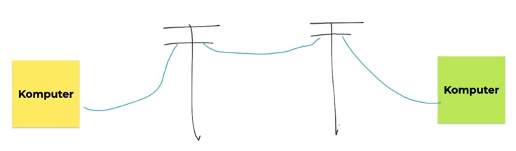
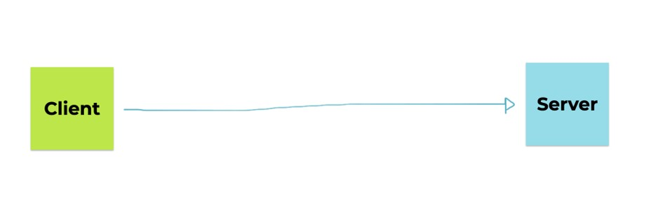
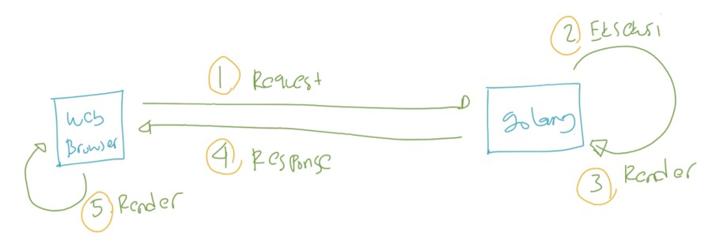
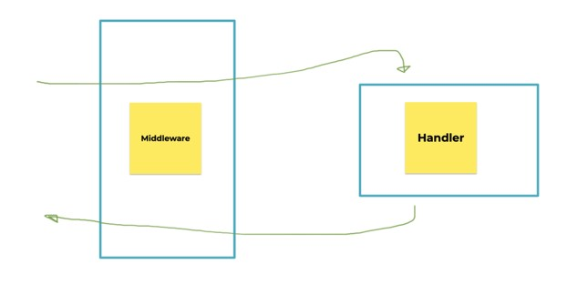

# Golang Web

## Sebelum Belajar

- Go-Lang Dasar
- Go-Lang Modules
- Go-Lang Unit Test
- Go-Lang Goroutine
- Go-Lang Embded
- HTML
- CSS
- JavaScript

## Agenda

- Pengenalan Web
- Client dan Server
- Pengenalan Go-Lang Web
- Package net/http
- Membuat Server
- Membuat ServerMux
- File Server
- Middleware
- Dan lain-lain

## #1 Pengenalan Web

### Kenapa Web?

- Saat ini web digunakan oleh jutaan, bahkan mungkin milyaran orang setiap hari
- Dengan web, kita bisa melakukan belajar online, mendengarkan musik online, menonton video online, belanja online, sampai memesan makanan secara online
- Namun perlu diperhatikan, Web bukanlah Internet

### Internet

- Internet adalah mekanisme komunikasi antar komputer
- Awal internet ada, untuk komunikasi antar komputer, kita membutuhkan jaringan kabel telepon
- Namun sekarang, semenjak berjamurnya jaringan wifi dan sejenisnya, komunikasi antar komputer menjadi lebih cepat dan mudah



### Web

- Web merupakan kumpulan informasi yang tersedia dalam komputer sebuah komputer yang terkoneksi secara terus menerus melalui internet
- Web bisa berisi informasi dalam bentuk apapun, seperti teks, gambar, audio, video dan lain-lain
- Web berjalan di aplikasi yang bernama Web Server, yaitu aplikasi yang digunakan untuk menyimpan dan menyampaikan isi informasi Web

### Diagram Web


### Web Host

- Pemilik Web, biasanya tidak menjalankan aplikasi Web Server di komputer pribadi nya
- Biasanya mereka akan menyewa komputer di tempat penyedia data center (kumpulan komputer) yang terjamin keandalan dan kecepatan koneksi internetnya
- Pihak penyedia komputer untuk Web Server biasa disebut Web Host

### Domain

- Saat komputer Web terhubung ke internet, biasanya dia memiliki alamat
- Alamat ini bernama ip address, formatnya misal nya 172.217.194.94
- Karena alamat ip address sangat menyulitkan untuk diingat
- Untung saja ada yang namanya nama domain
- Nama domain adalah alamat yang bisa digunakan sebagai alias ke ip address
- Misal seperti google.co.id, blibli.com, dan lain-lain
- Dengan nama domain, sebagai manusia kita akan mudah mengingat dibandingkan ip address
- Namun, saat kita menggunakan nama domain, sebenarnya komputer tetap akan mengakses web menggunakan alamat ip address.

### Web Browser

- Jika Web Server adalah aplikasi yang digunakan untuk menyimpan informasi Web
- Web Browser adalah aplikasi yang digunakan untuk mengakses Web melalui internet
- Kita bisa saja mengakses Web secara langsung tanpa bantuan Web Browser, namun Web Server hanya akan memberikan informasi bahasa mesin seperti HTML, JavaScript, CSS, Gambar, Video dan lain-lain
- Dengan menggunakan Web Browser, semua bahasa mesin tersebut bisa ditampilkan secara visual sehingga kita bisa menyerap informasinya dengan lebih mudah

## #2 Client dan Server

- Web adalah aplikasi Client dan Server, sekarang pertanyaanya, apa itu Client dan Server?
- Sederhananya clinet server merupakan konsep arsitektur aplikasi yang menghubungkan dua pihak, sistem clinet dan sistem server
- Sistem client dan sistem server yang saling berkomunikasi melalui jaringan komputer, internet, atau juga bisa di komputer yang sama

### Diagram Client dan Server



### Tugas Client dan Server

- Aplikasi Client bertugas mengirim request ke Server, dan menerima response dari Server
- Sedangkan, aplikasi Server bertugas menerima request dari Client, memproses data, dan mengembalikan hasil proses data ke Client

### Keuntungan Client dan Server

- Perubahan aplikasi bisa dilakukan dengan mudah di server, tanpa harus membuat perubahan di client, apalagi jika client nya di lokasi yang sulit dijangkau
- Bisa digunakan oleh banyak client pada saat yang bersamaan, walaupun server tidak banyak
- Bisa diakses dari mana saja, asal terhubung satu jaringan dengan server

### Contoh Client dan Server

- Web adalah salah satu contoh arsitektur client server
- Aplikasi yang betugas sebagai Client adalah Web Browser (Chrome, Firefox, Opera, Edge, dan lain-lain)
- Aplikasi yang bertugas sebagai Server adalah Web Server, dimana di dalam web server terdapat kode program Web kita

## #3 Go-Lang Web

- Go-Lang saat ini populer dijadikan salah satu pilihan bahasa pemrograman untuk membuat Web. terutama Web API (Backend)
- Selain itu, di Go-Lang juga sudah disediakan package untuk membuat Web, bahkan di sertakan pula package untuk implementasi unit testing untuk Web
- Hal ini menjadikan pembuatan Web menggunakan Go-Lang lebih mudah, karena tidak butuh menggunakan library atau framework

### Diagram Cara Kerja Go-Lang Web



### Cara Kerja Go-Lang Web

1. Web Browser akan melakukan HTTP Request ke Web Server
2. Golang menerima HTTP Request, lalu mengeksekusi request tersebut sesuai dengan yang diminta
3. Setelah melakukan eksekusi request, Golang akan mengembalikan data dan di render sesuai dengan kebutuhannya, misal HTML, CSS< JavaScript dan lain-lain
4. Golang akan mengembalikan content hasil render tersebut sebagai HTTP Response ke Web Browser
5. Web Browser menerima content dari Web Server, lalu me-render content tersebut sesuai dengan tipe content nya

### Package net/http

- Pada beberapa bahasa pemrograman lain, seperti Java misalnya, untuk membuat web biasanya dibutuhkan tambahan library atau framework
- Sedangkan di Go-Lang sudah disediakan package untuk membuat web bernama package net/http
- Sehingga untuk membuat web menggunakan Go-Lang, kita tidak butuh lagi library tambahan, kita bisa menggunakan package yang sudah tersedia
- Walaupun memang saat kita akan membuat web dalam skala besar, direkomendasikan menggunakan framework karena beberapa hal sudah dipermudah oleh web framework
- Namun pada course ini, kita akan fokus menggunakan package net/http untuk membuat web nya, karena semua framework web Go-Lang akan menggunakan net/http sebagai basis dasar framework nya

## #4 Server

- Server adalah struct yang terdapat di package net/http yang digunakan sebagai representasi Web Server di Go-Lang
- Untuk membuat web, kita wajib membuat Server
- Saat membuat data Server, ada beberapa hal yang perlu kita tentukan, seperti host dan juga port tempat dimana Web kita berjalan
- Setelah membuat Server, kita bisa menjalankan Server tersebut menggunakan function ListenAndServe()

### Kode: Server

```go
package main

import (
	"net/http"
	"testing"
)

func TestServer(t *testing.T) {
	server := http.Server{
		Addr: "localhost:3000",
	}

	err := server.ListenAndServe()
	if err != nil {
		panic(err)
	}
}

```

## #5 Handler

- Server hanya bertugas sebagai Web Server, sedangkan untuk menerima HTTP Request yang masuk ke Server, kita butuh yang namanya Handler
- Handler di Go-Lang di representasikan dalam interface, dimana dalam kontraknya terdapat sebuah function bernama ServeHTTP() yang digunakan sebagai function yang akan di eksekusi ketika menerima HTTP Request

### HandlerFunc

- Salah satu implementasi dari interface Handler adalah HandlerFunc
- Kita bisa menggunakan HandlerFunc untuk membuat function handler HTTP

### Kode: HandlerFunc

```go
package main

import (
	"fmt"
	"net/http"
	"testing"
)

func TestHandler(t *testing.T) {
	var handler http.HandlerFunc = func(writer http.ResponseWriter, request *http.Request) {
		fmt.Fprint(writer, "Hello World")
	}

	server := http.Server{
		Addr: "localhost:3000",
		Handler: handler,
	}

	err := server.ListenAndServe()
	if err != nil {
		panic(err)
	}
}
```

## #6 ServeMux

- Saat membuat web, kita biasanya ingin membuat banyak sekali endpoint URL
- HandlerFunc sayangnya tidak mendukung itu
- Alternative implemtasi dari Handler adalah ServeMux
- ServeMux adalah implementasi Handler yang bisa mengukung multiple endpoint

### Kode: ServeMux

```go
package main

import (
	"fmt"
	"net/http"
	"testing"
)

func TestServeMux(t *testing.T) {
	mux := http.NewServeMux()
	mux.HandleFunc("/", func(writer http.ResponseWriter, request *http.Request) {
		fmt.Fprint(writer, "Hello World")
	})
	mux.HandleFunc("/hi", func(writer http.ResponseWriter, request *http.Request) {
		fmt.Fprint(writer, "Hi")
	})
	server := http.Server{
		Addr:    "localhost:3000",
		Handler: mux,
	}
	err := server.ListenAndServe()
	if err != nil {
		panic(err)
	}
}
```

### URL Pattern

- URL Pattern dalam ServeMux sederhana, kita tinggal menambahkan string yang ingin kita gunakan sebagai endpoint, tanpa perlu memasukkan domain web kita
- Jika URL Pattern dalam ServeMux kita tambahkan di akhiran dengan garus miring, artinya semua url tersebut akan menerima path dengan awalan tersebut, midal /images/ artinya akan dieksekusi jika endpoint nya /images/,/images/contoh,/images/contoh/lagi
- Namun jika terdapat URL Pattern yang lebih panjang, maka akan diprioritaskan yang lebuh panjang misal jika terdapat URL /images/ dan /images/thumbnails/, maka jika mengakses /images/thumbnails/ akan mengakses /images/thumbnails/, bukan /images

### Kode: ServeMux URL Pattern

```go
package main

import (
	"fmt"
	"net/http"
	"testing"
)

func TestServeMuxURLPattern(t *testing.T) {
	mux := http.NewServeMux()
	mux.HandleFunc("/images/", func(writer http.ResponseWriter, request *http.Request) {
		fmt.Fprint(writer, "Images")
	})
	mux.HandleFunc("/images/thumbnails/", func(writer http.ResponseWriter, request *http.Request) {
		fmt.Fprint(writer, "Thumbnails")
	})
	server := http.Server{
		Addr:    "localhost:3000",
		Handler: mux,
	}
	err := server.ListenAndServe()
	if err != nil {
		panic(err)
	}
}
```

## #7 Request

- Request adalah struct yang merepresentasikan HTTP Request yang dikirim oleh Web Browser
- Semua informasi request yang dikirim bisa kita dapatkan di Request
- Seperti, URL, http method, http header, http body, dan lain-lain

### Kode: Request

```go
package main

import (
	"fmt"
	"net/http"
	"testing"
)

func TestRequest(t *testing.T) {
	var handler http.HandlerFunc = func(writer http.ResponseWriter, request *http.Request) {
		fmt.Fprint(writer, request.Method)
		fmt.Fprint(writer, request.RequestURI)
	}
	server := http.Server{
		Addr:    "localhost:3000",
		Handler: handler,
	}
	err := server.ListenAndServe()
	if err != nil {
		panic(err)
	}
}
```

## #8 HTTP Test

- Go-Lang sudah menyediakan package khusus untuk membuat unit test terhadap fitur Web yang kita buat
- Semuanya ada di dalam package net/http/httptest
- <https://golang.org/pkg/net/http/httptest>
- Dengan menggunakan package ini, kita bisa melakukan testing handler web di Go-Lang tanpa harus menjalankan aplikasi web nya
- Kita bisa langsung fokus terhadap hendler function yang ingin kita test

### httptest.NewRequest()

- NewRequest(method, url, body) merupakan function yang digunakan untuk membuat http.Request
- Kita bisa menentukan method, url dan body yang akan kita kirim sebagai simulasi unit test
- Selain itu, kita juga bisa menambahkan informasi tambahan lainnya pada request yang ingin kita kirim, seperti header, cookie, dan lain-lain

### httptest.NewRecorder()

- httptest.NewRecorder() merupakan function yang digunakan untuk membuat ResponseRecorder
- ResponseRecorder merupakan struct bantuan untuk merekam HTTP response dari hasil testing yang kita lakukan

### Kode: HTTP Test

```go
package main

import (
	"fmt"
	"net/http"
	"net/http/httptest"
	"testing"
)

func HelloHandler(writer http.ResponseWriter, request *http.Request) {
	fmt.Fprintln(writer, "Hello World")
}

func TestHelloHandler(t *testing.T) {
	request := httptest.NewRequest("GET", "http://localhost:3000/hello", nil)
		recorder := httptest.NewRecorder()

		HelloHandler(recorder, request)

		response := recorder.Result()
		body, _ := io.ReadAll(response.Body)

		fmt.Println(response.StatusCode)
		fmt.Println(response.Status)
		fmt.Println(string(body))
}
```

## #9 Query Parameter

- Query parameter adalah salah satu fitur yang bisa kita gunakan ketika membuat web
- Query parameter biasanya digunakan untuk mengirim data dari client ke server
- Query parameter ditempatkan pada URL
- Untuk menambahkan query parameter, kita bisa menggunakan ?name=value pada URL nya

### url.URL

- Dalam parameter Request, terdapat attribute URL yang berisikan data url.URL
- Dari data URL ini, kita bisa mengambil data query parameter yang dikirim dari client dengan menggunakan method Query() yang akan mengembalikan map

### Kode: Query Parameter

```go
package main

import (
	"fmt"
	"net/http"
	"net/http/httptest"
	"testing"
)

func SayHello(writer http.ResponseWriter, request *http.Request) {
	name := request.URL.Query().Get("name")
	if name == "" {
		fmt.Fprint(writer, "Hello")
	} else {
		fmt.Fprintf(writer, "Hello %s", name)
	}
}

func TestQueryParameter(t *testing.T) {
	request := httptest.NewRequest("GET", "http://localhost:3000?name=Eko", nil)
	recorder := httptest.NewRecorder()

	SayHello(recorder, request)

	response := recorder.Result()
	body, _ := io.ReadAll(response.Body)

	fmt.Println(string(body))
}
```

### Multiple Query Parameter

- Dalam spesifikasi URL, kita bisa menambahkan lebuh dari satu query parameter
- Ini cocok sekali jika kita memang ingin mengirim banyak data ke server, cukup tambahkan query parameter lainnya
- Untuk menambahkan query parameter, kita bisa gunakan tanda & lalu diikuti dengan query parameter berikutnya

### Kode: Multiple Query Parameter

```go
package main

import (
	"fmt"
	"net/http"
	"net/http/httptest"
	"testing"
)

func MultipleParameter(writer http.ResponseWriter, request *http.Request) {
	firstName := request.URL.Query().Get("first_name")
	lastName := request.URL.Query().Get("last_name")
	fmt.Fprintf(writer, "%s %s", firsName, lastName)
}

func TestMultipleQueryParameter(t *testing.T) {
	request := httptest.NewRequest("GET", "http://localhost:3000?first_name=Eko&last_name=Kurniawan", nil)
	recorder := httptest.NewRecorder()

	MultipleParameter(recorder, request)

	response := recorder.Result()
	body, _ := io.ReadAll(response.Body)

	fmt.Println(string(body))
}
```

### Multiple Value Query Parameter

- Sebenarnya URL melakukan parsing query parameter dan menyimpannya dalam map[string]string
- Artinya, dalam satu key query parameter, kita bisa memasukkan beberapa value
- Caranya kita bisa menambahkan query parameter dengan nama yanga sama, namun value berbeda misal:
- name=Eko&name=Kurniawan

### Kode: Multiple Value Query Parameter

```go
package main

import (
	"fmt"
	"net/http"
	"net/http/httptest"
	"net/url"
	"strings"
	"testing"
)

func MultipleValueParameter(writer http.ResponseWriter, request *http.Request) {
	var query url.Values = request.URL.Query()
	var names []string = query["name"]
	fmt.Fprintf(writer, strings.Join(names, ","))
}
```

## #10 Header

- Selain Query Parameter, dalam HTTP, ada juga yang bernama Header
- Header adalah informasi tambahan yang biasa dikirim dari client ke server atau sebaliknya
- Jadi dalam Header, tidak hanya ada pada HTTP Request, pada HTTP Response pun kita bisa menambahkan informasi header
- Saat kita menggunakan browser, biasanya secara otomatis header akan ditambahkan oleh browser, seperti informasi browser, jenis tipe content yang dikirim dan diterima oleh browser, dan lain-lain

### Request Header

- Untuk menangkap request header yang dikirim oleh client, kita bisa mengambilnya di Request.Header
- Header mirip seperti Query Parameter, isinya adalah map[string]string
- Berbeda dengan Query Parameter yang case sensitive, secara spesifikasi, Header key tidaklah case sensitive

### Kode: Request Header

```go
package main

import (
	"fmt"
	"io"
	"net/http"
	"net/http/httptest"
	"testing"
)

func RequestHeader(writer http.ResponseWriter, request *http.Request) {
	contentType := request.Header.Get("content-type")
	fmt.Fprint(writer, contentType)
}

func TestRequestHeader(t *testing.T) {
	request := httptest.NewRequest("GET", "http://localhost:3000", nil)
	request.Header.Add("Content-Type", "application/json")
	recorder := httptest.NewRecorder()

	RequestHeader(recorder, request)

	response := recorder.Result()
	body, _ := io.ReadAll(response.Body)

	fmt.Println(string(body))
}
```

### Response Header

- Sedangkan jika kita ingin menambahkan header pada response, kita bisa menggunakan function ResponseWriter.Header()

### Kode: Response Header

```go
package main

import (
	"fmt"
	"io"
	"net/http"
	"net/http/httptest"
	"testing"
)

func ResponseHeader(writer http.ResponseWriter, request *http.Request) {
	writer.Header().Add("X-Powered-By", "Programmer Zaman Now")
	fmt.Fprint(writer, "OK")
}

func TestResponseHeader(t *testing.T) {
	request := httptest.NewRequest("GET", "http://localhost:3000", nil)
	recorder := httptest.NewRecorder()

	ResponseHeader(recorder, request)

	response := recorder.Result()
	poweredBy := response.Header.Get("X-Powered-By")

	fmt.Println(poweredBy)
}
```

## #11 Form Post

- Saat kita belajar HTML, kita tahu bahwa saat kita membuat form, kita bisa submit datanya dengan method GET atau POST
- Jika menggunakan method GET, maka hasilnya semua data di form akan menjadi query parameter
- Sedangkan jika menggunakan POST, maka semua data di form akan dikirim via body HTTP request.
- Di Go-Lang, untuk mengambil data Form Post sangatlah mudah

### Request.PostForm

- Semua data form post yang dikirim dari client, secara otomatis akan disimpan dalam attribute Request.PostForm
- Namun sebelum kita bisa mengambil data di attribute PostForm, kita wajib memanggil Request.ParseForm() terlebih dahulu, method ini digunakan untuk melakukan parsing data body apakah bisa di parsing menjadi form data atau tidak, kita tidak bisa di parsing, maka akan menyebabkan error

### Kode: Form Post

```go
package main

import (
	"fmt"
	"io"
	"net/http"
	"net/http/httptest"
	"strings"
	"testing"
)

func FormPost(writer http.ResponseWriter, request *http.Request) {
	err := request.ParseForm()
	if err != nil {
		panic(err)
	}

	firstName := request.PostForm.Get("firstName")
	lastName := request.PostForm.Get("lastName")
	fmt.Fprintf(writer, "%s %s", firstName, lastName)
}

func TestFormPost(t *testing.T) {
	requestBody := strings.NewReader("firstName=Eko&lastName=Kurniawan")
	request := httptest.NewRequest("POST", "http://localhost:3000", requestBody)
	request.Header.Add("Content-Type", "application/x-www-form-urlencoded")
	recorder := httptest.NewRecorder()

	FormPost(recorder, request)

	response := recorder.Result()
	body, _ := io.ReadAll(response.Body)

	fmt.Println(string(body))
}

```

## #12 Response Code

- Dalam HTTP, terdapat yang namanya response code
- Response code merupakan representasi kode response
- Dari response code ini kita bisa melihat apakah sebuah request yang kita kirim itu sukses diproses oleh server atau gagal
- Ada banyak sekali response code yang bit kita gunakan saat membuat web
- <https://developer.mozilla.org/en-US/docs/Web/HTTP/Status>

### Mengubah Response Code

- Secara default, jika kita tidak menyebutkan response code, maka response code nya adalah 200 OK
- Jika kita ingin mengubahnya, kita bisa menggunakan function ResponseWriter.WriterHeader(int)
- Semua data status code juga sudah disediakan di Go-Lang, jadi kita ingin, kita bisa gunakan variable yang sudah disediakan
- <https://github.com/golang/go/blob/master/src/net/http/status.go>

### Kode: Response Code

```go
package main

import (
	"fmt"
	"io"
	"net/http"
	"net/http/httptest"
	"testing"
)

func ResponseCode(writer http.ResponseWriter, request *http.Request) {
	name := request.URL.Query().Get("name")
	if name == "" {
		writer.WriteHeader(400) // BadRequest
		fmt.Fprint(writer, "name is empty")
	} else {
		writer.WriteHeader(200)
		fmt.Fprintf(writer, "Hi %s", name)
	}
}

func TestResponseCode(t *testing.T) {
	request := httptest.NewRequest("POST", "http://localhost:3000", nil)
	recorder := httptest.NewRecorder()

	ResponseCode(recorder, request)

	response := recorder.Result()
	body, _ := io.ReadAll(response.Body)

	fmt.Println(response.StatusCode)
	fmt.Println(response.Status)
	fmt.Println(string(body))
}

```

## #13 Cookie

### Stateless

- HTTP merupakan stateless antara client dan server, artinya tidak akan menyimpan data apapun untuk mengingat setiap request dari client
- Hal ini bertujuan agar mudah melakukan scalability di sisi server
- Lantas bagaimana caranya agar server bisa mengingat sebuah client? Misal ketika kita sudah login di website, server otomatis harus tahu jika client tersebut sudah login, sehingga request selanjutnya, tidak perlu diminta untuk login lagi
- Untuk melakukan hal ini, kita bisa memanfaatkan Cookie

### Membuat Cookie

- Cookie merupakan data yang dibuat di server dan sengaja agar disimpan di web browser
- Untuk membuat cookie di server, kita bisa menggunakan function http.SetCookie()

### Kode: Membuat Cookie

```go
func SetCookie(writer http.ResponseWriter, request *http.Request) {
	cookie := new(http.Cookie)
	cookie.Name = "X-PZN-Name"
	cookie.Value = request.URL.Query().Get("name")
	cookie.Path = "/"

	http.SetCookie(writer, cookie)
	fmt.Fprintf(writer, "Sucess Create Cookie")
}
```

### Kode: Mengambil Cookie

```go
func GetCookie(writer http.ResponseWriter, request *http.Request) {
	cookie, err := request.Cookie("X-PZN-Name")
	if err != nil {
		fmt.Fprint(writer, "No Cookie")
	} else {
		fmt.Fprintf(writer, "Hello %s", cookie.Value)
	}
}
```

### Kode: Mencoba Cookie

```go
mux := http.NewServeMux()
mux.HandleFunc("/set-cookie", SetCookie)
mux.HandleFunc("/get-cookie", GetCookie)

server := http.Server{
	Addr: "localhost:3000",
	Handler: mux,
}

err := server.ListenAndServe()
if err != nil {
	panic(err)
}
```

### Kode: Test Membuat Cookie

```go
request := httptest.NewRequest(http.MethodGet, "http://localhost:3000?name=Eko", nil)
recorder := httptest.NewRecorder()

SetCookie(recorder, request)

cookies := recorder.Result().Cookies()

for _, cookie := range cookies {
	fmt.Printf("%s : %s\n", cookie.Name, cookie.Value)
}
```

### Kode: Test Mengambil Cookie

```go
request := httptest.NewRequest(http.MethodGet, "http://localhost:3000?name=Eko", nil)
cookie := new(http.Cookie)
cookie.Name = "X-PZN-Name"
cookie.Value = "Eko"
request.AddCookie(cookie)

recorder := httptest.NewRecorder()

GetCookie(recorder, request)

response := recorder.Result()
body, _ := io.ReadAll(response.Body)

fmt.Println(string(body))
```

## #14 FileServer

- Go-Lang memiliki sebuah fitur yang bernama FileServer
- Dengan ini, kita bisa membuat Handler di Go-Lang web yang digunakan sebagai static file server
- Dengan menggunakan FileServer, kita tidak perlu manual me-load file lagi
- FileServer adalah Handler, jadi bisa kita tambahkan ke dalam http.Server atau http.ServeMux

### Kode: FileServer

```go
directory := http.Dir("./resources")
fileServer := http.FileServer(directory)

mux := http.NewServeMux()
mux.Handle("/static/", fileServer)

server := http.Server{
	Addr: "localhost:3000",
	Handler: mux,
}
```

### 404 Not Found

- Jika kita coba jalankan, saat kita membuka misal /static/index.js, maka akan dapat error 404 Not Found
- Kenapa ini terjadi?
- Hal ini dikarenakan FileServer akan membaca url, lalu mencari file berdasarkan url nya, jadi jika kita mambuat /static/index.js, maka FileServer akan mencari ke file /resource/static/index.js
- Hal ini menyebabkan 404 Not Found karena memang file nya tidak bisa ditemukan
- Oleh karena itu, kita bisa menggunakan function http.StripPrefix() untuk menghapus prefix di url

### Kode: FileServer dengan StripPefix

```go
directory := http.Dir("./resources")
fileServer := http.FileServer(directory)

mux := http.NewServeMux()
mux.Handle("/static/", http.StripPrefix("/static", fileServer))

server := http.Server{
	Addr: "localhost:3000",
	Handler: mux,
}
```

### Go-Lang Embed

- Di Go-Lang 1.16 terdapat fitur baru yang bernama Go-Lang embed
- Dalam Go-Lang embed kita bisa embed file ke dalam binary distribution file, hal ini mempermudah sehingga kita tidak perlu meng-copy static file lagi
- Go-Lang Embed juga memiliki fitur yang bernama embed.FS, fitur ini bisa di integrasikan dengan FileServer

### Kode: FileServer Go-Lang Embed

```go
//go:embed resources
var resources embed.FS

func TestFileServerGoEmbed(t *testing.T) {
	fileServer := http.FileServer(http.FS(responses))

	mux := http.NewServeMux()
	mux.Handle("/static/", http.StripPrefix("/static", fileServer))

	server := http.Server{
		Addr: "localhost:3000",
		Handler: mux,
	}
}
```

### 404 Not Found

- Jika kita coba jalankan, dan coba bua `/static/index.js`, maka kita akan mendapatkan error 404 Not Found
- Kenapa ini terjadi? Hal ini karena di Go-Lang embed, nama folder ikut menjadi nama resource nya, misal `resources/index.js`, jadi untuk mengaksesnya kita perlu gunakan URL `/static/resources/index.js`
- Jika kita ingin langsung menagakses file index.js tanpa menggunakan resources, kita bisa menggunakan function fs.Sub() untuk mendapatkan sub directory

### Kode : FileServer Go-Lang Embed

```go
//go:embed resources
var resources embed.FS

func TestFileServerGoEmbed(t *testing.T) {
	directory, _ := fs.Sub(response, "resources")
	fileServer := http.FileServer(http.FS(directory))

	mux := http.NewServeMux()
	mux.Handle("/static/", http.StripPrefix("/static", fileServer))

	server := http.Server{
		Addr: "localhost:8080",
		Handler: mux,
	}
}
```

## #15 ServeFile

- Kadang ada kasus misal kita hanya ingin menggunakan static file sesuai dengan yang kita inginkan
- Hal ini bisa dilakukan menggunakan function `http.ServeFile()`
- Dengan menggunakan function ini, kita bisa menentukan file mana yang ingin kita tulis ke http response

### Kode: ServeFile

```go
func ServeFile(writer http.ResponseWriter, request http.Request) {
	if request.URL.Query().Get("name") != "" {
		http.ServeFile(writer, request, "./resources/ok.html")
	} else {
		http.ServeFile(writer, request, "./resources/notfound.html")
	}
}

func TestServeFile(t testing.T) {
	server := http.Server{
		Addr: "localhost:8080",
		Handler: http.HandlerFunc(ServeFile),
	}
}
```

### Go-Lang Embed

- Parameter function http.ServeFile hanya berisi string file name, sehingga tidak bisa menggunakan Go-Lang Embed
- Namun bukan berarti kita tidak bisa menggunakan Go-Lang embed, karena jika untuk melakukan load file, kita hanya butuh menggunakan packagae fmt dan ResponseWriter saja

### Kode : ServeFile Go-Lang Embed

```go
var resourceOk string

var resourceNotFOund string

func TestServeFile(writer http.ResponseWriter, request http.Request) {
	if request.URL.Query().Get("name") != "" {
		http.ServeFile(writer, resourceOk)
	} else {
		http.ServeFile(writer, resourceNotFOund)
	}
}
```

## #16 Template

### Web Dinamis

- Sampai saat ini kita hanya membahas tentang membuat response menggunakan String dan juga static file
- Pada kenyataannya, saat kita membuat web, kita pasti akan membuat halaman yang dinamis, bisa berubah-ubah sesuai dengan data yang diakses oleh user
- Di Go-Lang terdapat fitur HTML Template, yaitu fitur template yang bisa kita gunakan untuk membuat HTML yang dinamis

### HTML Template

- Fitur HTML template terdapat di package html/template
- Sebelum menggunakan HTML template, kita perlu terlebih dahulu membuat template nya
- Tamplate bisa berupa file atau string
- Bagian dinamis pada HTML Template, adalah bagian yang menggunaka tanda `{{ }}`

### Membuat Template

- Saat membuat template dengan string, kita perlu memberi tahu nama template nya
- Dan untuk mmebuat text template, cukup buat text html, dan untuk konten yang dinamis, kita bisa gunakan tanda `{{.}}`. contoh:
- `<html><body>{{.}}</body></html>`

### Kode: HTML Template String

```go
func SimpleHTML(writer http.ResponseWriter, request *http.Request) {
	templateText := `<html><body>{{.}}</body></html>`
	t, err := template.New("SIMPLE").Parse(templateText)
	if err != nil {
		panic(err)
	}
	t.ExecuteTemplate(writer, "SIMPLE", "Hello HTML Template")
}
```

### Kode: Test HTML Template String

```go
request := httptest.NewRequest("GET", "http://localhost/", nil)
recorder := httptest.NewRecorder()

SimpleHTML(recorder, request)

response := recorder.Result()
body, _ := io.ReadAll(response.Body)
fmt.Println(string(body))
```

### Template Dari File

- Selain membuat template dari string, kita juga bisa membuat template langsung dari file
- Hal ini memermudah kita, karena bisa langsung membuat file html
- Saat membuat template menggunakan file, secara otomatis nama file akan menjadi nama template nya, misal jika kita punya simple.html, maka nama template nya adalah simple.html

### Kode: Simple Template

```html
<!doctype html>
<html lang="en">
	<head>
		<meta charset="utf-8" />
		<meta name="viewport" content="width=device-width, initial-scale=1" />
		<title>{{.}}</title>
	</head>
	<body>
		<h1>{{.}}</h1>
	</body>
</html>
```

### Kode: Simple HTML Template

```go
func SimpleHTMLFile(writer http.ResponseWriter, request *http.Request) {
	t, err := template.ParseFiles("./templates/simple.gohtml")
	if err != nil {
		panic(err)
	}

	t.ExecuteTemplate(writer, "simple.gohtml", "Hello HTML Template")
}
```

### Kode: Test Simple HTML Template

```go
request := httptest.NewRequest("GET", "http://localhost/", nil)
recorder := httptest.NewRecorder()

SimpleHTMLFile(recorder, request)
response := recorder.Result()
body, _ := io.ReadAll(response.Body)
fmt.Println(string(body))
```

### Template Directory

- Kadang biasanya kita jarang sekali menyebutkan file template satu persatu
- Alangkah baiknya untuk template kita simpan di satu directory
- Go-Lang template mendukung proses load template dari directory
- Hal ini memudahkan kita, sehingga tidak perlu menyebutkan nama file nya satu per satu

### Kode: Template Directory

```go
func TemplateDirectory(writer http.ResponseWriter, request *http.Request) {
	t, err := template.ParseGlob("./templates/*.gohtml")
	if err != nil {
		panic(err)
	}

	t.ExecuteTemplate(writer, "simple.gohtml", "Hello HTML Template")
}
```

### Template dari Go-Lang Embed

- Sejak Go-Lang 1.16, karena sudah ada Go-Lang Embed, jadi direkomendasikan menggunakan Go-Lang embed untuk menyimpan data template
- Menggunakan Go-Lang embed menjadikan kita tidak perlu ikut meng-copy template file lagi, karena sudah otomatis di embed di dalam distribution file

### Kode: Template Go-Lang Embed

```go
//go:embed templates
var templates embed.FS

func TemplateEmbed(writer http.ResponseWriter, request *http.Request) {
	t, err := template.ParseFS(templates, "templates/*.gohtml")
	if err != nil {
		panic(err)
	}

	t.ExecuteTemplate(writer, "simple.gohtml", "Hello HTML Template")
}
```

## #17 Template Data

- Saat kita membuat template, kadang kita ingin menambahkan banyak data dinamis
- Hal ini bisa kita lakukan dengan cara menggunakan data struct atau map
- Namun perlu dilakukan peribahan di dalam text template nya, kita perlu memberi tahu, Field atau Key mana yang akan kita gunakan untuk megisi data dinamis di template
- Kita bisa menyebutkan daengan cara seperti ini {{.NamaField}}

### Kode: Template File

```html
<!doctype html>
<html lang="en">
	<head>
		<meta charset="utf-8" />
		<meta name="viewport" content="width=device-width, initial-scale=1" />
		<title>{{.Title}}</title>
	</head>
	<body>
		<h1>Hello {{.Name}}</h1>
	</body>
</html>
```

### Kode: Template Data dengan Map

```go
func TemplateDataMap(writer http.ResponseWriter, request *http.Request) {
	t := template.Must(template.ParseFiles("./templates/name.gohtml"))

	t.ExecuteTemplate(writer, "name.gohtml", map[string]interface{}{
		"Title": "Template Data Struct",
		"Name":  "Eko",
	})
}
```

### Kode: Template Data dengan Struct

```go
func TemplateDataStruct(writer http.ResponseWriter, request *http.Request) {
	t := template.Must(template.ParseFiles("./templates/name.gohtml"))

	t.ExecuteTemplate(writer, "name.gohtml", Page{
		Title: "Template Data Struct",
		Name:  "Eko",
	})
}
```

## #18 Template Action

- Go-Lang template mendukung perintah action, seperti percabangan, perulangan dan lain-lain

### If Else

- `{{if .Value}}` T1 `{{end}}`, jika Value tidak kosong, maka T1 akan dieksekusi, jika kosong, tidak ada yang dieksekusi
- `{{if .Value}}` T1 `{{else}}` T2 `{{end}}`, jika Value tidak kosong, maka T1 akan dieksekusi, jika kosong, T2 yang akan dieksekusi
- `{{if .Value1}}` T1 `{{else if.Value2}}` T1 `{{else}}` T3 `{{end}}`, jika Value1 tidak kosong, maka T1 akan dieksekusi, jika Value2 tidak kosong, maka T2 akan dieksekusi, jika tidak semuanya, maka T3 akan dieksekusi

### Kode: Template If Statement

```html
<!doctype html>
<html lang="en">
	<body>
		{{if .Name}}
		<h1>Hello {{.Name}}</h1>
		{{else}}
		<h1>Hello</h1>
		{{end}}
	</body>
</html>
```

### Kode: If Statement

```go
func TemplateIf(writer http.ResponseWriter, request *http.Request) {
	t := template.Must(template.ParseFiles("./templates/if.gohtml"))

	t.ExecuteTemplate(writer, "if.gohtml", map[string]interface{}{
		"Name":  "Eko",
	})
}
```

### Operator Perbandingan

Go-Lang template juga mendukung operator perbandingan, ini cocok ketika butuh melakukan perbandingan number di if statement, berikut adalah operator nya:

| Operator | Keterangan           |
| -------- | -------------------- |
| `eq`     | artinya arg1 == arg2 |
| `ne`     | artinya arg1 != arg2 |
| `lt`     | artinya arg1 < arg2  |
| `le`     | artinya arg1 <= arg2 |
| `gt`     | artinya arg1 > arg2  |
| `ge`     | artinya arg1 >= arg2 |

### Kode: Template Operator Perbandingan

```html
<!doctype html>
<html lang="en">
	<body>
		{{if ge .FinalValue 80}}
		<h1>Good</h1>
		{{else if ge .FinalValue 60}}
		<h1>Nice Try</h1>
		{{else}}
		<h1>Try Again</h1>
		{{end}}
	</body>
</html>
```

### Kenapa Operatornya di Depan?

- Hal ini dikarenakan, sebenarnya operator perbandingan tersebut adalah sebuah function
- Jadi saat kita menggunakan `{{eq First Second}}`, sebenarnya dia akan memanggil function `eq` dengan parameter First dan Second: `eq(First, Second)`

### Kode: Operator Perbandingan

```go
func TemplateComparator(writer http.ResponseWriter, request *http.Request) {
	t := template.Must(template.ParseFiles("./templates/comparator.gohtml"))

	t.ExecuteTemplate(writer, "comparator.gohtml", map[string]interface{}{
		"FinalValue": 100,
	})
}
```

### Range

- Range digunakan untuk melakukan iterasi data template
- Tidak ada perulangan biasa seperti menggunakan for di Go-Lang template
- Yang kita bisa lakukan adalah menggunakan range untuk mengiterasi tiap data arrray, slice, map atau channel
- `{{range $index, $element := .Value}}` T1 `{{end}}`, jika value memiliki data, maka T1 akan dieksekusi sebanyak element value, dan kita menggunakan `$index` untuk mengakses index dan `$element` untuk mengakses element
- `{{range $index, $element := .Value}}` T1 `{{else}}` T2 `{{end}}`, sama seperti sebelumnya, namun jika value tidak memiliki element apapun, maka T2 yang akan dieksekusi

### Kode: Template Range

```html
<!doctype html>
<html lang="en">
	<body>
		{{range $index, $element := .Hobbies}}
		<h1>{{$element}}</h1>
		{{else}}
		<h1>Anda tidak punya hobi</h1>
		{{end}}
	</body>
</html>
```

### Kode: Range

```go
func TemplateRange(writer http.ResponseWriter, request *http.Request) {
	t := template.Must(template.ParseFiles("./template/range.gohtml"))

	t.ExecuteTemplate(writer, "range.gohtml", map[string]interface{}{
		"Hobies": []string{
			"Gaming", "Reading", "Coding",
		},
	})
}
```

### With

- Kadang kita sering membuat nested struct
- Jika menggunakan template, kita bisa mengaksesnya menggunakan `.Value.NestedValue`
- Di template terdapat action with, yang bisa digunakan mengubah scope dot menjadi object yang kita mau
- `{{with .Value}}` T1 `{{end}}`, jika value tidak kosong, di T1 semua dot akan merefer ke value
- `{{with .Value}}` T1 `{{else}}` T2 `{{end}}`, sama seperti sebelumnya, namun jika value kosong, maka T2 yang akan dieksekusi

### Kode: Template With

```html
<!doctype html>
<html lang="en">
	<body>
		{{/* Contoh Komentar */}} Name : {{.Name}}<br />
		{{with .Address}} Address Street : {{.Street}}<br />
		Address City : {{.City}}<br />
		{{end}}
	</body>
</html>
```

### Kode: With

```go
func TemplateRange(writer http.ResponseWriter, request *http.Request) {
	t := template.Must(template.ParseFiles("./template/address.gohtml"))

	t.ExecuteTemplate(writer, "address.gohtml", map[string]interface{}{
		"Name":    "Eko",
		"Address": map[string]interface{}{
			"Street": "Jalan Belum Jadi",
			"City": "Mars",
		},
	})
}
```

### Comment

- Template juga mendukung komentar
- Komentar secara otomatis akan hilang ketika template text di parsing
- Untuk membuat komentar sangat sederhana, kita bisa gunakan `{{/* Contoh Komentar */}}`

## #19 Template Layout

- Saat kita membuat halaman website, kadang ada beberapa bagian yang salalu sama, misal header dan footer
- Best practice nya jika terdapat bagian yang selalu sama, disarankan untuk disimpan pada template yang terpisah, agar bisa digunakan di template lain
- Go-Lang template mendukung import dari template lain

### Import Template

- Untuk melakukan import, kita bisa menggunakan perintah berikut:

- `{{template "name"}}`, artinya kita akan meng-import template "nama" tanpa memberikan data apapun
- `{{template "nama" .Value}}`, artinya kita akan meng-import template "nama" dengan memberikan data value

### Kode: File Template Header

```html
<!-- header.gohtml -->
<!doctype html>
<html>
	<head>
		<meta charset="utf-8" />
		<meta name="viewport" content="width=device-width, initial-scale=1" />
		<title>{{.Title}}</title>
	</head>
	<body></body>
</html>
```

### Kode: File Template Footer

```html
<!-- footer.gohtml -->
</body>
</html>
```

### Kode: File Template Header

```html
{{template "header.gohtml" .}}
<h1>Hello {{.Name}}</h1>
{{template "footer.gohtml"}}
```

### Kode: Template Layout

```go
func TemplateLayout(writer http.ResponseWriter, request *http.Request) {
	t := template.Must(template.ParseFiles(
		"./template/header.gohtml", "./template/footer.gohtml", "./template/layout.gohtml",
	))

	t.ExecuteTemplate(writer, "layout.gohtml", map[string]interface{}{
		"Name":  "Eko",
		"Title": "Template Layout",
	})
}
```

### Template Name

- Saat kita membuat template dari file, secara otomatis nama file nya akan menjadi nama template
- Namun jika kita ingin meribah nama template nya, kita juga bisa melakukan menggunakan perintah `{{define "nama"}}` TEMPLATE `{{end}}`, artinya kita membuat template dengan nama "nama"

### Kode: Template Name

```html
<!-- layout.gohtml -->
{{define "layout"}} {{template "header.gohtml" .}}
<h1>Hello {{.Name}}</h1>
{{template "footer.gohtml"}}
```

## #20 Template Function

- Selain mengakses field, dalam template, function juga bisa diakses
- Cara mengakses function sama seperti mengakses field, namun jika function tersebut memiliki parameter, kita bisa gunakan tambahkan parameter ketika memanggil function di template nya
- `{{.FunctionName}}`, memanggil field FunctionName atau function FunctionName()
- `{{.FunctionName "eko", "kurniawan"}}`, memanggil function FunctionName("eko", "kurniawan")

### Kode: Struct

```go
type MyPage struct {
	Name string
}

func (myPage MyPage) SayHello(name string) string {
	return "Hello " + name + ", My Name is " + myPage.Name
}
```

### Kode: Template Function

```go
func TemplateFunction(writer http.ResponseWriter, request *http.Request) {
	t := template.Must(template.New("FUNCTION")).
		Parse(`{{ .SayHello "Budi" }}`)

	t.ExecuteTemplate(writer, "FUNCTION", MyPage{
		Name: "Eko",
	})
}
```

### Global Function

- Go-Lang template memiliki beberapa global function
- Global function adalah function yang bisa digunakan secara langsung, tanpa menggunakan template data
- Berikut adalah beberapa global function di Go-Lang template
- <https://github.com/golang/go/blob/master/src/text/template/funcs.go>

### Kode: Global Function

```go
func TemplateFunctionGlobal(writer http.ResponseWriter, request *http.Request) {
	t := template.Must(template.New("FUNCTION")).
		Parse(`{{len .Name}}`)

	t.ExecuteTemplate(writer, "FUNCTION", map[string]interface{}{
		"Name": "Tutorial Go-Lang",
	})
}
```

### Menambah Global Function

- Kita juga bisa menambah global function
- Untuk menambah global function, kita bisa menggunakan method Funcs pada template
- Perlu diingat, bahwa menambahkan global function harus dilakukan sebelum melakukan parsing template

### Kode: Menambah Golang Function

```go
func TemplateFunctionMap(writer http.ResponseWriter, request *http.Request) {
	t := template.New("FUNCTION")
	t = t.Funcs(map[string]interface{}{
		"upper": func(value string) string {
			return strings.ToUpper(value)
		},
	})
	t = template.Must(t.Parse(`{{ upper .Name }}`))

	t.ExecuteTemplate(writer, "FUNCTION", MyPage{
		Name: "Eko",
	})
}
```

### Function Pipelines

- Go-Lang template mendukung function pipelines, artinya hasil dari function bisa dikirim ke function berikutnya
- Untuk menggunakan function pipelines, kita bisa menggunakan tanda |, misal:
- `{{ sayHello .Name | upper }}`, artinya akan memanggil global function `sayHello(Name)` hasil dari `sayHello(Name)` akan dikirim ke function `upper(hasil)`
- Kita bisa menambahkan function pipelines lebih dari satu

### Kode: Function Pipelines

```go
func TemplateFunctionPipelines(writer http.ResponseWriter, request *http.Request) {
	t := template.New("FUNCTION")
	t = t.Funcs(map[string]interface{}{
		"sayHello": func(value string) string {
			return "Hello " + value
		},
		"upper": func(value string) string {
			return strings.ToUpper(value)
		},
	})
	t = template.Must(t.Parse(`{{ SayHello .Name | upper }}`))

	t.ExecuteTemplate(writer, "FUNCTION", MyPage{
		Name: "Eko",
	})
}
```

## #21 Template Caching

- Kode-kode diatas yang sudah kita praktekan sebenarnya tidak efisien
- Hal ini dikarenakann, setiap Handler dipanggil, kita selalu melakukan parsing ulang template nya
- Idealnya template hanya melakukan parsing satu kali diawal ketika aplikasinya berjalan
- Selanjutnya data template akan di caching (disimpan di memory), sehingga kita tidak perlu melakukan parsing lagi
- Hal ini akan membuat web kita semakin capat

### Kode: Template Caching

```go
//go:embed templates
var templates embed.FS

var myTemplates = template.Must(template.ParseFS(templates, "templates/*.gohtml"))

func TemplateCaching(writer http.ResponseWriter, request *http.Request) {
	myTemplates.ExecuteTemplate(writer, "simple.gohtml", "Hello HTML Template")
}
```

## #22 XSS (Cross Site Scripting)

- XSS adalah salah satu security issue yang biasa terjadi ketika membuat web
- XSS adalah celah keamanan, dimana orang bisa secara sengaja memasukan parameter yang mengandung JavaScript agar dirender oleh halaman website kita
- Biasanya tujuan dari XSS adalah mencuri cookie browser pengguna yang sedang mengakses website kita
- XSS bisa menyebabkan account pengguna kita diambil alih jika tidak ditangani dengan baik

### Auto Escape

- Berbeda dengan bahasa pemrograman lain seperti PHP, pada Go-Lang template, masalah XSS sudah diatasi secara otomatis
- Go-Lang template memiliki fitur Auto Escape, dimana dia bisa mendeteksi data yang perlu ditampilkan di template, jiga mengandung tag-tag html atau script, secara tomatis akan di escape
- Semua function escape bisa dilihat disini:
- <https://github.com/golang/go/blob/master/src/html/template/escape.go>
- <https://golang.org/pkg/html/template/#hdr-Contexts>

### Kode: File Template

```html
<!doctype html>
<html lang="en">
	<head>
		<meta charset="utf-8" />
		<meta name="viewport" content="width=device-width, initial-scale=1" />
		<title>{{.Title}}</title>
	</head>
	<body>
		<h1>{{.Title}}</h1>
		{{.Body}}
	</body>
</html>
```

### Kode: Auti Escape

```go
func TemplateAutoEscape(writer http.ResponseWriter, request *http.Request) {
	myTemplates.ExecuteTemplate(writer, "post.gohtml", map[string]interface{}{
		"Title": "Go-Lang Auto Escape",
		"Body": "<p>Selamat Belajar Go-Lang Web</p>",
	})
}
```

### Mematikan Auto Escape

- Jika kita mau, auto escape juga bisa kita matikan
- Namun, kita perlu memberi tahu template secara eksplisit ketika kita menambahkan template data
- Kita bisa menggunakan data
- `template.HTML`, jika ini adalah data html
- `template.CSS`, jika ini adalah data css
- `template.JS`, jika ini adalah data javascript

### Kode: Mematikan Auto Escape

```go
func TemplateAutoEscapeDisabled(writer http.ResponseWriter, request *http.Request) {
	myTemplates.ExecuteTemplate(writer, "post.gohtml", map[string]interface{}{
		"Title": "Go-Lang Auto Escape",
		"Body": template.HTML("<p>Selamat Belajar Go-Lang Web</p>"),
	})
}
```

### Masalah XSS (Cross Site Scripting)

- Saat kita mematikan fitur auto escape, bisa dipastikan masalah XSS akan mengintai kita
- Jadi pastikan kita benar-benar percaya terhadap sumber data yang kita matikan auto escape nya

### Kode: Contoh XSS

```go
func TemplateXSS(writer http.ResponseWriter, request *http.Request) {
	myTemplates.ExecuteTemplate(writer, "post.gohtml", map[string]interface{}{
		"Title": "Go-Lang Auto Escape",
		"Body": template.HTML(request.URL.Query().Get("Body")),
	})
}
```

## #23 Redirect

- Saat kita membuat website, kadang kita butuh melakukan redirect
- Misal setalah selesai login, kita lakukan redirect ke halaman dashboard
- Redirect sendiri sebenarnya sudah standard di HTTP <https://developer.mozilla.org/en-US/docs/Web/HTTP/Redirections>
- Kita hanya perlu membuat response code 3xx dan menambah header Location
- Namun untungnya di Go-Lang, ada function yang bisa kita gunakan untuk mempermudah ini

### Kode: Redirect

```go
func RedirectTo(writer http.ResponseWriter, request *http.Request) {
	fmt.Fprint(writer, "Hello Redirect")
}

func RedirectFrom(writer http.ResponseWriter, request *http.Request) {
	http.Redirect(writer, request, "/redirect-to", http.StatusTemporaryRedirect)
}
```

### Kode: Mencoba Redirect

```go
mux := http.NewServeMux()
mux.HandleFunc("/redirect-from", RedirectFrom)
mux.HandleFunc("/redirect-to", RedirectTo)

server := http.Server{
	Addr: 	 "localhost:8080",
	Handler: mux,
}

err := server.ListenAndServe()
```

## #24 Upload File

- Saat membuat web, selain menerima input data berupa form dan query param, kadang kita juga menerima input data berupa file dari client
- Go-Lang Web sudah memiliki fitur untuk management upload file
- Hal ini memudahkan kita ketika butuh membuat web yang menerima input file uplaod

### MultiPart

- Saat kita ingin menerima upload file, kita perlu melakukan parsing terlebih dahulu menggunakan `Request.ParseMultipartForm(size)`, atau kita bisa langsung ambil data file nya menggunakan `Request.FormFile(name)`, di dalam nya secara otomatis melakukan parsing terlebih dahulu
- Hasilnya merupakan data-data yang terdapat pada package multipart, seperti `multipart.File` sebagai representasi file nya, dan `multipart.FileHeader` sebagai informasi file nya

### Kode: File Template Form Upload

```html
<!doctype html>
<html lang="en">
	<head>
		<meta charset="utf-8" />
		<meta name="viewport" content="width=device-width, initial-scale=1" />
		<title>{{.Title}}</title>
	</head>
	<body>
		<h1>Upload File</h1>
		<form action="/upload" method="post" enctype="multipart/form-data">
			<label for="name">Name: <input type="text" name="name" /></label><br />
			<label for="file">File: <input type="file" name="file" /></label><br />
			<input type="submit" value="Uplaod" />
		</form>
	</body>
</html>
```

### Kode: Display Form Upload

```go
func UploadForm(writer http.resources, request *http.Request) {
	err := myTemplates,ExecuteTemplate(writer, "upload.form.gohtml", nil)
	if err != nil {
		panic(err)
	}
}
```

### Kode: Upload Handler

```go
func Upload(writer http.ResponseWriter, request *http.Request) {
	file, fileHeader, err := request.FormFIle("file")
	if err != nil {
		panic(err)
	}
	fileDestination, err := os.Create("./resources/" + fileHeader.Filename)
	if err != nil {
		panic(err)
	}
	_, err = io.Copy(fileDestination, file)
	if err != nil {
		panic(err)
	}
	name := request.PostFormValue("name")
	myTemplates.ExecuteTemplate(writer, "upload.success.gohtml", map[string]interface{}{
		"Name": name,
		"File": "/static/" + fileHeader.Filename,
	})
}
```

### Kode: Template Upload Header

```html
<!doctype html>
<html lang="en">
	<head>
		<meta charset="utf-8" />
		<meta name="viewport" content="width=device-width, initial-scale=1" />
		<title>Success</title>
	</head>
	<body>
		<h1>{{.Name}}</h1>
		<a href="{{.File}}">File</a>
	</body>
</html>
```

### Kode: Server Upload

```go
mux := http.NewServeMux()
mux.HandleFunc("/", UploadForm)
mux.HandleFunc("/upload", Upload)
mux.Handle("/static/", http.StripPrefix("/static", http.FileServer(http.Dir("./resources"))))

server := http.Server{
	Addr: 	 "localhost:8080",
	Handler: mux,
}

err := server.ListenAndServe()
```

### Kode: Test Upload

```go
body := new(bytes.Buffer)
writer := multipart.NewWriter(body)
writer.WriteField("name", "Eko Kurniawan Khannedy")

file, _ := writer.CreateFormFile("file", "NewLogo.png")
file.Write(logo)
writer.Close()

request := httptest.NewRequest("POST", "http://localhost/", body)
request.Header.Set("Content-Type", writer.FormDataContentType())
recorder := httptest.NewRecorder()

Upload(recorder, request)
```

## #25 Download File

- Selain upload file, kadang kita ingin membuat halaman website yang digunakan untuk download sesuatu
- Sebenarnya di Go-Lang sudah disediakan menggunakan FileServer dan ServeFile
- Dan jika kita ingin memaksa file di download (tanpa di render oleh browser, kita bisa menggunakan header Content-Disposition)
- <https://developer.mozilla.org/en-US/Web/HTTP/Headers/Content-Disposition>

### Kode: Download File

```go
func DownloadFile(writer http.ResponseWriter, request *http.Request) {
	fileName := request.URL.Query().Get("file")
	if fileName == "" {
		writer.WriteHeader(http.StatusBadRequest)
		fmr.Fprint(writer, "BAD REQUEST")
		return
	}

	writer.Header().Add("Content-Disposition", "attachment; filename=\""+fileName+"\"")
	http.ServeFile(writer, request, "./resources/"+fileName)
}
```

## #26 Middleware

- Dalam pembuatan web, ada konsep yang bernama middleware atau filter atau interceptor
- Middleware adalah sebuah fitur dimana kita bisa menambahkan kode sebelum dan setelah sebuah handler di eksekusi

### Diagram Middleware



### Middleware di Go-Lang Web

- Sayangnya, di Go-Lang web tidak ada middleware
- Namun karena struktur handler yang baik menggunakan interface, kita bisa membuat middleware sendiri menggunakan handler

### Kode: Log Middleware

```go
type LogMiddleware struct {
	Handler http.Handler
}

func (middleware *LogMiddleware) ServeHTTP(writer http.ResponseWriter, request *http.Request) {
	fmt.Println("Before Execute Handler")
	middleware.HandlerFunc.ServeHTTP(writer, request)
	fmt.Println("After Execute Handler")
}
```

### Kode: Server Log Middleware

```go
mux := http.NewServeMux()
mux.HandleFunc("/", func(writer http.ResponseWriter, request *http.Request) {
	fmt.Fprintf(writer, "Hello Middleware")
})
logMiddleware := new(LogMiddleware)
logMiddleware.Handler = mux

server := http.Server{
	Addr: 	 "localhost:8080",
	Handler: logMiddleware,
}

err := server.ListenAndServe()
```

### Error Handler

- Kadang middleware juga bisa digunakan untuk melakukan error hanlder
- Hal ini sehingga jika terjadi panic di Handler, kita bisa melakukan recover di middleware, dan mengubah panic tersebut menjadi error response
- Dengan ini, kita bisa menjaga aplikasi kita tidak behenti berjalan

### Kode: Error Handler Middleware

```go
type ErrorHandler struct {
	Handler http.Handler
}

func (handler *ErrorHandler) ServeHTTP(writer http.ResponseWriter, request *http.Request) {
	defer func() {
		err := recorder()
		fmt.Println("RECOVER :", err)
		if err != nil {
			writer.WriteHeader(http.StatusInternalServerError)
			fmt.Fprintf(writer, "Error : %s", err)
		}
	}()
	handler.Handler.ServeHTTP(writer, request)
}
```

### Kode: Server Error Handler Middleware

```go
mux := http.NewServeMux()
mux.HandleFunc("/", func(writer http.ResponseWriter, request *http.Request)) {
	panuc("Ups, Error Happens")
}
errorHandler := &ErrorHandler{Handler: &LogMiddleware{Handler: mux}}

server := http.Server{
	Addr: 	 "localhost:8080",
	Handler: errorHandler,
}

err := server.ListenAndServe()
```

## #27 Routing Library

- Walaupun Go-Lang sudah menyeriakan ServeMux sebagai handler yang bisa menghandle beberapa endpoint atau istilahnya routing
- Tapi kebanyakan programmer Go-Lang biasanya akan menggunakan library untuk melakukan routing
- Hal ini dikarenakan ServeMux tidak memiliki advanced fitur seperti path variable, auto binding parameter dan middleware
- Banyak alternatif lain yang bisa kita gunakan untuk library routing selain ServeMux

### Contoh Routing Library

- <https://github.com/julienschmidt/httprouter>
- <https://github.com/gorilla/mux>
- Dan masih banyak lagi: <https://github.com/julienschmidt/go-http-routing-benchmark>

### Tutorial Routing Library

- Tutorial routing library tidak akan dibahas di course ini
- Course ini hanya fokus ke standard http package Go-Lang
- Routing Library akan dibahas di course terpisah

## #28 Materi Selanjutnya

- Go-Lang RESTful API
- Go-Lang Deployment
- Go-Lang Docker
