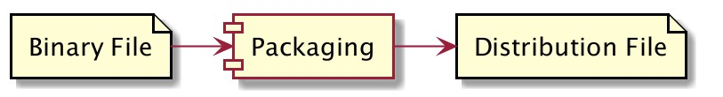
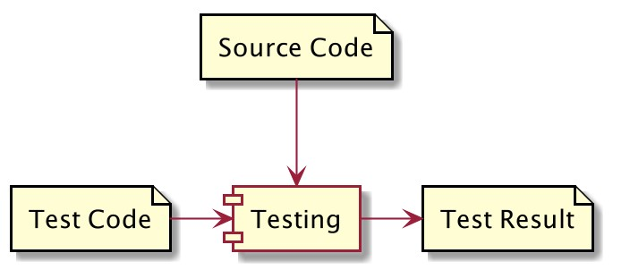
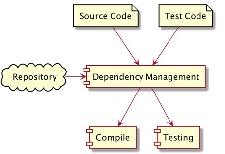
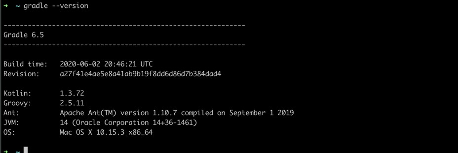
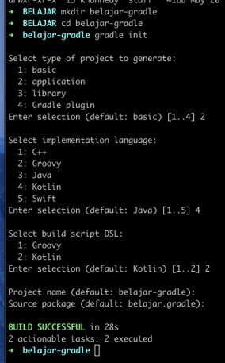
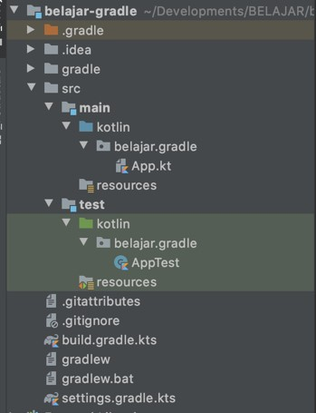
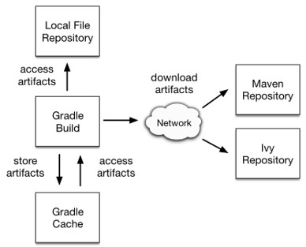
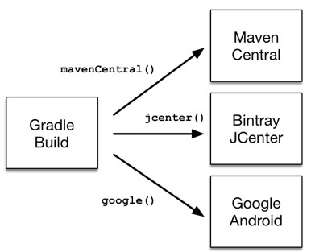

# Gradle

## #1 Pengenalan Gradle

### Pengenalan Build Automation

- Build Automation adalah proses meng-otomatisasi tahapan pembuatan software dan hal-hal yang berhubungan dengannya, seperti: kompilasi source code menjadi binary code, mem-package binary code menjadi distribution file, membuat dokumentasi, menjalankan automated test sampai manajemen dependency.

### Kompilasi Source Code


### Mem-Package Binary File



### Membuat Dokumentasi


### Menjalankan Automated Test



### Management Dependency



### Contoh Build Automation Tool

- Gradle
- Apache Maven
- Apache Ivy

### Pengenalan Gradle

- Gradle adalah salah satu build automation yang free dan open source
- Gradle menggunakan bahasa pemrograman Groovy atau Kotlin untuk mendefinisikan build script nya
- Gradle saat ini sangat populer di kalangan Developer Android
- Gradle menggunakan JVM sebagai fondasi dasar
- <https://gradle.org/>

### Teknologi yang Didukung

Gradle mendukung build automation untuk banyak teknologi, seperti :

- JVM (Java, Groovy, Kotlin, Scala)
- Android
- C++
- Swift

## #2 Menginstall Gradle

### Download Gradle

- <https://gradle.org/releases/>

### Setting Path

- Windows : <https://medium.com/programmer-zaman-now/setting-java-path-di-windows-4da2c65d8298>
- Mac & Linux

```txt
# add to .bashrc or .zshrc

export GRADLE_HOME="/Users/khannedy/Tools/gradle-6.5"
export PATH="$GRADLE_HOME/bin:$PATH"
```

### Mengecek Gradle

```sh
gradle --version
```



## #3 Membuat Project

### Menbuat Project dengan Gradle

- Gradle mendukung banyak jenis tipe project, seperti Java, Kotlin, Scala, Groovy dan lain-lain
- Saat ini Gradle banyak digunakan oleh programmer Kotlin, terutama developer Android

### Membuat Kotlin Project

- Buat folder project, lalu masuk ke folder tersebut lewat terminal, dan ketik :
- `gradle init`



## #4 Struktur Project

### Struktur Project Gradle



## #5 Gradle Task

### Task

- Perintah-perintah di gradle itu berbasis tasks
- Kita bisa menjalankan task di gradle dengan menggunakan perintah : `gradle namatask`
- Jika kita ingin melihat daftar task yang tersedia di gradle, kita bisa menggunakan perintah : `gradle tasks --all`

### Membuat Tasks

- Gradle menggunakan kotlin sebagai DSL
- Oleh karena itu, kita juga bisa membuat task menggunakan bahasa kotlin
- Kita cukup menambahkan task yang kita inginkan di file `build.gradle.kts`

### Kode: Membuat Kotlin

```kt
tasks.register("helloworld") {
	doFirst {
		println("Hello")
	}
	doLast {
		println("World")
	}
}
```

## #6 Gradle Properties

- Gradle mendukung konfigurasi menggunakan file `gradle.properties`
- Secara otomatis kita bisa mengambil data konfigurasi dari `gradle.properties`

### Kode: Gralde Properties

```txt
author=Eko Kurniawan Khannedy
```

### Kode: Menggunakan Gradle Properties

```kt
tasks.register("author") {
	val author: String by project
	doFirst {
		println(author)
	}
}

tasks.register("helloworld") {
	doFirst {
		println("Hello")
	}
}
```

## #7 Build Project

- Saat kita membuat project biasanya akan ada 2 jenis kode yang kita buat, kode program nya, dan kode testing nya
- Gradle mendukung kedua hal ini

### Menjalankan Kompilasi Program

```sh
gradle classes
```

### Menjalankan Unit Test

```sh
gradle test
```

## #8 Dependency Management

- Proyek aplikasi jarang sekali berdiri sendiri, biasanya membutuhkan dukungan dari pihak lain, seperti tool atau library
- Tanpa build tool seperti Gradle, untuk menambahkan library dari luar, kita harus melakukannya secara manual
- Gradle mendukung dependency management, dimana kita tidak perlu me-manage secara manual proses penambahkan dependency (tool atau library) ke dalam proyek aplikasi kita

### Dependency Management



### Repository



### Kode: Menambah Repository

```kt
repositories {
	// Use jcenter for resolving dependencies.
	// You can declare any Maven/ivy/file repository here.
	jcenter()
	mavenCentral()
	google()
	maven {
		url = url("https://dl.bintray.com/bliblidotcom/maven")
	}
}
```

### Dependency Configuration

Secara garis besar ada 2 jenis configuration untuk dependency di Gradle (sebenarnya masih banyak, cuma yang biasa digunakan ada 2)

- `implementation`, adalah dependency yang digunakan oleh kode program kita
- `testImplementation`, adalah dependency yang digunakan oleh kode unit test kita

### Kode: Menambah Dependency

```kt
dependencies {
	// Align versions of all Kotlin components
	implementation(platform("org.jetbrains.kotlin:kotlin-bom"))
	// Use the Kotlin JSK 8 standard library.
	implementation("org.jetbrains.kotlin:kotlin-stdlib-jdk8")
	// Use the Kotlin test library.
	testImplementation("org.jetbrains.kotlin:kotlin-test")
	// Use the Kotlin JUnit integration.
	testImplementation("org.jetbrains.kotlin:kotlin-test-junit")
	// Add coroutine.
	implementation("org.jetbrains.kotlin:kotlin-coroutines-cores:1.3.7")
}
```

### Mencari Dependency

- <https://search.maven.org/>
- <https://mvnrepository.com/>

## #9 Membuat Distribution File

- Hal terakhir yang akan kita lakukan setelah aplikasi kita selesai adalah membuat distribution file
- Distribution file ini yang nanti akan kita distribusikan untuk di install di komputer client atau server misalnya
- `gradle distTar`
- `gradle distZip`
- Hasil distribution file bisa kita lihat di direktori `build/distributions`

## #10 Multi Module Project

- Saat aplikasi kita sudah sangat besar, kadang ada baiknya kita buat aplikasi dalam bentuk modular
- Misal kita pisahkan module model, controller, view, service, repository, dan lain-lain
- Untungnya, Gradle mendukung pembuatan project multi module

### Membuat Module Baru

- Untuk membuat module baru, di dalam project yang sudah ada, kita hanya tinggal membuat folder baru, lalu buat gradle project baru menggunakan perintah gradle init

### Menambahkan Module ke Project Utama

```kt
rootProject.name = "belajar-gradle"

include("belajar-gradle-library")
```

### Menambahkan Modul ke Dependency

```kt
dependencies {
	// Align versions of all Kotlin components
	implementation(platform("org.jetbrains.kotlin:kotlin-bom"))
	// Use the Kotlin JSK 8 standard library.
	implementation("org.jetbrains.kotlin:kotlin-stdlib-jdk8")
	// Use the Kotlin test library.
	testImplementation("org.jetbrains.kotlin:kotlin-test")
	// Use the Kotlin JUnit integration.
	testImplementation("org.jetbrains.kotlin:kotlin-test-junit")
	// Add coroutine.
	implementation("org.jetbrains.kotlin:kotlin-coroutines-core:1.3.7")

	// add subprojects
	implementation(project(":belajar-gradle-library"))
}
```

### Menjalankan Task untuk Modul

Untuk menjalankan task spesifik untuk module tertentu, kita bisa menambahkan nama module diikuti dengan `:namatasks`, misal :

```sh
gradle namamodule:nama-task
```

### Materi Selanjutnya

Yang bisa Anda lakukan :

- Mulai Membuat Aplikasi Java / Kotlin

Materi Selanjutnya :

- Kotlin Unit Test
