# HTTP

## Agenda

- Pengenalan HTTP
- URL
- HTTP Method
- HTTP Header
- HTTP Body
- HTTP Response
- HTTP Cookie
- Dan lain-lain

## #1 Pengenalan HTTP

- HTTP singkatan dari Hypertext Transfer Protocol
- HTTP merupakan protokol untuk melakukan transmisi hypermedia document, seperti HTML, JavaScript, CSS, Image, Audio, Video dan lain-lain
- HTTP awalnya di desain untuk komunikasi antara Web Browser dan Web Server, namun saat ini sering juga digunakan untuk kebutuhan lain

### Client Server

- HTTP mengikuti arsitektur client dan server
- Client mengirimkan HTTP Request untuk meminta atau mengirim informasi ke server
- Dan server membalasnya dengan HTTP Response dari HTTP Request yang diterima

### Diagram Client Server

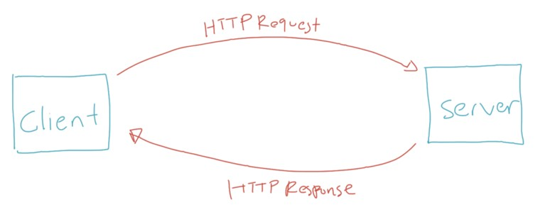

### Plain Languagre and Human Readable

HTTP didesain menggunakan bahasa yang mudah dimengerti oleh bahasa manusia, seperti :

- `GET`
- `POST`
- `PUT`
- `DELETE`
- `HEAD`
- `OPTION`

### Stateless

- HTTP merupakan protokol yang stateless
- Artinya tiap HTTP Request merupakan request yang independen, tidak ada keterkaitan atau hubungan dengan HTTP Request sebelum atau setelah nya
- Hal ini dilakukan agar HTTP Request tidak harus dilakukan dalam sequence, sehingga client bisa melakukan HTTP Request secara bebas tanpa ada aturan harus dimulai dari mana

### Session

- Jika HTTP merupakan protokol yang stateless, bagaimana dengan session? Misal client harus login terlebih dahulu sebelum berinteraksi?
- Untuk menangani permasalahan seperti ini, HTTP memiliki fitur yang bernama HTTP Cookie
- HTTP Cookie memaksa client menyimpan informasi yang diberikan oleh server

## #2 HTTP Version

- Spesifikasi HTTP selalu diperbaharui
- Saat ini, kebanyakan web berjalan di HTTP/1.1 atau HTTP2
- HTTP2 mulai hadir sekitar tahun 2015, dan saat ini sudah banyak diadopsi oleh semua Web di Dunia

### HTTP/1.1 vs HTTP/2

- Saat ini `HTTP/1.1` merupakan fallback protocol, dimana Web Browser secara default akan melakukan request menggunakan `HTTP/2`, jika web server tidak mendukung, maka web browser akan melakukan fallback ke protocol `HTTP/1.1`
- Secara garis besar, spesifikasi `HTTP/2` sama dengan `HTTP/1.1`, yang membedakan adalah pada `HTTP/2`, HTTP Request yang dikirim dalam bentuk teks, secara otomatis menjadi binary, sehingga lebih cepat dibandingkan `HTTP/1.1`
- Selain itu di `HTTP/2`, menggunakan algoritma kompresi untuk memperkecil request dan mendukung multiplexing, sehingga bisa mengirim beberapa request dalam satu connection yang sama
- Dari sisi pembuatan aplikasi, tidak ada perbedaan, semua ini biasanya sudah diurus secara otomatis oleh Web Server yang kita gunakan

### HTTPS

- Secara default, HTTP tidaklah aman
- HTTPS merupakan HTTP dengan enkripsi
- Perbedaan HTTP dan HTTPS adalah, pada HTTPS menggunakan SSL (Secure Sockets Layer) untuk melakukan enkripsi HTTP Request dan HTTP Response
- Hasilnya HTTPS jauh lebih aman dibanding dengan HTTP biasa
- Web yang menggunakan HTTPS akan menggunakan `https://` pada url nya, dan yang hanya menggunakan HTTP tanpa enkripsi, akan menggunakan `http://`

## #3 HTTP Terminology

- Saat kita belajar HTTP, ada banyak sekali menggunakan terminologi, istilah atau teknologi
- Dan kita perlu mengerti tentang hal tersebut

### Web Browser

- Merupakan aplikasi yang digunakan untuk mengakses Web menggunakan protokol HTTP
- Contohnya aplikasi Google Chrome, Firefox, Opera, Safari, dan lain-lain

### TCP

- TCP singkatan dari Transmission Control Protocol, adalah salah satu protokol dalam jaringan komputer yang biasa digunakan oleh web, email, FTP atau lainnya
- Jika kita menggunakan jaringan internet, kemungkinan besar kita akan menggunakan protocol TCP untuk melakukan koneksi jaringan nya

### IP

- IP singkatan dari Internet Protocol
- IP digunakan sebagai identitas komputer di jaringan
- Setiap komputer baik itu client dan server akan memiliki IP
- Untuk mengecek IP jaringan kita di internet, contohnya kita bisa mengakses web <https://whatismyipaddress.com/>

### URL

- URL singkatan dari Uniform Resource Locator
- URL merupakan alamat dari sebuah resource di Web

### DNS

- DNS singkatan dari Domain Name Server
- DNS merupakan tempat yang berisi data katalog pemetaan antara nama domain di URL menuju lokasi IP komputer
- Saat Web Browser mengakses sebuah domain di web, sebenarnya prosesnya akan bertanya ke DNS untuk mendapatkan IP, lalu Web Browser akan melakukan request ke IP tersebut
- Untuk mengecek IP sebuah domain, kita bisa gunakan website <https://www.whatismyip.com/dns-lookup/>

### Web Server

- Web Server merupakan aplikasi yang berjalan di jaringan Internet yang bertugas sebagai server
- Web Server berisi informasi dan data yang biasa diakses oleh client
- Web Server akan menerima request dari client, dan membalas request tersebut berupa informasi yang diminta oleh client

## #4 HTTP Flow

- Bagaimana alur kerja HTTP?
- Dalam HTTP, biasanya terdapat dua pihak yang terlibat, yaitu Client dan Server
- Client akan mengirimkan Request
- dan Server akan menerima Request dan membalas dengan Response

### Server

- Server merupakan sebuah komputer, dimana semua informasi disimpan pada komputer tersebut
- Komputer server biasanya menjalankan aplikasi Web Server agar bisa menerima protocol HTTP

### Diagram HTTP Flow

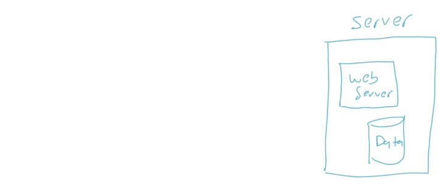

### Client

- Client merupakan komputer yang bertugas mengirim HTTP Request ke komputer Server
- Untuk mengirim request HTTP, biasanya client akan menggunakan aplikasi Web Browser
- Client dan Server harus terkoneksi dalam jaringan yang sama, agar bisa berkomunikasi
- Misal saja, client dan server terhubung dalam jaringan internet

### Diagram HTTP Flow

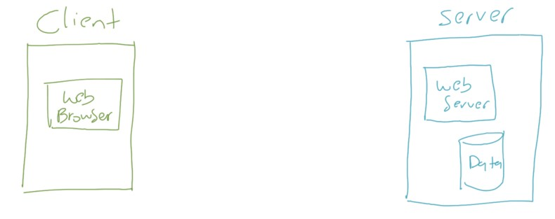

### Request

- Client akan mengirim request ke Server dalam bentuk HTTP Request
- HTTP Request berisikan informasi seperti lokasi resource, data yang dikirim jika ada, dan lain-lain
- HTTP Request akan diterima oleh Server
- Selanjutnya Server akan memproses request yang diminta oleh Client tersebut

### Diagram HTTP Flow

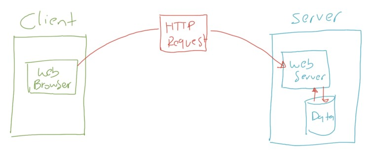

### Response

- Setelah Server memproses HTTP Request yang dikirim oleh Client
- Server akan membahas dengan HTTP Response
- HTTP Response biasanya berisikan data yang diminta oleh Client dalam HTTP Request

### Diagram HTTP Flow

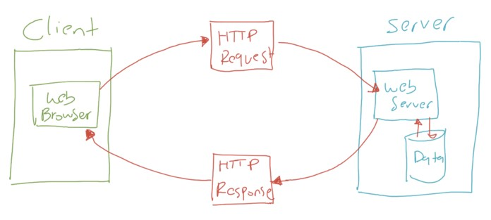

## #5 Browser Network Tool

- Untuk lebih mempermudah melihat apa yang dilakukan di belakang Web Browser, biasanya Web Browser memiliki fitur Network Tool
- Contohnya di browser seperti Google Chrome dan Firefox sudah memiliki Network Tool
- Dengan Network Tool, kita bisa melihat semua detail HTTP Request dan HTTP Response yang dilakukan oleh Client dan Server

### Tugas

- Buka website <https://www.programmerzamannow.com>
- Lalu lihat informasi HTTP Request dan HTTP Response yang terjadi menggunakan Network Tool yang terdapat di Web Browser yang kita gunakan

## #6 HTTP Request dan Response

### HTTP Message

- HTTP Request dan HTTP Response, sebenarnya adalah sebuah HTTP Message
- HTTP Message memiliki standarisasi format
- Dengan demikian, jika kita ingin membuat Client dan Server sendiri, sebenarnya bisa kita lakukan, asal kita mengikuti standarisasi format HTTP Message

### HTTP Message untuk Request

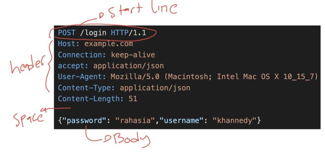

### HTTP Message untuk Response

## #7 HTTP Method

- Dalam HTTP Request, hal yang pertama kita perlu tentukan adalah HTTP Method
- HTTP Method mirip seperti kategori request
- Ada banyak HTTP Method yang dapat kita gunakan ketika membuat HTTP Request, dan kita bisa sesuaikan sesuai dengan kebutuhan yang kita inginkan

### HTTP Message

### Jenis HTTP Method

| HTTP Method | Keterangan                                                                                                                                                                                                                                                  |
| ----------- | ----------------------------------------------------------------------------------------------------------------------------------------------------------------------------------------------------------------------------------------------------------- |
| `GET`       | GET method digunakan untuk melakukan request data. Request menggunakan GET hanya untuk menerima data, bukan untuk mengirim data                                                                                                                             |
| `HEAD`      | HEAD method digunakan sama seperti dengan GET, tapi tanpa membutuhkan response body                                                                                                                                                                         |
| `POST`      | POST method digunakan untuk mengirim data ke Server, biasanya POST digunakan untuk mengirim data baru sehingga biasanya memiliki request body                                                                                                               |
| `PUT`       | PUT method digunakan untuk mengganti semua data yang terdapat di Server dengan data baru yang dikirim di request                                                                                                                                            |
| `DELETE`    | DELETE method digunakan untuk menghapus data                                                                                                                                                                                                                |
| `PATCH`     | PATCH method digunakan untuk mengubah sebagaian data                                                                                                                                                                                                        |
| `OPTIONS`   | OPTIONS method digunakan untuk mendeskripsikan opsi komunikasi yang tersedia                                                                                                                                                                                |
| `TRACE`     | TRACE method merupakan request method untuk debugging. Response TRACE method akan mengembalikan seluruh informasi yang dikirim oleh Client. Saat membuat web, sangat direkomendasikan untuk tidak mengaktifkan TRACE method ketika sudah live di production |

## #8 URL

- URL singkatan dari Uniform Resource Locator
- URL merupakan alamat dari sebuah resource di Web
- URL wajib kita gunakan untuk menuju informasi resource yang akan kita tuju dalam Web
- Tanpa URL, Client atau Server tidak akan mengerti informasi apa yang ingin kita cari

### Anatomi URL

- URL terdiri dari beberapa bagian
- Beberapa bagian wajib ada, beberapa bagian tidak wajib ada
- Berikut adalah contoh URL :
  - <https://www.programmerzamannow.com/>
  - <https://www.programmerzamannow.com/premium-membership>
  - <https://www.programmerzamannow.com/?search=java>

### Schema

- Bagian awal di URL adalah schema yang mengindikasikan protocol yang perlu digunakan oleh Client
- Biasanya dalam URL website, schema protocol tersebut adalah http dan https

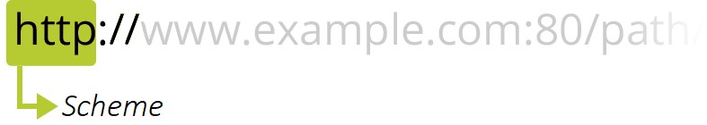

### Authority

- Selanjutnya, dipisahkan dengan tanda `://` diikuti dengan authority, yang terdiri dari nama domain dan nomor port yang dipisah menggunakan titik dua
- Nama domain nanti akan ditanyakan ke DNS untuk mendapatkan alamat IP nya
- Namun kita juga bisa langsung menggunakan IP jika memang website tersebut tidak memiliki nama domain
- Nomor port tidak wajib, tanpa nomor port, secara default bernilai 80 untuk http, dan 443 untuk https

### Path

- Selanjutnya setelah Authority, bagian selanjutnya adalah tidak wajib, yaitu Path
- Path biasanya berisikan informasi menuju ke resource yang kita tuju
- Path terlihat seperti kumpulan folder dan diakhiri dengan file yang ingin kita akses

### Parameters

- Selanjutnya, dalam URL juga bisa terdapat informasi parameters, namun ini tidak wajib
- Parameter dipisah oleh karakter `?` setelah Authority atau Path
- Parameter merupakan informasi tambahan yang berisi `key=value`, jika ingin menambahkan lebih dari satu parameter, kita bisa tambahkan parameter dengan menggunakan karakter `&`

### Anchor

- Anchor merupakan merupakan bagian yang tidak wajib di URL
- Anchor merupakan representasi bookmark dalam sebuah halaman website
- Misal jika dalam website terdapat banyak sekali bagian informasi, kita bisa gunakan anchor sebagai bookmark ke tiap bagian informasi tersebut agar lebih mudah diakses

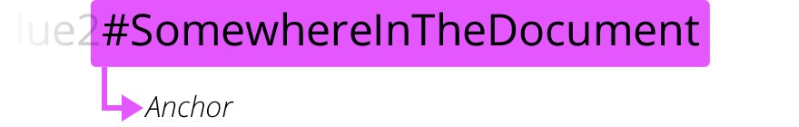

## #9 HTTP Header

- HTTP Header merupakan informasi tambahan yang biasa dikirim di Request atau Response
- HTTP Header biasanya digunakan agar informasi tidak harus dikirim melalui Request Body atau Response Body
- HTTP Header berisi `key : value`, dan saat ini sudah banyak sekali standarisasi nama key pada HTTP Header
- <https://en.wikipedia.org/wiki/List_of_HTTP_header_fields>

### HTTP Message

### Contoh HTTP Header

| HTTP Header     | Keterangan                                                |
| --------------- | --------------------------------------------------------- |
| `Host`          | Authority pada URL (wajib sejak versi HTTP/1.1)           |
| `Content-Type`  | Tipe data dari HTTP Body                                  |
| `User-Agent`    | Informasi user agent (seperti browser dan sistem operasi) |
| `Accept`        | Tipe data yang diterima oleh Client                       |
| `Authorization` | Credential untuk autentikasi (misal useername + password) |

## #10 HTTP Status

- HTTP Status merupakan kode HTTP Response yang mengindikasikan apakah sebuah request yang diterima Server sukses, gagal atau ada hal lain yang harus diketahui oleh Client
- HTTP status diklasifikasikan dalam lima grup, yaitu :
- Informational Response (100-199)
- Successful Response (200-299)
- Redirect (300-399)
- Client Error (400-499)
- Server Error (500-599)
- <https://en.wikipedia.org/wiki/List_of_HTTP_status_codes>

### HTTP Response

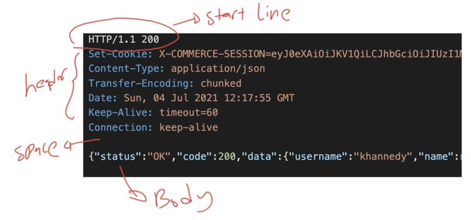

### Informational Response (100-199)

- Informational response mengindikasi bahwa request telah diterima dan dimengerti
- Namun client diminta untuk menunggu tahapan akhir response
- Pada kenyataannya, informational response sangat jarang sekali digunakan
- <https://developer.mozilla.org/en-US/docs/Web/HTTP/Status#information_responses>

### Successful Response (200-299)

- Successful Response merupakan kode yang mengindikasi bahwa request yang dikirim oleh client telah diterima, dimengerti dan sukses diproses oleh Server
- <https://developer.mozilla.org/en-US/docs/Web/HTTP/Status#successful_responses>

### Redirect (300-399)

- Redirect status code mengindikasi bahwa client harus melakukan aksi selanjutnya untuk menyelesaikan request
- Biasanya redirect status code digunakan ketika lokasi sebuah resource berubah, sehingga Server meminta Client untuk berpindah ke URL lain
- <https://developer.mozilla.org/en-US/docs/Web/HTTP/Status#redirection_messages>

### Client Error (400-499)

- Client error status code merupakan indikasi bahwa request yang dikirim oleh Client tidak diterima oleh Server dikarenakan request yang dikirim dianggap tidak valid
- Contohnya client mengirim body yang salah, client melakukan request ke tanpa autentikasi di resource yang mewajibkan autentikasi, dan lain-lain
- <https://developer.mozilla.org/en-US/docs/Web/HTTP/Status#client_error_responses>

### Server Error (500-599)

- Server error status code mengindikasi bahwa terjadi kesalahan di Server
- Biasanya ini terjadi ketika ada masalah di Server, seperti misalnya tidak bisa terkoneksi ke basis data, terdapat jaringan error di server, dan lain-lain
- <https://developer.mozilla.org/en-US/docs/Web/HTTP/Status#server_error_responses>

## #11 HTTP Body

- HTTP Body merupakan data yang bisa dikirim di HTTP Request, atau data yang diterima dari HTTP Response
- Artinya client bisa mengirim data ke server menggunakan HTTP Body, begitu juga sebaliknya
- Server bisa memberikan body di response menggunakan HTTP Body

### HTTP Response

### Content-Type

- HTTP Body erat kaitannya dengan Header key Content-Type
- Biasanya agar client dan server mudah mengerti isi HTTP Body, HTTP Message akan memiliki Header Content-Type, yang berisi informasi tipe data HTTP Body
- HTTP Body bisa berisikan teks (html, javascript, css, json) atau binary (image, video, audio)
- Data Content-Type sudah memiliki standarisasi, misal nya bisa kita lihat di link berikut : <https://developer.mozilla.org/en-US/docs/Web/HTTP/Basics_of_HTTP/MIME_types/Common_types>

## #12 Redirect

- Seperti yang sudah dijelaskan pada materi HTTP Status, untuk memaksa client melakukan redirect ke halaman lain, kita bisa menggunakan http redirect status code (300-399)
- Lantas pertanyaannya, dari mana client tahu, harus melakukan redirect ke URL mana?
- Oleh karena itu, biasanya response HTTP Status redirect, selalu dibarengi dengan informasi URL redirectnya, dan itu disimpan pada header Location

### Contoh HTTP Response Redirect

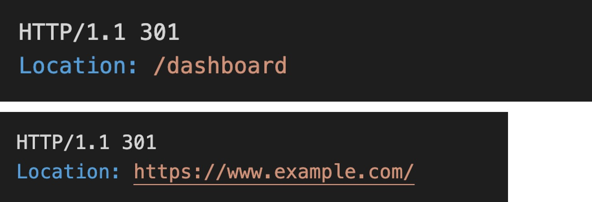

## #13 HTTP Cookie

### Stateless

- HTTP didesain stateless, artinya tiap request yang dilakukan, dia tidak tahu request sebelumnya atau selanjutnya yang akan dilakukan
- Lantas pertanyaannya, bagaimana Server tahu, kalo Client sudah login sebelum mengakses halaman tertentu?
- Hal ini, biasanya menggunakan fitur HTTP Cookie

### HTTP Cookie

- HTTP Cookie merupakan informasi yang diberikan oleh server, dan client secara otomatis akan menyimpan data tersebut, contohnya di Web Browser
- Ketika Web Browser melakukan request selanjutnya, maka Web Browser akan menyisipkan cookie yang sudah diterima di request sebelumnya
- Dari cookie tersebut, Server bisa mengetahui apakah request tersebut merupakan request client yang sudah login atau belum

### Contoh Penggunaan HTTP Cookie

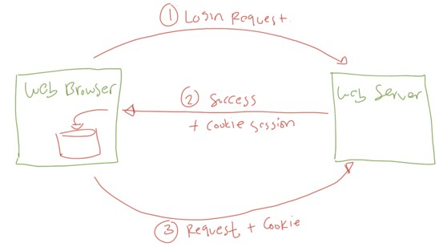

### Contoh di HTTP Response

- Informasi cookie yang diberikan dari Server, ditempatkan pada Header dengan value Set-Cookie
- Cookie bisa lebih dari satu, jika kita Server memberikan lebih dari satu cookie, bisa menggunakan beberapa key Set-Cookie di Header

### Contoh Cookie di HTTP Response

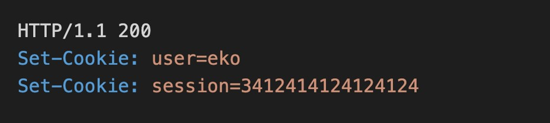

### Cookie di HTTP Request

- Setelah cookie dari HTTP Response diterima oleh Web Browser, maka akan disimpan di Web Browser
- Selanjutnya HTTP Request selanjutnya akan mengirim cookie di tiap request, dimana cookie yang dikirim bisa menggunakan Header dengan nama Cookie
- Berbeda dengan HTTP Response, untuk HTTP Request, Cookie harus digabung di satu header jika lebih dari satu Cookie

### Contoh Cookie di HTTP Request

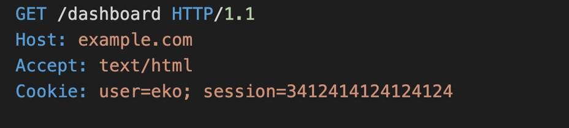

### Cookie Attributes

- Cookie memiliki atribut yang bisa ditambahkan ketika membuat cookie di HTTP Response
- Seperti masa berlaku cookie, apakah harus https, apakah tidak boleh diakses via script, dan lain-lain
- <https://developer.mozilla.org/en-US/docs/Web/HTTP/Headers/Set-Cookie>

## #14 HTTP Caching

- HTTP memiliki fitur yang bernama caching
- Caching adalah menyimpan data di client sampai batas waktu yang sudah ditentukan, sehingga jika client ingin melakukan request resource yang sama, cukup ambil resource nya di client, tanpa harus meminta ulang ke server
- HTTP Caching sangat cocok dilakukan untuk resource file static yang jarang berubah, seperti file gambar, audio, video dan lain-lain

### Diagram HTTP Caching

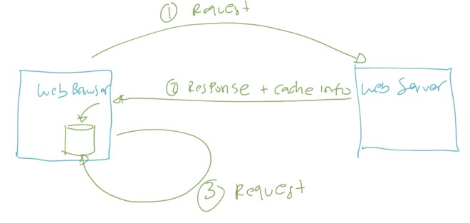

### Header Cache Control

- Server ketika meminta agar client melakukan caching, maka HTTP Response perlu menambahkan informasi Cache-Control di Header
- Cache-Control berisi informasi seperti berapa lama client bisa menyimpan data response tersebut, sehingga tidak perlu meminta ulang ke server
- <https://developer.mozilla.org/en-US/docs/Web/HTTP/Headers/Cache-Control>

## #15 Teknologi Lainnya

- Server-Sent Event
- WebSocket
- Cross-Origin Resource Sharing
- RESTful API
- OAuth
