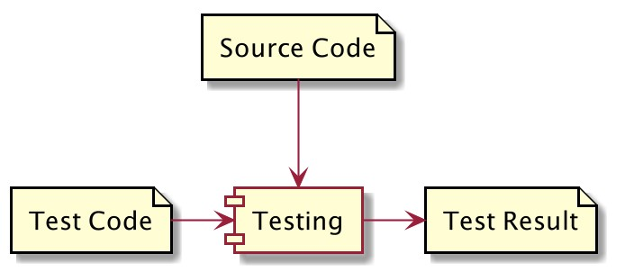
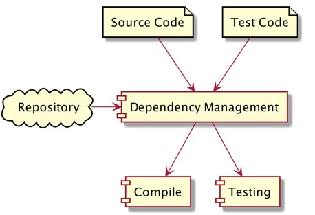

# Java Apache Maven

## Sebelum Belajar

- Java Dasar
- Java Object Oriented Programming

## Agenda

- Pengenalan Build Automation
- Pengenalan Apache Maven
- Membuat Project Maven
- Maven Lifecycle
- Build Project
- Dependency Management
- Multi-Module Project
- Dan lain-lain

## #1 Pengenalan Build Automation

- Build Automation adalah proses meng-otomatisasi tahapan pembuatan software dan hal-hal yang berhubungan dengannya, seperti: kompilasi source code menjadi binary code, mem-package binary code menjadi distribution file, membuat dokumentasi, menjalankan automated test sampai manajement dependency

### Kompilasi Source Code


### Mem-Package Binary File


### Membuat Dokumentasi


### Menjalankan Automated Test



### Management Dependency



### Contoh Build Automation Tool

- Apache Maven
- Apache Ivy
- Gradle

## #2 Pengenalan Apache Maven

- Apache Maven adalah salah satu build automation yang free dan open source
- Apache menggunakan XML untuk mendefinisikan build script nya
- Apache Maven saat ini sangat populer di kalangan Developer Java
- Apache Maven menggunakan JVM sebagai fondasi dasar
- <https://maven.apache.org/>

### Teknologi yang Didukung

Apache Maven mendukung build automation untuk banyak teknologi, seperti:

- Java
- Kotlin
- Groovy
- Scala
- dan lain-lain

## #3 Menginstall Apache Maven

### Download Maven

- <https://maven.apache.org/download.cgi>

### Setting Path

- Windows:
- Mac & Linux

```bash
# add to .bashrc or .zshrc

export MAVEN_HOME="/usr/local/Cellar/maven/3.6.3_1"
export PATH="$MAVEN_HOME/bin:$PATH"
```

### Mengecek Apache Maven

```bash
> mvn --version
```

## #4 Membuat Project

### Archetype

- Maven mendukung pembuatan berbagai macam project dengan mudah
- Pembuatan project di maven menggunakan archetype, archetype adalah template project
- Kita bisa menggunakan yang sudah disediakan oleh maven, atau bahkan bisa membuat template archetype sendiri
- <https://maven.apache.org/guides/introduction/introduction-to-archetypes.html>

### Membuat Java Project

- mvn archetype:generate
- maven-archetype-quickstart

### Struktur Project


## #5 Maven Lifecycle

### Lifecycle

- Maven bekerja dalam konsep lifecycle
- Untuk menjalankan lifecycle, kita bisa menggunakan perintah : `mvn namalifecycle`
- Lifecycle akan menjalankan banyak plugin, entah bawaanmaven, atau bisa kita tambahkan plugin lain jika mau
- <https://maven.apache.org/guides/introduction/introduction-to-the-lifecycle.html>

### Contoh Lifecycle

- clean, menhapus folder target (tempat menyimpan hasil kompilasi)
- compile, untuk melakukan kompilasi source code project
- test-compile, untuk menjalankan kompilasi source code project
- test, untuk menjalankan unit test
- package, untuk membuat destribution file aplikasi
- install, untuk menginstall project ke local repository, sehingga bisa digunakan di project lain di local
- deploy, deploy project ke remote repository di server

## #6 Build Project

- Saat kita membuat project biasanya akan ada 2 jenis kode yang kita buat, kode program nya, dan kode testing nya
- Maven mendukung hal tersebut

### Menjalankan Kompilasi Program

> `mvn compile`

### Menjalankan unit Test

> `mvn test`

### Mem-package Project

> `mvn package`

## #7 Dependency

- Proyek aplikasi jarang sekali berdiri sendiri, biasanya membutuhkan dukungan dari pihak lain, sperti tool atau library
- Tanpa build tool seperti Apache Maven, untuk menambahkan library dari luar, kita harus melakukannya secara manual
- Apache Maven mendukung dependency management, dimana kita tidak perlu me-manage secara manual proses menambahkan dependency (tool atau library) ke dalam proyek aplikasi kita

### Dependency Scoop

Saat kita menambahkan dependency ke proect Maven, kita harus menentukan scope dependency tersebut, ada banyak scope yang ada di Maven, namun sebenarnya hanya beberapa saja yang sering kita gunakan, seperti

- compile, ini adalah scope default. Compile artinya dependency tersebut akan digunakan untuk build project, test project dan menjalankan project
- test, ini adalah scope untuk test project, hanya akan di include di bagian test project

### Kode : Menambahkan Dependency

```xml
<dependencies>
	<dependency>
		<groupId>junit</groupId>
		<artifactId>junit</artifactId>
		<version>3.11</version>
		<scope>test</scope>
	</dependency>
</dependencies>
```

### Mencari Dependency

- <https://search.maven.org>
- <https://mavenrepository.com>

### Repository


### Kode : Menambah Repository

```xml
<repositories>
	<repository>
		<id>bintray-bliblidotcom-maven</id>
		<name>bintray</name>
		<url>https://dl.bintray.com/bliclidotcom/maven</url>
	</repository>
</repositories>
```

## #8 Meven Properties

- Maven mendukung properties untuk menyimpan data konfigurasi
- Fitur ini akan sangat memudahkan kita kedepannya, dibandingkan melakukan hardcode di konfigurasi maven

### Kode : Properties

```xml
<properties>
	<project.build.sourceEncoding>UTF-8</project.build.sourceEncoding>
	<maven.compiler.source>14</maven.compiler.source>
	<maven.compiler.target>14</maven.compiler.target>
	<junit.version>4.6.2</junit.version>
</properties>
```

## #9 Membuat Distribution File

- Secara default, maven mendukung pembuatan disribution file menggunakan lifecycle package
- Hanya saja, hasil distribution file nya berupa file jar berisikan binary code dari project kita
- Dependency lainnya tidak dimasukan, sehingga tidak bisa langsung dijalankan

### Menggunakan Assembly Plugin

- Selah satu plugin yang bisa kita gunakan untuk membuat destribution file beserta dependency yang kita butuhkan adalah Assembly Plugin
- <https://maven.apache.og/plugins/maven-assembly-plugin/usage.html>
- Tidak hanya Assembly Plugin, sebenarnya masih banyak plugin lain yang bisa kita gunakan untuk membuat distribution file di Maven
- Untuk membuat distribution file, kita bisa menggunakan perintah `mvn package assembly:single`

### Kode : Menambahkan Assembly Plugin

```xml
<plugin>
	<artifactId>maven-assembly-plugin</artifactId>
	<version>3.3.0</version>
	<configuration>
		<descriptorRefs>
			<descriptorRef>jar-with-dependencies</descriptorRef>
		</descriptorRefs>
		<archive>
			<manifest>org.sample.App</manifest>
		</archive>
	</configuration>
	<executions>
		<execution>
			<id>make-assembly</id>
			<phase>package</phase>
			<goals>
				<goal>single</goal>
			</goals>
	</executions>
</plugin>
```

## #10 Multi Module Project

- Ssat aplikasi kita sangat besar, kadang ada baiknya kita buat aplikasi dalam bentuk modular
- Misal kita pisahkan module model, controller, view, service, repository dan lain-lain
- Untungnya, Maven mendukung pembuatan project multi module

### Membuat Module Baru

- Untukmembuat module baru, di dalam project yang sudah ada, kita hanya tinggal membuat folder baru, lalu menambahkan setting pom.xml di folder tersebut
- Module harus memiliki parent, dimana parent nya adalah project diatas folder tersebit
- Selanjutnya, di parent nya pun, module harus di include

### Konfigurasi Module

```xml
<project>
	...
	<parent>
		<artifactId>belajar-maven</artifactId>
		<groupId>programmer-zaman-now</groupId>
		<version>1.0-SNAPSHOT</version>
	</parent>
	<modelVersion>4.0.0</modelVersion>

	<artifactId>belajar-maven-data</artifactId>

</project>
```

### Konfigurasi Parent

```xml
...
	<modelVersion>4.0.0</modelVersion>

	<groupId>programmer-zaman-now</groupId>
	<artifactId>belajar-maven</artifactId>
	<packaging>pom</packaging>
	<version>1.0-SNAPSHOT</version>
	<modules>
		<module>belajar-maven-data</module>
		<module>belajar-maven-app</module>
	</modules>

	<name>belajar-maven</name>
...
```

### Include Antar Module

```xml
...
	<dependencies>
		<dependency>
			<groupId>programmer-zaman-now</groupId>
			<artifactId>belajar-maven-data</artifactId>
			<version>${project.version}</version>
		</dependency>
	</dependencies>
</project>
```

## #11 Dependency Management

- Saat project kita sudah besar, kadang kita sering menggunakan banyak dependency
- Masalah dengan banyaknya dependency adalah, jika kita salah menggunakan dependency yang sama namun versinya berbeda-beda
- Maven mendukung fitur dependency management, dimana kita bisa memasukkan daftar dependency di parent module beserta verinya, lalu menambahkan dependency tersebut di module tanpa harus menggunakan versinya
- Secara otomatis versi dependency akan sama dengan yang ada di dependency management di parent module

### Dependency Management di Parent

```xml
<dependencyManagement>
	<dependencies>
		<dependency>
			<groupId>programmer-zaman-now</groupId>
			<artifactId>belajar-maven-data</artifactId>
			<version>${project.version}</version>
		</dependency>
		<dependency>
			<groupId>junit</groupId>
			<artifactId>junit</artifactId>
			<version>${junit.version}</version>
			<scope>test</scope>
		</dependency>
		<dependency>
			<groupId>com.google.code.gson</groupId>
			<artifactId>gson</artifactId>
			<version>${gson.version}</version>
		</dependency>
	</dependencies>
</dependencyManagement>
```

### Dependency di Module

```xml
...
	<dependencies>
		<dependency>
			<groupId>programmer-zaman-now</groupId>
			<artifactId>belajar-maven-data</artifactId>
		</dependency>
		<dependency>
			<groupId>com.google.code.gson</groupId>
			<artifactId>gson</artifactId>
		</dependency>
		<dependency>
			<groupId>junit</groupId>
			<artifactId>junit</artifactId>
			<scope>test</scope>
		</dependency>
	</dependencies>
...
```

## #12 Materi Selanjutnya

- Java Unit Test
- Java Stream
- Java Database
