# Java Collection

## Sebelum Belajar

- Java Dasar
- Java Object Oriented Programming
- Java Standard Classes
- Java Generic

## Agenda

- Pengenalan Collection
- Iterable
- List
- Set
- Queue
- Deque
- Map
- Dan lain-lain

## #1 Pengenalan Collection

- Collection adalah hal umum yang biasa dimiliki di bahasa pemrograman, seperti PHP, Python, Ruby dan lain-lain
- Collection atau kadang disebut container, adalah object yang mengumpulkan atau berisikan data-data, mirip seperti Array
- Java telah menyediakan class-class collection yang sudah bisa langsung kita gunakan, tanpa tambahan library
- Semua class-class collection di Java adalah generic class, sehingga kita bisa menggunakan Java collection dengan data apapun

### Java Collection

Java collection telah menyediakan semuanya yang berhubungan dengan collection, sehingga kita hanya cukup tinggal menggunakannya

- Interfaces, ini adalah contract representasi dari collection. Semua collection di Java memiliki kontrak interface, sehingga jika kita mau, kita juga bisa membuat implementasinya sendiri
- Implementations, tidak perlu khawatir, kita juga bisa menggunakan implementasi yang sudah dibuat oleh Java, semua interface collection sudah ada implementasi class nya di Java collection
- Algorithms, Java juga sudah menyediakan algoritma-algoritma yang umum digunakan di collection, seperti pencarian dan pengurutan data di collection

### Java Collection Interface

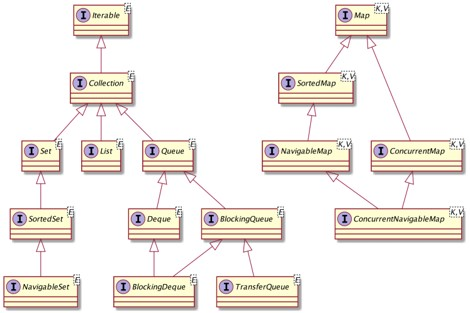

## #2 Iterable & Iterator Interface

### Iterable Interface

- Iterable adalah parent untuk semua collection di Java, kecuali Map
- Iterable sendiri sangat sederhana, hanya digunakan agar mendukung for-each loop
- Karena semua collection pasti implement iterable, secara otomatis maka semua collection di Java mendukung perulangan for-each, jadi bukan cuma Array

### Kode : Iterable

```java
public class IterableApp {
	public static void main(String[] args) {
		Iterable<String> names = List.of("Eko", "Kurniawan", "Khannedy");

		for (var name: names) {
			System.out.println(name);
		}
	}
}
```

### Iterator Interface

- Tidak ada magic di Java, sebenarnya for-each di Iterable bisa terjadi karena ada method iterator() yang mengembalikan object Iterator
- Iterator adalah interface yang mendefinisikan cara kita melakukan mengakses element di collection secara sequential
- For-each sendiri muncul sejak Java 5, sebelum Java 5 untuk melakukan iterasi collection, biasanya dilakukan manual menggunakan Iterator object

### Kode : Iterator

```java
public class IteratorApp {
	public static void main(String[] args) {
		Iterable<String> names = List.of("Eko", "Kurniawan", "Khannedy");
		Iterator<String> iterator = names.iterator();

		while (iterator.hasNext()) {
			String name = iterator.next();
			System.out.println(name);
		}
	}
}
```

## #3 Collection Interface

- Selain Iterable interface, parent class semua collection di Java adalah Collection
- Kalo Iterable interface digunakan sebagai kontrak untuk meng-iterasi data secara sequential
- Collection merupakan kontrak untuk memanipulasi data collection, seperti menambah, menghapus dan mengecek isi data collection
- Tidak ada direct implementation untuk Collection, karena collection nanti akan dibagi lagi menjadi List, Set dan Queue

### Method di Collection

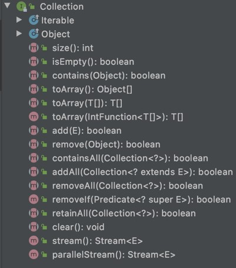

### Kode : Menambah Data ke Collection

```java
public class CollectionApp {
	public static void main(String[] args) {
		Collection<String> names = new ArrayList<>();
		names.add("Eko");
		names.add("Kurniawan");
		names.addAll(Arrays.asList("Kurniawan", "Programmer", "Zaman", "Now"));

		for (var name: names) {
			System.out.println(name);
		}
	}
}
```

### Kode : Menghapus Data ke Collection

```java
public class CollectionApp {
	public static void main(String[] args) {
		Collection<String> names = new ArrayList<>();
		names.add("Eko");
		names.add("Kurniawan");
		names.addAll(Arrays.asList("Kurniawan", "Programmer", "Zaman", "Now"));

		names.remove("Eko");
		names.removeAll(Arrays.asList("Zaman", "Programmer"));

		for (var name: names) {
			System.out.println(name);
		}
	}
}
```

### Kode : Mengecek Data ke Collection

```java
public class CollectionApp {
	public static void main(String[] args) {
		Collection<String> names = new ArrayList<>();
		names.add("Eko");
		names.add("Kurniawan");
		names.addAll(Arrays.asList("Kurniawan", "Programmer", "Zaman", "Now"));

		System.out.println(names.contains("Khannedy"));
		System.out.println(names.containsAll(Arrays.asList("Eko", "Now")));

		names.remove("Eko");
		names.removeAll(Arrays.asList("Zaman", "Programmer"));

		System.out.println(names.contains("Eko"));
		System.out.println(names.containsAll(Arrays.asList("Eko", "Now")));
	}
}
```

## #4 List Interface

- List adalah struktur data collection yang memiliki sifat sebagai berikut
  - Elemen di list bisa duplikat, artinya bisa memasukkan data yang sama
  - Data list berurut sesuai dengan posisi kita memasukkan data
  - List memiliki index, sehingga kita bisa menggunakan nomor index untuk mendapatkan element di list
- Di Java ada beberapa implementasi List, dan kita bisa memilih sesuai dengan kebutuhan kita

### Method di List

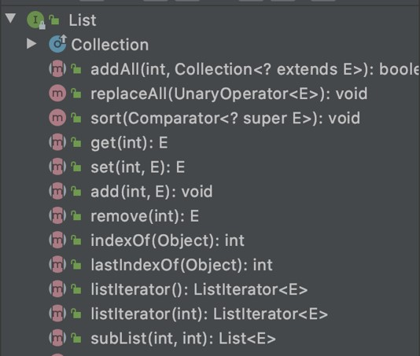

### Implmentasi List

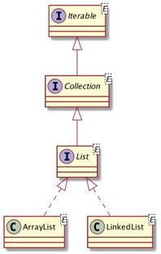

### ArrayList Class

- ArrayList adalah implementasi dari List menggunakan array
- Default kapasitas array di ArrayList adalah 10
- Namun ketika kita memasukkan data dan array sudah penuh, maka secara otomatis ArrayList akan membuat array baru dengan kapasitas baru dengan ukuran kapasitas lama + data baru

### LinkedList Class

- LinkedList adalah implementasi List dengan struktur data Double Linked List
- Bagi yang sudah belajar tentang struktur data di sekolah / kampus pasti tau apa itu double linked list

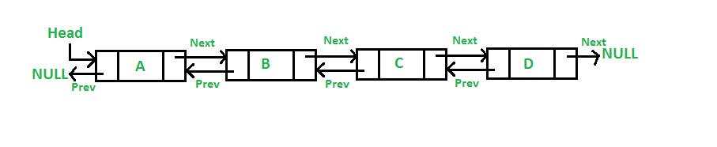

### ArrayList vs LinkedList

| Operasi | ArrayList                                                       | LinkedList                                                           |
| ------- | --------------------------------------------------------------- | -------------------------------------------------------------------- |
| add     | Cepat jika kapasitas Array masih cukup, lambat jika sudah penuh | Cepat karena hanya menambah node di akhir                            |
| get     | Cepat karena tinggal gunakan index array                        | Lambat karena harus di cek dari node awal sampai ketemu index nya    |
| set     | Cepat karena tinggal gunakan index array                        | Lambat karena harus di cek dari node awal sampai ketemu              |
| remove  | Lambat karena harus menggeser data di belakang yang dihapus     | Cepat karena tinggal ubah prev dan next di node sebelah yang dihapus |

### Kode : List

```java
public class ListApp {
	public static void main(String[] args) {
		List<String> names = new ArrayList<List>();
		// List<String> names = new LinkedList<List>();

		names.add("Eko");
		names.add("Kurniawan");
		names.add("Khannedy");

		names.set(0, "Programmer");

		System.out.println(names.get(0));
		System.out.println(names.get(1));
	}
}
```

## #5 Immutable List

- Secara default, List di Java baik itu ArrayList ataupun LinkedList datanya bersifat mutable (Bisa diubah)
- Di Java mendukung pembuatan Immutable List, artinya datanya tidak bisa diubah lagi.
- Sekali List dibuat, datanya tidak bisa diubah lagi, alias final.
- Tapi ingat, data list nya yang tidak bisa diubah, bukan reference object element nya. Kalo misal kiat membuat Immutable List berisikan data Person, field data Person tetap bisa diubah, tapi isi elemen dari Immutable List tidak bisa diubah lagi
- Ini cocok ketika kasus-kasus misal, tidak sembarangan code yang boleh mengubah element di List

### Kode : Problem Mutable List (1)

```java
public class Person {
	private String name;

	private List<String> hobbies;

	public Person(String name) {
		this.name = name;
		this.hobbies = new ArrayList<>();
	}

	public void addHobby(String hobby) {
		hobbies.add(hobby);
	}

	public List<String> getHobbies() {
		return hobbies;
	}

	public String getName() {
		return name;
	}

	...
}
```

### Kode : Problem Mutable List (2)

```java
public class MutableListApp {
	public static void main(String[] args) {
		Person person = new Person("Eko");
		person.addHobby("Coding");
		person.addHobby("Gaming");
		doSomethingWithHobbies(person.getHobbies());
		for (String hobby: person.getHobbies()){
			System.out.println(hobby);
		}
	}

	public static void doSomethingWithHobbies(List<String> hobbies) {
		hobbies.add("Eaaa");
	}
}
```

### Kode : Konversi ke Immutable List

```java
public class Person {
	private String name;

	private List<String> hobbies;

	public Person(String name) {
		this.name = name;
		this.hobbies = new ArrayList<>();
	}

	public void addHobby(String hobby) {
		hobbies.add(hobby);
	}

	public List<String> getHobbies() {
		return Collections.unmodifiableList(hobbies);
	}

	public String getName() {
		return name;
	}

	...
}
```

### Membuat Immutable List

| Method                             | Keterangan                                    |
| ---------------------------------- | --------------------------------------------- |
| Collections.emptyList()            | Membuat immutable list kosong                 |
| Collections.singletonList(e)       | Membuat immutable list berisi 1 element       |
| Collections.unmodifiableList(list) | Mengubah mutable list menjadi immutable       |
| List.of(e...)                      | Membuat immutable list dari element - element |

### Kode : Immutable List

```java
public class ImmutableListApp {
	public static void main(String[] args) {
		List<String> names = List.of("Eko", "Kurniawan", "Khannedy");

		names.set(0, "Ups"); // error
		names.remove("Ups"); // error
		names.add("Programmer"); // error
	}
}
```

## #6 Set Interface

- Set adalah salah satu collection yang berisikan elemen-elemen yang unik, atau tidak boleh duplicate
- Set tidak memiliki index seperti di List, oleh karena itu tidak ada jaminan data yang ada di Set itu akan terurut sesuai dengan waktu kita memasukkan data ke Set
- Set tidak memiliki method baru, jadi hanya menggunakan method yang ada di interface parent nya, yaitu Collection dan Iterable
- Karena tidak memiliki index, untuk mengambil data di Set juga kita harus melakukan iterasi satu per satu

### Implementasi Set

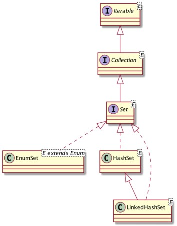

### HashSet vs LinkedHashSet

- Di belakang HashSet dan LinkedHashSet sebenarnya sama-sama ada hash table, dimana data disimpan dalam sebuah hash table dengan mengkalkulasi hashCode() function
- Yang membedakan adalah, HashSet tidak menjamin data terurut sesuai dengan waktu kita menambahkan data, sedangkan LinkedHashSet menjamin data terurut sesuai dengan waktu kita menambahkan data.
- Urutan data di LinkedHashSet bisa dijaga karena di belakang nya menggunakan double linked list

### Kode : HashSet

```java
public class HashSetApp {
	public static void main(String[] args) {
		Set<String> names = new HashSet<>();
		names.add("Eko");
		names.add("Kurniawan");
		names.add("Khannedy");

		for (var name: names) {
			System.out.println(name);
		}
	}
}
```

### Kode : LinkedHashSet

```java
public class HashSetApp {
	public static void main(String[] args) {
		Set<String> names = new LinkedHashSet<>();
		names.add("Eko");
		names.add("Kurniawan");
		names.add("Khannedy");

		for (var name: names) {
			System.out.println(name);
		}
	}
}
```

### EnumSet

- EnumSet adalah Set yang elemen datanya harus Enum
- Karena data Enum itu unik, sehingga sangat cocok menggunakan Set dibandingkan List

### Kode : EnumSet

```java
public static enum Gender {
	MALE, FEMALE, NOT_MENTION
}

public class EnumSetApp {
	public static void main(String[] args) {
		EnumSet<Gender> genders = EnumSet.allOf(Gender.class);

		for (var gender: genders) {
			System.out.println(gender);
		}
	}
}
```

## #7 Immutable Set

- Sama seperti List, Set pun memiliki tipe data Immutable
- Cara pembuatan immutable Set di Java mirip dengan pembuatan immutable List

### Membuat Immutable Set

| Method                           | Keterangan                                   |
| -------------------------------- | -------------------------------------------- |
| Collections.emptySet()           | Membuat immutable list kosong                |
| Collections.singleton(e)         | Membuat immutable list berisi 1 element      |
| Collections.unmodifiableSet(set) | Mengubah mutable list menjadi immutable      |
| Set.of(e...)                     | Membuat immutable set dari element - element |

### Kode : Immutable Set

```java
public class ImmutableSetApp {
	public static void main(String[] args) {
		Set<String> names = Set.of("Eko", "Kurniawan", "Khannedy")

		names.add("Eko"); // error
		names.remove("Eko"); // error
	}
}
```

## #8 SortedSet Interface

- SortedSet adalah turunan dari Set, namun di SortedSet elemen-elemen yang dimasukkan kedalam SortedSet akan otomatis diurutkan
- Jika element adalah turunan dari interface Comparable, maka secara otomatis akan diurutkan menggunakan comparable tersebut
- Jika element bukan turunan dari interface Comparable, maka kita bisa menggunakan Comparator untuk memberi tahun si SortedSet bagaimana cara mengurutkan elemen-elemen nya

### Method di SortedSet Interface

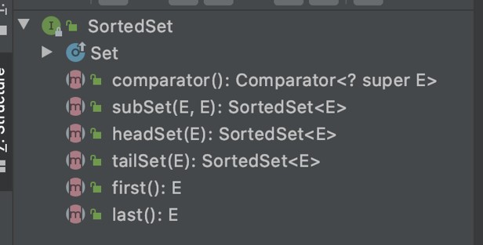

### Implementasi SortedSet


### Kode : Person Comparator

```java
public class PersonComparator implements Comparator<Person> {

	@Override
	public int compare(Person o1, Person o2) {
		return os.getName().compareTo(o2.getName());
	}
}
```

### Kode : SortedSet

```java
public class SortedSetApp {
	public static void main(String[] args) {
		SortedSet<Prson> people = new TreeSet<>(new PersonComparator());
		people.add(new People("Eko"));
		people.add(new People("Budi"));
		people.add(new People("Joko"));

		for (var person: people) {
			System.out.println(person.getName());
		}
	}
}
```

### Membuat Immutable SortedSet

| Method                                 | Keterangan                                     |
| -------------------------------------- | ---------------------------------------------- |
| Collections.emptySortedSet()           | Membuat immutable sorted set kosong            |
| Collections.unmodifiableSortedSet(set) | Membuat immutable sorted set menjadi immutable |

## #9 NavigableSet Interface

- NavigableSet adalah turunan dari SortedSet
- NavigableSet menambah method-method untuk melakukan navigasi pencarian element, seperti mencari elemen yang lebih besar dari, kurang dari, membalikkan urutan set, dan lain-lain

### Method di NavigableSet

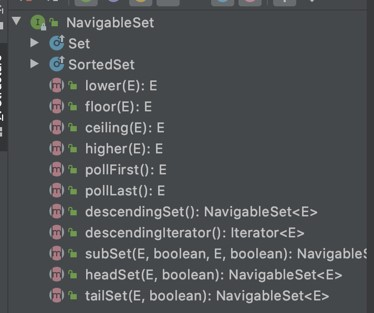

### Implementasi NavigableSet

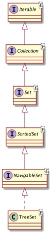

### Kode : NavigableSet

```java
public class NavigableSetApp {
	public static void main(String[] args) {
		NavigableSet<String> names = new TreeSet<>();
		names.addAll(Set.of("Eko", "Kurniawan", "Khannedy", "Programmer", "Zaman", "Now"));

		NavigableSet<String> namesDesc = names.descendingSet();
		NavigableSet<String> kurniawan = names.headSet("Kurniawan", true);

		for (var name: names) {
			System.out.println(name);
		}
	}
}
```

### Membuat Immutable NavigableSet

| Method                                    | Keterangan                                        |
| ----------------------------------------- | ------------------------------------------------- |
| Collections.emptyNavigableSet()           | Membuat immutable navigable set kosong            |
| Collections.unmodifiableNavigableSet(set) | Membuat immutable navigable set menjadi immutable |

## #10 Queue Interface

- Queue adalah implementasi dari struktur data Antrian atau FIFO (First In First Out)

### Method di Queue Interface

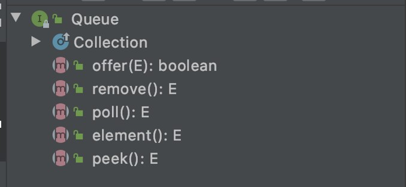

### Implementasi Queue

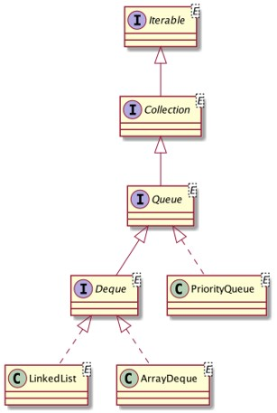

### ArrayDeque vs LinkedList vs PriorityQueue

- ArrayDeque menggunakan array sebagai implementasi queue nya
- LinkedList menggunakan double linked list sebagai implementasi queue nya
- PriorityQueue menggunakan array sebagai implementasi queue nya, namun diurutkan mennggunakan Comparable atau Comparator

### Kode : Queue

```java
public class QueueApp {
	public static void main(String[] args) {

		Queue<String> queue = new ArrayDeque<>(10);
		queue.offer("Eko");
		queue.offer("Kurniawan");
		queue.offer("Khannedy");

		for (String next = queue.poll(); next != null; next = queue.poll()) {
			System.out.println(next);
		}

		System.out.println(queue.size());
	}
}
```

### Kode : PriorityQueue

```java
public class PriorityQueueApp {
	public static void main(String[] args) {

		Queue<String> queue = new PriorityQueue<>(10);
		queue.offer("Eko");
		queue.offer("Kurniawan");
		queue.offer("Khannedy");

		for (String next = queue.poll(); next != null; next = queue.poll()) {
			System.out.println(next);
		}

		System.out.println(queue.size());
	}
}
```

## #11 Deque Interface

- Deque singkatan dari double ended queue, artinya queue yang bisa beroperasi dari depan atau belakang
- Jika pada queue, operasi yang didukung ada `FIFO`, namu pada deque, tidak hanya `FIFO`, naun juga mendukung `LIFO` (Last In First Out)
- Bisa dibilang deque adalah implementasi struktur data antrian dan stack (tumpukan)

### Method di Deque

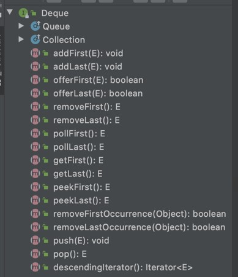

### Implementasi Deque

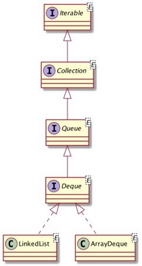

### Kode : Stack Menggunakan Deque

```java
public class DequeApp {
	public static void main(String[] args) {

		Deque<String> stack = new LinkedList<>();

		stack.offerLast("Eko");
		stack.offerLast("Kurniawan");
		stack.offerLast("Khannedy");

		for (var item = stack.pollLast(); item != null; item stack.pollLast()) {
			System.out.println(item);
		}
	}
}
```

## #12 Map Interface

- Map adalah struktur data collection yang berisikan mapping antara key dan value
- Dimana key di map itu harus unik, tidak boleh duplikat, dan satu key cuma boleh mapping ke satu key
- Map sebenarnya mirip dengan Array, cuma bedanya kalo di Array, key adalah index (integer), sedangkan di Map, key nya bebas kita tentukan sesuai keinginan kita

### Method di Map


### Implementasi Map

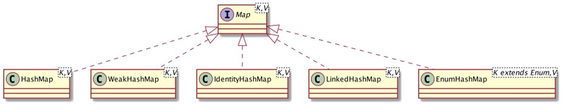

### HashMap

- HashMap adalah implementasi Map yang melakukan distribusi key menggunakan `hashCode()` function
- Karena HashMap sangat bergantung dengan `hashCode()` function, jadi pastikan kita harus membuat function hashCode seunik mungkin, karena jika terlalu banyak nilai `hashCode()` yang sama, maka pendistribusian key nya tidak akan optimal sehingga proses get data di Map akan semakin lambat
- Di HashMap pengecekan data duplikat dilakukan dengan menggunakan method equals nya

### Kode : HashMap

```java
public class HashMapApp {
	public static void main(String[] args) {
		Map<String, String> map = new HashMap<>();

		map.put("firstName", "Eko");
		map.put("middleName", "Kurniawan");
		map.put("lastName", "Khannedy");

		System.out.println(map.get("firstName"));
		System.out.println(map.get("middleName"));
		System.out.println(map.get("lastName"));
	}
}
```

### WeakHashMap

- WeakHashMap adalah implementasi Map mirip dengan HashMap
- Yang membedakan adalah WeakHashMap menggunakan weak key, dimana jika tidak digunakan lagi maka secara otomatis data di WeakHashMap akan dihapus
- Artinya, jika terjadi garbage collection di Java, bisa dimungkinkan data di WeakHashMap akan dihapus
- WeakHashMap cocok digunakan untuk menyimpan data cache di memory secara sementara

### Kode : WeakHashMap

```java
public class WeakHashMapApp {
	public static void main(String[] args) {
		Map<Integer, Integer> map = new WeakHashMap<>();

		for (int i = 0; i < 100000; i++) {
			map.put(i, i);
		}

		System.gc();

		System.out.println(map.size());
	}
}
```

### IdentittyHashMap

- IdentittyHashMap adalah implementasi Map sama seperti HashMap
- Yang membedakan adalah cara pengecekan kesamaan datanya, tidak menggunakan function equals, melainkan menggunakan operator `==` (reference equality)
- Artinya data dianggap sama, jika memang lokasi di memory tersebut sama

### Kode : IdentittyHashMap

```java
public class IdentittyHashMapApp {
	public static void main(String[] args) {
		String key1 = "name.first";

		String name = "name";
		String first = "first";

		String key2 = name + "." + first;

		Map<String, String> map = new IdentittyHashMap<>();

		map.put(key1, "Eko Kurniawan");
		map.put(key2, "Eko Kurniawan");

		System.out.println(map.size());
	}
}
```

### LinkedHashMap

- LinkedHashMap adalah implementasi Map dengan menggunakan double linked list
- Data di LinkedHashMap akan lebih terprediksi karena datanya akan disimpan berurutan dalam linked list sesuai urutan kita menyimpan data
- Namun perlu diperhatikan, proses get data di LinkedHashMap akan semakin lambat karena harus melakukan iterasi data linked list terlebih dahulu
- Gunakan LinkedHashMap jika memang kita lebih mementingkan iterasi data Map nya

### Kode : LinkedHashMap

```java
public class LinkedHashMapApp {
	public static void main(String[] args) {
		Map<String, String> map = new LinkedHashMap<>();

		map.put("Eko", "Eko");
		map.put("Kurniawan", "Kurniawan");
		map.put("Khannedy", "Khannedy");

		for (var key : map.keySet()) {
			System.out.println(key);
		}
	}
}
```

### EnumMap

- EnumMap adalah implementasi Map dimana key nya adalah enum
- Karena data enum sudah pasti unik, oleh karena itu cocok dijadikan key di Map
- Algoritma pendistribusian key dioptimalkan untuk enum, sehingga lebih optimal dibandingkan menggunakan `hashCode()` method

### Kode : EnumMap

```java
public static enum Level {
	FREE, STANDARD, PREMIUM, VIP
}

public class EnumMapApp {
	public static void main(String[] args) {
		EnumMap<Level, String> map = new EnumMap<>(Level.class);

		map.put(Level.FREE, "Gratis");
		map.put(Level.PREMIUM, "Bayar");

		System.out.println(map.get(Level.FREE));
		System.out.println(map.get(Level.PREMIUM));
	}
}
```

## #13 Immutable Map

- Sama seperti List dan Set, Map pun punya tipe data Immutable

### Membuat Immutable Map

| Method                               | Keterangan                               |
| ------------------------------------ | ---------------------------------------- |
| Collections.emptyMap()               | Membuat immutable map kosong             |
| Collections.unmodifiableMap(map)     | Mengubah mutable map menjadi immutable   |
| Collections.singletonMap(key, value) | Membuat map dengan satu jumlah key-value |
| Map.of(...)                          | Membuat immutable map dari key-value     |

### Kode : Immutable Map

```java
public class ImmutableMapApp {
	public static void main(String[] args) {
		Map<String, String> name = map.of(
			"firstName", "Eko",
			"middleName", "Kurniawan",
			"lastName", "Khannedy"
		);

		name.get("middleName", "Ups"); // error
	}
}
```

## #14 SortedMap Interface

- SortedMap adalah implementasi Map dengan data key diurutkan sesuai dengan Comparable key atau bisa menggunakan Comparator
- SortedMap cocok untuk kasus yang posisi key pada Map harus berurut

### Method SortedMap

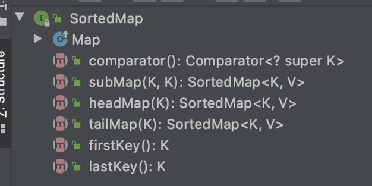

### Implementasi SortedMap

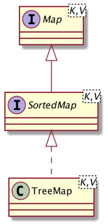

### Kode : SortedMap

```java
public class SortedMapApp {
	public static void main(String[] args) {
		SortedMap<String, String> map = new TreeMap<>();

		map.put("Eko", "Eko");
		map.put("Budi", "Budi");
		map.put("Joko", "Joko");

		for (var key : map.entrySet()) {
			System.out.println(key);
		}
	}
}
```

### Kode : SortedMap Menggunakan Comparator

```java
public class SortedMapComparatorApp {
	public static void main(String[] args) {
		SortedMap<Person, String> map = new TreeMap<>(new Comparator<Person>() {
			@Override
			public int compare(Person o1, Person o2) {
				return o1.getName().compareTo(o2.getName());
			}
		});

		map.put(new Person("Eko"), "Eko");
		map.put(new Person("Budi"), "Budi");
		map.put(new Person("Joko"), "Joko");

		for (var key : map.entrySet()) {
			System.out.println(key);
		}
	}
}
```

### Membuat Immutable SortedMap

| Default Method                         | Keterangan                                    |
| -------------------------------------- | --------------------------------------------- |
| Collections.emptySortedMap()           | Membuat immutable sorted map kosong           |
| Collections.unmodifiableSortedMap(map) | Mengubah mutable sorted map menjadi immutable |

## #14 NavigableMap Interface

- NavigableMap adalah turunan dari SortedMap
- Namun NagivableMap memiliki kemampuan navigasi berdasarkan operasi kurang dari, lebih dari dan sejenisnya
- Misal, kita ingin mengambil data yang lebih dari key x atau kurang dari key y, ini bisa dilakukan di NavigableMap

### Method di NavigableMap

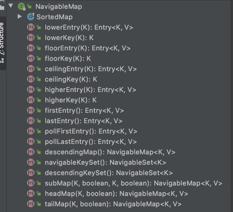

### Implementasi NavigableMap

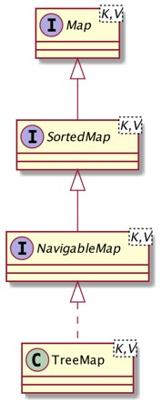

### Kode : NavigableMap

```java
public class NavigableMapApp {
	public static void main(String[] args) {
		NavigableMap<String, String> map = new TreeMap<>();

		map.put("Eko", "Eko");
		map.put("Budi", "Budi");
		map.put("Joko", "Joko");

		System.out.println(map.lowerKey("Eko"));
		System.out.println(map.higherKey("Eko"));
	}
}
```

### Membuat NavigableMap

| Method                                    | Keterangan                                       |
| ----------------------------------------- | ------------------------------------------------ |
| Collections.emptyNavigableMap()           | Membuat immutable navigable map kosong           |
| Collections.unmodifiableNavigableMap(map) | Mengubah mutable navigable map menjadi immutable |

## #15 Entry Map

- Saat kita menyimpan data di Map, data disimpan dalam pair (key-value)
- Di Java collection, implementasi Pair di Map bernama Entry
- Entry adalah interface sederhana yang berisikan method untuk mengambil key dan value

### Method Entry Interface

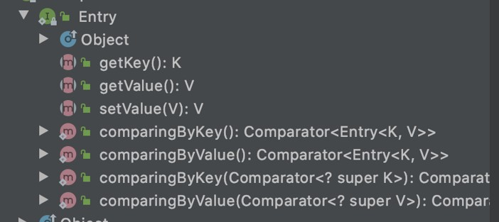

### Kode : Menggunakan Entry

```java
public class EntryApp {
	public static void main(String[] args) {
		Map<String, String> map = new HashMap<>();
		map.put("Eko", "Eko");
		map.put("Kurniawan", "Kurniawan");
		map.put("Khannedy", "Khannedy");

		Set<Map.Entry<String, String>> entries = map.entrySet();

		for (var entry: entries) {
			System.out.println("====");
			System.out.println("Key : " + entry.getKey());
			System.out.println("Value : " + entry.getValue());
		}
	}
}
```

## #16 Legacy Collection

- Collection sudah ada sejak Java versi 1, namun semakin kesini, Java Collection semakin berkembang
- Sebenarnya ada beberapa legacy collection (collection jadul) yang belum kita bahas, namun jarang sekali digunakan sekarang ini

### Vector Class

- Vector class adalah implementasi dari interface List
- Cara kerja Vector mirip dengan ArrayList, yang membedakan adalah semua method di Vector menggunakan kata kunci synchronized yang artinya dia thread safe
- Namun problemnya adalah, karena semua method menggunakan kata kunci synchronized, secara otomatis impact nya ke-performance yang menjadi lambat dibandingkan menggunakan ArrayList
- Lantai bagaimana jika kita ingin membuat List yang bisa digunakan di proses paralel? Di versi Java baru, sudah disediakan yang lebih canggih untuk itu, oleh karena itu penggunakan Vector sudah jarang sekali ditemui sekarang

### Kode : Vector

```java
public class VectorApp {
	public static void main(String[] args) {
		List<String> names = new Vector<>();
		names.add("Eko");
		names.add("Kurniawan");
		names.add("Khannedy");

		for (var name : names) {
			System.out.println(name);
		}
	}
}
```

### HashTable Class

- HashTable adalah implementasi dari Map yang mirip dengan HashMap
- Sama seperti Vector, semua method di HashTable memiliki kata kunci synchronized, sehingga performanya lebih lambat dibandingkan HashMap
- Dan karena di versi Java baru sudah ada juga ConcurrentHashMap, sehingga penggunaan HashTable sudah jarang sekali ditemui

### Kode : HashTable

```java
public class HashTableApp {
	public static void main(String[] args) {
		Map<String, String> map = new HashTable<>();
		map.put("Eko", "Eko");
		map.put("Kurniawan", "Kurniawan");
		map.put("Khannedy", "Khannedy");

		for (var entry : map.entrySet()) {
			System.out.println(entry.getKey() + " : " + entry.getValue());
		}
	}
}
```

### Stack Class

- Stack adalah implementasi struktur data tumpukan LIFO (Last In First Out)
- Namun fitur yang lebih komplit dan konsisten sudah disediakan di Deque, jadi tidak ada alasan lagi menggunakan class Stack

### Kode : Stack

```java
public class StackApp {
	public static void main(String[] args) {
		Stack<String> names = new Stack<>();
		names.push("Eko");
		names.push("Kurniawan");
		names.push("Khannedy");

		for (var name = names.pop(); name != null; name = names.pop()) {
			System.out.println(name);
		}
	}
}
```

## #17 Sorting

- Sorting atau pengurutan adalah algoritma yang sudah biasa kita lakukan
- Di Java Collection juga sudah disediakan cara untuk melakukan pengurutan, jadi kita tidak perlu melakukan pengurutan secara manual
- Namun perlu diingat, yang bisa di sort hanyalah List, karena Set, Queue, Deque dan Map cara kerjanya sudah khusus, jadi pengurutan hanya bisa dilakukan di List

### Sorting di List

| Method                             | Keterangan                                        |
| ---------------------------------- | ------------------------------------------------- |
| Collections.sort(list)             | Mengurutkan list dengan comparable bawaan element |
| Collections.sort(list, comparator) | Mengurutkan list dengan comparator                |

### Kode : Sorting List

```java
public class SortingListApp {
	public static void main(String[] args) {
		List<String> names = new ArrayList<>();
		names.addAll(List.of("Eko", "Budi", "Joko"));

		Collections.sort(names);
		System.out.println(names);

		Collections.sort(names, new Comparator<String>() {
			@Override
			public int compare(String o1, String o2) {
				return o2.compareTo(o1);
			}
		});
	}
}
```

## #18 Binary Search

- Secara default List di Java memiliki fitur search atau get data, namun implementasinya menggunakan sequential search, artinya data akan di cek satu per satu dari awal
- Salah satu algoritma pencarian yang populer adalah binary search, namun binary search hanya bisa dilakukan jika datanya telah berurutan
- Untungnya di Java Collection sudah ada implementasi binary search, sehingga kita tidak perlu membuatnya secara manual

### Binary Search Diagram

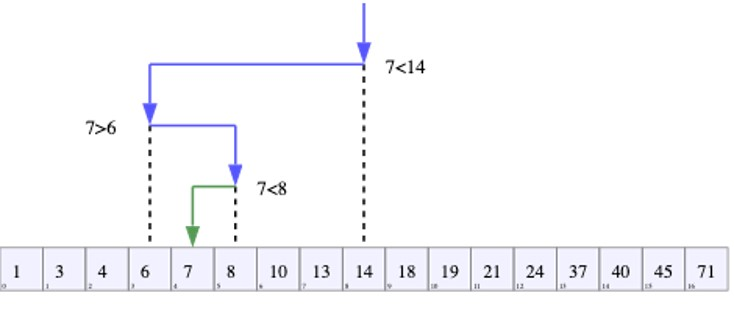

### Binary Search di List

| Method                                            | Keterangan                                                  |
| ------------------------------------------------- | ----------------------------------------------------------- |
| Collections.binarySearch(list, value)             | Mencari menggunakan binary search                           |
| Collections.binarySearch(list, value, comparator) | Mencari menggunakan binary search dengan bantuan comparator |

### Kode : Binary Search di List

```java
public class BinarySearchApp {
	public static void main(String[] args) {
		List<Integer> numbers = new ArrayList<>();
		for (int i = 0; i < 1000; i++) {
			numbers.add(i);
		}

		int index = Collections.binarySearch(numbers, 500);
		System.out.println(index);
	}
}
```

## #18 Collections Class

- Collections adalah class yang berisikan utility static method untuk membantu kita menggunakan Java Collection
- Di materi-materi sebelumnya kita sudah bahas beberapa, seperti membuat immutable collection misalnya
- Namun sebenarnya masih ada banyak static method yang bisa kita gunakan di class Collections
- <https://docs.oracle.com/en/java/javase/14/docs/api/java.base/java/util/Collections.html>

### Static Method di Collections Class (1)

| Method                                          | Keterangan                                              |
| ----------------------------------------------- | ------------------------------------------------------- |
| void copy(listTo, listFrom)                     | Copy semua data dari listForm ke listTo                 |
| int frequency(collection, object)               | Mengambil berapa banyak element yang sama dengan object |
| max(collection) dan max(collection, comparable) | Mengambil element paling tinggi di list                 |
| min(collection) dan min(collection, comparable) | Mengambil element paling kecil di list                  |
| void reverse(list)                              | Membalikan seluruh element di list                      |
| void shuffle(list)                              | Mengacak posisi element di list                         |
| void swap(list, form, to)                       | Menukar posisi form ke to di list                       |
| ... dan masih banyak                            |                                                         |

### Kode : Collections Class

```java
public class CollectionsClassApp {
	public static void main(String[] args) {
		List<String> names = new ArrayList<>();
		names.addAll(List.of("Eko", "Kurniawan", "Khannedy", "Programmer", "Zaman", "Now"));
		System.out.println(names);

		Collections.reverse(names);
		System.out.println(names);

		Collections.shuffle(names);
		System.out.println(names);
	}
}
```

## #19 Abstract Collection

- Struktur data collection di Java selalu berkembang, namun biasanya algoritma dasarnya selamu sama antar jenis collection
- Hampir semua interface collection di Java sudah disediakan abstract class nya sebagai dasar algoritma nya, dan hampir semua implementasi class konkrit nya selalu extends abstract class collection
- Hal ini mempermudah kita, jika ingin membuat collection manual, kita tidak perlu membuat dari awal, kita bisa menggunakan abstract class yang sudah disediakan

### Abstract Class

| Abstract Class     | Untuk      |
| ------------------ | ---------- |
| AbstractCollection | Collection |
| AbstractList       | List       |
| AbstractMap        | Map        |
| AbstractQueue      | Queue      |
| AbstractSet        | Set        |

### Kode : Membuat Single Queue

```java
public class SingleQueue<E> extends AbstractQueue<E> {

	private E data;

	@Override
	public Iterator<E> iterator() {
		return Collections.singleton(data).iterator();
	}

	@Override
	public int size() {
		return data == null ? 0 : 1;
	}
}
```

### Kode : Menggunakan Single Queue

```java
public class SingleQueueApp {
	public static void main(String[] args) {

		Queue<String> queue = new SingleQueue();
		queue.offer("Eko");
		queue.offer("Kurniawan");
		queue.offer("Khannedy");

		System.out.println(queue.size());
		System.out.println(queue.peek());
		System.out.println(queue.poll());
		System.out.println(queue.poll());
		System.out.println(queue.size());
	}
}
```

## #20 Default Method

- Di Java 8 ada fitur bernama Default Method, dimana kita bisa menambahkan konkrit method di interface
- Fitur ini banyak sekali digunakan di Java Collection, karena kita tahu semua collection di Java memiliki kontrak interface, sehingga dengan mudah di Java bisa meng-improve kemampuan semua collection hanya dengan menambahkan default method di interface collection nya

### Default Method di Collection

| Default Method             | Keterangan                                         |
| -------------------------- | -------------------------------------------------- |
| iterable.forEach(consumer) | Melakukan iterasi seluruh data collection          |
| List.removeIf(predicate)   | Manghapus data di collection menggunakan predicate |
| List.replaceAll(operator)  | Mengubah seluruh data di collection                |

### Kode : Default Method Collection

```java
public class MethodCollectionApp {
	public static void main(String[] args) {

		numbers.replaceAll(new UnaryOperator<Integer>() {
			@Override
			public Integer apply(Integer integer) {
				return integer * 10;
			}
		});

		numbers.forEach(new Consumer<Integer>() {
			@Override
			public void accept(Integer integer) {
				System.out.println(integer);
			}
		});
	}
}
```

### Default Method di Map (1)

| Default Method                   | Keterangan                                                          |
| -------------------------------- | ------------------------------------------------------------------- |
| getOrDefault(key, defaultValue)  | Mengambil data berdasarkan key, jika tidak ada, return defaultValue |
| forEach(consumer)                | Melakukan iterasi seluruh data key-value                            |
| replaceAll(function)             | Mengubah seluruh data value                                         |
| putIfAbsent(key, value)          | Simpan data ke map jika belum ada                                   |
| remove(key, value)               | Hapus jika key-value nya sama                                       |
| replace(key, oldValue, newValue) | Ubah key jika value sekarang sama dengan oldValue                   |
| computeIfAbsent(key, function)   | Ubah key dengan value hasil function jika belum ada                 |
| computeIfPresent(key, function)  | Ubah key dengan value hasil function jika sudah ada                 |
| ... dan masih banyak             |                                                                     |

### Kode : Default Method Map

```java
public class MapApp {
	public static void main(String[] args) {

		map.replaceAll(new BiConsumer<String, Integer, Integer>() {
			@Override
			public Integer apply(String s, Integer integer) {
				return intger * 10;
			}
		});
		map.forEach(new BiConsumer<String, Integer>() {
			@Override
			public void accept(String s, Integer integer) {
				System.out.println(s + " : " + integer);
			}
		});
	}
}
```

## #21 Spliterator Interface

- Spliterator adalah interface yang bisa digunakan untuk melakukan partisi data collection
- Biasanya ini digunakan ketika kita akan memproses collection dalam jumlah besar, lalu agar lebih cepat di split menjadi beberapa dan diproses secara paralel agar lebih cepat
- Penggunaan Spliterator biasanya erat kaitannya dengan Java Thread atau Java Concurrency, namun di materi ini kita tidak akan membahas tentang itu, lebih fokus ke Spliterator

## Method di Spliterator

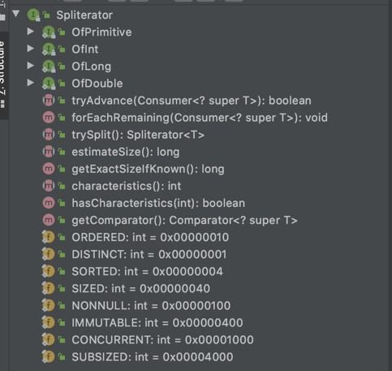

### Kode : Spliterator

```java
public class Spliterator {
	public static void main(String[] args) {

		List<String> names = List.of("Eko", "Kurniawan", "Khannedy", "Programmer", "Zaman", "Now");
		Spliterator<String> spliterator1 = names.spliterator();
		Spliterator<String> spliterator2 = spliterator1.trySplit();

		System.out.println(spliterator1.estimateSize());
		System.out.println(spliterator2.estimateSize());

		spliterator1.forEachRemaining(new Consumer<String>() {
			@Override
			public void accept(String s) {
				System.out.println(s);
			}
		});
	}
}
```

## #22 Konversi ke Array

### Collection Interface

- Interface Collection memiliki method toArray() untuk melakukan konversi collection ke Array
- Ini sangat cocok jika kita ingin mengubah collection ke Array, misal saja karena mau memanggil method yang memang parameternya tipenya array, bukan collection

### toArray Method di Collection

| Method             | Keterangan                          |
| ------------------ | ----------------------------------- |
| Object[] toArray() | Mengubah collection menjadi array   |
| T[] toArray(T[])   | Mengubah collection menjadi array T |

### Kode : Konversi ke Array

```java
public class ArratConversionApp {
	public static void main(String[] args) {

		List<String> names = List.of("Eko", "Kurniawan", "Khannedy");
		Object[] objects = names.toArray();
		String[] strings = names.toArray(new String[]{});

		System.out.println(Arrays.toString(objects));
		System.out.println(Arrays.toString(strings));
	}
}
```

## #23 Materi Selanjutnya

- Apache Maven
- Java Lambda Expression
- Java Unit Testing
- Java Stream
