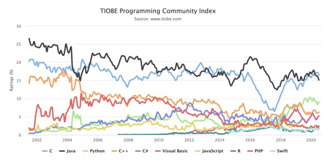
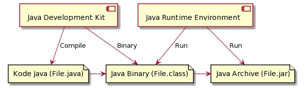

# Java Dasar

## Untuk Siapa Materi Ini?

- Programmer Pemula
- Android Engineer
- Backend Engineer
- Data Engineer

### Agenda

- Pengenalan Java
- Instalasi Java
- Tipe Data di Java
- Operator
- Percabangan
- Perulangan
- Method


## #1 Pengenalan Java

### Sejarah Java

- Java adalah bahasa pemrogramman yang dibuat oleh James Gosling saat bekerja di Sun Microsystem
- Java dirilis ke public tahun 1995
- Java adalah bahasa pemrogramman berorientasi object dan mendukung pengelolaan memori secara otomatis
- Saat ini perusahaan Sun Microsystem telah dibeli oleh Oracle
- Java terkenal dengan write once, run anywhare, karena binary program Java di-generat secara indpenden dan bisa dijalankan di Java Virtual Machine yang terinstall di berbagai sistem operasi

### Teknologi Java

- Java Standard Edition
- Java Enterprise Edition
- Java Micro Edition

### Versi Java

| Version | Release Date |
| ------- | ------------ |
| Java 1.0 | 1996/01/23 |
| Java 1.1 | 1997/02/19 |
| Java 1.2 | 1998/12/08 |
| Java 1.3 | 2000/05/08 |
| Java 1.4 | 2002/02/06 |
| Java 5 | 2004/09/30 |
| Java 6 | 2006/12/11 |
| Java 7 | 2011/07/07 |
| Java 8 | 2014/03/18 |
| Java 9 | 2017/09/21 |
| Java 10 | 2018/03/20 |
| Java 11 | 2018/09/25 |
| Java 12 | 2019/03/19 |
| Java 13 | 2019/09/17 |
| Java 14 | 2020/03/17 |
| Java 15 | 2020/09/15 |
| Java 16 | March 2021 |
| Java 17 | ??? |

### Kenapa Belajar Java



### Dimana Java Banyak Digunakan?

- Backend, banyak perusahaan besar saat ini menggunakan Java sebagai aplikasi backend nya seperti Twitter, Netflix, Spotify, Amazon, Alibaba, Blibli, dan lain-lain
- Big Data, teknologi-teknologi big data yang saat ini populer, kebanyakan adalah teknologi Java, seperti Apache Hadoop, Elasticsearch, Apache Cassandra, Apache Spark, Apache Kafka, dan lain-lain
- Android, di Android kita bisa menggunakan Java dan Kotlin untuk membuat Aplikasi nya

### JRE vs JDK

- JRE singkatan dari Java Runtime Environment
- JDK singkatan dari Java Development kit


### Java Virtual Machine

- Java sendiri hanyalah bahasa pemrogramman, otak dibalik teknologi Java sebenarnya sebuah teknologi yang disebut Java Virtual Machine
- Java Virtual Machine merupakan program yang digunakan untuk mengeksekusi binary file Java 
- Karena JVM hanya mengerti binary file, sehingga akhirnya banyak bahasa pemrogramman yang mengadopsi teknologi JVM, seperti Kotlin, Scala, Groovy dan lain-lain
- Dengan begitu, banyak bahasa pemrograman yang lebih canggih dari Java, namun mereka tetap jalan di JVM yang sudah terbukti stabil dan bagus

### Proses Development Program Java




## #2 Menginstall Java

### OpenJDK

- OpenJDK adalah salah satu implemntasi Java Development Kit yang opensource dan gratis
- https://openjdk.java.net/

### OpenJDK vs yang lain

- Oracle JDK : https://www.oracle.com/java/technologies/javase-downloads.html
- Amazon Corretto : https://aws.amazon.com/id/corretto/
- Zulu : https://www.azul.com/downloads/zulu-community/

### Download OpenJDK

- https://openjdk.java.net/

### Setting PATH

- Windows
- Linux atau Mac

```bash
# Add to .bashrc or .profile or .zshrc

export JAVA_HOME="/Library/Java/JavaVirtualMachines/jdk1.8.0_241.jdk/Contents/Home"
export PATH="$JAVA_HOME/bin:$PATH"
```

### Integrated Developement Environment

- IDE adalah smart editor yang digunakan untuk mengedit kode prorgam
- IDE juga digunakan untuk melakukan otomatisasi proses kompilasi kode program dan otomatisasi proses menjalankan program

IDE untuk Java

- Intelli JDEA Ultimate / Community : https://www.jetbrains.com/idea/
- Eclipse : https://www.eclipse.org/downloads/packages/
- NetBeans : https://netbeans.apache.org/
- JDeveloper : https://www.oracle.com/application-development/technologies/jdeveloper.html


## #2 Program Hello World

### Program Hello World

```java

public class HelloWorld {

	public static void main(String[] args) {
		// CODE PROGRAM

		System.out.println("Hello World");
	}
}
```

### Kompilasi Program Java

```bash
$ javac HelloWorld.java

$ java HelloWorld
```


## #3 Tipe Data Number

- Integer Number
- Floating Point Number

### Integer Number

| Tipe Data | Min | Max | Size | Default |
| --------- | --- | --- | ---- | ------- |
| byte | -128 | 127 | 1 byte | 0 |
| short | -32,768 | 32,767 | 2 bytes | 0 |
| int | -2,147,483,648 | 2,147,483,647 | 4 bytes | 0 |
| long | -9,223,372,036,854,775,808 | 9,223,372,036,854,775,807 | 8 bytes | 0 |

### Kode : Integer Number

```java
byte iniByte = 100;
short iniShort = 1_000;
int iniInt = 1_000_000;
long iniLong1 = 1_000_000;
long iniLong2 = 1_000_000L;
```

### Floating Point Number

| Tipe Data | Min | Max | Size | Default |
| --------- | --- | --- | ---- | ------- |
| float | 3.4e-038 | 3.4e+038 | 4 bytes | 0.0 |
| double | 1.7e-308 | 1.7e+308 | 8 bytes | 0.0 |

### Kode : Floating Point Number

```java
float iniFloat = 10.12F;
double iniDouble = 12.2424;
```

### Kode : Literals

```java
int decimalInt = 25;
int hexInt = 0xA132B;
int binInt = 0b01010101;
```

### Kode : Underscore

```java
long balance = 1_000_000_000_000L;
int sum = 60_000_000;
```

### Konversi Tipe Data Number

- Widening Casting (Otomatis) : byte -> short -> int -> long -> float -> double
- Narrowing Casting (Manual) : double -> float -> long -> int -> char -> short -> byte

### Kode : Konversi Tipe Data Number

```java
byte intByte = 10;
short iniSHort = iniByte;
int iniInt = iniShort;
long iniLong = iniInt;
float iniFLoat = iniLong;
double iniDouble = iniFloat;

float iniFloat2 = (float) iniDouble;
long iniLong2 = (long) iniFloat2;
int iniInt2 = (int) iniLong2;
short iniShort2 = (short) iniInt2;
```


## #4 Tipe Data Character

- Data Character (huruf) di Java direpresentasikan oleh tipe char
- Untuk membuat data char di Java, kita bisa menggunakan tanda `'` (petik satu) di awalh dan di akhir karakter

### Kode : Character

```java
char e = 'E';
char k = 'K';
char o = '0';

System.out.print(e);
System.out.print(k);
System.out.print(o);
```


## #5 Tipe Data Boolean

- Tipe data boolean adalah tipe daya yang memiliki 2 nilai, yaitu benar dan salah
- Tipe data boolean di Java direpresentasikan dengan kata kunci boolean
- Nilai benar direpresentasikan dengan kata kunci true
- Nilai salah direpresentasikan dengan kata kunci false
- Default value untuk boolean adalah false

### Kode : Boolean

```java

boolean benar = true;
boolean salah = false;

System.out.println(benar);
System.out.println(salah);
```


## #6 Tipe Data String

- Tipe Data String adalah tipe data yang berisikan data kumpulan karakter atau sederhananya adalah teks
- Di Java, tipe data String direpresentasikan dengan kata kunci String
- Untuk membuat String di Hava, kita menggunakan karakter `"` (petik dua) sebelum dan setelah teks nya
- Default value untuk String adalah null

### Kode : String

```java
String firstName = "Eko Kurniawan";
String lastName = "Khannedy";

System.out.println(firstName);
System.out.println(lastName);
```

### Kode : Menggabungkan String

```java
String firstName = "Eko Kurniawan";
String lastName = "Khannedy";
String fullName = firstName + " " + lastName;

System.out.println(firstName);
System.out.println(lastName);
System.out.println(fullName);
```


## #7 Variable

- Variable adalah tempat untuk menyimpan data
- Java adalah bahas static type, sehingga sebuah variable hanya bisa digunakan untuk menyimpan tipe data yang sama, tidak bisa berubah-ubah tipe data seperti di bahasa pemrograman PHP atau JavaScript;
- Untuk membuat variable di Java kita bisa menggunakan nama tipe data lalu diikuti dengan nama variable nya
- Nama variable tidak boleh mengandung whitespace (spasi, enter, tab) dan tidak boleh seluruhnya number

### Kode : Variable

```java
String name;
name = "Eko Kurniawan Khannedy";

int age = 30;
String address = "Indonesia";

System.out.println(name);
System.out.println(age);
System.out.println(address);
```

### Kata Kunci var

- Sejak versi Java 10, Java mendukung pembuatan variable dengan kata kunci `var`, sehingga kita tidak perlu menyebutkan tipe datanya
- Namun perlu diingat, saat kita menggunakan kata kunci `var` untuk membuat variable, kita harus menginisiasi value / nilai dari variable tersebut secara langsung

### Kode : Kata Kunci var

```java
var name; // error
name = "Eko Kurniawan Khannedy";

int age = 30;
var address = "Indonesia";

System.out.println(name);
System.out.println(age);
System.out.println(address);
```

### Kata Kunci final

- Secara default, variable di Java bisa diubah-ubah nilainya
- Jika kita ingin membuat sebuah variable yang datanya tidak boleh diubah setelah pertama kali dibuat, kita bisa menggunakan kata kunci `final`
- Istilah variabel seperti ini, banyak juga yang menyebutnya konstan

### Kode : Kata Kunci final

```java
final String name = "Eko Kurniawan Khannedy";
int age = 30;
var address = "Indonesia";

name = "Nama Diubah"; // error

System.out.println(name);
System.out.println(age);
System.out.println(address);
```


## #8 Tipe Data Bukan Primitif

- Tipe data primitif adalah bawaan di dalam bahasa pemrograman. Tipe data primitif tidak bisa diubah lagi
- Tipe data number, char, boolean adalah tipe data primitif. Tipe data primitif selalu memiliki default value
- Tipe data String bukan tipe data primitif, tipe data bukan primitif tidak memiliki default value, dan bisa bernilai null
- Tipe data bukan primitif bisa memiliki method/function (yang akan dibahas nanti)
- Di Java, semua tipe data primitif memiliki representasi tipe data bukan primitif nya

### Representasi Tipe Data Primitif

| Tipe Data Primitif | Tipe Data Bukan Primitif |
| ------------------ | ------------------------ |
| byte | Byte |
| short | Short |
| int | Integer |
| long | Long |
| float | Float |
| double | Double |
| char | Char |
| boolean | Boolean |

### Kode : Tipe Data Bukan Primitif

```java
Integer IniInteger = 10;
Long iniLon = 10L;
Bolean isBoolean = true;

Short iniShort; // null
iniShort = 100;
```

### Kode : Konversi Dari Tipe Primitif

```java
int age = 30;
Integer ageObject = age;

int ageAgain = ageObject;

short shortAge = ageObject.shortValue();
byte byteAge = ageObject.byteValue();
```


## #9 Tipe Data Array

- Array adalah tipe data yang berisikan kumpulan data dengan tipe yang sama
- Jumlah data di Array tidak bisa berubah setelah pertama kali dibuat

### Cara Kerja Array


### Kode : Membuat Array

```java
Strng[] arrayString;
arrayString = new String[3];
arrayString[0] = "Eko";
arrayString[1] = "Kurniawan";
arrayString[2] = "Khannedy";
```

### Kode : Array Initializer

```java
int[] arrayInt = new int[]{
	10, 80, 80, 67, 29
};

long[] arrayLong = {
	10, 80, 80, 67, 29
};
```

### Operasi di Array

| Operasi Array | Keterangan |
| ------------- | ---------- |
| array[index] | Mengambil data di array |
| array[index] = value | Mengubah data di array |
| array.length | Mengambil panjang array |

### Kode : Operasi di Array

```java
long[] arrayLong = {
	10, 80, 80, 67, 29
};

arrayLong[0] = 100;

System.out.println(arrayString[0]);
System.out.println(arrayString[1]);
System.out.println(arrayString.length);
```

### Kide : Array di dalam Array

```java
String[][] members = {
	{"Eko", "Kurniawan", "Khannedy"},
	{"Joko", "Nugraha"},
	{"Budi", "Morro"}
}

String[] member1 = members[0];
System.out.println(member1[0]);

System.out.println(members[0][0]);
System.out.println(members[1][0]);
```


## #10 Operasi Matematika

| Operator | Keterangan |
| -------- | ---------- |
| + | Penjumlahan |
| - | Pengurangan |
| * | Perkalian |
| / | Pembagian |
| % | Sisa Pembagian |

### Kode : Operasi Matematika

```java
int a = 100;
int b = 10;

System.out.println(a + b);
System.out.println(a - b);
System.out.println(a * b);
System.out.println(a / b);
System.out.println(a % b);
```

### Augmented Assignments

| Operasi Matematika | Augmented Assigments |
| ------------------ | -------------------- | 
| a = a + 10 | a += 10 |
| a = a - 10 | a -= 10 |
| a = a * 10 | a *= 10 |
| a = a / 10 | a /= 10 |
| a = a % 10 | a %= 10 |

### Kode : Augmented Assigments

```java
int c = 100;

c += 10;
System.out.println(c);

c -= 10;
System.out.println(c);

c *= 10;
System.out.println(c);
```

### Unary Operator

| Operator | Keterangan |
| -------- | ---------- |
| ++ | a = a + 1 |
| -- | a = a - 1 |
| - | Negative |
| + | Positive |
| ! | Boolean kebalikan |

### Kode : Unary Operator

```java
int d = +100;
int e = -10;

d++;
System.out.println(d);

d--;
System.out.println(d);

System.out.println(!true);
```


## #11 Operasi Perbandingan

- Operasi perbandingan adalah operasi untuk membandingkan dua buah data
- Operasi perbandingan adalah operasi yang menghasilkan nilai boolean (benar atau salah)
- Jika hasil operasinya adalah benar, maka nilainya adalah true
- Jika hasil operasinya adalah salah, maka nilainya adalah false

### Operator Perbandingan

| Operator | Keterangan |
| -------- | ---------- |
| > | Lebih Dari |
| < | Kurang Dari |
| >= | Lebih Dari Sama Dengan |
| <= | Kurang Dari Sama Dengan |
| == | Sama Dengan |
| != | Tidak Sama Dengan |

### Kode : Operasi Perbandingan

```java
int value1 = 100;
int value2 = 100;

System.out.println(value1 > value2);
System.out.println(value1 > value2);
System.out.println(value1 >= value2);
System.out.println(value1 <= value2);
System.out.println(value1 == value2);
System.out.println(value1 != value2);
```


## #12 Operasi Boolean

| Operator | Keterangan |
| -------- | ---------- |
| && | Dan |
| `||` | Atau |
| ! | Kebalikan |

### Operasi &&

| Nilai 1 | Operator | Nilai 2 | Hasil |
| ------- | -------- | ------- | ----- |
| true | `&&` | true | true |
| true | `&&` | false | false |
| false | `&&` | true  | false |
| false | `&&` | false | false |

### Operasi `||`

| Nilai 1 | Operator | Nilai 2 | Hasil |
| ------- | -------- | ------- | ----- |
| true | `||` | true | true |
| true | `||` | false | false |
| false | `||` | true  | false |
| false | `||` | false | false |

### Operasi !

| Operator | Nilai 2 | Hasil |
| -------- | ------- | ----- |
| ! | true | false |
| ! | false | true |

### Kode : Operasi Boolean

```java
var absen = 70;
var nilaiAkhir = 80;

var lulusAbsen = absen >= 75;
var lulusNilaiAkhir = nilaiAkhir >= 75;

var lulus = lulusAbsen && lulusNilaiAkhir;
System.out.println(lulus);
```

## #13 Expression, Statement, Block

### Expression

- Expression adalah konstruksi dari variabel, operator, dan pemanggilan method yang mengevaluasi menjadi sebuah single value
- Expression adalah core component dari statement

### Kode : Expression

```java
int value;
value = 10;

System.out.println(value = 100);
```

### Statement

- Statement bisa dibilang adalah kalimat lengkap dalam bahasa
- Sebuah statement berisikan execution komplit, biasanya diakhiri dengan titik kome
- Ada bebrapa jenis statement :
	+ Assignment expression
	+ Penggunaan ++ dan --
	+ Method invocation
	+ Object creating expression
	
### Kode : Statement

```java
// assignment statement
double aValue = 8933.234;
// increment statement
aValue++;
// method invocation statement
System.out.println("Hello World!");
// object creation statement
Date date = new Date();
```

### Block

- Block adalah kumpulan statement yang terdiri dari nol atau lebih statement
- Block diawal dan diakhir dengan kurung kurawal {}

### Kode : Block

```java
public Block {
	public static void main(String[] args) {
		double aValue = 8933.234;
		aValue++;
		System.out.println("Hello World!");
		Date date = new Date();

		{
			// block dalam blok bisa dilakukan
		}
	}
}
```


## #14 If Statement

- Dalam Java, if adalah salah satu kata kunci yang digunakan untuk percabangan
- Percabangan artinya kita biasa mengeksekusi kode program tertenti ketika suatu kondisi tepenuhi
- Hampir di semua bahasa pemrograman mendukung if expression

### Kode : If Statement

```java
var nilai = 75;
var absen = 90;

if (nilai >= 75 && absen >= 75) {
	System.out.println("Anda Lulus");
}
```

### Else Statement

- Block if akan dieksekusi ketika if bernilai true
- Kadang kita ingin mengeksekusi program tertentu jika kondisi if bernilai false
- Hal ini bisa dilakukan menggunakan else expression

### Kode : Else Statement

```java
var nilai = 75;
var absen = 90;

if (nilai >= 75 && absen >= 75) {
	System.out.println("Anda Lulus");
} else {
	System.out.println("Anda Tidak Lulus");
}
```

### Else If Statement

- Kadang dalam If, kita butuh membuat beberapa kondisi
- Kasus seperti ini, di Java kita bisa menggunakan Else If expression
- Else if di Java bisa lebih dari satu

### Kode : Else If Statement

```java
if (nilai >= 80 && absen >= 80) {
	System.out.println("Nilai Anda A");
} else if (nilai >= 70 && absen >= 70) {
	System.out.println("Nilai Anda B");
} else if (nilai >= 60 && absen >= 60) {
	System.out.println("Nilai Anda C");
} else if (nilai >= 50 && absen >= 50) {
	System.out.println("Nilai Anda D");
} else {
	System.out.println("Nilai Anda E");
}
```


## #15 Switch Statement

- Kadang kita hanya butuh menggunakan kondisi sederhana di if statement, seperti hanya menggunakan perbandingan ==
- Switch adalah statement percabangan yang sama dengan if, namun lebih sederhana cara pembuatannya
- Kondisi di switch statementnya hanya untuk perbandingan ==

### Kode : Switch Statement

```java
var nilai = "A";

switch (nilai) {
	case "A":
		System.out.println("Wow Anda Lulus Dengan Baik");
		break;
	case "B":
	case "C":
		System.out.println("Anda Lulus");
		break;
	case "D":
		System.out.println("Anda Tidak Lulus");
		break;
	default:
		System.out.println("Mungkin Anda Salah Jurusan");
}
```

### Switch Lambda

- Di Java versi 14, diperkenalkan switch expression dengan lambda
- Ini lebih mempermudah ssat penggunaan switch expression karena kita tidak perlu lagi menggunakan kata kunci `break`

### Kode : Switch Lambda

```java
var nilai = "A";

switch (nilai) {
	case "A": -> System.out.println("Wow Anda Lulus Dengan Baik");
	case "B", "C": -> System.out.println("Anda Lulus");
	case "D": ->System.out.println("Anda Tidak Lulus");
	default:
		System.out.println("Mungkin Anda Salah Jurusan");
}
```


### Kata Kunci yield

- Di Java 14, ada kata kunci baru yaitu yield, dimana kita menggunakan kata kunci yield untuk mengembalikan nilai pada switch statement
- Ini sangat mempermudah kita ketika bith membuat data berdasarkan kondisi switch statement

### Kode : Switch Tanpa yield

```java
var nilai = "A";
String ucapan;

switch (nilai) {
	case "A": -> ucapan = "Wow Anda Lulus Dengan Baik";
	case "B", "C": -> ucapan = "Anda Lulus";
	case "D": -> ucapan = "Anda Tidak Lulus";
	default:
		ucapan = "Mungkin Anda Salah Jurusan";
}

System.out.println(ucapan);
```

### Kode : Switch Dengan yield

```java
var nilai = "A";
String ucapan = switch (nilai) {
	case "A": -> yield "Wow Anda Lulus Dengan Baik";
	case "B", "C": -> yield "Anda Lulus";
	case "D": -> yield "Anda Tidak Lulus";
	default:
		yield "Mungkin Anda Salah Jurusan";
}

System.out.println(ucapan);
```


## #16 Ternary Operator

- Ternary operator adalah operator sederhana dari if statement
- Ternary operator terdiri dari kondisi yang dievaluasi, jika menghasilkan true maka nilai pertama diambil, jika false, maka nilai kedua diambil

### Kode : Tanpa Ternary Operator

```java
var nilai = 75;
String ucapan;

if (nilai >= 75) {
	ucapan = "Selamat Anda Lulus";
} else {
	ucapan = "Silahkan Coba Lagi";
}
```

### Kode : Dengan Ternary Operator

```java
var nilai = 75;
String ucapan = nilai >= 75 ? "Selamat Anda Lulus" : "Silahkan Coba Lagi";

System.out.println(ucapan);
```


## #17 For Loop

- For adalah salah satu kata kunci yang bisa digunakan untuk melakukan perulangan 
- Block kode yang terdapat di dalam for akan selalu diulangi selama kondisi for terpenuhi

### Sintak Perulangan For

```
for (init statement; kondisi; post statement) {
	// block perulangan
}
```

- Init statement akan dieksekusi hanya sekali di awal sebelum perulangan
- Kondisi akan dilakukan pengecekan dalam setiap perulangan, jika true perulangan akan dilakukan, jika false perulangan akan berhenti
- Post statement akan dieksekusi setiap kali diakhiri perulangan
- Init statement, Kondisi dan Post Statement tidak wajib diisi, jika Kondisi tidak diisi, berarti kondisi selalu bernilai true

### Kode : Perulangan Tanpa Henti

```java
for (;;){
	System.out.println("Perulangan");
}
```

### Kode : Perulangan Dengan Kondisi

```java
var counter = 1;

for(;counter <= 10;) {
	System.out.println("Perulangan Ke-"+ counter);
	counter++;
}
```

### Kode : Perulangan Dengan Init Statement

```java
for (var counter = 1; counter <=10;) {
	System.out.println("Perulangan Ke-"+ counter);
	counter++;	
}
```

### Kode : Perulangan Dengan Post Statement

```java
for (var counter = 1; counter <=10; counter++) {
	System.out.println("Perulangan Ke-"+ counter);
}
```


## #18 While Loop

- While loop adalah versi perulangan yang lebih sederhana dibanding for loop
- Di while loop, hanya terdapat kondisi perulangan, tanpa ada init statement dan post statement

### Kode : While Loop

```java
car counter = 1;

while (counter <=10) {
	System.out.println("Perulangan Ke-" + counter);
	counter++;
}
```


## #19 Do While Loop

- Do While loop adalah perulangan yang mirip dengan while
- Perbedaanya hanya pada pengecekan kondisi
- Pengecekan kondisi di while loop dilakukan di awal sebelum perulangan dilakukan, sedangkan di do while loo dilakukan setelah perulangan dilakukan
- Oleh karena itu dalam do while loop, minimal pasti sekali perulangan dilakukan walaupun kondisi tidak bernilai true

### Kode : Do While Loop

```java
car counter = 1;

do {
	System.out.println("Perulangan Ke-" + counter);
	counter++;
} while (counter <=10);
```


## #20 Break & Continue

- Pada switch statement, kita sudah mengenal kata kunci break, yaitu untuk menghentikan case dalam switch
- Sama dengan pada perulangan, break juga digunakan untuk menghentikan seluruh perulangan
- Namun berbeda dengan continue, continue digunakan untuk mengehtikan perulangan saat ini, lalu melanjutkan ke perulangan selanjutnya

### Kode : Break

```java
var counter = 1;

while (true) {
	System.out.println("Perulangan Ke-" + counter);
	counter++;

	if (counter > 10) {
		break;
	}
}
```

### Kode : Continue

```java
for (int counter = 1; counter <= 100; counter++) {

	if (counter % 2 == 0) {
		continue;
	}

	System.out.println("Perulangan Ganjil-" + counter);
}
```


## #21 For Each

- Kadang kala biasa mengakses data array menggunakan perulangan
- Mengakses data array menggunakan perulangan sangat bertele-tele, kita harus membuat conuter, lalu mengakses array menggunakan counter yang kita buat
- Namun untungnya, di Java terdapat perulangan for each, yang bisa digunakan untuk mengakses seluruh data di Array secara otomatis

### Kode : Tanpa For Each

```java
String[] array = {
	"Eko", "Kurniawan", "Khannedy",
	"Programmer", "Zaman", "Now"
};

for (int i = 0; i < array.length; i++) {
	System.out.println(array[i]);
}
```

### Kode : For Each

```java
String[] array = {
	"Eko", "Kurniawan", "Khannedy",
	"Programmer", "Zaman", "Now"
};

for (var value: array) {
	System.out.println(value);
}
```


## #22 Method

- Method adalah block kode program yang akan berjalan saat kita panggil
- Sebelumnya kita sudah menggunakan method prinln() untuk mengmpilkan tulisan di console
- Untuk membuat method di Java, kita bisa menggunakan kata kunci `void`, lalu diikuti dengan nama method, kurung `()` dan diakhiri dengan block
- Kita bisa memanggil method dengan menggunakan nama method lalu diikuti dengan kurung `()` 
- Di bahasa pemrograman lain, Method juga disebut dengan Function

### Kode : Method

```java
public static void main(String[] args) {
	sayHelloWorld();
}

static void sayHelloWorld() {
	System.out.println("Hello World");
}
```


## #23 Method Parameter

- Kita bisa mengirim informasi ke method yang ingin kita panggil
- Untuk melakukan hal tersebut, kita perlu menambahkan parameter atau argument di method yang sudah di buat
- Cara membuat parameter sama seperti cara membuat variable
- Parameter ditempatkan di dalam kurung `()` di deklarasi method
- Parameter bisa lebih dari satu, jika lebih dari satu, harus dipisah menggunakan tanda koma `,`

### Kode : Method Parameter

```java
public static void main(String[] args) {
	sayHelloWorld("Eko", "Khannedy");
}

static void sayHelloWorld(String firstName, String lastName) {
	System.out.println("Hello " + firstName + " " + lastName);
}
```


## #24 Method Return Value

- Secara default, method itu tidak menghasilkan value apapun, namun jika kita ingin, kita bisa membuat sebuah method mengembalikan nilai
- Agar method bisa menghasilkan value, kita harus mengubah kata kunci void dengan tipe data yang dihasilkan
- Dan di dalam block method, untuk menghasilkan nilai tersebut, kita harus menggunakan kata kunci return, lalu diikuti data yang sesuai dengan tipe data yang sudah kita deklarasikan di method
- Di Java, kita hanya bisa menghasilkan 1 data di sebuah method, tidak bisa lebih dari satu

### Kode : Method Return Value

```java
public static void main(String[] args) {
	var a = 100;
	var b = 200;
	var c = sum(a, b);

	System.out.println(c);
}

static int sum(int value1, int value2) {
	var total = value1 + value2;
	return total;
}
```


## #25 Method Variable Argument

- Kadang kita butuh mengirim data ke method sejumlah data yang tidak pasti 
- Bisanya, agar bisa seperti ini, kita akan menggunakan Array sebagai parameter di method tersebut
- Namun di Java, kita bisa menggunakan variable argument, untuk mengirim data yang berisi jumlah tak tentu, bisa nol atau lebih
- Parameter dengan tipe variable argument, hanya bisa ditempatkan di posisi akhir parameter

## Kode : Method Variable Argument

```java

public static void main(String[] args) {
	int[] values = {80, 80, 70, 90};
	sayCongrats("Eko", values);
}

static void sayCongrats(String name, int[] values) {

	total = 0;
	for (var value: values) {
		total += value;
	}

	int finalValue = total / values.length;

	if (finalValue >= 75) {
		System.out.println("Selamat " + name + ", Anda Lulus");
	} else {
		System.out.println("Maaf " + name + ", Anda Tidak Lulus");
	}
}
```

## Kode : Dengan Variable Argument

```java

public static void main(String[] args) {
	sayCongrats("Eko", 80, 80, 70, 90);
}

static void sayCongrats(String name, int... values) {

	total = 0;
	for (var value: values) {
		total += value;
	}

	int finalValue = total / values.length;

	if (finalValue >= 75) {
		System.out.println("Selamat " + name + ", Anda Lulus");
	} else {
		System.out.println("Maaf " + name + ", Anda Tidak Lulus");
	}
}
```


## #26 Method Overloading

- Method overloading adlah kemampuan membuat method dengan nama yang sama lebih dari sekali
- Namun ada ketentuannya, yaitu data parameter di method tersebut harus berbeda-berda, entah jumlah atau tipe data parameternya
- Jika ada yang sama, maka program Java kita akan error

### Kode : Method Overloading

```java
static void sayHello() {
	System.out.println("Hello");
}

static void sayHello(String firstName) {
	System.out.println("Hello " + firstName);
}

static void sayHello(String firstName, String lastName) {
	System.out.println("Hello " + firstName + " " + lastName);
}
```


## #27 Recursive Method

- Recursive method adalah kemampuan method memanggil method dirinya sendiri
- Kadang memang ada banyak problem, yang lebih mudah diselesaikan menggunakan recursive method, seperti contohnya kasus factorial

### Kode : Factorial Loop

```java
static int factoraial(int value) {
	var result = 1;
	for (int i = 1; i <= value; i++) {
		result *= i;
	}
	return result;

}
```

### Kode : Factorial Recursive

```java
static int factoraialRecursive(int value) {
	if (value == 1) {
		return 1;
	} else {
		return value * factoraialRecursive(value-1);
	}
}
```

### Problem Dengan Recursive

- Walaupun recursive method itu sangat menarik, namun kita perlu berhati-hari
- Jika recursive terlalu dalam, maka akan ada kemungkinan terjadi error `StackOverflow`, yaitu error dimana stack method terlalu banyak di Java
- Kenapa problem ini bisa terjadi? Karena ketika kita memanggil method, Java akan menyimpannya dalam stack, jika method tersebut memanggil method lain, maka stack akan menumpuk terus, dan jika terlalu dalam, maka stack akan terlalu besar, dan bisa menyebabkan error `StackOverflow`

## Kode : Error StackOverflow

```java
static void loop(int value) {
	if(value == 0) {
		System.out.println("Selesai");
	} else {
		System.out.println("Loop-" + value);
		loop(value-1);
	}
}
```


## #28 Scope

- Di Java, variable hanya bisa diakses di dalam area dimana mereka dibuat
- Hal ini disebut scope
- Contoh, jika sebuah variable dibuat di method, maka hanya bisa diakses di method tersebut, atau jika dibuat didalam block, maka hanya bisa diakses didalam block tersebut

### Kode : Scope

```java
staic void sayHello(String name) {
	String hello = "Hello " + name;
	if (!name.isBlank()) {
		String hi = "Hi" + name;
		System.out.println(hi);
	}

	System.out.println(hello);
	System.out.println(hi); // error
}
```


## #29 Komentar

- Kadang dalam membuat program, kita sering menempatkan komentar di kode program terebut
- Komentar adalah kode program yang akan di hiraukan saat proses kompilasi, sehingga di binary code Java, tidak akan ada kode komentar tersebut
- Biasanya komentar digunakan untuk dokumentasi

### Kode : Komentar

```java
/**
 * Menghitung Jumlah a + b
 *
 * @param a nilai a
 * @param b nilai b
 * @return a + b
 */
static int sum(int a, int b) {
	// jumlahkan a + b
	return a + b;
}
```


## #30 Materi Selanjutnya

- Java Object Oriented Programming