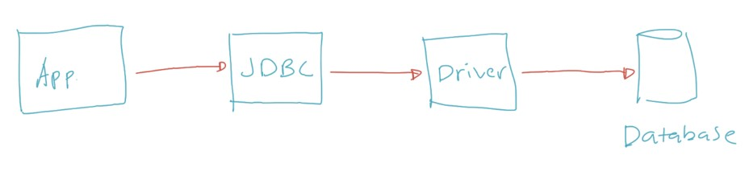
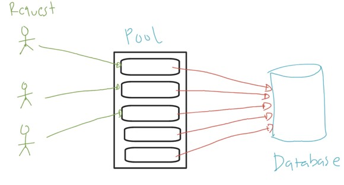

# Java Database

## Sebelum Belajar

- Java Dasar
- Java Object Oriented Programming
- Java Generic
- Java Collection
- Java Lambda
- Apache Maven
- Java Unit Test
- Java Stream
- MySQL Database
- <https://www.udemy.com/course/pemrograman-java-pemula-sampai-mahir/?referralCode=E97428FBE9A6F3590D8D>

## Agenda

- Pengenalan JDBC
- Driver
- Data Source
- Connection
- JDBC Data Type
- Statement
- ResultSet
- Prepared Statement
- SQL Injection
- Metadata
- Dan lain-lain

## #1 Pengenalan JDBC

- JDBC singkatan dari Java Database Connectivity
- JDBC merupakan spesifikasi API standard untuk mengakses database di Java
- JDBC tidak bisa langsung digunakan, karena isinya hanyalah interface-interface kontrak untuk berinteraksi dengan database
- JDBC perlu implementasi, atau kita sebut dengan Driver, seperti MySQL Driver, PostgreSQL Driver, OracleDB Driver, dan lain-lain
- Semua interface API JDBC terdapat di package `java.sql` dan `javax.sql`
- <https://docs.oracle.com/en/java/javase/15/docs/api/java.sql/java/sql/package-summary.html>
- <https://docs.oracle.com/en/java/javase/15/docs/api/java.sql/javax/sql/package-summary.html>

### Cara Kerja JDBC



### MySQL

- Pada materi kali ini kita akan menggunakan MySQL sebagai database
- Jadi pastikan teman-teman sudah mengerti tentang datatabase MySQL

## #2 Membuat Project

- Kita akan menggunakan Apache Maven untuk membuat project
- Kita bisa menggunakan perintah :
  - `mvn archetype:generate`
  - Lalu cari : `maven-archetype-quickstart`

### JUnit 5

- Kita akan belajar Java Database menggunakan unit test, jadi pastikan menambahkan dependency JUnit 5 di project nya
- Silahkan cari junit-jupiter di <https://search.maven.org/>

## #3 Driver

- Driver adalah jembatan penghubung antara JDBC dan Database Management System yang akan kita gunakan
- Sebenarnya Driver itu berisikan class-class implementasi dari interface yang terdapat di JDBC
- Tanpa menggunakan Driver, kita JDBC tidak bisa terkoneksi ke DBMS
- Driver di JDBC direpresentasikan oleh interface `java.sql.Driver`
- <https://docs.oracle.com/en/java/javase/15/docs/api/java.sql/java/sql/Driver.html>

### MySQL Driver

- MySQL sudah menyediakan driver untuk JDBC
- Kita bisa cari MySQL Driver dengan menggunakan kata kunci `mysql-connector-java` di `https://search.maven.org/`
- Lalu tambahkan ke dependency project kita

### Registrasi Driver ke JDBC

- Setelah menambah dependency MySQL Driver ke project kita
- Kita perlu melakukan registrasi Driver terlebih dahulu
- Untuk melakukan registrasi driver, kita bisa menggunakan static method `registerDriver` milik class `java.sql.DriverManager`

### Kode Registrasi Driver

```java
@Test
void testDriver() {
	try {
		Driver mysqlDriver = new com.mysql.cj.jdbc.Driver();
		DriverManager.registerDriver(mysqlDriver);
	} catch (SQLException exception) {
		Assertions.fail(exception);
	}
}
```

## #4 Connection

- Setelah melakukan registrasi Driver ke JDBC, kita sekarang bisa mulai melakukan koneksi ke database
- Untuk melakukan koneksi ke database, kita harus memberi tahu jenis database, host, port, username dan password untuk terkoneksi ke database
- Semua itu biasanya digabungkan dalam sebuah string yang biasa disebut JDBC URL
- Koneksi ke database direpresentasikan oleh interface `java.sql.Connection`
- <https://docs.oracle.com/en/java/javase/15/docs/api/java.sql/java/sql/Connection.html>

### MySQL JDBC URL

- Tiap database biasanya punya format jdbc url sendiri-sendiri
- Contohnya di MySQL, kita bisa menggunakan format seperti ini :
- `jdbc:mysql://host:port/namadatabase`

### Membuat Connection

- Untuk membuat Connection ke database, kita bisa menggunakan static method `getConnection()` di class `java.sql.DriverManager`
- Semua method di JDBC rata-rata selalu akan menghasilkan `SQLException`

### Kode : Membuat Connection

```java
String jdbcUrl = "jdbc:mysql://localhost:3306/belajar_java_database";
String username = "root";
String password = "";

try {
	Connection connection = DriverManager.getConnection(jdbcUrl, username, password);

	System.out.println("Sukses membuat koneksi");
} catch (SQLException exception) {
	Assertions.fail(exception);
}
```

### Menutup Connection

- Saat kita selesai menggunakan Connection, disarankan untuk selalu menutup Connection tersebut.
- Jika sebuah Connection tidak kita tutup, maka selama aplikasi kita berjalan, koneksi ke database akan selalu terbuka
- Jika Connection yang terbuka ke database terlalu banyak, ditakutkan nanti kita tidak bisa membuka koneksi lagi ke database dikarenakan sudah menyentuh nilai maksimam koneksi yang bisa di tangani oleh database nya
- Contohnya, maksimum Connection di MySQL adalah `151`
- <https://dev.mysql.com/doc/refman/8.0/en/server-system-variables.html#sysvar_max_connections>

### Kode : Menutup Connection

```java
try {
	Connection connection = DriverManager.getConnection(jdbcUrl, username, password);

	System.out.println("Sukses membuat koneksi");
	connection.close();
	System.out.println("Sukses menutup koneksi");
} catch (SQLException exception) {
	Assertions.fail(exception);
}
```

## #5 DataSource

- Connection adalah sebuah resource yang sangat mahal
- Jika aplikasi kita sangat ketergantungan dengan database, maka membuka tutup koneksi setiap ada request sangatlah mahal harganya
- Connection itu sangat lambat ketika pertama kali dibuat, dan sangat mahal memakan memory
- Oleh karena itu, melakukan manajemen Connection secara manual sangatlah tidak direkomendasikan saat nanti kita membuat aplikasi

### Connection Pool

- Connection Pool adalah konsep dimana dibanding kita membuat koneksi baru setiap ada request ke yang membutuhkan database
- Lebih baik diawal kita buatkan banyak Connection terlebih dahulu, sehingga hanya lambat diawal ketika aplikasi berjalan
- Selanjutnya ketika ada request yang butuh koneksi, kita hanya cukup menggunakan salah satu Connection, dan setelah selesai, kita kembalikan lagi Connection nya
- Jika semua Connection sedang terpakai semua, ketika ada request yang butuh koneksi lagi, request tersebut diminta untuk menunggu terlebih dahulu, dengan demikian penggunaan memory untuk Connection tidak akan terlalu bengkak
- Connection Pool di JDBC direpresentasikan dengan interface `javax.sql.DataSource`

### Konsep Connection Pool



### HikariCP

- Membuat connection pool secara manual bukanlah hal bijak, lebih baik kita menggunakan library connection pool yang sudah terbukti bekerja dengan baik.
- HikariCP adalah salah satu connection pool library yang paling populer saat ini di Java
- Kita bisa menggunakan HikariCP ini untuk melakukan connection pool terhadap koneksi database di aplikasi kita
- <https://github.com/brettwooldridge/HikariCP>

### Kode : Konfigurasi HikariCP

```java
HikariConfig config = new HikariConfig();
config.setDriver("com.mysql.cj.jdbc.Driver");
config.setJdbcUrl("jdbc:mysql://localhost:3306/belajar_java_database?serverTimeZone=Asia/Jakarta");
config.setUsername("root");
config.setPassword("");

// konfigurasi pool
config.setMaximumPoolSize(10);
config.setMinimumIdle(5);
config.setIdleTimeout(60_000);
config.setMaxLifetime(10 * 60_000);
```

### Kode : Membuat Connection Pool

```java
try {
	HikariDataSource dataSource = new HikariDataSource(config);

	Connection connection = dataSource.getConnection();
	System.out.println("Sukses mengambil koneksi");

	connection.close();
	System.out.println("Sukses mengembalikan koneksi");

	dataSource.close()
	System.out.println("Sukses menutup pool");
} catch (SQLException exception) {
	Assertions.fail(exception);
}

```

## #6 Statement

### Mengirim Perintah SQL

- Saat kita terkoneksi ke database via Connection, sudah pasti kita ingin mengirim perintah SQL ke database
- Connection adalah object yang bertugas sebagai jembatan koneksi dari aplikasi kita ke database, untuk mengirim perintah SQL, kita bisa menggunakan beberapa object lain, salah satunya yang akan kita bahas sekarang, yaitu Statement

### Statement

- `java.sql.Statement` adalah interface yang bisa kita gunakan untuk mengirim SQL ke database, sekaligus menerima response data dari database
- Ada banyak method yang bisa kita gunakan di Statement untuk mengirim perintah SQL, kita akan bahas satu persatu
- <https://docs.oracle.com/en/java/javase/15/docs/api/java.sql/java/sql/Statement.html>
- Untuk membuat statement kita bisa menggunakan method `createStatement()` milik `Connection`

### Kode : Membuat Statement

```sql
Connection connection = ConnectionUtil.getDataSource().getConnection();
Statement statement = connection.createStatement();

statement.close();
connection.close();
```

### Statement.executeUpdate(sql)

- Method pertama yang akan kita bahas adalah `executeUpdate(sql)`
- Method ini digunakan untuk mengirim perintah SQL INSERT, UPDATE, DELETE atau apapun yang tidak membutuhkan result
- Bahkan bisa perintah SQL DDL (create table, create index, dan lain-lain), walaupun best practice nya, perintah DDL lebih baik dilakukan langsung di database, atau menggunakan migration script, tidak dari aplikasi
- `executeUpdate(sql)` mengembalikan return int, dimana ini biasanya mengembalikan berapa banyak record di database yang terkena impact perintah SQL kita, misal ketika mengirim perintah UPDATE, berapa banyak record yang ter-update misalnya

### Kode : Membuat Tabel

```sql
CREATE TABLE customers
(
	id VARCHAR(100) NOT NULL,
	name VARCHAR(255) NOT NULL,
	email VARCHAR(255) NOT NULL,
	CONSTRAINT email_unique UNIQUE (email),
	PRIMARY KEY (id)
) ENGINE = InnoDB;
```

### Kode : Mengirim Perintah SEL

```java
Statement statement = connection.createStatement();

String sql = """
	INSERT INTO customers (id, name, email) VALUES
	('eko', "Eko Kurniawan", "eko@tes.com");
	""";

statement.executeUpdate(sql);

statement.close();
connection.close()
```

### Statement.executeQuery(sql)

- Jika kita ingin mengirim perintah SQL yang mengembalikan data, maka kita bisa menggunakan method `executeQuery(sql)`
- Method ini akan mengembalikan object `java.sql.ResultSet`, yaitu berisikan data-data hasil query SQL yang kita kirimkan
- Pembahasan interface ResultSet akan kita bahas lebih detail lagi nanti di chapter tersendiri

### Kode : Melakukan Query Data

```java
Statement statement = connection.createStatement();
String sql = "SELECT * FROM customers";
ResultSet resultSet = statement.executeQuery(sql);

resultSet.close();
statement.close();
connection.close()
```

## #7 ResultSet

- Seperti yang sudah kita bahas sebelumnya di Statement, ketika kita melakukan query, maka akan menghasilkan `java.sql.ResultSet`
- ResultSet adalah representasi data hasil query dari database
- ResultSet itu mirip seperti iterator, jadi kita bisa melakukan perulangan di - ResultSet untuk mendapatkan data tiap record nya
- <https://docs.oracle.com/en/java/javase/15/docs/api/java.sql/java/sql/ResultSet.html>

### Kode : Iterasi di ResultSet

```java
Statement statement = connection.createStatement();
String sql = "SELECT * FROM customers";
ResultSet resultSet = statement.executeQuery(sql);

while (resultSet.next()) {
	// iterasi tiap data
}

resultSet.close();
statement.close();
connection.close()
```

### Mengambil Data Kolom di ResultSet

- Cara kerja ResultSet adalah seperti cursor, dimana untuk maju kita menggunakan method `next()` dan untuk mundur, kita bisa menggunakan method `previous()`
- Untuk mendapatkan data tiap kolom pada saat sekarang kita berada di lokasi cursor nya, kita bisa menggunakan banyak sekali method `getXxx(column)` di ResultSet
- Kita bisa sesuaikan dengan tipe data kolom tersebut, misal `getString(column)`, `getInt(column)`, dan lain-lain

### Kode : Mengambil Data di ResultSet

```java
while (resultSet.next()) {
	// iterasi tiap data

	String id = resultSet.getString("id");
	String name = resultSet.getString("name");
	String email = resultSet.getString("email");

	System.out.println(String.join(",", id, name, email));
}
```

## #8 SQL Injection

### SQL dengan Parameter

- Saat membuat aplikasi, kita tidak mungkin akan melakukan hardcode perintah SQL di kode Java kita
- Biasanya kita akan menerima input data dari user, lalu membuat perintah SQL dari input user, dan mengirimnya menggunakan perintah SQL

### Kode : Membuat Tabel Admin

```sql
CREATE TABLE admin
(
	username VARCHAR(100) NOT NULL,
	password VARCHAR(100) NOT NULL,
	PRIMARY KEY (username)
) ENGINE = InnoDB;
```

### Kode : Membuat SQL dari Input User

```java
String username = "admin";
String password = "admin";

String sql = "SELECT * FROM admin WHERE username = '" + username + "' AND password = '" + password "'";
```

### SQL Injection

- SQL Injection adalah sebuah teknik yang menyalahgunakan sebuah celah keamanan yang terjadi dalam lapisan basis data sebuah aplikasi.
- Biasa, SQL Injection dilakukan dengan mengirim input dari user dengan perintah yang salah, sehingga menyebabkan hasil SQL yang kita buat menjadi tidak valid
- SQL Injection sangat berbahaya, jika sampai kita salah membuat SQL, bisa jadi data kita tidak aman

### Kode : Contoh SQL Injection

```java
String username = "admin'; #";
String password = "salah";

String sql = "SELECT * FROM admin WHERE username = '" + username + "' AND password = '" + password "'";

ResultSet resultSet = statement.executeQuery(sql);

if (resultSet.next()) {
	System.out.println("Selamat datang " + resultSet.getString("username"));
} else {
	System.out.println("Maaf username atau password salah");
}
```

### Solusinya?

- Statement tidak didesain untuk bisa menangani SQL Injection
- Oleh karena itu, jika SQL query yang kita gunakan dibuat berdasarkan input dari user, maka kita jangan menggunakan Statement
- Untuk menghindari SQL Injection, terdapat interface bernama PreparedStatement, ini adalah jenis statement yang bisa menangani SQL Injection dengan baik
- Kita akan bahas PreparedStatement di chapter tersendiri

## #9 Prepared Statement

- PreparedStatement adalah turunan dari Statement, jadi apapun yang bisa dilakukan Statement, bisa dilakukan juga oleh PreparedStatement
- Yang membedakan PreparedStatement dari Statement adalah, PreparedStatement memiliki kemampuan untuk mengamankan input dari user sehingga aman dari serangan SQL Injection

### Membuat PreparedStatement

- Berbeda dengan Statement, pada PreparedStatement, ketika pembuatannya, sudah ditentukan SQL apa yang akan kita gunakan
- Oleh karena itu, PreparedStatement biasanya digunakan untuk sekali mengirim perintah SQL, jika ingin mengirim perintah SQL lagi, kita harus membuat PreparedStatement baru
- Untuk membuat PreparedStatement, kita bisa menggunakan method `prepareStatement(sql)` milik Connection

### Kode : Membut PreparedStatement

```java
Connection connection = ConnectionUtil.getDataSource().getConnection();
PreparedStatement statement = connection.prepareStatement("SQL");

statement.close();
connection.close();
```

### Menerima Input User

- Sekarang pertanyaannya, bagaimana cara menerima input user menggunakan PreparedStatement?
- Untuk menerima input dari user, SQL yang kita buat harus diubah juga
- Input dari user, perlu kita ubah menjadi `?` (tanda tanya)
- Nanti ketika pembuatan object, kita bisa subtitusi datanya menggunakan `setXxx(index, value)` sesuai dengan tipe datanya, misal `setString()`, `setInt()` dan lain-lain

### Kode : Menerima Input User

```java
String username = "admin'; #";
String password = "salah";

String sql = "SELECT * FROM admin WHERE username = ? and password = ?";

PreparedStatement statement = connection.prepareStatement(sql);

statement.setString(1, username);
statement.setString(2, password);
```

## #10 Batch Process

### Request dan Response

- Secara default, komunikasi antara database dan aplikasi Java kita adalah request dan response
- Artinya, setiap kali kita mengirim perintah SQL, maka aplikasi kita akan menunggu sampai database melakukan response dari perintah SQL tersebut
- Proses tersebut kadang terlalu chatty kalo tujuan kita misal ingin mengirim data secara banyak ke database

### Batch Process

- Batch process adalah proses mengirim perintah secara banyak sekaligus.
- Biasanya batch process dilakukan dalam kasus tertentu saja, misal ketika kita ingin mengirim import data dari file excel ke database yang jumlahnya jutaan.
- Biasanya dalam batch process, yang diutamakan adalah kecepatan, karena jika perintah SQL nya di execute satu satu dan menunggu response satu satu, maka sudah pasti akan sangat lambat sekali

### Batch Process di JDBC

- JDBC mendukung proses eksekusi perintah SQL secara batch di Statement ataupun di PreparedStatement
- Di Statement, terdapat method `addBatch(sql)` untuk menambahkan perintah ke proses batch
- Sedangkan di PreparedStatement terdapat method `addBatch()` untuk menambahkan proses ke batch, lalu bisa gunakan method `clearParameters()` untuk menghapus parameter input user sebelumnya.
- Setelah proses batch selesai, untuk mengeksekusinya, kita bisa gunakan perintah `executeBatch()`

### Kode : Batch di Statement

```java
Connection connection = ConnectionUtil.getDataSource().getConnection();
Statement statement = connection.createStatement();

String sql = "INSERT INTO comments(email, comment) VALUES ('eko@test.com', 'hi')";

for (int i = 0; i < 1000; i++) {
	statement.addBatch(sql);
}

statement.executeBatch();
```

### Kode : Batch di PreparedStatement

```java
Connection connection = ConnectionUtil.getDataSource().getConnection();
String sql = "INSERT INTO comments(email, comment) VALUES (?, ?)";
PreparedStatement statement = connection.prepareStatement(sql);

for (int i = 0; i < 1000; i++) {
	statement.clearParameters();
	statement.setString(1, "eko@test.com");
	statement.setString(2, "hi");
	statement.addBatch(sql);
}

statement.executeBatch();
```

### PERINGATAN

- Proses batch akan disimpan di memory sebelum dikirim ke database
  Oleh karena itu, bijaklah membuat proses batch, jangan terlalu banyak menambahkan ke batch, misal per `100` atau per `1000`
- Jika sudah mencapai `100` atau `1000`, kita bisa mengirim batch tersebut menggunakan perintah `executeBatch()`

## #11 Auto Increment

- Kadang setelah melakukan INSERT data ke database yang memiliki primary key auto increment, kita ingin mendapatkan data id terbarunya
- Di MySQL sebenarnya kita bisa melakukan query `SELECT LAST_INSERT_ID()`, namun berarti kita harus melakukan query ulang dengan Statement dan melakukan iterasi lagi dengan ResultSet
- Untungnya di JDBC, ada kemampuan untuk mendapatkan auto generate data seperti auto increment dengan method `getGenerateKeys()` yang mengembalikan ResultSet
  Selanjutnya kita bisa melakukan iterasi terhadap ResultSet tersebut

### Kode : Membuat Table

```sql
CREATE TABLE comments
(
	id INT NOT NULL AUTO_INCREMENT,
	email VARCHAR(100) NOT NULL,
	comment TEXT,
	PRIMARY KEY (id)
) ENGINE = InnoDB;
```

### Kode : Isneet Data

```java
Connection connection = ConnectionUtil.getDataSource().getConnection();

String email = "tamu@test.com";
String comment = "Hi";
String sql = "INSERT INTO comments(email, comment) VALUES (?, ?)";

PreparedStatement statement = connection.prepareStatement(sql);
statement.setString(1, email);
statement.setString(2, comment);

statement.executeUpdate();
```

### Mendapatkan Auto Generated Key

- Secara default, Statement ataupun PreparedStatement tidak mengerti untuk mengambil auto generate key
- Kita perlu memberi tahunya agar Statement ataupun PreparedStatement mengambil auto generate id secara otomatis
- Untuk Statement, kita perlu memberi tahu ketika memanggil method `executeUpdate(sql, Statement.RETURN_GENERATED_KEYS)`
- Sedangkan untuk PreparedStatement, kita perlu memberi tahu ketika membuat `prepareStatement(sql, Statement.RETURN_GENERATED_KEYS)`
  Setelah itu, untuk mendapatkan auto generate key, kita bisa menggunakan method - `getGeneratedKeys()`, method ini akan error jika kita lupa mengirim parameter generated keys

### Kode : Mendapatkan Auto Generated Key

```java
PreparedStatement statement = connection.prepareStatement(sql, Statement.RETURN_GENERATED_KEYS);
statement.setString(1, email);
statement.setString(2, comment);
statement.executeUpdate();

ResultSet resultSet = statement.getGeneratedKeys();
if (resultSet.next()) {
	int id = resultSet.geInt(1);
	System.out.println("Id comment = " + id);
}
```

## #12 Date, Time dan Timestamp

- Seperti kita ketahui, tipe tanggal dan waktu di database biasanya banyak, ada Date, Time ada juga Timestamp
- Sedangkan di Java hanya terdapat tipe data `java.util.Date`
- Agar bisa menghandle hal ini, terdapat class-class turunan `java.util.Date` di package j`ava.sql` yang bernama Date, Time dan Timestamp
- Sesuai dengan namanya, class-class tersebut digunakan sebagai representasi di Java
- Secara otomatis JDBC bisa melakukan konversi tipe data tersebut dari database menjadi object di Java

### Kode : Membuat Table

```sql
CREATE TABLE sample_time
(
	id INT NOT NULL AUTO_INCREMENT,
	sample_date DATE,
	sample_time TIME,
	sample_timestamp TIMESTAMP,
	PRIMARY KEY (id)
) ENGINE = InnoDB;
```

### Kode : Insert Data

```java
String sql = """
	INSERT INTO sample_time
	(sample_time, sample_date, sample_timestamp)
	VALUES (?, ?, ?);
	""";

PreparedStatement statement = connection.prepareStatement(sql);
statement.setTime(1, new Time(System.currentTimeMillis()));
statement.setDate(2, new Date(System.currentTimeMillis()));
statement.setTimestamp(3, new Timestamp(System.currentTimeMillis()));
statement.executeUpdate();
```

### Kode : Select Data

```java
String sql = "SELECT * FROM sample_date";
PreparedStatement statement = connection.prepareStatement(sql);
ResultSet resultSet = statement.executeQuery();

while (resultSet.next()) {
	System.out.println("Id = " + resultSet.getInt("id"));
	System.out.println("Time = " + resultSet.getTime("sample_time"));
	System.out.println("Date = " + resultSet.getDate("sample_date"));
	System.out.println("Timestamp = " + resultSet.getTimestamp("sample_timestamp"));
}
```

## #13 Database Transaction

- Fitur paling bermanfaat di database salah satu nya adalah database transaction
- Fitur database transaction pun bisa kita jalankan menggunakan JDBC
- Jika belum mengerti apa itu database transaction, silahkan tonton course saya tentang database MySQL, disana saya jelaskan secara terperinci

### Auto Commit

- Secara default, Connection yang kita buat menggunakan JDBC memiliki sifat auto commit
- Auto commit artinya setiap perintah SQL yang kita kirim akan langsung di commit secara otomatis
- Karena dalam database transaction, kita biasanya melakukan commit transaction setelah semua proses selesai, maka kita perlu mematikan auto commit di JDBC
- Untuk mematikan fitur auto commit di JDBC, kita bisa menggunakan method di Connection bernama `setAutoCommit(false)`
- Setelah selesai melakukan proses , kita bisa melakukan commit transaction dengan menggunakan method `commit()` milik Connection
- Untuk membatalkan proses transaksi (rollback), kita bisa menggunakan method `rollback()` milik Connection

### Kode : Database Transaction

```java
Connection connection = ConnectionUtil.getDataSource().getConnection();

connection.setAutoCommit(false);

// process transaksi disini

connection.comment();
connection.close();
```

### Kode : Rollback Transaction

```java
Connection connection = ConnectionUtil.getDataSource().getConnection();

connection.setAutoCommit(false);

// process transaksi disini

connection.rollback();
connection.close();
```

## #14 MetaData

- Kadang kita ingin mendapat informasi seputar database yang kita gunakan
- Informasi tersebut bernama MetaData
- Ada banyak jenis metadata, seperti DatabaseMetaData, ParameterMetaData, ResultSetMetaData
- <https://docs.oracle.com/en/java/javase/15/docs/api/java.sql/java/sql/DatabaseMetaData.html>
- <https://docs.oracle.com/en/java/javase/15/docs/api/java.sql/java/sql/ParameterMetaData.html>
- <https://docs.oracle.com/en/java/javase/15/docs/api/java.sql/java/sql/ResultSetMetaData.html>

### DatabaseMetaData

DatabaseMetaData adalah informasi seputar seluruh database yang kita gunakan, seperti misal :

- Nama database
- Versi database
- Table yang ada di database
- dan lain-lain

Untuk membuat DatabaseMetaData, kita bisa menggunakan method `getMetaData()` dari object Collection

### Kode : DatabaseMetaData

```java
DatabaseMetaData databaseMetaData = connection.getMetaData();

System.out.println(databaseMetaData.getDatabaseProductName());
System.out.println(databaseMetaData.getDatabaseProductVersion());

ResultSet tables = DatabaseMetaData.getTables("belajar_java_database");

while (tables.next()) {
	System.out.println(tables.getString("TABLE_NAME"));
}
```

### ParameterMetadata

- ParameterMetadata adalah informasi seputar parameter yang terdapat di PreparedStatement
- Dengan ParameterMetadata, kita bisa mendapat banyak informasi parameter yang bisa digunakan untuk input di PreparedStatement, seperti berapa banyak parameter, tipe data parameter, dan lain-lain
- Namun perlu diperhatikan, beberapa Driver mungkin tidak mendukung untuk mendapatkan jenis tipe parameter di ParameterMetadata

### Kode : ParameterMedaData

```java
connection connection = ConnectionUtil.getDataSource().getConnection();

String sql = "INSERT INTO comments(email, comment) VALUES (?, ?)";

PreparedStatement statement = connection.prepareStatement(sql, Statement.RETURN_GENERATED_KEYS);
ParameterMedaData parameterMetadata = statement.getParameterMetaData();

System.out.println(parameterMetadata.getParameterCount());
System.out.println(parameterMetadata.getParameterType(1));
System.out.println(parameterMetadata.getParameterType(2));
```

### ResultSetMetaData

- ResultSetMetaData adalah informasi seputar hasil ResultSet
- Dengan ResultSetMetaData, kita bisa mendapatkan informasi tentang jumlah kolom, nama kolom, tipe data tiap kolom nya, dan lain-lain

### Kode : ResultSetMetaData

```java
Statement statement = connection.createStatement();
String sql = "SELECT * FROM customers";
ResultSet resultSet = statement.executeQuery(sql);

ResultSetMetaData resultSetMetaData = resultSet.getMetaData();

for (int i = 1; i <= resultSetMetaData.getColumnCount(); i++) {
	System.out.println("Name : " + resultSetMetaData.getColumnName(i));
	System.out.println("Type : " + resultSetMetaData.getColumnType(i));
	System.out.println("Type Name : " + resultSetMetaData.getColumnTypeName(i));
}
```

## #15 Repository Pattern

- Dalam buku Domain-Driven Design, Eric Evans menjelaskan bahwa “repository is a mechanism for encapsulating storage, retrieval, and search behavior, which emulates a collection of objects”
- Pattern Repository ini biasanya digunakan sebagai jembatan antar business logic aplikasi kita dengan semua perintah SQL ke database
- Jadi semua perintah SQL akan ditulis di Repository, sedangkan business logic kode program kita hanya cukup menggunakan Repository tersebut

### Diagram Repository Pattern


### Repository vs DAO (Data Access Object)

- Jika teman-teman cari tutorial tentang Java Database, banyak juga yang menggunakan Data Access Object
- Secara garis besar, konsep Repository dan DAO hampir sama, yang membedakan Repository tidak menganggap bahwa storage itu hanya database, sedangkan biasanya kalo di DAO storage nya berupa database
- Jadi untuk kasus database, sebenarnya DAO lebih cocok, namun karena sekarang lebih populer nama Repository Pattern, jadi sekarang kita akan gunakan Repository Pattern
- Jika berdebat dengan programmer lain, tentang Repository dan DAO, sebenarnya gak terlalu berguna, karena tujuan dua pattern itu sama, mengenkapsulasi cara mengakses data

### Entity / Model

- Dalam pemrograman berorientasi object, biasanya sebuah tabel di database akan selalu dibuat representasinya sebagai class Entity atau Model
- Ini bisa mempermudah ketika membuat kode program
- Misal ketika kita query ke Repository, dibanding mengembalikan ResultSet, alangkah baiknya Repository melakukan konversi terlebih dahulu ke class Entity / Model, sehingga kita tinggal menggunakan objectnya saja

### Kode : Class Entity

```java
public class Comment {

	private Integer id;

	private String email;

	private String comment;

	// getter dan setter
}
```

### Kode : Interface Repository

```java
public interface CommentRepository {

	void insert(Comment comment);

	Comment findById(Integer id);

	List<Comment> findAll();
}
```

### Kode : Implementasi Repository

```java
public class CommentRepositoryImlp implements CommentRepository {

	@Override
	public void insert(Comment comment) {
		try (Connection connection = ConnectionUtil.getDataSource().getConnection()) {
			String sql = "INSERT INTO comments(email, comment) VALUES (?, ?)";
			PreparedStatement prepareStatement = connection.prepareStatement(sql, StackTraceElement.RETURN_GENERATED_KEYS);
			prepareStatement.setString(1, comment.getEmail());
			prepareStatement.setString(2, comment.getComment());
			prepareStatement.executeUpdate();

			ResultSet generatedKeys = prepareStatement.getGeneratedKeys();
			if (generatedKeys.next()) {
				int id = generatedKeys.getInt(1);
				comment.setId(id);
			}

		}
	}
}
```

## #16 Materi yang Tidak Dibahas

- Sebenarnya ada fitur di JDBC yang tidak saya bahas di course ini, namanya adalah CallableStatement
- CallableStatement adalah fitur JDBC untuk memanggil STORE PROCEDURE di database
- Jika teman-teman masih menggunakan STORE PROCEDURE di database ketika membuat aplikasi, maka disarankan mempelajari CallableStatement

### Kenapa Tidak Dibahas?

- STORE PROCEDURE adalah fitur yang sangat canggih di database
- Namun saat ini, penggunaan STORE PROCEDURE sudah jarang sekali digunakan
- Problem nya karena pembuatan logic aplikasi di database menggunakan STORE PROCEDURE akan membuat script database semakin besar, dan sulit untuk di maintain. Terutama ketika terjadi perubahan logic
- Tidak ada proses deployment aplikasi kalo logic nya disimpan semuanya di STORE PROCEDURE
- Dan yang paling sulit adalah melakukan proses rollback kode jika terjadi masalah di STORE PROCEDURE

## #17 Materi Selanjutnya

- Java Date & Time
- Java Internationalization
- Java Thread
- Java Reflection
- Java Input & Output
- Java Network
- Java Memory
- Java Validation
- Java Persistence API
