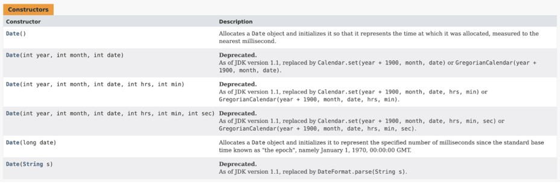
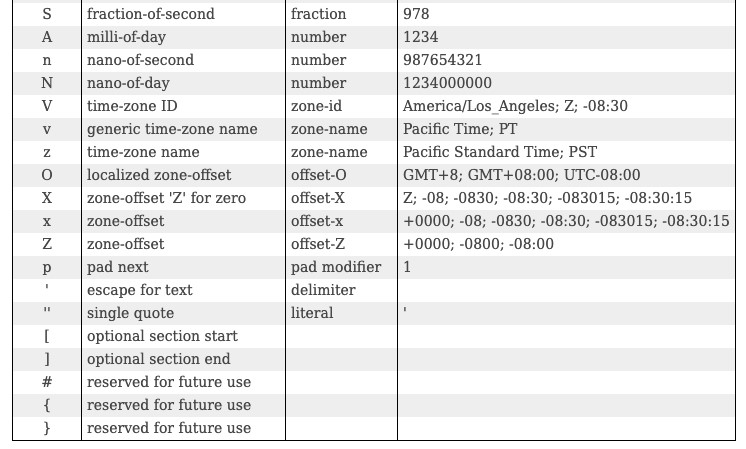
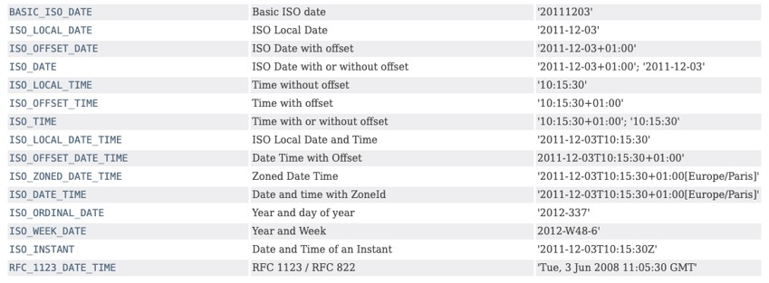

# Java Date & Time API

## Sebelum Balajar

- Java Dasar
- Java Object Oriented Programming
- Java Generic
- Java Collection
- Java Lambda
- Apache Maven
- Java Unit Test
- Java Stream
- Java Internationalization

## Agenda

- Pengenalan Date & Time API
- Date, Calendar dan TimeZone
- LocalDate, LocalTime dan LocalDateTime
- ZoneId, ZoneOffset dan ZonedDateTime
- Instant dan Clock
- Duration dan Period
- Temporal
- Dan lain-lain

## #1 Pengenalan Date & Time API

### Sebelum Date dan Time API

- Sejak awal, di Java representasi tipe data tanggal dan waktu adalah `java.util.Date` dan `java.util.Calendar`
- Java Date dan Time API merupakan fitur baru sejak Java versi 8

### Masalah Dengan Class Date dan Calendar

- Thread Safety, class Date dan Calendar tidak thread safe, dalam artian berbahaya jika diakses secara paralel (beberapa proses mengakses object yang sama).
- Desain class Date dan Calendar tidak terlalu bagus di desain dari awal, hal ini menyulitkan ketika kita butuh melakukan operasi yang melibatkan tanggal dan waktu, seperti mencari durasi waktu, periode, menambah waktu, dan operasi lainnya.
- Desain tanggal dan waktu dengan timezone agak menyulitkan di class Date dan Calendar.

### Package java.time

- Date & Time API yang baru sekarang berada dalam satu package, yaitu package `java.time`
- Sekarang ada banyak sekali class-class yang terdapat di package tersebut, dan kegunaannya berbeda-beda, yang akan kita bahas secara detail di chapter-chapter selanjutnya
- <https://docs.oracle.com/en/java/javase/16/docs/api/java.base/java/time/package-summary.html>

### Perbedaan dengan Date dan Time API Baru

- Object di Date dan Time API baru bersifat immutable dan thread safe, artinya tidak bisa diubah, jika diubah, itu akan membuat object yang baru sehingga aman digunakan para proses paralel
- Terdapat pemisahan antara Tanggal dan Waktu, tidak digabung seperti pada class Date
- Mendukung data lain seperti durasi, periode dan lain-lain

## #2 Date

- Sebelum membahas Date dan Time API yang baru, kita akan sekilas membahas class Date
- Date adalah representasi tanggal dan juga waktu di Java sejak versi awal
- Karena tidak ada pemisahan antara tanggal dan waktu di class Date, ini memang agak menyulitkan jika kita hanya butuh misal tanggal saja, dan waktu saja
- <https://docs.oracle.com/en/java/javase/16/docs/api/java.base/java/util/Date.html>

### Date Constructor



### Millisecond

- Date menggunakan milisecond setelah UNIX epoch (January 1, 1970 00:00:00 UTC)
- Untuk mendapatkan milisecond saat ini, di Java kita bisa menggunakan `System.currentTimeMilis()`
- <https://currentmillis.com/>

### Kode : Membuat Date

```java
var date1 = new Date();
var date2 = new Date(System.currentTimeMilis());

System.out.println(date1);
System.out.println(date2);
```

## #3 Calendar

- Class Calendar adalah class yang digunakan sebagai pembantu class Date
- Pada class Date, hampir semua method untuk melakukan manipulasi tanggal dan waktu sudah ditandai sebagai `@Deprecated`, artinya tidak direkomendasikan digunakan lagi
- Untuk itu, kita butuh menggunakan class Calendar untuk memanipulasi tanggal dan waktu
- Class Calendar tidak memiliki public constructor, sehingga untuk membuat object Calendar, kita akan menggunakan static method milik calendar bernama `getInstance()`

### Kode : Membuat Calendar

```java
// Membuat Calendar
Calendar calendar =  Calendar.getInstance();

// Membuat Date dari Calendar
Date date = calendar.getTime();
```

### Manipulasi Tanggal dan Waktu

- Salah satu fitur yang terdapat di Calendar adalah, kita bisa melakukan manipulasi tanggal dan waktu di object Calendar menggunakan method `set(type, value)`
- Dan untuk mengambil value tanggal atau waktu, kita bisa menggunakan method `get(type)`

### Kode : Mengubah Data Calendar

```java
Calendar calendar = Calendar.getInstance();
calendar.set(Calendar.YEAR, 1900);
calendar.set(Calendar.MONTH, Calendar.FEBRUARY);
calendar.set(Calendar.DAY_OF_MONTH, 10);

Date date = calender.getTime();
```

### Kode : Mengambil Data Calendar

```java
Calendar calendar = Calendar.getInstance();

int year = calendar.get(Calendar.YEAR);
int month = calendar.get(Calendar.MONTH);
int dayOfMonth = calendar.get(Calendar.DAY_OF_MONTH);
int hour = calendar.get(Calendar.HOUR_OF_DAY);
int minute = calendar.get(Calendar.MINUTES);
int second = calendar.get(Calendar.SECOND);
int millisecond = calendar.get(Calendar.MILLISECOND);
```

## #4 TimeZone

- Class TimeZone merupakan representasi dari data time zone
- Secara default, jika kita membuat object Calendar, dan tidak menggunakan TimeZone, secara otomatis objectnya akan menggunakan default TimeZone, yaitu timezone sistem operasi yang kita gunakan.
- Untuk mengetahui default time zone, kita bisa gunakan method `TimeZone.getDefault()`
- Sedangkan jika ingin membuat object TimeZone, kita bisa gunakan method `TimeZone.getTimeZone("Zone ID")`
- Untuk mengetahui semua zone id yang didukung oleh Java, kita bisa gunakan `TimeZone.getAvailableIds()`

### Kode : Membuat TimeZone

```java
TimeZone timeZone1 = TimeZone.getDefault();
TimeZone timeZone2 = TimeZone.getTimeZone("Asia/Jakarta");

String[] availableIDs = TimeZone.getAvailableIds();
```

### TimeZone di Date

- Class Date tidak memiliki method apapun untuk mendapatkan time zone atau mengubah time zone
- Secara default, saat kita membuat object Date, object tersebut akan menggunakan time zone default

### Kode : TimeZone di Date

```java
Date date = new Date();
System.out.println(date.toString());
System.out.println(date.toGMTString());
```

### TimeZone di Calendar

- Berbeda dengan Date, di Calendar, informasi TimeZone yang bisa kita ubah
- Untuk mengubah time zone di Calendar, kita bisa menggunakan method `setTimeZone()`

### Kode : TimeZone di Calendar

```java
Calendar calendar1 = Calendar.getInstance(); // default timezone
Calendar calendar2 = Calendar.getInstance(TimeZone.getTimeZone("GMT"));

System.out.println(calendar1.get(Calendar.HOUR_OF_DAY));
System.out.println(calendar2.get(Calendar.HOUR_OF_DAY));

calendar1.setTimeZone(TimeZone.getTimeZone("GMT"));
System.out.println(calendar1.get(Calendar.HOUR_OF_DAY));
```

## #5 LocalDate

- LocalDate adalah class di Date & Time API baru
- LocalDate merupakan representasi untuk tipe data tanggal (tanpa waktu)
- Default format waktu untuk LocalDate adalah `yyyy-MM-dd`

### Kode : Membuat LocalDate

```java
LocalDate localDate1 = LocalDate.now();
LocalDate localDate2 = LocalDate.of(1900, Month.JUNE, 10);
LocalDate localDate3 = LocalDate.parse("1980-06-10");

System.out.println(localDate1);
System.out.println(localDate2);
System.out.println(localDate3);
```

### Mengubah LocalData

- Object LocalDate juga bisa kita ubah tanggal nya jika kita mau
- Untuk mengubah tanggal, kita bisa menggunakan method with, seperti withYear, withMonth, dan lain-lain
- Perlu diingat, mengubah LocalDate akan menciptakan object LocalDate baru, artinya object aslinya tidak akan berubah, karena bersifat immutable

### Kode : Mengubah LocalDate

```java
LocalDate localDate1 = LocalDate.now();
LocalDate localDate2 = localDate1.withYear(2000);
LocalDate localDate3 = localDate1.withMonth(1);

System.out.println(localDate1);
System.out.println(localDate2);
System.out.println(localDate3);
```

### Manipulasi LocalDate

- Object LocalDate juga bisa kita manipulasi, seperti menambah tanggal atau mengurangi tanggal.
- Untuk menambah tanggal, kita bisa gunakan method plus, seperti plusYears, plusMonths, plusDays, dan lain-lain
- Untuk mengurangi tanggal, kita bisa gunakan method minus, seperti minusYears, minusMonths, minusDays, dan lain-lain
- Perlu diingat, manipulasi LocalDate akan menciptakan object LocalDate baru, artinya object aslinya tidak akan berubah, karena bersifat immutable

### Kode : Manipulasi LocalDate

```java
LocalDate localDate1 = LocalDate.now();
LocalDate localDate2 = localDate1.plusYears(10);
LocalDate localDate3 = localDate1.minusYears(10);

System.out.println(localDate1);
System.out.println(localDate2);
System.out.println(localDate3);
```

### Mangambil Tanggal LocalDate

- LocalDate juga mendukung pengambilan detail data tanggal nya, seperti tahun, bulan, hari dalam bulan, hari dalam tahun, dan lain-lain
- Untuk mengambil data tanggal, kita bisa menggunakan method `get`, seperti `getYear`, `getMonth`, dan lain-lain

### Kode : Mengambil Tanggal LocalDate

```java
LocalDate localDate = LocalDate.now();

int year = localDate.getYear();
Month month = localDate.getMonth();
int monthValue = localDate.getMonthValue();
int dayOfMonth = localDate.getDayOfMonth();
DayOfWeek dayOfWeek = localDate.getDayOfWeek();
int dayOfYear = localDate.getDayOfYear();
```

## #6 LocalTime

- Berbeda dengan LocalDate, LocalTime merupakan representasi data waktu (tanpa tanggal)
- Cara penggunaanya dan method-method nya hampir sama dengan `LocalDate`
- LocalTime juga immutable, jadi kita tidak bisa mengubahnya setelah datanya dibuat, jika kita ubah, maka akan menghasilkan object `LocalTime` baru
- Format standard LocalTime adalah `HH:mm:ss.nano`, dimana second dan nano second nya optional

### Kode : Membuat LocalTime

```java
LocalTime localTime1 = LocalTime.now();
LocalTime localTime2 = LocalTime.of(10, 10, 10);
LocalTime localTime3 = LocalTime.parse("10:10");

System.out.println(localTime1);
System.out.println(localTime2);
System.out.println(localTime3);
```

### Kode : Mengubah LocalTime

```java
LocalTime localTime1 = LocalTime.now();
LocalTime localTime2 = localTime1.withHour(10, 10, 10);
LocalTime localTime3 = localTime1.withHour(10).withMinute(10);

System.out.println(localTime1);
System.out.println(localTime2);
System.out.println(localTime3);
```

### Kode : Manipulasi LocalTime

```java
LocalTime localTime1 = LocalTime.now();
LocalTime localTime2 = localTime1.plusHours(10);
LocalTime localTime3 = localTime1.minusHours(5).withMinutes(5);

System.out.println(localTime1);
System.out.println(localTime2);
System.out.println(localTime3);
```

### Kode : Mengambil Waktu LocalTime

```java
LocalTime localTime = LocalTime.now();

int hour = localTime.getHour();
int minute = localTime.getMinute();
int second = localTime.getSecond();
int nano = localTime.getNano();
```

## #7 LocalDateTime

- Seperti dari nama class nya, `LocalDateTime`, class ini digunakan sebagai representasi tanggal dan waktu, mirip seperti class Date
- LocalDateTime juga immutable, jadi tidak bisa diubah setelah dibuat, jika diubah otomatis akan membuat object baru
- Cara pembuatan, cara mengubah, memanipulasi nya pun sama seperti LocalDate dan LocalTime
- Dan format default untuk LocalDateTime adalah menggunakan format `yyyy-MM-ddTHH:mm:ss.nano`

### Kode : Membuat LocalDateTime

```java
LocalDateTime localDateTime1 = LocalDateTime.now();
LocalDateTime localDateTime2 = LocalDateTime1.of(2020, Month.DECEMBER, 10, 10, 10);
LocalDateTime localDateTime3 = LocalDateTime1.parse("2020-12-10T11:12:13.14444");

System.out.println(localDateTime1);
System.out.println(localDateTime2);
System.out.println(localDateTime3);
```

### Kode : Mengubah LocalDateTime

```java
LocalDateTime localDateTime1 = LocalDateTime.now();
LocalDateTime localDateTime2 = localDateTime1.withYear(1990);
LocalDateTime localDateTime3 = localDateTime1.withMinute(40);

System.out.println(localDateTime1);
System.out.println(localDateTime2);
System.out.println(localDateTime3);
```

### Kode : Manipulasi LocalDateTime

```java
LocalDateTime localDateTime1 = LocalDateTime.now();
LocalDateTime localDateTime2 = localDateTime1.plusYears(1990);
LocalDateTime localDateTime3 = localDateTime1.plusMinutes(40);

System.out.println(localDateTime1);
System.out.println(localDateTime2);
System.out.println(localDateTime3);
```

### Kode : Mengambil Data LocalDateTime

```java
LocalDateTime localDateTime = LocalDateTime.now();

int year = localDateTime.getYear();
Month month = localDateTime.getMonth();
int dayOfMonth = localDateTime.getDayOfMonth();
int hour = localDateTime.getHour();
int minute = localDateTime.getMinute();
int second = localDateTime.getSecond();
int nano = localDateTime.getNano();
```

### Kode : Konveri dari dan ke LocalDate

- Kadang ada kebutuhan kita melakukan konversi data dari LocalDate ke LocalDateTime atau juga sebaliknya
- Untuk melakukan konversi dari LocalDateTime ke LocalDate, kita bisa menggunakan method `toLocalDate()`
- Sedangkan untuk melakukan konversi dari LocalDate ke LocalDateTime, kita bisa mennggunakann method `atTime()`

### Kode : Konversi ke dan dari LocalDate

```java
LocalDateTime localDateTime = LocalDateTime.now();

LocalDate localDate = localDateTime.toLocalDate();
LocalDateTime localDateTimeBack = localDate.atTime(localDate.now());
```

### Konversi dari dan ke LocalTime

- Selain melakukan konnversi untuk tipe data LocalDate, kita juga bisa lakukan ke dan dari tipe data LocalTime.
- Untuk melakukan konversi dari LocalDateTime ke LocalTime, kita bisa menggunakan method `toLocalTime()`
- Sedangkan untuk melakukan konversi dari LocalTime ke LocalDateTime, kita bisa menggunakan method `atDate()`

### Kode : Konversi dari dan ke LocalTime

```java
LocalDateTime localDateTime = LocalDateTime.now();

LocalTime localTime = localDateTime.toLocalTime();
LocalDateTime localDateTimeBack = localTime.atDate(localDate.now());
```

## #8 Year, YearMonth dan MonthDay

- Di Date & Time API baru, terdapat class Year , YearMonth dan MonthDay
- Seperti dari nama class nya, Year digunakan untuk tanggal yang hanya berisi data tahun, dan YearMonth adalah tanggal yang berisi data tahun dan bulan, dan MonthDay adalah tanggal berisi bulan dan hari
- Kenapa menggunakan Year? Kenapa tidak langsung menggunakan angka saja? Misal 2020. Di Year, sudah banyak sekali method yang bisa kita gunakan untuk manipulasi data tanggal dan konversi ke tipe lain seperti LocalDate misal nya
- Begitu juga dengan YearMonth dan MonthDay
- Format default untuk Year adalah yyyy dan format untuk YearMonth adalah `yyyy-MM` dan format untuk MonthDay adalah `--MM-dd`

### Kode : Membuat Year dan YearMonth

```java
Year year1 = Year.now();
Year year2 = Year.of(1999);
Year year3 = Year.parse("2020");

YearMonth yearMonth1 = YearMonth.now();
YearMonth yearMonth2 = YearMonth.of(2000, Month.DECEMBER);
YearMonth yearMonth3 = YearMonth.parse("2020-10");

MonthDay monthDay1 = MonthDay.of(Month.JUNE, 10);
MonthDay monthDay2 = MonthDay.now();
MonthDay monthDay3 = MonthDay.parse("--10-10");
```

### Kode : Konversi dari Year ko LocalDate

```java
Year year = Year.of(1999);
YearMonth yearMonth = year.atMonth(Month.DECEMBER);
LocalDate localDate = yearMonth.atDay(30);
MonthDay monthDay = MonthDay.from(localDate);
```

### Kode : Mengambil Date Year dan YearMonth

```java
Year year = Year.now();
int value = year.getValue();

YearMonth yearMonth = YearMonth.now();
int year1 = yearMonth.getYear();
Month month = yearMonth.getMonth();
int monthValue = yearMonth.getMonthValue();
```

## #9 ZoneId dan ZoneOffset

- Sebelumnya kita sudah tahu bahwa terdapat class `TimeZone` di Java sebagai representasi time zone
- Namun di Java Date & Time API terbaru, terdapat class baru untuk mendukung time zone, yaitu `ZoneId` dan `ZoneOffset`

### ZoneId

- ZoneId mirip dengan TimeZone, dimana ini merupakan representasi time zone id
- Untuk mendapatkan default time zone, kita bisa menggunakan method `ZoneId.systemDefault()`
- Untuk membuat ZoneId, caranya bisa menggunakan method `ZoneId.of("Zone Id")`
- Dan untuk mendapatkan semua daftar time zone id yang didukung oleh Java, kita bisa menggunakan method

### Kode : Membuat ZoneId

```java
ZoneId zoneId = ZoneId.systemDefault();
ZoneId zoneIdGMT = ZoneId.of("GMT");

Set<String> availableZoneIDs = ZoneId.getAvailableZoneIds();
```

### ZoneOffset

- Jika ZoneId merupakan representasi timezone menggunakan time zone id
- Pada class ZonenOffset, iin adalah format time zone dengan offset dari time zone `Greenwich/UTC`, misalnya `+07:00` atau `-01:00`
- Untuk membuat ZoneOffset, kita bisa menggunakan method of
- ZoneOffset adalah turunan dari ZoneId, jadi semua parameter yang menerima object ZoneId, bisa kita isi dengan ZoneOffset

### Kode : Membuat ZoneOffset

```java
ZoneOffset zoneOffset1 = ZoneOffset.of("+07:00");
ZoneOffset zoneOffset2 = ZoneOffset.ofHours(-7);
ZoneOffset zoneOffset3 = ZoneOffset.ofHoursMinutes(5, 30);

System.out.println(zoneOffset1);
System.out.println(zoneOffset2);
System.out.println(zoneOffset3);
```

## #10 ZonedDateTime

- Pada class LocalDateTime, secara default tidak ada informasi time zone sama sekali pada class tersebut
- Jika kita ingin membuat tanggal dan waktu yang mendukung time zone, kita bisa menggunakan class `ZonedDateTime`
- Class ZonedDateTime sama seperti LocalDateTime, perbedaannya hanyalah mendukung time zone
- Format default untuk ZonedDateTime adalah `yyyy-MM-ddTHH:mm:ss.nano(+/-)ZoneOffset[ZoneId]`, dimana ZoneId tidak wajib, dan jika ZoneId diisi, maka nilai ZoneOffset akan di hiraukan

### Kode : Membuat ZonedDateTime

```java
ZonedDateTime zonedDateTime1 = ZonedDateTime.now(); // default zone
ZonedDateTime zonedDateTime2 = ZonedDateTime.now(ZoneId.of("GMT"));
ZonedDateTime zonedDateTime3 = ZonedDateTime.of(LocalDateTime.now(), ZoneOffset.ofHours(7));

System.out.println(zonedDateTime1);
System.out.println(zonedDateTime2);
System.out.println(zonedDateTime3);
```

### Kode : Parsing ZonedDateTime

```java
ZonedDateTime zonedDateTime1 = ZonedDateTime.parse("2020-10-09T08:07:06+07:00[Asia/Jakarta]");
ZonedDateTime zonedDateTime2 = ZonedDateTime.parse("2020-10-09T08:07:06+07:00");

System.out.println(zonedDateTime1);
System.out.println(zonedDateTime2);
```

### Mengubah Time Zone

- Untuk mengubah time zone pada ZonedDateTime, terdapat dua cara
- Pertama, mengubah time zone, tanpa merubah tanggal dan waktu. Caranya dengan menggunakan method `withZoneSameLocal(ZoneId)`
- Kedua, mengubah time zone, sehingga tanggal dan waktu mengikuti timezone yang baru. Caranya dengan menggunakan method `withZoneSameInstance(ZoneId)`

### Kode : Mengubah Time Zone

```java
ZonedDateTime zonedDateTime1 = ZonedDateTime.now(); // default zone
ZonedDateTime zonedDateTime2 = ZonedDateTime.withZoneSameInstance(ZoneId.of("GMT"));
ZonedDateTime zonedDateTime3 = ZonedDateTime.withZoneSameLocal(ZoneId.of("GMT"));

System.out.println(zonedDateTime1);
System.out.println(zonedDateTime2);
System.out.println(zonedDateTime3);
```

## #11 OffsetTime dan OffsetDateTime

- Java Date & Time API memiliki class yang bernama `OffsetTime` dan `OffsetDateTime`
- Class OffsetTime adalah seperti LocalTime, namun memiliki time zone offset
- Dan Class OffsetDateTime adalah seperti LocalDateTime, namun memiliki time zone offset
- Sekilas OffsetDateTime mirip dengan ZonedDateTime, yang membedakan adalah kalo OffsetDateTime hanya bisa menggunakan ZoneOffset, tidak bisa menggunakan ZoneId
- Format default OffsetTime adalah `HH:mm:ss(+/-)ZoneOffset`
  Format default OffsetDateTime adalah `yyyy-MM-ddTHH:mm:ss(+/-)ZoneOffset`

### Kode : Membuat OffsetTime & OffsetDateTime

```java
OffsetTime offsetTime1 = OffsetTime.now();
OffsetTime offsetTime2 = OffsetTime.of(LocalTime.now(), ZoneOffset.ofHours(2));

OffsetDateTime offsetDateTime1 = OffsetDateTime.now();
OffsetDateTime offsetDateTime2 = OffsetDateTime.of(LocalDateTime.now(), ZoneOffset.ofHours(2));
```

### Konversi ke dan dari Non Offset

- Apa yang bisa kita lakukan di LocalTime dan LocalDateTime bisa juga dilakukan di OffsetTime dan OffsetDateTime
- Selain itu kita juga bisa konversi data dari dan ke non offset

### Kode : Konversi ke dan dari Non Offset

```java
LocalTime localTime = LocalTime.now();
OffsetTime offsetTime = localTime.atOffset(ZoneOffset.ofHours(7));
LocalTime localTime1 = offsetTime.toLocalTime();

LocalDateTime localDateTime = LocalDateTime.now();
OffsetDateTime offsetDateTime = localDateTime.atOffset(ZoneOffset.ofHours(7));
LocalDateTime localDateTime1 = offsetDateTime.toLocalDateTime();
LocalDate localDate = offsetDateTime.toLocalDate();
LocalTime = localTime2 = offsetDateTime.toLocalTime();
```

## #12 Instant

- Sebelumnya, milliseconds direpresentasikan dengan tipe data long, di Java Date & Time API baru, implementasi milliseconds direpresentasikan dalam class Instant
- Instant juga sama seperti class Date, dia menggunakan milliseconds setelah Unix EPOCH 1970-01-01T00:00:00Z
- Artinya secara time zone, Instant menggunakan time zone UTC (00:00)

### Kode : Membuat Instant

```java
Instant instant1 = Instant.now();
Instant instant2 = Instant.ofEpochMilli(System.currentTimeMilis());

System.out.println(instant1);
System.out.println(instant2);
```

### Kode : Mengubah Instant

```java
Instant instant1 = Instant.now();
Instant instant2 = Instant.plusMillis(1000);
Instant instant3 = Instant.plusSeconds(1000);
Instant instant4 = Instant.minusMillis(1000);
Instant instant5 = Instant.minusSeconds(1000);
```

### Kode : Mengambil Data Instant

```java
Instant instant = Instant.now();
long epochMilli = instant.toEpochMilli();
long epochSecond = instant.getEpochSecond();
int nano = instant.getNano();
```

### Konversi dari Instant

- Karena Instant berisikan milisecond, jadi kita bisa lakukan konversi ke tipe data lainnya, seperti LocalDate, LocalTime dan ZonedLocalTime
- Namun karena Instant menggunakann time zone UTC, jadi kita perlu memberi tahu time zone apa yang akan kita gunakan ketika kita lakukan konversi
- Untuk melakuka konversi dari Instant ke tipe data lainnya, kita bisa menggunakan method ofInstant(instant, zone) ketika membuat object nya

### Kode : Konversi dari Instant

```java
Instant instant = Instant.now();

LocalDateTime localDateTime = LocalDateTime.ofInstant(instant, ZoneId.of("Asia/Jakarta"));
LocalTime localTime = LocalTime.ofInstant(instant, ZoneId.of("Asia/Jakarta"));
ZonedDateTime zonedDateTime = ZonedDateTime.ofInstant(instant, Zone.of("Asia/Jakarta"));
```

### Konversi ke Instant

- Selain itu konversi juga bisa dilakukan ke Instant, dari tipe data LocalDateTime dan ZonedDateTime
- Namun karena Instant menggunakan time zone UTC, jadi kita perlu menambahkan ZoneOffset jika konversi dari tipe data yang tidak memiliki time zone

### Kode : Konversi ke Instant

```java
Instant instant1 = LocalDateTime.now().toInstant(ZoneOffset.ofHours(7));
Instant instant2 = ZonedDateTime.now().toInstant();

System.out.println(instant1);
System.out.println(instant2);
```

## #13 Clock

- Seperti nama class nya, Clock adalah representasi tanggal dan waktu saat ini mengikuti time zone yang kita pilih
- Best practice nya sebenarnya jika kita ingin menggunakan tipe data di Date & Time API yang multi time zone adalah menggunakan Clock, sehingga jika kita ingin membuat data baru, kita bisa memanfaatkan Clock

### Kode : Membuat Clock

```java
Clock clockUTC = Clock.systemUTC();
Clock clockSystem = Clock.systemDefaultZone();
Clock clockJakarta = Clock.system(ZoneId.of("Asia/Jakarta"));
```

### Mendapatkan Instant di Clock

- Kita sudah tahu bahwa Clock itu akan selalu berjalan, tidak pernah berhenti
- Dan representasi milliseconds di Date & Time API baru adalah Instant
- Oleh karena itu, untuk mendapatkan tanggal dan waktu saat ini sesuai dengan time zone di Clock, kita bisa menggunakan method `instant()`, dan otomatis akan mengembalikan Instant saat ini sesuai dengan Clock nya
  = Perlu diingat, karena Instant itu selalu menggunakan time zone UTC, jadi jika clock nya tidak menggunakan UTC, maka akan secara otomatis dikonversi ke time zone UTC

### Kode : Mendapatkan Instant di Clock

```java
Clock clockJakarta = Clock.system(ZoneId.of("Asia/Jakarta"));

Instant instant1 = clockJakarta.instant();
System.out.println(instant1);
Thread.sleep(1_000);

Instant instant2 = clockJakarta.instant();
System.our.println(instant2);
Thread.sleep(1_000);
```

### Membuat Tanggal dan Waktu dari Clock

- Karena jika menggunakan Instant kita harus melakukan konversi secara manual ke LocalDateTime atau ZonedDateTime, karena bisa saja time zone nya berbeda
- Untungnya, kita juga bisa membuat tipe data tanggal dan waktu langsung menggunakan Clock, caranya menggunakan method `now(Clock)`
- Secara otomatis informasi time zone Clock akan dibawa di tipe data tanggal dan waktu yang kita buat

### Kode : Membuat Data dari Clock

```java
Clock clockJakarta = Clock.system(ZoneId.of("Asia/Jakarta"));

Year year = Year.now(clockJakarta);
YearMonth yearMonth = YearMonth.now(clockJakarta);
LocalTime localTime = LocalTime.now(clockJakarta);
LocalDate localDate = LocalDate.now(clockJakarta);
LocalDateTime localDateTime = LocalDateTime.now(clockJakarta);
ZoneDateTime zoneDateTime = ZoneDateTime.now(clockJakarta);
```

## #14 Duration

- Class Duration adalah representasi dari data durasi waktu
- Durasi waktu yang terdapat di class Duration
- Dengan menggunakan Duration, kita bisa dengan mudah mengkonversi durasi ke waktu yang kita inginkan, misal hour, minute, second dan nano second

### Kode : Membuat Duration

```java
Duration duration1 = Duration.ofSeconds(10);
Duration duration2 = Duration.ofMillis(10);
Duration duration3 = Duration.ofHours(10);
```

### Kode : Mengambil Data Duration

```java
Duration duration = Duration.ofHours(10);

long days = duration.toDays();
long hours = duration.toHours();
long minutes = duration.toMinutes();
long seconds = duration.toSeconds();
long nanos = duration.toNanos();
```

### Kode : Menghiting Duration

```java
Duration duration1 = Duration.between(LocalTime.of(10, 10), localTime.of(20, 20));
Duration duration2 = Duration.between(LocalDateTime.now(), LocalDateTime.now().plusHours(10));
```

## #15 Period

- Class Period mirip dengan Duration, yang membedakan adalah Period adalah durasi untuk tanggal
- Cara penggunaan Period hampir mirip dengan Duration

### Kode : Membuat Period

```java
Period period1 = Period.ofDays(10);
Period period2 = Period.ofWeeks(10);
Period period3 = Period.ofMonths(10);
Period period4 = Period.ofYears(10);
Period period5 = Period.of(10, 10, 10);
```

### Kode : Mengambil Data Period

```java
Period period = Period.of(10, 10, 10);

int years = period.getYears();
int months = period.getMonths();
int dayss = period.getDays();
```

### Kode : Menghitung Period

```java
Period period = Period.between(
	LocalDate.of(2020, 10, 10),
	LocalDate.of(2020, 12, 10)
);

System.out.println(oeriod.getYears());
System.out.println(oeriod.getMonths());
System.out.println(oeriod.getDays());
```

## #16 Temporal

- Di dalam package `java.time`, sebenarnya ada package `java.time.temporal`
- Di dalam package `java.time.temporal` terdapat banyak sekali interface yang merupakan kontrak dari Java Date & Time API

### Interface Temporal

| Interface        | Keterangan                                                                  |
| ---------------- | --------------------------------------------------------------------------- |
| Temporal         | Interface untuk temporal object, seperti date, time, dan lain-lain          |
| TemporalAmount   | Interface untuk jumlah waktu, seperti duration dan period                   |
| TemporalUnit     | Interface untuk unit satuan temporal, seperti jam, menit, hari              |
| TemporalFied     | Interface untuk field dalam temporal data                                   |
| TemporalQuery    | Interface untuk query data dari TemporalAccessor (super interface Temporal) |
| TemporalAdjuster | Strategi untuk menyesuaikan objek temporal                                  |

### Temporal

- Hampir semua tipe data tanggal dan waktu di Java Date & Time adalah implementasi dari interface Temporal
- Maka dari itu, jika diperhatikan, hampir semua tipe data nya memiliki method-method yang hampir sama

### Kode : Temporal

```java
Temporal temporal1 = LocalTime.now();
Temporal temporal2 = LocalDate.now();
Temporal temporal3 = LocalDateTime.now();
Temporal temporal4 = ZoneDateTime.now();
Temporal temporal5 = Year.now();
Temporal temporal6 = YearMonth.now();
Temporal temporal7 = Instant.now();
```

### TemporalAmmount

- Duration dan Period adalah implementasi dari interface `TemporalAmount`
- Salah satu method yang menggunakan TemporalAmount di Temporal adalah `plus()` da `minus()`
- Artinya, dengan ini kita bisa meggunakan object TemporalAmount untuk melakukan penambahan/pengurangan tanggal dan waktu

### Kode : TemporalAmount

```java
LocalDateTime localDateTime1 = LocalDateTime.now();
LocalDateTime localDateTime2 = LocalDateTime.plus(Duration.ofHours(10));
LocalDateTime localDateTime3 = LocalDateTime.minus(Period.of(0, 10, 10));

System.out.println(localDateTime1);
System.out.println(localDateTime2);
System.out.println(localDateTime3);
```

### TemporalUnit

- TemporalUnit adalah implementasi dari unit satuan waktu
- Implementasi TemporalUnit adalah sebuah enum `ChronoUnit`
- TemporalUnit selain sebagai informasi satuan waktu, bisa juga digunakan untun menghitung durasi waktu

### Kode : TemporalUnit

```java
long between1 = ChronoUnit.SECONDS.between(LocalDateTime.now(), LocalDateTime.now().plusDays(10));
long between2 = ChronoUnit.MINUTES.between(LocalDateTime.now(), LocalDateTime.now().plusDays(10));
long between3 = ChronoUnit.DAYS.between(LocalDateTime.now(), LocalDateTime.now().plusDays(10));

System.out.println(between1);
System.out.println(between2);
System.out.println(between3);
```

### TemporalField

- TemporalField adalah informasi field yang terdapat dalam sebuah tipe data
- Semua object Temporal memiliki method bernama `get(TemporalField)` atau `getLong(TemporalField)` untuk mendapatkan info seputar field pada object tersebut, sesuai dengan Field yang kita inginkan
- Implementasi TemporalField adalah enum bernama `ChronoField`

### Kode : TemporalField

```java
LocalDateTime localDateTime = LocalDateTime.now();

int year = localDateTime.get(ChronoField.YEAR);
int month = localDateTime.get(ChronoField.MONTH_OF_YEAR);
int day = localDateTime.get(ChronoField.DAY_OF_MONTH);
int hour = localDateTime.get(ChronoField.HOUR_OF_DAY);
```

### TemporalQuery

- TemporalQuery merupakan lambda interface yang bisa kita gunakan untuk mengambil informasi dari data TemporalAccessor
- TemporalQuery adalah generic type, jadi kita bisa mengembalikan tipe data apapun pada hasil query yang kita lakuka ndi TemporalAccessor

### Kode : TemporalQuery

```java
LocalDateTime localDateTime = LocalDateTime.now();

List<Integer> integers = localDateTime.query(temporal -> {
	ArrayList<Integer> list = new ArrayList<>();
	list.add(temporal.get(ChronoField.YEAR));
	list.add(temporal.get(ChronoField.MONTH_OF_YEAR));
	list.add(temporal.get(ChronoField.DAY_OF_MONTH));
	return list;
});
```

### TemporalAdjuster

- TemporalAdjuster adalah strategi untuk menyesuaikan objek temporal.
- Kita bisa melakukan implementasi penyesuaian object sendiri, atau kita juga bisa menggunakan helper class beranam TemporalAdjusters
- Terdapat banyak static method di TemporalAdjusters yang bisa kita gunakan untuk mempermudah melakukan penyesuaian objek temporal

### Kode : TemporalAdjuster

```java
LocalDate localDate1 = LocalDate.now();
LocalDate localDate2 = LocalDate.with(TemporalAdjuster.firstDayOfMonth());
LocalDate localDate3 = LocalDate.with(TemporalAdjuster.lastDayOfMonth());
LocalDate localDate4 = LocalDate.with(TemporalAdjuster.firstDayOfYear());
LocalDate localDate5 = LocalDate.with(TemporalAdjuster.lastDayOfYear());
```

## #17 DayOfWeek

- Yang menarik di Java Date & Time adalah, memiliki implementasi data hari
- Data hari ini beruba Enum `DayOfWeek`, namun dia adalah turunan dari Temporal, sehingga operasi yang bisa dilakukan di Temporal bisa kita lakukan disini, seperti menambah atau mengurangi

### Kode : DayOfWeek

```java
DayOfWeek dayOfWeek1 = DayOfWeek.SUNDAY;
DayOfWeek dayOfWeek2 = dayOfWeek1.plus(2);
DayOfWeek dayOfWeek3 = dayOfWeek1.minus(2);

System.out.println(dayOfWeek1);
System.out.println(dayOfWeek2);
System.out.println(dayOfWeek3);
```

## #18 Parsing dan Formatting

- Sebelumnya di awal-awal kita sering sekali menggunakan method parse untuk melakukan parsing data String menjadi objek Temporal
- Sebenarnya proses parsing dan formatting tersebut dilakukan oleh class `java.time.format.DateTimeFormatter`

### Pattern

- Pattern untuk membuat DateTimeFormatter hampir mirip dengan pattern yang sudah pernah dibahas di course tentang Java Internationalization
- Atau lebih detail bisa dilihat di halaman ini : <https://docs.oracle.com/en/java/javase/16/docs/api/java.base/java/time/format/DateTimeFormatter.html>




### Parsing

- Sebelumnya kita sudah bahas tentang default pattern untuk parsing semua tipe objek temporal
- Jika kita ingin mengubah format pattern nya, kita bisa menggunakan DateTimeFormatter pada saat melakukan parsing, misal :
- `LocalDate.parse(“yyyy MM hh”, dateTimeFormatter)`

### Kode : Parsing dengan DateTimeFormatter

```java
DateTimeFormatter formatter = DateTimeFormatter.ofPattern("yyyy MM dd");

LocalDate localDate = LocalDate.parse("2020 10 12", formatter);

System.out.println(localDate);
```

### Formatting

- Untuk formatting juga kita bisa menggunakan DateTimeFormatter
- Untuk melakukan formatting, kita bisa menggunakan method `format(DateTimeFormatter)` milik objek temporal

### Kode : Formatting

```java
DateTimeFormatter formatter = DateTimeFormatter.ofPattern("yyyy MM dd");

LocalDate localDate = LocalDate.now();
String format = localDate.format(formatter);

System.out.println(format);
```

### Default Formatter

- Selain kita bisa membuat formatter sendiri menggunakan pattern
- Sudah disediakan juga formatter default, sehingga jika kita ingin menggunakan formatter misal yang sudah standar internasional, kita tidak perlu membuat ulang menggunakan pattern

### Formatter Default di Java



### Kode : Default Formatter

```java
DateTimeFormatter formatter = DateTimeFormatter.ISO_LOCAL_DATE;

LocalDate localDate = LocalDate.parse("2020-10-12", formatter);
String foramt = localDate.format(formatter);
```

### Internationalization

- DateTimeFormatter juga mendukung internationalization
- Caranya saat membuat formatter, kita perlu menambahkan Locale

### Kode : Internationalization

```java
Locale locale = new Locale("in", "ID");
DateTimeFormatter formatter = DateTimeFormatter.ofPattern("yyyy MMMM dd", locale);

LocalDate localDate = LocalDate.now();
String format = localDate.format(formatter);

System.out.println(format);
```

## #19 Legacy Date dan Time

- Saat fitur Java Date & Time API baru keluar, Java juga menambahkan integrasi dengan fitur legacy date dan time yang menggunakan Date, Calendar dan TimeZone
- Kita bisa melakukan konversi dari tipe temporal legacy ke tipe temporal baru ataupun sebaliknya

### Kode : Konversi Legacy ke Baru

```java
Date date = new Date()
Instant instantDate = date.toInstant();


Calendar calendar = Calendar.getInstance();
Instant instantCalendar = calendar.toInstant();

TimeZone timeZone = TimeZone.getDefault();
ZoneId zoneId = timeZone.toZoneId();
```

### Kode : Konveri New ke Legacy

```java
ZonedDateTime zonedDateTime = ZonedDateTime.now();
Date date = Date.from(zoneDateTime.toInstant());

Calendar calendar = GregorianCalendar.from(zoneDateTime);

ZoneId zoneId = ZoneId.systemDefault();
TimeZone timeZone = TimeZone.getTimeZone(zoneId);
```

## #20 Materi Selanjutnya

- Java Thread
- Java Reflection
- Java Input & Output
- Java Network
- Java Memory
- Java Validation
- Java Persistence API
- Java Web
