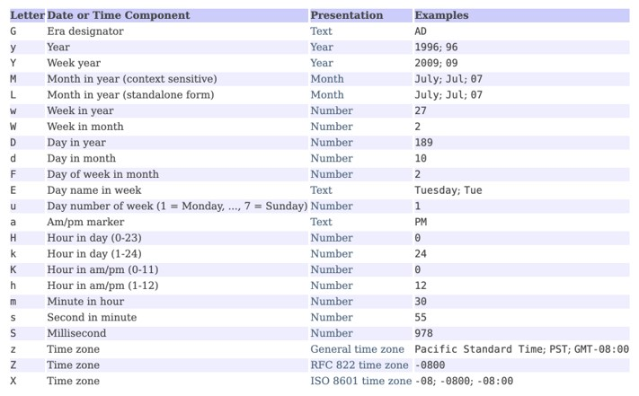
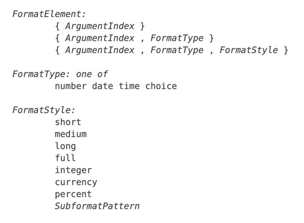
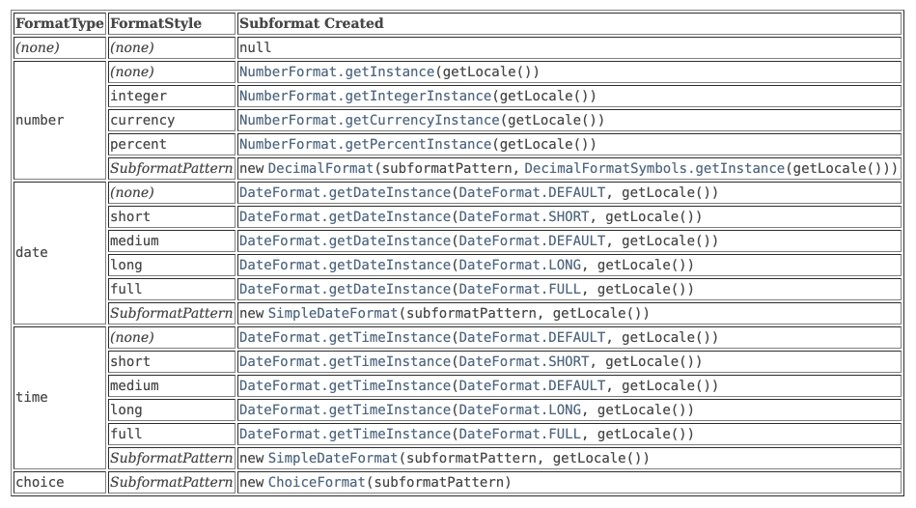

# Java Internationalization

## Sebelum Belajar

- Java Dasar
- Java Obeject Oriented Programming
- Java Standard Classes
- Java Generic
- Java Collection
- Apache Maven
- Java Unit Test
- <https://www.udemy.com/course/pemrograman-java-pemula-sampai-mahir/?referralCode=E97428FBE9A6F3590D8D>

## Agenda

- Pengenalan Internationalization
- Locale Class
- Resource Bundle
- I18N di Date
- I18N di Number
- I18N di Currency
- Message Format
- Dan lain-lain

## #1 Pengenalan Internationalization

- Internationalization atau biasa disingkat I18N, karena ada 18 karakter diantara hurup I dan N
- I18N adalah proses membuat desain aplikasi yang bisa beradaptasi sesuai dengan bahasa dan tempat dari pengguna aplikasinya tanpa harus melakukan perubahan pada kode program aplikasi yang kita buat
- Java sudah mendukung I18N, jadi kita bisa membuat aplikasi kita mendukung banyak bahasa (misal bahasa Indonesia, Inggris, dan lain-lain)

### Karakteristik Aplikasi yang Mendukung I18N

- Penambahan dukungan bahasa tidak perlu melakukan perubahan kode program Java
- Tampilan yang berubah text / label, seperti misal status, label di komponen UI, semuanya tidak di hardcode di kode program, melainkan disimpan di tempat diluar kode program, dan diambil secara dinamis sesuai dengan bahasa dan lokasi pengguna aplikasi
- Mengikuti kultur lokasi user, seperti format tanggal, waktu, angka dan mata uang.
- Penambahan dukungan bahasa baru bisa dilakukan secara cepat

## #2 Locale

- DI Java, bahasa dan negara sudah ada representasinya, namanya adalah class Locale
- Class Locale ini bisa digunakan sebagai representasi bahasa dan negara
  Kenapa ada negara dan bahasa? Kenapa tidak negara saja, atau bahasa saja? - Karena kadang ada bahasa yang sama untuk negara berbeda, atau bahasa berbeda untuk negara yang sama
- Locale mengikuti standar IETF BCP 47, yang terdiri dari RFC 4647 "Matching of Language Tags” dan RFC 5646 "Tags for Identifying Languages"

### Penulisan Bahasa

- Penulisan bahasa di Locale menggunakan ISO 639 alpha 2 atau alpha 3
- Ketika sebuah bahasa memiliki kode alpha 2 dan alpha 3, maka yang harus digunakan adalah alpha 2
- <https://www.loc.gov/standards/iso639-2/php/code_list.php>

### Penulisan Negara

- Penulisan negara di Locale menggunakan ISO 3166 alpha-2
- <https://www.iban.com/country-codes>

### Kode : Menggunakan Locale

```java
String language = "id";
String country = "ID";

Locale locale = new Locale(language, country);

System.out.println(locale.getLanguage());
System.out.println(locale.getCountry());

System.out.println(locale.getDisplayLanguage());
System.out.println(locale.getDisplayCountry());
```

## #3 Resource Bundle

- ResourceBundle adalah class yang digunakan sebagai bundle yang berisikan data yang bisa berubah sesuai dengan Locale yang dipilih.
- ResourceBundle cocok digunakan untuk menyimpan data I18N, dimana semua data akan disimpan dalam sebuah properties file

### Properties File

- Saat kita menggunakan ResourceBundle, kita perlu membuat properties file di dalam resources sebagai tempat untuk ResourceBundle melakukan lookup data
- Misal kita membuat file properties dengan nama message.properties di dalam resources

### Kode : message.properties

```env
hello=Hello
goodbye=Good Bye
```

### Kode : Menggunakan ResourceBundle

```java
ResourceBundle resourceBundle = ResourceBundle.getBundle("message");

System.out.println(resourceBundle.getString("hello"));
System.out.println(resourceBundle.getString("goodbye"));
```

### I18N di ResourceBundle

- Kode sebelumnya kita hanya menggunakan ResourceBundle sebagai object untuk mengambil data dari properties file, kalo seperti ini tidak ada bedanya dengan class Properties
- Yang membedakan, dalam ResourceBundle, kita bisa melakukan I18N
- Namun untuk melakukan itu, kita perlu menyediakan properties file sesuai dengan Locale nya
- Misal jika kita ingin mendukung bahasa in dan negara ID, maka kita perlu membuat `message_in_ID.properties`.
- File nya butuh diawali dengan message karena sebelumnya kita menggunakan nama file `message.properties`

### Kode : message_in_ID.properties

```env
hello=Halo
goodbye=Selamat Tinggal
```

### Kode: I18N di ResourceBundle

```java
Locale indonesia = new Locale("in", "ID");
ResourceBundle resourceBundle = ResourceBundle.getBundle("message", indonesia);

System.out.println(resourceBundle.getString("hello"));
System.out.println(resourceBundle.getString("goodbye"));
```

### Jiks Tidak ada Properties untuk Locale

- Apa yang terjadi jika ada Locale yang tidak tersedia dalam file properties nya?
- Misal kita akan menggunakan Locale en_US, sedangkan tidak ada file `message_en_US.properties` nya?
- Jika itu terjadi, secara default ResourceBundle akan menggunakan message.properties

### Amankah Membuat ResourceBundle Terus?

- Cara membuat ResourceBundle menggunakan static method `getBundle()`
- Di dalam implementasi `getBundle()` telah diimplementasikan caching, artinya jika kita mengambil resource yang sama dengan locale yang sama, tidak akan dibuat ulang, melainkan akan menggunakan ResourceBundle yang sudah tersedia
- Hal ini menjadi aman jika kita selalu membuat ResourceBundle terus menerus

## #4 I18N di Date dan Time

- I18N di tipe data String mungkin sederhana, bagaimana jika tipe data Date atau Waktu?
- Di Java kita tahu bahwa tipe data Date dan Time direpresentasikan dalam class Date
- Bagaimana misal jika kita ingin menampilkan tanggal dalam bahasa Indonesia, bahasa Inggris, atau yang lainnya?
- Di Java, I18N di Date sudah disediakan menggunakan DateFormatter

### DateFormat Class

- DateFormat merupakan class yang bisa kita gunakan untuk melakukan parsing dari String ke Date, atau format dari Date ke String
- DateFormat mendukung I18N jika misal kita ingin melakukan format dan parse, sehingga bisa menerima hari dengan data Sunday, Monday atau Minggu, Senin
- DateFormat adalah abstract class, salah satu implementasinya adalah class SimpleDateFormat

### Pattern



### Kode : Format menggunakan Date Format

```java
SimpleDateFormat dateFormat = new SimpleDateFormat("EEEE dd MMMM yyyy");
String format = dateFormat.format(new Date());

System.out.println(format);
```

### Kode : I18N di Date Format

```java
String pattern = "EEEE dd MMMM yyyy";
Locale locale = new Locale("in", "ID");
SimpleDateFormat dateFormat = new SimpleDateFormat(pattern, locale);
String format = dateFormat.format(new Date());
System.out.println(format);
```

### Kode : Parsing menggunakan Date Format

```java
String pattern = "EEEE dd MMMM yyyy";
Locale locale = new Locale("in", "ID");
SimpleDateFormat dateFormat = new SimpleDateFormat(pattern, locale);

try {
	Date date = dateFormat.parse("Minggu 28 Februari 2021");
	System.out.println(date);
} catch (ParseException e) {
	System.out.println("Error parsing : " + e.getMessage());
}
```

## #5 I18N di Number

- Apakah perlu I18N di number?
- Yup perlu, karena kadang beda bahasa beda format penulisan number nya.
- Contoh, di Indonesia menggunakan `.` (titik) sebagai pemisah ribuan, dan `,` (koma) untuk pemisah bilangan pecahan, sedangkan di Amerika, itu terbalik

### NumberFormat Class

- Untuk melakukan I18N di Java, kita bisa menggunakan class `NumberFormat`
- NumberFormat adalah abstract class, untuk membuat object NumberFormat, kita bisa menggunakan static method `getInstance()` milik class NumberFormat

### Kode : Number Format

```java
NumberFormat numberFormat = NumberFormat.getInstance();
String format = numberFormat.format(10000000.255);

System.out.println(format);
```

### Kode : I18N di Number Format

```java
Locale indonesia = new Locale("in"m "ID");
NumberFormat numberFormat = NumberFormat.getInstance(indonesia);
String format = numberFormat.format(10000000.255);

System.out.println(format);
```

### Kode : Parsing Menggunakan Number Format

```java
Locale indonesia = new Locale("in"m "ID");
NumberFormat numberFormat = NumberFormat.getInstance(indonesia);

try {
	double number = numberFormat.parse("10.000.000.255").doubleValue();
	System.out.println(number);
} catch (ParseException e) {
	System.out.println("Error parsing : " + e.getMessage());
}
```

## #6 I18N di Currency

- Java juga mendukung I18N untuk mata uang atau currency
- Ada 2 class yang bisa kita gunakan untuk melakukan I18N di Java, yaitu class `Currency` dan class `NumberFormat`

### Currency Class

- Currency class adalah implementasi standard dari ISO 4217 currency codes
- <https://www.iso.org/iso-4217-currency-codes.html>
- Dengan menggunakan class ini, kita bisa mengetahui nama mata uang, kode mata uang sampai simbol yang digunakan
- Untuk membuat object Currency, kita wajib menggunakan Locale yang memiliki negara, karena memang mata uang tergantung dari negaranya, bukan bahasanya
- Constructor Currency class adalah private, jadi untuk membuat Currency, kita harus menggunakan static method `getInstance()`

### Kode : Currency

```java
Locale indonesia = new Locale("in"m "ID");
Currency currency = Currency.getInstance(indonesia);

System.out.println(currency.getDisplayName());
System.out.println(currency.getCurrencyCode());
System.out.println(currency.getSymbol(indonesia));
```

### Currency di NumberFormat

- Currency class hanya digunakan untuk mendapatkan data nama mata uang, satuan, dan simbol, bagaimana jika kita ingin melakukan format number dalam bentuk mata uang?
- Jika dalam kasus ini, lebih baik menggunakan NumberFormat
- NumberFormat juga tidak hanya bisa digunakan untuk format dan parsing number, tapi juga number dalam bentuk currency
- Untuk membuat NumberFormat yang mendukung currency, kita bisa gunakan static method `getCurrencyInstance()`

### Kode : Format Currency di NumberFormat

```java
Locale indonesia = new Locale("in", "ID");
NumberFormat numberFormat = NumberFormat.getCurrencyInstance(indonesia);
String format = numberFormat.format(10000000.255);
System.out.println(format);
```

### Kode : Parsing Currency

```java
Locale indonesia = new Locale("in", "ID");
NumberFormat numberFormat = NumberFormat.getCurrencyInstance(indonesia);
try {
	double value = numberFormat.parse("Rp1.000.000,26").doubleValue();
	System.out.println(value);
} catch (ParseException e) {
	System.out.println("Error parsing : " + e.getMessage());
}
```

## #7 Message Format

- Ketika melakukan I18N, kadang kita membutuhkan data yang bentuknya dinamis, sesuai dengan parameter, misal kita butuh String Hi {nama}, Selamat Datang di {aplikasi}
- Jika kita menggunakan Resource Bundle, hal tersebut tidak bisa dilakukan secara otomatis, kita perlu melakukannya secara manual, dengan cara menggabungkan beberapa String
- Untungnya di Java terdapat class bernama `MessageFormat`
- MessageFormat class ini digunakan untuk melakukan substitusi data parameter, namun data string awalnya perlu ditambahkan penanda parameter

### Parameter di MessageFormat

- Penggunakann parameter di MessageFormat, menggunakan kurung kurawal buka, diikuti dengan index (dimulai dari 0) dan diakhiri dengan kurung kurawal tutup, misal :
- Hi {0}, Selamat Datang di {1}
- Jika kita menggunakan nomor index yang sama, artinya data akan menggunakan parameter yang sama, misal :
- Hi {0}, Anda bisa mencari data Anda dengan mengetik "{0}" di pencarian.

### Kode : Membuat MessageFormat

```java
String pattern = "Hi {0}, Anda bisa mencari data Anda dengan mengetik {0} di pencarian.";
MessageFormat messageFormat = new MessageFormat(pattern);
String format = messageFormat.format(new Object[]{"Eko"});
System.out.println(format);
```

### Integrasi Dengan ResourceBundle

- Sebenarnya sekilas kita perhatikan jika MessageFormat itu tidak ada hubungannya dengan I18N
- Namun, kita juga bisa mengkombinasikan dengan ResourceBundle, dan menyimpan pattern nya di dalam ResourceBundle properties file
- Dengan demikian, MessageFormat seakan-akan memiliki kemampuan I18N

### Kode : Message Properties

```env
// message.properties
hello=Hello
goodbye=Good Bye
welcome.message=Hi {0}, Welcome to {1}

// message_in_ID.properties
hello=Halo
goodbye=Selamat Tinggal
welcome.message=Hallo {0}, Selamat Datang di {1}
```

### Kode : MessageFormat dan ResourceBundle

```java
Locale indonesia = new Locale("in", "ID");
ResourceBundle resourceBundle = ResourceBundle.getBundle("message", indonesia);
String pattern = resourceBundle.getString("welcome.message");

MessageFormat messageFormat = new MessageFormat(pattern);
String format = messageFormat.format(new Object[]{"Eko", "Programmer Zaman Now"});
System.out.println(format);
```

## #8 Message Format Type

- Materi sebelumnya kita sudah membahas tentang MessageFormat untuk melakukan substitusi data.
- Bagaimana jika datanya bentuknya adalah Number atau Date?
- Sebelumnya kita sudah tahu, bahwa kita bisa melakukan I18N di Number dan Date, apakah ini juga bisa kita lakukan di MessageFormat?
- Jawabanya adalah iya, kita bisa lakukan itu, namun perlu ada beberapa perubahan

### Message Format Pattern





### Kode : Message Properties

```env
// message.properties
hello=Hello
goodbye=Good Bye
welcome.message=Hi {0}, Welcome to {1}
status=Hi {0}, Now {1,date,EEEE, dd MMMM yyyy}, your balance is {2,number,currency}

// message_in_ID.properties
hello=Halo
goodbye=Selamat Tinggal
welcome.message=Hallo {0}, Selamat Datang di {1}
status=Hallo {0}, Sekarang {1,date,EEEE, dd MMMM yyyy}, Saldo kamu {2,number,currency}
```

### Kode : Message Format Type

```java
Locale indonesia = new Locale("in", "ID");
ResourceBundle resourceBundle = ResourceBundle.getBundle("message", indonesia);
String pattern = resourceBundle.getString("status");

MessageFormat messageFormat = new MessageFormat(pattern);
String format = messageFormat.format(new Object[]{"Eko", new Date(), 10000000});
System.out.println(format);
```

## #9 Choice Format

- ChoiceFormat class adalah class yang digunakan untuk menyematkan data dengan range number, biasanya ini digunakan untuk kata plurals, misal jika 1 namanya file, jika banyak namanya files
- Pembuatan pattern untuk ChoiceFormat sangat sederhana, cukup gunakan number#value atau `number<value,` dan urutannya harus dari kecil ke besar, dan dipisahkan menggunakan tanda | (pagar), misal :
- `-1#negatif | 0#kosong | 1#satu | 1<banyak`

### Kode : ChoiceFormat

```java
String pattern = "-1#negatif | 0#kosong | 1#satu | 1<banyak";
ChoiceFormat = choiceFormat = new ChoiceFormat(pattern);
String format = choiceFormat.format(2);
System.out.println(format);
```

### ChoiceFormat di MessageFormat

- Seperti yang sudah kita bahas di MessageFormat
- ChoiceFormat juga didukung di MessageFormat, kita cukup gunakan type

### Kode : Message Properties

```env
// message.properties
hello=Hello
goodbye=Good Bye
welcome.message=Hi {0}, Welcome to {1}
status=Hi {0}, Now {1,date,EEEE, dd MMMM yyyy}, your balance is {2,number,currency}
balance=Total Balance : {0,number,currecy} {0,choice,-1#Debt | 0#Zero |1#Available}

// message_in_ID.properties
hello=Halo
goodbye=Selamat Tinggal
welcome.message=Hallo {0}, Selamat Datang di {1}
status=Hallo {0}, Sekarang {1,date,EEEE, dd MMMM yyyy}, Saldo kamu {2,number,currency}
balance=Jumlah Saldo : {0,number,currecy} {0,choice,-1#Hutang | 0#Kosong |1#Tersedia}
```

### Kode : ChoiceFormat di MessageFormat

```java
Locale indonesia = new Locale("in", "ID");
ResourceBundle resourceBundle = ResourceBundle.getBundle("message", indonesia);
String pattern = resourceBundle.getString("balance");

MessageFormat messageFormat = new MessageFormat(pattern);
String format = messageFormat.format(new Object[]{0});
System.out.println(format);
```

## #10 Materi Selanjutnya

- Java Date & Time
- Java Thread
- Java Reflection
- Java Input & Output
- Java Network
- Java Memory
- Java Validation
- Java Persistence API
- Java Web
