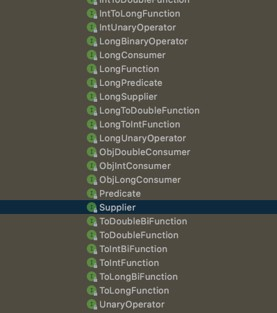
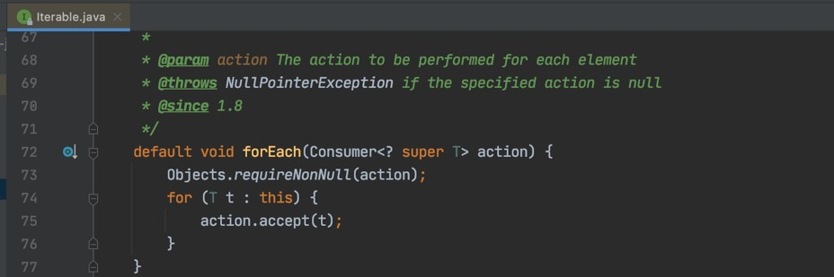
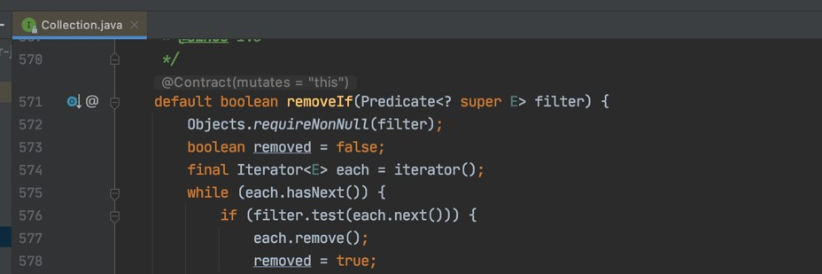
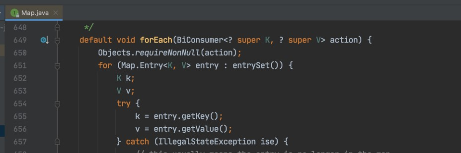

# Java Lambda

## Sebelum Belajar Materi Ini

- Java Dasar
- Java Object Oriented Programming
- Java Generic
- Java Collection
- <https://www.udemy.com/course/pemrograman-java-pemula-sampai-mahir/?referralCode=E97428FBE9A6F3590D8D>

## Agenda

- Pengenalan Lambda
- Membuat Lambda
- Java Function
- Method Reference
- Dan lain-lain

## #1 Pengenalan Lambda

- Lambda berasal dari lambda calculus, yang mengacu pada anonymous function (function tanpa nama)
- Tapi, di Java, function/method tidak bisa berdiri sendiri.
- Jadi kemungkinan pada prakteknya, lambda di Java dan di bahasa pemrograman lain akan berbeda

### Anonymous Class

- Di Java kita hanya mengenal Anonymous Class
- Lambda di Java sebenarnya adalah versi sederhana membuat sebuah anonymous class

### Syarat Lambda

- Berupa Interface
- Memiliki 1 method abstract
- Ditambahkan annotation `@FunctionalInterface` di Interface-nya
- Minimal menggunakan Java 8

### Kode : Membuat Lambda Interface

```java
@FunctionalInterface
public interface SimpleAction {

	String action();

}
```

### Kode : Membuat Lambda

```java
SimpleAction SimpleAction = () -> {
	return "Eko";
};
```

## #2 Membuat Lambda

- Di materi sebelumnya kita sudah mencoba membuat lambda
- Sekarang kita akan bahas beberapa cara membuat lambda lainnya

### Kode : Lambda Interface Dengan Parameter

```java
@FunctionalInterface
public interface SimpleAction {

	String action(String name);

}
```

### Kode : Lambda dengan Parameter

```java
SimpleAction simpleAction1 = (String name) -> {
	return "Hello " + name;
};

SimpleAction simpleAction2 = (name) -> {
	return "Hello " + name;
};
```

### Kode : Lambda Tanpa Blok

```java
SimpleAction simpleAction1 = (String name) -> "Hello " + name;

SimpleAction simpleAction2 = (name) -> "Hello " + name;

SimpleAction simpleAction3 = name -> "Hello " + name;
```

## #3 Java Util Function

### Package `java.util.function`

- Saat Java 8 keluar dengan fitur Lambda nya
- Java juga menyediakan sebuah package baru bernama `java.util.function`
- Package ini berisikan banyak sekali functional interface yang bisa kita gunakan untuk kebutuhan membuat lambda
- Dengan menggunakan interface-interface yang ada di package ini, kita mungkin tidak perlu lagi membuat sendiri functional interface secara manual

### Interface Consumer

```java
@FunctionalInterface
public interface Consumer<T> {

	/**
	 * Perform this operation on the given argument.
	 *
	 * @param t the input argument
	 */
	void accept(T t);
}
```

### Kode : Menggunakan Consumer

```java
Consumer<String> consumer = value -> System.out.println(value);

consumer.accept("Eko Kurniawan");
```

### Interface Function

```java
@FunctionalInterface
public interface Function<T, R> {

	/**
	 * Applies this function to the given argument.
	 *
	 * @param t the input argument
	 * @return the function result
	 */
	R apply(T t);
}
```

### Kode : Menggunakan Function

```java
Function<String, Integer> function = value -> value.length();

Integer length = function.apply("Eko Kurniawan Khannedy");

System.out.println(length);
```

### Interface Predicate

```java
@FunctionalInterface
public interface Predicate<T> {

	/**
	 * Evaluates this function to the given argument.
	 *
	 * @param t the input argument
	 * @return {@code true} if the input argument matches the predicate,
	 * otherwise {@code false}
	 */
	boolean test(T t);
}
```

### Kode : Menggunakan Predicate

```java
Predicate<String> predicate = value -> value.isBlank();

boolean blank = predicate.test("Eko");

System.out.println(blank);
```

### Interface Supplier

```java
@FunctionalInterface
public interface Supplier<T> {

	/**
	 * Gets a result.
	 *
	 * @param a result
	 */
	T get();
}
```

### Kode : Menggunakan Supplier

```java
Supplier<String> supplier = () -> "Eko Kurniawan Khannedy";

String name = supplier.get();

System.out.println(name);
```

### Dan Masih Banyak




## #4 Method Reference

- Kadang saat membuat lambda, isi lambda hanya mengakses method lain atau mengakses method yang ada di parameter method lambda nya
- Kita bisa mempersingkat pembuatan lambda tersebut dengan method reference

### Kode : Static Method

```java
public class StringUtil {

	public static boolean isLowerCase(String value) {
		for (char c : value.toCharArray()) {
			if (!Character.isLowerCase(c)) return false;
		}
		return true;
	}
}
```

### Kode : Method Reference Static

```java
// Predicate<String> predicate = value -> StringUtil.isLowerCase(value);
Predicate<String> predicate = StringUtil::isLowerCase;

System.out.println(predicate.test("Eko"));
System.out.println(predicate.test("eko"));
```

### Kode : Method Reference Non Static

```java
public void run() {
	// Predicate<String> predicate = value -> StringUtil.isLowerCase(value);
	Predicate<String> predicate = this::isLowerCase;

	System.out.println(predicate.test("Eko"));
	System.out.println(predicate.test("eko"));
}

public boolean isLowerCase(Strin value) {
	for (char c : value.toCharArray()) {
		if (!Character.isLowerCase(c)) return false;
	}
	return true;
}
```

### Kode : Method Reference Object

```java
StringApp stringApp = new StringApp();

// Predicate<String> predicate = value -> stringApp.isLowerCase(value);
Predicate<String> predicate = stringApp::isLowerCase;

System.out.println(predicate.test("Eko"));
System.out.println(predicate.test("eko"));
```

### Kode : Method Reference Parameter

```java
// Function<String, String> function = value -> value.toLowerCase();
Function<String, String> function = String::isLowerCase;

System.out.println(function.apply("Eko"));
System.out.println(function.apply("Kurniawan"));
```

## #5 Lambda di Collection

- Saat fitur Lambda keluar di Java 8, ada banyak sekali default method yang ditambahkan ke Java Collection
- Beberapa ada default method yang banyak memanfaatkan fitur Lambda
- Di materi ini kita akan bahas beberapa method yang memanfaatkan Lambda

### Iterable.forEach



### Kode : Menggunakan Iterable.forEach

```java
List<String> names = List.of("Eko", "Kurniawan", "Khannedy");

names.forEach(name -> System.out.println(name));

names.forEach(System.out::println);
```

### Collection.removeIf



### Kode : Menggunakan Collection.removeIf

```java
List<String> names = new ArrayList<>();
names.addAll(List.of("Eko", "Kurniawan", "Khannedy"));

names.removeIf(name -> name.length() > 5);

System.out.println(names);
```

### Map.forEach



### Kode : Menggunakan Map.forEach

```java
Map<String, String> map = new MapHash<>();

map.put("first_name", "Eko");
map.put("middle_name", "Kurniawan");
map.put("last_name", "Khannedy");

map.forEach((key, value) -> System.out.println(ley + ":" + value));
```

### Dan Masih Banyak

- Cek isi source code dari Java Collection

## #6 Lambda Sebagai Lazy Parameter

- Java tidak memiliki fitur parameter lazy seperti di bahasa pemrograman seperti Scala
  -Lazy parameter artinya, parameter tersebut hanya akan dieksekusi ketika diakses
- Untungnya, dengan menggunakan Lambda, kita bisa membuat parameter layaknya lazy parameter

### Kode : Bukan Lazy Parameter

```java
public static void testScore(int value, String name) {
	if (value > 80) {
		System.out.println("Selamat " + name + " , Anda Lulus");
	} else {
		System.out.println("Coba Lagi Tahun Depan");
	}
}

public static String getName() {
	System.out.println("getName() dipanggil");
	return "Eko";
}
```

### Kode : Lazy Parameter

```java
public static void testScore(int value, Supplier<String> name) {
	if (value > 80) {
		System.out.println("Selamat " + name.get() + " , Anda Lulus");
	} else {
		System.out.println("Coba Lagi Tahun Depan");
	}
}
```

## #7 Lambda di Optional

### Optional Class

- Di Java 8, java menyediakan sebuah class baru bernama Optional yang berada di package `java.util`
- Class ini digunakan sebagai wrapper untuk value yang bisa bernilai null
- Optional didesain agar kita lebih mudah ketika beroperasi dengan object yang bisa null
- Karena NullPointerException adalah salah satu hal yang sering sekali ditemui oleh Programmer Java

## Kode : Problem NullPointerException

```java
public static void main(String[] args) {
	sayHello("Eko");
	sayHello(null);
}

public static void sayHello(String name) {
	String upperName = name.toUpperCase();
	System.out.println("HELLO " + upperName);
}
```

### Kode : Menggunakan Optional

```java
public static void main(String[] args) {
	sayHello("Eko");
	sayHello(null);
}

public static void sayHello(String name) {
	Optional<String> optionalName = Optional.ofNullable(name);
	Optional<String> upperName = optionalName.map(value -> value.toUpperCase());

	upperName.ifPresent(value -> System.out.println("HELLO " + value));
}
```

### Kode : Mengambil Data di Optional

```java
public static void main(String[] args) {
	sayHello("Eko");
	sayHello(null);
}

public static void sayHello(String name) {
	String uppername = Optional.ofNullable(name)
		.map(value -> value.toUpperCase())
		.orElseGet(() -> "");

	System.out.println("HELLO " + upperName);
}
```

## #8 Materi Selanjutnya

- Apache Maven
- Java Unit Test
- Java Stream
