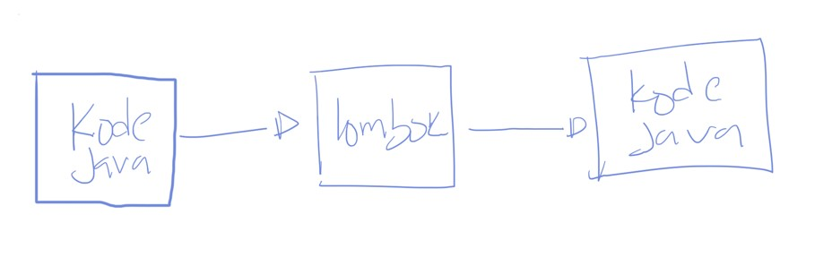

# Java Lombok

## Sebelum Belajar

- Java Dasar
- Java Object Oriented Programming
- Apache Maven
- Java Unit Test

## Agenda

- Pengenalan Java Lombok
- Getter dan Setter
- Constructor
- Data
- Builder
- Dan lain-lain

## #1 Pengenalan Lombok

- Project Lombok adalah sebuah java library yang secara otomatis melakukan generate code Java
- Dengan project Lombok, kita tidak perlu membuat hal-hal secara manual seperti getter setter, equals method, toString dan lain-lain
- Project Lombok akan membuat kode-kode yang biasa kita buat menjadi otomatis dibuat, tanpa harus lakukan lagi secara manual
- <https://projectlombok.org/>

### Diagram Cara Kerja



## #2 Membuat Project

- <https://start.spring.io/>
- <https://plugins.jetbrans.com/plugin/6317-lombok>

## #3 Getter dan Setter

- Lombok bisa kita gunakan untuk membuat Getter dan Setter method secara otomatis dengan menggunakan annotation `@Getter` dan `@Setter`
- Jika ditempatkan pada field, secara otomatis akan membuat getter atau setter untuk field tersebut
- Jika ditempatkan pada class, semua field yang tidak static akan otomatis dibuatkan getter atau setter nya

### Kode : Customer Class

```java
@Getter
@Setter
public class Customer {

	private String id;

	private String name;
}
```

### Kode : Hasil Kompilasi

```java
public class Customer {

	private String id;

	private String name;

	public Customer() {

	}

	public String getId() { return this.id; }

	public String getName() { return this.name; }

	public void setId(final String id) { this.id = id; }

	public void setName(final String name) { this.name = name; }
}
```

## #4 Access Level

- Saat menggunakan `@Getter` dan `@Setter`, secara default method getter dan setter nya akan dibuat public
- Namun jika kita ingin ubah, kita juga bisa ubah visibility nya menggunakan method `value()` di `@Gettter` atau `@Setter`

### Kode : Login Class

```java
@Getter
public class Login {

	@Setter(value = AccessLevel.PROTECTED)
	private String username;

	@Setter(value = AccessLevel.PROTECTED)
	private String password;
}
```

## #5 Constructor

- Lombok juga bisa digunakan untuk membuat constructor secara otomatis
- `@NoArgsConstructor` digunakan untuk membuat constructor tanpa parameter
- `@AllArgsConstructor` digunakan untuk membuat constructor dengan semua parameter yang diambil dari field nya, urutannya sesuai dengan urutan field nya

### Kode : Customer Class

```java
@Getter
@Setter
@AllArgsConstructor
@NoArgsConstructor
public class Customer {

	private String id;

	private String name;
}
```

### Kode : Hasil Kompilasi

```java
public Customer(final String id, final String name) {
	this.id = id;
	this.name = name;
}

public Customer() {

}
```

### Static Method

- Beberapa Class kadang ada yang menggunakan static method untuk membuat objectnya, contohnya Calendar, biasanya kita gunakan `Calendar.getInstance()`
- Lombok juga bisa digunakan untuk membuat object dengan static object, kita bisa gunakan annotation yang sama, namun kita bisa tambahkan `method()` staticName pada annotation nya
- Secara otomatis constructornya akan menjadi private, sehingga dipaksa untuk menggunakan static method ketika membuat object nya

### Kode : Login Class

```java
@Getter
@NoArgsConstructor(staticName = "createEmpty")
@AllArgsConstructor(staticName = "create")
public class Login {

	@Setter(value = AccessLevel.PROTECTED)
	private String username;

	@Setter(value = AccessLevel.PROTECTED)
	private String password;
}
```

### Kode : Hasil Kompilasi

```java
public static Login createEmpty() {
	return new Login();
}

private Login(final String username, final String password) {
	this.username = username;
	this.password = password;
}

public static Login create(final String username, final String password) {
	return new Login(username, password);
}
```

### Required Args Constructor

- Saat kita menggunakan @NoArgsConstructor, maka akan dibuatkan constructor tanpa parameter, jika menggunakan `@AllArgsConstructor`, maka akan dibuatkan constructor untuk semua parameter
- Kadang-kadang kita hanya ingin membuat constructor untuk parameter yang memang wajib saja.
- Pada kasus ini, kita bisa menggunakan `@RequiredArgsConstructor`
- Secara otomatis Lombok hanya akan membuat constructor dengan parameter untuk field yang final

### Kode : Class Merchant

```java
@Getter
@Setter
@EqualsAndHashCode
@ToString
@RequiredArgsConstructor
public class Merchant {

	private final String id;

	private String name;
}
```

### Kode : Hasil Kompilasi

```java
public Merchant(final String id) {
	this.id = id;
}
```

## #6 ToString

- Lombok juga bisa digunakan untuk membuat method `toString()` secara otomatis
- Kita bisa menggunakan annotation `@ToString` di class
- Secara otomatis akan membuat method `toString()` yang berisikan informasi semua field yang ada di class tersebut

### Kode : Login Class

```java
@Getter
@NoArgsConstructor(staticName = "createEmpty")
@AllArgsConstructor(staticName = "create")
@ToString
public class Login {

	@Setter(value = AccessLevel.PROTECTED)
	private String username;

	@Setter(value = AccessLevel.PROTECTED)
	private String password;
}
```

### Kode : Hasil Kompilasi

```java
public String toString() {
	String var1000 = this.getUsername();
	return "Login(username=" + var1000 + ", password=" + this.getPaddword() + ")";
}
```

### Exclude Field Name

- Kadang saat membuat method `toString()` kita tidak ingin menampilkan semua field
- Kadang ada beberapa field yang sensitif sehingga kita tidak ingin menampilkannya dalam method `toString()`
- Untuk melakukan itu, kita bisa gunakan method `exclude()` di annotation @ToString

### Kode : Login Class

```java
@Getter
@NoArgsConstructor(staticName = "createEmpty")
@AllArgsConstructor(staticName = "create")
@ToString(exclude = "password")
public class Login {

	@Setter(value = AccessLevel.PROTECTED)
	private String username;

	@Setter(value = AccessLevel.PROTECTED)
	private String password;
}
```

## #7 Equals dan HashCode

- Lombok juga bisa digunakan untuk membuat method equals dan hashCode secara otomatis
- Seperti yang pernah dijelaskan di kelas Java OOP, kedua method ini akan selalu diimplementasikan berbarengan
- Untuk membuat Equals dan HashCode secara otomatis, kita bisa gunakan annotation `@EqualsAndHashCode`

### Kode : Class Customer

```java
@Getter
@Setter
@AllArgsConstructor
@NoArgsConstructor
@EqualsAndHashCode
public class Customer {

	private String id;

	private String name;
}
```

### Exclude Field

- Saat membuat `equals()` dan `hashCode()` method, Lombok akan selalu menyamakan field mana yang dibandingkan
- Secara default, Lombok akan menggunakan semua field yang ada di class tersebut
- Jika kita tidak ingin menggunakan salah satu field, kita bisa gunakan `exclude()` method di annotation nya

### Kode : Class Customer

```java
@Getter
@Setter
@AllArgsConstructor
@NoArgsConstructor
@EqualsAndHashCode(exclude = "name")
public class Customer {

	private String id;

	private String name;
}
```

### Super Class

- Secara default, ketika membuat `equals()` dan `hashCode()` method, Lombok tidak akan memanggil super class method nya
- Jika kita ingin Lombok memanggil juga super class method nya, kita perlu mengubah method `callSuper()` menjadi true di annotation nya, default nya adalah false

### Kode : Employee Class

```java
@Getter
@Setter
@EqualsAndHashCode
@ToString
public class Employee {

	private String id;

	private String name;
}

@Getter
@Setter
@EqualsAndHashCode(callSuper = true)
@ToString
public class Manager extends Employee {

	private Integer totalEmployee;
}
```

## #8 Data

- Saat membuat sebuah class Data/Model/Entity, kadang kita sering menggunakan annotation `@Getter`, `@Setter`, `@RequiredArgsConstructor`, `@ToString`, `@EqualsAndHashCode`
- Lombok memiliki annotation khusus untuk mempersingkatnya, yaitu menggunakan `@Data`

### Kode : Class Product

```java
@Data
public class Product {

	private final String id;

	private String name;

	private Long price;
}
```

### Override Annotation

- Jika kita ingin mengubah annotation atau menambah annotation setelah menggunakan Data, kita juga bisa lakukan
- Misal menambah `@AllArgsContructor` atau mengubah `@ToString`

### Kode : Class Product

```java
@Data
@ToString(exclude = "price")
@AllArgsContructor
public class Product {

	private final String id;

	private String name;

	private Long price;
}
```

## #9 Builder

- Saat membuat object yang kompleks, kadang agak menyulitkan jika harus selalu dibuat menggunakan constructor atau menggunakan setter method
- Lombok memiliki fitur untuk melakukan auto generate class Builder untuk membuat object yang kompleks
- Dengan ini, pembuatan object akan lebih mudah menggunakan class Builder nya
- Caranya, kita cukup gunakan `@Builder` pada class tersebut
- Lombok akan secara otomatis membuat static method `builder()` untuk membuat builder objectnya, dan `build()` untuk membuat object nya

### Kode : Class Person

```java
@Data
@builder
public class Person {

	private String id;

	private String name;

	private Integer age;

	private List<String> hobbies;
}
```

### Kode : Menggunakan Builder

```java
Person.PersonBuilder personBuilder = Person.builder()
	.id("123").name("Eko").age(25)
	.hobbies(List.of("Coding", "Gaming", "Reading"));

Person person = personBuilder.build();
```

## #10 Singular

- Saat membuat builder, secara default kita harus menggunakan object yang diperlukan secara langsung, misal sebelumnya ada field `List<String>` hobbies, maka kita wajib menambahkan langsung object List nya
- Lombok memiliki fitur `@Singular`, yang bisa digunakan sebagai helper, sehingga kita tidak perlu langsung membuat List nya
- Lombok akan membuat builder method untuk menambah data ke Collection (List, Set atau Map) nya satu per satu

### Kode : Class Person

```java
@Data
@Builder
public class Person {

	private String id;

	private String name;

	private Integer age;

	@Singular
	private List<String> hobbies;
}
```

### Kode : Menggunakan Singular

```java
Person.PersonBuilder personBuilder = Person.buildaer()
	.id("120").name("Eko").age(25)
	.hobby("Coding").hobby("Reading").hobby("Gaming");

Person person = personBuilder.build();
```

## #11 Non Null

- Sebelumnya, saat kita membuat constructor dengan `@RequiredArgsConstructor`, Lombok akan menjadi final field. Hal ini membuat field tersebut tidak bisa diubah lagi
- Lombok memiliki annotation `@NonNull`
- Jika `@NonNull` ditempatkan di field, maka secara otomatis juga akan di generate di `@RequiredArgsConstructor`, sekaligus dilakukan pengecekan tidak boleh null. Selain itu semua setter method nya juga akan dilakukan pengecekan null
- Jika `@NonNull` ditempatkan di parameter, maka parameter tersebut akan dilakukan pengecekan null
- Jika parameternya null, maka otomatis akan throw NullPointerException

### Kode : Class Member

```java
@Data
public class Member {

	@NonNull
	private String id;

	@NonNull
	private String name;
}
```

### Kode : Hasil Kompilasi

```java
public Member(@NonNull final String id, @NonNull final String name) {
	if (id == null) {
		throw new NullPointerException("id is marked non null but is null");
	} else if (name == null) {
		throw new NullPointerException("name is marked non-null bot is null");
	} else {
		this.id = id;
		this.name = name;
	}
}
```

### Kode : Member SayHello Method

```java
public String SayHello(@NonNull String name) {
	return "Hello " + name + ", My Name is" + this.name;
}
```

### Kode : Hasil Kompilasi

```java
public String SayHello(@NonNull String name) {
	if (name == null) {
		throw new NullPointerException("name is marked non-null but is null");
	} else {
		return "Hello " + name + ", My Name is " + this.name;
	}
}
```

## #12 Value

- Kadang kita sering membuat sebuah class yang bersifat immutable (tidak bisa diubah lagi ketika sudah dibuat)
- Biasanya yang kita lakukan adalah, menjadikan semua field nya final, tidak membuat setter method dan membuat constructor untuk semua field
- Lombok memiliki fitur yang bisa kita gunakan untuk membuat immutable class, yaitu menggunakan annotation `@Value`

### Kode : Class Register

```java
@Value
public class Register {

	String username;

	String password;
}
```

## #13 With

- Lombok memiliki fitur untuk membuat class baru dengan memodifikasi salah satu field yang sudah ada dengan menggunakan annotation `@With`
- Jika ditempatkan di field, maka secara otomatis akan membuat method dengan nama `withXxx`
- Jika ditempatkan di class, maka secara otomatis akan membuat method `withXxx` untuk semua field

### Kode : Class Register

```java
@Value
@With
public class Register {

	String username;

	String password;
}
```

### Kode : Hasil Kompilasi

```java
public Register withUsername(final String username) {
	return this.username == username ? this : new Register(username, this.password);
}

public Register withPassword(final String password) {
	return this.password == password ? this : new Register(this.username, password);
}
```

## #14 Cleanup

- Saat kita menggunakan object resource di Java yang perlu di close (seperti misal koneksi ke database), biasanya kita akan menggunakan try finally
- Lombok memiliki fitur yang bisa kita gunakan untuk membuat auto generate close resource, yaitu annotation `@Cleanup`

### Kode : Load File

```java
public static String loadFile(String final) throws Exception {
	@Cleanup FileReader fileReader = new FileReader(file);
	@Cleanup Scanner scanner = new Scanner(fileReader);

	StringBuilder builder = new StringBuilder();
	while (scanner.hashNextLine()) {
		builder.append(scanner.nextLine()).append("\n");
	}

	return builder.toString();
}
```

## #15 Sneaky Throws

- Secara default saat kita membuat kode yang memiliki checked exception, kita perlu menangkapnya dalam try-catch
- Lombok bisa secara pindah mengubah checked exception menjadi runtime exception tanpa mengubah exception nya itu sendiri
- Lombok hanya mengakali agar compiler Java tidak komplen ketika kita tidak menangkap checked exception
- Untuk melakukan itu, kita bisa menggunakan annotation `@SneakyThrows`

### Kode : Sneaky Throws

```java
@SneakyThrows
public static String loadFile(String file) {
	@Cleanup FileReader fileReader = new FileReader(file);
	@Cleanup Scanner scanner = new Scanner(fileReader);

	StringBuilder builder = new StringBuilder();
	while (Scanner.hashNextLine()) {
		builder.append(scanner.nextLine()).append("\n");
	}

	return builder.toString();
}
```

## #16 Log

- Saat membuat aplikasi, kita sering sekali membuat log, dan juga otomatis sering sekali membuat field untuk Logger nya
- Lombok mendukung pembuatan field log secara otomatis menggunakan annotation log, ada banyak yang didukung oleh Lombok, seperti `@Log` untuk Java Logging, `@Slf4j` untuk SLF4J, `@CommonsLog` untuk apache commons log, `@Flogger` untuk Google Flogger, `@Log4J` untuk Log4J, `@JbossLog` untuk JBoss Log
- Secara otomatis Lombok akan membuat field bernama log sesuai dengan logger library yang kita gunakan

### Kode : Log

```java
@Slf4j
public class FileHelper {

	@SneakyThrows
	public static String loadFile(String file) {
		log.info("Load file {}", file);
		@Cleanup FileReader fileReader = new FileReader(file);
		@Cleanup Scanner scanner = new Scanner(fileReader);
	}
}
```

### Kode : Hasil Kompilasi

```java
public class FileHelper {

	private static final Logger log = LoggerFactory.getLogger(FileHelper.class);

	public FileHelper() {

	}
}
```

## #17 Synchronized

- Saat belajar Java Thread, kita sudah tahu agar sebuat method aman dari race condition, kita biasanya menggunakan kata kunci synchronized, atau yang lebih baik adalah menggunakan Lock
- Lombok memiliki fitur untuk mempermudah kita ketika membuat Lock agar method yang kita buat aman dari race condition
- Kita bisa menggunakan annotation `@Synchronized`, dan jika kita ingin sharing lock dengan beberapa method, kita bisa gunakan value lock yang sama

### Kode : Counter Class

```java
public class Counter {

	private final Object counterLock = new Object();

	private Long counter = 0L;

	@Synchronized(value = "counterLock")
	public void increment() {
		counter = counter + 1;
	}

	@Synchronized(value = "counterLock")
	public Long getCounter() {
		return counter;
	}
}
```

## #18 Experimental Feature

- Selain yang sudah kita bahas, Lombok juga memiliki banyak sekali fitur yang masih experimetal (masih dalam tahap percobaan)
- Pada kelas ini kita tidak akan bahas, karena ditakutkan fiturnya berubah
- Jika tertarik melihat fitur experimental di Lombok, kita bisa lihat diwebsite nya
- <https://projectlombok.org/features/experimental/all>

## #19 Materi Selanjutnya

- Java Persistence API
- Java Web
- Java RESTfull API
