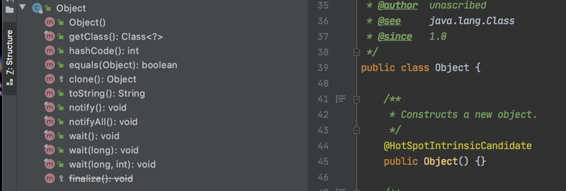

# Java Object Oriented Programming

## Sebelum Belajar

- Java Dasar

## Agenda

- Pengenalan OOP
- Object
- Class
- Method
- Pewarisan
- Interface
- Enum
- Exception
- Dan lain-lain

## #1 Pengenalan OOP

### Apa itu Object Oriented Programming?

- Object Oriented Programming adalah sudut pandan bahasa pemrogramman yang berkonsep "objek"
- Ada banyak sudt pandang bahas prmrogramman, namun OOP adalah yagn sangat populer saat ini
- Ada beberapa istilah yang perlu dimengerti dalam OOP, yaitu: Object dan Class

### Apa itu Object?

- Object adalah data yang berisi field / properties / attributes dan method / function / behavior
- Semua data bukan primitif di Java adalah object, dari mulai Integer, Boolean, Character, String dan yang lainnya

### Apa itu Class?

- Class adalah blueprint, prototype atau cetakan untuk membuat Object
- Class berisikan deklarasi semua properties dan functions yang dimiliki oleh Object
- Setiap Object selalu dibuat dari Class
- Dan sebuah Class bisa membuat Object tanpa batas

### Class dan Object : Person


### Class dan Object : Car


## #2 Class

### Membuat Class

- Untuk membuat class, kita bisa menggunakan kata kunci class
- Penamaan class biasa menggunakan format CamelCase

### Kode : Class

```java
class Person {

}
```

## #3 Object

### Membuat Object

- Object adalah hasil instansiasi dari sebuah class
- Untuk membuat object kita bisa menggunakan kata kunci `new`, dan diikuti dengan nama Class dan kurung `()`

## Kode : Object

```java
var person1 = new Person();
Person person2 = new Person();

Person person3;
person3 = new Person();
```

## #4 Field

- Fields / Properties / Attributes adalah data yang bisa kita sisipkan di dalam Object
- Namun sebelum kita bisa memasukkan data di fields, kita harus mendeklarasikan data apa aja yang dimiliki object tersebut di dalam deklarasi class-nya
- Membuat field sama seperti membuat variable, namun ditempatkan di block class

### Kode : Field

```java
class Person {
	String name;
	String address;
	final String country = "Indonesia";
}
```

### Manipulasi Field

- Fields yang ada di object, bisa kita manipulasi. Tergantung final atau bukan.
- Jika final, berarti kita tidak bisa mengubah data field nya, namun jika tidak, kita bisa mengubah field nya
- Untuk memanipulasi data field, sama seperti cara pada variable
- Untuk mengakses field, kita butuh kata kunci `.` (titik) setelah nama object dan diikuti nama fields nya

### Kode : Manipulasi Field

```java
var person = new Person();
peron.name = "Eko Kurniawan";
peron.address = "Subang";
// person.country = "Amerika"; // Error

System.out.println(person.name);
System.out.println(person.address);
System.out.println(person.country);
```

## #5 Method

- Selain menambahkan field, kita juga bisa menambahkan method ke object
- Cara dengan mendeklarasikan method tersebut di dalam block class
- Sama seperti method biasanya, kita juga bisa menambahkan return value, parameter dan method overloading di method yang ada di dalam block class
- Untuk mengakses method tersebut, kita bisa menggunakan tanda titik `(.)` dan diikuti dengan nama method nya. Sama seperti mengakses field

### Kode : Method (1)

```java
class Person {
	String name;
	String address;
	final String country = "Indonesia";

	void sayHello(String paramName) {
		System.out.println("Hello " + paramName + ", My Name is " + name);
	}
}
```

### Kode : Method (2)

```java
var person = new Person();
person.name = "Eko Kurniawan";
person.sayHello("Budi");
```

## #6 Constructor

- Saat kita membuat Object, maka kita seperti memanggil sebuah method, karena kita menggunakan kurung `()`
- Di dalam class Java, kita bisa membuat constructor, constructor adalah method yang akan dipanggil saat pertama kali Object dibuat.
- Mirip seperti di method, kita bisa memberi parameter pada constructor
- Nama constructor harus sama dengan nama class, dan tidak membutuhkan kata kunci `void` atau return value

### Kode : Membuat Constructor

```java
class Person {
	String name;
	String address;
	final String country = "Indonesia";

	Person(String paramName, String paramAddress) {
		name = paramName;
		address = paramAddress;
	}

	void sayHello(String paramName) {
		System.out.println("Hello " + paramName + ", My Name is " + name);
	}
}
```

### Kode : Menggunakan Constructor

```java
var person = new Person("Eko", "Subang");
person.name = "Eko Kurniawan";
person.sayHello("Budi");

```

## #7 Constructor Overloading

- Sama seperti di method, di constructor pun kita bisa melakukan overloading
- Kita bisa membuat constructor lebih dari satu, dengan syarat tipe data parameter harus berbeda, atau jumlah parameter harus berbeda

### Kode : Constructor Overloading

```java
class Person {
	...
	Person(String paramName, String paramAddress) {
		name = paramName;
		address = paramAddress;
	}

	Person(String paramName) {
		name = paramName;
	}

	Person () {

	}
}
```

### Kode : Menggunakan Constructor

```java
var person1 = new Person("Eko", "Subang");
var person2 = new Person("Eko");
var person3 = new Person();
```

### Memanggil Constructor Lain

- Constructor bisa memanggil constructor lain
- Hal ini memudahkan saat kita butuh menginisialisasi data dengan berbagai kemungkinan
- Cara untuk memanggil constructor lain, kita hanya perlu memanggilnya seperti memanggil method, namun dengan kata kunci `this`

### Kode : Memanggil Constructor Lain

```java
class Person {
	...
	Person(String paramName, String paramAddress) {
		name = paramName;
		address = paramAddress;
	}

	Person(String paramName) {
		this(paramName, null);
	}

	Person () {
		this(null);
	}
	...
}
```

## #8 Variable Shadowing

- Variable shadowing adalah kejadian ketika kita membuat nama variable dengan nama yang sama di scope yang menutupi variable dengan nama yang sama di scope diatasnya
- Ini biasa terjadi seperti kita membuat nama parameter di method sama dengan nama field di class
- Saat terjadi variable shadowing, maka secara otomatis variable di scope diatasnya tidak bisa diakses

### Kode : Variable Shadowing

```java
Person(String name, String address) {
	name = name; // field nama tidak berubah
	address = address; // field address tidak berubah
}
void sayHello(String name) {
	System.out.println("Hello " + name + ", My Name is " + name);
}
```

## #9 This Keyword

- Saat kita membuat kode di dalam block constructor atau method di dalam class, kita bisa menggunakan kata kunci this untuk mengakses object saat ini
- Misal kadang kita butuh mengakses sebuah field yang namanya sama dengan parameter method, hal ini tidak bisa dilakukan jika langsung menyebut nama field, kita bisa mengakses nama field tersebut dengan kata kunci this
- This juga tidak hanya digunakan untuk mengakses field milik object saat ini, namun juga bisa digunakan untuk mengakses method
- This bisa digunakan untuk mengatasi masalah variable shadowing

### Kode : This Keyword

```java
...
Person(String name, String address) {
	this.name = name; // field nama tidak berubah
	this.address = address; // field address tidak berubah
}

void sayHello() {
	this.sayHello("Bos");
}

void sayHello(String name) {
	System.out.println("Hello " + name + ", My Name is " + this.name);
}
...
```

## #10 Inheritance

- Inheritance atau pewarisan adalah kemampuan untuk menurunkan sebuah class ke class lain
- Dalam artian, kita bisa membuat class Parent dan class Child
- Class Child, hanya bisa punya satu class Parent, namun satu class Parent bisa punya banyak class Child
- Saat sebuah class diturunkan, maka semua field dan method yang ada di class Parent, secara otomatis akan dimiliki oleh class Child
- Untuk melakukan pewarisan, di class child, kita harus menggunakan kata kunci extends lalu diikuti dengan nama class parent nya.

### Kode : Inheritance

```java
class Manager {
	String name;

	void sayHello(String name) {
		System.out.println("Hello " + name + ", My Name is Manager" + this.name);
	}
}

class VicePresident extends Manager {

}
```

### Kode : Mengakses Method Parent

```java
...
var manager = new Manager();
manager.name = "Eko";
manager.sayHello("Budi");

var vicePresident = new VicePresident();
vicePresident.name = "Kurniawan";
vicePresident.sayHello("Budi");
...
```

## #10 Method Overriding

- Method overriding adalah kemampuan mendeklarasikan ulang method di child class, yang sudah ada di parent class
- Saat kita melakukan proses overriding tersebut, secara otomatis ketika kita membuat object dari class child, method yang di class parent tidak bisa diakses lagi

### Kode : Method Overiding

```java
class Manager {
	String name;

	void sayHello(String name) {
		System.out.println("Hello " + name + ", My Name is Manager" + this.name);
	}
}

class VicePresident extends Manager {
	void sayHello(String name) {
		System.out.println("Hello " + name + ", My Name is VP " + this.name);
	}
}
```

### Kode : Mengakses Method Overriding

```java
...
var manager = new Manager();
manager.name = "Eko";
manager.sayHello("Budi");

var vicePresident = new VicePresident();
vicePresident.name = "Kurniawan";
vicePresident.sayHello("Budi");
...
```

## #11 Super Keyword

- Kadang kita ingin mengakses method yang terdapat di class parent yang sudah terlanjur kita override di class child
- Untuk mengakses method milik class parent, kita bisa menggunakan kata kunci `super`
- Sederhananya, super digunakan untuk mengakses class parent
- Tidak hanya method, field milik parent class pun bisa kita akses menggunakan kata kunci `super`

### Kode : Super Keyword

```java
class Shape {
	int getCorner() {
		return 0;
	}
}

class Rectangle extends Shape {
	int getCorner() {
		return 4;
	}

	int getParentCorner() {
		return super.getCorner();
	}
}
```

### Kode : Mengakses Super Keyword

```java
...
var rectangle = new Rectangle();

System.out.println(rectangle.getCorner());
System.out.println(rectangle.getParentCorner());
...
```

## #12 Super Constructor

- Tidak hanya untuk mengakses method atau field yang ada di parent class, kata kunci `super` juga bisa digunakan untuk mengakses constructor
- Namun syaratnya untuk mengakses parent class constructor, kita harus mengaksesnya di dalam class child constructor
- Jika sebuah class parent tidak memiliki constructor yang tidak ada parameter-nya (tidak memiliki default constructor), maka class child wajib mengakses constructor class parent tersebut

### Kode : Super Constructor

```java

class Manager {
	...
	Manager(String name) {
		this.name = name;
	}
}

class VicePresident extends Manager {
	VicePresident(String name) {
		super(name);
	}
}
...
```

### Kode : Menggunakan Super Constructor

```java
...
var manager = new Manager("Eko");
manager.sayHello("Budi");

var vicePresident = new VicePresident("Kurniawan");
vicePresident.sayHello("Budi");
...
```

## #13 Object Class

- Di Java, setiap class yang kita buat secara otomatis adalah turunan dari class Object
- Walaupun tidak secara langsung kita eksplisit menyebutkan extends Object, tapi secara otomatis Java akan membuat class kita extends Object
- Bisa dikatakan class Object adalah superclass untuk semua class yang ada di Java

### Isi Class Object



### Kode : Menggunakan Class Object

```java
...
var manager = new Manager("Eko");
System.out.println(manager); // otomatis memanggil method toString();
System.out.println(manager.toString());
```

## #14 Polymorphism

- Polymorphism berasal dari bahasa Yunani yang berarti banyak bentuk.
- Dalam OOP, Polymorphism adalah kemampuan sebuah object berubah bentuk menjadi bentuk lain
- Polymorphism erat hubungannya dengan Inheritance

### Kode : Inheritance

```java
class Employee {
	String name;

	Employee(String name) {
		this.name = name;
	}
	void sayHello(String name) {
		System.out.println("Hello " + name + ", My Name is Employee " + this.name);
	}
}

class Manager extends Employee {
	Manager(String name) {
		super(name);
	}
	...
}

class VicePresident extends Manager {
	VicePresident(String name) {
		super(name);
	}
	...
}
```

### Kode : Polymorphism

```java
....
Employee employee = new Employee("EKo");
employee.sayHello("Budi");

Employee employee = new Manager("EKo");
employee.sayHello("Budi");

Employee employee = new VicePresident("EKo");
employee.sayHello("Budi");
...
```

### Kode : Method Polymorphism

```java
class PolymorphismApp {
	...
	public static void main(String[] args) {
		sayHello(new Employee("Eko"));
		sayHello(new Manager("Eko"));
		sayHello(new VicePresident("Eko"));
	}

	static void sayHello(Employee employee) {
		System.out.println("Hello " + employee.name);
	}
}
```

## #15 Type Check & Casts

- Sebelumnya kita sudah tau cara melakukan konversi tipe data (casts) di tipe data primitif
- Casts juga bisa digunakan untuk tipe data bukan primitif
- Namun agar aman, sebelum melakukan casts, pastikan kita melakukan type check (pengecekan tipe data), dengan menggunakan kata kunci `instanceof`
- Hasil operator instanceof adalah boolean, true jika tipe data sesuai, false jika tidak sesuai

### Kode : Type Check & Casts

```java
static void sayHello(Employee employee) {
	if (employee instanceof VicePresident) {
		VicePresident vicePresident = (VicePresident) employee;
		System.out.println("Hello VP " + vicePresident.name);
	} else if (employee instanceof Manager) {
		Manager manager = (Manager) employee;
		System.out.println("Hello Manager " + manager.name);
	} else {
		System.out.println("Hello Employee " + employee.name);
	}
}
```

## #16 Variable Hiding

- Variable hiding merupakan masalah yang terjadi ketika kita membuat nama field sama di class child dengan nama field di class parent
- Tidak ada yang namanya field overriding, ketika kita buat ulang nama field di class class, itu berarti variable hiding
- Untuk mengatasi variable hiding, caranya kita bisa menggunakan super keyword
- Yang membedakan variable hiding dan method overriding adalah ketika sebuah object di casts
- Saat object di casts, method akan tetap mengakses method overriding, namun variable akan mengakses variable yang ada di class nya

### Kode : Variable Hiding

```java
class Parent {
	String name;
	void doIt() {
		System.out.println("Do it in parent");
	}
}

class Child extends Parent {
	String name;
	void doIt() {
		System.out.println("Do it in child");
	}
}
```

### Kode : Variable Hiding vs Method Overriding

```java
Child child = new Child();
child.name = "Eko";
child.doIt();
System.out.println(child.name);

Parent parent = (Parent) child;
parent.doIt();
System.out.println(parent.name);
```

## #17 Package

- Saat kita membuat aplikasi, bisa dipastikan kita akan banyak sekali membuat class
- Jika class terlalu banyak, kadang akan menyulitkan kita untuk mencari atau mengklasifikasikan jenis-jenis class
- Java memiliki fitur package, yaitu fitur mirip folder / direktori, dimana kita bisa menyimpan class-class kita di dalam package
- Sama seperti folder / direktori, package juga bisa nested, kita bisa menggunakan tanda titik (.) untuk membuat nested package
- Ketika kita menyimpan class di dalam package, maka diatas file Java nya, kita wajib menyebutkan nama package nya

### Kode : Package

```java
package eko.belajarjava.data;

class Product {
	String name;
	int price;

	Product(String name, int price) {
		this.name = name;
		this.price = price;
	}
}
```

## #18 Access Modifiers

- Access modifier adalah kemampuan membuat class, field, method dan constructor dapat diakses dari mana saja
- Sebelumnya teman-teman sudah melihat 2 access modifier, yaitu public dan default (no-modifier)
- Sekarang kita akan bahas access modifier lainnya

### Access Level

| Modifier    | Class | Package | Subclass | World |
| ----------- | ----- | ------- | -------- | ----- |
| public      | Y     | Y       | Y        | Y     |
| protected   | Y     | Y       | Y        | N     |
| no modifier | Y     | Y       | N        | N     |
| private     | Y     | N       | N        | N     |

### Public Class

- Saat kita membuat public class, kita hanya bisa membuat 1 public class di 1 file java
- Selain itu, nama public class harus sama dengan nama file

### Kode : Access Modifier (1)

```java
package eko.belajarjava.data;

public class Product {
	protected String name;
	protected int price;

	public Product(String name, int price) {
		this.name = name;
		this.price = price;
	}

	public String getName() {
		return name;
	}

	public int getPrice() {
		return price;
	}
}
```

### Kode : Access Modifier (2)

```java
package eko.belajarjava.data;

public class ProductApp {
	public static void main(String[] args) {
		Product product = new Product();
		product.name = "Indomie"; // bisa diakses karena di package sama
		product.price = 200; // bisa diakses karena di package sama

		System.out.println(product.getName());
		System.out.println(product.getPrice());
	}
}
```

## #19 Import

- Import adalah kemampuan untuk menggunakan class yang berada di package yang berbeda
- Syarat class yang bisa digunakan jika package nya berbeda adalah class yang harus public

### Kode : Import

```java
package eko.belajarjava.web;

import eko.belajarjava.data.Product;

public class ProductWeb {
	public static void main(String[] args) {
		Product product = new Product();
		product.name = "Indomie"; // error, beda package
		product.price = 200; // error, beda package

		System.out.println(product.getName());
		System.out.println(product.getPrice());
	}
}
```

### Import Semua Package

- Jika kita ingin mengimport semua class di dalam sebuah package, kita bisa menggunakan tanda \*, misal
- import eko.belajar.oop.data.\*

### Default Import

- Secara default, semua class yang ada di package java.lang sudah auto import, jadi kita tidak perlu melakukan import secara manual
- Contoh class String, Integer, Long, Boolean, dan lain-lain terdapat di package java.lang. Oleh karena itu, kita tidak perlu meng-import nya secara manual

## #20 Abstract Class

- Saat kita membuat class, kita bisa menjadikan sebuah class sebagai abstract class.
- Abstract class artinya, class tersebut tidak bisa dibuat sebagai object secara langsung, hanya bisa diturunkan
- Untuk membuat sebuah class menjadi abstract, kita bisa menggunakan kata kunci abstract sebelum kata kunci class
- Dengan demikian abstract class bisa kita gunakan sebagai kontrak untuk class child

### Kode : Abstract Class

```java
package eko.belajarjava.data;

public abstract class Location {
	String name;
}

package eko.belajarjava.data;

public class City extends Location {

}
```

### Kode : Membuat Abstract Class

```java
import eko.belajarjava.data.City;
import eko.belajarjava.data.Location;

public class AbstractClassApp {
	public static void main(String[] args) {
		var location = new Location(); // error
		var city = new City();
	}
}
```

## #21 Abstract Method

- Saat kita membuat class yang abstract, kita bisa membuat abstract method juga di dalam class abstract tersebut
- Saat kita membuat sebuah abstract method, kita tidak boleh membuat block method untuk method tersebut
- Artinya, abstract method wajib di override di class child
- Abstract method tidak boleh memiliki access modifier private

### Kode : Abstract Method

```java
public abstract class Animal {
	public String name;
	public abstract void run();
}

package eko.belajarjava.data;

public class Cat extends Animal {
	public void run() {
		System.out.println("Car " + name + " is running");
	}
}
```

### Kode : Menggunakan Abstract Method

```java
public class AbstractMethodApp {
	public static void main(String[] args) {
		Animal animal = new Cat();
		animal.name = "Eko";
		animal.run();
	}
}
```

## #22 Getter dan Setter

### Encapsulation

- Encapsulation artinya memastikan data sensitif sebuah object tersembunyi dari akses luar
- Hal ini bertujuan agar kita bisa menjaga agar data sebuah object tetap baik dan valid
- Untuk mencapai ini, biasanya kita akan membuat semua field menggunakan access modifier private, sehingga tidak bisa diakses atau diubah dari luar
- Agar bisa diubah, kita akan menyediakan method untuk mengubah dan mendapatkan field tersebut

### Getter dan Setter

- Di Java, proses encapsulation sudah dibuat standarisasinya, dimana kita bisa menggunakan Getter dan Setter method.
- Getter adalah function yang dibuat untuk mengambil data field
- Setter ada function untuk mengubah data field

### Getter dan Setter Method

| Tipe Data | Getter Method | Setter Method          |
| --------- | ------------- | ---------------------- |
| boolean   | isXxx()       | setXxx(boolean value)  |
| primitif  | getXxx()      | setXxx(primitif value) |
| Object    | getXxx()      | setXxx(Object value)   |

### Kode : Getter dan Setter

```java
public class Category {
	private String id;
	private boolean expensive;

	public String getId() {
		return id;
	}

	public void setId(String id) {
		this.id = id;
	}

	public boolean isExpensive() {
		return expensive;
	}

	public void setExpensive(boolean expensive) {
		this.expensive = expensive;
	}
}
```

### Kode : Validation di Setter

```java
...
public void setId(String id) {
	if (id != null)	 {
		this.id = id;
	}
}
...
```

## #23 Interface

- Sebelumnya kita sudah tahu bahwa abstract class bisa kita gunakan sebagai kontrak untuk class child nya.
- Namun sebenarnya yang lebih tepat untuk kontrak adalah Interface
- Jangan salah sangka bahwa Interface disini bukanlah User Interface
- Interface mirip seperti abstract class, yang membedakan adalah di Interface, semua method otomatis abstract, tidak memiliki block
- Di interface kita tidak boleh memiliki field, kita hanya boleh memiliki constant (field yang tidak bisa diubah)
- Untuk mewariskan interface, kita tidak menggunakan kata kunci extends, melainkan implements

### Kode : Membuat Interface

```java
package eko.belajarjava.data;

public interface Car {
	void drive();
	void geTire();
}
```

### Kode : Implementasi Interface

```java
package eko.belajarjava.data;

public class Avanza implements Car {

	public void drive() {
		System.out.println("Deive Avanza");
	}

	public int getTire() {
		return 4;
	}
}
```

## #24 Interface Inheritance

- Sebelumnya kita sudah tahu kalo di Java, child class hanya bisa punta 1 class parent
- Namun berbeda dengan interface, sebuah child class bisa implement lebih dari 1 interface
- Bahkan interface pun bisa implement interface lain, bisa lebih dari 1. Namn jika interface ingin mewarisi interface lain, kita menggunakan kata knci extens, bukan implements

### Kode : Interface

```java
public interface HasBrand {
	String getBrand();
}
```

```java
package eko.belajarjava.data;

public interface Car extends HasBrand {
	void drive();
	void getTire();
}
```

### Kode : Multiple Interface Inheritance

```java
public class Avanza implements Car, IsMaintenance {

	public String geBrand() {
		return "Toyota";
	}

	public boolean insMaintenance() {
		return false;
	}

	public void drive() {
		System.out.println("Drive Avanza");
	}
}
```

## #25 Default Method

- Sebelumnya kita tahu bahwa di interface, kita tidak bisa membuat method konkrit yang memiliki block method
- Namun sejak versi Java 8, ada fitur default method di interface
- Fitur ini terjadi karena sulit untuk maintain kontrak interface jika sudah terlalu banyak class yang implement interface tersebut
- Ketika kita menambahkan satu method di interface, secara otomatis semua class yang implement akan rusak karena harus meng-override method tersebut
- Dengan menggunakan default method, kita bisa menambahkan konkrit method di interface

### Kode : Default Method

```java
public interface Car extends HasBrand {
	void drive();
	void getTire();
	default boolean isBig() { return false; }
}
```

## #26 ToString Method

- `toString()` adalah method yang terdapat di class `Object`
- Method ini biasanya digunakan untuk merepresentasikan object dalam bentuk String
- Secara default, `toString()` ini akan menghasilkan:
  - namaclass + @ + hasCode
- Namun kita bisa mengubahnya jika kita mau, agar object yang kita buat lebih mudah dibaca

### Kode : Override ToString Method

```java
public class Product {

	public String;
	public int price;

	public Product(String name, int price) {
		this.name = name;
		this.price = price;
	}

	public String toString() {
		return "Product name:" + name = ", price:" + price;
	}
}
```

## #27 Equals Method

- Hal yang agak membingungkan di Java adalah, cara membandingkan object
- Di bahasa pemrograman lain, untuk mengecek apakah sebuah object sama, biasanya menggunakan operator ==, di Java, operator == hanya untuk mengecek data primitif
- Untuk not primitid pengecekan nya menggunakan method equals
- Dan secara default, method equals itu akan membandingkan dua buah object secara kesamaan posisi object di memory, artinya jika kita membuat 2 object yang isi fields nya sama, tetap dianggal beda oleh method equals
- Oleh karena itu, ada baiknya kita meng-override method equals milik class Object tersebut

### Kode : Equals Salah

```java
String first = "Eko";
first = first + " " + "Khannedy";

String Second = "Eko Khannedy";

System.out.println(first == second) // false
System.out.println(first.equals(second)) // true
```

### Kode : Override Equals Method

```java
public class Product {
	...
	public boolean equals(Object o) {
		if (this == o) return true;
		if (!(o instanceof Product)) return false;

		Product product = (Product) o;

		if (price != product.price) return false;
		return name != null ? name.equals(product.name) : product.name == null;
	}
	...
}
```

## #28 HashCode Method

- Method `hasCode` adalah method representasi integer object kita, mirip toString yang merupakan representasi String, hashCode adalah representasi integer
- HasCode sangat bermanfaat untuk membuat struktur data unique seperti HasMap, Set, dan lain-lain, karena cukup menggunakan hashCode method untuk mendapatkan identitas unique object kita
- Secara default hashCode akan mengembalikan nilai integer sesuai data di memory, namun kita bisa mengoverride nya jika kita ingin

### Kontrak HashCode Method

Tidak mudah meng-override method hashCode, karena ada kontraknya :

- Sebanyak apapun hashCode dipanggil, untuk obejct yang sama, harus mengasilkan data integer yang sama
- Jika ada 2 object yang sama hika dibandingkan menggunakan method equals, maka nilai hashCode nya juga harus sama
- Tidak wajib hashCode berbeda jika method equals menghasilkan false, karena memang keterbatasan jumlah integer sekitar 2 milyar

### Kode : Override HashCode Method

```java
public class Product {
	...
	public int hashCode() {
		int result = name != null ? name.hasCode() : 0;

		result = 32 * result + price;

		return result;
	}
	...
}
```

## #29 Final Class

- Sebelumnya kita pernah menggunakan kata kunci `final` di Java
- Jika digunakan di variable, maka variable tersebut tidak bisa berubah lagi datanya
- Final pun bisa digunakan di class, dimana jika kita menggunakan kata kunci final sebelum class, maka kita menandakan bahwa class tersebut tidak bisa diwariskan lagi
- Secara otomatis semua class child nya akan error

### Kode : Final Class

```java
class SocialMedia {
	String name;
}

final class Facebook extens SocialMedia {

}

class FakeFacebook extends Facebook {} // error
```

## #30 Final Method

- Kata kunci `final` juga bisa digunakan di Method
- Jika sebuah method kita tambahkan kata kunci final, maka artinya method tersebut tidak bisa di override lagi di class child nya
- Ini sangat cocok jika kita ingin mengunci implementasi dari sebuah method agar tidak bisa diubah lagi oleh class child nya

### Kode : Final Method

```java
class Facebook extens SocialMedia {
	final void login(String username, String password);
}

class FakeFacebook extends Facebook {
	void login(String username, String password) {} // error
} // error
```

## #31 Inner Class

- Di Java, kita bisa membuat class di dalam class, atau disebut dengan Inner Class
- Salah satu kasus kita membuat inner class biasanya ketika kita buat membuat bebrapa class yang saling berhubungan, dimana sebuah calss tidak bisa dibuat tanpa class lain
- Misal kita perlu membuat class Employee, dimana membutuhkan class Company, maka kita bisa membuat class Employee sebagai inner class Company
- Cara membuat inner calss, cukup menbuatnya di dalam block class outer class nya

### Kode : Inner Class

```java
public class Company {

	private String name;

	public class Employee {

		private String name;

		public String getName() {
			return name;
		}
	}
}
```

### Mengakses Outer Class

- Keuntungan saat kita membuat inner class adalah, kemampuan untuk mengakses outer class nya
- Inner class bisa membaca semua private member yang ada di outer calss nya
- Untuk mengakses object outer class nya, kita bisa menggunakan nama class outer nya diikuti dengan kata kunci `this`, misal `Company.this`
- Dan untuk mengakses super class outer class nya, kita bisa menggunakan nama class outer nya diikuti dengan kata kunci `super`, misal `Company.super`

### Kode : Mengakses Outer Class

```java
public class Company {

	private String name;

	public class Employee {

		private String name;

		public String getCompany() {
			return Company.this.getName();
		}
	}
}
```

## #32 Anonymous Class

- Anonymous class atau class tanpa nama
- Adalah kemampuan mendeklarasikan class, sekaligus meng-instansiasi object-nya secara langsung
- Anonymous class sebenarnya termasuk inner class, dimana outer class nya adalah tempat dimana kita membuat anonymous class tersebut
- Anonymous class sangat cocok ketika kita berhadapan dengan kasus membuat implementasi interface atau abstract class sederhana, tanpa harus membuat implementasi class nya

### Kode : Contoh Interface Sederhana

```java
package eko.belajarjava.anonymous;

public interface HelloWorld {
	void sayHello();
	void sayHello(String name);
}
```

### Kode : Contoh Anonymous Class

```java
class HelloApp {
	public static void main(String[] args) {

		HelloWorld = english = new HelloWorld() {

			@Override
			public void sayHello() {
				System.out.println("Hello");
			}

			@Override
			public void sayHello(String name) {
				System.out.println("Hello " + name);
			}
		};
	}
}
```

## #33 Static Keyword

- Sebelumnya kita sudah sering melihat kata kunci static, namun belum pernah kita bahas
- Dengan menggunakan kata kunci static, kita bisa membuat field, method atau class bisa diakses langsung tampa melalui object nya
- Perlu diingat, static hanya bisa mengakses static lainnya

### Static Dapat Digunakan di

- Field, atau disebut class variable, artinya field tersebut bisa diakses langsung tanpa membuat object terlebih dahulu
- Method, atau disebut class method, artinya method tersebut bisa diakses langsung tanpa membuat object terlebih dahulu
- Block, static block akan otomatis dieksekusi ketika sebuah class di load
- Inner Class, artinya inner class tersebut bisa diakses secara langsung tampa harus membuat object outer class, terlebih dahulu. Static pada inner class menyebabkan kita tidak bisa mengakses lagi object outer class nya

### Kode : Static Field

```java
public class Constant {
	public static final String APPLICATION = "Belajar Java OOP";
	public static final Integer VERSION = 1;
}
```

### Kode : Static Method

```java
public class MathUtil {

	public static int sum(int... values) {
		int total = 0;
		for (var value: values) {
			total += value;
		}
		return total;
	}
}
```

### Kode : Static Block

```java
public class Application {

	public static final int PROCESSOR;

	static {
		PROCESSOR = Runtime.getRuntime().availableProcessors();
	}
}
```

### Kode : Static Inner Class

```java
public class Country {

	private String name;

	public static class City {

		private String name;

		public String getName() {
			return name;
		}
	}
}
```

### Kode : Memanggil Static Members

```java
System.out.println(Application.PROCESSOR);

System.out.println(Constant.APPLICATION);
System.out.println(Constant.VERSION);

System.out.println(MathUtil.sum(1,2,3,4,5,6,7,8,9,10));

Country.City city = new Country.City();
city.setName("Subang");
```

### Kode : Static Import

```java
import static eko.belajarjava.statics.Constant.*;
import static eko.belajarjava.statics.Application.PROCESSOR;

public class StaticApp {
	public static void main(String[] args) {
		...
	}
}
```

## #34 Record Class

### Java 14 - Experimental

- Fitur ini masih versi preview dan belum stabil di versi Java 14, namun kita sudah bisa mencobanya
- Tapi perlu diingat, bahwa karena fitur ini masih experimental, artinya tidak ada jaminan di versi Java mendatang, fitur ini akan tetap ada, bisa saja dihilangkan

### Record Class

- Kadang kita sering membuat class, hanya untuk class yang berisikan data. Hanya berisi getter, equals, hashCode, dan toString method
- Record class digunakan untuk mempermudah pembuatan jenis class tersebut
- Saat kita membuat record class, secara otomatis Java akan membuatkan getter, equals, hashCode dan toString method secara otomatis, dan juga constructor secara otomatis
- Saat membuat record class, secara otomatis kita akan meng-extends class `java.lang.Record`, yang artinya kita tidak bisa extends class lain. Namun kita tetap bisa meng-implement interface

### Kode : Membuat Record Class

```java
public record LoginRequest(String username, String password) {}
```

### Kode : Menggunakan Record Class

```java
public class RecordApp {
	public static void main(String[] args) {
		LoginRequest loginRequest = new LoginRequest("eko", "rahasia");

		System.out.println(loginRequest.username());
		System.out.println(loginRequest.password());
		System.out.println(loginRequest);
	}
}
```

### Record Class Constructor

- Secara default, constructor di record class akan dibuat secara otomatis, sesuai dengan definisi record class parameter
- Namun jika kita ingin melakukan sesuati di constructor tersebut, kita bisa membuat compact constructor, yaitu constructor tanpa tanda `()`
- Selaun itu, kita juga bisa melakukan constructor overloading, namun ada syaratnya, yaitu constructor overloading nya harus tetap memanggil constructor utama yang secara otomatis dibuatkan di record class

### Kode : Record Class Constuctor

```java
public record LoginRequest(String username, String password) {

	public LoginRequest {
		System.out.println("Constructor utama dipanggil");
	}

	public LoginRequest(String username) {
		this(username, "");
	}
}
```

## #35 Enum Class

- Saat kita membuat aplikasi, kadang kita akan bertemu dengan jenis-jenis data yang nilanya terbatas
- Misal, gender, ada male dan female, atau tipe customer, ada standard, peremium atau vip, dan lain-lain
- Dalam kasus seperti ini, kita bisa menggunakan enum class, yaitu class yang berisikan nilai terbatas yang sudah ditentukan
- Saat membuat enum class, secara otomatis dia akan meng-extends class `java.lang.Enum` oleh karena itu class enum tidak bisa extends class lain, namun masih tetap bisa implements interface

### Kode : Membuat Enum Class

```java
public enum Level {
	STANDARD,
	PREMIUM,
	VIP
}
```

### Kode : Menggunakan Enum

```java
class Customer {
	Level Level;
}

public class EnumApp {
	public static void main(String[] args) {
			Customer customer = new Customer();
			customer.level = Level.STANDARD;
		}
}
```

### Enum Members

- Sama seperti class biasanya, di class enum pun kita bisa menambahkan members (field, method dan constructor)
- Khusus constructor, kita tidak bisa membuat public constructor, karena memang tujuan enum bukan untuk di instansiasi secara bebas

### Kode : Members di Enum

```java
public enum Level {

	STANDARD("Standard Edition"),
	PREMIUM("Premium Edition"),
	VIP("VIP Edition");

	private String description;

	Level(String description) {
		this.description = description;
	}
}
```

### Kode : Konversi Enum ke String

```java
String levelString = Level.STANDARD.name();

Level level = Level.valueOf("STANDARD");

Level[] values = Level.values();
```

## #36 Exception

- Saat kita membuat aplikasi, kita tidak akan terhindar dengan yang namanya error
- Di Java, error direpresentasikan dengan istilah exception, dan semua direpresentasikan dalam bentuk class exception
- Kita bisa menggunakan class exception sendiri, atau menggunakan yang sudah disediakan oleh Java
- Jika kita ingin membuat exception, maka kita harus membuat class yang extends class Throwable atau turunan-turunanya

### Kode : Membuat Class Exception

```java
public calss ValidationException extends Throwable {

	private String message;

	public ValidationException(String message) {
		this.message = message;
	}

	public String getMessage() {
		return message;
	}
}
```

### Membuat Exception

- Exception biasanya terjadi di method, ketika kita membuat exception di sebuath method, maka method tersebut harus ditandai dengan kata kunci `throws` diikuti dengan class exception nya
- Jika method tersebut bisa menimbulkan lebih dari satu jenis exception, kita bisa menambah lebih dari satu class exception
- Di dalam kode program kita, untuk membuat exception kita cukup menggunakan kata kunci `throw` diikuti dengan object exception nya

### Kode : membuat Exception

```java
public class ValidationUtil {

	public static void validate(LoginRequest loginRequest) throws ValidationException {
		if (loginRequest.username() == null) {
			throw new ValidationException("Username tidak boleh null");
		} else if (loginRequest.username().isBlank()) {
			throw new ValidationException("Username tidak boleh kosong");
		} else if (loginRequest.password() == null) {
			throw new ValidationException("Password tidak boleh null");
		} else if (loginRequest.password().isBlank()) {
			throw new ValidationException("Password tidak boleh kosing");
		}
	}
}
```

### Try Catch

- Saat kita memanggil sebuah function yang bisa menyebabkan `exception`, maka kita wajib menggunakan `try-catch expression` di Java
- Ini gunanya agar kita bisa menangkap exception yang terjadi, karena jika tidak ditangkap, lalu terjadi exception, maka secara otomatis program kita akan berhenti
- Cara menggunakan `try-catch expression` di java sangat mudah, di block `try`, kita tinggal panggil method yang bisa menyebabkan `exception`, dan di block `catch`, kita bisa melakukan sesuatu jika terjadi `exception`

### Kode : Try Catch

```java
LoginRequest loginRequest = new LoginRequest(null, null);

try {
	ValidationUtil.validate(loginRequest);
} catch (ValidationException e) {
	System.out.println("Terjadi Error Dengan Pesan : " + e.getMessage());
}
```

### Kode : Multiple Try Catch (1)

```java
LoginRequest loginRequest = new LoginRequest(null, null);

try {
	ValidationUtil.validate(loginRequest);
} catch (ValidationException e) {
	System.out.println("Terjadi Error Dengan Pesan : " + e.getMessage());
} catch (NullPointerException e) {
	System.out.println("Terjadi Error Dengan Pesan : " + e.getMessage());
}
```

### Kode : Multiple Try Catch (2)

```java
LoginRequest loginRequest = new LoginRequest(null, null);

try {
	ValidationUtil.validate(loginRequest);
} catch (ValidationException | NullPointerException e) {
	System.out.println("Terjadi Error Dengan Pesan : " + e.getMessage());
}
```

### Finally Keyword

- Dalam `try-catch`, kita bisa menambahkan block `finally`
- Block finally ini adalah block dimana akan selalu dieksekusi baik terjadi exception ataupun tidak
- Ini sangat cocok ketika kita ingin melakukan sesuatu, tidak peduli sukses ataupun gagal, misal di block `try` kita ingin membaca file, di block `catch` kita akan tangkap jika terjadi `error`, dan di block `finally` error ataupun sukses membaca file, kita wajib menutup koneksi ke file tersebut, biar tidak menggantung di memory

### Kode : Finally

```java
LoginRequest loginRequest = new LoginRequest(null, null);

try {
	ValidationUtil.validate(loginRequest);
} catch (ValidationException | NullPointerException e) {
	System.out.println("Terjadi Error Dengan Pesan : " + e.getMessage());
} finally {
	System.out.println("Error Gak Error, Tetap Di Panggil");
}
```

## #37 Runtime Exception

### Jenis Exception

Secara garis besar, di Java, exception dibagi menjadi 3 jenis

- Checked Exception, yaitu exception yang wajib di try catch, seperti yang sudah kita bahas
- Runtime Exception
- Error (yang akan kita bahas di materi selanjutnya)

### Runtime Exception

- Runtime exception adalah jenis exception yang tidak wajib di tangkap menggunakan `try catch`
- Kompiler Java tidak akan protes walaupun kita tidak menggunakan `try catch` ketika kita memanggil method yang bisa menyebabkan runtime exception
- Untuk membuat class runtime exception, kita wajib mengextends class `RuntimeException`
- Ada banyak di Java yang merupakan runtime exception, seperti `NullPointerException`, `IlegalArgumentException`, dan lain-lain

### Kode : Membuat Runtime Exception

```java
public class BlankException extends RuntimeException {

	pubilc BlankException(String message) {
		super(message);
	}
}
```

### Kode : Method Dengan Runtime Exception

```java
public static void validateRuntime(LoginRequest loginRequest) {
	if (loginRequest.username() == null) {
		throw new ValidationException("Username tidak boleh null");
	} else if (loginRequest.username().isBlank()) {
		throw new ValidationException("Username tidak boleh kosong");
	} else if (loginRequest.password() == null) {
		throw new ValidationException("Password tidak boleh null");
	} else if (loginRequest.password().isBlank()) {
		throw new ValidationException("Password tidak boleh kosing");
	}
}
```

### Kode : Tanpa Try Catch

```java
public class ValidationApp {
	public static void main(String[] args) {
		LoginRequest loginRequest = new LoginRequest(null, null);
		ValidationUtil.validateRuntime(loginRequest);
	}
}
```

### Perlu Diperhatikan

- Walaupun runtime exception tidak wajib di try-cath, tapi ada baiknya kita tetap melakukan try-catch
- Karena jika terjadi runtime exception, yang ditakutkan adalah program kita berhenti

## #38 Error

- Error adalah jenis exception yang terahir
- Error adalah sebuah class di Java, yang tidak direkomendasikan untuk di try-catch
- Biasanya error terjadi ketika ada masalah serius, dan sangat tidak direkomendasikan untuk di try-cath
- Artinya, direkomendasikan untuk mematikan aplikasi
- Contoh, misal jika diawal aplikasi kita tidak bisa terkoneksi ke database, direkomendasikan untuk membuat exception jenis Error, dan menghentikan aplikasi

### Kode : Membuat Error

```java
public class DatabaseError extends Error {

	public DatabaseError(String message) {
		super(message);
	}
}
```

### Kode : Terjadi Error

```java
public class DatabaseApp {
	public static void main(String[] args) {
		connectDatabase("admin", null);
	}

	public static void connectDatabase(String username, String password) {
		if (username == null || password == null) {
			throw new DatabaseError("Tidak bisa konek ke database");
		}
	}
}
```

## #39 StackTraceElement Class

- Throwable memiliki method yang bernama `getStackTrace()`, dimana menghasilkan Array dari StackTraceElement object
- StackElementElemebt berisikan informasi tentang, class, file bahkan baris lokasi terjadinya error
- Class StackTraceElement ini sangat penting untuk menelusuri lokasi kejadian error yang terjadi
- Cara yang paling mudah, kita bisa memanggil method `printStackTrace()` class Throwable, untuk memprint ke console detail error StackTraceElement nya

### Kode : StackTraceElement

```java
public static void main(String[] args) {
	try {
		String[] names = {
			"Eko", "Kurniawan", "Khannedy"
		};
		System.out.println(names[100]);
	} catch (Throwable throwable) {
		StackTraceElement[] stackStaces = throwable.getStackTrace();

		throwable.printStackTrace();
	}
}
```

### Kode : Multiple StackTraceElement

```java
public static void sampleError() throws Throwable {
	try {
		String[] names = {
			"Eko", "Kurniawan", "Khannedy"
		};
		System.out.println(names[100]);
	} catch (Throwable throwable) {
		throw new Throwable(throwable);
	}
}
```

## #40 Try with Resource

- Di Java 7, tarfapat fitur baru yang bernama try resource
- Try with resource adalah sebuah mekanisme agar kita lebih mudah menggunakan resource (yang wajib di close) dalam block try
- Jika kita ingin menggukanan fitur ini, kita wajib menggunakan interface `AutoClosable`

### Kode : Manual Close Resource

```java
BufferedReader reader = null;

try {
	reader = new BufferedReader(
		new FileReader("sample")
	);
	while (true) {
		String text = reader.readLine();
		if (text == null) {
			break;
		}
		System.out.println(text);
	}
} catch (IOException exception) {
	exception.printStackTrace();
} finally {
	if (reader != null) {
		try {
			reader.close();
		} catch (IOException exception) {
			exception.printStackTrace();
		}
	}
}

```

### Kode : Try with Resource

```java
try (BufferedReader reader = new BufferedReader(new FileReader("sample"))) {
	while (true) {
		String text = reader.readLine();
		if (text == null) {
			break;
		}
		System.out.println(text);
	}
} catch (IOException exception) {
	exception.printStackTrace();
}
```

## #41 Annotation

- Annotation adalah menambahkan metadata ke kode program yang kita buat
- Tidak semua orang membutuhkan Annotation, biasanya Annotation digunakan saat kita ingin membuat library / framework
- Annotation sendiri bisa diakses menggunakan Reflection, yang akan kita bahas nanti
- Untuk membuat annotation, kita bisa menggunakan kata kunci `@interface`
- Annotation hanya bisa memiliki method dengan tipe data sederhana, dan bisa memiliki default value

### Attribute Annotation

| Attribute  | Keterangan                                                                                        |
| ---------- | ------------------------------------------------------------------------------------------------- |
| @Target    | Memberitahu annotation bisa digunakan di mana? Class, method, field, dan lan-lain                 |
| @Retention | Memberitahu annotation apakah disimpan di hasil kompilasi dan apakah bisa dibaca oleh reflection? |

### Kode : Membuat Annotation

```java
import java.lang.annotation.*;

@Retention(value = RententionPolicy.RUNTIME)
@Target(value = {ElementType.TYPE})
public @interface Fancy {

	String name();
	String[] tags() default {};
}
```

### Kode : Menggunakan Annotaion

```java
@Fancy(name="Eko", tags={"app", "java"})
public class Application {

}
```

### Predefined Annotation

Java juga sudah memiliki annotation bahwa, seperti:

- `@Override`, untuk menandai bahwa method yang meng-override method parent class nya
- `@Deprecated`, untuk menandai bahwa method tersebut tidak direkomendasikan lagi untuk digunakan
- `@FunctionalInterface`, untuk menandai bahwa class tersebut bisa dibuat sebagai lambda expression
- dan lain-lain

## #42 Reflection

- Reflection adalah kemampuan melihat struktur aplikasi kita pada saat berjalan
- Reflection bisanya sangat berguna saat kita ingin membuat library ataupun framework, sehingga bisa meng-otomatisasi pekerjaan
- Untuk mengakses reflection class dari sebuah object, kita bisa menggunakan method `getClass()` atau `NamaClass.class`

### Kode : Annotaion di Field

```java
public class CreateUserRequest {

	@NotBlank
	private String username;

	@NotBlank
	private String password;

	public String getUsername() {
		return username;
	}
}
```

### Kode : Validasi Menggunakan Reflection

```java
public static void validateRequest(CreateUserRequest request) throws IllegalAccessException, ValidationException {
	Field[] fields = request.getClass().getDeclaredFields();
	for (Field field : fields) {
		if (field.getAnnotation(NotBlank.class) != null) {
			field.setAccessable(true);
			String value = (String) field.get(request);
			if (value == null || value.isBlank()) {
				throw new ValidationException("Field " + field.getName() + " is blank");
			}
		}
	}
}
```

### Perlu Diperhatikan

- Reflection adalah materi yang sangat panjang
- Oleh karena itu materi Java Reflection akan dibuatkan course terpisah

## #43 Materi Selanjutnya

- Java Classes
- Java Generic
- Java Collection
