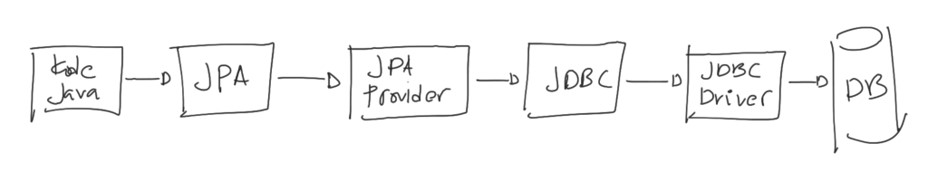
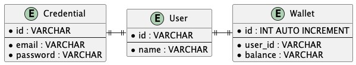
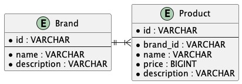
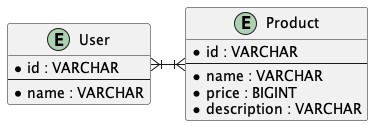
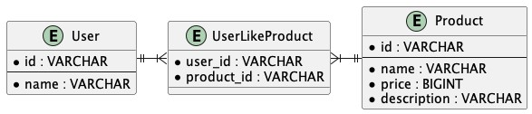
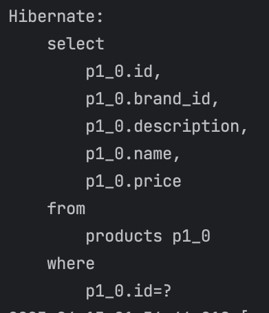
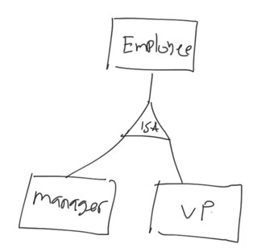
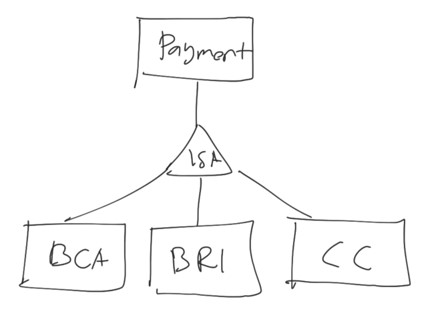
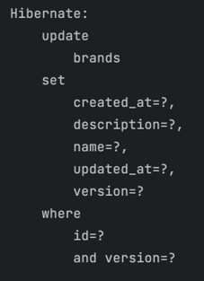
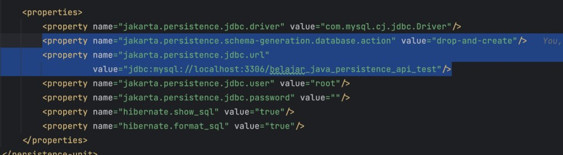

# Java Persistence API

## Sebelum Belajar

- Java Database
- Apache Maven
- Java Input Output
- MySQL

## #1 Pengenalan Java Persistence API

### Pengenalan Object Relational Mapping?

- ORM adalah sebuah teknik pemetaan (mapping) antara basis data relational (database) dengan object (hasil Class) pada bahasa pemrograman
- Dengan menggunakan ORM, kita dapat memanipulasi data di database menggunakan object dalam bahasa pemrograman.
- ORM framework akan bertanggung jawab dalam melakukan sinkronisasi data yang kita ubah pada object dengan data di database, yaitu dengan melakukan proses CRUD (Create, Read, Update dan Delete)
- Dengan ORM, kita bisa melakukan manipulasi data di database layaknya memanipulasi data object, tanpa harus menulis SQL nya secara manual

### Pengenalan JPA

- Java Persistence API atau disingkat JPA adalah salah satu standarisasi untuk Object Relational Mapping (ORM) di Java
- JPA sendiri sebenarnya adalah bagian dari Java Enterprise (sekarang bernama Jakarta Enterprise)
- Awalnya adalah fitur ORM di Enterprise Java Beans (EJB), namun akhirnya dipisahkan menjadi spesifikasi sendiri
- JPA sangat banyak digunakan oleh programmer Java, karena dengan menggunakan JPA, kita tidak perlu lagi melakukan hal manual seperti Query SQL, manual transform ke Java Bean Class atau melakukan manual JOIN ke banyak Table
- <https://jakarta.ee/specifications/persistence/>

### Diagram JPA



## #2 Pengenalan Hibernate ORM

### JPA Provider

- Seperti yang dijelaskan di awal, JPA merupakan spesifikasi untuk ORM di Java
- Artinya, kita tidak bisa menggunakan JPA secara langsung, harus menggunakan implementasinya atau JPA Provider, mirip seperti JDBC yang harus ada JDBC Driver nya sebagai implementasinya
- Ada banyak sekali JPA Provider yang ada, kita bisa pilih salah satunya

### Contoh JPA Provider

- Eclipse Link : <https://www.eclipse.org/eclipselink/>
- OpenJPA : <https://openjpa.apache.org/>
- Hibernate ORM : <https://hibernate.org/orm/>

### Pengenalan Hibernate ORM

- Pada kelas ini, kita akan menggunakan Hibernate ORM sebagai JPA Provider
- Hal ini dikarenakan Hibernate ORM merupakan salah satu JPA Provider yang paling banyak digunakan
- Bahkan jika dilihat sejarahnya, Hibernate ORM sendiri awalnya lebih populer dibanding JPA ketika masih dalam EJB
- Dan banyak sekali fitur Hibernate ORM yang akhirnya masuk menjadi fitur di JPA
- <https://hibernate.org/orm/>

## #3 Membuat Project

- <https://start.spring.io/>
- Tambahkan dependency :
  - JPA
  - MySQL Driver
- Setting Logback : <https://github.com/ProgrammerZamanNow/belajar-java-logging/blob/master/src/main/resources/logback.xml>

## #4 Entity

- Entity adalah Class yang merepresentasikan table di database
- Di JPA, saat kita membuat Class Entity, maka kita perlu menambahkan annotation `@Entity` pada class tersebut
- Class Entity adalah sebuah class Java Bean, dimana tiap attribute (yang memiliki getter dan setter) di Class tersebut merepresentasikan kolom di table database
- Class Entity wajib memiliki default constructor yang tidak memiliki parameter, hal ini agar JPA bisa membuat object baru tanpa parameter ketika melakukan mapping data dari table ke object Entity
- <https://jakarta.ee/specifications/persistence/3.1/apidocs/jakarta.persistence/jakarta/persistence/entity>

### Kode : Customer Entity

```java
@Entity
public class Customer {

	private String id;

	private String name;

	public String getId() {
		return id;
	}

	... // getter and setter
}
```

### Id

- Saat membuat Class Entity, JPA mewajibkan tiap Class Entity memiliki Primary Key
- Walaupun di database seperti MySQL, Primary Key tidak wajib, namun di JPA hal itu diwajibkan
- Untuk menandai sebuah atribut di Class Entity adalah Primary Key, kita harus menggunakan annotation Id
- <https://jakarta.ee/specifications/persistence/3.1/apidocs/jakarta.persistence/jakarta/persistence/id>

### Kode : Customer Entity

```java
@Entity
public class Customer {

	@Id
	private String id;

	private String name;

	public String getId() {
		return id;
	}

	... // getter and setter
}
```

### Table

- Saat kita membuat Class Entity, secara default nama table di database akan menggunakan nama Class Entity nya
- Kadang kita membuat nama Table dalam bentuk jamak, misal customers, sehingga berbeda dengan nama class Customer
- Untuk mengubah informasi Table pada Class Entity, kita bisa menambahkan annotation Table pada Class Entity nya
- <https://jakarta.ee/specifications/persistence/3.1/apidocs/jakarta.persistence/jakarta/persistence/table>

### Kode : Customer Entity

```java
@Entity
@Table(name = "customers")
public class Customer {

	@Id
	private String id;

	private String name;

	public String getId() {
		return id;
	}

	... // getter and setter
}
```

### Kode : Membuat Table Customer

```sql
CREATE DATABASE belajar_java_presistence_api;

USE belajar_java_presistence_api;

CREATE TABLE customers
(
	id VARCHAR(255) NOT NULL PRIMARY KEY,
	name VARCHAR(255) NOT NULL
) ENGINE InnoDB;
```

## #5 Entity Manager Factory

- Saat menggunakan JPA, hal yang pertama kita perlu buat adalah `EntityManagerFactory`
- Ini seperti `DataSource`, dimana kita hanya buat satu kali saja dalam satu aplikasi
- EntityManagerFactory merupakan object yang sangat berat, karena perlu membaca Entity Class dan fitur-fitur lainnya saat pertama kali dibuat, oleh karena itu biasanya memang hanya dibuat sekali pada saat aplikasi berjalan saja
- <https://jakarta.ee/specifications/persistence/3.1/apidocs/jakarta.persistence/jakarta/persistence/entitymanagerfactory>

### Konfigurasi JPA

- Sebelum membuat `EntityManagerFactory`, kita perlu membuat konfigurasi JPA terlebih dahulu
- Untuk melakukan konfigurasi JPA, kita perlu membuat file `META-INF/persistence.xml` pada resource yang berisikan konfigurasi JPA
- Kita bisa lihat contoh template nya disini : <https://gist.github.com/khannedy/e74bf1b7be064dfd16a626d948f04218>

### Kode : Konfigurasi JPA

```xml
<persistence-unit name+"BELAJAR">
	<provider>org.hibernate.jpa.HibernatePersistenceProvider</provider>

	<!-- Entity Classes -->
	<class>programmerzamannow.jpa.entity.Customer</class>

	<properties>
		<property name="jakarta.persistence.jdbc.driver" value="com.mysql.cj.jdbc.Driver" />
		<property name="jakarta.persistence.jdbc.url" value="jdbc:mysql://localhost:3306/belajar_java_presistence_api" />
		<property name="jakarta.persistence.jdbc.user" value="root" />
		<property name="jakarta.persistence.jdbc.password" value="" />
		<property name="hibernate.show_sql" value="true" />
		<property name="hibernate.format_sql" value="true" />
	</properties>
</persistence-unit>
```

### Membuat Entity Manager Factory

- Untuk membuat EntityManagerFactory, kita bisa menggunakan `Persistence.createEntityManagerFactory(nama);`
- Method tersebut akan membaca semua konfigurasi pada file `META-INF/persistence.xml`

### Kode : Membuat Entity Manager Factory

```java
public class EntityManagerFactoryTest {

	@Test
	void createEntityManagerFactory() {
		EntityManagerFactory entityManagerFactory = Persistence.createEntityManagerFactory("BELAJAR");

		entityManagerFactory.close();
	}
}
```

## #6 Entity Manager

- EntityManagerFactory itu mirip seperti DataSource, digunakan untuk melakukan management EntityManager
- EntityManager mirip seperti Connection pada JDBC, dimana jika kita ingin berinteraksi dengan database, maka kita akan menggunakan EntityManager
- EntityManager dibuat ketika kita butuh berinteraksi dengan database, dan setelah selesai, kita perlu menutupnya, sama seperti ketika kita menggunakan Connection pada JDBC
- <https://jakarta.ee/specifications/persistence/3.1/apidocs/jakarta.persistence/jakarta/persistence/entitymanager>

### Kode : Membuat Entity Manager

```java
@Test
void createEntityManager() {
	EntityManagerFactory entityManagerFactory = Persistence.createEntityManagerFactory("BELAJAR");

	EntityManager entityManager = entityManagerFactory.createEntityManager();

	entityManager.close();

	entityManagerFactory.close();
}
```

## #7 Transaction

- Saat kita menggunakan database, fitur yang wajib kita mengerti adalah database transaction
- Saat belajar JDBC, kita sudah belajar dengan fitur database transaction di JDBC
- Saat menggunakan JDBC, secara default operasi ke DB adalah `auto commit`, sehingga kita tidak perlu membuat transaction
- Namun, di JPA, secara default kita diwajibkan menggunakan database transaction saat melakukan operasi manipulasi data entity
- Transaction di JPA di representasikan dalam interface `EntityTransaction`
- <https://jakarta.ee/specifications/persistence/3.1/apidocs/jakarta.persistence/jakarta/persistence/entitytransaction>

### Kode : Membuat Transaction

```java
@Test
void transaction() {
	EntityManagerFactory entityManagerFactory = Persistence.createEntityManagerFactory("BELAJAR");

	EntityManager entityManager = entityManagerFactory.createEntityManager();
	EntityTransaction entityTransaction = entityManager.getTransaction();

	try {
		entityTransaction.begin();
		// DO SOMETHING
		entityTransaction.commit();
	} catch (Throwable throwable) {
		entityTransaction.rollback();
	}

	entityManager.close();
	entityManagerFactory.close();
}
```

## #8 CRUD

- Untuk melakukan proses CRUD (Create, Read, Update, Delete) ke database, kita bisa menggunakan `EntityManager`
- Secara otomatis JPA akan membuatkan perintah SQL untuk INSERT, UPDATE, DELETE dan SELECT dari Entity Class yang kita gunakan

### Entity Manager Method

| Method            | Keterangan                              |
| ----------------- | --------------------------------------- |
| `persist(entity)` | Untuk menyimpan entity                  |
| `merge(entity)`   | Untuk mengupdate entity                 |
| `remove(entity)`  | Untuk menghapus entity                  |
| `find(Class, id)` | Untuk mendapatkan entity berdasarkan id |

### Show SQL

- Kadang pada saat development, kita ingin melihat SQL yang dibuat oleh JPA
- Untungnya Hibernate ORM memiliki fitur untuk menampilkan SQL Query yang digenerate oleh JPA ke console
- Kita bisa tambahkann property `hibernate.show_sql` dan `hibernate.format_sql` pada file `persistence.xml`

### Kode : Show SQL

```xml
<persistence-unit name+"BELAJAR">
	...
	<properties>
		....
		<property name="hibernate.show_sql" value="true" />
		<property name="hibernate.format_sql" value="true" />
	</properties>
</persistence-unit>
```

### Kode : Insert Entity

```java
EntityManagerFactory entityManagerFactory = Persistence.createEntityManagerFactory("BELAJAR");

EntityManager entityManager = entityManagerFactory.createEntityManager();
EntityTransaction entityTransaction = entityManager.getTransaction();

entityTransaction.begin();

Customer customer = new Customer();
customer.setId("1");
customer.setName("Eko");

entityManager.persist(customer);

entityTransaction.commit();
entityManager.close();
entityManagerFactory.close();
```

### Kode : Find Entity

```java
EntityManagerFactory entityManagerFactory = Persistence.createEntityManagerFactory("BELAJAR");

EntityManager entityManager = entityManagerFactory.createEntityManager();
EntityTransaction entityTransaction = entityManager.getTransaction();

entityTransaction.begin();

Customer customer = entityManager.find(Customer.class, "1");
Assertions.assertEquals("1", customer.getId());
Assertions.assertEquals("Eko", customer.getName());

entityManager.persist(customer);

entityTransaction.commit();
entityManager.close();
entityManagerFactory.close();
```

### Kode : Update Entity

```java
EntityManagerFactory entityManagerFactory = Persistence.createEntityManagerFactory("BELAJAR");

EntityManager entityManager = entityManagerFactory.createEntityManager();
EntityTransaction entityTransaction = entityManager.getTransaction();

entityTransaction.begin();

Customer customer = entityManager.find(Customer.class, "1");
customer.setName("Eko Kurniawan");
entityManager.merge(customer);

entityManager.persist(customer);

entityTransaction.commit();
entityManager.close();
entityManagerFactory.close();
```

### Kode : Remove Entity

```java
EntityManagerFactory entityManagerFactory = Persistence.createEntityManagerFactory("BELAJAR");

EntityManager entityManager = entityManagerFactory.createEntityManager();
EntityTransaction entityTransaction = entityManager.getTransaction();

entityTransaction.begin();

Customer customer = entityManager.find(Customer.class, "1");
entityManager.remove(customer);

entityManager.persist(customer);

entityTransaction.commit();
entityManager.close();
entityManagerFactory.close();
```

## #9 Column

- Secara default, nama attribute di Class Entity akan di mapping sebagai nama kolom di Table
- Namun terkadang, nama kolom sering berbeda format dengan attribute di Class, misal di attribute Class menggunakan camelCase, sedangkan kolom di Table menggunakan snake_case
- Untuk melakukan mapping kolom, kita bisa menggunakan annotation Column
- <https://jakarta.ee/specifications/persistence/3.1/apidocs/jakarta.persistence/jakarta/persistence/column>

### Kode : Alter Table Customer

```sql
ALTER TABLE customers
	ADD COLUMN primary_email VARCHAR(150);

```

### Kode : Customer Entity

```java
@Entity
@Table(name = "customers")
public class Customer {

	@Id
	@Column(name = "id")
	private String id;

	@Column(name = "name")
	private String name;

	@Column(name = "primary_email")
	private String primaryEmail;

	public String getId() {
		return id;
	}

	... // getter and setter
}
```

## #10 Generated Value

- Beberapa database, kadang memiliki fitur membuat Primary Key yang diisi secara otomatis
- Contohnya di MySQL terdapat fitur Auto Increment untuk Primary Key dengan tipe Number
- Hal ini menyebabkan dalam JPA, kita tidak bisa mengubah nilai Id nya, karena Id akan dibuat oleh database
- Pada kasus seperti ini, kita bisa menandai bahwa value Id dibuat secara otomatis oleh database menggunakan annotation `GeneratedValue`
- <https://jakarta.ee/specifications/persistence/3.1/apidocs/jakarta.persistence/jakarta/persistence/generatedvalue>

### Generated Value Strategy

- Selain Auto Increment, terdapat cara lain untuk membuat Id secara otomatis, contohnya di PostgreSQL menggunakan Sequence, atau menggunakan Table lain untuk melakukan management Id, atau bahkan menggunakan `UUID`
- Oleh karena itu, kita perlu memberi tahu Strategy apa yang dilakukan untuk membuat Id nya
- <https://jakarta.ee/specifications/persistence/3.1/apidocs/jakarta.persistence/jakarta/persistence/generationtype>

### Kode : Create Table Category

```sql
CREATE TABLE categories
(
	id INT NOT NULL AUTO_INCREMENT PRIMARY KEY,
	name VARCHAR(100) NOT NULL,
	description VARCHAR(500)
) ENGINE InnoDB;
```

### Kode : Category Entity

```java
@Entity
@Table(name = "categories")
public class Category {

	@Id
	@GeneratedValue(strategy = GenerationType.IDENTITY);
	private Integer id;

	private String name;

	private String description;

	... // getter and setter
}
```

### Kode : Insert Category

```java
EntityManagerFactory entityManagerFactory = Persistence.createEntityManagerFactory("BELAJAR");

EntityManager entityManager = entityManagerFactory.createEntityManager();
EntityTransaction entityTransaction = entityManager.getTransaction();

entityTransaction.begin();

Category category = new Category();
category.setName("Gadget");
category.setDescription("Gadget Termurah");
entityManager.persist(category);

Assertions.assertNotNull(category.getId());

entityTransaction.commit();
entityManager.close();
entityManagerFactory.close();
```

## #11 Basic Data Type

- JPA akan melakukan mapping data type secara otomatis dari table ke Class Entity
- Secara default, tipe data dasar yang biasa digunakan di Java sudah didukung oleh JPA
- Yang kita hanya perlukan adalah memastikan tipe data di Class Entity sama dengan tipe data di kolom Table di Database

### Daftar Tipe Data

- Semua Number (Byte, Short, Integer, Long, Float, Double)
- Semua Big Number (BigInteger, BigDecimal)
- Boolean
- String & Character

### Kode : Alter Table Customer

```sql
ALTER TABLE customers
	ADD COLUMN age TINYINT;

ALTER TABLE customers
	ADD COLUMN married BOOLEAN;
```

### Kode : Customer Entity

```java
@Entity
@Table(name = "customers")
public class Customer {

	@Id
	@Column(name = "id")
	private String id;

	@Column(name = "name")
	private String name;

	private Boolean married;

	private Byte age;

	... // getter and setter
}
```

### Kode : Insert Customer

```java
EntityManagerFactory entityManagerFactory = Persistence.createEntityManagerFactory("BELAJAR");

EntityManager entityManager = entityManagerFactory.createEntityManager();
EntityTransaction entityTransaction = entityManager.getTransaction();

entityTransaction.begin();

Customer customer = new Customer();
customer.setId("2");
customer.setName("Budi");
customer.setAge((byte) 30);
customer.setMarried(true);

entityManager.persist(customer);

entityTransaction.commit();
entityManager.close();
entityManagerFactory.close();
```

## #12 Enum

- Di Java, terdapat fitur Enum
- Bagaimana cara menyimpan data Enum di Java ke table di database?
- Jika kita memiliki attribute dengan tipe data Enum, maka kita perlu memberitahu JPA bagaimana caranya menyimpan data Enum nya ke Table dengan menggunakan annotation `Eumerated`
- <https://jakarta.ee/specifications/persistence/3.1/apidocs/jakarta.persistence/jakarta/persistence/enumerated>

### Enum Type

- Saat menyimpan data Enum, JPA menyediakan dua strategy, menyimpan dalam bentuk Integer, atau menyimpan dalam bentuk String
- Kita bisa memilih nya dengan menggunakan EnumType pada annotation Enumerated
- Sangat disarankan menggunakan strategy `String`, karea strategy Integer bisa berubah ketika terjadi penambahan Enum Value pada posisi yang acak
- <https://jakarta.ee/specifications/persistence/3.1/apidocs/jakarta.persistence/jakarta/persistence/enumtype>

### Kode : Customer Type Enum

```java
public enum CustomerType {
	REGULAR,
	PREMIUM,
	VIP
}
```

### Kode : Alter Table Customer

```sql
ALTER TABLE customers
	ADD COLUMN type VARCHAR(50);
```

### Kode: Customer Entity

```java
@Entity
@Table(name = "customers")
public class Customer {

	@Id
	@Column(name = "id")
	private String id;

	@Column(name = "name")
	private String name;

	@Enumerated(EnumType.STRING)
	private CustomerType type;

	private Boolean married;

	private Byte age;

	... // getter and setter
}
```

### Kode : Insert Customer

```java
EntityManagerFactory entityManagerFactory = Persistence.createEntityManagerFactory("BELAJAR");

EntityManager entityManager = entityManagerFactory.createEntityManager();
EntityTransaction entityTransaction = entityManager.getTransaction();

entityTransaction.begin();

Customer customer = new Customer();
customer.setId("3");
customer.setName("Joko");
customer.setAge((byte) 30);
customer.setMarried(true);
customer.setCustomerType(CustomerType.PREMIUM);

entityManager.persist(customer);

entityTransaction.commit();
entityManager.close();
entityManagerFactory.close();
```

## #13 Date dan Time

- Selain tipe data dasar, JPA juga bisa melakukan mapping tipe data Date dan Time secara otomatis
- Saat kita belajar JDBC, tipe data Date dan Time hanya terbatas pada tipe data di package `java.sql`
- Namun jika menggunakan JPA, kita bisa menggunakan tipe data Date, Timestamp, - Calendar, bahkan class-class di Date and Time API seperti LocalDate, LocalTime dan lain-lain

### Mapping Date dan Time API

| Class Java                                                                                                                  | Tipe Data Database |
| --------------------------------------------------------------------------------------------------------------------------- | ------------------ |
| `java.sql.Date`, `java.time.LocalDate`                                                                                      | DATE               |
| `java.sql.Time`, `java.time.LocalTime`                                                                                      | TIME               |
| `java.sql.TimeStamp`, `java.time.Instant`, `java.time.LocalDateTime`, `java.time.OffsetDateTime`, `java.time.ZonedDateTime` | TIMESTAMP          |

### Java Util

- Bagaimana dengan tipe data `java.util.Date` dan `java.util.Calendar`
- Tipe data itu sedikit membingungkan karena bisa digunakan untuk Date, Time dan Timestamp di database
- Oleh karena itu, direkomendasikan menggunakan package `java.time`
- Namun jika menggunakan package `java.util`, disarankan menambahkan annotation `Temporal`, untuk memberi tahu detail tipe data di database, apakah Date, Time atau Timestamp
- <https://jakarta.ee/specifications/persistence/3.1/apidocs/jakarta.persistence/jakarta/persistence/temporal>

### Kode : Alter Table Category

```sql
ALTER TABLE categories
	ADD COLUMN created_at TIMESTAMP;

ALTER TABLE categories
	ADD COLUMN updated_at TIMESTAMP;
```

### Kode : Category Entity

```java
@Entity
@Table(name = "categories")
public class Category {

	@Id
	@GeneratedValue(strategy = GeneratedValue.IDENTITY);
	private Integer id;

	@Temporal(TemporalType.TIMESTAMP)
	@Column(name = "created_at")
	private Calendar createdAt;

	@Column(name = "updated_at")
	private LocalDateTime updatedAt;

	private String name;

	private String description;


	... // getter and setter
}
```

### Kode : Insert Category

```java
EntityManagerFactory entityManagerFactory = Persistence.createEntityManagerFactory("BELAJAR");

EntityManager entityManager = entityManagerFactory.createEntityManager();
EntityTransaction entityTransaction = entityManager.getTransaction();

entityTransaction.begin();

Category category = new Category();
category.setName("Food");
category.setCreatedAt(Calendar.getInstance());
category.setUpdatedAt(LocalDateTime.now());

entityManager.persist(category);

Assertions.assertNotNull(category.getId());

entityTransaction.commit();
entityManager.close();
entityManagerFactory.close();
```

## #14 Large Object

- Kadang ada kasus kita membuat tipe kolom large object, yaitu tipe kolom yang digunakan untuk menampung data besar
- Terdapat dua jenis Large Object di database
- Character Large Object, untuk menampung tipe data Text besar, dan
- Binary Large Object, untuk menampung tipe data Binary besar (misal gambar, audio, dan lain-lain)

### Java SQL

- Representasi Large Object di JDBC bisa menggunakan dua interface, yaitu
- `java.sql.Clob` untuk Character Large Object, dan
- `java.sql.Blob` untuk Binary Large Object

### Java Types

- Namun, kadang menggunakan `java.sql.Clob` dan `java.sql.Blob` agak menyulitkan, karena harus membaca datanya secara manual menggunakan Java `IO`
- JPA juga bisa digunakan untuk secara otomatis mengkonversi tipe data Large Object ke tipe data yang lebih familiar di Java
- String dan char[] bisa digunakan untuk tipe data Character Large Object
  byte[] bisa digunakan untuk tipe data Binary Large Object
- Jika kita menggunakan tipe data ini, kita perlu menambahkan annotation `Lob` untuk memberi tahu ke JPA, bahkan ini adalah Large Object
- <https://jakarta.ee/specifications/persistence/3.1/apidocs/jakarta.persistence/jakarta/persistence/lob>

### Kode : Create Table Image

```sql
CREATE TABLE images
(
	id INT NOT NULL AUTO_INCREMENT PRIMARY KEY,
	name VARCHAR(100) NOT NULL,
	description TEXT,
	image BLOB
) ENGINE InnoDB;
```

### Kode : Image Entity

```java
@Entity
@Table(name = "images")
public class Image {

	@Id
	@GeneratedValue(strategy = GenerationType.IDENTITY)
	private Integer id;

	private String name;

	@Lob
	private String description;

	@Lob
	private byte[] image;
}
```

### Kode : Insert Image

```java
EntityManagerFactory entityManagerFactory = Persistence.createEntityManagerFactory("BELAJAR");

EntityManager entityManager = entityManagerFactory.createEntityManager();
EntityTransaction entityTransaction = entityManager.getTransaction();

entityTransaction.begin();

Image image = new Image();
image.setName("Contoh Image");
image.setDescription("Contoh Deskripsi Image");

byte[] bytes = Files.readAllBytes(Path.of(getClass().getResource("/images/sample.png").getPath()));
image.setImage(bytes);

entityManager.persist(image);

Assertions.assertNotNull(image.getId());

entityTransaction.commit();
entityManager.close();
entityManagerFactory.close();
```

## #15 Transient

- Saat membuat attribute di Class Entity, secara default attribute tersebut akan dianggap sebagai kolom di Table
- Kadang ada kasus kita ingin membuat attribute yang bukan kolom di table
- Pada kasus ini, kita bisa menambahkan annotation `Transient`, untuk menandai bahwa attribute tersebut bukan kolom di Table, sehingga akan di ignore oleh JPA
- <https://jakarta.ee/specifications/persistence/3.1/apidocs/jakarta.persistence/jakarta/persistence/transient>

### Kode : Customer Entity

```java
@Entity
@Table(name = "customers")
public class Customer {

	@Id
	@Column(name = "id")
	private String id;

	@Column(name = "name")
	private String name;

	@Enumerated(EnumType.STRING)
	private CustomerType type;

	@Transient
	private String fullName;

	private Boolean married;

	private Byte age;

	... // getter and setter
}
```

## #16 Embedded

- Saat membuat Class Entity, praktek yang baik adalah membuat jenis Class sesuai dengan yang dibutuhkan, Misal jika dalam Class Member, terdapat informasi seperti firstName, middleName, lastName, title, mungkin lebih baik digabung dalam satu Class Name misalnya
- Namun jika kolom nya masih di table yang sama, kadang menyulitkan jika kita harus tetap membuat atribut nya pada Class Entity yang sama, karena lama-lama atribut nya akan semakin banyak
- Untungnya di JPA terdapat fitur Embedded, dimana kita bisa menambahkan atribut berupa Class lain, namun tetap mapping ke table yang sama

### Embeddable

- Untuk menandai bahwa sebuah class itu bisa digunakan sebagai atribut di Class Entity atau istilahnya embedded atribut, maka kita wajib menambahkan annotation `Embeddable` di Class nya
- Selanjutnya isi atribut pada Class Embedded tersebut, bisa kita tambahkan annotation Column seperti biasanya
- <https://jakarta.ee/specifications/persistence/3.1/apidocs/jakarta.persistence/jakarta/persistence/embeddable>

### Kode : Create Table Member

```sql
CREATE TABLE members
(
	id INT NOT NULL AUTO_INCREMENT PRIMARY KEY,
	email VARCHAR(150) NOT NULL,
	title VARCHAR(100),
	first_name VARCHAR(100) NOT NULL,
	middle_name VARCHAR(100),
	last_name VARCHAR(100)
) ENGINE InnoDB;
```

### Kode : Class Name

```java
@Embeddable
public class Name {

	@Column(name = "title")
	private String title;

	@Column(name = "first_name")
	private String firstName;

	@Column(name = "middle_name")
	private String middleName;

	@Column(name = "last_name")
	private String lastName;
}
```

### Embedded

- Saat kita menggunakan atribut class Embedded di Class Entity, kita wajib menggunakan annotation `Embedded` untuk menandai bahwa itu ada class Embedded
- <https://jakarta.ee/specifications/persistence/3.1/apidocs/jakarta.persistence/jakarta/persistence/embedded>

### Kode : Class Member

```java
@Entity
@Table(name = "members")
public class Member {

	@Id
	@GeneratedValue(strategy = GenerationType.IDENTITY)
	private Integer id;

	@Embedded
	private Name name;

	private String email;
}
```

### Kode : Insert Member

```java
Membar membar = new Membar();
member.setEmail("eko@example.com");

Name name = new Name();
name.setTitle("Mr");
name.setFirstName("Eko");
name.setMiddleName("Kurniawan");
name.setLastName("khannedy");
member.setName(name);

entityManager.persist(membar);
```

## #17 Embedded Id

- Id adalah representasi dari Primary Key di Table
- Seperti yang sudah kita bahas di materi sebelumnya, Class Entity wajib memiliki Id
- Namun bagaimana jika ternyata ada table dengan Primary Key lebih dari satu kolom?
- Pada kasus seperti ini, kita tidak bisa membuat dua atribut dengan annotation `Id`, karena method-method yang terdapat di EntityManager hanya menggunakan 1 parameter sebagai ID
- Oleh karena itu, kita perlu menggunakan Class Embedded
- Dan untuk menandai bahwa atribut itu adalah Id, kita gunakan annotation `EmbeddedId`
- Khusus untuk class Embedded untuk Primary Key, direkomendasikan implements `Serializable`
- <https://jakarta.ee/specifications/persistence/3.1/apidocs/jakarta.persistence/jakarta/persistence/embeddedid>

### Kode : Create Table Department

```sql
CREATE TABLE departments
(
	company_id VARCHAR(100) NOT NULL,
	department_id VARCHAR(100) NOT NULL,
	name VARCHAR(150) NOT NULL,
	PRIMARY KEY (company_id, department_id)
) ENGINE InnoDB;
```

### Kode : DepartmentId Embedded Class

```java
@Embeddable
public class DepartmentId implements Serializable {

	@Column(name = "company_id")
	private String companyId;

	@Column(name = "department_id")
	private String departmentId;

	...
}
```

### Kode : Class Department

```java
@Entity
@Table(name = "departments")
public class Department {

	@EmbeddedId
	private DepartmentId id;

	private String name;
}
```

### Kode : Insert Department

```java
DepartmentId id = new DepartmentId();
id.setCompanyId("pzn");
id.setDepartmentId("tech");

Department department = new Department();
department.setId(id);
department.setName("Teknologi");

entityManager.persist(department);

department departmentFromDB = entityManager.find(Department.class, id);

Assertions.assertEquals(department.getName(), departmentFromDB.getName());
```

## #18 Collection

- Saat kita membuat Data dalam bentuk Class, kita sering sekali membuat atribut dalam bentuk Collection, dan itu sangat mudah
- Namun hal itu tidak mudah dilakukan di Table, kita harus membuat table terpisah dengan relasi One to Many
- JPA mendukung database relation, namun pada kasus yang sangat sederhana, kita bisa membuat atribut dengan tipe Collection yang secara otomatis menggunakan Table Join untuk mengambil datanya

### Tipe Data Collection

- JPA mendukung banyak tipe data collection, seperti `List<T>` atau `Set<T>`
- Saat kita menggunakan tipe data collection, secara otomatis kita perlu membuat table untuk menyimpan data collection nya
- Atribut collection harus kita tandai dengan annotation `ElementCollection`
- Dan untuk menentukan table mana yang digunakan sebagai table untuk menyimpan Collection, kita gunakan annotation `CollectionTable`
- Dan untuk menentukan kolom mana di table collection yang kita ambil datanya, kita bisa gunakan annotation `Column` seperti biasaya

### Kode : Create Table Hobby

```sql
CREATE TABLE hobbies
(
	Id INT NOT NULL AUTO_INCREMENT PRIMARY KEY,
	member_id INT NOT NULL,
	name VARCHAR(100) NOT NULL,
	FOREIGN KEY fk_members_hobbies (member_id)
		REFERENCES members (id)
) ENGINE InnoDB;
```

### Kode : Member Class

```java
@Entity
@Table(name = "members")
public class Member {

	@Id
	@GeneratedValue(strategy = GenerationType.IDENTITY)
	private Integer id;

	@ElementCollection
	@CollectionTable(name = "hobbies", joinColumns = @JoinColumn(
		name = "member_id", referencedColumnName = "id"
	))
	@Column(name = "name")
	private List<String> hobbies;
}
```

### Kode : Insert Customer

```java
Name name = new Name();
name.setFirstName("Eko");
name.setMiddleName("Kurniawan");
name.setLastName("khannedy");

Member member = new Member();
member.setEmail("test@example.com");
member.setName(name);

member.getHobbies(new ArrayList<>());
member.getHobbies().add("Coding");
member.getHobbies().add("Gaming");

entityManager.persist(member);
```

## #19 Map Collection

- Selain `List<T> dan Set<T>`, kita juga bisa menggunakan collection `Map<K, V>` sebagai atribut di Class Entity
- Cara penggunaannya hampir mirip dengan `List<T>` atau `Set<T>`, namun karena pada `Map<K, V>` terdapat key dan value, maka kita harus memberi tahu JPA untuk kolom key dan kolom value menggunakan annotation `MapKeyColumn`, sedangkan untuk value nya tetap menggunakan annotation `Column`

### Kode : Create Table Skill

```sql
CREATE TABLE skills
(
	id INT NOT NULL AUTO_INCREMENT PRIMARY KEY,
	membar_id INT NOT NULL,
	name VARCHAR(100) NOT NULL,
	value INT NOT NULL,
	FOREIGN KEY fk_members_skills (memberid)
		REFERENCES members (id),
	CONSTRAINT skills_unique UNIQUE (mmber_id, name)
) ENGINE InnoDB;
```

### Kode : Member Class

```java
@Entity
@Table(name = "members")
public class Member {

	@Id
	@GeneratedValue(strategy = GenerationType.IDENTITY)
	private Integer id;

	@ElementCollection
	@CollectionTable(name = "skills", joinColumns = @JoinColumn(
		name = "member_id", referencedColumnName = "id"
	))
	@MapKeyColumn(name = "name")
	@Column(name = "value")
	private Map<String, Integer> skiils;
}
```

### Kode : Insert Memeber

```java
name.setFirstName("Eko");
name.setMiddleName("Kurniawan");
name.setLastName("khannedy");

Member member = new Member();
member.setEmail("test@example.com");
member.setName(name);

member.getSkills(new HashMap<>());
member.getSkills().put("Java",  90);
member.getSkills().put("Golang",  90);
member.getSkills().put("PHP",  85);

entityManager.persist(member);
```

## #20 Collection Update

- Hati-hati ketika menggunakan Collection Element
- Setiap kita mengubah data di Collection Element, JPA akan menghapus dulu seluruh data di table Collection nya, setelah itu akan melakukan insert data baru
- Oleh karena itu, Id pada Collection Element akan selalu berubah
- Jadi pastikan Id pada table Collection Element tidak digunakan sebagai Foreign Key di table lain
- Lantas bagaimana jika kita ingin menggunakan table Collection Element sebagai FK di table lain?
- Maka kita jangan menggunakan Collection Element, kita harus menggunakan JPA Entity Relationship yang akan dibahas di bab khusus

### Kode : Collection Update

```java
EntityTransaction entityTransaction = entityManager.getTransaction();
entityTransaction.begin();

Member member = entityManager.find(Member.class, 5);

member.setSkills(new HashMap<>());
member.getSkills().put("Java", 90);
member.getSkills().put("Golang", 90);
member.getSkills().put("PHP", 85);

entityManager.merge(memebr);

entityTransaction.commit();
```

## #21 Entity Listener

- Saat kita memanipulasi data Entity, kadang kita ingin melakukan instruksi program yang sama
- Misal, setiap data diubah, kita ingin mengubah kolom `updated_at` menjadi waktu saat ini misalnya
- Jika dilakukan di semua kode program kita, maka akan menyulitkan
- Untungnya JPA memiliki fitur Entity Listener, dimana kita bisa membuat sebuah class `Listener`, yang nanti akan dipanggil oleh JPA ketika sebuah operasi terjadi terhadap Entity nya

### Event Annotation

| Event Annotation | Keterangan |
| `@PrePersist` | Dieksekusi sebelum melakukan persist entity |
| `@PostPersist` | Dieksekusi setelah melakukan persist entity |
| `@PreRemove` | Dieksekusi sebelum melakukan remove entity |
| `@PostRemove` | Dieksekusi setelah melakukan remove entity |
| `@PreUpdate` | Dieksekusi sebelum melakukan update entity |
| `@PostUpdate` | Dieksekusi setelah melakukan update entity |
| `@PostLoad` | Dieksekusi setelah melakukan load entity |

### Kode : UpdatedAtAware Interface

```java
public interface UpdatedAtAware {

	void setUpdatedAt(LocalDateTime dateTime);
}
```

### Kode : UpdateAtListener

```java
public class UpdatedAtListener {

	@PrePersist
	@PreUpdate
	public void setLastUpdatedAt(UpdatedAtAware object) {
		object.setUpdatedAt(LocalDateTime.now());
	}
}
```

### Kode : Category Class

```java
@Entity
@Table(name = "categories")
@EntityListeners({
	UpdateAtListener.class
})
public class Category implements UpdatedAtAware {

	@Id
	@GeneratedValue(strategy = GenerationType.IDENTITY)
	private Integer id;

	...
}
```

### Kode : Inset Category

```java
Category category = new Category();
category.stName("Conth")

entityManager.persist(category);

Assertions.assertNotNull(category.getUpdatedAt());
```

## #22 Listener di Entity Class

- Selain menggunakan annotation `EntityListener`, kita juga bisa langsung menambahkan Event annotation di Class `Entity` nya
- Dengan begitu, kita tidak perlu membuat class listener lagi
- Kekurangannya adalah, kita tidak bisa membuat listener yang bisa digunakan oleh Entity lain

### Kode : Member Class

```java
@Transient
private String fullName;

@PostLoad
public void postLoad() {
	fullName = name.getTitle() + ", " + name.getFirstName() + " " + name.getMiddleName() + " " + name.getLastName();
}
```

### Kode : Find Member

```java
Member memeber = entitymanager.find(Member.class, 1);
Assertions.assertEquals("Mr. Eko Kurniawan Khannedy", member.getFullName());
```

## #23 One to One Relationship

### Table Relationship

- Salah satu fitur yang paling banyak digunakan saat menggunakan Relational Database adalah Table Relationship
- Di kelas MySQL, kita sudah bahas secara lengkap tentang jenis-jenis relasi table, dari One to One, One to Many dan Many to Many
- JPA juga bisa menangani Table Relationship secara otomatis, hal ini menjadikan memanipulasi data Entity yang berhubungan akan lebih mudah

### One to One Relationship

- One to One Relationship adalah relasi yang paling mudah, dimana satu table berelasi dengan satu data di table lain
- Ada beberapa cara melakukan relasi pada one to one, dengan Foreign Key atau dengan Primary Key yang sama
- JPA mendukung keduanya, baik itu menggunakan Foreign Key ataupun menggunakan Primary Key yang sama

### OneToOne Annotation

- Untuk menambah atribut di Entity yang berelasi dengan Entity lain, kita perlu menambahkan menggunakan annotation OneToOne
- <https://jakarta.ee/specifications/persistence/3.1/apidocs/jakarta.persistence/jakarta/persistence/onetoone>
- Dan untuk memberi tahu JPA tentang kolom yang digunakan untuk melakukan JOIN Foreignn Key, kita perlu tambahkan annotation JoinColumn
- <https://jakarta.ee/specifications/persistence/3.1/apidocs/jakarta.persistence/jakarta/persistence/joincolumn>
- Namun jika JOIN nya menggunakan primary key yang sama, kita bisa gunakan annotation PrimaryKeyJoinColumn
- <https://jakarta.ee/specifications/persistence/3.1/apidocs/jakarta.persistence/jakarta/persistence/primarykeyjoincolumn>

### Diagram One to One



### Kode : Create Table Credential & User

```sql
CREATE TABLE credentials
(
	id VARCHAR(100) NOT NULL PRIMARY KEY,
	email VARCHAR(150) NOT NULL,
	password VARCHAR(150) NOT NULL
) ENGINE InnoDB;

CREATE TABLE users
(
	id VARCHAR(100) NOT NULL PRIMARY KEY,
	name VARCHAR(150) NOT NULL
) ENGINE InnoDB;

```

### Kode : Class Credential & User

```java
@Entity
@Table(name = "credentials")
public class Credential {

	@Id
	private String Id;

	private String email;

	private String password;
}

@Entity
@Table(name = "users")
public class User {

	@Id
	private String id;

	private String name;
}
```

### Kode : One to One Primary Key Join Column

```java
@Entity
@Table(name = "credentials")
public class Credential {

	@Id
	private String Id;

	private String email;

	private String password;

	@OneToOne(mappedBy = "credential")
	private User user;
}

@Entity
@Table(name = "users")
public class User {

	@Id
	private String id;

	private String name;

	@OneToOne
	@PrimaryKeyJoinColumn(
		name = "id",
		referencedColumnName = "id"
	)
	private Credential credential;
}
```

### Kode : Inser dan Find User & Credential

```java
Credential credential = new Credential();
credential.setId("khannedy");
credential.setEmail("khannedy@example.com");
credential.setPassword("rahasia");
entitymanager.persist(credential);

User user = new User();
user.setId("khannedy");
use.setName("Eko Khannedy");
entityManager.persist(user)
```

```java
User user = entityManager.find(User.class, "khannedy");
Assertions.assertNotNull(user.getCredential());

Assertions.assertEquals("khannedy@example.com", user.getCredential().getEmail());

Assertions.assertEquals("rahasia", user.getCredential().getPassword());
```

### Kode : Create Table Wallet

```sql
CREATE TABLE wallet
(
	id INT NOT NULL AUTO_INCREMENT PRIMARY KEY,
	user_id VARCHAR(100) NOT NULL,
	balance BIGINT NOT NULL,
	FOREIGN KEY fk_users_wallet (user_id) REFERENCES users (id)
) ENGINE InnoDB;
```

### Kode : One to One Join Column

```java
@Entity
@Table(name = "wallet")
public class Wallet {

	@Id
	@GeneratedValue(strategy = GenerationType.IDENTITY)
	private Integer id;


	private Long balance;

	@OneToOne
	@JoinColumn(name = "user_id", referencedColumnName = "id")
	private User user;
}

@Entity
@Table(name = "users")
public class User {

	@Id
	private String id;

	private String name;

	@OneToOne(mappedBy = "user")
	private Wallet wallet;
}
```

### Kode : Save dan Get Wallet

```java
User user = entitymanager.find(User.class, "khannedy");

Wallet wallet = new Wallet();

wallet.setUser(user);
wallet.setBalance(1_000_000L);
entitymanager.persist(wallet);

Assertions.assertNotNull(user.getWallet());
Assertions.assertEquals(1_000_000L, user.getWallet().getBalance());
```

## #24 One to Many Relationship

- Untuk membuat Entity yang memiliki relasi One to Many dengan Entity lain, kita bisa menggunakan annotation `OneToMany`
- <https://jakarta.ee/specifications/persistence/3.1/apidocs/jakarta.persistence/jakarta/persistence/onetomany>
- Dan atribut di Entity, tipe datanya harus dibungkus dalam collection, misal `List<T>` atau `Set<T>`
- Relasi OneToMany jika dilihat dari arah sebaliknya adalah relasi ManyToOne, oleh karena itu, nanti di Class Entity sebelahnya, relasinya adalah ManyToOne
- <https://jakarta.ee/specifications/persistence/3.1/apidocs/jakarta.persistence/jakarta/persistence/manytoone>
- Cara penggunaannya hampir mirip dengan relasi OneToOne, kita bisa gunakan `JoinColumn` pada Entity yang memiliki kolom Foreign Key nya yang menggunakan `ManyToOne`, dan cukup gunakan attribute mappedBy pada attribute yang menggunakan OneToMany

### Diagram : One To Many



### Kode : Create Table Brand & Product

```sql
CREATE TABLE brands
(
	id VARCHAR(100) NOT NULL PRIMARY KEY,
	name VARCHAR(100) NOT NULL,
	description VARCHAR(500)
) ENGINE InnoDB;

CREATE TABLE products
(
	id VARCHAR(100) NOT NULL PRIMARY KEY,
	band_id VARCHAR(100) NOT NULL,
	name VARCHAR(100) NOT NULL,
	price BIGINT NOT NULL,
	description VARCHAR(500),
	FOREIGN KEY fk_brands_products (band_id) REFERENCES brands (id)
) ENGINE InnoDB;
```

### Kode : Class Brand dan Product

```java
@Entity
@Table(name = "brands")
public class Brand {

	@Id
	private String id;

	private String name;

	private String description;

	@OneToOne(mappedBy = "brand")
	private List<Product> products;
}

@Entity
@Table(name ="products")
public class Product {

	@Id
	private String id;

	@ManyToOne
	@JoinColumn(
		name = "brand_id",
		referencedColumnName = "id"
	)
	private Brand brand;

	private String name;

	private Long price;

	private String description;
}
```

### Kode : Insert Brand dan Product

```java
Brand brand  = new Brand();

brand.setId("samsung");
brand.setName("Samsung");
entityManager.persist(brand);

Product product1 = new Product();
product1.setId("p1");
product1.setName("Samsung Galaxy 1");
product1.setBrand(brand);
product1.setPrice(1_000_000L);
entitymanager.persist(product1);

Product product2 = new Product();
product2.setId("p2");
product2.setName("Samsung Galaxy 2");
product2.setBrand(brand);
product2.setPrice(1_000_000L);
entityManager.persist(product2);
```

### Kode : Find Brand and Product

```java
Brand brand = entityManager.find(Brand.class, "samsung");
Assertions.assertEquals(2, brand.getProducts().size());

brand.getProducts().forEach(product -> {
	System.out.println(product.getName());
});
```

## #25 Many to Many Relationship

- Di kelas MySQL, kita sudah bahas tentang relasi Many to Many
- Pada relasi Many to Many, kita tidak bisa hanya menggunakan dua table, biasanya kita akan menambahkan table ditengah sebagai jembatan relasi antara table pertama dan kedua
- JPA juga mendukung relasi Many to Many

### Join Table

- Untuk menggunakan relasi Many to Many, kita bisa menggunakan annotation ManyToMany
- <https://jakarta.ee/specifications/persistence/3.1/apidocs/jakarta.persistence/jakarta/persistence/manytomany>
- Yang membedakan dengan relasi lain, karena Many to Many butuh table tambahan ditengah sebagai jembatan, oleh karena itu untuk melakukan join, kita menggunakan annotation JoinTable
- <https://jakarta.ee/specifications/persistence/3.1/apidocs/jakarta.persistence/jakarta/persistence/jointable>
- Untuk table yang ditengah sebagai jembatan, kita tidak butuh membuat Class Entity nya

### Diagram : Users Likes Products



### Diagram : Users Likes Products (Detail)



### Kode : Create Table user Like Product

```sql
CREATE TABLE users_like_products
(
	user_id VARCHAR(100) NOT NULL,
	product_id  VARCHAR(100) NOT NULL,
	FOREIGN KEY fk_users_users_like_products (user_id) REFERENCES users (id),
	FOREIGN KEY fk_products_users_like_products (product_id) REFERENCES products (id),
	PRIMARY KEY (user_id, product_id)
) ENGINE InnoDB;

```

### Kode : User Class

```java
@Entity
@Table(name = "users")
public class User  {

	@Id
	private String id;

	@ManyToMany
	@JoinTable(
		name = "users_like_products",
		joinColumns = @JoinColumn(name = "user_id", referencedColumnName = "id"),
		inverseJoinColumns = @JoinColumn(name = "product_id", referencedColumnName = "id")
	)
	private Set<Product> likes;
}
```

### Kode : Product Class

```java
@Entity
@Table(name = "products")
public class Product {

	@Id
	private String id;

	@ManyToMany(mappedBy = "likes")
	private Set<User> likedBy;
}
```

### Kode : Insert dan Find User

```java
User user = entitymanager.find(User.class, "khannedy");

user.setLikes(new HashSet<>());
user.getLikes().add(entitymanager.find(Product.class, "p1"));
user.getLikes().add(entitymanager.find(Product.class, "p2"));

entitymanager.merge(user);
```

```java
User user = entityManager.find(User.class, "khannedy");
user.getLikes().forEach(product -> {
	System.out.println(product.getName());
});
```

## #26 Fetch

- Saat kita membuat Entity Class yang kompleks dan banyak sekali relasinya, kita perlu berhati-hati
- Hal ini karena secara default, beberapa jenis relasi memiliki value fetch EAGER, artinya saat kita melakukan find Entity, relasinya akan secara otomatis di JOIN, walaupun kita tidak membutuhkan relasinya
- Kebalikan dari EAGER adalah LAZY, dimana artinya relasi akan di QUERY ketika kita memanggil attribute nya, jika tidak, maka tidak akan di QUERY

### Default Value Fetch

| Relation     | Default Fetch |
| ------------ | ------------- |
| One to One   | EAGER         |
| One to Many  | LAZY          |
| Many to One  | EAGER         |
| Many to Many | LAZY          |

### Mengubah Fetch

- Jika kita ingin mengubah nilai default Fetch, kita bisa ubah di attribut di annotation relasinya
- Semua relasi dari One to One, One to Many, Many to One dan Many to Many memiliki attribute fetch yang bisa kita ubah

### Log : One to One

```java
Product user = entityManager.find(Product.class, "p1"));
```


### Kode : Lazy Fetch

```java
@Entity
@Table(name = "products")
public class Product {

	@Id
	private String id;

	@ManyToMany(
		fetch = FetchType.LAZY
	)
	@JoinColumn(
		name = "brand_id",
		referencedColumnName = "id"
	)
	private Brand brand;
}
```



## #27 Inheritance

- Di dalam Entity Relationship Diagram (ERD), terdapat jenis relasi bernama IS-A
- IS-A ini biasanya digunakan untuk mendukung konsep pewarisan di relational database, yang notabenenya tidak mendukung konsep ini
- Jenis relasi IS-A sering sekali kita temui di kehidupan nyata
- Contoh, struktur table Employee, dimana memiliki detail Manager, VicePresident, Supervisor, dan lain-lain
- Atau struktur table Payment, dimana memiliki detail PaymentBCA, PaymentMandiri, PaymentCreditCard, dan lain-lain
- ISA Relationship jika dalam OOP, maka implementasinya adalah berupa Inheritance / Pewarisan

### ISA Diagram




### Implementasi IS-A Relationship

- IS-A sendiri memiliki beberapa cara implementasi di table nya, yaitu :
- Single Table Inheritance
- Joined Table Inheritance, dan
- Table Per Class Inheritance
- Semua implementasinya akan kita bahas di materi-materi selanjutnya

## #28 Single Table Inheritance

- Single Table Inheritance artinya kita menyimpan seluruh Entity untuk relasi IS-A dalam satu table
- Artinya semua kolom di semua Entity akan digabung dalam satu table
- Plus nya dari strategi ini adalah mudah dan cepat, tidak butuh melakukan join
- Minus nya, kita harus membuat semua kolom jadi nullable, karena tiap record hanya milik satu Entity

### Parent Entity

- Saat membuat Entity untuk IS-A Relationship, kita perlu membuat Parent Entity nya terlebih dahulu
- Parent entity berisikan attribute yang tersedia di semua Child Entity nya
- Dan khusus untuk Parent Entity, kita harus menyebutkan strategy Inheritance nya menggunakan annotation Inheritance
- <https://jakarta.ee/specifications/persistence/3.1/apidocs/jakarta.persistence/jakarta/persistence/inheritance>
- Pada kasus Single Table Inheritance, kita wajib menggunakan Inheritance Type `SINGLE_TABLE`

### Child Entity

- Untuk Child Entity, kita cukup extends class Parent Entity
- Pada kasus Single Table Inheritance, kita perlu memberi tahu JPA dari kolom dan value apa Child Entity tersebut dipilih
- Oleh karena itu, kita perlu menambahkan annotation DiscriminatorColumn pada Parent
- <https://jakarta.ee/specifications/persistence/3.1/apidocs/jakarta.persistence/jakarta/persistence/discriminatorcolumn>
- Dan pada Child Entity, kita harus menambahkan annotation DiscriminatorValue
- <https://jakarta.ee/specifications/persistence/3.1/apidocs/jakarta.persistence/jakarta/persistence/discriminatorvalue>

### Kode : Employee

```java
@Entity
@Table(name = "employees")
@DiscriminatorColumn(name = "type")
@DiscriminatorValue("EMPLOYEE")
@Inheritance(strategy = InheritanceType.SINGLE_TABLE)
public class Employee {

	@Id
	private String id;

	private String name;
}
```

### Kode : Manager & Vice President Class

```java
@Entity
@DiscriminatorValue("MANAGER")
public class Manager extends Employee {

	@Column(name = "total_employee")
	private Integer totalEmployee;
}


@Entity
@DiscriminatorValue("VP")
public class VicePresident extends Employee {

	@Column(name = "total_manager")
	private Integer totalManager;
}
```

### Kode : Create Table Employee

```sql
CREATE TABLE employees
(
	id VARCHAR(100) NOT NULL PRIMARY KEY,
	type VARCHAR(50) NOT NULL,
	name VARCHAR(100) NOT NULL,
	total_manager INT,
	total_employee INT
) ENGINE InnoDB;
```

### Kode : Insert Employee

```java
Employee employee = new Employee();
employee.setId("rina");
employee.setName("Rina Wati");
entityManager.persist(employee);

Manager manager = new Manager();
manager.setId("joko");
manager.setName("Joko Morro");
manager.setTotalEmployee(10);
entitymanager.persist(manager);

VicePresident vp = new VicePresident();
vp.setId("budi");
vp.setName("Budi Nugraha");
vp.setTotalManager(5);
entityManager.persist(vp);
```

### Find Entity IS-A

- Pada kasus relasi ISA, kita bisa find data langsung spesifik ke Child Entity, atau lewat Parent Entity
- Selain itu, pada kasus jika kita melakukan Find menggunakan Parent Entity, dan ternyata data tersebut adalah Child Entity, kita bisa konversi secara manual

### Kode : Find Entity

```java
Employee employee = entityManager.find(Employee.class, "budi");

VicePresident vicePresident = (VicePresident) employee;
```

## #29 Joined Table Inheritance

- Selanjutnya implementasi IS-A adalah menggunakan Join Table
- Yang artinya, tiap Child Entity memiliki table masing-masing, namun akan melakukan join primary key dengan table Parent Entity
- Pada Joined Table Inheritance, kita tidak perlu menggunakan Discriminator Column lagi, karena data nya sudah terpisah table

### Kode : Payment Class

```java
@Entity
@Table(name = "payments")
@Inheritance(strategy = InheritanceType.JOINED);
public class Payment {

	@Id
	@Column(name = "id")
	private String id;

	@Column(name = "amount")
	private Long amount;
}
```

### Kode : Gopay Class dan Credit Card Class

```java
@Entity
@Table(name = "payments_credit_card")
public class PaymentCreditCard extends Payment {

	@Column(name = "masked_card")
	private String maskedCard;

	@Column(name = "bank")
	private String bank;
}

@Entity
@Table(name = "payments_gopay")
public class PaymentGopay extends Payment {

	@Column(name = "gopay_id")
	private String gopayId;
}
```

### Kode : Create Table Payments(1)

```sql
CREATE TABLE payments
(
	id VARCHAR(100) NOT NULL PRIMARY KEY,
	amount BIGINT NOT NULL
) ENGINE InnoDB;


CREATE TABLE payments_gopay
{
	id VARCHAR(100) NOT NULL PRIMARY KEY,
	gopay_id VARCHAR(100) NOT NULL,
	FOREIGN KEY fk_payments_gopay (id) REFERENCES payments (id)
} ENGINE InnoDB;
```

### Kode : Create Table Payments(2)

```sql
CREATE TABLE payments_credit_card
(
	id VARCHAR(100) NOT NULL PRIMARY KEY,
	masked_card VARCHAR(100) NOT NULL,
	bank VARCHAR(100) NOT NULL,
	FOREIGN kEY fk_payments_credit_card (id) REFERENCES payments (id)
) ENGINE InnoDB;
```

### Kode : Insert dan Find Payment

```java
PaymentGopay gopay = new PaymentGopay();
gopay.setId("gopay1");
gopay.setGopayId("0910390131");
gopay.setAmount(100_000L);
entityManager.persist(gopay);

PaymentCreditCard creditCard = new PaymentCreditCard();
creditCard.setId("cc1");
creditCard.setGopayId("0910390131");
creditCard.setAmount(500_000L);
creditCard.setBank("BCA");
entityManager.persist(creditCard);
```

```java
Payment payment = entityManager.find(Payment.class, "gopay1");
PaymentGopay gopay = (PaymentGopay) payment;
```

## #30 Table per Class Inheritance

- Strategi terakhir untuk implementasi IS-A adalah dengan Table per Class
- Yang artinya tiap Entity akan dibuatkan table masing-masing, artinya Parent Entity dan Child Entity akan memiliki table masing-masing
- Strategi ini mirip seperti dengan JOIN, namun tiap table menyimpann full kolom
- Harap bijak ketika menggunakan strategi ini, walaupun akan jadi lebih cepat kalo kita langsung melakukan find Child Entity (karena tidak butuh join), tapi saat melakukan find menggunakan Parent Entity, maka akan sangat lambat karena harus melakukan SELECT from SELECT

### Kode : Transaction Class

```java
@Entity
@Table(name = "transactions")
@Inheritance(strategy = InheritanceType.TABLE_PER_CLASS)
public class Transaction {

	@Id
	private String id;

	private Long balance;

	@Column(name =  "created_at")
	private LocalDateTime createdAt;
}

@Entity
@Table(name = "transactions_credit")
public class TransactionCredit extends Transaction {


	@Column(name =  "credit_amount")
	private Long creditAmount;
}

@Entity
@Table(name = "transactions_debit")
public class TransactionDebit extends Transaction {


	@Column(name =  "debit_amount")
	private Long debitAmount;
}
```

### Kode : Create Table Transactions

```sql
CREATE TABLE transactions
(
	id VARCHAR(100) NOT NULL PRIMARY kEY,
	balance BIGINT NOT NULL,
	created_at TIMESTAMP NOT NULL
) ENGINE InnoDB;

CREATE TABLE transactions_debit
(
	id VARCHAR(100) NOT NULL PRIMARY kEY,
	balance BIGINT NOT NULL,
	created_at TIMESTAMP NOT NULL,
	debit_amount BIGINT NOT NULL
) ENGINE InnoDB;

CREATE TABLE transactions_credit
(
	id VARCHAR(100) NOT NULL PRIMARY kEY,
	balance BIGINT NOT NULL,
	created_at TIMESTAMP NOT NULL,
	credit_amount BIGINT NOT NULL
) ENGINE InnoDB;
```

### Kode : Insert Transactions

```java
Transaction transaction = new Transaction();

transaction.setId("t1");
transaction.setCreatedAt(LocalDateTime.now());
transaction.setBalance(1_000_000L);
entityManager.persist(transaction);

TransactionDebit debitTransaction = new TransactionDebit();

debitTransaction.setId("t2");
debitTransaction.setCreatedAt(LocalDateTime.now());
debitTransaction.setBalance(2_000_000L);
debitTransaction.setDebitAmount(1_000_000L);
entityManager.persist(debitTransaction);

TransactionCredit creditTransaction = new TransactionCredit();

creditTransaction.setId("t3");
creditTransaction.setCreatedAt(LocalDateTime.now());
creditTransaction.setBalance(1_000_000L);
creditTransaction.setCreditAmount(1_000_000L);
entityManager.persist(creditTransaction);
```

### Kode : Find Transaction

```java
Transaction transaction = entityManager.find(Transaction.class, "t2");
TransactionDebit transactionDebit = (TransactionDebit) transaction;
```

## #31 Mapped Superclass

- Saat membuat Class Entity, kadang ada beberapa Class Entity yang memiliki attribute yang sama, namun bukan bagian dari IS-A Relationship
- Pada kasus OOP, biasanya kita membuat Parent Class sebagai class yang berisikan attribute-attribute yang sama
- Pada kasus Entity, kita bisa membuat Parent Class juga, namun Kita perlu memberi annotation MapperSuperclass untuk memberi tahu ini hanya sebuah Parent Class tanpa IS-A Relationship
- <https://jakarta.ee/specifications/persistence/3.1/apidocs/jakarta.persistence/jakarta/persistence/mappedsuperclass>

### Kode : Auditable Entity

```java
@MappedSuperClass
public abstract class AuditableEntity<T extends Serializable> {

	@Id
	private T id;

	@Column(name = "created_at")
	private LocalDateTime createdAt;

	@Column(name = "updated_at")
	private LocalDateTime updatedAt;
}
```

### Kode : Brand Class

```java
@Entity
@Table(name = "brands")
public class Brand extends AuditableEntity<String> {

	private String name;

	private String description;
}
```

### Kode : Alter Table Brand

```sql
ALTER TABLE brands
	ADD COLUMN created_at TIMESTAMP;

ALTER TABLE brands
	ADD COLUMN updated_at TIMESTAMP;
```

### Kode : Insert Brand

```java
Brand brand = new Brand();
brand.setId("xiaomi");
brand.setName("Xiaomi");
brand.setDescription("Xiaomi Global");
brand.setCreatedAt(LocalDateTime.now());
brand.setUpdatedAt(LocalDateTime.now());
entityManager.persist(brand);
```

## #32 Locking

- Dalam relational database, locking adalah aksi untuk mencegah data berubah dalam jeda waktu kita membaca data dan menggunakan data
- Terdapat dua jenis locking, `Optimistic` dan `Pessimistic`

### Jenis Locking

- Optimistic Locking adalah proses multiple transaksi, dimana tiap transaksi tidak melakukan lock terhadap data. Namun sebelum melakukan commit transaksi, tiap transaksi akan mengecek terlebih dahulu apakah data sudah berubah atau belum, jika sudah berubah dikarenakan transaksi lain, maka transaksi tersebut akan melakukan rollback
- Pessimistic Locking adalah proses multiple transaksi, dimana tiap transaksi akan melakukan lock terhadap data yang digunakan. Hal ini menyebabkan tiap transaksi harus menunggu data yang akan digunakan jika data tersebut sedang di lock oleh transaksi lain.
- JPA mendukung implementasi Optimistic Locking dan Pessimistic Locking

## #33 Optimistic Locking

- Optimistic Locking diimplementasikan dengan cara menambah versi data pada Class Entity untuk memberitahu jika terjadi perubahan data pada Entity
- Pada saat transaksi melakukan commit, trasaksi akan melakukan pengecekan versi terlebih dahulu, jika ternyata versi telah berubah di database, secara otomatis transaksi akan melakukan rollback
- Optimistic Locking sangat cepat karena tidak butuh melakukan lock data, sehingga tidak perlu menunggu transaksi yang melakukan lock
- Konsekuensinya, Pada Optimistic Locking, transaksi akan sering melakukan rollback jika ternyata data yang di commit sudah berubah

### Version Column

- Saat menggunakan Optimistic Locking, kita wajib membuat version column yang digunakan sebagai tanda perubahan yang sudah terjadi di data
- JPA mendukung dua jenis tipe data version, Number (Integer, Short, Long) dan Timestamp (`java.sql.Timestamp`, `java.time.Instant`)
- Untuk menandai bahwa attribute tersebut adalah version column, kita perlu menambahkan annotation Version
- <https://jakarta.ee/specifications/persistence/3.1/apidocs/jakarta.persistence/jakarta/persistence/version>
- JPA akan secara otomatis mengupdate attribut version setiap kali kita melakukan update data tersebut

### Kode : Brand Class

```java
@Entity
@Table(name = "brands")
public class Brand extends AuditableEntity<String> {

	private String name;

	private String description;

	@Version
	private Long version;
}
```

```sql
ALTER TABLE brands
	ADD COLUMN version BIGINT;
```

### Kode : Insert Brand

```java
Brand brand = new Brand();
brand.setId("nokia");
brand.setName("Nokia");
brand.setDescription("Nokia Global");
brand.setCreatedAt(LocalDateTime.now());
brand.setUpdatedAt(LocalDateTime.now());
entityManager.persist(brand);

Assertions.assertNotNull(brand.getVersion());
```

### Kode : Simulasi Optimistic Locking

```java
Brand brand = EntityManager.find(Brand.class, "nokia");
brand.setName("Nokia Updated");
brand.setCreatedAt(LocalDateTime.now());
brand.setUpdatedAt(LocalDateTime.now());

Thread.sleep(10 * 1000L);
entityManager.persist(brand);
```

```java
Brand brand = EntityManager.find(Brand.class, "nokia");
brand.setName("Nokia Updated");
brand.setCreatedAt(LocalDateTime.now());
brand.setUpdatedAt(LocalDateTime.now());

entityManager.persist(brand);
```

### Kenapa Optimistic Locking

- Kenapa bernama Optimistic Locking, hal ini dikarenakan transaksi yang pertama selesai akan optimis bahwa datanya tidak akan diubah oleh transaksi lain

## #34 Pessimistic Locking

- Pada Optimistic Locking, pengecekan versi data dilakukan ketika melakukan commit
- Pada Pessimistic Locking, data akan di lock ketika di select, dan ini menjadikan transaksi lain tidak bisa mengubah data sampai transaksi yang pertama melakukan lock selesai melakukan commit transaksi
- JPA Mendukung banyak jenis tipe Lock, namun tetap saja, itu tergantung ke database yang digunakan, bisa saja database yang digunakan tidak mendukung semua jenis Lock yang terdapat di JPA
- Semua jenis Lock terdapat di enum LockModeType
- <https://jakarta.ee/specifications/persistence/3.1/apidocs/jakarta.persistence/jakarta/persistence/lockmodetype>

### Jenis Lock Mode Type (1)

| Lock Mode Type                     | Keterangan                                                                                                |
| ---------------------------------- | --------------------------------------------------------------------------------------------------------- |
| NONE                               | Tidak ada lock, semua lock terjadi di akhir transaksi ketika data di update                               |
| READ / OPTIMISTIC                  | Versi entity akan di cek di akhir transaksi (ini adalah Optimistic Locking)                               |
| WRITE / OPTIMISTIC_FORCE_INCREMENT | Versi entity akan dinaikkan secara otomatis walaupun data tidak di update                                 |
| PESSIMISTIC_FORCE_INCREMENT        | Entity akan di lock secara pessimistic, dan versi akan dinaikkan walaupun data tidak di update            |
| PESSIMISTIC_FORCE                  | Entity akan di lock secara pessimistic menggunakan shard lock (jika database mendukung), SELECT FOR SHERE |
| PESSIMISTIC_WRITE                  | Entity akan di lock secara explicit, SELECT FOR UPDATE                                                    |

### Kode : Pessimistic Lock

```java
Brand brand = EntityManager.find(Brand.class, "nokia", LockModeType.PESSIMISTIC_WRITE);
brand.setName("Nokia Updated");
brand.setCreatedAt(LocalDateTime.now());
brand.setUpdatedAt(LocalDateTime.now());

Thread.sleep(10 * 1000L);

entityManager.persist(brand);
```

```java
Brand brand = EntityManager.find(Brand.class, "nokia", LockModeType.PESSIMISTIC_WRITE);
brand.setName("Nokia Updated");
brand.setCreatedAt(LocalDateTime.now());
brand.setUpdatedAt(LocalDateTime.now());

entityManager.persist(brand);
```

### Kenapa Pessimistic Locking?

- Kenapa bernama Pessimistic Locking, hal ini karena ketika transaksi pertama sudah sukses, bisa saja datanya diubah oleh transaksi kedua walaupun transaksi pertama lebih dulu selesai
- Oleh karena itu disebut pessimistic

## #35 Managed Entity

- Salah satu fitur yang wajib dimengerti ketika menggunakan JPA adalah Managed Entity
- Saat kita membuat Object Entity secara manual, mana bisa dibilang itu adalah Unmanaged Entity (Entity yang tidak di managed oleh JPA)
- Saat Unmanaged Entity di simpan ke database menggunakan Entity Manager, secara otomatis objectnya berubah menjadi Managed Entity
- Setiap perubahan yang terjadi pada Managed Entity, secara otomatis akan di update ke database ketika kita melakukan commit, walaupun kita tidak melakukan update secara manual

### Kode : Managed Entity

```java
// unmanaged entity
Brand brand = new Brand();
brand.setId("apple");
brand.setName("Apple");
entityManager.persist(brand); // managed aentity


brand.setName("Apple International");

entityTransaction.commit();
entityManager.close();
```



### Find Managed Entity

- Saat kita melakukan Find data ke database pun, secara otomatis object tersebut menjadi Managed Entity
- Artinya setiap perubahan yang kita lakukan, secara otomatis akan di update ketika commit, walaupun tidak melakukan update secara manual

### Kode : Find Managed Entity

```java
// managed entity
Brand brand = entityManager.find(Brand.class, "apple");
brand.setName("Apple Indonesia");

entityTransaction.commit();
entityManager.close();
```

### Detach Entity

- Kadang ada kasus kita ingin membuat Managed Entity menjadi Unmanaged Entity
- Untuk kasus seperti itu, kita bisa menggunakan `EntityManager.detach(entity)`
- Jika sudah menjadi Unmanaged Entity, secara otomatis perubahan yang terjadi di Entity tidak akan disimpan secara otomatis pada saat melakukan commit
- Perubahan yang terjadi di Unmanaged Entity, harus disimpan secara manual menggunakan `EntityManager.persist(entity)` atau `EntityManager.merge(entity)`

### Kode : Detach Entity

```java
Brand brand = entityManager.find(Brand.class, "apple");
entityManager.detach(brand); // unmanaged entity
brand.setName("Apple Indonesia");

entityTransaction.commit();
entityManager.close();
```

## #36 Schema Generator

- Dari awal, kita selalu membuat table di database secara manual sebelum menjalankan unit test Java nya
- JPA memiliki fitur untuk membuat Table secara otomatis dari Class Entity yang ada
- Walaupun fitur ini sangat menarik, namun sangat tidak disarankan untuk membuat table secara otomatis, karena akan sulit melakukan tracking perubahan schema database nya
- Sangat disarankan menggunakan database versioning seperti flywaydb
- <https://flywaydb.org/>

### Schema Generator

- Untuk menggunakan fitur Hibernate Schema Generator, kita bisa gunakan property `jakarta.persistence.schema-generation.database.action` di file `persistence.xml`, dengan value :
- none, tidak melakukan apapun
- create, membuat schema
- drop, menghapus schema
- drop-and-create, menghapus schema dan membuat nya

### Kode : Schema Generator

```xml
<property name="jakarta.persistence.schema-generation" value="drop-and-create" />
```



## #37 JPA Query Language

- Sekarang kita sudah tahu bagaimana membuat Entity, Relationship dan Inheritance
- Kita juga sudah tahu bagaimana cara melakukan operasi CRUD menggunakan JPA
- Selanjutnya kita akan bahas tentang JPA Query Language
- Untuk melakukan Query ke database, JPA memiliki standarisasi Query Language, jadi tidak menggunakan SQL yang spesifik ke database yang digunakan
- Hal ini dikarenakan dengan menggunakan JPA, kita bisa mengganti-ganti database yang akan kita gunakan, sehingga untuk Query Language nya pun perlu dibuat standar
- Namun tidak perlu khawatir, karena JPA Query Language sangat mirip dengan SQL

### Query

- Saat kita menggunakan JPA QL, object yang dihasilkan adalah object dari class Query
- <https://jakarta.ee/specifications/persistence/3.1/apidocs/jakarta.persistence/jakarta/persistence/query>
- Class Query mirip seperti PreparedStatement, dimana kita bisa menambahkan parameter jika JPA QL yang kita buat membutuhkan parameter

### `TypedQuery<T>`

- Class Query akan mengembalikan Object sehingga kita perlu melakukan konversi tipe data secara manual
- Jika kita melakukan query yang sudah jelas Entity nya, sangat disarankan menggunakan `TypedQuery`
- <https://jakarta.ee/specifications/persistence/3.1/apidocs/jakarta.persistence/jakarta/persistence/typedquery>

## #38 Select Query

- Untuk melakukan select query di JPA QL, kita tidak menyebutkan nama table, melainkan nama Entity nya
- Selain itu, dalam JPA jika ingin men-select semua attribute, kita tidak menggunakan tanda \* (bintang), melakukan menggunakan nama alias dari Entity nya

### Kode : Select Brand

```java
TypedQuery<Brand> query = entityManager.createQuery("select b from Brand b", Brand.class);
List<Brand> brands = query.getResultList();

if (Brand brand: brands) {
	System.out.println(brand.getName());
}

```

## #39 Where Clause

- Saat kita ingin menggunakan where clause pada select query, kita bisa menggunakan nama attribute di Entity nya, bukan nama kolom di table
- Jika attribute nya berupa embedded class, kita bisa menyebut object di dalam nya menggunakan tanda `.` (titik)

### Parameter

- Jika membutuhkan parameter pada where clause, kita bisa gunakan tanda `:` (titik dua) diikuti dengan nama parameter

### Kode : Where Clause

```java
TypedQuery<Member> query = entityManager
	.createQuery("select m from Member m where m.name.firstName = :firstName" + " and m.name.lastName = :lastName", Member.class);
query.setParameter("firstName", "Eko");
query.setParameter("lastName", "khannedy");

List<Member> members = query.getResultList();

for (Member member : members) {
	System.out.println(memeber.getFullName());
}

```

## #40 Join Clause

- Melakukan join di JPA QL sangat mudah, karena informasi join nya sudah terdapat di Entity Class nya
- Kita hanya cukup gunakan perintah join diikuti attribute di Entity

### Kode : Join Clause

```java
TypedQuery<Product> query = entityManager
	.createQuery("select p from Product p join p.brand b where b.name = :brand", Product.class);
query.setParameter("brand", "Samsung");

List<Product> products = query.getResultList();

for (Product product : products) {
	System.out.println(product.getName());
}
```

### Join Fetch

- Kita pernah membahas tentang fetch pada relasi Entity
- Secara default, saat melakukan join, kita juga bisa memaksa data table yang di join untuk di select sehingga tidak perlu melakukan select lagi untuk mendapatkan datanya

### Kode : Join Fetch

```java
TypedQuery<Product> query = entityManager
	.createQuery("select u from User u join fetch u.likes p where p.name = :product", Product.class);
query.setParameter("product", "Samsung Galaxy 1");

List<User> users = query.getResultList();

for (User user : users) {
	System.out.println("User : " + user.getName());
	for (Product product : user.getLikes()) {
		System.out.println("Product : " + product.getName());
	}
}
```

## #41 Order By Clause

- Sama seperti di SQL, di JPA QL juga bisa menambahkan Order By Clause

### Kode : Order Brand

```java
TypedQuery<Brand> query = entityManager
	.createQuery("select b from Brand b order by b.name desc", Brand.class);

List<Brand> brands = query.getResultList();

for (Brand brand : brands) {
	System.out.println(brand.getName());
}
```

## #42 Limit Offset

- Untuk menambah Limit Offset di JPA QL Query, kita bisa menggunakan method di Query atau `TypedQuery<T>`
- `setMaxResults(n)` untuk mengatur limit, dan
- `setFirstResult(n)` untuk mengatur offset

### Kode : Limit Offset

```java
TypedQuery<Brand> query = entityManager
	.createQuery("select b from Brand b order by b.name desc", Brand.class);
query.setFirstResult(10);
query.setMaxResults(10);

List<Brand> brands = query.getResultList();

for (Brand brand : brands) {
	System.out.println(brand.getName());
}
```

## #43 Named Query

- JPA memiliki fitur bernama Named Query, dimana kita bisa membuat alias untuk JPA QL yang kita buat
- Salah satu keuntungan menggunakan Named Query adalah, kita bisa menggunakan JPA QL yang sudah kita buat berkali-kali hanya dengan menyebutkan nama alias nya
- Biasanya Named Query akan di tempatkan di Entity Class yang sesuai dengan Query nya
- Untuk membuat Named Query, kita bisa gunakan annotation `NamedQuery`
- <https://jakarta.ee/specifications/persistence/3.1/apidocs/jakarta.persistence/jakarta/persistence/namedquery>
- Dan untuk memanggilnya, kita bisa gunakan `EntityManager.createNamedQuery(alias, class)`

### Kode : Brand Named Query

```java
@Entity
@Table(name = "brands")
@NamedQueries({
	@NamedQuery(name = "Brand.findAll", query = "select b from Brand b"),
	@NamedQuery(name = "Brand.findAllByName", query = "select b from Brand b where b.name = :name"),
})
public class Brand extends AuditableEntity<String> {

	private String name;
}
```

### Kode : Named Query

```java
TypedQuery<Brand> query = entityManager.createNamedQuery("Brand.findAllByName");
query.setParameter("name", "Xiaomi");

List<Brand> brands = query.getResultList();

for (Brand brand : brands) {
	System.out.println(brand.getName());
}
```

## #44 Constructor Expression

### Select Some Fields

- Saat melakukan Query, kadang ada kasus kita hanya ingin men-select beberapa field saja
- Pada kasus seperti ini, kita bisa ganti mapping ke `Object[]`
- Namun, karena hasilnya adalah `Object[]`, agak tidak aman karena kita harus konversi ke tipe data yang aslinya secara manual

### Kode : Select Some Fields

```java
TypedQuery<Object[]> query = entityManager.createQuery("select b.id, b.name from Brand b where b.name = :name", Object[].class);
query.setParameter("name", "Xiaomi");

List<Object[]> objects = query.getResultList();

for (Object[] object : objects) {
	System.out.println(object[1]);
}
```

### Constructor Expression

- JPA memiliki fitur dimana kita bisa memanggil constructor sebuah class ketika melakukan select
- Sehingga dibanding menggunakan tipe data `Object[]`, kita bisa mapping field yang kita select, ke constructor sebuah class
- Kita bisa gunakan query :
- `select new nama.package.Class(field, field, …)`

### Kode : SimpleBrand Class

```java
public class SimpleBrand {

	private String id;

	private String name;

	public SimpleBrand(String id, String name) {
		this.id = id;
		this.name = name;
	}
}
```

### Kode : Constructor Expression

```java
TypedQuery<SimpleBrand> query = entityManager.createQuery("select new programmerzamannow.jpa.entity.SimpleBrand(b.id, b.name) "  +"from Brand b where b.name = :name", SimpleBrand.class);
query.setParameter("name", "Xiaomi");

List<SimpleBrand> simpleBrands = query.getResultList();

for (SimpleBrand simpleBrand : simpleBrands) {
	System.out.println(simpleBrand.getName());
}
```

## #45 Aggregate Query

- JPA juga mendukung banyak sekali aggregate function seperti MIN, MAX, AVERAGE, dan lain-lain
- Keuntungan menggunakan aggregate function di JPA QL, dia bisa otomatis mentranslate ke aggregate function di database yang kita gunakan
- Untuk mengecek aggregate function yang didukung oleh JPA QL, kita harus lihat implementasi dari JPA Provider nya
- Contohnya di Hibernate ORM, kita bisa lihat daftar aggregate function yang didukung disini :
- <https://docs.jboss.org/hibernate/orm/6.2/userguide/html_single/Hibernate_User_Guide.html#hql-aggregate-functions>

### Kode : Aggregate Function

```java
TypedQuery<Object[]> query = entityManager.createQuery(
	"select min(p.price), max(p.price), avg(p.price) from Product p",
	Object[].class
);

Object[] result = query.getSingleResult();
System.out.println("Min : " + result[0]);
System.out.println("Max : " + result[1]);
System.out.println("Average : " + result[2]);
```

### Group By dan Having

- Sama seperti di SQL, di JPA QL juga mendukung Group By dan Having pada Aggregate Query
- Cara penggunaannya pun sama seperti di SQL

### Kode : Group By dan Having

```java
TypedQuery<Object[]> query = entityManager.createQuery(
	"select b.id, min(p.price), max(p.price), avg(p.price) from Product p join p.brand b " + "group by b.id having min(p.price) > :min" ,
	Object[].class
);

query.setParameter("min", 500_000L);

List<Object[]> objects = query.getResultList();
for (Object[] object : objects) {
	System.out.println("Brand : " + object[0]);
	System.out.println("Min : " + object[1]);
	System.out.println("Max : " + object[2]);
	System.out.println("Average : " + object[3]);
}
```

## #46 Native Query

- Pada kasus tertentu, kadang ada Query yang akhirnya harus dibuat langsung spesifik menggunakan SQL database yang kita gunakan
- Walaupun hal ini tidak disarankan, karena bisa membuat kita kesulitan ketika akan mengubah database yang sedang digunakan, namun fitur ini juga bisa dilakukan di JPA
- Kita bisa menggunakan method `EntityManager.createNativeQuery(query, class)`

### Kode : Native Query

```java
Query query = entityManager.createNativeQuery(
	"select * from brands where brands.created_at is not null",
	Brand.class
);

List<Brand> brands = query.getResultList();

for (Brand brand : brands) {
	System.out.println(brand.getId() + " : " + brand.getName() + " : " + brand.getCreatedAt());
}
```

### Named Native Queries

- Native Query juga bisa kita buat dalam Named Native Queries, sehingga kita bisa gunaka alias untuk menggunakan Native Query nya
- Kita bisa gunakan annotation `NamedNativeQuery`
- <https://jakarta.ee/specifications/persistence/3.1/apidocs/jakarta.persistence/jakarta/persistence/namednativequery>

### Kode : Named Native Query

```java
@Entity
@Table(name = "brands")
@NamedQueries({
	@NamedQuery(name = "Brand.findAll", query = "select b from Brand b"),
	@NamedQuery(name = "Brand.findAllByName", query = "select b from Brand b where b.name = :name"),
})
@NamedNativeQueries({
	@NamedNativeQuery(name = "Brand.native.findAll", query = "select * from brands", resultClass = Brand.class)
})
public class Brand extends AuditableEntity<String> {

	private String name;
}
```

### Kode : Menggunakan Named Native Query

```java
TypedQuery<Brand> query = entityManager.createNamedQuery("Brand.native.findAll", Brand.class);
List<Brand> brands = query.getResultList();

for (Brand brand : brands) {
	System.out.println(brand.getId() + " : " + brand.getName() + " : " + brand.getCreatedAt());
}
```

## #47 Non Query

- JPA QL juga bisa digunakan untuk membuat perintah Update atau Delete
- Kita cukup buat query nya seperti biasa, dan untuk melakukan execute nya, kita bisa gunakan method `Query.executeUpdate()`
- Ini bisa dilakukan baik itu menggunakan JPQ QL atau Native Query

### Kode : Non Query

```java
Query query = entityManager.createQuery("update Brand b set b.name = :name  where b.id = :id");
query.setParameter("name", "Samsung Updated");
query.setParameter("id", "samsung");

int impactedRecords = query.executeUpdate();
System.out.println("Success update " + impactedRecords + " records");
```

### Peringatan

- Hati-hati ketika melakukan update data secara langsung menggunakan JPA QL
- Hal ini bisa menyebabkan fitur seperti Optimistic Locking tidak berjalan, karena version tidak berubah ketika kita update

## #48 Criteria

### Criteria =

- Criteria adalah fitur di JPA yang bisa digunakan untuk membuat JPA QL secara dinamis
  Saat kita membuat Query menggunakan JPA, kita sejak awal harus menentukan Query yang akan digunakan
- Kadang ada kasus kita ingin membuat query nya secara dinamis
- Contoh kasus pada saat pencarian data, field/kolom yang ingin kita cari mungkin akan dinamis sesuai dengan yang di inputkan oleh user
- Pada kasus seperti ini, Criteria akan sangat membantu

### CriteriaBuilder

- Untuk menggunakan Criteria, pertama kita harus membuat `CriteriaBuilder` dengan menggunakan EntityManager
- <https://jakarta.ee/specifications/persistence/3.1/apidocs/jakarta.persistence/jakarta/persistence/criteria/criteriabuilder>
- CriteriaBuilder bisa digunakan untuk membuat `CriteriaQuery`

### Criteria Query

- CriteriaQuery merupakan object yang digunakan untuk menambahkan informasi query yang akan kita lakukan, seperti select dari entity mana, field apa yang akan diambil dan kondisi where apa yang akan digunakan
- <https://jakarta.ee/specifications/persistence/3.1/apidocs/jakarta.persistence/jakarta/persistence/criteria/criteriaquery>
- Setelah selesai membuat CriteriaQuery, kita bisa gunakan `EntityManager.createQuery(criteria)` untuk mengkonversi menjadi Query hasilnya

### Kode : Criteria Query

```java
CriteriaBuilder builder = entityManager.getCriteriaBuilder();

CriteriaQuery<Brand> criteria = builder.createQuery(Brand.class);
Root<Brand> root = criteria.from(Brand.class);
criteria.select(root);

TypedQuery<Brand> query = entityManager.createQuery(criteria);
List<Brand> brands = query.getResultList();
for (Brand brand : brands) {
	System.out.println(brand.getId());
}
```

## #49 Criteria Select Non Entity

- Secara default, saat kita menggunakan `CriteriaQuery.select(root)`, dia akan melakukan select Entity yang sudah kita pilih
- Criteria juga bisa digunakan untuk melakukan select ke non entity, seperti sudah pernah kita bahas di JPA QL
- Kita bisa memanfaatkan `Root<T>` untuk men-select field mana saja yang ingin kita select

### Kode : Select Non Entity

```java
CriteriaBuilder builder = entityManager.getCriteriaBuilder();

CriteriaQuery<Object[]> criteria = builder.createQuery(Object[].class);
Root<Brand> root = criteria.from(Brand.class);
criteria.select(builder.array(root.get("id"), root.get("name")));

TypedQuery<Object[]> query = entityManager.createQuery(criteria);
List<Object[]> objects = query.getResultList();
for (Object[] object : objects) {
	System.out.println("Id : " + object[0]);
	System.out.println("Name : " + object[1]);
}
```

### Kodeee : Constructor Expression

```java
CriteriaBuilder builder = entityManager.getCriteriaBuilder();

CriteriaQuery<SimpleBrand> criteria = builder.createQuery(SimpleBrand.class);
Root<Brand> root = criteria.from(Brand.class);
criteria.select(builder.construct(SimpleBrand.class, root.get("id"), root.get("name")));

TypedQuery<SimpleBrand> query = entityManager.createQuery(criteria);
List<SimpleBrand> simpleBrands = query.getResultList();
for (SimpleBrand simpleBrand : simpleBrands) {
	System.out.println(simpleBrand.getId() + " : " + simpleBrands.getName());
}
```

## #50 Criteria Where Clause

- Untuk menambahkan where clause di Criteria, kita bisa gunakan `CriteriaQuery.where()`
- Dan untuk menambahkan kondisi AND, OR atau operasi = , != , dan lain-lain, kita bisa gunakan CriteriaBuilder
- Secara default, operasi yang tidak kita sebutkan AND atau OR, akan menggunakan AND

### Kode : Criteria Where Clause

```java
CriteriaBuilder builder = entityManager.getCriteriaBuilder();
CriteriaQuery<Brand> criteria = builder.createQuery(Brand.class);
Root<Brand> root = criteria.from(Brand.class);

criteria.where(
	builder.equal(root.get("name"), "Xiaomi"),
	builder.isNotNull(root.get("createdAt"))
);

TypedQuery<Brand> query = entityManager.createQuery(criteria);
List<Brand> brands = query.getResultList();
for (Brand brand : brands) {
	System.out.println(brand.getId() + " : " + brands.getName());
}
```

### Kode : Or Operation

```java
CriteriaBuilder builder = entityManager.getCriteriaBuilder();
CriteriaQuery<Brand> criteria = builder.createQuery(Brand.class);
Root<Brand> root = criteria.from(Brand.class);

criteria.where(
	builder.or(
		builder.equal(root.get("name"), "Xiaomi"),
		builder.equal(root.get("name"), "Samsung")
	)
);

TypedQuery<Brand> query = entityManager.createQuery(criteria);
List<Brand> brands = query.getResultList();
for (Brand brand : brands) {
	System.out.println(brand.getId() + " : " + brands.getName());
}
```

## #51 Criteria Join Clause

- Sebelumnya kita menggunakan `Root<T>` sebagai informasi select
- Untuk melakukan join, kita bisa gunakan `Root<T>.join()`
- Pada kasus kita hanya butuh melakukan join fetch, kita juga bisa gunakan `Root<T>.fetch()`

### Kode : Criteria Join Clause

```java
CriteriaBuilder builder = entityManager.getCriteriaBuilder();
CriteriaQuery<Product> criteria = builder.createQuery(Product.class);
Root<Product> productRoot = criteria.from(Product.class);
Join<Product, Brand> brandRoot = productRoot.join("brand");

criteria.select(productRoot);
criteria.where(builder.equal(root.get("name"), "Samsung"));

TypedQuery<Product> query = entityManager.createQuery(criteria);
List<Product> products = query.getResultList();
for (Product product : products) {
	System.out.println(products.getName());
}
```

## #52 Criteria Parameter

- Sebelumnya pada kondisi where, kita selalu menggunakan value langsung
- Kita juga bisa ganti menjadi named parameter seperti di JPA QL
- Sehingga kita bisa ubah nilai parameter nya ketika sudah membuat object Query nya
- Kita bisa gunakan `CriteriaBuilder.parameter()`

### Kode : Criteria Parameter

```java
CriteriaBuilder builder = entityManager.getCriteriaBuilder();
CriteriaQuery<Product> criteria = builder.createQuery(Product.class);
Root<Product> productRoot = criteria.from(Product.class);
Join<Product, Brand> brandRoot = productRoot.join("brand");

criteria.select(productRoot);
criteria.where(builder.equal(root.get("name"), "Samsung"));

TypedQuery<Product> query = entityManager.createQuery(criteria);
List<Product> products = query.getResultList();
for (Product product : products) {
	System.out.println(products.getName());
}
```

### Kode : Criteria Parameter

```java
CriteriaBuilder builder = entityManager.getCriteriaBuilder();
CriteriaQuery<Product> criteria = builder.createQuery(Product.class);
Root<Product> productRoot = criteria.from(Product.class);
Join<Product, Brand> brandRoot = productRoot.join("brand");

ParameterExpression<String> nameParameter = builder.parameter(String.class);

criteria.select(productRoot);
criteria.where(builder.equal(root.get("name"), nameParameter));

TypedQuery<Product> query = entityManager.createQuery(criteria);
query.setParameter(nameParameter, "Samsung");

List<Product> products = query.getResultList();
for (Product product : products) {
	System.out.println(products.getName());
}
```

## #53 Criteria Aggregate Query

- Aggregate Function, Group By dan Having juga bisa digunakan di Criteria
- Aggregate Function terdapat di Criteria Builder
- Group By dan Having bisa digunakan di Criteria Query

### Kode : Criteria Aggregate Query

```java
CriteriaBuilder builder = entityManager.getCriteriaBuilder();
CriteriaQuery<Product> criteria = builder.createQuery(Product.class);
Root<Product> productRoot = criteria.from(Product.class);
Join<Product, Brand> brandRoot = productRoot.join("brand");

criteria.select(builder.array(
	brandRoot.get("id"), builder.min(productRoot.get("price")),
	builder.max(productRoot.get("price")), builder.avg(productRoot.get("price"))
))

criteria.groupBy(brandRoot.get("id"));
criteria.having(builder.greaterThan(builder.min(productRoot.get("price")), 500_000L));

TypedQuery<Object[]> query = entityManager.createQuery(criteria);
List<Object[]> objects = query.getResultList();
for (Object[] object : objects) {
	System.out.println("Brand : " + object[0]);
	System.out.println("Min : " + object[1]);
	System.out.println("Max : " + object[2]);
	System.out.println("Average : " + object[3]);
```

## #54 Criteria Non Query

- Criteria juga bisa digunakan untuk membuat perintah yang non Query, seperti Update dan Delete, namun caranya sedikit berbeda
- Untuk membuat perintah Update, kita gunakan `CriteriaBuilder.createCriteriaUpdate(class)`
- Return nya adalah object `CriteriaUpdate<T>`
- <https://jakarta.ee/specifications/persistence/3.1/apidocs/jakarta.persistence/jakarta/persistence/criteria/criteriaupdate>
- Dan untuk membuat perintah Delete, kita gunakan `CriteriaBuilder.createCriteriaDelete(class)`
- Return nya adalah object `CriteriaDelete<T>`
- <https://jakarta.ee/specifications/persistence/3.1/apidocs/jakarta.persistence/jakarta/persistence/criteria/criteriadelete>

### Kode : Criteria Update

```java
CriteriaBuilder builder = entityManager.getCriteriaBuilder();
CriteriaQuery<Brand> criteria = builder.createCriteriaUpdate(Brand.class);
Root<Brand> b = criteria.from(Brand.class);

criteria.set(b.get("name"), "Apple Updated");
criteria.where(builder.equal(b.get("id"), "apple"));

Query query = entityManager.createQuery(criteria);
int impactedRecords = query.executeUpdate();
System.out.println("Success update " + impactedRecords + " recods");
```

## #55 Fitur Lainnya

- JPA : <https://jakarta.ee/specifications/persistence/3.1/jakarta-persistence-spec-3.1.html>
- Hibernate ORM : <https://docs.jboss.org/hibernate/orm/6.2/userguide/html_single/Hibernate_User_Guide.html>

## #56 Materi Selanjutnya

- Belajar Library Java
- Belajar Framework Java
- Belajar Spring Framework & Spring Boot
