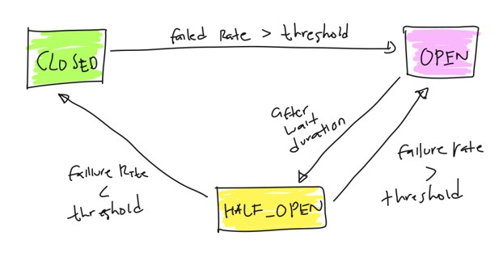

# Java Resilience4J

## Sebelum Belajar

- Java OOP
- Apache Maven
- Java Unit Test
- Java Thread

## Agenda

- Pengenalan Resilience 4J
- Circuit Breaker
- Bulkhead
- Rate Limiter
- Retry
- Time Limiter
- Fallback

## #1 Pengenalan Resilience4J

- Resilience4j adalah library yang sangat ringan dan mudah digunakan, yang terinspirasi dari library Netflix Hystrix, namun Resilience4J di desain untuk Java 8 dan pemrograman fungsional
- Ringan, karena library ini hanya membutuhkan satu library, yaitu Vavr (Javaslang), dan tidak membutuhkan library lainnya
- Resilience4J menyediakan high level feature untuk meningkatkan kemampuan functional interface, lambda expression dan method reference
  Resilience4J sangat modular
- <https://github.com/resilience4j/resilience4j>

### Resilience4j Patterns

- `Retry`, mengulangi eksekusi yang gagal
- `Circuit Breaker`, sementara menolak eksekusi yang memungkinkan gagal
- `Rate Limiter`, membatasi eksekusi dalam kurun waktu tertentu
- `Time Limiter`, membatasi durasi eksekusi
- `Bulkhead`, membatasi eksekusi yang terjadi secara berbarengan
- `Cache`, mengingat hasil eksekusi yang sukses
- `Fallback`, menyediakan alternatif hasil dari eksekusi yang gagal

### Manfaat Resilience4j

- Menjadikan aplikasi yang kita buat lebih tahan terhadap kejadian error yang diluar dugaan
- Memastikan aplikasi kita tidak akan membuat masalah untuk aplikasi lain ketika saling terintegrasi

## #2 Membuat Project

- <https://start.spring.io/>

### Menambah Dependency

```xml
<dependency>
	<groupId>io.github.resilience4j</groupId>
	<artifactId>resilience4j-all</artifactId>
	<version>1.7.1</version>
</dependency>
```

## #3 Retry

- Retry merupakan module di Resilience4J yang bisa kita gunakan untuk mencoba melakukan eksekusi kode secara berulang dalam jumlah yang sudah ditentukan
- Penggunaan Retry bisa mempermudah kita ketika misal akan mengeksekusi kode yang bisa memungkinkan gagal, dan kita ingin mengulanginya lagi, tanpa harus menggunakan perulangan secara manual
- Implementasi dari module ini adalah sebuah interface bernama Retry

### Kode : Membuat Retry

```java
@Test
void createNewRetry() {
	Retry retry = Retry.ofDefaults("pzn");
}
```

### Execute

- Konsep Resilience4J adalah membungkus functional interface atau lambda yang kita buat, yang secara otomatis akan menghasilkan object lainnya yang sudah dibungkus dengan module Resilience4J
- Ketika kita coba mengeksekusi object hasil nya tersebut, maka fitur Resilience4J secara otomoatis akan digunakan pada object tersebut

### Kode : Execute Runnable

```java
void callMe() {
	log.info("Try call me");
	throw new IllegalArgumentException("Ups error");
}

@Test
void createNewRetry() {
	Retry retry = Retry.ofDefaults("pzn");

	Runnable runnable = Retry.decorateRunnable(retry, () -> callMe());
}
```

### Kode : Execute Supplier

```java
@Test
void createSupplier() {
	Retry retry = Retry.ofDefaults("pzn");
	Supplier<String> supplier = Retry.decorateSupplier(retry () -> hello());
	String results = supplier.get();
}

private String hello() {
	log.info("call say hello");
	throw new IllegalArgumentException("Ups error say hello");
}
```

## #4 Retry Config

- Saat kita membuat Retry menggunakan `Retry.ofDefaults()`, secara otomatis kita akan menggunakan pengaturan default
- Kadang pada kasus tertentu, kita ingin menentukan pengaturan untuk Retry secara manual, misal menentukan jumlah retry nya misalnya
- Kita bisa membuat object RetryConfig sebelum membuat object Retry

### Pengaturan Retry

| Pengaturan       | Default  | Keterangan                             |
| ---------------- | -------- | -------------------------------------- |
| maxAttempts      | 3        | Seberapa banyak retry dilakukan        |
| waitDuration     | 500 (ms) | Waktu menunggu sebelum melakukan retry |
| ignoreExceptions | empty    | Jenis error yang tidak akan di retry   |

### Kode : Membuat Retry Config

```java
@Test
void retryConfig() {
	RetryConfig config = RetryConfig.custom()
		.maxAttempts(5)
		.waitDuration(Duration.ofSeconds(2))
		.retryExeption(IllegalArgumentException.class)
		.build();

	Retry retry = Retry.of("pzn", config);

	Supplier<String> supplier = Retry.decorateSupplier(retry, () -> hello());
	String result = supplier.get();
}
```

## #5 Retry Register

- Saat kita belajar Java Database, kita mengenal yang namanya Database Pooling, yaitu tempat untuk menyimpan semua koneksi database
- Resilience4J juga mengenal konsep ini, namun namanya adalah Registry
- Registry adalah tempat untuk menyimpan object-object dari Resilience4J
- Dengan menggunakan Registry, secara otomatis kita bisa menggunakan ulang object yang sudah kita buat, tanpa harus membuat ulang object baru
- Penggunaan Registry adalah salah satu best practice yang direkomendasikan ketika menggunakan Resilience4J

### Kode : Membuat Retry dan Registry

```java
@Test
void retryRegister() {
	RetryRegistry register = RetryRegistry.ofDefaults();

	Retry retry1 = registry.retry("name");
	Retry retry2 = registry.retry("name");

	Assertions.assertSame(retry1, retry2);

	retry1.executeRunnable(() -> callMe());
}
```

### Config di Registry

- Salah satu hal yang menarik di Retry Registry, kita bisa menambahkan default config atau menambahkan config yang sama dengan nama Retry nya
- Jika saat membuat Retry kita tidak menyebutkan nama config nya, secara otomatis akan menggunakan default config

### Kode : Config di Retry Registry

```java
@Test
void retryRegistryWithConfig() {
	RetryConfig config = RetryConfig.custom()
		.maxAttempts(5)
		.waitDuration(Duration.ofSeconds(2))
		.build();

	RetryRegistry registry = RetryRegistry.ofDefaults();
	registry.addConfiguration("config", config);

	Retry retry1 = registry.retry("pzn", "config");
	retry1.executeRunnable(() -> callMe());
}
```

## #6 Rate Limiter

- Rate Limiter merupakan module di Resilience4J yang bisa digunakan untuk membatasi jumlah eksekusi pada waktu tertentu
- Rate Limiter sering sekali digunakan ketika misal kita tidak ingin terlalu banyak request yang diterima untuk menjalankan sebuah kode program, dengan demikian kita bisa memastikan program kita tidak terbebani terlalu berat
- Jika request sudah melebihi batas waktu yang sudah ditentukan, secara otomatis Rate Limiter akan menjadikan request tersebut error dengan exception RequestNotPermitted

### Kode : Rate Limiter

```java
private final AtomicLong customer = new AtomicLong(0L);

@Test
void testTimeLimiter() {
	RateLimiter limiter = RateLimiter.ofDefaults("pzn");

	for (int i = 0; i < 10_000; i++) {
		Runnable runnable = RateLimiter.decorateRunnable(limiter, () -> {
			long result = counter.incrementAndGet();
			long.info("Result: {}". result);
		});
		runnable.run();
	}
}
```

### Kenapa Tidak Error?

- Karena default nya pengaturan yang diperbolehkan di RateLimiter adalah 50 per 500ns (nano second)
- Kita akan bahas pengaturan Rate Limiter di materi selanjutnya

## #7 Rate Limiter Config

- Rate Limiter memiliki config yang bisa kita atur sesuai dengan kebutuhan kita
- Kita bisa membuat config menggunakan `RateLimiterConfig`

### Pengaturan Rate Limiter

| Pengaturan           | Default Value | Keterangan                                                                |
| -------------------- | ------------- | ------------------------------------------------------------------------- |
| `limitForPeriod`     | 50            | Jumlah yang diperbolehkan dalam periode refresh                           |
| `limitRefreshPeriod` | 500 [ns]      | Durati refresh, setelah mencapai waktu refresh, limit akan kembali ke nol |
| `timeoutDuration`    | 5 [s]         | Waktu maksimal menunggu rate limiter                                      |

### Kode : Rate Limiter Config

```java
@Test
void testTimeLimiterConfig() {
	RateLimiterConfig config = RateLimiterConfig.custom()
		.limitRefreshPeriod(Duration.ofMinutes(1))
		.limitForPeriod(100)
		.build();

	RateLimiter limiter = RateLimiter.of("pzn", config);

	for (int i = 0; i < 10_000; i++) {
		Runnable runnable = RateLimiter.decorateRunnable(limiter, () -> {
			long result = counter.incrementAndGet();
			log.info("Result: {}", result);
		});
		runnable.run();
	}
}
```

## #8 Rate Limiter Registry

- Sama seperti Retry, Rate Limiter pun memiliki Registry untuk melakukan management object Rate Limiter
- Dan sebaiknya saat membuat aplikasi, kita menggunakan Registry untuk melakukan manajemen object Rate Limiter nya

### Kode : Rate Limiter Registry

```java
@Test
void testTimeLimiterRegistry() {
	RateLimiterConfig config = RateLimiterConfig.custom()
		.limitRefreshPeriod(Duration.ofMinutes(1))
		.limitForPeriod(100)
		.build();

	RateLimiterRegistry registry = RateLimiterRegistry.ofDefaults();
	registry.addConfiguration("config", config);

	RateLimiter limiter = registry.rateLimiter("pzn", "config");
}
```

## #9 Bulkhead

- Resilience4J memiliki module untuk menjaga jumlah eksekusi concurrent menggunakan Bulkhead
- Terdapat dua implementasi Bulkhead di Resilience4J :
  - Semaphore
  - Fix Threadpool
- Jika Bulkhead sudah penuh, secara otomatis Bulkhead akan mengembalikan error BulkheadFullException ketika kita meminta eksekusi

### Kode : Semaphore Bulkhead

```java
@SneakyThrows
public void slow() {
	log.info("Slow");
	Thread.sleep(5000L);
}

@Test
void testSemaphore() {
	Bulkhead bulkhead = Bulkhead.ofDefaults("pzn");
	for (int i = 0; i < 1000; i++) {
		Runnable runnable = Bulkhead.decorateRunnable(bulkhead, () -> slow());
		new Thread(runnable).start();
	}
}
```

### Kode : Threadpool Bulkhead

```java
@Test
void testThreadPool() {
	ThreadPoolBulkhead bulkhead = ThreadPoolBulkhead.ofDefaults("pzn");
	for (int i = 0; i < 1000; i++) {
		Supplier<CompletionStage<Void>> runnable = ThreadPoolBulkhead.decorateRunnable(bulkhead, () -> slow());
		runnable.get();
	}
}
```

## #10 Bulkhead Config

- Sama seperti module lainnya, kita juga bisa melakukan pengaturan untuk Bulkhead
- Namun pengaturannya disesuaikan dengan implementasi Bulkhead yang kita gunakan, baik itu Semaphore atau Fix Threadpool

### Pengaturan Semaphore Bulkhead

| Pengaturan           | Default Value | Keterangan                                   |
| -------------------- | ------------- | -------------------------------------------- |
| `maxConcurrentCalls` | 25            | Maksimal eksekusi paralel yang diperbolehkan |
| `maxWaitDuration`    | 0             | Maksimal durasi eksekusi menunggu bulkhead   |

### Kode : Semaphore Bulkhead Config

```java
@Test
void testSemaphoreConfig() throws InterruptedException {
	BulkheadConfig config = BulkheadConfig.custom();
		.maxConcurrentCalls(5)
		.maxWaitDuration(Duration.ofSeconds(5))
		.build();
	Bulkhead Bulkhead = Bulkhead.of("pzn", config);
	for (int i = 0; i < 1000; i++) {
		Runnable runnable = Bulkhead.decorateRunnable(Bulkhead, () -> slow());
		new Thread(runnable).start();
	}

	Threadpool.sleep(10_000L);
}
```

### Pengaturan Fix Threadpool Bulkhead

| Pengaturan           | Default Value                                   | Keterangan                                |
| -------------------- | ----------------------------------------------- | ----------------------------------------- |
| `maxThreadPoolSize`  | `Runtime.getRuntime().availableProcessors()`    | Maksimal thread yang terdapat di pool     |
| `coreThreadPoolSize` | `Runtime.getRuntime().availableProcessors() -1` | Minimal thread awal yang terdapat di pool |
| `queueCapacity`      | 100                                             | Kapasitas antrinan                        |
| `keepAliveDuration`  | 20 [ms]                                         | Lama thread hidup jika tidak bekerja      |

### Kode : Fix Threadpool Bulkhead

```java
@Test
void testThreadPoolConfig() {
	ThreadPoolBulkheadConfig config = ThreadPoolBulkheadConfig.custom()
		.maxThreadPoolSize(5)
		.coreThreadPoolSize(5)
		.queueCapacity(1)
		.build();

	ThreadPoolBulkhead  bulkhed = ThreadPoolBulkhead.of("pzn", config);
	for (int i = 0; i < 1000; i++) {
		Supplier<CompletionStage<Void>> runnable = ThreadPoolBulkhead.decorateRunnable(bulkhed, () -> slow());
		runnable.get();
	}
}
```

## #11 Bulkhead Registry

- Sama dengan module lainnya, Bulkhead juga memiliki registry
- Baik itu Semaphore Bulkhead, atau Fix Threadpool Bulkhead

### Kode : Semaphore Bulkhead Registry

```java
@Test
void testSemaphoreRegistry() throws InterruptedException {
	BulkheadConfig config = BulkheadConfig.custom()
		.maxConcurrentCalls(5)
		.maxWaitDuration(Duration.ofSeconds(5))
		.build();
	BulkheadRegistry registry = BulkheadRegistry.ofDefaults();
	registry.addConfiguration("config", config);
	Bulkhead Bulkhead = registry.bulkhead("pzn", "config");
	for (int i = 0; i < 1000; i++) {
		Runnable runnable = Bulkhead.decorateRunnable(Bulkhead, () -> slow());
		new Thread(runnable).start();
	}
}
```

### Kode : Fix Threadpool Bulkhead

```java
@Test
void testThreadPoolRegistry() {
	ThreadPoolBulkheadConfig config= ThreadPoolBulkheadConfig.custom()
		.maxThreadPoolSize(5)
		.coreThreadPoolSize(5)
		.queueCapacity(1)
		.build();
	ThreadPoolBulkheadRegistry registry = ThreadPoolBulkheadRegistry.ofDefaults();
	registry.addConfiguration("config", config);
	ThreadPoolBulkhead bulkhead = registry.bulkhead("pzn", "config");
	for (int i = 0; i < 1000; i++) {
		Supplier<CompletionStage<Void>> runnable = ThreadPoolBulkhead.decorateRunnable(bulkhead, () -> slow());
		runnable.get();
	}
}
```

## #12 Time Limiter

- Time Limiter merupakan module di Resilience4J yang digunakan untuk membatasi durasi dari sebuah eksekusi kode program
- Dengan Time Limiter, kita bisa menentukan berapa maksimal durasi eksekusi sebuah kode program, jika melebihi yang sudah ditentukan, secara otomatis eksekusi tersebut akan dibatalkan dan akan terjadi error
- Time Limiter membutuhkan eksekusi dalam bentuk Future atau Completable Future

### Kode : Time Limiter

```java
@Test
void testTimeLimiter() throws Exception {
	ExecutorService executorService = Executors.newSingleThreadExecutor();
	Future<Long> future = executorService.submit(() -> slow());

	TimeLimiter limiter = TimeLimiter.ofDefaults("pzn");
	Callable<Long> callable = TimeLimiter.decorateFutureSupplier(limiter, () -> future);

	callable.call();
}
```

### Kode : Slow Function

```java
@SneakyThrows
public Long slow() {
	log.info("Start Slow");
	Thread.sleep(10_000L);
	log.info("End Slow");
	return 10_000L;
}
```

## #13 Time Limiter Config

- Secara default, Time Limiter akan menunggu sekitar 1 detik sampai dianggap timeout
- Namun kita juga bisa mengubah pengaturan nya, dengan menggunakan Time Limiter Config

### Pengaturan Time Limiter

| Pengaturan            | Default Value | Keterangan                                              |
| --------------------- | ------------- | ------------------------------------------------------- |
| `timeoutDuration`     | 1s            | Durasi eksekusi proses ditunggu sampai dianggap timeout |
| `cancelRunningFuture` | true          | Apakah future dibatalkan jika terjadi timeout           |

### Kode : Time Limiter Config

```java
@Test
void testTimeLimiterConfig() throws Exception {
	ExecutorService executorService = Executors.newSingleThreadExecutor();
	Future<Long> future = executorService.submit(() -> slow());

	TimeLimiterConfig confid = TimeLimiterConfig.custom()
		.timeoutDuration(Duration.ofSeconds(20))
		.cancelRunningFuture(true)
		.build();

	TimeLimiter limiter = TimeLimiter.of("pzn", config);
	Callable<Long> callable = TimeLimiter.decorateFutureSupplier(limiter, () -> future);

	callable.call();
}
```

## #14 Time Limiter Registry

- Sama dengan module lainnya, Time Limiter juga memiliki Registry untuk menyimpan object Time Limiter

### Kode : Time Limiter Registry

```java
@Test
void testTimeLimiterRegistry() throws Exception {
	ExecutorService executorService = Executors.newSingleThreadExecutor();
	Future<Long> future = executorService.submit(() -> slow());

	TimeLimiterConfig confid = TimeLimiterConfig.custom()
		.timeoutDuration(Duration.ofSeconds(20))
		.cancelRunningFuture(true)
		.build();

	TimeLimiterRegistry registry = TimeLimiterRegistry.ofDefaults();
	refresh.addConfiguration("config", config)

	TimeLimiter limiter = registry.timeLimiter("pzn", "config");
	Callable<Long> callable = TimeLimiter.decorateFutureSupplier(limiter, () -> future);

	callable.call();
}
```

## #15 Circuit Breaker

- Circuit Breaker adalah implementasi dari finite state machine, dengan tiga normal state: CLOSED, OPEN dan HALF_OPEN, dan dua spesial state DISABLED dan FORCED_OPEN.
- Kita bisa memilih menggunakan Circuit Breaker berbasis hitungan atau waktu
- Basis hitungan berarti menghitung data berdasarkan jumlah `N` eksekusi terakhir
- Basis waktu berarti menghitung data berdasarkan jumlah eksekusi dalam N detik terakhir

### Diagram : Circuit Breaker



### Kode : Circuit Breaker

```java
@Test
void circuitBreaker() {
	CircuitBreaker circuitBreaker = CircuitBreaker.ofDefaults("pzn");

	for (int i = 0; i < 200; i++) {
		Runnable runnable = CircuitBreaker.decorateRunnable(circuitBreaker, () -> callMe());
		runnable.run();
	} catch (Exception e) {
		log.error("Ups {}", e.getMessage());
	}
}
```

## #16 Circuit Breaker Config

- Secara default, Circuit Breaker akan mencoba menghitung jumlah error rate setelah 100 kali eksekusi
- Dan jika terjadi error diatas 50%, maka Circuit Breaker akan menjadi state OPEN, dan otomatis semua request akan ditolak dengan error CallNotPermittedException

### Circuit Breaker Config Mode

- Saat kita membuat Circuit Breaker, kita bisa mengubah mode pengaturan berbasis hitungan atau waktu, defaultnya adalah menggunakan hitungan dengan jumlah minimal 100
- Kita juga bisa mengubahnya menjadi mode waktu, sehingga error rate dihitung berdasarkan durasi waktu
- Ada banyak sekali pengaturan yang bisa kita ubah pada Circuit Breaker

### Pengaturan Circuit Breaker

| Config                                  | Default Value | Description                                                                                                          |
| --------------------------------------- | ------------- | -------------------------------------------------------------------------------------------------------------------- |
| `failuteRateThreshold`                  | 50            | Minimal persentase error rate agar state menjadi OPEN                                                                |
| `slidingWindowType`                     | COUNT_BASED   | Tipe mode sliding window, count (hitung) atau time (durasi)                                                          |
| `slidingWindowSize`                     | 100           | Jumlah sliding window yang di record pada waktu state CLOSED                                                         |
| `minimumNumberOfCalls`                  | 100           | Jumlah minimal eksekusi sebelum error rate dihitung                                                                  |
| `waitDuratinOpenState`                  | 60000 [ms]    | Waktu menunggu agar OPEN menjadi HALF_OPEN                                                                           |
| `primittedNumberOfCallsInHalfOpenState` | 10            | Jumlah eksekusi yang diperbolehkan ketika Circut Breaker pada state HALF_OPEN                                        |
| `maxWaitDurationHalfOpenState`          | 0 ms          | Jumlah maksimal menunggu di HALF_OPEN untuk kembali ke OPEN artinya menunggu tidak terbatas                          |
| `slowCallDurationThreshold`             | 600000 [ms]   | Pengaturan sebuah eksekusi dianggap lambat                                                                           |
| `slowCallRateThreshold`                 | 100           | Konfigurasi threshold untuk eksekusi slow, jika menyentuh threshold, secara otomatis state akan beribah menjadi OPEN |
| `ignoreExceptions`                      | empty         | Exceptions yang tidak akan dianggap error                                                                            |

### Kode : Circuit Breaker Config

```java
@Test
void circuitBreakerConfig() {
	CircuitBreakerConfig config = CircuitBreakerConfig.custom()
		.slidingWindowType(CircuitBreakerConfig.SlidingWindowType.COUNT_BASED);
		.failuteRateThreshold(10f)
		.slidingWindowSize(10)
		.minimumNumberOfCalls(10)
		.build();
	CircuitBreaker circuitBreaker = CircuitBreaker.of("pzn", config);

	for (int i = 0; i < 100; i++) {
		try {
			Runnable runnable = CircuitBreaker.decorateRunnable(circuitBreaker, () -> callMe());
			runnable.run();
		} catch (Exception e) {
			log.error("Ups {}", e.getMessage());
		}
	}
}
```

## #17 Circuit Breaker Registry

- Sama seperti module lainnya, Circuit Breaker juga memiliki Registry untuk melakukan management object Circuit Breaker nya

### Kode : Circuit Breaker Registry

```java
@Test
void circuitBreakerRegistry() {
	CircuitBreakerConfig config = CircuitBreakerConfig.custom()
		.slidingWindowType(CircuitBreakerConfig.SlidingWindowType.COUNT_BASED)
		.failuteRateThreshold(10f)
		.slidingWindowSize(10)
		.minimumNumberOfCalls(10)
		.buils();
	circuitBreakerRegistry registry = circuitBreakerRegistry.ofDefaults();
	registry.addConfiguration("config", config);
	circuitBreaker circuitBreaker = registry.circuitBreaker("pzn", "config");

	for (int i = 0; i < 100; i++) {
		try {
			Runnable runnable = circuitBreaker.decorateRunnable(circuitBreaker, () -> callMe());
			runnable.run();
		} catch (Exception e) {
			log.error("Ups {}", e.getMessage());
		}
	}
}
```

## #18 Decorators

- Pada kasus tertentu, kadang kita ingin menggabungkan beberapa module di Resilience4J secara sekaligus
- Misal kita ingin menggabungkan Circuit Breaker dan Retry
- Resilience4J menyediakan module tambahan bernama Decorators, dimana kita bisa menggabungkan beberapa module secara bersamaan
- Namun sampai saat ini, Decorators belum bisa untuk menggabungkan module Time Limiter

### Kode : Decorators

```java
@Test
void decorators() throws InterruptedException {
	RateLimiter rateLimiter = RateLimiter.of("pzn-ratelimiter", RateLimiterConfig.custom()
		.limitForPeriod(5)
		.limitRefreshPeriod(Duration.ofMinutes(1))
		.build());
	Retry retry = Retry.of("pzn-retry", RetryConfig.custom()
		.maxAttempts(10)
		.waitDuration(Duration.ofMillis(10))
		.build());

	Runnable runnable = Decorators.ofRunnable(() -> callMe())
		.waitRetry(retry)
		.waitRateLimiter(rateLimiter)
		.decorate();

	for (int i = 0; i < 100; i++) {
		new Thread(runnable).start();
	}

	Thread.sleep(10000);
}
```

## #19 Fallback

- Untuk kasus dimana functional interface nya bisa mengembalikan value, maka kita bisa menambah fallback di dalam Decorators
- Artinya, jika ternyata terjadi error ketika melakukan eksekusi, maka secara otomatis function fallback akan dipanggil

### Kode : Fallback

```java
Supplier<String> supplier = Decorators.ofSupplier(() -> sayHello())
	.waitRetry(retry)
	.waitRateLimiter(rateLimiter)
	.waitFallback(throwable -> "Hello Guest")
	.decorate();

System.out.println(supplier.get());
```

## #20 Metric

- Hampir semua module di Resilience4J memiliki fitur Metric, dimana kita bisa melihat data metric dari object yang sedang kita gunakan
- Contohnya di Retry, kita bisa mendapatkan Metric data seberapa banyak eksekusi yang sukses dan gagal misalnya

### Kode : Metric

```java
try {
	Supplier<String> supplier = Retry.decorateSupplier(retry, () -> hello());
	String result = suppler.get();
} catch (Exception e) {
	System.out.println(retry.getMetrics().getNumberOfFailedCallsWithRetryAttempt());
	System.out.println(retry.getMetrics().getNumberOfSuccessfullCallsWithRetryAttempt());
}
```

## #21 Event Publisher

- Semua module di Resilience4J memiliki fitur yang namanya adalah Event Publisher
- Fitur ini digunakan untuk mengirim event kejadian ketika suatu kejadian terjadi
- Contoh, kita bisa mendapatkan event ketika misal di Retry terjadi kejadian Sukses, Error atau Retry
- Untuk mendapatkan Event Publisher object, kita bisa menggunakan `getEventPublisher()` di object seperti Retry, CircuitBreaker, RateLimiter, dan lain-lain

### Kode : Event Publisher

```java
Retry retry = Retry.of("pzn", config);
retry.getEventPublisher().onRetry(event -> log.info("try to retry"));

try {
	Supplier<String> supplier = Retry.decorateSupplier(retry, () -> hello());
	String result = supplier.get();
} catch (Exception e) {
	System.out.println(retry.getMetrics().getNumberOfFailedCallsWithRetryAttempt());
	System.out.println(retry.getMetrics().getNumberOfSuccessfullCallsWithRetryAttempt());
}
```

## #22 Event Publisher di Registry

- Semua Registry juga memiliki Event Publisher
- Yang membedakan adalah, Event Publisher di Registry hanya digunakan untuk kejadian seperti menambah object, menghapus atau mengubah object ke Registry

### Kode : Event Publisher di Registry

```java
@Test
void retryRegistry() {
	RetryRegistry registry = RetryRegistry.ofDefaults();
	registry.getEventPublisher().onEntryAdded(event -> log.info("new retry added"));

	Retry retry1 = registry.retry("name");
	Retry retry2 = registry.retry("name");
}
```

## #23 Integrasi Library Lain

- Resilience4J sangat flexible untuk diintegrasikan dengan library lain, hal ini menyebabkan Resilience4J sangat disukai oleh para programmer Java
- Kotlin : <https://resilience4j.readme.io/docs/getting-started-4>
- RxJava : <https://resilience4j.readme.io/docs/getting-started-2>
- Project Reactor : <https://resilience4j.readme.io/docs/getting-started-1>
- Spring Boot : <https://resilience4j.readme.io/docs/getting-started-3>
- Micrometer : <https://resilience4j.readme.io/docs/micrometer>

## #24 Materi Selanjutnya

- Java Persistence API
- Java Web
