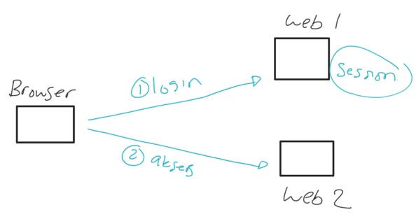
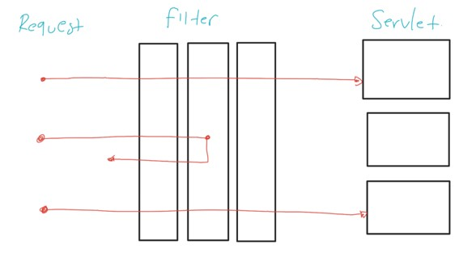

# Java Servlet

## Sebelum Belajar

- Java Dasar, Java OOP, Java Collection, Java Unit Test
- Apache Maven
- Java Input Output
- Belajar HTTP <https://www.youtube.com/watch?v=92Rjzrq4oIg>

## #1 Pengenalan Servlet

- Servlet adalah standarisasi di Java untuk membuat Web
- Mirip seperti JDBC sebagai standarisasi untuk komunikasi ke Database
- Servlet adalah merupakan spesifikasi untuk membuat Web, dan dengan menggunakan Servlet, kita bisa menjalankan aplikasi Java Web di Web Server apapun yang sudah mengikuti standarisasi Servlet
- <https://www.jcp.org/en/jsr/detail?id=340>

### Servlet API

- Servlet sendiri sangat low level, artinya saat kita menggunakan Servlet, semua harus kita lakukan secara manual
- Oleh karena itu, saat ini, tidak ada yang membuat aplikasi Java Web langsung menggunakan Servlet, kebanyakan menggunakan Web Framework
- Namun di kelas ini, sengaja dibahas tentang Servlet, agar kita tahu bagaimana cara kerja Web di Java

### Web Framework

- Saat ini, untuk membuat Web di Java, kebanyakan kita akan menggunakan Web Framework, misal seperti :
  - Spring Web MVC
  - Java Server Page
  - Java Server Faces
  - Dan lain-lain

### Java Web Server

- Karena Servlet hanyalah sebuah spesifikasi, maka harus ada implementasinya
- Mirip seperti JDBC yang harus ada implementasinya dalam bentuk Driver
- Implementasi Servlet adalah sebuah Web Server, dimana ada banyak sekali Web Server yang bisa kita gunakan seperti :
  - Apache Tomcat
  - Jetty
  - Glassfish
  - Wildfly
  - Dan lain-lain

## #2 Pengenalan Apache Tomcat

- Apache Tomcat adalah salah satu Web Server yang sangat populer digunakan untuk menjalankan Java Web
- Di kelas ini, kita akan menggunakan Apache Tomcat sebagai Web Server untuk menjalankan aplikasi Java Web yang kita buat menggunakan Servlet
- <https://tomcat.apache.org/>

### Kenapa Apache Tomcat

- Apache Tomcat adalah aplikasi Open Source dan Multi Platform, sehingga kita bisa jalankan secara gratis dan juga di sistem operasi apapun
- Selain itu, Apache Tomcat sangat ringan, sehingga tidak butuh resource Hardware yang besar untuk menjalankannya

### Menginstall Apache Tomcat

- Download Apache Tomcat
- <https://tomcat.apache.org/>

### Menjalankan dan menghentikan Apache Tomcat

- Untuk menjalankan Apache Tomcat, kita bisa jalankan file catalina di folder bin dengan parameter :
  - run untuk menjalankan di terminal saat ini
  - start untuk menjalankan di background
  - stop untuk menghentikan aplikasi
  - Setelah jalan, kita bisa lihat Apache Tomcat di : <http://localhost:8080>

## #3 Pengenalan War File

### War File

- Saat kita membuat aplikasi Java, kebanyakan kita akan membuat distribution file dalam bentuk jar (Java Archive) file
- Namun khusus aplikasi Java Web, kita akan membuat distribution file dalam bentuk war (Web Archive) file

### Perbedaan War dan Jar File

- Isi War dan Jar file sebenarnya sama, berisikan class-class Java yang sudah di compile menjadi binary code
- Salah satu yang membedakan adalah, di War file biasanya tidak terdapat main class, karena memang War file itu akan dijalankan di dalam Web Server

## #4 Membuat Project

- <https://start.spring.io/>
- Tambahkan dependency Web
- Hapus semua class hasil generated

## #5 Servlet

- Interface Servlet adalah interface utama dari Servlet API
- Servlet merupakan tempat dimana logika kode program kita tempatkan
- HTTP Request yang masuk ke Java Web akan diterima oleh Servlet, dan HTTP Response nya akan dibuat di Servlet
- <https://tomcat.apache.org/tomcat-10.0-doc/servletapi/jakarta/servlet/Servlet.html>

### HttpServlet

- Servlet adalah sebuah Interface, kita bisa membuat class turunan dari Servlet, namun biasanya kebanyakan programmer akan menggunakan class-class turunan Servlet, agar tidak perlu mengimplementasikan semua method di interface Servlet
- Salah satu class turunan Servlet yang biasa digunakan adalah HttpServlet
- <https://tomcat.apache.org/tomcat-10.0-doc/servletapi/jakarta/servlet/http/HttpServlet.html>

### WebServlet Annotation

- Saat kita membuat class Servlet, kita perlu meregistrasikan class tersebut ke Java Web agar bisa diakses, caranya kita bisa tambahkan annotation WebServlet pada class Servlet nya
- Kita bisa menentukan URL apa yang akan digunakan pada annotation WebServlet tersebut
- <https://tomcat.apache.org/tomcat-10.0-doc/servletapi/jakarta/servlet/annotation/WebServlet.html>

### Kode : Membuat Servlet

```java
@WebServlet(urlPatterns = "/hello")
public class HelloServlet extends HttpServlet {

	@Override
	protected void service(HttpServletRequest req, HttpServletResponse, resp) throws ServletException {
		resp.getWriter().println("Hello World");
	}
}
```

## #6 Membuat War File

- Seperti yang pernah kita bahas di kelas Apache Maven
- Untuk membuat distribution file, kita bisa gunakan perintah : mvn package
- Sama juga untuk membuat War File, kita bisa gunakan perintah yang sama
- Hasil War File dari project yang kita buat akan tersedia di folder target

## #7 Deploy ke Apache Tomcat

- Setelah membuat War File, untuk deploy aplikasi Java Web yang sudah kita buat, kita bisa pindahkan War File nya ke folder webapps di Apache Tomcat
- Secara otomatis Tomcat akan mendeteksi War File baru dan mengextract menjadi sebuah folder
- Kita bisa mengakses Web yang sudah kita deploy lewat url : <http://localhost:8080/nama-folder>

### Undeploy dari Apache Tomcat

- Jika kita mau menghapus Java Web yang sudah kita deploy dari Apache Tomcat, kita bisa dengan mudah menghapus folder yang terdapat di webapps dan juga War File nya

## #8 Embedded Apache Tomcat

### Kesulitan Saat Development

- Salah satu hal yang sulit ketika proses development Java Web adalah, kita harus membuat dulu War File, lalu mendeploy nya ke Apache Tomcat untuk mencobanya
- Jika terdapat perubahan, kita harus melakukan hal yang sama, dan ini bisa memakan waktu lama, apalagi jika perubahannya hanya sepele
- Oleh karena itu, untuk proses Development, kita bisa menggunakan fitur Embedded Tomcat yang terdapat di framework Spring Boot
- Tidak perlu khawatir jika tidak mengerti tentang Spring Boot, karena di kelas ini kita hanya meminjam fitur Embedded Tomcat nya saja

### Kode : Embedded Tomcat Spring Boot

```java
import org.springframework.boot.SpringApplication;
import org.springframework.boot.autoconfigure.SpringBootApplication;
import org.springframework.boot.web.servlet.ServletComponentScan;

@ServletComponentScan
@SpringBootApplication
public class BelajarServletApp {

	public static void main(String[] args) {
		SpringApplication.run(BelajarServletApp.class);
	}
}

```

## #9 Singleton

- Saat Java Web dijalankan, Servlet hanya akan dibuat satu kali, alias singleton
- Oleh karena itu, HTTP Request yang masuk akan selalu menggunakan Servlet yang sama
- Hal ini perlu diperhatikan, karena jika kode yang kita buat tidak Thread Safe, maka data antar HTTP Request bisa tertukar
- Oleh karena itu, pastikan kode yang kita buat harus Thread Safe

### Kode : Servlet Unsafe Thread

```java
@WebServlet(urlPatterns = "/unsafe")
public class UnsafeServlet extends HttpServlet {

	private String response = "";

	@Override
	protected void service(HttpServletRequest req, HttpServletResponse, resp) throws ServletException, IOException {
		response = "Hello " + req.getParameter("response");

		try {
			Thread.sleep(Long.parseLong(req.getParameter("sleep")));
		} catch (InterruptedException e) {
			throw new RuntimeException(e);
		}

		resp.getWriter().println(response);
	}
}
```

### Kode : Servlet Safe Thread

```java
@WebServlet(urlPatterns = "/unsafe")
public class SafeServlet extends HttpServlet {

	@Override
	protected void service(HttpServletRequest req, HttpServletResponse, resp) throws ServletException, IOException {
		String response = "Hello " + req.getParameter("response");

		try {
			Thread.sleep(Long.parseLong(req.getParameter("sleep")));
		} catch (InterruptedException e) {
			throw new RuntimeException(e);
		}

		resp.getWriter().println(response);
	}
}
```

### Kode : Servlet Counter

```java
@WebServlet(urlPatterns = "/counter")
public class CounterServlet extends HttpServlet {

	private final AtomicLong atomicLong = new AtomicLong(0);

	@Override
	protected void service(HttpServletRequest req, HttpServletResponse, resp) throws ServletException, IOException {
		long total = atomicLong.incrementAndGet();
		String response = "Total Counter : " + total;
		resp.getWriter().println(response);
	}
}
```

## #10 HTTP Method

- Secara default, Servlet akan menangani semua jenis HTTP Request dengan Method apapun, seperti GET, POST, PUT, DELETE, dan lain-lain
- Saat kita menggunakan HttpServlet, sebenarnya di dalam method service() sudah terdapat logic untuk memisahkan tiap HTTP Method
- Jika kita hanya ingin membuat logic untuk jenis HTTP Method tertentu, kita bisa langsung override method dengan prefix do dan diakhiri dengan nama HTTP Method nya, misal doGet(), doPost(), dan lain-lain
- <https://tomcat.apache.org/tomcat-10.0-doc/servletapi/jakarta/servlet/http/HttpServlet.html>

### Kode : Todolist Servlet Get

```java
@WebServlet(urlPatterns = "/todolist")
public class TodolistServlet extends HttpServlet {

	private List<String> todos = new ArrayList<>();

	@Override
	protected void doGet(HttpServletRequest req, HttpServletResponse, resp) throws ServletException, IOException {
		resp.getWriter().println(todos);
	}
}
```

### Kode : Todolist Servlet Post

```java
@WebServlet(urlPatterns = "/todolist")
public class TodolistServlet extends HttpServlet {

	private List<String> todos = new ArrayList<>();

	@Override
	protected void doPost(HttpServletRequest req, HttpServletResponse, resp) throws ServletException, IOException {
		String todo = req.getParameter("todo");
		if (todo != null) {
			todos.add(todo);
			resp.getWriter().println("Add Todo : " + todo);
		} else {
			resp.getWriter().println("Todo parameter must exists");
		}
	}
}
```

## #11 HTTP Request

- Semua HTTP Request yang masuk ke Servlet akan disimpan dalam object ServletRequest
- Namun saat kita menggunakan class HttpServlet, object tersebut akan dikonversi menjadi HttpServletRequest
- Ada banyak sekali informasi yang bisa kita dapatkan, dari mulai Header, Parameter, Body, Cookie dan lain-lain
- <https://tomcat.apache.org/tomcat-10.0-doc/servletapi/jakarta/servlet/http/HttpServletRequest.html>

### Kode : HTTP Request

```java
@WebServlet(urlPatterns = "/request")
public class RequestServlet extends HttpServlet {

	@Override
	protected void service(HttpServletRequest req, HttpServletResponse, resp) throws ServletException, IOException {
		resp.getWriter().println("Method : " + req.getMethod());
		resp.getWriter().println("Query String: " + req.getQueryString());
		resp.getWriter().println("Request URI : " + req.getRequestURI());
		resp.getWriter().println("Context Path : " + req.getContextPath());
		resp.getWriter().println("Servlet Path : " + req.getServletPath());
	}
}
```

## #12 HTTP Response

- Pada method service() di Servlet terdapat parameter kedua yaitu ServletResponse
- Atau di HttpServlet menggunakan class HttpServletResponse
- Ini adalah representasi dari HTTP Response
- Untuk mengirim response, kita bisa gunakan object HttpServletResponse tersebut

### Response Body

- Untuk mengirim response body pada HttpServletResponse, kita bisa menggunakan PrintWriter pada method getWriter()
- Method ini digunakan untuk menulis data apapun ke Response Body pada HTTP Response

### Kode : Response Body

```java
@WebServlet(urlPatterns = "/body")
public class BodyServlet extends HttpServlet {

	@Override
	protected void doGet(HttpServletRequest req, HttpServletResponse, resp) throws ServletException, IOException {
		String html = """
					<html>
					<body>
					<h1>Programmer Zaman Now</h1>
					</body>
					</html>
					""";
		resp.getWriter().println(html);
	}
}
```

### Response Header

- HttpServletResponse juga memiliki beberapa method yang bisa kita gunakan untuk mengubah Response Header
- setHeader(name, value) untuk mengubah header
- setIntHeader(name, int) untuk mengubah header dengan nilai int
- setDateHeader(name, long) untuk mengubah header dengan nilai date (milis)

### Kode : Response Header

```java
@WebServlet(urlPatterns = "/json")
public class JsonServlet extends HttpServlet {

	@Override
	protected void doGet(HttpServletRequest req, HttpServletResponse, resp) throws ServletException, IOException {
		String json = """
					{
						"name": "Eko",
						"value": 100
					}
					""";
		resp.setHeader("Content-Type", "application/json");
		resp.getWriter().println(json);
	}
}
```

### Response Status

- Kita juga bisa mengubah Http Response Status menggunakan HttpServletResponse
- Kita bisa menggunakan method setStatus(code) untuk mengubah status code dari Http Response

### Kode : Response Status

```java
@WebServlet(urlPatterns = "/not-found")
public class NotFoundServlet extends HttpServlet {

	@Override
	protected void doGet(HttpServletRequest req, HttpServletResponse, resp) throws ServletException, IOException {
		resp.setStatus(404);
		resp.getWriter().println("404 Not Found");
	}
}
```

## #13 Request Param

- Saat membuat Web, kadang kita mengirim data melalui Query Parameter
- Untuk mengambil data Query Parameter yang dikirim oleh user, kita bisa menggunakan HttpServletRequest
- getParameter(name) untuk mengambil parameter berdasarkan nama
- getParameterNames() untuk mengambil semua nama parameter yang ada
- getParameterMap() untuk mengambil semua nama parameter beserta value nya
- getParameterValues(name) untuk mengambil parameter yang value nya lebih dari satu

### Kode : Request Param

```java
@WebServlet(urlPatterns = "/query")
public class QueryServlet extends HttpServlet {

	@Override
	protected void doGet(HttpServletRequest req, HttpServletResponse, resp) throws ServletException, IOException {
		String[] numbers = req.getParameterValues("number");
		int sum = Stream.of(numbers).mapToInt(Integer::parseInt).sum()''
		resp.getWriter().println("Total numbers is " + sum);
	}
}
```

## #14 Request Header

- Request Header yang dikirim oleh user juga bisa kita ambil dari object HttpServletRequest
- getHeader(name) untuk mendapat value header berdasarkan nama
- getHeaderValues(name) untuk mendapat value header yang lebih dari satu
- getHeaderNames() untuk mendapat semua nama header
- getDateHeader(name) untuk mendapat value header yang bernilai date (milis)
- getIntHeader(name) untuk mendapat value header yang bernilai int
- Perlu diingat, bahwa header name itu tidak case sensitive, jadi Content-Type dan content-type adalah nama yang sama

### Kode : Request Param

```java
@WebServlet(urlPatterns = "/header")
public class HeaderServlet extends HttpServlet {

	@Override
	protected void doGet(HttpServletRequest req, HttpServletResponse, resp) throws ServletException, IOException {
		String name;

		while ((name = names.nextElement()) != null) {
			resp.getWriter().println("Header " + name + " with value " + req.getHeader(name));
		}

	}
}
```

## #15 Form Request

- Jika user mengirim POST Form Request, kita juga bisa menggunakan method getParameter seperti pada Query Parameter untuk mendapatkan informasi data yang dikirim pada Form Request tersebut
- Artinya getParameter itu secara otomatis akan mengambil data baik itu dari Form Post ataupun Query Param

### Kode : File /html/form.html

```html
<?doctype html>
<html>
  <head>
    <title>Form</title>
  </head>
  <body>
    <form action="/form" method="post">
      First Name : <input type="text" name="firstName" /> <br />
      Last Name : <input type="text" name="lastName" /> <br />
      <input type="submit" value="Say Hello" />
    </form>
  </body>
</html>
```

### Kode : Form Servlet

```java
@WebServlet(urlPatterns = "/form")
public class FormServlet extends HttpServlet {

	@Override
	protected void doGet(HttpServletRequest req, HttpServletResponse, resp) throws ServletException, IOException {
		Path path = Path.of(FormServlet.class.getResource("/html/form.html").getPath());
		String html = Files.readString(path);
		resp.getWriter().println(html);
	}

	@Override
	protected void doPost(HttpServletRequest req, HttpServletResponse, resp) throws ServletException, IOException {
		String name = req.getParameter("firstName") + " " + req.getParameter("lastName");
		String hello = "Hello " + name;
		resp.getWriter().println(hello);
	}
}
```

## #16 Request Body

- Saat membuat Web, kadang kita tidak hanya membuat jenis Website biasa
- Kadang kita membuat RESTful API yang akhirnya mengharuskan kita membaca data request dari user dalam bentuk format selain Form Post, misal JSON atau XML
- Untuk membaca isi dari Request Body, kita bisa menggunakan method di HttpServletRequest
- getInputStream() untuk mendapatkan Body dalam bentuk Input Stream
- getBufferedReader() untuk mendapatka Body dalam bentuk Buffered Reader

### Kode : Json Util

```java
public class JsonUtil {

	private static final ObjectMapper OBJECT_MAPPER = new ObjectMapper();

	private static ObjectMapper getObjectMapper() {
		return OBJECT_MAPPER;
	}
}
```

### Kode : Say Hello Request

```java
public class SayHelloRequest {

	private String firstName;

	private String lastName;

	public String getFirstName() {
		return firstName;
	}

	public String getLastName() {
		return lastName;
	}

	public void setFirstName(String firstName) {
		this.firstName = firstName;
	}

	public void setLastName(String lastName) {
		this.lastName = lastName;
	}
}
```

### Kode : API Servlet

```java
@WebServlet(urlPatterns = "/api/say-hello")
public class ApiServlet extends HttpServlet {

	@Override
	protected void doPost(HttpServletRequest req, HttpServletResponse, resp) throws ServletException, IOException {
		SayHelloRequest sayHelloRequest = JsonUtil.getObjectMapper().readValue(req.getReader(), SayHelloRequest.class);
		String sayHello = "Hello " + sayHelloRequest.getFirstName() + " " +sayHelloRequest.getLastName();

		Map<String, String> response = Map.of("data", sayHello);
		String jsonResponse = JsonUtil.getObjectMapper().writeValueAsString(response);
		resp.setHeader("Content-Type", "application/json");
		resp.getWriter().println(jsonResponse);
	}
}
```

## #17 Upload File

- Salah satu hal yang biasa dilakukan saat membuat Web adalah, upload file
- Servlet juga mendukung penanganan Upload File menggunakan HttpServletRequest
- getPart(name) digunakan untuk mendapatkan file upload berdasarkan nama
- getParts() digunakan untuk mendapatkan semua file upload
- File upload direpresentasikan dalam interface Part
- <https://tomcat.apache.org/tomcat-10.0-doc/servletapi/jakarta/servlet/http/Part.html>
- Saat kita membuat Servlet yang akan menerima upload file, kita harus tambahkan annotation @MultipartConfig sebagai penanda bahwa Servlet itu bisa menerima upload file
- <https://tomcat.apache.org/tomcat-10.0-doc/servletapi/jakarta/servlet/annotation/MultipartConfig.html>

### Kode : Html Form Upload

```html
<?doctype html>
<html>
  <head>
    <title>Form</title>
  </head>
  <body>
    <form action="/form-upload" method="post" enctype="multipart/form-data">
      Name : <input type="text" name="name" /> <br />
      Profile : <input type="file" name="profile" /> <br />
      <input type="submit" value="Upload Image" />
    </form>
  </body>
</html>
```

### Kode : Upload File Servlet Get

```java
@WebServlet(urlPatterns = "/form-upload")
@MultipartConfig
public class FormUploadServlet extends HttpServlet {

	@Override
	protected void doGet(HttpServletRequest req, HttpServletResponse, resp) throws ServletException, IOException {
		Path path = Path.of(FormServlet.class.getResource("/html/form-upload.html").getPath());
		String html = Files.readString(path);
		resp.getWriter().println(html);
	}

	@Override
	protected void doPost(HttpServletRequest req, HttpServletResponse, resp) throws ServletException, IOException {
		String name = req.getParameter("name");
		Part profile = req.getPart("profile");

		Path uploadLocation = Path.of("upload/" + UUID.randomUUID() + profile.getSubmittedFileName());
		Files.copy(profile.getInputStream(), uploadLocation);

		resp.getWriter().println("Hello " + name + ", your profile saved in " + uploadLocation.toAbsolutePath());
	}
}
```

## #18 Download File

- Sebelumnya kita selalu menggunakan Writer pada ServletResponse
- Writer digunakan untuk mengirim response body dalam bentuk Text, bagaimana jika datanya dalam bentuk binary? Seperti gambar, video dan lain-lain
- Kita bisa menggunakan method getOutputStream() untuk melakukan itu

### Kode : Download File

```java
@WebServlet(urlPatterns = "/download")
@MultipartConfig
public class DownloadServlet extends HttpServlet {

	@Override
	protected void doGet(HttpServletRequest req, HttpServletResponse, resp) throws ServletException, IOException {
		String file = req.getParameter("file");
		Path path = Path.of("upload/" + file);
		byte[] bytes = Files.readAllBytes(path);

		String force = req.getParameter("force");

		if ("true".equals(force)) {
			resp.setHeader("Content-Disposition", "attachment; filename=\"" + path.getFileName() + "\"");
		}

		resp.getOutputStream().write(bytes);
	}
}
```

### Kode : Update Form Upload Post

```java
String html = """
			<?doctype html>
			<html>
				<head>
					<title>Form</title>
				</head>
				<body>
					Name : $name
					<br/>
					Profile : 
				</body>
			</html>


			"""
			.replace("$name", name)
			.replace("$profile", uploadLocation.getFileName().toString());

resp.getWriter().println(html);
```

## #19 Cookie

- Cookie adalah informasi yang dibuat di Server dan disimpan di Client (Browser)
- Cookie akan selalu dikirim ulang oleh Browser setiap melakukan request selanjutnya
- Detail Cookie sudah dibahas di kelas HTTP
- Untuk membuat Cookie, kita bisa menggunakan HttpServletResponse.addCookie(cookie)
- Dan untuk membaca Cookie yang dikirim oleh Browser, kita bisa menggunakan HttpServletRequest.getCookies()
- <https://tomcat.apache.org/tomcat-10.0-doc/servletapi/jakarta/servlet/http/Cookie.html>

### Kode : Add Cookie

```java
@WebServlet(urlPatterns = "/cookie")
public class CookieServlet extends HttpServlet {

	@Override
	protected void doPost(HttpServletRequest req, HttpServletResponse, resp) throws ServletException, IOException {
		String cookieName = req.getParameter("name");
		String cookieValue = req.getParameter("value");

		Cookie cookie = new Cookie(cookieName, cookieValue);
		cookie.setPath("/");

		resp.addCookie(cookie);
		resp.getWriter().println("Success add cookie " + cookieName + ":" + cookieValue);
	}
}
```

### Kode : Get Cookie

```java
@Override
	protected void doGet(HttpServletRequest req, HttpServletResponse, resp) throws ServletException, IOException {
		if (req.getCookies() != null) {
			for (Cookie cookie : req.getCookies()) {
				resp.getWriter().println("Cookie " + cookie.getName() + ":" + cookie.getValue());
			}
		}
	}
```

### Bagaimana Menghapus Cookie?

- Tidak ada cara untuk menghapus Cookie
- Namun kita bisa memaksa agar Cookie secara otomatis expire, dengan cara mengubah waktu expire menjadi negative menggunakan Cookie.setMaxAge(-1)

## #20 Redirect

- Untuk melakukan redirect, sebenarnya kita sudah bahas di kelas HTTP, kita cukup menggunakan status code 3xx dan menambahkan header Location yang menuju lokasi baru
- Namun di Servlet, terdapat method yang bisa digunakan untuk mempermudah yaitu HttpServletResponse.sendRedirect(page)

### Kode : Redirect

```java
@WebServlet(urlPatterns = "/redirect")
public class RedirectServlet extends HttpServlet {

	@Override
	protected void doGet(HttpServletRequest req, HttpServletResponse resp) throws ServletException, IOException {
		resp.sendRedirect("/form");
	}
}
```

## #21 URL Patterns

- Saat membuat Servlet URL, sebenarnya kita bisa menggunakan patterns atau pola
- Namun patterns yang didukung oleh Servlet sangatlah sederhana, hanya bisa menggunakan patterns \* (star)

### Contoh Patterns

| URL Patterns  | Contoh URL                        |
| ------------- | --------------------------------- |
| `/products/*` | /products                         |
|               | /products/create                  |
|               | /products/1234                    |
|               | /products/eko                     |
|               | /products/1/categories/2          |
| `/api/*.json` | /api/products.json                |
|               | /api/products/hello.json          |
|               | /api/category/1.json              |
|               | /api/products/1/categories/2.json |

### Kode : Patterns Servlet

```java
@WebServlet(urlPatterns = "/patterns/*")
public class PatternsServlet extends HttpServlet {

	@Override
	protected void doGet(HttpServletRequest req, HttpServletResponse resp) throws ServletException, IOException {
		resp.getWriter().println(req.getRequestURI());
	}
}
```

## #22 Session

- Session adalah informasi yang disimpan di Server untuk digunakan kembali oleh Client
- Contoh misal ketika user melakukan login ke Web, kita menyimpan informasi user yang sudah login tersebut, agar request yang dilakukan selanjutnya bisa didapat lagi
- Data Session disimpan di memory Java Web, oleh karena itu kadang ketika kita membuat Java Web yang berjalan di beberapa Server, hal ini agak menyulitkan untuk melakukan management Session nya
- Oleh karena itu, sebenarnya membuat Session sangat direkomendasikan menggunakan Cookie atau disimpan di Database, jangan di Memory aplikasi Java Web

## Masalah dengan Session



### HttpSession

- Representasi dari Session di Servlet adalah class HttpSession
- <https://tomcat.apache.org/tomcat-10.0-doc/servletapi/jakarta/servlet/http/HttpSession.html>
- Untuk membuat Session, kita bisa menggunakan HttpServletRequest.getSession(isAutoCreate), jika parameter isAutoCreate true, maka session akan dibuat otomatis jika belum ada

### HttpSession Method

- HttpSession bisa digunakan untuk menyimpan banyak informasi, mirip seperti Map, dimana kita bisa menyimpan key-value menggunakan method HttpSession.setAttribute(key, value)
- Untuk mengambil data, kita bisa gunakan HttpSession.getAttribute(name)
- Untuk menghapus data, kita bisa gunakan HttpSession.removeAttribute(name)
- Untuk menghapus semua data, kita bisa gunakan HttpSession.invalidate()

### Kode : Login Session

```java
@WebServlet(urlPatterns = "/session/login")
public class LoginServlet extends HttpServlet {

	@Override
	protected void doGet(HttpServletRequest req, HttpServletResponse resp) throws ServletException, IOException {
		String username = req.getParameter("username");

		HttpSession session = req.getSession(true);
		session.setAttribute("username", username);


		resp.getWriter().println("Login success : " + username);
	}
}
```

### Kode : Get Session

```java
@WebServlet(urlPatterns = "/session/get")
public class SessionServlet extends HttpServlet {

	@Override
	protected void doGet(HttpServletRequest req, HttpServletResponse resp) throws ServletException, IOException {
		HttpSession session = req.getSession(true);
		String username = (String) ssession.getAttribute("username");

		if (username == null)  {
			resp.getWriter().println("You are not login");
		} else {
			resp.getWriter().println("Hello " + username);
		}
	}
}
```

### Kode : Logout Session

```java
@WebServlet(urlPatterns = "/session/logout")
public class LogoutServlet extends HttpServlet {

	@Override
	protected void doGet(HttpServletRequest req, HttpServletResponse resp) throws ServletException, IOException {
		HttpSession session = req.getSession(true);
		session.invalidate();

		resp.getWriter().println("Success logout");
	}
}
```

## #23 Filter

- Filter adalah fitur yang terdapat di Servlet yang digunakan sebagai component yang bisa kita tempatkan di depan sebelum object Servlet diakses
- Di bahasa pemrograman lain, biasanya dinamakan Middleware
- Kita bisa membuat Filter mirip seperti Servlet, dimana kita bisa registrasikan ke URL Patterns tertentu
- Nanti secara otomatis setiap kita mengakses URL nya, Filter akan dijalankan, dan kita bisa menentukan apakah Request akan dilanjutkan ke Servlet atau tidak
- Filter juga bisa berlapis, artinya kita bisa membuat lebih dari satu Filter untuk URL Patterns yang sama

### Diagram Filter



### HttpFilter

- Filter direpresentasikan oleh interface bernama Filter
- <https://tomcat.apache.org/tomcat-10.0-doc/servletapi/jakarta/servlet/Filter.html>
- Sama seperti Servlet, Filter juga punya implementasi class, dan yang biasa digunakan adalah HttpFilter
- <https://tomcat.apache.org/tomcat-10.0-doc/servletapi/jakarta/servlet/http/HttpFilter.html>
- Untuk membuat Filter, kita harus tambahkan annotation WebFilter pada class nya
- <https://tomcat.apache.org/tomcat-10.0-doc/servletapi/jakarta/servlet/annotation/WebFilter.html>

### Kode : Log Filter

```java
@WebFilter(urlPatterns = "/*")
public class LogFilter extends HttpFilter {

	private static final Logger LOGGER = LoggerFactory.getLogger(LogFilter.class);

	@Override
	protected void doFilter(HttpServletRequest request, HttpServletResponse response, FilterChain chain) throws ServletException, IOException {
		LOGGER.info("Receive request for URL " + request.getRequestURI());
		chain.doFilter(request, response);
	}
}
```

### Kode : Login Filter

```java
@WebFilter(urlPatterns = "/*")
public class LoginFilter extends HttpFilter {

	@Override
	protected void doFilter(HttpServletRequest request, HttpServletResponse response, FilterChain chain) throws ServletException, IOException {
		if (request.getRequestURI().equals("/session/login")) {
			chain.doFilter(request, response);
		} else {
			HttpSession session = request.getSession(true);
			String username = (String) session.getAttribute("username");

			if (username == null) {
				response.setStatus(401);
				response.getWriter().println("You need to login first");
			} else {
				chain.doFilter(request, response);
			}
		}
	}
}
```

## #24 Rekomendasi Web Framework

- Di kelas ini, kita tidak akan membahas tentang Web Framework
- Oleh karena itu, jika ingin belajar membuat Web atau RESTful API menggunakan Java, saya sarankan belajar Web Framework untuk mempermudah nya
- Salah satu Web Framework yang saya sarankan untuk dipelajari adalah Spring Web MVC
- Spring Framework adalah salah satu framework paling populer di Java, dan banyak perusahaan besar menggunakan Spring Framework, seperti Blibli.com, Netflix, dan lain-lain
- Untuk belajar Spring Framework, silahkan ikuti kelas Spring Framework yang ada di Programmer Zaman Now

## #25 Materi Selanjutnya

- Java Persistence API
- Belajar Library/Framework Java
