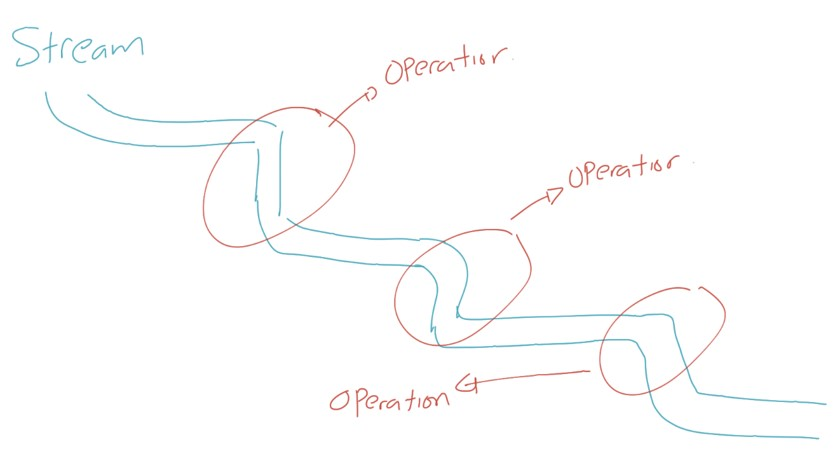

# Java Stream

## Sebelum Belajar

- Java Dasar
- Java Object Oriented Programming
- Java Standard Classes
- Java Generic
- Java Collection
- Java Lambda
- Java Apache Maven
- Java Unit Test

## Agenda

- Pengenalan Java Stream
- Membuat Stream
- Lazy Evaluation
- Stream builder
- Stream Operations
- Collectors
- Paralel Stream

## #1 Pengenalan Java Stream

- Java Stream diperkenalkan pertama kali di Java veri 8 atau 1.8
- Java Stream adalah implementasi dai java untuk aliran data
- Java Stream erat kaitanya dengan Java Collection dan Lambda Expression
- Semua fitur Java Stream terdapat di package `java.util.stream`
- <https://docs.oracle.com/en/java/javase/15/docs/api/java.base/java/util/stream/package-summary.html>

### Apa itu Stream?

- Stream adalah aliran data
- Berbeda dengan Array atau Collection yang merupakan kumpulan data
- Biasanya dalam Array atau Collection, kita selalu terfokus terhadap data, sedangkan dalam Stream, kita akan fokus terhadap operasi apa yang akan kita lakukan



### Class `java.util.stream.Stream<T>`

- Java Stream diimplementasikan oleh sebuah class bernama Stream di dalam package java.util.stream
- Java Stream tidak sekompleks Java Collection, namun walaupun sederhana, fitur Java Stream sangat powerfull
- Class Stream merupakan Generic Class, sehingga kita bisa membuat aliran data dengan tipe yang kita inginkan

## #2 Membuat Stream

- Ada banyak cara untuk membuat Stream di Java
- Bisa membuat langsung Stream dari Array, atau dari Collection

### Kode : Membuat Empty atau Single Stream

```java
public class StreamTest {

	@Test
	void testCreateEmptyOrSingleStream() {

		Stream<String> stream1 = Stream.of("Eko");

		Stream<String> stream2 = Stream.empty();

		Stream<String> stream3 = Stream.ofNullable(null);
	}
}
```

### Kode : Membuat Stream dari Array

```java
public class StreamTest {

	@Test
	void testCreateEmptyOrSingleStream() {

		Stream<String> streamString = Stream.of("Eko", "Kurniawan", "Khannedy");

		Stream<String> streamInteger = Stream.of(1, 2, 3, 4, 5, 6, 7, 8, 9, 10);

		Stream<String> streamArray = Arrays.stream(new String[]{"Eko", "Kurniawan", "Khannedy"});
	}


}
```

### Menjalankan Stream

- Secara default, Stream itu bersifat Cold, artinya data di Stream tidak akan mengalir sampai kita memintanya
- Ada banyak cara untuk meminta Stream mulai mengalirkan datanya, hal ini akan kita bahas di bagian Stream Operations
- Untuk saat ini, salah satu method yang bisa kita gunakan agar aliran data di Stream mengalir adalah menggunakan method `forEach`
- Stream hanya bisa jalan sekali, mirip seperti aliran data, setelah mengalir, aliran data tidak bisa diulang lagi dari awal

### Kode : Menjalankan Stream

```java
public class StreamTest {

	@Test
	void testCreateStreamFromArray() {

		Stream<String> streamString = Stream.of("Eko", "Kurniawan", "Khannedy");
		streamString.forEach(value -> {
			System.out.println(value);
		});

		Stream<Integer> streamInteger = Stream.of(1, 2, 3, 4, 5, 6, 7, 8, 9, 10);
		streamInteger.forEach(value -> {
			System.out.println(value);
		});

	}
}
```

### Kode : Membuat Stream dari Collection

```java
public class StreamTest {

	@Test
	void testCreateStreamFromCollection() {

		Collection<String> collectionString = List.of("Eko", "Kurniawan", "Khannedy");

		Stream<String> streamString = collectionString.stream();

	}
}
```

### Kode : Membuat Infinite Stream

```java
public class StreamTest {

	@Test
	void testCreateStreamIterate() {
		Stream<String> stream1 = Stream.generate(() -> "Eko");

		Stream<String> stream2 = Stream.iterate("Eko", value -> value.toUpperCase());

	}
}
```

## #3 Stream Builder

- Kadang kita ingin membuat Stream secara manual, seperti menambah datanya ke Stream secara manual misalnya
- Java menyediakan Stream Builder untuk membuat Stream secara manual, dan kita bisa menggunakannya seperti Collection, kita bisa membuat Stream Builder, menambahkan data ke Stream Builder, setelah selesai, baru kita buat Stream nya
- <https://docs.oracle.com/en/java/javase/15/docs/api/java.base/java/util/stream/Stream.Builder.html>

### Kode : Menggunakan Stream Builder

```java
public class StreamTest {

	@Test
	void testCreateStreamBuilder() {
		Stream.Builder<String> builder = Stream.builder();
		builder.accept("Eko");
		builder.add("Kurniawan").add("Khannedy");

		Stream<String> stream = builder.build();
		stream.forEach(System.out::println);
	}

}
```

## #4 Stream Operations

- Berbeda dengan Java Collection, di Java Stream hal yang sangat menarik adalah fitur Stream Operations nya
- Stream Operations adalah kumpulan operasi-operasi yang bisa kita gunakan untuk memanipulasi Stream itu sendiri
- Ada banyak sekali jenis-jenis Stream Operations yang nanti akan kita bahas satu persatu
- Namun secara garis besar, Stream Operations tidak akan memodifikasi data aslinya, melainkan hasil dari Stream Operations adalah sebuah Stream baru

### Kode : Contoh Stream Operations

```java
public class StreamTest {

	@Test
	void testMapStream() {
		List<String> names = List.of("Eko", "Kurniawan", "Khannedy");
		Stream<String> streamNames = names.stream();
		Stream<String> streamUpper = streamNames.map(name -> name.toUpperCase());
		streamUpper.forEach(System.out::println);
		names.forEach(System.out::println);
	}
}
```

## #5 Stream Pipeline

- Saat kita membuat Stream, biasanya kita akan melakukan banyak operasi terhadap Stream tersebut
- Dan biasanya kita akan membuat Stream Pipeline
- Stream Pipeline terdiri dari sebuah sumber stream (bisa array, collection dan lain-lain), lalu diikuti dengan kosong atau lebih stream operations dan diakhiri dengan operasi akhir, misalnya forEach
- Saat menggunakan Stream, hampir kebanyakan kita pasti akan membuat sebuah Stream Pipeline

### Kode : Contoh Stream Pipeline

```java
public class StreamTest {

	@Test
	void testStreamPipeline() {
		List.of("Eko", "Kurniawan", "Khannedy").stream()
			.map(name -> name.toUpperCase())
			.map(upper -> "Mr. "+ upper)
			.forEach(mr -> System.out.println(mr));
	}
}
```

## #6 Lazy Evaluation

- Stream secara default adalah lazy
- Dia tidak akan mengalirkan data jika belum menggunakan terminal operation
- Selain itu, data hanya akan dialirkan seperlunya saja, tergantung terminal operation nya

### Intermediate & Terminal Operations

- Secara garis besar, ada 2 jenis Stream Operation, yaitu Intermediate dan Terminal Operations
- Intermediate Operations merupakan lazy operation, dimana Stream tidak akan dieksekusi sampai memang dibutuhkan
- Sedangkan Terminal Operations merupakan operasi yang mentrigger sebuah Stream berjalan
- Karena Intermediate Operations adalah lazy, maka secara garis besar, semua Intermediate Operations akan mengembalikan Stream lagi

### Kode : Intermediate Operations

```java
public class LazyEvaluationTest {

	@Test
	void testIntermediateOperations() {
		Stream<String> names = List.of("Eko", "Kurniawan", "Khannedy");
		Stream<String< upperNames = names.map(name -> {
			System.out.println("Change " + name + " to UPPERCASE");
			return name.toUpperCase();
		});
	}
}
```

### Contoh : Terminal Operations

```java
public class LazyEvaluationTest {

	@Test
	void testTerminalOperations() {
		Stream<String> names = List.of("Eko", "Kurniawan", "Khannedy").stream();
		Stream<String> upperNames = names.map(name -> {
			System.out.println("Change " + name + " to UPPERCASE");
			return name.toUpperCase();
		});

		upperNames.forEach(upperName -> {
			System.out.println("Print Name : " + upperName);
		});
	}
}
```

## #7 Transformation Operations

- Ada banyak Stream Operations di Java Stream, kita akan mulai bahas dari Transformation Operations
- Transformation Operations adalah operasi yang digunakan untuk mengubah bentuk Stream
- Ada banyak function yang bisa digunakan untuk mengubah bentuk Stream menjadi sebuah Stream baru, contohnya `map` dan `flatMap`

### Method Transformation Operations

| Method                    | Keterangan                         |
| ------------------------- | ---------------------------------- |
| `map(T -> U)`             | Mengubah Stream T menjadi Stream U |
| `flatMap(T -> Stream<U>)` | Mengubah Stream T menjadi Stream U |

### Kode : Contoh map Operation

```java
public class TransformationOperationsTest {

	@Test
	void testMapOperation() {
		List.of("Eko", "Kurniawan", "Khannedy").stream()
			.map(name -> name.toUpperCase())
			.map(upperName -> upperName.length())
			.forEach(length -> System.out.println(length));
	}
}
```

## Kode : Contoh flatMap Operation

```java
public class TransformationOperationsTest {

	@Test
	void testFlatMapOperation() {
		List.of("Eko", "Kurniawan", "Khannedy").stream()
			.flatMap(name -> name.toUpperCase())
			.flatMap(upperName -> Stream.of(upperName, upperName.length()))
			.forEach(value -> System.out.println(value));
	}
}
```

## #8 Filtering Operations

- Filtering operations adalah operasi di Stream yang digunakan untuk melakukan filter data Stream
- Contohnya, misal kita punya Stream data dari 1 sampai 10, lalu kita misal hanya ingin menggunakan data yang ganjil atau genap saja

### Method Filtering Operations

| Method                 | Keterangan                                |
| ---------------------- | ----------------------------------------- |
| `filter(U -> Boolean)` | Mengambil data yang masuk kriteria filter |
| `distinct()`           | Manghapus semua data duplikat             |

### Kode : Contoh Filtering Operation

```java
public class FilteringOperationsTest {

	@Test
	void testFilteringOperation() {
		List<String> names = List.of("Eko", "Kurniawan", "Khannedy", "Budi", "Nugraha", "Joko");

		names.stream().filter(name -> name.length() > 4).forEach(System.out::println);
		names.stream().distinct().forEach(System.out::println);
	}
}
```

## #9 Retrieving Operations

- Retrieving Operations adalah operasi pada Stream untuk melakukan pengambilan sebagian data
- Secara garis besar, cara kerjanya hampir mirip dengan Filtering

### Method Retrieving Operations

| Method                    | Keterangan                            |
| ------------------------- | ------------------------------------- |
| `limit(n)`                | Mengambil sejumlah n data             |
| `skip(n)`                 | Menghiraukan sejumlah n data          |
| `takeWhile(T -> Boolean)` | Megambil data selama kondisi true     |
| `dropWhile(T -> Boolean)` | Menghiraukan data selama kondisi true |

### Kode : Retrieving Operations

```java
public class RetrievingOperationsTest {

	@Test
	void testRetrievingOperation() {
		List<String> names = List.of("Eko", "Kurniawan", "Khannedy", "Budi", "Nugraha", "Joko");

		names.stream().limit(2).forEach(System.out::println);
		names.stream().skip(2).forEach(System.out::println);
		names.stream().takeWhile(name -> name.length() != 4).forEach(System.out::println);
		names.stream().dropWhile(name -> name.length() < 4).forEach(System.out::println);
	}
}
```

### Retrieving Single Element

- Stream juga memiliki kemampuan untuk mengambil satu element saja
- Namun operasi jenis ini merupakan operasi terminal, sehingga akan secara otomatis menjalankan aliran data di Stream

### Method Retrieving Single Element

| Method        | Keterangan                    |
| ------------- | ----------------------------- |
| `findAny()`   | Mengambil random satu element |
| `findFirst()` | Mengambil element pertama     |

### Kode : Retrieving Single Element

```java
public class RetrievingOperationsTest {

	@Test
	void testRetrievingSingleElementOperation() {
		List<String> names = List.of("Eko", "Kurniawan", "Khannedy", "Budi", "Nugraha", "Joko");

		Optional<String> anyName = names.stream().findAny();
		Optional<String> firstName = names.stream().findFirst();
	}
}
```

## #10 Ordering Operations

- Java Stream juga mendukung operasi untuk melakukan pengurutan data Stream nya
- Secara default, data akan diurutkan mengikuti Comparable yang terdapat di data yang ada di Stream
- Jika kita ingin mengurutkan secara manual, kita bisa menggunakan Comparator sendiri

### Method Ordering Operations

| Method               | Keterangan                              |
| -------------------- | --------------------------------------- |
| `sorted()`           | Mengurutkan berdasarkan comparable data |
| `sorted(Comparator)` | Mengurutkan berdasarkan comparator      |

### Kode : Ordering Operations

```java
public class OrderingOperationsTest {

	@Test
	void testOrderingOperations() {
		List<String> names = List.of("Eko", "Kurniawan", "Khannedy", "Budi", "Nugraha", "Joko");

		names.stream().sorted().forEach(System.out::println);
		names.stream().sorted(Comparator.reverseOrder()).forEach(System.out::println);
	}
}
```

## #11 Aggregate Operations

- Java Stream mendukung banyak operasi untuk melakukan proses aggregate
- Seperti menghitung jumlah data, menghitung data max dan menghitung data min.

### Method Aggregate Operations

| Method            | Keterangan                         |
| ----------------- | ---------------------------------- |
| `max(Comparator)` | Mencari data max sesuai comparator |
| `min(Comparator)` | Mencari data min sesuai comparator |
| `count()`         | Menghitung todal data              |

### Kode : Aggregate Operations

```java
public class AggregateOperationsTest {

	@Test
	void testAggregateOperations() {
		List<String> names = List.of("Eko", "Kurniawan", "Khannedy", "Budi", "Nugraha", "Joko");

		Optional<String> max = names.stream().max(Comparator.naturalOrder());
		Optional<String> min = names.stream().min(Comparator.naturalOrder());

		long count = names.stream().count();
	}

}
```

### Manual Aggregate Menggunakan Reduce

- Java Stream juga menyediakan sebuah operasi yang bernama `reduce`
- Reduce bisa digunakan untuk melakukan proses aggregate secara manual
- Misal kita ingin menjumlahkan seluruh angka yang terdapat di Stream, kita bisa melakukan ini menggunakan reduce operator
- Di bahasa pemrograman lain, reduce mirip seperti operasi fold

### Kode : Reduce Operator

```java
public class ReduceOperationsTest {

	@Test
	void testReduceOperations() {
		List<Integer> numbers = List.of(1, 2, 3, 4, 5);

		Integer sum = numbers.stream().reduce(0, (result, item) -> result + item);
		Integer factorial = numbers.stream().reduce(1, (result, item) -> result * item);
	}
}
```

## #12 Check Operations

- Check Operations adalah operasi yang digunakan untuk melakukan pengecekan data di dalam Stream
- Ada banyak sekali operasi yang bisa digunakan untuk melakukan pengecekan
- Dan hasil operasi check adalah boolean

### Method Check Operations

| Method                    | Keterangan                                           |
| ------------------------- | ---------------------------------------------------- |
| `anyMatch(T -> Boolean)`  | Apakah ada salah satu data yang match dengan kondisi |
| `allMatch(T -> Boolean)`  | Apakah semua data match dengan kondisi               |
| `noneMatch(T -> Boolean)` | Apakah semua data tidak match dengan kondisi         |

### Kode : Check Operations

```java
public class CheckOperationsTest {

	@Test
	void testCheckOperations() {
		List<String> names = List.of("Eko", "Kurniawan", "Khannedy", "Budi", "Nugraha", "Joko");

		boolean anyMatch = names.stream().anyMatch(name -> name.length() -> 10);
		boolean allMatch = names.stream().allMatch(name -> name.idBlank());
		boolean noneMatch = names.stream().noneMatch(name -> name.equals(name.toUpperCase()));
	}
}
```

## #13 For Each Operations

- Untuk mengiterasi data satu persatu, sebelumnya kita sudah sering menggunakan operasi `forEach`
- Selain forEach, ada juga method untuk melakukan for each, tapi tanpa harus melakukan terminal operation

### Method For Each Operation

| Method               | Keterangan                                                                                                           |
| -------------------- | -------------------------------------------------------------------------------------------------------------------- |
| `forEach(T -> void)` | Melakukan iterasi satu per satu data di Stream, ini adalah terminal operation                                        |
| `peek(T -> void)`    | Melakukan iterasi satu per satu data di Stream, namun mengembalikan Stream lagi, dan ini bukanlah terminal operation |

### Kode : For Each Operations

```java
public class ForEachOperationsTest {

	@Test
	void testForEachOperations() {
		List<String> names = List.of("Eko", "Kurniawan", "Khannedy", "Budi", "Nugraha", "Joko");

		names.stream()
			.map(String::toUpperCase)
			.peek(upper -> System.out.println("Upper Name : " + Upper))
			.forEach(System.out::println);
	}
}
```

## #14 Primitive Stream

- Sebelumnya kita sudah tahu bahwa implementasi Stream di Java adalah `java.util.stream.Stream<T>`
- Namun bagaimana jika kita butuh melakukan stream terhadap data primitive seperti `int`, `long` atau `double?`
- Karena untuk Generic hanya bisa menampung tipe data Object, maka di Java Stream, dibuat implementasi Stream khusus untuk tipe data primitive

### Primitive Stream Class

| Class                           | Keterangan                      |
| ------------------------------- | ------------------------------- |
| `java.util.stream.IntStream`    | Stream untuk tipe data `int`    |
| `java.util.stream.LongStream`   | Stream untuk tipe data `long`   |
| `java.util.stream.DoubleStream` | Stream untuk tipe data `double` |

### Primitive Stream Operations

- Hampir semua stream operator yang pernah kita bahas, ada juga di primitive stream class
- Bahkan ada beberapa operator yang lebih sederhana, seperti untuk aggregate, kita tidak perlu menggunakan comparator lagi, bahkan ada operator `average()` untuk menghitung rata-rata di primitive stream
- Cara pembuatan primitive stream pun hampir mirip dengan Stream biasa, kita bisa gunakan static method di class nya, misal `IntStream.of(...), IntStream.builder()`, dan lain-lain

### Kode : Membuat Primitive Stream

```java
public class PrimitiveStreamTest {

	@Test
	void testCreatePrimitiveStream() {
		IntStream intStream = IntStream.of(1, 2, 3, 4, 5);
		IntStream range = IntStream.range(1, 10);
		IntStream.Builder builder = IntStream.builder();
	}
}
```

### Kode : Primitive Stream Operations

```java
public class PrimitiveStreamTest {

	@Test
	void testPrimitiveStreamOperations() {
		OptionalDouble average = IntStream.range(1, 10).average();
		Stream<String> stream = IntStream.range(1, 10).mapToObj(number -> String.valueOf(number));
	}
}
```

## #15 Collectors

### Collect Operation

- Stream memiliki sebuah operator bernama `collect(Collector)`, function ini biasanya digunakan untuk meng-collect data Stream dan kita ubah menjadi struktur data yang kita inginkan, biasanya kebanyakan developer menggunakan operator `collect()` untuk mengubah Stream menjadi Collection
- Operator `collect()` membutuhkan parameter Collector, namun biasanya kita jarang sekali membuat implementasi interface Collector, karena terlalu kompleks
- <https://docs.oracle.com/en/java/javase/15/docs/api/java.base/java/util/stream/Collector.html>
- Untungnya Java Stream sudah menyediakan sebuah class helper untuk membuat Collector, bernama Collectors

### Collectors

- Collectors adalah class helper yang bisa digunakan untuk membuat Collector
- Ini mempermudah kita ketika ingin melakukan operasi collect terhadap sebuah Stream
- Ada banyak sekali static method yang terdapat di class Collectors, dan nanti kita akan coba bahas beberapa method yang sering digunakan
- <https://docs.oracle.com/en/java/javase/15/docs/api/java.base/java/util/stream/Collectors.html>

### Kode : Membuat Collection dengan Collectors

```java
public class CollectorsTest {

	@Test
	void testCollectorsOperation() {
		List<String> names = List.of("Eko", "Kurniawan", "Khannedy", "Budi", "Nugraha", "Joko");

		Set<String> set = names.stream().collect(Collectors.toSet());
		Set<String> immutableSet = names.stream().collect(Collectors.toUnmodifiableSet());

		Kist<String> list = names.stream().collect(Collectors.toList());
		Kist<String> immutableList = names.stream().collect(Collectors.toUnmodifiableList());

	}
}
```

### Membuat Map dengan Collectors

- Selain Collection, Collectors juga bisa digunakan untuk membuat Map dari String
- Yang membedakan dengan List atau Set, kita harus tentukan function untuk membentuk Key dan Value nya jika ingin membuat Map
- Ada banyak function yang bisa kita gunakan, seperti `Collectors.toMap(...)`, `Collectors.toConcurrentMap(...)` dan `Collectors.toUnmodifiableMap(...)`

### Kode : Membuat Map dengan Collectors

```java
public class CollectorsTest {

	@Test
	void testCollectorsMap() {
		List<String> names = List.of("Eko", "Kurniawan", "Khannedy", "Budi", "Nugraha", "Joko");

		Map<String, Integer> map = names.stream().collect(Collectors.toMap(name -> name, name -> name.length()));
		Systm.out.println(map);
	}
}
```

## #16 Grouping By

- Collectors juga bisa digunakan untuk melakukan grouping by sebuah Stream
- Hasil dari grouping by adalah `Map<Group, List<Value>>`

### Kode : Grouping By

```java
public class GroupingByTest {

	@Test
	void testCollectorsGroupingBy() {
		List<Integer> numbers = List.of(1, 2, 3, 4, 5, 6, 7, 8, 9, 10);

		Map<String, List<Integer>> map1 = number.stream()
			.collect(Collectors.groupingBy(integer -> integer > 5 ? "Besar" : "Kecil"));
		System.our.println(map1);

		List<String> names = List.of("Eko", "Kurniawan", "Khannedy", "Budi", "Nugraha", "Joko");

		Map<String, List<String>> map2 = names.stream()
			.collect(Collectors.groupingBy(name -> name.length() > 4 ? "Besar" : "Kecil"));
		System.out.println(map2);

	}
}
```

### Partitioning By

- Selain grouping by, Collectors juga bisa digunakan untuk partitioning by
- Hanya saja hasil dari partitioning by hanyalah 2 buah group boolean (true, false)
- Hal ini berarti partitioning by hanya akan menghasilkan `Map<Boolean, List<Value>>`

### Kode : Partitioning By

```java
public class PartitioningByTest {

	@Test
	void testCollectorsPartitioning() {
		List<Integer> numbers = List.of(1, 2, 3, 4, 5, 6, 7, 8, 9, 10);

		Map<String, List<Integer>> map1 = number.stream()
			.collect(Collectors.partitioningBy(integer -> integer > 5));
		System.our.println(map1);

		List<String> names = List.of("Eko", "Kurniawan", "Khannedy", "Budi", "Nugraha", "Joko");

		Map<String, List<String>> map2 = names.stream()
			.collect(Collectors.PartitioningBy(name -> name.length() > 4));
		System.out.println(map2);
	}
}
```

## #17 Parallel Stream

- Salah satu fitur yang menarik di Java Stream adalah, Stream bisa dijalankan secara parallel
- Materi tentang Parallel Programming akan dibahas lebih detail di video tutorial Java Thread
- Secara garis besar, parallel artinya beberapa proses berjalan secara bersamaan
- Secara default, Parallel Stream akan dijalankan di ForkJoinPool, dimana akan di running secara default menggunakan Thread sejumlah maksimal total CPU kita

### Kode : Membuat Parallel Stream

```java
public class ParallelStreamTest {

	@Test
	void testParallelStream() {
		List<Integer> numbers = List.of(1, 2, 3, 4, 5, 6, 7, 8, 9, 10);

		Stream<Integer> parallelStream = numbers.stream().parallel();

		parallelStream.forEach(number -> {
			System.out.println("Thread " + Thread.currentThread() + " : " + number);
		});
	}
}
```

## #18 Materi Selanjutnya

- Java Data & Time
- Java Internationalization
- Java Database
- Java Thread
- Java Reflection
- Java Input & Output
- Java Network
- Java Memory
- Java Validation
- Java Persistence API
