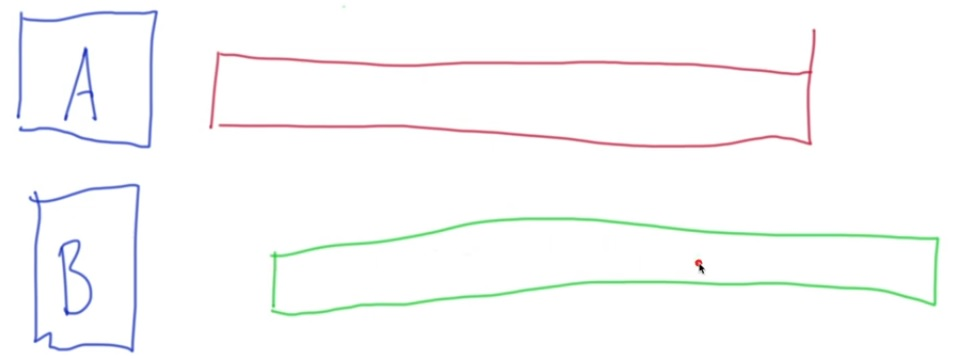
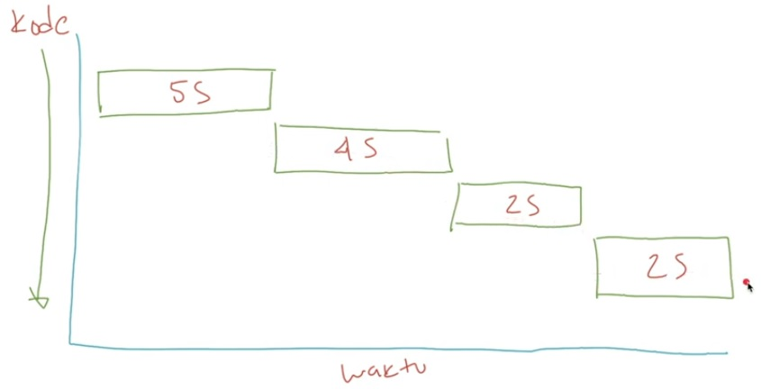
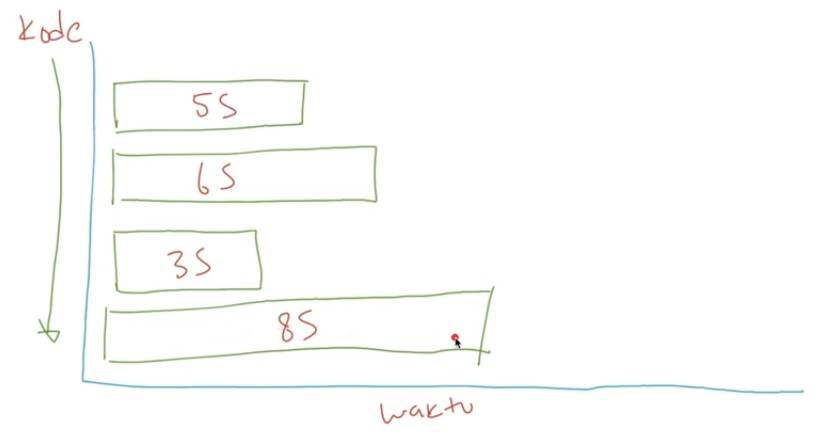
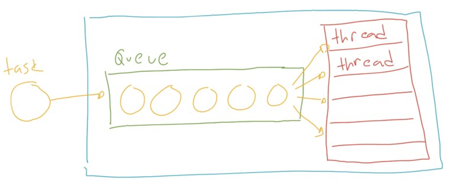
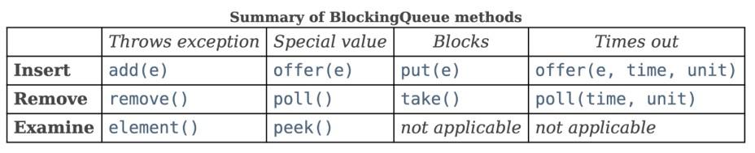
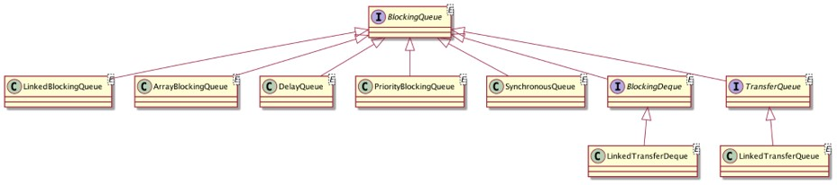
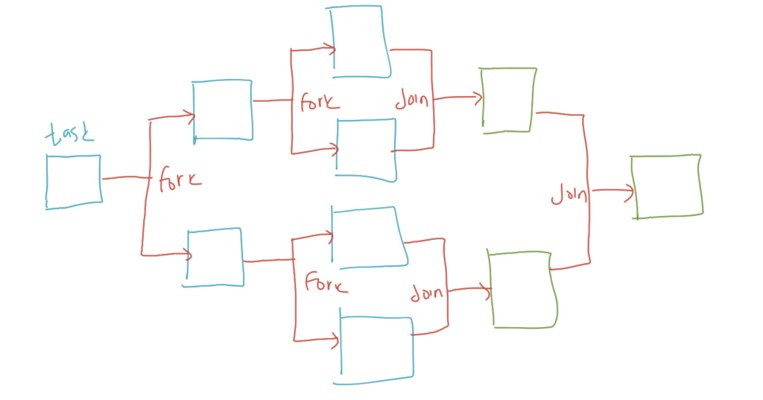
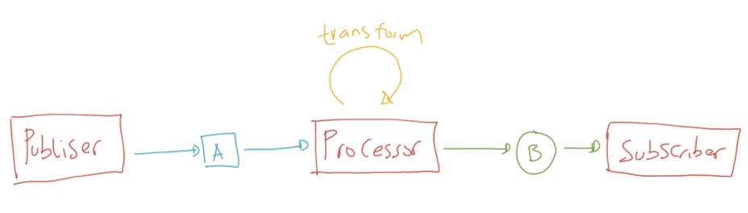

# Java Thread

## Sebelum Belajar Materi Ini

- Java Dasar
- Java Object Oriented Programming
- Java Generic
- Java Collection & Stram
- Java Lambda
- Apache Maven

## Agenda

- Pengenalan Concurrency
- Thread
- Synchronaized
- Lock
- Deadlock
- Race Condition
- Threadpool
- ExecutorService
- Dan lain-lain

## #1 Pengenalan Concurrency

- Dahulu, komputer hanya menjalankan sebuah program pada satu waktu
- Karena hanya bisa menjalankan satu program pada satu waktu, hal ini tidak efisien dan memakan waktu lama karena hanya bisa mengerjakan satu tugas pada satu waktu
- Smeakin kesini, sistem operasi untuk komputer semakin berkembang, sekarang sistem operasi bisa menjalankan program secara bersamaan dalam proses yang berbeda-beda, terisolasi dan saling independen antar program

### Sejarah Thread

- Progran biasanya berjalan dalam sebuah proses, dan proses akan memiliki resource yang independen dengan proses lain
- Sekarang, sistem operasi tidak hanya bisa menjalankan multiple proses, namun dalam proses kita bisa menjalankan banyak pekerjaan sekaligus, atau bisa dibilang proses ringan atau lebih dikenal dengan nama Thread
- Thread membuat proses aplikasi bisa berjalan tidak harus selalu sequential, kita bisa membuat proses aplikasi berjalan manjadi asynchronous atau parallel

### Era Multicore

- Sekarang kita sudah ada di zaman multicore, dimana smartphone pun sudah menggunakan multicore
- Multicore sangat menguntungkan kita karena bisa membuat aplikasi yang bisa menjalankan proses dan thread secara bersamaan

### Concurrency vs Parallel

- Kadang banyak yang bingung dengan Concurrency dan Paralel, sebenarnya kita tidak perlu terlalu memusingkan hal ini
- Karena saat ini, kita pasti akan menggunakan keduanya ketika membuat aplikasi
- Concurrency artinya mengerjakan beberapa pekerjaan satu persatu pada satu waktu
- Parallel artinya mengerjakan beberapa pekerjaan sekaligus pada satu waktu

### Diagram Concurrency


## Diagram Parallel



### Contoh Concurrency dan Parallel

- Browser adalah aplikasi yang concurrent dan parallel
- Browser akan melakukan proses concurrent ketika membuka web, browser akan melakukan http request, lalu mendownload semua file web (html, css, js) lalu merender dalam bentuk tampilan web
- Browser akan melakukan proses parallel, ketika kita membuka beberapa tab web, dan juga sambil download beberapa file, dan menonton vide dari web streaming

### Synchronous vs Asynchronous

- Saat membuat aplikasi concurrent atau parallel, kadang kita sering menemui istilah synchronous dan asynchronous
- Tidak perlu bingung dengan istilah tersebut, secara sederhana
- Synchronous adalah ketika kode program kita berjalan secara sequential, dan semua tahapan ditunggu sampau prosesnya selesai baru akan dieksekusi ke tahap selanjutnya
- Sedangkan, ASynchronous artinya ketika kode program kita berjalan dan kita tidak perlu menunggu eksekusi kode tersebut selesai, kita bisa lenjutkan ke tahapan kode program selanjutnya

### Diagram Synchronous



### Diagram Asynchronous



## #2 Membuat Project

- <https://start.spring.org>

## #3 Thread

- Di Java, implementasi Concurrency dan Parallel dapat menggunakan Thread
- Thread direpresentasikan oleh class bernama Thread di package `java.lang`

### Thread Utama

- Secara default, saat sebuah aplikasi Java berjalan, minimal akan ada satu thread yang berjalan
- Dalam aplikasi Java biasa, biasanya kode program kita akan brjalan di dalam thread yang bernama main
- Bahkan di Unit Test pun, memiliki thread sendiri

### Kode : Thread Utama

```java
@Test
vodi mainThread() {
	String threadName = Thread.currentThread().getName();
	System.out.println(threadName);
}
```

### Membuat Thread

- Thread merupakan proses ringan, membuat Thread bukan berarti kita melakukan pekerjaan
- Untuk membuat pekerjaan, kita perlu membuat object dari interface `Runnable`, selanjutnya object Runnable tersebut bisa kita berikan ke Thread untuk dijalankan
- Saat Thread berjalan, dia akan berjalan secara asynchronous, artinya dia akan berjalan sendiri, dan kode program kita akan berlanjut ke kode prorgam selanjutnya
- Untuk menjalankan Thread, kita bisa memanggil function `start()` milik Thread

### Kode : Membuat Thread

```java
Runnable runnable = () -> {
	System.out.println("Hello from Thread: " + Thread.currentThread().getName());
};

var thread = new Thread(runnable);
thread.start();
```

### Thread Sleep

- Pada saat proses development, kadang kita butuh melakukan simulasi proses yang berjalan dalam waktu tertentu
- Untuk melakukan hal ini, kita bisa memanfaatkan fitur Thread Sleep yang terdapat di Java
- Dengan menggunakan Thread Sleep, kita bisa membuat sebuah thread tertidur dan berhenti dalam waktu yang kita tentukan
- Untuk melakukan hal ini, kita bisa memanggil static method `sleep()` di class Thread, maka secara otomatis Thread saat itu dimana memanggil kode `sleep()` akan tertidur sesuai dengan waktu milisecond yang sudah kita masukan dalam parameter
- Namun perlu diperhatikan, method sleep bisa menyebabkan error `IterruptedException`

### Kode : Thread Sleep

```java
Runnable runnable = () -> {
	try {
		Thread.sleep(2_000);
		System.out.println("Hello from Thread: " + Thread.currentThread().getName());
	} catch (InterruptedException e) {
		e.printStackTrace();
	}
};

var thread  = new Thread(runnable);
thread.start();

Thread.out.println("Program Selesai");

Thread.sleep(3_000);
```

### Thread Join

- Kadang kita ingin menunggu sampai sebuah thread selesai tugasnya
- Untuk melakukan hal tersebut, kita bisa memanggil method join milik thread yang akan kita tunggu

### Kode : Thread Join

```java
Runnable runnable = () -> {
	try {
		Thread.sleep(2_000);
		System.out.println("Hello from Thread: " + Thread.currentThread().getName());
	} catch (InterruptedException e) {
		e.printStackTrace();
	}
};

var thread  = new Thread(runnable);
thread.start();
Thread.out.println("Menuggu Selesai");
thread.join();
Thread.out.println("Program Selesai");
```

### Thread Interrupt

- Interrupt merupakan mengirim sinyal ke thread bahwa thread tersebut harus berhenti melakukan pekerjaanya saat ini
- Untuk melakukan iterrupt, kita menggunakan method `interrupt()` pada thread
- Saat kita memanggil method `interrupt()`, secara otomtatis `Thread.interrupted()` akan bernilai `true`
- Perlu diingat, kode program kita pada `Runnable` harus melakukan pengecekan `interrupted`, jika tidak, sinyal interrupt tidak ada gunanya

### Kode : Interrupt Thread Salah

```java
Runnable runnable = () -> {
	for (int i = 0; i < 10; i++) {
		System.out.println("Runnable :" + i);
		try {
			Thread.sleep(1_000);
		} catch (InterruptedException e) {
			e.printStackTrace();
		}
	}
};

var thread = new Thread(runnable);
thread.start();
Thread.sleep(5_000);
thread.interrupt();
thread.join();
```

### Kode : Interrupt Thread

```java
Runnable runnable = () -> {
	for (int i = 0; i < 10; i++) {
		System.out.println("Runnable :" + i);
		try {
			Thread.sleep(1_000);
		} catch (InterruptedException e) {
			return;
		}
	}
};
```

### Kode : Interrupt Thread Manual

```java
Runnable runnable = () -> {
	for (int i = 0; i < 10; i++) {
		if (Thread.interrupted()) {
			return;
		}
		System.out.println("Runnable :" + i);
	}
};
```

### Thread Name

- Secara default thread di Java memiliki nama, ini sangat cocok untuk proses debuging ketika terjadi masalah
- Thread name secara default akan menggunakan nama Thread-[conter]
- Namun kita juga bisa mengubahnya dengan menggunakan method `setName(name)`, dan `getName()` untuk mendapatkan nama thread nya

### Kode : Thread Name

```java
var thread = new Thread(() -> {
	System.out.println("Hello from Thread: " + Thread.currentThread().getName());
});
thread.setName("Eko");
thread.start();
```

### Thread State

- Thread di Java memiliki state, state yaitu informasi state sebuth thread
- State digunakan hanya untuk mendapatkan infromasi
- State akan berubah statusnya sesuai dengan apa yang terjadi di thread
- Untuk mendapatkan data state, kita bisa menggunakan method `getState()` dan akan mengembalikan `enum` State

### Kode : Thread State

```java

var thread = new Thread(() -> {
	System.out.println(Thread.currentThread.getState());
	System.out.println("Hello from Thread: " + Thread.currentThread().getName());
});
System.out.println(thread.getState());
thread.start();
thread.join();
System.out.println(thread.getState());
```

### Thread Daemon

- Secara default, saat kita membuat thread, thread tersebut disebut user thread
- Java (bukan JUnit) secara default akan selalu menunggu semua user thread selesai sebelum program berhenti
- Jika kita membuat thread menjadi deamon thread, menggunakan `setDaemon(true)`, maka secara otomatis thread tersebut menjadi daemon thread
- Daemon thread tidak akan ditunggu jika memang program Java akan berhenti
- Namun jika kita menghentikan program Java menggunakan `System.exit()`, maka user thread pun akan otomatis terhenti

### Kode : User Thread

```java
public static void main(String[] args) {
	var thread = new Thread(() -> {
		try {
			Thread.sleep(3_000);
			System.out.println("Hello Daemon");
		} catch (InterruptedException e) {
			e.printStackTrace();
		}
	});

	thread.setDaemon(false);
	thread.start();
}
```

## #4 Race Condition

- Salah satu problem yang sering sekali terjadi dalam aplikasi concurrency dan parallel adalah race condition
- Race condition merupakan keadaan ketika sebuah data diubah secara berbarengan oleh beberapa thread yang menyebabkan hasil akhir yang tidak sesuai dengan yang kita inginkan

### Kode : Counter

```java
public class Counter {

	private Long value = 0L;

	public void increment() {
		value++;
	}

	public Long getValue() {
		return value;
	}
}
```

### Kode : Race Condition

```java
var counter = new Counter();
Runnable runnable = () -> {
	for (int i = 0; i < 1_000_000; i++) {
		counter.increment();
	}
};

var thread1 = new Thread(runnable);
var thread2 = new Thread(runnable);
var thread3 = new Thread(runnable);

thread1.start();
thread2.start();
thread3.start();

thread1.join();
thread2.join();
thread3.join();

System.out.println(counter.getValue());
```

## #5 Synchronization

- Masalah race condition sebelumnya terjadi di Java bisa diselesaikan dengan Synchronization
- Synchronization merupakan fitur dimana kita memaksa kode prorgam hanya boleh diakses dan dieksekusi oleh satu thread saja
- Jal ini menhebabkan thread yang lain yang akan mengakses kode program tersebut harus menunggu thread yang lebih dahulu mengakses, sehingga proses Synchronization akan lebih lambat, namun proses Synchronization lebih aman karena tidak akan terjadi race condition

### Synchronized Method

- Di Java, terdapat dua jenis synchronization, yaitu synchronized methos dan synchronized statement
- Synchronized method merupakan synchronization paling mudah,karena kita hanya perlu menambahkan kata kunci synchronized pada method yang ingin kita set sebagai synchronization
- Dengan begitu, secara otomatis method tersebut hanya bisa diakses oleh satu thread pada satu waktu

### Kode : Synchronized Method

```java
public class SynchronizedCounter {

	private Long value = 0L;

	public synchronized void increment() {
		value++;
	}

	public Long getValue() {
		return value;
	}
}
```

### Interinsic Lock

- Synchronization di Java sebenarnya menggunakan lock
- Ketika kita melakukan synchronized method, secara otomatis Java akan membuat interinsic lock atau monitor lock
- Ketika synchronized method dipanggil oleh thread, thread akan melakukan mencoba mendapatkan iterinsic lock, setelah method selesai (sukses ataupun error), maka thread akan mengembalikan intrinsic lock
- Semua itu terjadi sendiri secara otomatis di synchronized method

### Synchronized Statement

- Saat kita mengggunakan synchronized method, secara otomatis seluruh method akan ter synchronization
- Kadang, misal kita hanya ingin melakukan synchronized pada saat kode tertentu saja
- Untuk melakukan hal tersebut, kita bisa menggunakan synchronized statement
- Namun ketika kita menggunakan synchronized statement, kita harus menentukan object interinsic lock sendiri

### Kode : Synchronized Statement

```java
public class SynchronizedCounter {

	private Long value = 0L;

	public void increment() {
		synchronized (thie) {
			value++;
		}
	}

	public Long getValue() {
		return value;
	}
}
```

## #6 Deadlock

- Race condition sangat mudah diselesaikan dengan synchronization dan lock, namun masalah lain bisa mengintai jika kita salah melakukan synchronization, yaitu Deadlock
- Deadlock merupakan kondisi dimana beberapa thread saling menunggu satu sama lain karena biasanya terjadi ketika thread tersebut melakukan lock dan menunggu lock lan dari thread lain dan ternyata thread tersebut juga menunggu lock lain
- Karena saling menuggu, akhirnya terjadi deadlock, keadaan dimana semua thread tidak berjalan karena hanya menunggu lock

### Kode : Balance

```java
public class Balance {

	private Long value;

	public Balance(Long value) {
		this.value = value;
	}

	public Long getValue() { return value; }

	public void setValue(Long value) { this.value = value; }
}
```

### Kode : Transfer Balance

```java
public static void transfer(Balance form, Balance to, Long value) throws InterruptedException {
	synchronized (from) {
		Thread.sleep(1000L);
		synchronized (to) {
			Thread.sleep(1000L);
			from.setValue(from.getValue() - value);
			to.setValue(to.getValue() + value);
		}
	}
}
```

### Kode : Deadlock

```java
var balance1 = new Balance(1_000_000L);
var balance2 = new Balance(1_000_000L);

var thread1 = new Thread(() -> {
	try {
		balance.transfer(balance1, balance2, 500_000L);
	} catch (InterruptedException e) {
		e.printStackTrace();
	}
});

var thread2 = new Thread(() -> {
	try {
		balance.transfer(balance2, balance1, 500_000L);
	} catch (InterruptedException e) {
		e.printStackTrace();
	}
});

thread1.start();
thread2.start();

thread1.join();
thread2.join();

System.out.println(balance1.getValue());
System.out.println(balance2.getValue());
```

### Cara Menangani Deadlock

- Sayangnya tidak ada cara menyelesaikan masalah deadlock secara otomatis di Java
- Masalah deadlock harus diselesaikan sendiri oleh programmer yang membuat kode program nya

### Kode : Transfer Balance (1)

```java
public static void transfer(Balance form, Balance to, Long value) throws InterruptedException {
	synchronized (from) {
		Thread.sleep(1000L);
		from.setValue(from.getValue() - value);

	}
	synchronized (to) {
		Thread.sleep(1000L);
		to.setValue(to.getValue() + value);
	}
}
```

## #7 Thread Communication

- Dalam multithreaded programming, kadang sudah biasa ketika sebuah thread perlu menunggu thread lain menyelesaikan tugas tertentu, baru thread tersebut melakukan tugasnya
- Sayangnya tidak ada cara otomatis komunikasi antar thread secare langsung
- Oleh karena itu, programmer harus melakukan secare manual untuk komunikasi antar thread

### Kode : Thread Communication

```java
var thread1 = new Thread(() -> {
	while (message == null) {

	}
	System.out.println(message);
});
var thread1 = new Thread(() -> {
	messsage = "Eko Kurniawan Khannedy";
});
```

### Wait dan Notify

- Menggunakan loop untuk menunggu sangat tidak direkomendasikan, alasanya buang-buang resource CPU dan juga jika terjadi interrupt, loop akan terus berjalan tanpa henti
- Java sudah menyelesaikan solusi yang lebih baik dengan menambahkan method wait dan notify di `java.lang.Object`
  Artinya kita bisa membuat object apapun menjadi lock, dan gunakan `wait()` untuk menuggu, dan gunakan `notify()` untuk memberitahu bahwa data sudah tersedia
  `notify()` akan memberi tahu thread lain yang sedang melakukan `wait()` bahwa proses bisa dilanjutkan

### Kode : Wait dan Notify

```java
final Object lock = new Object();

var thread1 = new Thread(() -> {
	synchronized (lock) {
		try {
			lock.wait();
			System.out.println(message);
		} catch (InterruptedException e) {
			e.printStackTrace();
		}
	}
});

var thread2 = new Thread(() -> {
	synchronized (lock) {
		message = "Eko Kurniawan Khannedy";
		lock.notify();
	}
});
```

### Nofity All

- Kadang ada kasus dimana sebuah lock ditunggu oleh banyak thread, `notify()` hanya memberi sinyal kepada satu thread saja
- Jika kita ingin mengirim sinyall ke semua thread, kita bisa menggunakan method `notifyAll()`

### Kode : Notify All

```java
var thread2 = new Thread(() -> {
	synchronized (lock) {
		message = "Eko Kurniawan Khannedy";
		lock.notifyAll();
	}
});
```

## #8 Timer

- Timer merupakan class untuk memfasilitasi eksekusi job secara asynchronous di masa depan
- Timer bisa di schedule untuk berjalan sati kali (delayed job), atau bisa berjalan berulang kali (repeated job)
- <https://docs.oracle.com/en/java/javase/16/docs/api/java.base/java/util/Timer.html>

### Kode : Timer Delayed Job

```java
var task = new TimerTask() {
	@Override
	public void run() {
		System.out.println("Delayed Job");
	}
};

var timer = new Timer();
timer.schedule(task, 5000L);
```

### Kode : Timer Periodic Job

```java
var task = new TimerTask() {
	@Override
	public void run() {
		System.out.println("Periodic Job");
	}
};

var timer = new Timer();
timer.schedule(task, 5000L, 2000L);
```

## #9 High Level Concurrency Object

### Concurrency Utilities

- Pada versi Java 5, Java merilis fitur yang bernama Concurrency Utilities, fitur ini berisikan dukungan high level API untuk membuat aplikasi multithreaded lebih mudah
- Concurrency Utilities memperkenalkan 3 packages baru di Java 5, yaitu
  - `java.util.concurrent`
  - `java.util.concurrent.atomic`
  - `java.util.concurrent.locks`
- Semua package dan fitur tersebut nanti akan kita bahas satu persatu

### Kenapa Buth High Level API?

- Membuat dan melakukan management Tread secara manual di Java bukanlah hal bijak
- Mudah terjadi kesalahan, terutama seperti yang sudah kita jelaskan, masalah Race Condition dan Deadlock misalnya
- Selain itu, membuat aplikasi multithreaded menggunakan low level API (menggunakan Thread langsung) tisak terlalu produktif dan flexible
- Oleh karena itu, dalam pembuatan aplikasi sehari-hari, biasnya kita akan jarang sekali melakukan management thread secara manual, biasanya kita akan gunakan Concurrency Utilities

## #10 Threadpool

### Management Tread itu Sulit

- Thread merupakan object yang sangat mahal, pembuatan object thread bisa memakan memory 512kb-1mb
- Jika kita tidak mengatur pembuatan thread, bisa jadi aplikasi kita akan cepat kehabisan memory sehingga bis menyebabkan eror OutOfMemory
- Selain itu, membuat object thread baru tidak semurah membuat object class biasa, oleh karena itu sebenarnya pembuatan thread secara manual tidaklah disarankan
- Di versi Java moderen ini, lebih disarankan menggunakan Threadpool unyuk management thread

### Threadpool (1)

- Threadpool merupakan class yang digunakan untuk management thread
- Dengan threadpool, kita tidak perlu membuat thread secara manual, karena semua sudah diatur oleh threadpool
- Selain itu threadpool bisa melakukan reusable thread yang sudah selesai bekerja
- Threadpool di Java direpresentasikan dalam calass bernama `ThreadPoolExecutor`

### Pengaturan ThreadPool

Ada beberapa yang harus kita atur ketika membuat threadpool

- core pool, minimal thread yang akan dibuat ketika threadpool dibuat
- max pool, maximal thread yang akan dibuat
- keep alive time, berapa lama thread akan dihapus jika tidak bekerja
- queue, antrian untuk menampung pekerjaan yang dikirim ke threadpool

<https://docs.oracle.com/en/java/javase/16/docs/api/java.base/java/util/concurrent/ThreadPoolExecutor.html>

### Diagram ThreadPool



### Kode : Membuat ThreadPool

```java
var minThread = 10;
var maxThread = 100;
var alive = 1;
var time: TimeUnit = TimeUnit.MINUTES:

var queue = new ArrayBlockingQueue<Runnable>(100);

var executor = new ThreadPoolExecutor(minThread, maxThread, alive, time, queue);
```

### Eksekusi Runnable

- Untuk melakukan eksekusi Runnable, kita bisa menggunakan method `execute()` milik threadpool
- Secara otomatis data runnable akan dikirim ke queue threadpool untuk dieksekusi oleh thread yang terdapat di threadpool

### Kode : Eksekusi Runnable

```java
var executor = new ThreadPoolExecutor(minThread, maxThread, alive, time, queue);
executor.execute(() -> {
	try {
		Thread.sleep(5000);
		System.out.println("Hello from Threadpool: " + Thread.currentThread().getName());
	} catch (InterruptedException e) {
		e.printStackTrace();
	}
});
```

### Menghentikan ThreadPool

- Jika kita sudah selesai menggunakan threadpool, dan tidak akan menggunakannya lagi, ada baiknya kita hentikan dan matikan ThreadPool nya
- Caranya kita bisa menggunakan method `shutdown()` untuk menghentikan threadpool, jika ada pekerjaan yang belum dikerjakan, maka akan di ignore
- Atau gunakan `shutdownNow()` untuk menghentikan threadpool, namun pekerjaan yang belum dikerjakan akan dikembalikan
- Atau jika kita ingin menunggu sampai threadpool selesai, kita bisa gunakan `awaitTermination()`

### Kode : Menghentikan ThreadPool

```java
var queue = new ArrayBlockingQueue<Runnable>(1000);
var executor = new ThreadPoolExecutor(2, 2, alive, time, queue);
for (int = 0; i < 1000; i++) {
	final var task = i;
	executor.execute(() -> {
		try {
			Thread.sleep(1000);
			System.out.println("Task " + task + " from Threadpool: " + Thread.currentThread().getName());
		} catch (InterruptedException e) {
			e.printStackTrace();
		}
	});
}
executor.awaitTermination(1, TimeUnit.DAYS);
```

### Rejected Handler

- Apa yang terjadi jika queue penuh dan thread juga semua sedang bekerja?
- Maka secara otomatis akan di handle oleh object `RejectedExecutionHandler`
- Secara default, implementasi rejected handler akan mengembalikan exception `RejectedExecutionException` ketika kita `submit(Runnable)` pada kondisi queue penuh dan thread sedang bekerja semua
- Jika kita ingin mengubahnya, kita bisa membuat RejectedExecutionHandler sendiri

### Kode : LogRejectedExecutionHandler

```java
public static class LogRejectedExecutionHandler implements RejectedExecutionHandler  {

	@Override
	public void rejectedExecution(Runnable r, ThreadPoolExecutor executor) {
		System.out.println("Task : " + r + " is rejected");
	}
}
```

### Kode : Mengubah RejectedExecutionHandler

```java
var queue = new ArrayBlockingQueue<Runnable>(10);
var handler = new LogRejectedExecutionHandler();
var executor = new ThreadPoolExecutor(1, 1, alive, time, queue, handler);
for (int = 0; i < 1000; i++) {
	final var task = i;
	executor.execute(() -> {
		try {
			Thread.sleep(1000);
			System.out.println("Task " + task + " from Threadpool: " + Thread.currentThread().getName());
		} catch (InterruptedException e) {
			e.printStackTrace();
		}
	});
}
```

## #11 Executor Service

- Jika kita perhatikan, ThreadPoolExecutor merupakan implementasi dari interface Executor dan ExecutorService
- Jadi saat kita membuat ThreadPoolExecutor sebenarnya kita membuat Executor Service
- Dan sebenarnya pembuatan ThreadPool secara manual jarang dilakukan, kecuali pada kasus kita benar-benar butuh melakukan tuning Threadpool
- Namun dalam kebanyakan kasus, kita jarang sekali membuat Threadpool secara manual
- Rata-rata, biasanya untuk mengeksekusi Runnable, biasanya kita akan menggunakan ExecutorService
- <https://docs.oracle.com/en/java/javase/16/docs/api/java.base/java/util/concurrent/ExecutorService.html>

### Executors

- Karena ExecutorService adalah interface, jadi pembuatan object ExecutorService salah satu nya adalah menggunakan ThreadPoolExecutor
- Namun ada yang lebih mudah, yaitu menggunakan class Executors
- Executor merupakan class utlity untuk membantu kita membuat object ExecutorService secara mudah
- Sebenarnya implementasi Executors pun menggunakan ThreadPoolExecutor, hany saya kita tidak perlu terlalu pusing melakukan pengaturan threadpool secara manual
- <https://docs.oracle.com/en/java/javase/16/docs/api/java.base/java/util/concurrent/Executors.html>

### Executors Methos

| Executors Static Method   | Keterangan                                                             |
| ------------------------- | ---------------------------------------------------------------------- |
| newFixedThreadPool(n)     | Membuat threadpool dengan jumlah pool min dan max fix                  |
| newSingleThreadExecutor() | Membuat threadpool dengan jumlah pool min dan max 1                    |
| newCacheThreadPool()      | Membuat threadpool dengan jumlah thread bisa bertambah tidak terhingga |

### Kode : Membuat ExecutorService

```java
ExecutorService executorService = Executors.newSingleThreadExecutor();

for (int i = 0; i < 100; i++) {
	executorService.execute(() -> {
		try {
			Thread.sleep(1000);
			System.out.println("Execute");
		} catch (InterruptedException e) {
			e.printStackTrace();
		}
	});
}
```

### Queue Executors

- Hati-hati ketika membuat ExecutorService menggunakan Executors class
- Karena rata-rata Threadpool yang dibuat memiliki kapasitas queue tidak terbatas
- Artinya jika terlalu banyak Runnable task di dalam queue, maka memori penyimpanan yang akan terpakai akan semakin besar

## #12 Future

### `Callable<T>`

- Sebelumnya kita selalu menggunakan Runnable untuk mengirim perintah ke thread, namun pada Runnable, setelah pekerjaan selesai, tidak ada data yang dikembalikan sama sekali, karena method nya return void
- Callable mirip dengan Runnable, namun Callable mengembalikan data
- Selain itu Callable merupakan generic type, sehingga kita bisa tentukan tipe return data nya

### `Future<T>`

- Jika kita ingin mengeksekusi callable, kita bisa menggunakan method `submit(Callable)` pada ExecutorService, method `submit(Callable)` tersebut akan mengembalikan `Future<T>`
- Future merupakan representasi data yang akan dikembalikan oleh proses asynchronous
- Menggunakan Future, kita bisa mengecek apakah pekerjaan Callable sudah selesai atau belum, dan juga mendapatkan data hasil dari Callable

### Future Method

| Future Method             | Keterangan                                                                                       |
| ------------------------- | ------------------------------------------------------------------------------------------------ |
| T get()                   | Mengembil result data, kita belum ada, maka akan menunggu sampai ada                             |
| T get(timeout, time unit) | Mengambil result data, jika belum ada, maka akan menunggu sampai timeout                         |
| void cancel(mayInterrupt) | Membatalkan proses callable, dan apakah diperbolehkan di interrupt jika sudah terlanjur berjalan |
| boolean isCancelled()     | Mengecek apakah furure dibatalkan                                                                |
| boolean isDone()          | Mengecek apakah future telah selesai                                                             |

### Kode : Membuat Future

```java
var executor: ExecutorService = Executors.newSingleThreadExecutor();
var future: Future<String> = executor.submit(() -> {
	Thread.sleep(5000);
	return "Hi";
});

while (!future.isDone()) {
	System.out.println("Waiting Result");
	Thread.sleep(1000);
}

System.out.println(furure.get());
```

### Kode : Membatalkan Future

```java
var executor: ExecutorService = Executors.newSingleThreadExecutor();
var future: Future<String> = executor.submit(() -> {
	Thread.sleep(5000);
	return "Hi";
});
Thread.sleep(2000);
future.cancel(true);
System.out.println(furure.get());
```

### Invoke All

- ExecutorService memiliki method bernama `invokeAll(Collection<Callable<T>>)` untuk mengeksekusi banyak Callable secara sekaligus
- Ini cocok ketika ada kasus kita ingi menjalankan proses asynchronous secara perallel sebanyak jumlah thread di threadpool
- Hal ini bisa mempercepat proses dibanding kita eksekusi satu persatu

### Kode : Invoke ALl

```java
var executor: ExecutorService = Executors.newFixedThreadPool(10);
List<Callable<String>> callables = IntStream.range(1, 11).mapToObj(operand -> (Callable<String>) () -> {
	Thread.sleep(operand*500L);
	return String.valueOf(operand);
}).collect(Collectors.toList());

List<Future<String>> futures = executor.invokeAll(callables);
for (Future<String> stringFuture: futures) {
	System.out.println(stringFuture.get());
}
```

### Invoke Any

- Kadang ada kasus dimana kita ingin mengeksekusi bebrapa proses secara asynchronous, namun ingi mendapatkan hasil yang paling cepat
- Hal ini bisa dilakukan dengan menggunakan method `invokeAny(Collection<Callable<T>>)`
- `invokeAny()` akan mengembalikan result data dari Callable yang paling cepat mengembalikan result

### Kode : Invoke Any

```java
var executor: ExecutorService = Executors.newFixedThreadPool(10);
List<Callable<String>> callables = IntStream.range(1, 11).mapToObj(operand -> (Callable<String>) () -> {
	Thread.sleep(operand*500L);
	return String.valueOf(operand);
}).collect(Collectors.toList());

String result = executor.invokeAny(callables);
System.out.println(result);
```

## #13 Completable Future

- Pada Java 8, terdapat sebuah class baru bernama `CompletableFuture`, ini merupakan implementasi Future yang bisa kita set datanya secara manual
- CompletableFuture sangat cocok ketika kita misal perlu membuat future secara manual, sehingg kita tidak memerlukan Callable
- Untuk memberi value terhadap CompletableFuture secara manual, kita bisa menggunakan method `complete(value)` atau `completeExeceptionally(error)` untuk error
- <https://docs.oracle.com/en/java/javase/16/docs/api/java.base/java/util/concurrent/CompletableFuture.html>

### Kode : Menggunakan CompletableFuture (1)

```java
public Future<String> getValue() {
	CompletableFuture<String> future = new CompletableFuture<>();

	executorService.execute(() -> {
		try {
			Thread.sleep(2000);
			future.complete("Success");
		} catch (InterruptedException e) {
			future.completeExeceptionally(e);
		}
	});

	return future;
}
```

### Kode : Menggunakan CompletableFuture (2)

```java
private void execute(CompletableFuture<String> future, String value) {
	executorService.execute(() -> {
		try {
			Thread.sleep(1000 + random.nextInt(5000));
			future.complete("Success");
		} catch (InterruptedException e) {
			future.completeExeceptionally(e);
		}
	});
}
```

### Kode : Menggunakan CompletableFuture (3)

```java
public Future<String> getFastest() {
	CompletableFuture<String> future = new CompletableFuture<>();

	execute(future, "Thread 1");
	execute(future, "Thread 2");

	return future;
}
```

### CompletionStage

- CompletableFuture merupakan turunan dari interface `CompletionStage`
- CompletionStage meruapak fitur dimana kita bisa menambahkan asynchronous computation, tanpa harus menunggu dulu dara dari Future nya ada
- CompletionStage sangat mirip dengan operation di Java Stream, hanya saja tidak sekomplit di Java Stream
- <https://docs.oracle.com/en/java/javase/16/docs/api/java.base/java/util/concurrent/CompletionStage.html>

### Kode : Menggunakan Completion Stage

```java
CompletableFuture<String[]> future = getValue()
	.thenApply(value -> value.toUppercase())
	.thenApply(value -< value.split(" "));

var result: String[] =  future.get();
for (var string: result) {
	System.out.println(string);
}
```

## #14 Completion Service

- CompletionService merupakan sebuah interfae yang digunakan untuk memisahkan antar bagian yang mengeksekusi asynchronous task dan yang menerima hasil dari task yang sudah selesai
- Kadang ada kebutuhan misal kitabith menjalankan sesuatu secara paralel, lalu ada satu thread yang melakukan eksekusi task dan satu thread menunggu hasil nya
- Kita bisa menggunakan CompletionService untuk melakukan itu
- Implemntasi interface CompletionSevice adalah class ExecutorCompletionService
- <https://docs.oracle.com/en/java/javase/16/docs/api/java.base/java/util/concurrent/CompletionService.html>
- <https://docs.oracle.com/en/java/javase/16/docs/api/java.base/java/util/concurrent/ExecutorCompletionService.html>

### Diagram Completion Service


### Kode : Membuat CompletionService

```java
ExecutorService executor = Executors.newFixedThreadPool(10);
CompletionService<String> service = new ExecutorCompletionService<>(executor)
```

### Kode : Megirim Task ke CompletionService

```java
Executors.newSingleThreadExecutor().execute(() -> {
	for (int i = 0; i < 100; i++) {
		final var task = i;
		service.submit(() -> {
			Thread.sleep(random.nextInt(2000));
			return "Task-"+task;
		});
	}
});
```

### Kode : Mengambil Task di CompletionService

```java
Executors.newSingleThreadExecutor().execute(() -> {
	while (true) {
		try {
			Future<String> future = service.poll(5, TimeUnit.SECONDS);
			if (future == null) {
				break;
			} else {
				System.out.println(furure.get());
			}
		} catch (InterruptedException | ExecutionException e) {
			break;
		}
	}
});
```

## #15 Scheduled Executor Service

- ExecutorService memiliki sub child interface bernama `ScheduledExecutorService`
- Fitur tambahan di ScheduledExecutorService adalah, kita bisa melakukan asynchronous task yang terjadwal
- Hal ini sangat cocok untuk kasus delayed job (pekerjaan yang buth waktu ditangguhkan pengerjaanya) dan peridic job
- ScheduledExecutorService merupakan fitur yang bisa menggantikan low level penggunaan Timer
- <https://docs.oracle.com/en/java/javase/16/docs/api/java.base/java/util/concurrent/ScheduledExecutorService.html>

### ScheduledFuture

- Hampir semua method di ScheduledExecutorService mengembalikan data ScheduledFuture
- ScheduledFuture sebenarnya mirip dengan Future, yang membedakan, dia adalah turunan dari interface `Delayed`, yang memiliki method untuk mendapatkan informasi waktu delay
- <https://docs.oracle.com/en/java/javase/16/docs/api/java.base/java/util/concurrent/ScheduledFuture.html>

### Membuat ScheduledExecutorService

- Untuk membuat ScheduledExecutorService kita bisa menggunakan implementasi class `ScheduledThreadPoolExecutor`
- Atau jika ingin mudah, kita bisa gunakan class Executors, terdapat method `newSingleThreadScheduledExecutor()` dan `newScheduledThreadPool(poolSize)` untuk membuat ScheduledExecutorService
- <https://docs.oracle.com/en/java/javase/16/docs/api/java.base/java/util/concurrent/ScheduledThreadPoolExecutor.html>

### Kode : Delayed Job

```java
ScheduledExecutorService scheduledExecutorService = Executors.newScheduledThreadPool(10);

scheduledExecutorService.schedule(() -> {
	System.out.println("Hello Delayed Job");
}, 2, TimeUnit.SECONDS);
```

### Kode : Periodic Job

```java
ScheduledExecutorService scheduledExecutorService = Executors.newScheduledThreadPool(10);

scheduledExecutorService.scheduleAtFixedRate(() -> {
	System.out.println("Hello Delayed Job");
}, 2, 2, TimeUnit.SECONDS);
```

## #16 Atomic

### Atomic Package

- Java menawarkan sebuah package atomic yang berisikan class-class yang mendukung lock-free dan thread-safe programming pada single variable
- Setiap object Atomic class akan mengelola data yang diakses dan di update mengugnakan method yang telah disediakan
- Atomic class melakukan implementasi Compare-and-Swap untuk mendukung synchronization
- Dengan menggunakan Atomic, kita tidak perlu lagi menggunakan synchronized secara manual
- <https://docs.oracle.com/en/java/javase/16/docs/api/java.base/java/util/concurrent/atomic/package-summary.html>
- <https://en.wikipedia.org/wiki/Compare-and-swap>

### Kode : CounterAtomic

```java
public class CounterAtomic {

	private final AtomicLong value = new AtomicLong(0L);

	public void increment() {
		value.incrementAndGet();
	}

	public Long getValue() {
		return value.get();
	}
}
```

### Kode : Menggunakan Counter Atomic

```java
var counter = new CounterAtomic();
Runnable runnable = () -> {
	for (int i = 0; i < 1_000_000; i++) {
		counter.increment();
	}
};

thread1 = new Thread(runnable);
thread2 = new Thread(runnable);
thread3 = new Thread(runnable);
```

## #17 Lock

### Lock Package

- Java menyediakan high level concurrency package untuk melakukan locking atau waiting for conditions
- Ini adalah alternatif dari low level synchronized dan manual wait dan notify
- Untuk saat ini, sangat disarankan menggunakan package locks dibandingkan menggunakan low level synchronization sebelumnya yang sudah kita bahas
- <https://docs.oracle.com/en/java/javase/16/docs/api/java.base/java/util/concurrent/locks/package-summary.html>

### Locak Interface

- Lock interface merupakan alternatif implementasi dari synchronized method dan synchronized statement
- Untuk melakukan lock, kita bisa gunakan method `lock()` dan setelah selesai, kita bisa menggunakan `unlock()` untuk melepaskan lock
- Implementasi dari interface Lock adalah class ReentrantLock
- <https://docs.oracle.com/en/java/javase/16/docs/api/java.base/java/util/concurrent/locks/Lock.html>

### Kode : Counter dengan Lock

```java
public class CounterLock {

	private Long value = 0L;

	final private Lock lock = new ReentrantLock();

	public void increment() {
		try {
			lock.lock();
			value++;
		} finally {
			lock.unlock();
		}
	}
}
```

### ReadWriteLock

- Kadang ada kondisi dimana kita ingin membedakan lock antara operasi update dan operasi get
- Untuk kasus seperti ini, kita bisa membuat dua buah variable Lock
- Namun, di Java disediakan cara yang lebih mudah, yaitu menggunakan interface `ReadWriteLock`
- ReadWriteLock merupakan lock yang mendukung dua jenis operasi, read dan write
- Implementasi dari interface ReadWriteLock adalah class `ReentrantReadWriteLock`
- <https://docs.oracle.com/en/java/javase/16/docs/api/java.base/java/util/concurrent/locks/ReadWriteLock.html>

### Kode : Counter dengan ReadWriteLock

```java
public class CounterReadWriteLock {

	private Long value = 0L;

	final private ReadWriteLock lock = new ReadWriteLock();

	public void increment()  {
		try {
			lock.writeLock().lock();
			value++;
		} finally {
			lock.writeLock().unlock();
		}
	}

	public Long getValue() {
		try {
			lock.readLock().lock();
			return value;
		} finally {
			lock.readLock().unlock();
		}
	}
}
```

### Condition Interface

- Condition merupakan alternatif lain dari monitor method `(wait, notify dan notifyAll)`
- Pada Java modern saat ini, sangat disarankan menggunakan Condition dibanding monitor method
- Condition memiliki method `wait()` untuk menunggu, `signal()` untuk mentrigger satu thread, dan `signalAll()` untuk mentrigger semua thread yang menunggu
- Cara pembuatan Condition, kita bisa menggunakan method `newCondition()` milik Lock
- <https://docs.oracle.com/en/java/javase/16/docs/api/java.base/java/util/concurrent/locks/Condition.html>

### Kode : Condition

```java
String message = new String();
var locak = new ReentrantLock();
var condition = lock.newCondition();
var thread1 = new Thread(() -> {
	try {
		lock.lock();
		condition.await();
		System.out.println(message);
	} catch (InterruptedException e) {
		e.printStackTrace();
	} finally {
		lock.unlock();
	}
});

var thread2 = new Thread(() -> {
	try {
		lock.lock();
		message = "Eko Kurniawan Khannedy";
		condition.signal();
	} finally {
		lock.unlock();
	}
});
```

## #18 Synchronizer

- Pada package concurrent, terdapat banyak sekali class untuk melakukan synchronizer, ini sebenarnya improvement dari locks, namun digunakan pada kasus-kasus tertentu
- Isi dari class-class Synchronizer banyak menggunakan locks, namun kita tidak perlu melakukannya secara manual, karena sudah diatur secara otomatis oleh class-class nya sendiri

### Jenis Synchronizer

Ada banyak sekali class-class yang bisa kita gunakan untuk synchronizer, seperti

- Semaphore
- CountDownLatch
- CyclicBarrier
- Phaser, dan
- Exchanger

Semua kita akan coba bahas satu persatu

## #19 Semaphore

- Semaphore merupakan class yang digunakan untuk manage data counter
- Nilai counter bisa naik, namun ada batas maksimal nya, jika batas maksimal nya sudah tercapai, semua thread yang akan mencoba menaikkan harus menunggu, sampai ada thread lain yang menurunkan nilai counter
- Semaphore cocok sekali misal untuk menjaga agar thread berjalan pada maksimal total counter yang sudah kita tentukan
- <https://docs.oracle.com/en/java/javase/16/docs/api/java.base/java/util/concurrent/Semaphore.html>

### Kode : Semaphore

```java
final Semaphore semaphore = new Semaphore(1);
final ExecutorService service = Executors.newFixedThreadPool(100);

for (int i = 0; i < 1000; i++) {
	service.execute(() -> {
		try {
			semaphore.acquire();
			Thread.sleep(1000);
			System.out.println("Finish");
		} catch (InterruptedException e) {
			e.printStackTrace();
		} finally {
			semaphore.release();
		}
	});
}
```

## #20 CountDownLatch

- CountDownLatch merupakan synchronizer yang digunakan untuk menunggu beberapa proses selesai, cara kerjanya mirip dengan Semaphore, yang membedakan adalah pada CountDownLatch, counter diawal sudah ditentukan
- Setelah proses selesai, kita akan menurunkan counter
- Jika counter sudah bernilai 0, maka yang melakukan wait bisa lanjut berjalan
- CountDownLatch cocok jika kita misal ingin menunggu beberapa proses yang berjalan secara asynchronous sampai semua proses selesai
- <https://docs.oracle.com/en/java/javase/16/docs/api/java.base/java/util/concurrent/CountDownLatch.html>

### Kode : CountDownLatch

```java
final var countDownLatch = new CountDownLatch(5);
final var executor = Executors.newFixedThreadPool(10);

for (int i = 0; i < 5; i++) {
	try {
		System.out.println("Start Task");
		Thread.sleep(2000);
		System.out.println("End Task");
	} catch (InterruptedException e) {
		e.printStackTrace();
	} finally {
		countDownLatch.countDown();
	}
}

executor.execute(() -> {
	try {
		countDownLatch.await();
		System.out.println("All Task Finished");
	} catch (InterruptedException e) {
		e.printStackTrace();
	}
});
```

## #21 CyclicBarrier

- CyclicBarrier merupakan fitur yang bisa kita gunakan untuk saling menunggu, sampai jumlah thread yang menunggu terpenuhi
- Diawal kita akan tentukan berapa jumlah thread yang menunggu, jika sudah terpenuhi, maka secara otomatis proses menunggu akan selesai
- <https://docs.oracle.com/en/java/javase/16/docs/api/java.base/java/util/concurrent/CyclicBarrier.html>

### Kode : CyclicBarrier

```java
final var cyclicBarrier = new CyclicBarrier(5);
final var service = Executors.newFixedThreadPool(10);

for (int i = 0; i < 5; i++) {
	service.execute(() -> {
		try {
			cyclicBarrier.await();
			System.out.println("Done Waiting");
		} catch (InterruptedException | BrokenBarrierException e) {
			e.printStackTrace();
		}
	});
}
```

## #22 Phaser

- Phaser merupakan fitur synchronizer yang mirip dengan CyclicBarrier dan CountDownLatch, namun lebih flexible
- Sebelumnya, untuk jumlah counter atau thread nya sudah ditentukan di awal, namun pada Phaser, bisa berubah dengan menggunakan method `register()` atau `bulkRegister(int)`, dan untuk menurunkan bisa menggunakan method `arrive...()`, atau bisa menggunakan `await...(int)` untuk menunggu sampai jumlah yang register tertentu
- <https://docs.oracle.com/en/java/javase/16/docs/api/java.base/java/util/concurrent/Phaser.html>

### Kode : Phaser Sebagai CountDownLatch (1)

```java
final var phaser = new Phaser();
final var executor = Executors.newFixedThreadPool(10);

for (int i = 0; i < 5; i++) {
	executor.execute(() -> {
		try {
			phaser.register();
			System.out.println("Start Task");
			Thread.sleep(2000);
			System.out.println("End Task");
		} catch (InterruptedException e) {
			e.printStackTrace();
		} finally {
			phaser,arrive();
		}
	});
}

executor.execute(() -> {
	phaser.awaitAdvance(0);
	System.out.println("All Task Finished");
})
```

### Kode : Phaser Sebagai CyclicBarrier

```java
final var phaser = new Phaser();
final var service = Executors.newFixedThreadPool(10);

for (int i = 0; i < 4; i++) {
	service.execute(() -> {
		phaser.arriveAndAwaitAdvance();
		System.out.println("Done Waiting");
	});
}
```

## #23 Exchanger

- Exchanger merupakan fitur synchronizer untuk melakukan pertukaran data antar thread
- Jika data belum tersedia, maka thread yang melakukan pertukaran akan menunggu sampai ada thread lain yang melakukan pertukaran data
- <https://docs.oracle.com/en/java/javase/16/docs/api/java.base/java/util/concurrent/Exchanger.html>

### Kode : Exchanger

```java
final var exchanger = new Exchanger<String>();
final var executor = Executors.newFixedThreadPool(10);

executor.execute(() -> {
	try {
		Thread.sleep(1000);
		var value = exchanger.exchange("First");
		System.out.prinln("1. " + value);
	} catch (InterruptedException e) {
		e.printStackTrace();
	}
});

executor.execute(() -> {
	try {
		Thread.sleep(2000);
		var value = exchanger.exchange("Second");
		System.out.println("2. " + value);
	} catch (InterruptedException e) {
		e.printStackTrace();
	}
});
```

## #24 Concurrent Collection

- Java menyediakan Collection yang banyak digunakan untuk proses concurrent programming
- Tidak seperti kebanyakan Collection di package `java.util`, Collection yang terdapat di `java.util.concurrent` memang dikhususkan untuk concurrent programming, sehingga thread safe

### Jenis Concurrent Collection

Secara garis besar, concurrent collection di Java terbagi menjadi dua interface

- `BlockingQueue`, merupakan turunan dari Queue, dan dikhususkan untuk tipe collection FIFO (first in first out), seperti yang sebelumnya sudah kita bahas sekilas di ThreadPool Queue
- `ConcurrentMap`, merupakan turunan dari Map, dan dikhususkan untuk Map yang thread safe dibanding implementasi Map di Java Collection

Kita akan coba bahas satu-satu di chapter selanjutnya

## #25 Blocking Queue

- BlockingQueue merupakan turunan dari Queue, dari namanya kita tahu bahwa ini adalah collection dengan tipe antrian, yang membedakan sifat dari BlockingQueue adalah dia aman diakses oleh beberapa thread, baik itu yang memasukkan data, atau mengambil data
- BlockingQueue mendukung method wait ketika mengambil data, dan juga wait ketika menyimpan data
- Jika queue kosong, thread yang mengambil data akan diminta untuk menunggu sampai data ada
- Dan jika queue penuh, thread yang mengambil data akan diminta untuk menunggu sampai ada tempat kosong
- <https://docs.oracle.com/en/java/javase/16/docs/api/java.base/java/util/concurrent/BlockingQueue.html>

### Method di BlockingQueue



### Class Diagram Blocking Queue



### Implementasi Blocking Queue

- `ArrayBlockingQueue`, implementasi BlockingQueue dengan ukuran fix
- `LinkedBlockingQueue`, implementasi BlockingQueue dengan ukuran bisa berkembang
- `PriorityBlockingQueue`, implementasi BlockingQueue dengan otomatis berurut berdasarkan prioritas
- `DelayQueue`, implementasi BlockingQueue untuk tipe data Delayed, dimana data tidak bisa diambil sebelum waktu delay yang telah ditentukan
- `SynchronousQueue`, implementasi BlockingQueue dimana thread yang menambah data harus menunggu sampai ada thread yang mengambil data, begitu juga kebalikannya

### Kode : ArrayBlockingQueue (1)

```java
var queue = new ArrayBlockingQueue<String>(5);
var executor = Executors.newFixedThreadPool(20);

for (int i = 0; i < 10; i++) {
	executor.execute(() -> {
		try {
			queue.put("Data");
			System.out.println("Success Put Data");
		} catch (InterruptedException e) {
			e.printStackTrace();
		}
	});
}

executor.execute(() -> {
	while (true) {
		try {
			Thread.sleep(2000);
			String data = queue.take();
			System.out.println("Receive : " + data);
		} catch (InterruptedException e) {
			e.printStackTrace();
		}
	}
});
```

### Kode : LinkedBlockingQueue

```java
var queue = new LinkedBlockingQueue<String>();
var executor = Executors.newFixedThreadPool(20);

for (int i = 0; i < 10; i++) {
	executor.execute(() -> {
		try {
			queue.put("Data");
			System.out.println("Success Put Data");
		} catch (InterruptedException e) {
			e.printStackTrace();
		}
	});
}
```

### Kode : PriorityBlockingQueue

```java
var queue = new PriorityBlockingQueue<Integer>(10, Comparator.reverseOrder());
var executor = Executors.newFixedThreadPool(20);

for (int i = 0; i < 10; i++) {
	var index = i;
	executor.execute(() -> {
		queue.put(index);
		System.out.println("Success Put Data : " + index);
	});
}
```

### Kode : DelayQueue

```java
var queue = new Delayed<ScheduledFuture<String>>();
var executor = Executors.newScheduledThreadPool(10);

for (int i = i; i < 10; i++) {
	queue.put(executor.schedule(() -> "Delayed", i, TimeUnit.SECONDS));
}

executor.execute(() -> {
	while (true) {
		var data = queue.take();
		System.out.println("Receive data : " + data.get());
	} catch (InterruptedException | ExecutionException e) {
		e.printStackTrace();
	}
});
```

### Kode : SynchronousQueue

```java
var queue = new SynchronousQueue<String>()
var executor = Executors.newFixedThreadPool(20);

for (int i = 0; i < 10; i++) {
	executor.execute(() -> {
		try {
			queue.put("Data");
			System.out.println("Success Put Data");
		} catch (InterruptedException e) {
			e.printStackTrace();
		}
	});
}
```

### BlockingDeque

- BlockingDeque merupakan turunan dari BlockingQueue
- BlockingDeque tidak hanya mendukung FIFO (first in first out), tapi juga LIFO (last in last out)
- Implementasi BlockingDeque hanyalan LinkedBlockingDeque
- <https://docs.oracle.com/en/java/javase/16/docs/api/java.base/java/util/concurrent/BlockingDeque.html>

### Kode : BlockingDeque (1)

```java
var queue = new LinkedBlockingDeque<String>();
var executor = Executors.newFixedThreadPool(20);

executor.execute(() -> {
	for (int i = 0; i < 10; i++) {
		final var index = i;
		try {
			queue.putLast("Data : " + index);
			System.out.println("Success Put Data : " + index);
		} catch (InterruptedException e) {
			e.printStackTrace();
		}
	}
});

executor.execute(() -> {
	while (true) {
		try {
			Thread.sleep(2000);
			String data = queue.takeLast();
			System.out.println("Receive : " + data);
		} catch (InterruptedException e) {
			e.printStackTrace();
		}
	}
});
```

### TransferQueue

- TransferQueue Merupakan turunan dari BlockingQueue yang membolehkan pengirim data ke queue menunggu sampai data ada yang menerima
- Implementasi TransferQueue hanyalah LinkedTransferQueue
- <https://docs.oracle.com/en/java/javase/16/docs/api/java.base/java/util/concurrent/TransferQueue.html>

### Kode : TransferQueue

```java
var queue = new LinkedTransferQueue<String>();
var executor = Executors.newFixedThreadPool(20);

for (int i = 0; i < 10; i++) {
	final var index = i;
	executor.execute(() -> {
		try {
			queue.transfer("Data :" + index);
			System.out.println("Success Put Data : " + index);
		} catch (InterruptedException e) {
			e.printStackTrace();
		}
	});
}
```

## #26 Concurrent Map

- ConcurrentMap merupakan turunan dari Map yang thread safe, dan cocok jika memang diakses oleh lebih dari satu thread
- Tidak ada hal yang spesial dari ConcurrentMap, semua operasi method nya sama seperti Map, yang membedakan adalah pada ConcurrentMap, dijamin thread safe
- Implementasi dari interface ConcurrentMap adalah class ConcurrentHashMap
- <https://docs.oracle.com/en/java/javase/16/docs/api/java.base/java/util/concurrent/ConcurrentMap.html>

### Kode : ConcurrentMap

```java
var map = new ConcurrentMap<Integer, String>();
var executor = Executors.newFixedThreadPool(10);

for (int i = 0; i < 10; i++) {
	final var key = i;
	executor.execute(() -> {
		try {
			Thread.sleep(1000);
			map.putIfAbsend(key, "Data : " + key);
		} catch (InterruptedException e) {
			e.printStackTrace();
		}
	});
}
```

### Konversi dari Java Collection

- Pada kasus tertentu, kadang kita tetap butuh menggunakan Java Collection, namun butuh menggunakan multiple thread
- Untuk kasus seperti itu, disarankan merubah Java Collection menjadi `synchronized` menggunakan helper method `Collections.synchronized…(collection)`

### Kode : Konversi Java Collection

```java
List<String> list = List.of("Eko", "Kurniawan", "Khannedy");

List<String> synchronizedList = Collections.synchronizedList(list);
```

## #27 Thread Local

- ThreadLocal merupakan fitur di Java untuk menyimpan data
- ThreadLocal memberi kita kemampuan untuk menyimpan data yang hanya bisa digunakan di thread tersebut
- Tiap thread akan memiliki data yang berbeda dan tidak saling terhubung antar thread
- <https://docs.oracle.com/en/java/javase/16/docs/api/java.base/java/lang/ThreadLocal.html>

### Kode : UserService

```java
public class UserService {

	private final ThreadLocal<String> threadLocal = new ThreadLocal<>();

	public void setUser(String user) {
		threadLocal.set(user);
	}

	public void doAction() {
		String user = threadLocal.get();
		System.out.println(user + " do action");
	}
}
```

### Kode : Menggunakan UserService

```java
var random = new Random();
var userService = new UserService();
var executor = Executors.newFixedThreadPool(10);
for (int i = 0; i < 50; i++) {
	final var index = i;
	executor.execute(() -> {
		try {
			userService.setUser("User-" + index);
			Thread.sleep(1000 + random.nextInt(3000));
			userService.doAction();
		} catch (InterruptedException e) {
			e.printStackTrace()
		}
	});
}
```

## #28 Thread Local Random

- Pada materi-materi sebelumnya, kita sering menggunakan class Random untuk membuat angka random
- Saat menggunakan object Random secara parallel, maka di dalam class Random kita akan melakukan sharing variable, hal ini membuat class Random tidak aman dan juga lambat
- Oleh karena itu terdapat class ThreadLocalRandom, ThreadLocalRandom merupakan class yang seperti ThreadLocal, namun spesial untuk Random, sehingga kita bisa membuat angka random tanpa khawatir dengan race condition, karena object Random nya akan berbeda tiap thread
- <https://docs.oracle.com/en/java/javase/16/docs/api/java.base/java/util/concurrent/ThreadLocalRandom.html>

### Kode : Random

```java
var executors = Executors.newFixedThreadPool(100);

for (int i = 0; i < 100; i++) {
	executors.execute(() -> {
		try {
			Thread.sleep(1000);
			int nextInt = ThreadLocalRandom.current().nextInt(100);
			System.out.println(nextInt);
		} catch (InterruptedException e) {
			e.printStackTrace();
		}
	});
}
```

### ThreadLocalRandom Stream

- Fitur lainnya di ThreadLocalRandom adalah, dia memiliki fitur untuk membuat random number secara stream
- Hal ini mempermudah kita ketika ingin melakukan random number tanpa harus pusing membuat perulangan secara manual
- Ada banyak method di ThreadLocalRandom seperti `ints()`, `longs()` dan `doubles()` yang mengembalikan data stream

### Kode : ThreadLocalRandom Stream

```java
var executor = Executors.newSingleThreadExecutor();

executor.execute(() -> {
	ThreadLocalRandom.current().ints(100, 0, 1000);
		.forEach(System.out::println);
});

executor.shutdown();
executor.awaitTermination(1, TimeUnit.DAYS);
```

## #29 Fork Join

- Fork/Join merupakan fitur yang mulai kenalkan di Java 7 untuk membantu mempercepat proses secara parallel memanfaatkan semua cpu processor. Proses ini dicapai menggunakan teknik Devide and Conquer
- Secara sederhana, Fork/Join akan melakukan FORK, memecah pekerjaan menjadi pekerjaan yang lebih kecil dan dieksekusi secara asynchronous
- Setelah proses FORK selesai, proses JOIN akan dilakukan, yaitu menggabungkan hasil semua pekerjaan yang telah selesai menjadi satu hasil
- Fork/Join menggunakan thread pool bernama ForkJoinPool dan menggunakan thread ForkJoinWorkerThread
- <https://docs.oracle.com/en/java/javase/16/docs/api/java.base/java/util/concurrent/ForkJoinPool.html>
- <https://docs.oracle.com/en/java/javase/16/docs/api/java.base/java/util/concurrent/ForkJoinWorkerThread.html>

### Diagram Fork/Join



### Work Stealing Algorithm

- Fork/Join Thread menggunakan algoritma work stealing (mencuri), artinya jika Fork/Join akan secara maksimal menjalankan pekerjaan di semua thread, dan jika ada thread yang sudah selesai, maka thread tersebut akan coba mencuri pekerjaan dari queue thread lain
- Algoritma ini memastikan bahwa semua thread akan bekerja dan pekerjaan diselesaikan secepatnya

### Kode : Membuat ForkJoinPool

```java
ForkJoinPool pool1 = ForkJoinPool.commonPool(); // total cpu core parallelism
ForkJoinPool pool2 = new ForkJoinPool(5);

ExecutorService service1 = Executors.newWorkStealingPool(); // total cpu core parallelism
ExecutorService service2 = Executors.newWorkStealingPool(5);
```

### ForkJoinTask

- ForkJoinPool merupakan turunan dari ExecutorService, jadi cara penggunaannya sama dengan ExecutorService sebelumnya yang sudah kita bahas
- Namun agar tujuan dari ForkJoinPool tercapai, baiknya kita menggunakan ForkJoinTask sebagai task yang kita submit ke ForkJoinPool
- ForkJoinTask adalah turunan dari Callable, sehingga kita bisa menggunakan method `execute()` atau `submit()` untuk mengirim task ke ForkJoinPool
- <https://docs.oracle.com/en/java/javase/16/docs/api/java.base/java/util/concurrent/ForkJoinTask.html>

### RecursiveAction dan RecursiveTask

- ForkJoinTask adalah abstract class, dan terdapat 2 abstract class turunannya yang bisa kita gunakan agar lebih mudah membuat ForkJoinTask
- RecursiveAction, merupakan class yang bisa kita gunakan untuk task yang tidak mengembalikan result seperti Runnable
- RecursiveTask, merupakan class yang bisa kita gunakan untuk task yang mengembalikan result seperti Callable
- <https://docs.oracle.com/en/java/javase/16/docs/api/java.base/java/util/concurrent/RecursiveAction.html>
- <https://docs.oracle.com/en/java/javase/16/docs/api/java.base/java/util/concurrent/RecursiveTask.html>

### Kode : Membuat RecursiveAction

```java
public static class SimpleForkJoinTask extends RecursiveAction {

	final private List<Integer> integers;

	public SimpleForkJoinTask(List<Integer> integers) {
		this.integers = integers;
	}

	@Override
	protected void compute() {
		if (integers.size() <= 10) {
			doCompute();
		} else {
			forkCompute();
		}
	}

	private void doCompute() {
		integers.forEach(integer -> {
			System.out.println(Thread.currentThread().getName() + " : " + integer);
		});
	}

	private void forkCompute() {
		List<Integer> integers1 = this.integers.subList(0, this.integers.size() / 2);
		SimpleForkJoinTask task1 = new SimpleForkJoinTask(integers1);

		List<Integer> integers2 = this.integers.subList(this.integers.size() / 2, this.integers.size());
		SimpleForkJoinTask task2 = new SimpleForkJoinTask(integers2);

		ForkJoinTask.invokeAll(task1, task2);
	}
}


```

### Kode : Eksekusi RecursiveAction

```java
var pool = ForkJoinPool.commonPool();
List<Integer> integers = IntStream.range(0, 1000).boxed().collect(Collectors.toList());

pool.execute(new SimpleForkJoinTask(integers));

pool.shutdown();
pool.awaitTermination(1, TimeUnit.DAYS);
```

### Kode : Membuat RecursiveTask

```java
public static class TotalForkJoinTask extends RecursiveTask<Long> {

	final private List<Integer> integers;

	public TotalForkJoinTask(List<Integer> integers) {
		this.integers = integers;
	}

	@Override
	protected void compute() {
		if (integers.size() <= 10) {
			doCompute();
		} else {
			forkCompute();
		}
	}

	private Long doCompute() {
		return integers.stream().mapToLong(value -> value).peek(value -> {
			System.out.println(Thread.currentThread().getName() + " : " + value);
		}).sum();
	}

	private Long forkCompute() {
		List<Integer> integers1 = this.integers.subList(0, this.integers.size() / 2);
		TotalForkJoinTask task1 = new TotalForkJoinTask(integers1);

		List<Integer> integers2 = this.integers.subList(this.integers.size() / 2, this.integers.size());
		TotalForkJoinTask task2 = new TotalForkJoinTask(integers2);

		TotalForkJoinTask.invokeAll(task1, task2);
		return task1.join() + task2.join();
	}
}
```

### Kode : Eksekusi RecursiveTask

```java
var pool = ForkJoinPool.commonPool();
List<Integer> integers = IntStream.range(0, 1000).boxed().collect(Collectors.toList());

TotalForkJoinTask task = new TotalForkJoinTask(integers);

pool.submit(task);
Long total = task.join();
System.out.println(total);
```

## #30 Parallel Stream

- Salah satu fitur yang menarik di Java Stream adalah, Stream bisa dijalankan secara parallel
- Secara default, Parallel Stream akan dijalankan di ForkJoinPool, dimana akan di running secara default menggunakan Thread sejumlah maksimal total CPU kita
- Agar stream bisa berjalan parallel, kita cukup gunakan method `parallel()`

### Kode : Membuat Parallel Stream

```java
Stream<Integer> stream = IntStream.range(0, 1000).boxed();
stream.parallel().forEach(integer -> {
	System.out.println(Thread.currentThread().getName() + " : " + integer);
});
```

### Custom ForkJoinPool

- Method `parallel()` di Java Stream tidak memiliki parameter ForkJoinPool sama sekali, lantas bagaimana jika kita ingin menggunakan ForkJoinPool yang kita buat?
- Kita bisa mengeksekusi parallel stream nya dalam task nya ForkJoinPool

### Kode : Custom ForkJoinPool

```java
ForkJoinPool pool = new ForkJoinPool(1);

ForkJoinPool<?> task = pool.submit(() -> {
	Stream<Integer> stream = IntStream.range(0, 1000).boxed();
	stream.parallel().forEach(integer -> {
		System.out.println(Thread.currentThread().getName() + " : " + integer);
	});
});

task.join();
```

## #31 Reactive Stream

- Saat ini sudah sangat populer dengan paradigma concurrency yang bernama reactive programming
- Banyak sekali library untuk reactive programming seperti RxJava, Reactor, Akka Stream dan lain-lain
- Sejak Java 9, diperkenalkan fitur Reactive Stream di Java
- Reactive Stream merupakan standar baru untuk Asynchronous Stream Processing
- Detail spesifikasinya terdapat di website <http://www.reactive-streams.org/>

### Flow

- Dalam Reactive Stream, kita mengenal istilah namanya Flow (aliran data), berbeda dengan yang sebelumnya sudah kita pelajari tentang Thread, dalam Reactive Stream, yang difokuskan adalah aliran data
- Dalam aliran data, artinya ada yang mengirim data dan ada yang menerima data.
- Pihak yang mengirim data, kita sebut Publisher, dan pihak yang menerima data, kita sebut Subscriber
- Sebuah aliran data, kita sebut namanya Flow
- <https://docs.oracle.com/en/java/javase/16/docs/api/java.base/java/util/concurrent/Flow.html>

### Diagram Flow


### Reactive Stream Class

- Implementasi dari Reactive Stream di Java disediakan dalam bentuk class `Flow`
- Untuk publisher, implementasinya menggunakan interface `Flow.Publisher`
- Dan untuk subscriber, implementasinya menggunakan interface `Flow.Subscriber`

### Kode: Subscriber

```java
public static class PrintSubscriber implements Flow.Subscriber<String> {

	private Flow.Subscription subscription;

	@Override
	public void onSubscribe(Flow.Subscription subscription) {
		this.subscription = subscription;
		this.subscription.request(1);
	}

	@Override
	public void onNext(String item) {
		try {
			Thrad.sleep(1000);
			System.out.println(Thread.currentThread().getName() + " : " + item);
			this.subscription.request(1);
		} catch (InterruptedException e) {
			e.printStackTrace();
		}
	}

	@Override
	public void onError(Throwable throwable) {
		throwable.printStackTrace();
	}

	Override
	public void onComplete() {
		System.out.println(Thread.currentThread().getName() + " : DONE");
	}
}
```

### Kode : Publisher

```java
var executor = Executors.newSingleThreadExecutor();
SubmissionPublisher<String> publisher = new SubmissionPublisher<>();

PrintSubscriber subscriber = new PrintSubscriber();
publisher.subscribe(subscriber);

executor.execute(() -> {
	for (int i = 0; i < 100; i++) {
		publisher.submit("Eko : " + i);
		System.out.println("Send Eko : " + i);
	}
})
```

### Buffer

- Saat publisher mengirim data terlalu cepat, maka secara default data akan di buffer
- Buffer mirip antrian, dimana secara default buffer di Flow ukurannya sekitar Flow.DEFAULT_BUFFER_SIZE (256), artinya jika publisher mengirim data terlalu cepat, maka buffer akan menampung data tersebut dahulu sampai sekitar 256 data, jika buffer sudah penuh, maka publisher harus menunggu sampai data di buffer di ambil oleh subscriber
- Jika 256 terlalu besar, kita bisa mengatur data buffer yang kita inginkan

### Kode : Buffer

```java
var executor = Executors.newSingleThreadExecutor();
var forkJoinPool = Executors.newWorkStealingPool();
SubmissionPublisher<String> publisher = new SubmissionPublisher<>(forkJoinPool, 5);

PrintSubscriber subscriber = new PrintSubscriber();
publisher.subscribe(subscriber);

executor.execute(() -> {
	for (int i = 0; i < 100; i++) {
		publisher.submit("Eko : " + i);
		System.out.println("Send Eko : " + i);
	}

	publisher.close();
});
```

### Processor

- Flow memiliki fitur yang bernama Processor yang direpresentasikan dalam interface `Processor`
- Processor singkatnya adalah gabungan antara Publisher dan Subscriber, jadi dia bisa menerima data dari publisher lain lalu mengirim ke subscriber lain
- Processor cocok jika kita ingin memanipulasi data publisher lalu hasilnya dikirim ke subscriber lain
- <https://docs.oracle.com/en/java/javase/16/docs/api/java.base/java/util/concurrent/Flow.Processor.html>

### Diagram Processor



### Kode : Contoh Processor

```java
public static class HelloProcessor extends SubmissionPublisher<String> implements Flow.Processor<String, String> {

	private Flow.Subscription subscription;

	@Override
	public void onSubscribe(Flow.Subscription subscription) {
		this.subscription = subscription;
		this.subscription.request(1);
	}

	@Override
	public void onNext(String item) {
		submit("Hello " + item);
		subscription.request(1);
	}

	@Override
	public void onError(Throwable throwable) {
		throwable.printStackTrace();
	}

	@Override
	public void onComplete() {
		close();
	}
}
```

### Kode : Menggunakan Processor

```java
var executor = Executors.newSingleThreadExecutor();
var forkJoinPool = Executors.newWorkStealingPool();

SubmissionPublisher<String> publisher = new SubmissionPublisher<>(forkJoinPool, 5);

HelloProcessor helloProcessor = new HelloProcessor(forkJoinPool, 5);
publisher.subscribe(helloProcessor);

PrintSubscriber subscriber = new PrintSubscriber();
helloProcessor.subscribe(subscriber);
```

### Reactive Stream Library

- Reactive Stream sudah menjadi standard reactive stream programming di Java
- Jadi sekarang jika kita menggunakan library seperti RxJava atau Reactor, semua bisa diintegrasikan dengan Reactive Stream
- <https://github.com/ReactiveX/RxJava>
- <https://github.com/reactor/reactor-core>

## #32 Materi Selanjutnya

- Java Input Output
- Java Network
- Java Validation
- Java Persistence API
- Java Web
