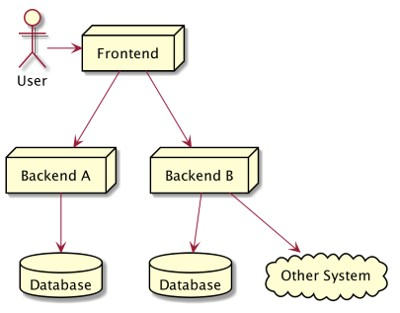
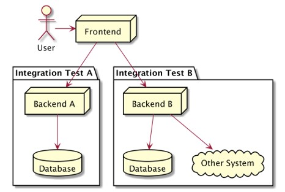
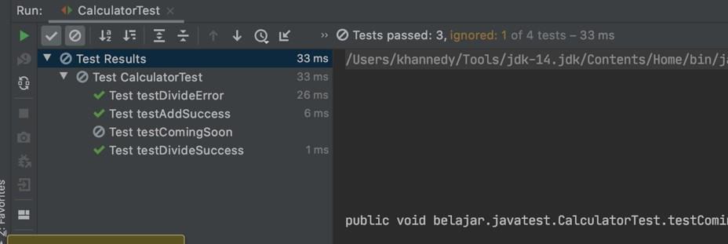
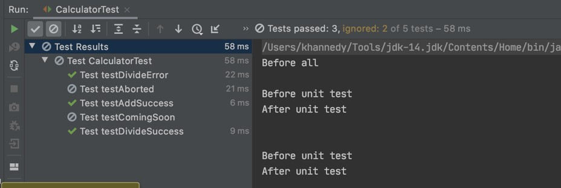
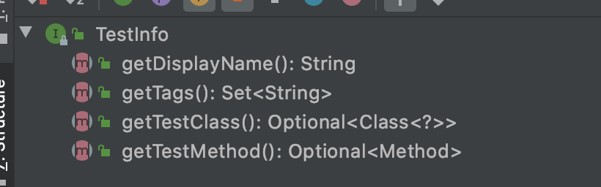

# Java Unit Test

## Sebelum Belajar Materi Ini

- Java Dasar
- Java Object Oriented Programming
- Java Generic
- Java Collection
- Java Lambda
- Apache Maven

## Agenda

- Pengenalan Software Testing
- Pengenalan JUnit
- Membuat Test
- Menggunakan Assertions
- Menggunakan Assumptions
- Dependency Injection di Test
- Mocking
- Dan lain-lain

## #1 Pengenalan Software Testing

- Software testing adalah salah satu disiplin ilmu dalam software engineering
- Tujuan utama dari software testing adalah memastikan kualitas kode dan aplikasi kita baik
- Ilmu untuk software testing sendiri sangatlah luas, pada materi ini ki takan fokus ke unit testing

### Test Pyramid


### Contoh High Level Architectire Aplikasi



### Unit Test / End to End Test


### Service Test / Integration Test



### Contoh Internal Architectire Aplikasi


### Unit Test


### Unit Test

- Unit test akan fokus menguji bagian kode program terkecil, biasanya menguji sebuah method
- Unit test biasanya dibuat kecil dan cepat, oleh karena itu biasanya kadang kode unit test lebih banyak dari kode program aslinya, karena semua skenario pengujian akan dicoba di unit test
- Unit test bisa digunakan sebagai cara untuk meningkatkan kualitas kode program kita

## #2 Pengenalan JUnit

- JUnit adalah test framework yang paling populer di Java
- Saat ini versi terbaru JUnit adalah versi 5
- JUnit 5 membutuhkan Java minimal versi 8
- <https://junit.org/>

### Membuat Project Menggunakan Maven

```bash
mvn archetype:generate

maven-archetype-quickstart
```

### Menambah JUnit 5 di Apache Maven

```xml
<dependencies>
	<dependency>
		<groupId>org.junit.jupiter</groupId>
		<artifactId>junit-jupiter</artifactId>
		<version>5.6.2</version>
		<scope>test</scope>
	</dependency>
</dependencies>
```

## #3 Membuat Test

- Untuk membuat test di JUnit itu sederhana, kita cukup membuat class, lalu menambahkan method-method test nya
- Method akan dianggap sebuah test jika ditambahkan annotation `@Test`
- Kode test disimpan dibagian test folder di maven, bukan di main folder
- Biasanya saat membuat class untuk test, rata-rata orang biasa membuat nama class nya sama dengan nama class yang akan di test, tapi diakhiri dengan kata `Test`, misal jika nama class nya adalah `Calculator`, maka nama class test nya adalah `CalculatorTest`

### Kode : Class Calculator

```java
public class Calculator {
    public Integer add(Integer first, Integer second) {
        return first + second;
    }
}
```

### Kode : Unit Test Class Calculator

```java
import org.junit.jupiter.api.Test;

public class CalculatorTest {

    private Calculator calculator = new Calculator();

    @Test
    public void testAddSuccess() {
        var result = calculator.add(10, 10);
    }
}
```

## #4 Menggunakan Assertions

- Saat membuat test, kita harus memastikan bahwa test tersebut sesuai dengan ekspektasi yang kita inginkan
- Jika manual, kita bisa melakukan pengecekan if else, namun itu tidak direkomendasikan
- JUnit memiliki fitur untuk melakukan assertions, yaitu memastikan bahwa unit test sesuai dengan kondisi yang kita inginkan
- Assertions di JUnit di representasikan dalam class `Assertions`, dan di dalamnya terdapat banyak sekali function static
- <https://junit.org/junit5/docs/current/api/org.junit.jupiter.api/org/junit/jupiter/api/Assertions.html>

### Meng-import Assertions

```java
import org.junit.jupiter.api.Test;
import static org.junit.jupiter.api.Assertions.*;

public class CalculatorTest {

	private Calculator calculator = new Calculator();
}
```

### Menggunakan Assertions

```java
public class CalculatorTest {

    private Calculator calculator = new Calculator();

    @Test
    public void testAddSuccess() {
        var result = calculator.add(10, 10);
        assertEquals(20, result);
    }
}
```

### Menggagalkan Test

- Kadang dalam membuat unit test, kita tidak hanya ingin mengetest kasus sukses atau gagal
- Ada kalanya kita ingin mengetes sebuah exception misalnya
- Assertions juga bisa digunakan untuk mengecek apakah sebuah exception terjadi

### Kode : Calculator Divide

```java
public class Calculator {

	public Integer divide(Integer first, Integer second) {
		if (second == 0) {
			throw new IllegalArgumentException("Can not divide by zero");
		} else {
			return first / second;
		}
	}
}
```

### Kode : Assertions Exception

```java
public class CalculatorTest {

    private Calculator calculator = new Calculator();

	@Test
	public void testDivideSuccess() {
		ver result = calculator.divide(100, 10);
		assertEquals(10, result);
	}

	@Test
	public void testDivideError() {
		assertThrows(IllegalArgumentException.class, () -> {
			calculator.divide(100, 10);
		});
	}
}
```

## #5 Mengubah Nama Test

- Kadang agak sulit membuat nama function yang merepresentasikan kasus test nya
- Jika kita ingin menambahkan deskripsi untuk tiap test, kita bisa menggunakan annotation `@DisplayName`
- Dengan menggunakan annotation `@DisplayName`, kita bisa menambahkan deskripsi unit testnya

### Kode : Menggunakan DisplayName

```java
@DisplayName("Test Calculator")
public class CalculatorTest {

	private Calculator calculator = new Calculator();

	@Test
	@DisplayName("Test Function Calculator.add(Integer, Integer)")
	public void testAddSuccess() {
		ver result = calculator.add(10, 10);
		assertEquals(20, result);
	}

}
```

### Menggunakan Diplay Name Generator

- JUnit mendukung pembuatan DisplayName secara otomatis menggunakan generator
- Yang perlu kita lakukan adalah membuat class turunan dari interface DisplayNameGenerator, lalu menambahkan annotation `@DisplayNameGeneration` di test class nya

### Kode : Display Name Generator

```java
public class SimpleDisplayNameGenerator implements DisplayNameGenerator {

	@Override
	public String generateDisplayNameForClass(Class<?> testClass) {
		return "Test " + testClass.getSimpleName();
	}

	@Override
	public String generateDisplayNameForMethod(Class<?> testMethod) {
		return "Test " + testMethod.getSimpleName();
	}
}
```

### Kode : Display Name Generation

```java
@DisplayNameGeneration(value = SimpleDisplayNameGenerator.class)
public class CalculatorTest {

	private Calculator calculator = new Calculator();

	@Test
	public void testAddSuccess() {
		ver result = calculator.add(10, 10);
		assertEquals(20, result);
	}
}
```

## #6 Menonaktifkan Test

- Kadang ada kalanya kita ingin menonaktifkan unit test, misal karena terjadi error di unit test tersebut, dan belum bisa kita perbaiki
- Sebenarnya cara paling mudah untuk menonaktifkan unit test adalah dengan menghapus annotation `@Test`, namun jika kita lakukan itu, kita tidak bisa mendeteksi kalo ada unit test yang di disabled
- Untuk menonaktifkan unit test secara benar, kita bisa menggunakan annotation `@Disabled`

### Kode : Disabled Unit Test

```java
@DisplayNameGeneration(value = SimpleDisplayNameGenerator.class)
public class DisabledTest {

	...

	@Test
	@Disabled
	public void testComingSoon() {
		// TODO comming soon!
	}
}
```

### Tampilan di IntelliJ IDEA



## #7 Sebelum & Setelah Test

- Kadang kita ingin menjalankan kode yang sama sebelum dan setelah eksekusi unit test
- Hal ini sebenarnya bisa dilakukan secara manual di function `@Test` nya, namun hal ini akan membuat kode duplikat banyak sekali
- JUnit memiliki annotation `@BeforeEach` dan `@AfterEach`
  `@BeforeEach` digunakan untuk menandai function yang akan dieksekusi sebelum unit test dijalankan
- `@AfterEach` digunakan untuk menandai function yang akan dieksekusi setelah unit test dijalankan
- Ingat, bahwa ini akan selalu dieksekusi setiap kali untuk function `@Test`, bukan sekali untuk class test saja

### Kode : BeforeEach dan AftarEach

```java
@DisplayNameGeneration(value = SimpleDisplayNameGenerator.class)
public class CalculatorTest {

	...

	@BeforeEach
	public void setUp() {
		System.out.println("Before unit test");
	}

	@AfterEach
	public void tearDown() {
		System.out.println("After unit test");
	}
	...

}
```

### Sebelum & Setelah Semua Unit Test

- `@BeforeEach` & `@AfterEach` akan dieksekusi setiap kali function @Test jalan
- Namun kadang kita ingin melakukan sesuatu sebelum semua unit test berjalan, atau setelah semua unit test berjalan
- Ini bisa dilakukan menggunakan annotation `@BeforeAll` dan `@AfterAll`
- Namun hanya static function yang bisa menggunakan `@BeforeAll` dan `@AfterAll`

### Kode : BeforeAll dan AfterAll

```java
@DisplayNameGeneration(value = SimpleDisplayNameGenerator.class)
public class CalculatorTest {

	...

	@BeforeAll
	public void beforeAll() {
		System.out.println("Before all");
	}

	@AfterAll
	public void afterAll() {
		System.out.println("After all");
	}
	...

}
```

## #7 Membatalkan Test

- Kadang kita ingin membatalkan unit test ketika kondisi tertentu terjadi
- Untuk membatalkan, kita bisa menggunakan exception `TestAbortedException`
- Jika JUnit mendapatkan exception TestAbortedException, secara otomatis test tersebut akan dibatalkan

### Kode : Membatalkan Test

```java
@DisplayNameGeneration(value = SimpleDisplayNameGenerator.class)
public class CalculatorTest {

	...

	@Test
	public void testAborted() {
		var profile = System.getenv("PROFILE");
		if (!"DEV".equals(profile)) {
			throw new TestAbortedException();
		}

		// dev unit test
	}
}
```

### Ketika Test Dibatalkan



## #8 Menggunakan Assumptions

- Sebelumnya kita sudah tahu jika ingin membatalkan test, kita bisa menggunakan exception `TestAbortException`
- Namun sebenarnya ada cara yang lebih mudah, yaitu dengan menggunakan `Assumptions`
- Penggunaan Assumptions mirip seperti Assertions, jika nilainya tidak sama, maka function Assumptions akan thrown TestAbortException, sehingga secara otomatis akan membatalkan unit test yang sedang berjalan
- <https://junit.org/junit5/docs/current/api/org.junit.jupiter.api/org/junit/jupiter/api/Assumptions.html>

### Kode : Import Assumptions

```java
import static org.junit.jupiter.api.Assumptions.*;
```

### Menggunakan Assumptions

```java
@DisplayNameGeneration(value = SimpleDisplayNameGenerator.class)
public class AssumptionsTest {

	...

	@Test
	public void testAssumption() {
		assumeTrue("DEV".equals(System.getenv("PROFILE")));

		// dev unit test
	}
}
```

## #9 Test Berdasarkan Kondisi

- Sebenarnya kita bisa menggunakan Assumptions untuk menjalankan unit test berdasarkan kondisi tertentu
- Namun JUnit menyediakan fitur yang lebih mudah untuk pengecekan beberapa kondisi, seperti kondisi sistem operasi, versi java, system property atau environment variable
- Ini lebih mudah dibandingkan menggunakan Assumptions

### Kondisi Sistem Operasi

- Untuk kondisi sistem operasi, kita bisa menggunakan beberapa annotation
- `@EnabledOnOs` digunakan untuk penanda bahwa unit test boleh berjalan di sistem operasi yang ditentukan
- `@DisabledOnOs` digunakan untuk penanda bahwa unit test tidak boleh berjalan di sistem operasi yang ditentukan

### Kode : Kondisi Sistem Operasi

```java
@DisplayNameGeneration(value = SimpleDisplayNameGenerator.class)
public class ConditionTest {

	...

	@Test
	@EnabledOnOs(value = {OS.WINDOWS})
	public void onlyRunOnWindows() {
		// put your unit test
	}

	@Test
	@DisabledOnOs(value = {OS.WINDOWS})
	public void disabledRunOnWindows() {
		// put your unit test
	}
}
```

### Kondisi Versi Java

- Untuk kondisi versi Java yang kita gunakan, kita bisa menggunakan beberapa annotation
- `@EnabledOnJre` digunakan untuk penanda bahwa unit test boleh berjalan di Java versi tertentu
- `@DisabledOnJre` digunakan untuk penanda bahwa unit test tidak boleh berjalan di Java versi tertentu
- `@EnabledForJreRange` digunakan untuk penanda bahwa unit test boleh berjalan di range Java versi tertentu
- `@DisabledForJreRange` digunakan untuk penanda bahwa unit test tidak boleh berjalan di range Java versi tertentu

### Kode : Kondisi Versi Java

```java
@DisplayNameGeneration(value = SimpleDisplayNameGenerator.class)
public class ConditionTest {

	...

	@Test
	@EnabledOnJre(value = {JRE.JAVA_14})
	public void onlyRunOnJava14() {
		// put your unit test
	}

	@Test
	@DisabledOnJre(value = {JRE.JAVA_14})
	public void disabledRunOnJava14() {
		// put your unit test
	}
}
```

### Kode : Kondisi Range Versi Java

```java

@DisplayNameGeneration(value = SimpleDisplayNameGenerator.class)
public class ConditionTest {

	...

	@Test
	@EnabledForJreRange(min = JRE.JAVA_11, max = JRE.JAVA_14)
	public void onlyRunOnJava11ToJava14() {
		// put your unit test
	}

	@Test
	@DisabledForJreRange(min = JRE.JAVA_11, max = JRE.JAVA_14)
	public void disabledRunOnJava11ToJava14() {
		// put your unit test
	}

}
```

### Kondisi System Property

- Untuk kondisi nilai dari system property, kita bisa menggunakan beberapa annotation
- `@EnabledIfSystemProperty` untuk penanda bahwa unit test boleh berjalan jika system property sesuai dengan yang ditentukan
- `@DisabledIfSystemProperty` untuk penanda bahwa unit test tidak boleh berjalan jika system property sesuai dengan yang ditentukan
- Jika kondisinya lebih dari satu, kita bisa menggunakan `@EnabledIfSystemProperties` dan `@DisabledIfSystemProperties`

### Kode : Kondisi System Property

```java
@DisplayNameGeneration(value = SimpleDisplayNameGenerator.class)
public class ConditionTest {

	...

	@Test
	@EnabledIfSystemProperty(named = "java.vendor", matches = "Oracle Corporation")
	public void enableOnOracle() {
		// put your unit test
	}

	@Test
	@DisabledIfSystemProperty(named = "java.vendor", matches = "Oracle Corporation")
	public void disabledOnOracle() {
		// put your unit test
	}
}
```

### Kondisi Environment Variable

- Untuk kondisi nilai dari environment variable, kita bisa menggunakan beberapa annotation
- `@EnabledIfEnvironmentVariable` untuk penanda bahwa unit test boleh berjalan jika environment variable sesuai dengan yang ditentukan
- `@DisabledIfEnvironmentVariable` untuk penanda bahwa unit test tidak boleh berjalan jika environment variable sesuai dengan yang ditentukan
- Jika kondisinya lebih dari satu, kita bisa menggunakan `@EnabledIfEnvironmentVariables` dan `@DisabledIfEnvironmentVariables`

## Kode : Kondisi Environment Variable

```java
@DisplayNameGeneration(value = SimpleDisplayNameGenerator.class)
public class ConditionTest {

	...

	@Test
	@EnabledIfEnvironmentVariable(named = "PROFILE", matches = "DEV")
	public void enableOnProfileDev() {
		// put your unit test
	}

	@Test
	@DisabledIfEnvironmentVariable(named = "PROFILE", matches = "DEV")
	public void disabledOnProfileDev() {
		// put your unit test
	}
}
```

## #10 Menggunakan Tag

- Class atau function unit test bisa kita tambahkan tag (tanda) dengan menggunakan annotation `@Tag`
- Dengan menambahkan tag ke dalam unit test, kita bisa fleksibel ketika menjalan unit test, bisa memilih tag mana yang mau di include atau di exclude
- Jika kita menambahkan tag di class unit test, secara otomatis semua function unit test di dalam class tersebut akan memiliki tag tersebut
- Jika kita ingin menambahkan beberapa tag di satu class atau function unit test, kita bisa menggunakan annotation `@Tags`

### Kode : Menambahkan Tag

```java
@Tag("integration-test")
public class SimpleIntegrationTest {

	@Test
	public void integrationTest1() {
		System.out.println("Integration Test 1");
	}

	@Test
	public void integrationTest2() {
		System.out.println("Integration Test 2");
	}
}
```

### Memilih Tag dengan Maven

`mvn test -DGroups=tag1,tag2`

### Memilih Tag dengan IntelliJ IDEA


## #11 Urutan Eksekusi Test

- Secara default, urutan eksekusi unit test tidak ditentukan, jadi jangan berharap jika sebuah method berada diatas method lainnya, maka akan dijalankan lebih dulu
- Hal ini karena memang sebaiknya method unit test itu harus independen, tidak saling ketergantungan
- Secara default pun, object class unit test akan selalu dibuat ulang tiap method, jadi jangan berharap kita bisa menyimpan data di variable untuk digunakan di unit test method selanjutnya

### Mengubah Urutan Eksekusi Test

- JUnit mendukung perubahan urutan eksekusi test jika kita mau menggunakan annotation `@TestMethodOrder`, ada beberapa cara yang bisa kita lakukan
- `Alphanumeric`, artinya urutan eksekusi unit test akan diurutkan berdasarkan alphanumeric
- `Random`, artinya urutan urutan eksekusi unit test akan dieksekusi secara random
- `OrderAnnotation`, artinya urutan eksekusi unit test akan mengikuti annotation `@Order` yang ada di tiap method unit test

### Kode : Menggunakan Order Annotation

```java
@TestMethodOrder(value = MethodOrderer.OrderAnnotation.class)
public class OrderedTest {

	@Test
	@Order(3)
	public void test3() {

	}

	@Test
	@Order(2)
	public void test2() {

	}

	@Test
	@Order(1)
	public void test1() {

	}
}
```

## Membuat Urutan Sendiri

- Jika kita ingin membuat cara mengurutkan urutan unit test function sendiri, kita bisa dengan mudah tinggal membuat class baru turunan dari MethodOrderer interface

## #12 Siklus Hidup Test

- Secara default, lifecycle (siklus hidup) object test adalah independent per method test, artinya object unit test akan selalu dibuat baru per method unit test, oleh karena itu kita tidak bisa bergantung dengan method test lain
- Cara pembuatan object test di JUnit ditentukan oleh annotation `@TestInstance`, dimana defaultnya adalah `Lifecycle.PER_METHOD`, artinya tiap method akan dibuat sebuah instance / object baru
- Kita bisa merubahnya menjadi `Lifecycle.PER_CLASS` jika mau, dengan demikian instance / object test haya dibuat sekali per class, dan method test akan menggunakan object test yang sama
- Hal ini bisa kita manfaatkan ketika membuat test yang tergantung dengan test lain

### Kode : Menggunakan Instance Per Class

```java
@TestInstance(value = TestInstance.Lifecycle.PER_CLASS)
@TestMethodOrder(value = MethodOrderer.OrderAnnotation.class)
public class OrderedTest {

	private int count = 0;

	@Test
	@Order(3)
	public void test3() {
		count++;
		System.out.print(count);
	}

	@Test
	@Order(2)
	public void test2() {
		count++;
		System.out.print(count);
	}

	@Test
	@Order(1)
	public void test1() {
		count++;
		System.out.print(count);
	}
}
```

### Keuntungan Instance Per Class

- Salah satu keuntungan saat menggunakan `Lifecycle.PER_CLASS` adalah, kita bisa menggunakan `@BeforeAll` dan `@AfterAll` di method biasa, tidak harus menggunakan function object / static

### Kode : BeforeAll dan AfterAll

```java
public class OrderedTest {

	private int count = 0;

	@BeforeAll
	public void beforeAll() {

	}

	@AfterAll
	public void afterAll() {

	}

}
```

## #13 Test di dalam Test

- Saat membuat unit test, ada baiknya ukuran test class nya tidak terlalu besar, karena akan sulit di baca dan dimengerti.
- Jika test class sudah semakin besar, ada baiknya kita pecah menjadi beberapa test class, lalu kita grouping sesuai dengan jenis method test nya.
- JUnit mendukung pembuatan class test di dalam class test, jadi kita bisa memecah sebuah class test, tanpa harus membuat class di file berbeda, kita bisa cukup menggunakan inner class
- Untuk memberi tahu bahwa inner class tersebut adalah test class, kita bisa menggunakan annotation `@Nested`

### Kode : Test di dalam Test

```java
@DisplayName("A Queue")
public class QueueTest {

	private Queue<String> queue;

	@Nested
	@DisplayName("when new")
	public class WhenNew {

		@BeforeEach
		public void setUp() {
			queue = new LinkedList<>();
		}
	}
}
```

## #14 Informasi Test

- Walaupun mungkin jarang kita gunakan, tapi kita juga bisa mendapatkan informasi test yang sedang berjalan menggunakan interface TestInfo
- Kita bisa menambahkan TestInfo sebagai parameter di function unit test



### Kode : Menggunakan Test Info

```java
@DisplayName("Test with TestInfo")
public class InformationTest {

	@Test
	@Tag("cool")
	@DisplayName("This is test one")
	public class testOne(Test Info testInfo) {
		System.out.println(testInfo.getDisplayName());
		System.out.println(testInfo.getTags());
		System.out.println(testInfo.getTestMethod());
		System.out.println(testInfo.getTestClass());
	}
}
```

## #15 Dependency Injection di Test

- Tidak ada magic di JUnit, sebenarnya fitur TestInfo yang sebelumnya kita bahas adalah bagian dari dependency injection di JUnit
- Dependency Injection sederhananya adalah bagaimana kita bisa memasukkan dependency (object/instance) ke dalam unit test secara otomatis tanpa proses manual
- Saat kita menambah parameter di function unit test, sebenarnya kita bisa secara otomatis memasukkan parameter tersebut dengan bantuan ParameterResolver
- Contohnya TestInfo yang kita bahas sebelumya, sebenarnya objectnya dibuat oleh `TestInfoParameterResolver`

### Kode : Membuat Random Parameter Resolver

```java
public class RandomParameterResolver implements ParameterResolver {

	private Random random = new Random();

	@Override
	public boolean supportsParameter(ParameterContext parameterContext, ExtensionContext extensionContext) {
		return parameterContext.getParameter().getType() == Random.class;
	}

	@Override
	public Object resolveParameter(ParameterContext parameterContext, ExtensionContext extensionContext) {
		return random;
	}
}
```

### Menggunakan Paramateer Resolver

- Untuk menggunakan parameter resolver yang sudah kita buat, kita bisa menggunakan annontation `@ExtendWith` di test class
- Jika lebih dari 1 parameter resolver, kita bisa menggunakan `@Extensions`

### Kode : Menggunakan Random Resolver

```java
@Extensions(value = {@ExtendWith(RandomParameterResolver.class)})
public class RandomCalculatorTest {

	private Calculator calculator = new Calculator();

	@Test
	public void testRandom(Random random) {
		var a = random.nextInt();
		var b = random.nextInt();

		assertEquals(a + b, calculator.add(a, b));
	}
}
```

## #16 Pewarisan di Test

- JUnit mendukung pewarisan di test, artinya jika kita membuat class atau interface dan menambahkan informasi test disitu, maka ketika kita membuat turunannya, secara otomatis semua fitur test nya dimiliki oleh turunannya
- Ini sangat cocok ketika kita misal contohnya sering membuat code sebelum dan setelah test yang berulang-ulang, sehingga dibanding dibuat di semua test class, lebih baik dibuat sekali di parent test class, dan test class tinggal menjadi child class dari parent test class

### Kode : Membuat Parent Test Class

```java
@Extensions(value = {@ExtendWith(RandomParameterResolver.class)})
public class ParentCalculatorTest {

	private Calculator calculator = new Calculator();

	@BeforeEach
	public void setUp() {
		System.out.println("Before each");
	}
}
```

### Kode : Membuat Child Test Class

```java
public class RandomCalculatorTest extends ParentCalculatorTest {

	@Test
	public void testRandom(Random random) {
		var a = random.nextInt();
		var b = random.nextInt();

		assertEquals(a + b, calculator.add(a, b));
	}
}
```

## #17 Test Berulang

- JUnit mendukung eksekusi unit test berulang kali sesuai dengan jumlah yang kita tentukan
  Untuk mengulang eksekusi unit test, kita bisa menggunakan annotation `@RepeatedTest` di method unit test nya
- `@RepeatedTest` juga bisa digunakan untuk mengubah detail nama test nya, dan kita bisa menggunakan value `{displayName}` untuk mendapatkan display name, `{currentRepetition}` untuk mendapatkan perulangan ke berapa saat ini, dan `{totalRepetitions}` untuk mendapatkan total perulangan nya

### Kode : Test Berulang

```java
public class RandomCalculatorTest extends ParentCalculatorTest {

	@DisplayName("Test Calculator Random")
	@RepeatedTest(
		value = 10,
		name = "{displayName} ke {currentRepetition} dari {totalRepetitions}"
	)
	public void testRandom(Random random) {
		var a = random.nextInt();
		var b = random.nextInt();

		assertEquals(a + b, calculator.add(a, b));
	}
}
```

### Informasi Perulangan

- `@RepeatedTest` juga memiliki object `RepetitionInfo` yang di inject oleh class `RepetitionInfoParameterResolver`, sehingga kita bisa mendapatkan informasi RepetitionInfo melalui parameter function unit test

### Kode : Informasi Perulangan

```java
public class RandomCalculatorTest extends ParentCalculatorTest {

	@DisplayName("Test Calculator Random")
	@RepeatedTest(
		value = 10,
		name = "{displayName} ke {currentRepetition} dari {totalRepetitions}"
	)
	public void testRandom(Random random, TestInfo testInfo, RepetitionInfo repetitionInfo) {
		System.out.println(testInfo.getDisplayName() + " ke " + repetitionInfo.getCurrentRepetition())
		var a = random.nextInt();
		var b = random.nextInt();

		assertEquals(a + b, calculator.add(a, b));
	}
}
```

## #18 Test dengan Parameter

- Sebelumnya kita sudah tau jika ingin menambahkan parameter di function unit test, maka kita perlu membuat ParameterResolver
- Namun jika terlalu banyak membuat ParameterResolver juga agak menyulitkan kita
- JUnit memiliki fitur yang bernama `@ParameterizedTest`, dimana jenis unit test ini memang khusus dibuat agar dapat menerima parameter
- Yang perlu kita lakukan adalah dengan mengganti `@Test` menjadi `@ParameterizedTest`

### Sumber Parameter

`@ParameterizedTest` mendukung beberapa sumber parameter, yaitu

- `@ValueSource`, untuk sumber Number, Char, Boolean dan String
- `@EnumSource`, untuk sumber berupa enum
- `@MethodSource`, untuk sumber dari static method
- `@CsvSource`, untuk sumber beruba data CSV
- `@CsvFileSource`, untuk sumber beruba file CSV
- `@ArgumentSource`, untuk data dari class ArgumentProvider

### Kode : Parameter

```java
public class RandomCalculatorTest extends ParentCalculatorTest {

	@DisplayName("Test Calculator with Parameter")
	@ParameterizedTest(name = "{displayName} with data {0}")
	@ValueSource(ints = {1, 2, 3, 4, 5})
	public  void testWithParameter(int value) {
		var result = value + value;
		assertEquals(result, calculator.add(value, value));
	}
}
```

### Kode : Parameter dengan @MethodSource

```java
public class RandomCalculatorTest extends ParentCalculatorTest {

	public static List<Integer> parameterSource() {
		retutn List.of(1, 2, 3, 4, 5);
	}

	@ParameterizedTest
	@MethodSource(value = {"parameterSource"})
	public  void testWithMethodSource(Integer value) {
		var result = value + value;
		assertEquals(result, calculator.add(value, value));
	}
}
```

## #19 Timeout di Test

- Kadang kita ingin memastikan bahwa sebuah unit test berjalan tidak lebih dari sekian detik
- Misal ketika kasus kita ingin memastikan kode program kita mempunyai performa bagus dan cepat
- JUnit memiliki fitur timeout, yaitu memastikan bahwa unit test berjalan tidak lebih dari waktu yang ditentukan, jika melebihi waktu yang ditentukan, secara otomatis unit test tersebut akan gagal
- Kita bisa menggunakan annotation `@Timeout` untuk melakukan hal tersebut

### Kode : Timeout di Test

```java
import java.util.concurrent.TimeUnit;

public class SlowTest {

	@Test
	@Timeout(value = 5, unit = TimeUnit.SECONDS)
	public void slow() throws InterruptedException {
		Thread.sleep(10_000);
	}
}
```

## #20 Eksekusi Test Secara Paralel

- Secara default, JUnit tidak mendukung eksekusi unit test secara paralel, artinya unit test akan dijalankan secara sequential satu per satu
- Namun kadang ada kasus kita ingin mempercepat proses unit test sehingga dijalankan secara paralel, hal ini bisa kita lakukan di JUnit, namun perlu beberapa langkah
- Tapi ingat, pastikan unit test kita aman ketika dijalankan secara paralel

### Menambah Konfigurasi Paralel

- Hal pertama yang perlu kita lakukan adalah membuat file junit-platform.properties di resource
- Lalu menambah value :
  - `junit.jupiter.execution.parallel.enabled = true`

### Menggunakan @Execution

- Walaupun sudah mengaktifkan fitur paralel, tapi bukan berarti secara otomatis semua unit test berjalan paralel, agar unit test berjalan paralel, kita perlu menggunakan annotation `@Execution`
- Lalu memilih jenis execution nya, misal untuk paralel bisa menggunakan `ExecutionMode.CONCURRENT`

### Kode : Test Secara Paralel

```java
@Execution(value = ExecutionMode.CONCURRENT)
public class SlowTest {

	@Test
	@Timeout(value 5, unit = TimeUnit.SECONDS)
	public void slow1() throws InterruptedException {
		Thread.sleep(4_000);
	}

	@Test
	@Timeout(value 5, unit = TimeUnit.SECONDS)
	public void slow2() throws InterruptedException {
		Thread.sleep(4_000);
	}
}

```

## #21 Pengenalan Mocking

### Ketergantungan Antar Class

- Saat membuat aplikasi yang besar, source code pun akan semakin besar, struktur class pun akan semakin kompleks
- Kita tidak bisa memungkiri lagi bahwa akan ada ketergantungan antar class
- Unit test yang bagus itu bisa terprediksi dan cukup nge test ke satu function, jika harus mengetes interaksi antar class, lebih disarankan integration test
- Lantas bagaimana jika kita harus mengetest class yang ketergantungan dengan class lain?
- Solusinya adalah melakukan mocking terhadap dependency yang dibutuhkan class yang akan kita test

### Pengenalan Mocking

- Mocking sederhananya adalah membuat object tiruan
- Hal ini dilakukan agar behavior object tersebut bisa kita tentukan sesuai dengan keinginan kita
- Dengan mocking, kita bisa membuat request response seolah-olah object tersebut benar dibuat

### Pengenalan Mockito

- Ada banyak framework untuk melakukan mocking, namun di materi ini kita akan menggunakan Mockito
- Mockito adalah salah satu mocking framework paling populer di Java, dan bisa digunakan juga untuk Kotlin
- Dan Mockito bisa diintegrasikan baik dengan JUnit
- <https://site.mockito.org/>

### Kode : Menambahkan Dependency Mockito

```xml
<dependencies>
	<dependency>
		<groupId>org.mockito</groupId>
		<artifactId>mockito-junit-jupiter</artifactId>
		<version>3.4.4</version>
		<scope>test</scope>
	</dependency>
</dependencies>
```

### Kode : Conteoh Mocking dengan Mockito

```java
public class MockitoTest {

	@Test
	public void mockito1() {

		// Membuat Mock Object
		List<String> list = Mockito.mock(List.class);

		// Menambahkan Behaviour ke Mock Object
		Mockito.when(list.get(0)).thenReturn("Eko");

		// Test Mock
		assertEquals("Eko", list.get(0));

		// Verify Mock
		Mockito.verify(list, Mockito.times(1)).get(0);
	}
}
```

## #22 Mocking di Test

- Mockito memiliki MockitoExtention yang bisa kita gunakan untuk integrasi dengan JUnit
- Hal ini memudahkan kita ketika ingin membuat mock object, kita cukup gunakan `@Mock`
- Agar terbayang bagaimana proses mock, kita akan coba kasus yang lumayan panjang

### Contoh Kasus

- Kita punya sebuah class model dengan nama class `Person(id: String, name: String)`
- Selanjutnya kita punya interface PersonRepository sebagai interaksi ke database, dan memiliki function `selectById(id: String)` untuk melakukan mendapatkan data Person di database
- Dan terakhir kita memiliki class PersonService yang digunakan sebagai class bisnis logic, dimana di class tersebut kita akan coba gunakan PersonRepository untuk mendapatkan data dari database, jika gagal, kita akan throw Exception

### Kode : Class Person

```java
public class Person {

	private String id;

	private String name;

	public Person(String id, String name) {
		this.id = id;
		this.name = name;
	}
}
```

### Kode : Interface PersonRepository

```java
import belajar.javatest.model.Person;

public interface PersonRepository {

	Peron selectById(String id);
}
```

### Kode : Class PersonService

```java
public class PersonService {

	public PersonRepository personRepository;

	public PersonService(PersonRepository personRepository) {
		this.personRepository = personRepository;
	}

	public Person get(String id) {
		var person = personRepository.selectById(id);
		if (person != null) {
			return person;
		} else {
			throw new IllegalArgumentException("Person not found");
		}
	}
}
```

### Kode : Integrasi Mockito dan JUnit

```java
@ExtendWith(MockitoExtention.class)
public class PersonServiceTest {

	@Mock
	private PersonRepository personRepository;

	private PersonService personService;

	@BeforeEach
	public void setUp() {
		personService = new PersonService(personRepository);
	}
}
```

### Kode : Test Get Person

```java
@ExtendWith(MockitoExtention.class)
public class PersonServiceTest {

	...

	@Test
	public void testGetNotFound() {
		assertThrows(IllegalArgumentException.class, () -> personService.get("not found"));
	}

	@Test
	public void testGetSuccess() {
		when(personRepository.selectById("eko")).thenReturn(new Perso("eko", "Eko"));
		var person = personService.get("eko");
		assertEquals("eko", person.getId());
		assertEquals("Eko", person.getName());
	}
|
```

## #23 Verifikasi di Mocking

- Pada materi sebelumnya, kita tidak melakukan verifikasi terhadap object mocking, apakah dipanggil atau tidak
- Pada kasus sebelumnya mungkin tidak terlalu berguna karena kebetulan function nya mengembalikan value, sehingga kalo kita lupa memanggil method nya, sudah pasti unit test nya gagal
- Lantas bagaimana jika function nya tidak mengembalikan value? Alias function void

### Contoh Kasus

- Kita akan melanjutkan kasus sebelumnya
- Di interface PersonRepository kita akan membuat method `insert(person: Person)` yang digunakan untuk menyimpan data ke database, namun tidak mengembalikan value, alias void
- Di class PersonService kita akan membuat method `register(name: String)` dimana akan membuat object Person dengan id random, lalu menyimpan ke database via PersonRepository, lalu mengembalikan object person tersebut

### Kode : Interface PersonRepository

```java
public interface PersonRepository {

	Person selectById(String id);

	void insert(Person person);
}
```

### Kode : Class PersonService

```java
public class PersonService {

	...

	public Person register(String name) {
		var person = new Person(UUID.randomUUID().toString(), name);
		personRepository.insert(person);
		return person;
	}
}
```

### Kode : Unit Test (Sebenarnya Salah)

```java
@ExtendWith(MockitoExtention.class)
public class PersonServiceTest {

	...

	@Test
	public void testCreateSuccess() {
		var person = personService.register("Eko");
		assertEquals("Eko", person.getName());
		assertEquals(person.getId());
	}
}
```

### Kenapa Salah?

- Coba hapus kode personRepository.insert(person)
  Maka unit test nya pun tetap sukses
- Hal ini terjadi karena, kita tidak melakukan verifikasi bahwa mocking object dipanggil
- Hal ini sangat berbahaya, karena jika code sampai naik ke production, bisa jadi orang yag registrasi datanya tidak masuk ke database

### Kode : Unit Test denagn Verifikasi

```java
@ExtendWith(MockitoExtention.class)
public class PersonServiceTest {

	...

	@Test
	public void testCreateSuccess() {
		var person = personService.register("Eko");
		assertEquals("Eko", person.getName());
		assertEquals(person.getId());

		verify(personRepository, times(1))
			.insert(new Person(person.getId(), person.getName()));
	}
}
```

## #24 Materi Selanjutnya

- Java Stream
- java Database
