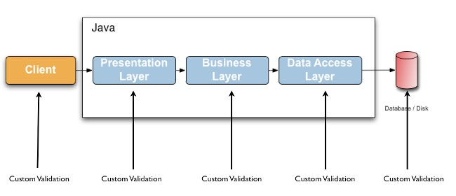
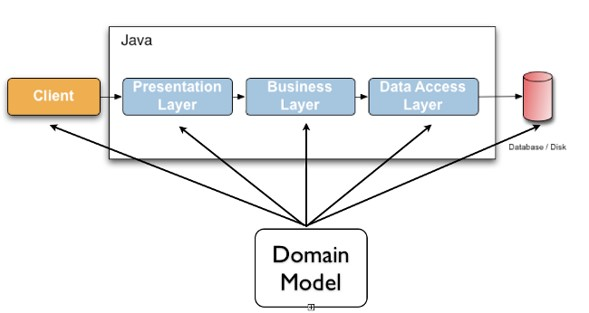
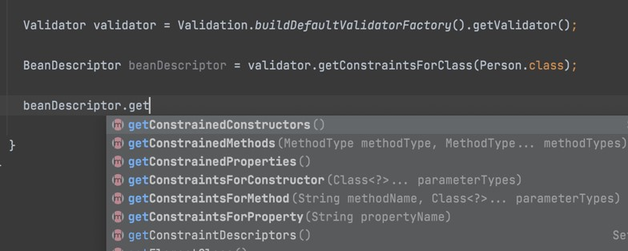

# Java Validation

## Sebelum Belajar

- Java OOP
- Java Generic
- Java Collection
- Apache Maven
- Java Date & Time API
- Java Unit Test
- Java Reflection

## Agenda

- Pengenalan Bean Validation
- Validator
- Constraint
- Constraint Violation
- Message Interpolation
- Grouping
- Custom Validation
- Metadata
- Dan lain-lain

## #1 Penegenalan Bean Validation

- Bean Validation merupakan standard spesifikasi untuk melakukan validation di Java
- Bean Validation sendiri merupakan spesifikasi yang masuk ke dalam teknologi Java Enterprise / Jakarta Enterprise
- Dengan Bean Validation, kita bisa membuat kode validation yang standard di Java
- <https://jakarta.ee/specifications/bean-validation/>

### Hibernate Validator

- Bean Validation hanyalah spesifikasi standard, isinya hanyalah kumpulan kontrak Interface dan Annotation, mirip seperti JDBC (Java Database Connectivity)
- Untuk implementasinya, kita butuh Driver untuk Bean Validation
- Hibernate Validator adalah salah satu driver atau implementasi Bean Validation yang paling populer saat ini
- <https://hibernate.org/validator/>

### Seblum Menggunakan Bean Validation



### Menggunakan Bean Validation



### Jakarta Bean Validation

- Saat ini versi terbaru dari Bean Validation adalah versi 3, sedangkan masih banyak yang menggunakan Bean Validation versi 2
- Bean Validation versi 2 masih menggunakan nama Java Enterprise, sedangkan Bean Validation versi 3 sudah menggunakan nama Jakarta
- Oleh karena itu saat ini, banyak package untuk Bean Validation sudah berubah, dari yang sebelumnya menggunakan package `javax.validation` menjadi `jakarta.validation`
- Oleh karena itu jangan bingung jika masih menggunakan Bean Validation versi 2, tinggal diubah nama package nya saja

## #2 Membuat Project

- <https://start.spring.io/>

### Dependency Bean Validation

```xml
<dependency>
	<groupId>jakarta.validation</groupId>
	<artifactId>jakarta.validation.api</artifactId>
	<version>3.0.0</version>
</dependency>
```

### Dependency Hibernate Validator

```xml
<dependency>
	<groupId>org.hibernate.validator</groupId>
	<artifactId>hibernate-validator</artifactId>
	<version>7.0.1.Final</version>
</dependency>
<dependency>
	<groupId>org.glassfish</groupId>
	<artifactId>jakarta.el</artifactId>
	<version>4.0.1</version>
</dependency>
```

## #3 Validator

- Validator adalah class utama dalam Bean Validation
- Validator digunakan sebagai object untuk mengeksekusi validation
- Validator adalah object yang berat, oleh karena itu sebaiknya hanya dibuat satu kali saja dalam aplikasi
- <https://jakarta.ee/specifications/bean-validation/3.0/apidocs/jakarta/validation/validator>

### ValidatorFactory

- Validator merupakan sebuah Interface, untuk membuatnya kita butuh bantuan object `ValidatorFactory`
- ValidatorFactory merupakan sebuah interface yang digunakan untuk membuat object-object yang ada di Bean Validation
- Salah satu method nya adalah `getValidator()`, yang digunakan untuk mendapatkan object Validator
- ValidatorFactory cukup dibuat sekali di setiap aplikasi, karena object ini merupakan object yang berat, dan untuk membuatnya kita bisa menggunakan class Validation dan method `buildDefaultValidatorFactory()`

### Kode : Membuat Validator

```java
@Test
void testValidator() {
	ValidatorFactory validatorFactory = Validation.buildDefaultValidatorFactory();

	Validator validator = validatorFactory.getValidator();
	assertNotNull(validator);

	validatorFactory.close();
}
```

## #4 Constraint

### Manual Validation

- Sebelum menggunakan Bean Validation, untuk melakukan validasi di Java, biasanya kita lakukan secara manual
- Biasanya kita menggunakan if else untuk melakukan pengecekan
- Dan jika terjadi validasi error, biasanya kita akan buat exception terjadi
- Pada Bean Validation, cara kerjanya berbeda, kita tidak butuh melakukan validasi secara manual lagi, validasi di Bean Validation menggunakan Annotation yang bisa kita simpan pada Field, Method, Parameter dan lain-lain

### Constraint

- Constraint merupakan Annotation yang digunakan sebagai penanda untuk target yang kita tambahkan (misal Field, Method, dan lain-lain)
- Bean Validation sudah menyediakan banyak sekali Constraint yang bisa langsung kita gunakan
- Jika kita butuh validasi yang berbeda, kita juga bisa membuat constraint secara manual, yang akan kita bahas nanti di chapter tersendiri
- Semua Constraint di Bean Validation terdapat di package `jakarta.validation.constrains`
- <https://jakarta.ee/specifications/bean-validation/3.0/apidocs/jakarta/validation/constraints/package-summary.html>

### Kode : Class dengan Constraint

```java
public class Person {

	@NotBlank(message = "First name can not blank")
	@Size(max = 20, message = "First name length max must 100 characters")
	private String firstName;

	@NotBlank(message = "Last name can not blank")
	@Size(max = 20, message = "Last name length max must 100 characters")
	private String lastName;

}
```

## #5 Constraint Violation

- Setelah kita menambahkan annotation Constraint ke class yang akan kita validasi, selanjutnya kita bisa mulai melakukan validasi terhadap object class tersebut menggunakan method `validate()` milik class `Validator`
- Hasil kembalian dari method `validate()` adalah `Set<ConstraintViolation>`, dimana ConstraintViolation tersebut merupakan representasi kesalaha dari constraint
- Jika terdapat kesalahan, otomatis terdapat ConstraintViolation, namun jika tidak ada kesalahan, maka tidak akan terdapat ConstraintViolation, alias Set nya akan berisi data kosong
- <https://jakarta.ee/specifications/bean-validation/3.0/apidocs/jakarta/validation/constraintViolation>

### Kode : Constraint Violation

```java
ValidatorFactory validatorFactory = validation.buildDefaultValidatorFactory();
Validator validator = validatorFactory.getValidator();

Person person = new Person();
Set<ConstraintViolation<Person>> constraintViolations = validator.validate(person);

for (ConstraintViolation<Person> constraintViolation : constraintViolations) {
	System.out.println(constraintViolation.getMessage());
}

validatorFactoryc.close();
```

### Object Metadata

- Jika kita perhatikan, pada Constraint Violation, tidak hanya message error yang bisa kita lihat, kita juga bisa melihat field mana yang error, dari object mana, dan lain-lain
- Ini sangat bagus ketika kita ingin melakukan debugging field mana yang error

### Kode : Object Metadata

```java
for (ConstraintViolation<Person> constraintViolation : constraintViolations) {
	System.out.println(constraintViolation.getMessage());
	System.out.println(constraintViolation.getLeafBean());
	System.out.println(constraintViolation.getConstraintDescriptor().getAnnotaion());
	System.out.println(constraintViolation.getInvalidValue());
	constraintViolation.getPropertyPath().forEach(node -> System.out.println(node.getName()));
}
```

## #6 Nested Validation

- Secara default, jika terdapat nested object, Bean Validation tidak akan melakukan validasi terhadap data object tersebut
- Misal kita punya class Person, dimana memiliki field address dengan tipe class Address, secara default isi dalam class Address tidak akan divalidasi
- Jika kita ingin melakukan validasi terhadap nested object tersebut, kita perlu menambahkan annotation `@Valid`
- `@Valid` juga bisa digunakan untuk nested object yang terdapat di dalam Array atau Collection
- <https://jakarta.ee/specifications/bean-validation/3.0/apidocs/jakarta/validation/valid>

### Kode : Class Address

```java
public class Address {

	@NotBlank(message = "address street can not blank")
	private String street;

	@NotBlank(message = "address city can not blank")
	private String city;

	@NotBlank(message = "address country can not blank")
	private String country;
}
```

### Kode : Class Person

```java
public class Person {

	@NotBlank(message = "first name can not blank")
	@Size(max = 20, message = "first name length max must 100 characters")
	private String firstName;

	@NotBlank(message = "last name can not blank")
	@Size(max = 20, message = "last name length max must 100 characters")
	private String lastName;

	@NotNull(message = "address can not null")
	@Valid
	private address Address;

}
```

### Kode : Nested Validation

```java
Person person = new Person();
person.setAddress(new Address());

Set<ConstraintViolation<Person>> constraintViolations = validator.vaildate(person);

for (ConstraintViolation<Person> constraintViolation : constraintViolations) {
	System.out.println(constraintViolation.getMessage());
	System.out.println(constraintViolation.getLeafBean());
	System.out.println(constraintViolation.getConstraintDescriptor().getAnnotaion());
	System.out.println(constraintViolation.getInvalidValue());
	constraintViolation.getPropertyPath().forEach(node -> System.out.println(node.getName()));
}
```

## #7 Hibernate Validator Constraint

- Selain Annotation Constraint yang terdapat di Bean Validation
- Hibernate Validator juga menyediakan Constraint tambahan
  Kita bisa melihat nya di package `org.hibernate.validator.constraints`
- <https://docs.jboss.org/hibernate/stable/validator/api/org/hibernate/validator/constraints/package-summary.html>

## Kode : Payment Class

```java
public class Payment {

	@NotBlank(message = "order is must not Blank")
	private String orderId;

	@NotBlank(message = "order is must not Blank")
	@Range(min = 10000, max = 100_000_000, message = "amount must between 10000 and 100000000")
	private Long amount;

	@NotBlank(message = "credit card must not blank")
	@LuhnCheck(message = "credit card must valid number")
	private String creditCard;
}
```

### Kode : Hibernate Validator Constraint

```java
Payment payment = new Payment();
payment.serCreditCard("wrong");

Set<ConstraintViolation<Payment>> constraintViolations = validator.vaildate(payment);

for (ConstraintViolation<Payment> constraintViolation : constraintViolations) {
	System.out.println(constraintViolation.getMessage());
	System.out.println(constraintViolation.getLeafBean());
	System.out.println(constraintViolation.getConstraintDescriptor().getAnnotaion());
	System.out.println(constraintViolation.getInvalidValue());
	constraintViolation.getPropertyPath().forEach(node -> System.out.println(node.getName()));
}
```

## #8 Grouping Constraints

- Secara default, saat Validator melakukan validasi, validator akan memvalidasi semua field yang memiliki constraint
- Kadang, ada saatnya misal kita ingin melakukan pengecekan beberapa hal saja pada kondisi tertentu, misal terdapat satu class yang digunakan untuk beberapa aksi, sehingga membutuhkan kombinasi validasi yang berbeda
- Dalam kasus ini, kita bisa menggunakan Grouping Constraints
- Grouping Constraint merupakan teknik mengelompokkan constraint yang terdapat di class
- Dengan menambahkan group, saat melakukan validasi, kita bisa memilih group mana yang akan divalidasi
- Setiap constraint bisa memiliki lebih dari satu grup

### Kode : Membuat Group

```java
public interface CreditCardPaymentGroup {

}

public interface VirtualAccountPaymentGroup {

}
```

### Kode : Payment Class

```java
public class Payment {

	@NotBlank(
		groups = {CreditCardPaymentGroup.class, VirtualAccountPaymentGroup.class},
		message = "order is must not Blank"
	)
	private String orderId;

	@NotBlank(
		groups = {CreditCardPaymentGroup.class, VirtualAccountPaymentGroup.class},
		message = "order is must not Blank"
	)
	@Range(
		groups = {CreditCardPaymentGroup.class, VirtualAccountPaymentGroup.class},
		min = 10000, max = 100_000_000, message = "amount must between 10000 and 100000000"
	)
	private Long amount;

	@NotBlank(groups = {CreditCardPaymentGroup.class}, message = "credit card must not blank")
	@LuhnCheck(groups = {CreditCardPaymentGroup.class}, message = "credit card must valid number")
	private String creditCard;

	@NotBlank(groups = {VirtualAccountPaymentGroup.class}, message = "virtual account must not blank")
	private String virtualAccount;
}
```

### Kode : Validasi Credit Card

```java
Payment payment = new Payment();
payment.serCreditCard("wrong");

Set<ConstraintViolation<Payment>> constraintViolations = validator.vaildate(payment, CreditCardPaymentGroup.class);

for (ConstraintViolation<Payment> constraintViolation : constraintViolations) {
	System.out.println(constraintViolation.getMessage());
	System.out.println(constraintViolation.getLeafBean());
	System.out.println(constraintViolation.getConstraintDescriptor().getAnnotaion());
	System.out.println(constraintViolation.getInvalidValue());
	constraintViolation.getPropertyPath().forEach(node -> System.out.println(node.getName()));
}
```

### Kode : Validasi Virtual Account

```java
Payment payment = new Payment();

Set<ConstraintViolation<Payment>> constraintViolations = validator.vaildate(payment, VirtualAccountPaymentGroup.class);

for (ConstraintViolation<Payment> constraintViolation : constraintViolations) {
	System.out.println(constraintViolation.getMessage());
	System.out.println(constraintViolation.getLeafBean());
	System.out.println(constraintViolation.getConstraintDescriptor().getAnnotaion());
	System.out.println(constraintViolation.getInvalidValue());
	constraintViolation.getPropertyPath().forEach(node -> System.out.println(node.getName()));
}
```

## #9 Group Sequence

- Saat kita melakukan validasi dengan beberapa group, tidak ada jaminan bahwa sebuah group akan dijalankan sebelum group yang lain
- Bean Validation memiliki annotation `GroupSequence`, ini digunakan untuk menentukan tahapan grup mana terlebih dahulu yang akan di validasi
- Kita bisa membuat group baru, lalu tambahkan annotation `@GroupSequence`, atau langsung di class nya
- Saat terjadi error validasi pada sebuah group, maka secara otomatis tidak akan dilanjutkan ke group selanjutnya

### Kode : Payment Group

```java
GroupSequence(
	value = {
		Default.class,
		CreditCardPaymentGroup.class,
		VirtualAccountPaymentGroup.class
	}
)
public interface PaymentGroup {

}
```

### Kode : Group Sequence

```java
Payment payment = new Payment();

Set<ConstraintViolation<Payment>> constraintViolations = validator.vaildate(payment, PaymentGroup.class);

for (ConstraintViolation<Payment> constraintViolation : constraintViolations) {
	System.out.println(constraintViolation.getMessage());
	System.out.println(constraintViolation.getLeafBean());
	System.out.println(constraintViolation.getConstraintDescriptor().getAnnotaion());
	System.out.println(constraintViolation.getInvalidValue());
	constraintViolation.getPropertyPath().forEach(node -> System.out.println(node.getName()));
}
```

## #10 Group Conversion

- Kadang ada kasus dimana terdapat sebuah class yang sudah memiliki field group, namun ternyata kita membutuhkan class tersebut di embed di class lain, sedangkan class lain menggunakan group berbeda
- Pada kasus seperti ini, kita bisa melakukan konversi grup
- Untuk melakukan konversi group, kita bisa menggunakan annotation `@ConvertGroup`, lalu tentukan dari group apa ke group apa

### Kode : Class Customer

```java
public class Customer {

	@NotBlank(message = "email must not blank")
	@Email(message = "email must valid format")
	private String email;

	@NotBlank(message = "name must not blank")
	private String name;

}
```

### Kode : Class Payment

```java
public class Payment {

	@Valid
	@NotNull(
		groups = {CreditCardPaymentGroup.class, VirtualAccountPaymentGroup.class},
		message = "customer most not null"
	)
	@ConvertGroup(from = CreditCardPaymentGroup.class, to = Default.class)
	@ConvertGroup(from = VirtualAccountPaymentGroup.class, to = Default.class)
	private Customer customer;

	@NotBlank(
		groups = {CreditCardPaymentGroup.class, VirtualAccountPaymentGroup.class},
		message = "order id most not null"
	)
	private String orderId;
}
```

### Kode : Group Conversion

```java
Payment payment = new Payment();
payment.setCustomer(new Customer());

Set<ConstraintViolation<Payment>> constraintViolations = validator.vaildate(payment, CreditCardPaymentGroup.class);

for (ConstraintViolation<Payment> constraintViolation : constraintViolations) {
	System.out.println(constraintViolation.getMessage());
	System.out.println(constraintViolation.getLeafBean());
	System.out.println(constraintViolation.getConstraintDescriptor().getAnnotaion());
	System.out.println(constraintViolation.getInvalidValue());
	constraintViolation.getPropertyPath().forEach(node -> System.out.println(node.getName()));
}
```

## #11 Payload

- Secara default aturan Annotation Constraint di Bean Validation selain memiliki method `message()` dan `groups()`, ada juga `payload()`
- Untuk apa `payload()`?
- Method `payload()` itu sendiri sebenarnya tidak digunakan sama sekali oleh Bean Validation, namun method ini bisa digunakan oleh kita untuk menambah informasi ketika menggunakan constraint
- <https://jakarta.ee/specifications/bean-validation/3.0/apidocs/jakarta/validation/payload>

### Kode : NotBlank Constraint

```java
public @interface NotBlank {

	String message() default "{jakarta.validation.constraints.NotBlank.message}";

	Class<?>[] groups() default { };

	Class<? extends Payload[]> payload() default { };
}
```

### Membuat Payload

- Sekarang kita akan coba membuat sebuah payload yang sederhana
- Payload yang akan kita buat adalah sebuah class dimana jika terjadi validation error, kita ingin gunakan payload ini untuk mengirim misal email untuk memberitahu jika terjadi error

### Kode : Email Error Payload

```java
public class EmailErrorPayload implements Payload {

	public void sendEmail(ConstraintViolation<?> constraintViolation) {
		System.out.println("Send email because error : " + constraintViolation.getMessage());
	}
}
```

### Kode : Payment Class

```java
@NotBlank(groups = { CreditCardPaymentGroup.class }, message = "credit card must not blank")
@LuhnCheck(groups = { CreditCardPaymentGroup.class }, message = "credit card must valid number", payload = { EmailErrorPayload.class })
private String creditCard;

@NotBlank(groups = { VirtualAccountPaymentGroup.class }, message = "virtual account must not blank")
private String virtualAccount;
```

### Kode : Menggunakan Payload

```java
Payment payment = new Payment();
payment.setCreditCard("wrong");

Set<ConstraintViolation<Payment>> violations = validator.vaildate(payment, CreditCardPaymentGroup.class);

for (ConstraintViolation<Payment> violation : violations) {
	violation.getConstraintDescriptor().getPayload().forEach(aClass -> {
		if (aClass == EmailErrorPayload.class) {
			EmailErrorPayload emailErrorPayload = new EmailErrorPayload();
			emailErrorPayload.sendEmail(violation);
		}
	});
}
```

## #12 Method Validation

- Sampai saat ini kita baru hanya melakukan validasi pada object yang kita buat secara manual
- Bean Validation sendiri bisa digunakan untuk melakukan validasi di Method, baik itu Method Parameter atau Return Value
- Fitur ini memudahkan kita karena cukup menambahkan Annotation `Constraint` di Method Parameter

### ExecutableValidator

- Untuk melakukan validasi di Method, kita butuh object `ExecutableValidator`
- Untuk membuat ExecutableValidator, kita bisa gunakan method `forExecutables()` di Validator
- <https://jakarta.ee/specifications/bean-validation/3.0/apidocs/jakarta/validation/executable/executablevalidator>

### Kode : Person Class

```java
public void sayHello(@NotBlank(message = "name must not blank") String name) {
	System.out.println("Hi " + name + ", my name is " + this.firstName);
}

@NotBlank(message = "NotBlank")
public String getFullName() {
	return firstName + " " + lastName;
}
```

### Kode : Validate Method Parameter

```java
ExecutableValidator executableValidator = validator.forExecutables();

Person person = new Person();
String name = "";

Method method = person.getClass().getMethod("sayHello", String.class);


Set<ConstraintViolation<Person>> violations = executablevalidator.validateParameters(person, method, new Object[]{name});

for (ConstraintViolation<Payment> violation : violations) {
	System.out.println(violation.getMessage());
	System.out.println(violation.getLeafBean());
	System.out.println(violation.getConstraintDescriptor().getAnnotaion());
	System.out.println(violation.getInvalidValue());
	violation.getPropertyPath().forEach(node -> System.out.println(node.getName()));
}
```

### Kode : Validate Method Return Value

```java
ExecutableValidator executablevalidator = validator.forExecutables();
Person person = new Person();
person.setFirstName("");
person.setLastName("");
Method method = person.getClass().getMethod("getFullName");

String returnValue = person.getFullName();

Set<ConstraintViolation<Person>> violations = executablevalidator.validateReturnValue(person, method, returnValue);
```

## #13 Constructor Validation

- ExecutableValidator tidak hanya bisa digunakan untuk melakukan validasi terhadap Method Parameter dan Method Return Value, tapi juga ke Constructor Parameter dan Constructor Return Value
- Cara penggunaannya sama dengan melakukan validasi di Method, yang berbeda hanya method yang digunakannya

### Kode : Class Person

```java
@Valid
public Person() {

}

@Valid
public Person(@NotBlank(message = "first name must not blank") String firstName,
			@NotBlank(message = "last name must not blank") String lastName,
			@NotBlank(message = "address must not null") Address address) {
	this.firstName = firstName;
	this.lastName = lastName;
	this.address = address;
}
```

### Kode : Validate Constructor Parameter

```java
Class<Person> personClass = Person.class;
Constructor<Person> constructor = personClass.getConstructor(String.class, String.class, Address.class);

Set<ConstraintViolation<Person>> violations = executableValidator.validateConstructorParameters(constructor, new Object[]{"", "", null});

for (ConstraintViolation<Person> violation : violations) {
	System.out.println(violation.getMessage());
	System.out.println(violation.getLeafBean());
	System.out.println(violation.getPropertyPath());
}
```

### Kode : Validate constructor Return Value

```java
Class<Person> personClass = Person.class;
Constructor<Person> constructor = personClass.getConstructor(String.class, String.class, Address.class);

Person person = new Person("", "", null);

Set<ConstraintViolation<Person>> violations = executableValidator.validateConstructorReturnValue(constructor, person);

for (ConstraintViolation<Person> violation : violations) {
	System.out.println(violation.getMessage());
	System.out.println(violation.getLeafBean());
	System.out.println(violation.getPropertyPath());
}
```

## #14 Message Interpolation

- Message Interpolation merupakan proses membuat pesan error ketika terjadi kesalahan pada constraint
- Secara default, pesan kesalahan akan diambil dari method `message()` milik constraint

### Special Character

- Message Interpolation memiliki karakter spesial yaitu `{` dan `}`, oleh karena itu jika kita ingin menggunakan karakter tersebut, kita perlu tambahkan `\` didepannya, misal `\{` atau `\}`
- Kadang ketika kita membuat pesan kesalahan, kita ingin mengambil value dari constraint nya, kita bisa menambahkan `{method}` yang terdapat di constraint nya, secara otomatis nilai di constraint akan ditambahkan ke message nya

### Kode : Class Order

```java
public class Order {

	@NotBlank(message = "order id must not blank")
	@Size(min = 1, max = 10, message = "order is must between {min} and {max} characters")
	private String id;

	@Range(min = 10000, max = 100_000_000, message = "order amount must between {min} and {max}")
	private Long amount;

}
```

### Kode : Message Interpolation

```java
Validator validator = validatorFactory.getValidator();

Order order = new Order();
order.setAoumt(10L);
order.setId("1221212121");

Set<ConstraintViolation<Order>> violations = validator.validate(order);
for (ConstraintViolation<Order> violation : violations) {
	System.out.println(violation.getMessageTemplate());
	System.out.println(violation.getMessage());
}
```

### Resource Bundle

- Selain hardcode pesan di dalam method `message()`, Bean Validation juga mendukung resource bundle, dimana kita bisa menyimpan semua pesan kesalahan di file properties
- Hal ini sangat bagus ketika kita butuh mendukung pesan kesalahan dengan beberapa bahasa
- Caranya kita cukup buat file `ValidationMessages.properties`

### Kode : File `ValidationMessages.properties`

```txt
order.id.notblank=order id must not blank
order.id.size=order id must between {min} and {max} characters
order.amount.range=order amount must berween {min} and {max}
```

### Kode : Order Class

```java
public class Order {

	@NotBlank(message = "{order.id.notblank}")
	@Size(min = 1, max = 10, message = "{order.id.size}")
	private String id;

	@Range(min = 10000, max = 100_000_000, message = "{order.amount.range}")
	private Long amount;
}
```

## #15 Message Internationalization

- Secara default saat kita menggunakan Resource Bundle, Locale yang akan dipilih adalah `Locale.getDefault()`
- Jadi jika kita ingin mengubah Locale untuk Resource Bundle, kita harus mengubah default Locale nya

### Kode : `ValidationMessages_id_ID.properties`

```txt
order.id.notblank=id pesanan tidak boleh kosong
order.id.size=jumlah karakter id pesanan harus antara {min} dan {max} karakter
order.amount.range=jumlah harga pesanan harus antara {min} dan {max}
```

### Kode : Message Internationalization

```java
ValidatorFactory validatorFactory = Validation.buildDefaultValidatorFactory();
alidator validator = validatorFactory.getValidator();
Locale.setDefault(new Locale("in", "ID"));

Order order = new Order();
order.setAoumt(10L);
order.setId("1221212121");

Set<ConstraintViolation<Order>> violations = validator.validate(order);
for (ConstraintViolation<Order> violation : violations) {
	System.out.println(violation.getMessageTemplate());
	System.out.println(violation.getMessage());
}
```

### MessageInterpolator

- Salah satu yang cara lumayan sulit, namun lebih flexible adalah menggunakan `MessageInterpolator` secara langsung
- Cara ini sangat flexible, tapi sangat sulit karena kita harus membuat context secara manual untuk MessageInterpolator
- Kita tidak perlu mengubah Default Locale, hanya cukup gunakan parameter Locale di Message Interpolator
- <https://jakarta.ee/specifications/bean-validation/3.0/apidocs/jakarta/validation/messageinterpolator>

### Kode : Message Interpolator

```java
MessageInterpolator messageInterpolator = validatorFactory.getMessageInterpolator();

Set<ConstraintViolation<Order>> violations = validator.validate(order);
for (ConstraintViolation<Order> violation : violations) {
	System.out.println(violation.getMessageTemplate());
	MessageInterpolator.Context context = new MessageInterpolator(
		violation.getConstraintDescriptor(), violations.getInvalidValue(), violation.getRootBeanClass(),
		violation.getPropertyPath(), violation.getConstraintDescriptor().getAttributes(),
		violation.getConstraintDescriptor().getAttributes(),
		ExpressionLanguagaFeatureLevel.VARIABLES, true
	);
	System.out.println(messageInterpolator.interpolate(
		violation.getMessageTemplate(), context, new Locale("in"m "ID")
	));
}
```

## #16 Custom Constraint

- Sampai saat ini, kita hanya menggunakan Constraint Built-In yang terdapat di Bean Validation dan Hibernate Validator
- Bagaimana jika ternyata Constraint Built-In tersebut tidak bisa memenuhi kebutuhan validasi kita?
- Maka kita bisa membuat Constraint sendiri, atau istilahnya Custom Constraint
- Untuk membuat Constraint, kita perlu mengikuti aturan nya, pertama kita buat Constraint Annotation, lalu kita buat ConstraintValidator

### Check Case Constraint

- Misal, sekarang kita akan membuat sebuah constraint validation yang digunakan untuk melakukan pengecekan case sebuah string
- Agar dinamis, kita akan tambahkan method `mode()` nya di constraint, yang bisa dipilih apakah harus UPPER atau lower

### Kode : Enum CaseMode

```java
public enum CaseMode {
	UPPER,LOWER
}
```

### Kode : Annotation CheckCase

```java
@Documented
@Constraint(validatedBy = {CheckCaseValidator.class})
@Target({FIELD})
@Retention(RUNTIME)
public @interface CheckCase {

	CaseMode mode();

	String message() default "value is invalid";

	Class<?>[] groups() default {};

	Class<? extends Payload>[] payload() default {};
}
```

### Kode : CLass CheckCaseValidator (1)

```java
public class CheckCaseValidator implements ConstraintValidator<CheckCase, String> {

	private CaseMode caseMode;

	@Override
	public void initialize(CheckCase constraintAnnotation) {
		this.caseMode = constraintAnnotation.mode();
	}

	@Override
	public boolean isValid(String value, ConstraintValidatorContext context) {
		if (value == null) return true; // skip validation if value is null

		if (caseMode == CaseMode.UPPER) {
			return value.equals(value.toUpperCase());
		} else if (CaseMode == CaseMode.LOWER) {
			return value.equals(value.toLowerCase());
		}

		return false;
	}
}
```

### Kode : Order Class

```java
public class Order {

	@CheckCase(mode = CaseMode.UPPER, message = "{order.id.upper}")
	@NotBlank(message = "{order.id.notblank}")
	@Size(min = 1, max = 10, message = "{order.id.size}")
	private String id;

	@Range(min = 10000, max = 100_000_000, message = "{order.amount.range}")
	private Long amount;

}

```

### Kode : Custom Constraint Validation

```java
Order order = new Order();
order.setId("abcd");

Set<ConstraintViolation<Order>> violations = validator.validate(order);
for (ConstraintViolation<Order> violation : violations) {
	System.out.prinln(violation.getMessage());
}
```

## #17 Constraint Composition

- Jika kita perhatikan pada `Order.id`, kita lihat terdapat 3 constraint annotation, `@Size`, `@NotBlank` dan `@CheckCase`. Bahkan pada skenario tertentu, bisa jadi akan sangat banyak sekali constraint pada sebuah field, yang semakin lama akan semakin membingungkan
- Bean Validation mendukung Constraint `Composition`, dimana kita bisa membuat Constraint baru yang didalamnya sebenarnya adalah kumpulan Constraint lainnya
- Caranya sangat mudah, kita cukup membuat Constraint Annotation, lalu tambahkan Constraint Annotation lain pada Constraint yang kita buat

### Kode : Constraint CheckOrderId

```java
@CheckCase(mode = CaseMode.UPPER, message = "{order.id.upper}")
@NotBlank(message = "{order.id.notblank}")
@Size(min = 1, max = 10, message = "{order.id.size}")
@Documented
@Constraint(validatedBy = {})
@Target({FIELD, ANNOTATION_TYPE})
@Retention(RUNTIME)
public @interface CheckOrderId {

	String message() default "valud is invalid";
}
```

### Kode : Order Class

```java
public class Order {

	@CheckOrderId
	private String id;
}
```

### `@ReportAsSingleViolation`

- Secara default, semua Constraint di Constraint Composite akan dieksekusi, jadi jika misal terdapat lebih dari satu error, maka semua error akan diberitahukan
- Kadang ada baiknya, jika misal terdapat satu constraint yang error, kita tidak perlu lakukan pengecekan ke constraint berikutnya
- Untuk melakukan hal ini, kita bisa tambahkan annotation `@ReportAsSingleViolation` pada Composite Constraint Annotation

### Kode : @ReportAsSingleViolation

```java
@CheckCase(mode = CaseMode.UPPER, message = "{order.id.upper}")
@NotBlank(message = "{order.id.notblank}")
@Size(min = 1, max = 10, message = "{order.id.size}")
@Documented
@Constraint(validatedBy = {})
@Target({FIELD, ANNOTATION_TYPE})
@Retention(RUNTIME)
@ReportAsSingleViolation
public @interface CheckOrderId {

	String message() default "valud is invalid";
}
```

## #18 Class-Level Constraint

- Sebelumnya kita hanya membuat Constraint pada Field, Method, dan Constructor
- Constraint juga bisa kita tambahkan pada level class
- Hal ini kadang bermanfaat, seperti misal kita ingin membandingkan lebih dari satu Field misalnya
- Untuk membuat Class-Level Constraint, kita cukup tambahkan Annotation Constraint pada Class, dan pastikan saat membuat Constraint, tambahkan target Class

### Kode : Register Class

```java
@CheckPassword(message = "password must same with retypePassword")
public class Register {

	@NotBlank(message = "username must not blank")
	private String username;

	@NotBlank(message = "password must not blank")
	private String password;

	@NotBlank(message = "retype password must not blank")
	private String retypePassword;
}
```

### Class : Class Password Constraint

```java
@Documented
@Constraint(validatedBy = {CheckPasswordValidator.class})
@Target({TYPE})
@Retention(RUNTIME)
public @interface CheckPassword {

	String message() default "password must same with retypePassword";

	CLass<?>[] groups() default {};

	Class<? extends Pauload>[] pauload() default {};
}
```

### Kode : Check Password Validator

```java
public class CheckPasswordValidator implements ConstraintValidator<CheckPassword, Register> {

	@Override
	public boolean isValid(Register value, ConstraintValidatorContext context) {
		if (value.getPassword() == null || valud.getRetypePassword() == null) {
			return true; // skip validation
		}
		return value.getPassword().equals(value.getRetypePassword());
	}
}
```

### Kode : CLass Level Constraint

```java
Validator validator = Validation.buildDefaultValidatorFactory().getValidator();

Register register = new Register();
register.setPassword("rahasia");
register.setRetypePassword("rahasia12345");

Set<ConstraintViolation<Register>> violations = validator.validator(register);
for (ConstraintViolation<Register> violation : violations) {
	System.out.prinln(violation.getMessage());
}
```

## #19 Cross-Parameter Constraint

- Untuk melakukan validasi beberapa Field, kita bisa menggunakan fitur Class-Level Constraint
- Sekarang bagaimana jika kita ingin melakukan validasi beberapa Parameter? Misal pada - Method Parameter atau Constructor Parameter?
- Hal ini tidak bisa menggunakan Class-Level Constraint, namun ada cara sendiri untuk melakukan hal ini
- Yaitu dengan menggunakan Annotation `@SupportedValidationTarget`
- Kita bisa menggunakan @SupportedValidationTarget pada ConstraintValidator, untuk melakukan validasi semua parameter di Method atau Constructor

### Kode : Check Password Parameter Constraint

```java
@Documented
@Constraint(validatedBy = {CheckPasswordParameterValidator.class})
@Target({METHOD, CONSTRUCTORS})
@Rentention(RUNTIME)
public @interface CheckPasswordParameter {

	int passwordParam();

	int retypePasswordParam();

	String message() default "password is not same with retypePassword";
}
```

### Kode : Check Password Parameter Validator

```java
@SupportedValidationTarget(ValidationTarget.PARAMETERS)
public class CheckPasswordParameterValidator implements ConstraintValidator<CheckPasswordParameter, Object[]> {

	private int passwordParam;

	private int retypePasswordParam;

	@Override
	public void initialize(CheckPasswordParameter constraintAnnotation) {
		this.passwordParam = constraintAnnotation.passwordParam();
		this.retypePasswordParam = constraintAnnotation.retypePasswordParam();
	}

	@Override
	public boolean isValie(Object[] value, ConstraintValidatorContext context) {
		String password = (Strin) value[passwordParam];
		String retypePassword = (Strin) value[retypePasswordParam];

		if (password == null || retypePassword == null) {
			return true; // skip validation
		}

		return password.equals(retypePassword);
	}
}
```

### Kode : Register Method

```java
public class UserService {

	@CheckPasswordParameter(
		passwordParam = 1,
		retypePasswordParam = 2
	)
	public void register(
		@NotBlank(message = "username must not blank") String username,
		@NotBlank(message = "password must not blank") String password,
		@NotBlank(message = "retype password must not blank") String retypePassword,
		) {
		// TODO register user
	}
}
```

### Kode : Cross-Parameter Constraint

```java
UserService userService = new UserService();
Class<? extends UserService> userServiceClass = userService.getClass();
Method register = userServiceClass.getMethod("register", String.class, String.class, String.class);

ExecutableValidator executableValidator = validator.forExecutables();
Set<ConstraintViolation<UserService>> violations = executableValidator.
	validateParameters(userService, register, new Object[]{
		"username", "password", "passwordLagi"
	});

for (ConstraintViolation<UserService> violation : violations) {
	System.out.println(violation.getMessage());
}
```

## #20 Constraint Validator Context

- Saat kita membuat ConstraintValidator, pada method isValid terdapat parameter `ConstraintValidatorContext`
- Sebenarnya dalam keadaan ideal, kita tidak butuh menggunakan parameter tersebut, tapi pada materi ini kita akan bahas kegunaannya
- ConstraintValidatorContext digunakan untuk membuat custom message atau path, jika dirasa memang diperlukan
- Contoh pada kasus Class-Level Constraint, ketika terjadi error, maka secara default path nya adalah root objectnya, kadang-kadang kita ingin memberi tahu field mana yang error. Pada kasus ini kita bisa menggunakan ConstraintValidatorContext
- <https://jakarta.ee/specifications/bean-validation/3.0/apidocs/jakarta/validation/constraintvalidatorcontext>

### Kode : Class-Level Constraint

```java
Register register = new Register();
register.setPassword("rahasia");
register.setRetypePassword("rahasia1234");

Set<ConstraintViolation<Register>> violations = validator.validate(register);
for (ConstraintViolation<Register> violation : violations) {
	System.out.println("Message : " + violations.getMessage());
	System.out.println("Path : " + violations.getPropertyPath());
}
```

### Kode : Constraint Validator Constraint

```java
boolean isValid = value.getPassword().equals(value.getRetypePassword());

if (!isValid) {
	context.disableDefaultConstraintViolation();
	context.buildConstraintViolationWithTemplate("password is defferent with retypePassword")
		.addPropertyNode("password")
		.addConstraintViolation();

	context.buildConstraintViolationWithTemplate("retypePassword is different with password")
		.addPropertyNode("retypePassword")
		.addConstraintViolation();
}

return isValid;
```

## #21 Constraint Descriptor

- Pada materi-materi sebelumnya, beberapa kali kita sudah menggunakan Constraint Descriptor, namun belum terlalu detail, seperti contohnya ketika mendapatkan Payload
- ConstraintDescriptor merupakan sebuah interface, yang berisikan informasi tentang Constraint
- Kita bisa mendapatkan informasi seperti Annotation, Group, Validator Class, Message Template, bahkan Annotation Method menggunakan ConstraintDescriptor
- <https://jakarta.ee/specifications/bean-validation/3.0/apidocs/jakarta/validation/metadata/constraintdescriptor>

### Kode : Constraint Descriptor

```java
Validator validator = Validation.buildDefaultValidatorFactory().getValidator();

Person person = new Person();

Set<ConstraintViolation<Person>> violations = validator.validate(person);
for (ConstraintViolation<Person> violation : violations) {
	System.out.println(violation.getConstraintDescriptor().getAnnotaion());
	System.out.println(violation.getConstraintDescriptor().getAttributes());
}
```

## #22 Container Data

- Saat kita membuat class, kadang sering kita gunakan tipe data container, seperti misalnya Optional, Collection, List, Set, Map dan lain-lain
- Secara default, jika kita isi data tersebut dengan data Object, misal `@Valid` `List<Address>`, maka secara otomatis Bean Validation akan melakukan validasi semua data object Address sesuai dengan constraint yang ada di dalam class Address
- Tapi bagaimana jika kita memiliki misal field `List<String>`, atau `Map<String, String>`, bagaimana melakukan validasinya? Misal kita ingin semua data string di List tidak boleh kosong
- Untungnya, Bean Validation mendukung validasi terhadap data container seperti ini

### Kode : Class Person Salah

```java
public class Person {

	@Valid
	@NotBlank(message = "hobbies must not blank")
	private List<String> hobbies;
}
```

### Kode : Validate Container Data

```java
Validator validator = Validation.buildDefaultValidatorFactory().getValidator();

Person person = new Person();
person.setHobbies(Arrays.asList("Read", "Game", ""));

Set<ConstraintViolation<Person>> violations = validator.validate(person);
for (ConstraintViolation<Person> violation : violations) {
	System.out.println(violation.getMessage());
}
```

### Validate Container Data

- Untuk melakukan validasi data jenis container, Bean Validation membutuhkan yang namanya Value Extractor
- Value Extractor ini menjadikan Bean Validation bisa melakukan ekstraksi data dari container
- Secara default, Bean Validation mendukung semua data container yang tersedia di Java, seperti Optional, Collection, List, Iterable, Set dan Map
- Yang kita butuhkan, hanya dengan menambahkan Constraint pada generic type container tersebut

### Kode : Class Person

```java
public class Person {

	private List<@NotBlank(message = "hobbies must not blank") String> hobbies;
}
```

## #23 Value Extraction

- Value Extraction merupakan proses melakukan ekstraksi nilai dari data jenis container (kumpulan data), sehingga nilai-nilai nya bisa di validasi
- Sebelumnya sudah dijelaskan bahwa secara default Bean Validation mendukung value extraction terdapat data container yang ada di Java
- Bagaimana jika kita misal menggunakan data container sendiri atau misal menggunakan library bukan bawaan Java? Maka secara otomatis Bean Validation tidak bisa melakukan ekstraksi nilai yang terdapat di container, perlu kita lakukan secara manual
- Cara untuk memberi tahu Bean Validation cara melakukan ekstraksi, adalah dengan cara membuat ValueExtractor sendiri
- <https://jakarta.ee/specifications/bean-validation/3.0/apidocs/jakarta/validation/valueextraction/valueextractor>

### Kode : Data Class

```java
public class Data<T> {

	private T data;

	public T getData() {
		return data;
	}
}
```

### Kode : Data Value Extractor

```java
public class DataValueExtractor implements ValueExtractor<Data<@ExtractedValue ?>> {

	@Override
	public void extractValues(Data<?> originalValue, ValueReceiver receiver) {
		receiver.value(null, originalValue.getData());
	}
}
```

### Kode : Test Data Value Extractor

```java
ValidatorFactory factory = Validation.byDefaultProvider().configure()
	.addValueExtractor(new DataValueExtractor()).buildValidatorFactory();
Validator validator = factory.getValidator();

SampleData sample = new SampleData();
sample.setData(new Data<>());

SEt<ConstraintViolation<SampleData>> violations = validator.validate(sample);
for (ConstraintViolation<SampleData> violation : violations) {
	System.out.println(violation.getMessage());
	System.out.println(violation.getPropertyPath());
}
```

### Multiple Generic Parameter Type

- Secara default, saat kita membuat Value Extractor, annotation `@ExtractedValue` hanya bisa digunakan satu kali
- Oleh karena itu, jika kita membuat container class generic yang menggunakan lebih dari satu generic parameter type, maka kita harus membuat Value Extractor nya sebanyak jumlah generic parameter type nya

### Kode : Entry Class

```java
public class Entry<K, V> {

	private K key;

	private V value;
}
```

### Kode : Entry Value Extractor Key

```java
public class EntryValueExtractorKey implements ValueExtractor<Entry<@ExtractedValue ?, ?>> {

	@Override
	public class extractValues(Entry<?, ?> originalValue, ValueReceiver receiver) {
		receiver.keyedValue(null, "key", originalValue.getKey());
	}
}
```

### Kode : Entry Value Extractor Value

```java
public class EntryValueExtractorValue implements ValueExtractor<Entry<?, @ExtractedValue ?>> {

	@Override
	public class extractValues(Entry<?, ?> originalValue, ValueReceiver receiver) {
		receiver.keyedValue(null, "value", originalValue.getValue());
	}
}
```

### Kode : Sample Entry

```java
public class SampleEntry {

	private Entry<@NotBlank String, @NotBlank String> entry;

	public Entry<String, String> getEntry() {
		return entry;
	}
}
```

### Kode : Multiple Generic Parameter Type

```java
ValidatorFactory factory = Validation.byDefaultProvider().configure()
	.addValueExtractor(new EntryValueExtractorKey())
	.addValueExtractor(new EntryValueExtractorValue()).buildValidatorFactory();

Validator validator = factory.getValidator();

SampleEntry sample = new SampleEntry();
sample.setEntry(new Entry<>());

Set<ConstraintViolation<SampleEntry>> violations = validator.validate(sample);
for (ConstraintViolation<SampleEntry> violation : violations) {
	System.out.println(violation.getMessage());
	System.out.println(violation.getPropertyPath());
}
```

### Container Non Generic

- Rata-rata, biasanya data container itu adalah class generic, namun beberapa kasus mungkin ada juga container yang bukan tipe generic
- Bagaimana untuk menangani hal ini? Untuk menangani hal ini, kita tetap bisa menggunakan `@ExtractedValue`, namun kita perlu memberi tahu tipe data nilai dari container nya

### Kode : Data Integer

```java
public class DataInteger {

	private Integer data;

	public Integer getData() {
		return data;
	}
}
```

### Kode : Data Integer Value Extractor

```java
@UnwrapByDefault
public class DataIntegerValueExtractor implements ValueExtractor<@ExtractedValue(type = Integer.class) DataInteger> {

	@Override
	public void extractValues(DataInteger originalValue, ValueReceiver receiver) {
		receiver.value(null, originalValue.getData());
	}
}
```

### Kode : Sample Data Integer

```java
public class SampleDataInteger {

	@Min(value = 10)
	private DataInteger data;
}
```

### Kode : Value Extractor Non Generic

```java
ValidatorFactory factory = Validation.byDefaultProvider().configure()
	.addValueExtractor(new DataIntegerValueExtractor()).buildValidatorFactory();
Validator validator = factory.getValidator();

SampleDataInteger sample = new SampleDataInteger();
sample.setData(new DataInteger());
sample.getData().setData();

Set<ConstraintViolation<SampleDataInteger>> violations = validator.validate(sample);
for (ConstraintViolation<SampleDataInteger> violation : violations) {
	System.out.println(violation.getMessage());
	System.out.println(violation.getPropertyPath());
}
```

## #24 Constraint Violation Exception

- Bean Validation secara default tidak membuat Exception ketika terjadi validasi error
- Bean Validation hanya mengembalikan error validasi dalam bentuk Set berisi Constraint Violation
- Beberapa framework atau library, kadang menginginkan Exception jika terjadi validasi error
- Kita tidak butuh membuat exception secara manual, Bean Validation sudah menyediakannya, yaitu `ConstraintViolationException`
- <https://jakarta.ee/specifications/bean-validation/3.0/apidocs/jakarta/validation/constraintviolationexception>

### Kode : Constraint Violation Exception

```java
Validator validator = Validation.buildDefaultValidatorFactory().getValidator();

try {
	Person person = new Person();
	Set<ConstraintViolation<Person>> violations = validator.validate(person);
	if (!violations.isEmpty()) {
		throw new ConstraintViolationException(violations);
	}
} catch (ConstraintViolationException e) {
	System.out.prinln(e.getMessage());
}
```

## #25 Metadata

- Materi ini sebenarnya bisa kita tangani dengan menggunakan Reflection
- Namun Bean Validation memberikan fitur untuk mempermudah kita
- Bean Validation memungkinkan kita melihat sebuah constraint yang terdapat di sebuah class
- Kita bisa melihat detail dari constraint tersebut, mirip seperti ketika kita melihat semua struktur class menggunakan Java Reflection
- Metadata untuk constraint, disimpan dalam object `BeanDescriptor`
- <https://jakarta.ee/specifications/bean-validation/3.0/apidocs/jakarta/validation/metadata/beandescriptor>

### Kode : Metadata

```java
Validator validator = Validation.buildDefaultValidatorFactory().getValidator();

BeanDescriptor beanDescriptor = validator.getConstraintsForClass(Person.class);
```



## #26 Materi Selanjutnya

- Java Persistence API
- Java Web
- Java RESTful API
