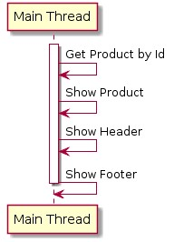
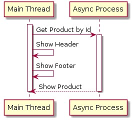
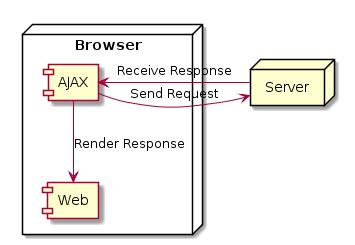
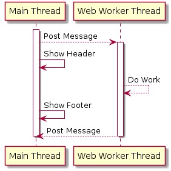

# JavaScript Async

## Sebelum Belajar

- JavaScript Dasar
- JavaScript Object Oriented Programming
- JavaScript Modules
- JavaScript Document Object Model
- Belajar HTTP

## Agenda

- Pengenalan Asynchronous
- Callback
- AJAX
- Promise
- Fetch API
- Async Await
- Web Worker

## #1 Pengenalan Asynchronous

### Apa itu Synchronous?

- Program dalam JavaScript secara default akan dieksekusi baris per baris
- Secara default, proses di JavaScript akan dieksekusi secara Synchronous, artinya baris selanjutnya akan dieksekusi setelah baris sebelumnya selesai dikerjakan
- Proses Synchronous juga biasa disebut `Blocking`, karena harus menunggu tiap proses selesai, baru proses selanjutnya bisa dilakukan

### Contoh Synchronous



### Apa itu Asynchronous?

- Walaupun secara default proses di JavaScript dieksekusi secara Synchronous, namun kita bisa membuatnya menjadi Asynchronous.
- Berbeda dengan proses Synchronous, pada proses Asynchronous, JavaScript tidak akan menunggu proses tersebut selesai, melainkan JavaScript akan melanjutkan baris selanjutnya, tanpa harus menunggu proses Asynchronous selesai.
- Proses Asynchronous juga biasa disebut `Non-Blocking`.

### Contoh Asynchronous



## #2 Callback

### Apa itu Callback?

- Callback, merupakan mekanisme untuk memanggil kembali kode yang ada di program dari proses Async
- Callback biasanya dibuat dalam bentuk function as parameter, dan parameter function tersebut akan dieksekusi saat proses Async selesai
- Dengan menggunakan Callback, program bisa menerima informasi yang dibutuhkan dari proses yang berjalan secara Async

### Async Method

- Ada banyak method Async yang terdapat di JavaScript, yang akan kita bahas kali ini adalah :

- `setTimeout(callback, timeInMilis)`, digunakan untuk menjalankan proses Async sekali dalam waktu tertentu.
- `setInterval(callback, timeInMilis)`, digunakan untuk menjalankan proses Async secara periodik dalam waktu tertentu.

### Kode: setTimeout

```js
const addElement = () => {
	const header = document.createElement("h1");
	header.textContent = "Programmer Zaman Now";

	document.body.appendChild(header);
};

setTimeout(addElement, 5000);
```

### Kode: setInterval

```html
<h1 id="header"></h1>
<script>
	const setTime = () => {
		const header = document.getElementById("header");
		header.textContent = new Date().toString();

		document.body.appendChild(header);
	};

	setInterval(setTime, 1000);
</script>
```

## #3 AJAX

### Apa itu AJAX?

- AJAX singkatan dari Asynchronous JavaScript and XML
- AJAX biasanya digunakan untuk mengambil atau mengirim data ke URL lain
- Untuk membuat AJAX, kita bisa menggunakan class XMLHttpRequest
- <https://developer.mozilla.org/en-US/docs/Web/API/XMLHttpRequest>

### Cara Kerja AJAX



### Kode: Membuat AJAX

```js
const ajax = new XMLHttpRequest();
ajax.open("GET", "api/hello.json");
// ajax.open('GET', 'http://localhost:8080/api/hello.json');

ajax.send();
```

## #4 Menerima Data di AJAX

- AJAX biasanya digunakan untuk mengirim data ke Server atau menerima data dari Server
- Tiap request AJAX yang dilakukan, biasanya kita ingin mendapat informasi response yang diberikan oleh Server
- Kita tidak bisa langsung mengambil response AJAX, karena proses AJAX adalah Async, sehingga kita perlu menunggu sampai proses Async nya selesai.
- Untuk mendapatkan informasi AJAX, kita bisa menggunakan AJAX Callback, yang akan dieksekusi setelah proses AJAX selesai
- Untuk menambahkan AJAX Callback, kita bisa tambahkan pada event load
- <https://developer.mozilla.org/en-US/docs/Web/API/XMLHttpRequest/load_event>
- Dan untuk mengambil datanya dari server, kita bisa menggunakan property `responseText`

### Kode: Menerima Data di AJAX

```js
// ajax.onload = callback; // menggunakan onload
ajax.addEventListener("load", function () {
	const json = JSON.parse(ajax.responseText);
	const response = document.getElementById("response");
	response.textContent = json.response;
	document.body.appendChild(response);
});

ajax.send();
```

## #5 Response Status di AJAX

- AJAX adalah proses komunikasi Client dan Server
- Dalam komunikasi Client dan Server, kita tidak bisa selalu menganggap proses tersebut akan berjalan lancar.
- Akan ada banyak hal-hal yang bisa mengganggu proses AJAX yang bisa menyebabkan error, seperti; koneksi internet bermasalah, error dari server, data dari client tidak valid, dan lain-lain.
- Server biasanya akan mengirimkan HTTP Status Code yang sesuai dengan jenis response nya, seperti yang sudah dibahas di materi HTTP
- Untuk mengetahui status response dari Server, kita bisa menggunakan property `status`
- <https://developer.mozilla.org/en-US/docs/Web/API/XMLHttpRequest/status?

### Kode: Response Status di AJAX

```js
// ajax.onload = callback; // menggunakan onload
ajax.addEventListener("load", function () {
	if (ajax.status === 200) {
		const json = JSON.parse(ajax.responseText);
		displayResponse(json);
	} else {
		displayResponse({
			response: "Error happens",
		});
	}
});

ajax.send();
```

## #6 State di AJAX

- AJAX memiliki tahapan state, dimana kita bisa mendapatkan banyak sekali state di Ajax menggunakan property `readyState`
- Property readyState mengembalikan nilai `number`, dimana tiap number merupakan representasi dari statenya

### Daftar State

| Value | State            | Description                                                    |
| ----- | ---------------- | -------------------------------------------------------------- |
| 0     | UNSENT           | Client has been created. `open()` not called yet.              |
| 1     | OPENED           | `open()` has been called.                                      |
| 2     | HEADERS_RECEIVED | `send()` has been called, and headers and status are available |
| 3     | LOADING          | Downloading, `responseText` holds partial data                 |
| 4     | DONE             | The operation is complete                                      |

### Ready State Change Event

- Jika kita ingin mendengarkan perubahan yang terjadi pada state, kita bisa menggunakan event `readystatechange`
- <https://developer.mozilla.org/en-US/docs/Web/API/XMLHttpRequest/onreadystatechange>

### Kode: Ready State Change Event

```js
const ajax = new XMLHttpRequest();
// ajax.addEventListener('readystatechange', callback);
ajax.onreadystatechange = function () {
	console.info(`Ready State Change ${ajax.readyState}`);
};
```

## #7 Hookbin

- Sebelum kita melanjutkan belajar AJAX, kita perlu bantuan Server sebagai tujuan pengiriman data di AJAX
- Kita akan menggunakan salah satu website yang gratis dan lumayan populer untuk menerima data AJAX yang kita kirim, yaitu Hookbin
- Hookbin adalah aplikasi yang bisa digunakan untuk menerima request HTTP dan - menyimpan datanya, dengan ini kita bisa menggunakan Hookbin untuk melihat detail dari data AJAX yang kita kirim
- <https://hookbin.com/>

### Alternative Lain

- Jika teman-teman mendapat masalah ketika mengakses website Hookbin, ada banyak alternatif lain website seperti Hookbin, misalnya :

- <https://requestbin.net/>
- <https://pipedream.com/requestbin>
- <https://beeceptor.com/>

## #8 Mengirim Data dengan AJAX

- Saat kita menggunakan AJAX, biasanya bukan hanya untuk mengambil data dari Server
- Kadang kita juga ingin mengirim data dari Client ke Server, misalnya kita membaca semua data di Web Form, lalu mengirimkan ke Server menggunakan AJAX
- Untuk melakukan ini, kita bisa menambahkan parameter data yang akan kita kirim pada method `send()` milik `XMLHttpRequest`
- <https://developer.mozilla.org/en-US/docs/Web/API/XMLHttpRequest/send>

### Kode: Web Form

```html
<form action="">
	<label for="username">
		Username:
		<input type="text" id="username" name="username" />
	</label>
	<br />
	<label for="password">
		Password:
		<input type="password" id="password" name="password" />
	</label>
	<br />
	<input type="button" id="login" value="Login" />
</form>
```

### Kode: Mengirim Data dengan AJAX

```js
function doLogin() {
	const ajax = new XMLHttpRequest();
	ajax.open("POST", "https://hookb.in/BYeZMLp2ENhkN6yyNlX0");
	ajax.onload = function () {
		console.info(ajax.responseText);
	};
	ajax.setRequestHeader("Content-Type", "application/json");
	ajax.send(
		JSON.stringify({
			username: document.getElementById("username").value,
			password: document.getElementById("password").value,
		}),
	);
}

document.getElementById("login").onclick = doLogin;
```

## #9 URL Search Param

- Selain format JSON, kadang saat mengirim data menggunakan AJAX, kita hanya mengirim dalam bentuk Query Parameter
- Pada kasus ini, kita bisa saja mengubah url nya dengan menambahkan Query Parameter, namun ada cara yang lebih mudah, yaitu menggunakan object `URLSearchParam`
- Kita bisa memanfaatkan object URLSearchParam sebelum membuat URL
- <https://developer.mozilla.org/en-US/docs/Web/API/URLSearchParams>

### Kode: URL Search Param

```js
function doSearch() {
	const ajax = new XMLHttpRequest();

	const param = new URLSearchParams();
	param.append("search", document.getElementById("search").value);

	ajax.open("GET", `https://hookb.in/BYeZMLp2ENhkN6yyNlX0?${param.toString()}`);
	ajax.onload = function () {
		console.info(ajax.responseText);
	};
	ajax.send(param);
}
```

## #10 Form Data dengan AJAX

- Selain JSON dan Query Param, kadang kita juga mengirim Form Data dari Client ke Server menggunakan AJAX
- Untuk kasus ini kita tetap bisa menggunakan `URLSearchParam`
- Namun object URLSearchParam nya kita kirim di method `send()`

### Kode: Form Data dengan AJAX

```js
function doLogin() {
	const ajax = new XMLHttpRequest();
	ajax.open("POST", "https://hookb.in/BYeZMLp2ENhkN6yyNlX0");
	ajax.onload = function () {
		console.info(ajax.responseText);
	};
	ajax.setRequestHeader("Content-Type", "application/x-www-form-urlencoded");

	const form = new URLSearchParams();
	form.append("username", document.getElementById("username").value);
	form.append("password", document.getElementById("password").value);

	ajax.send(form);
}
```

## #11 Upload File dengan AJAX

- Selain menggunakan JSON, Query Param, Form, kadang kita butuh mengirim file ke Server
- Untuk mengirim file ke Server, kita perlu menggunakan object Form Data, lalu kita perlu menambahkan object File ke dalam `FormData` tersebut
- <https://developer.mozilla.org/en-US/docs/Web/API/FormData>
- <https://developer.mozilla.org/en-US/docs/Web/HTML/Element/input/file>
- <https://developer.mozilla.org/en-US/docs/Web/API/File>
- <https://developer.mozilla.org/en-US/docs/Web/API/FileList>

### Kode: Upload File dengan AJAX

```js
function doRegister() {
	const ajax = new XMLHttpRequest();
	ajax.open("POST", "https://hookb.in/BYeZMLp2ENhkN6yyNlX0");
	ajax.onload = function () {
		console.info(ajax.responseText);
	};

	const form = new FormData();
	form.append("username", document.getElementById("username").value);
	form.append("name", document.getElementById("name").value);
	form.append("profile", document.getElementById("profile").files.item[0]);

	ajax.send(form);
}
```

## #12 Promise

- Promise merupakan proxy untuk sebuah nilai di masa depan (Future) yang belum diketahui saat pembuatan Promise tersebut.
- Biasa Promise digunakan sebagai proxy untuk proses Async.
  Penggunaan Promise sangat mudah, dan lebih mirip dengan kode Synchronous.
- <https://developer.mozilla.org/en-US/docs/Web/JavaScript/Reference/Global_Objects/Promise>

### Masalah dengan Callback

```js
doFirst(data, function () {
	doSecond(data, function () {
		doThird(data, function () {
			// callback Gell
		});
	});
});
```

### Promise State

|        |           |           |          |
| ------ | --------- | --------- | -------- |
| State  | pending   | fulfilled | rejected |
| result | undefined | value     | error    |

### Kode: Membuat Promise

```js
const promise = new Promise(function (resolve, reject) {
	if (success) {
		resolve(value);
	} else {
		reject(error);
	}
});
```

### Kode: AJAX dengan Promise

```js
function getProduct() {
	return new Promise(function (resolve, reject) {
		const ajax = new XMLHttpRequest();
		ajax.open("GET", "api/product.json");
		ajax.onload = function () {
			if (ajax.status === 200) {
				resolve(JSON.parse(ajax.responseText));
			} else {
				reject(ajax.responseText);
			}
		};
		ajax.send();
	});
}
```

## #13 Promise Method

- Promise memiliki tiga method yang bisa kita gunakan
- `then()` untuk mendapatkan atau mengubah data ketika Promise sukses
- `catch()` untuk mendapatkan data error ketika Promise gagal
- `finally()` akan dieksekusi ketika terjadi sukses atau gagal pada Promise
- <https://developer.mozilla.org/en-US/docs/Web/JavaScript/Reference/Global_Objects/Promise#instance_methods>

### Kode: Promise Method

```js
getProduct()
	.then((response) => console.info(response))
	.catch((error) => console.error(error))
	.finally(() => console.info("Finally"));
```

### Promise Static Method

- Promise juga memiliki beberapa static method
- `Promise.all()` digunakan untuk mengeksekusi beberapa promise sekaligus dan menunggu semua hasil promise nya
- `Promise.any()` digunakan untuk mengeksekusi beberapa promise sekaligus dan mengambil hasil promise paling cepat
- Dan lain-lain
- <https://developer.mozilla.org/en-US/docs/Web/JavaScript/Reference/Global_Objects/Promise#static_methods>

### Kode: Get Product Function

```js
function getProduct(product) {
	return new Promise(function (resolve, reject) {
		const ajax = new XMLHttpRequest();
		ajax.open("GET", `api/${product}.json`);
		ajax.onload = function () {
			if (ajax.status === 200) {
				resolve(JSON.parse(ajax.responseText));
			} else {
				reject(ajax.responseText);
			}
		};
		ajax.send();
	});
}
```

### Kode: Promise Static Method

```js
const response = Promise.all([
	getProduct("product1"),
	getProduct("product2"),
	getProduct("product3"),
]);

response
	.then((value) => console.info(value))
	.catch((error) => console.error(error));
```

## #14 Fetch API

- Fetch API merupakan fitur baru sebagai alternatif AJAX
- Saat menggunakan AJAX, kita perlu menggunakan Callback untuk menerima response atau data dari Server, sedangkan Fetch API sudah menggunakan Promise, sehingga penggunaan Fetch API lebih mudah dibandingkan AJAX
- Hampir semua browser modern sekarang sudah mendukung menggunakan Fetch API
  Apa yang bisa kita lakukan di AJAX, bisa juga kita lakukan di Fetch API
- <https://developer.mozilla.org/en-US/docs/Web/API/Fetch_API>

### Request

- Saat kita akan mengirim request menggunakan Fetch API, kita perlu membuat object Request
- Hal ini menjadi lebih rapi dibandingkan menggunakan AJAX
- Kita bisa membuat object Request, lalu dikirim menggunakan Fetch API
- Dan saat membuat Request, kita bisa menentukan data yang ingin kita kirim
- <https://developer.mozilla.org/en-US/docs/Web/API/Request/Request>

### Kode: Membuat Request

```js
const response = new Request('https://hookb.in/BYeZMLp2ENhkN6yyNlX0', {
	method: 'POST',
	headers: {
		'Content-Type': 'application/json',
		'Accept': 'application/json'
	},
	body: JSON.stringify({
		username: 'khannedy',
		password: 'rahasia'
	});
});
```

### Kode: Menggunakan Fetch API

```js
//  Promise<Response>
const response = fetch(request);
```

### Kode: Fetch API Tanpa Object Request

```js
const response = fetch('https://hookb.in/BYeZMLp2ENhkN6yyNlX0', {
	method: 'POST',
	headers: {
		'Content-Type': 'application/json',
		'Accept': 'application/json'
	},
	body: JSON.stringify({
		username: 'khannedy',
		password: 'rahasia'
	});
});
```

### Response

- Hasil dari Fetch API adalah sebuah Promise
- Promise tersebut berisikan object Response
- Ada banyak property dan method pada object Response, kita bisa menggunakannya sesuai dengan yang kita butuhkan
- <https://developer.mozilla.org/en-US/docs/Web/API/Response>

### Kode: Menggunakan Response

```js
// Promise<Response>
const response = fetch(request);

response.then((value) => value.json()).then((json) => console.info(json));
```

## #15 Async Await

- Async Await adalah fitur di JavaScript yang digunakan untuk mempermudah proses pembuatan kode Promise.
- Dengan menggunakan Async Await, kita bisa membuat kode Asynchronous dengan gaya Synchronous

### Async

- Async digunakan untuk menandakan bahwa Function tersebut adalah Async, dan mengembalikan Promise
- Dengan menggunakan Async, kita tidak perlu membuat Promise secara manual lagi

### Kode: Async

```js
// return Promise<String>
function getNamePromise() {
	return new Promise(function (resolve, reject) {
		resolve("Eko");
	});
}

// return Promise<String>
async function getNameAsync() {
	return "Eko";
}
```

### Await

- Await digunakan untuk mendapatkan value hasil dari Promise
- Await hanya bisa digunakan dalam Async Function

### Kode: Await

```js
function getProduct() {
	return fetch("api/product.json", {
		method: "GET",
	}).then((response) => response.json());
}

async function getProductName() {
	const response = await getProduct();
	return response.name;
}
```

### Error Handler di Async Await

- Saat kita menggunakan Promise, kita bisa menggunakan `catch()` ketika terjadi error
- Bagaimana pada kasus Async Await?
- Pada Async Await, kita bisa menggunakan `try catch` untuk melakukan penanganan error

### KodeL Try Catch

```js
(async function () {
	try {
		const productName = await getProductName();
		console.info(productName);
	} catch (e) {
		const.error(`something wrong ${e}`);
	}
})()
```

## #16 Web Worker

### Thread di JavaScript

- JavaScript adalah Single Thread (Single Proses), artinya walaupun proses yang kita buat adalah Async, tapi tetap akan dijalankan dalam Thread (Proses) yang sama.
- Kemampuan satu Thread dalam mengelola beberapa pekerjaan, dinamakan Concurrent.
- Kemampuan menjalankan beberapa Thread untuk mengelola satu atau lebih pekerjaan, dinamakan Paralel.
- Dan untuk membuat proses secara Paralel, kita bisa menggunakan Web Worker

### Kode: Proses Lambat

```html
<button id="buttonTask">Click Me</button>
<script>
	function showLog(total) {
		for (let i = 0; i < total; i++) {
			console.log(i);
		}
	}

	document.getElementById("buttonTask").onclick = function () {
		console.info(`Start Log`);
		showLog(10000);
		console.info(`End Log`);
	};
</script>
```

### Web Worker

- Web Worker adalah kemampuan yang untuk menjalankan proses di Thread yang berbeda dibanding Main Thread.
- Keuntungan menggunakan Web Worker adalah, jika terdapat proses yang membutuhkan waktu lama, Web kita tidak akan Freeze, karena proses tersebut bisa kita jalankan di Thread yang berbeda dari Main Thread (yang biasa digunakan oleh UI)
- <https://developer.mozilla.org/en-US/docs/Web/API/Web_Workers_API>

### Diagram Web Worker



### Worker

- Untuk menggunakan Web Worker API, kita bisa membuat object Worker
- <https://developer.mozilla.org/en-US/docs/Web/API/Worker>
- Saat kita membuat object Worker, Worker tidak akan secara otomatis berjalan, melainkan kita perlu memberi perintah dengan cara mengirim pesan
- Untuk mengirim pesan, kita bisa gunakan method `postMessage()`
- Sedangkan untuk menerima balasan dari worker, kita bisa menggunakan event listener `onmessage`
- Data yang diterima adalah object `MessageEvent`
- <https://developer.mozilla.org/en-US/docs/Web/API/MessageEvent>

### Kode: Membuat Worker

```js
const worker = new Worker("worker.js");
// worker.onmessage = callback
worker.addEventListener("message", function (message) {
	console.info(message.data);
});

document.getElementById("buttonTask").onclick = function () {
	worker.postMessage(20000);
};
```

### Kode: File Worker

```js
addEventListener("message", function (event) {
	const total = event.data;
	for (let i = 0; i < total; i++) {
		postMessage(i);
	}
});
```

## #17 Materi Selanjutnya

- JavaScript Web API : https://developer.mozilla.org/en-US/docs/Web/API
