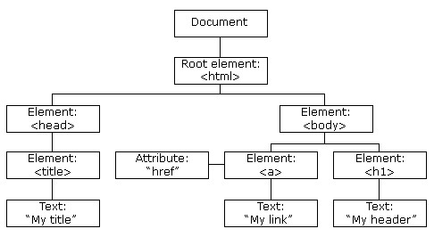

# JavaScript DOM

## Sebelum Belajar

- JavaScript Dasar
- JavaScript Object Oriented Programming
- JavaScript Standard Library
- JavaScript Modules

## Agenda

- Pengenalan Document Object Model
- Document
- Node
- Element
- Attr
- Event
- Event Handler
- Dan lain-lain

## #1 Pengenalan Document Object Model

- Ketika sebuah website di load oleh Browser, maka Browser akan membuat Document Object Model untuk halaman website tersebut
- DOM dibuat dalam bentuk tree / pohon yang tiap cabang nya berisikan object dari jenis elemen HTML
- JavaScript memiliki kemampuan untuk memanipulasi DOM, artinya dengan JavaScript, kita bisa mengakses tiap object di DOM bahkan memanipulasi object nya

### Diagram DOM



### DOM dan JavaScript

- DOM bukanlah fitur atau bahasa pemrograman, DOM sebenarnya hanyalah representasi Object dari Struktur halaman web
- DOM sendiri sebenarnya bukanlah bagian dari bahasa pemrograman JavaScript, melainkan bagian dari Web API
- DOM sendiri di desain secara agnostik, artinya sebenarnya bisa digunakan menggunakan bahasa pemrograman apapun, karena memang untuk membuat Web, kita tidak hanya bisa menggunakan bahasa pemrograman JavaScript

## #2 Membuat Project

- Buat folder kosong `belajar-javascript-dom`

## #3 Tipe Data

- DOM memiliki representasi data
- Tidak terlalu banyak tipe data yang terdapat di DOM
- Oleh karena itu, sebenarnya DOM sangat sederhana, namun penggunaannya sangat bermanfaat

| Tipe Data    | Keterangan                                                                                         |
| ------------ | -------------------------------------------------------------------------------------------------- |
| Document     | Merupakan representasi dari halaman web                                                            |
| Node         | Merupakan base class untuk semua tipe data di DOM, seperti Document, Element, dan Attr             |
| Element      | Merupakan representasi object element di halaman web, misal head, body, form, input, dan lain-lain |
| NodeList     | Merupakan array/collection yang berisikan Node                                                     |
| Attr         | Atau attribute, merupakan representasi object attribute dalam element                              |
| NamedNodeMap | Merupakan collection yang berisikan Attr dalam bentuk Map                                          |

## #4 Document

- Document merupakan representasi object dari halaman web
- Dalam satu halaman web, terdapat satu document, dan kita tidak perlu membuatnya secara manual, karena otomatis akan ada di browser
- Untuk mengakses Document, kita bisa gunakan object document
- <https://developer.mozilla.org/en-US/docs/Web/API/Document>

### document Object

- Document secara otomatis dibuat dalam browser ketika membuka halaman web, sehingga kita tidak perlu membuat objek Document secara manual
- Kita bisa langsung menggunakan kata kunci `document`

### Kode: Document

```html
<script>
	console.info(document);
</script>
```

### Document Property

- Document memiliki banyak sekali property
- Property dalam Document bisa kita gunakan untuk melihat semua data yang terdapat dalam document halaman web
- <https://developer.mozilla.org/en-US/docs/Web/API/Document#properties>

### Kode: Document Property

```html
<script>
	console.info(document.title);
	console.info(document.body);
	console.info(document.head);
	console.info(document.images);
	console.info(document.contentType);
</script>
```

### Document Method

- Document memiliki banyak sekali method
- Banyak method yang terdapat di document digunakan untuk memanipulasi data DOM, misal membuat Node, Element, Attribute atau mengambil dan menyeleksi Node di dalam document
- <https://developer.mozilla.org/en-US/docs/Web/API/Document#methods>

### Kode: Document Method

```html
<div>
	<p id="tulisan">Ini Adalah Tulisan</p>
</div>
<script>
	const tulisan = document.getElementById("tulisan");
	console.info(tulisan);
</script>
```

## #5 Node

- Node adalah base class dari Document, Element dan Attr
- Artinya semua fitur yang dimiliki di Node dimiliki diturunannya
- Node dalam DOM itu bentuknya adalah `Tree` (pohon), artinya dengan `Node`, kita bisa melihat `Parent` (node diatas nya), `Children` (node dibawahnya), `Sibling` (node disebelahnya)
- <https://developer.mozilla.org/en-US/docs/Web/API/Node>

### Kode: Node

```html
<ul id="menu">
	<li id="first">First</li>
	<li id="second">Second</li>
	<li id="third">Third</li>
</ul>
<script>
	const menu = document.getElementById("menu");
	console.info(menu);

	const second = document.getElementById("second");
	console.info(second);
</script>
```

### Node Property

- Node memiliki banyak sekali property
- Property di Node banyak berisi informasi reference ke Node lain nya, seperti ke node parent nya, node children nya atau node sebelahnya
- <https://developer.mozilla.org/en-US/docs/Web/API/Node#properties>

### Kode: Node

```html
<ul id="menu">
	<li id="first">First</li>
	<li id="second">Second</li>
	<li id="third">Third</li>
</ul>
<script>
	const menu = document.getElementById("menu");
	console.info(menu);
	console.info(menu.children);

	const second = document.getElementById("second");
	console.info(second.previousSibling);
	console.info(second.nextSibling);
</script>
```

### Node: Method

- Node memiliki banyak sekali method
- Method di Node bisa digunakan untuk memanipulasi data Node di dalam Node tersebut, misal menambah/menghapus Node children
- <https://developer.mozilla.org/en-US/docs/Web/API/Node#properties>

### Kode: Node Method

```html
<ul id="menu">
	<li id="first">First</li>
	<li id="second">Second</li>
	<li id="third">Third</li>
</ul>
<script>
	const menu = document.getElementById("menu");

	menu.removeChild(document.getElementById("first"));
	menu.removeChild(document.getElementById("second"));
	menu.removeChild(document.getElementById("third"));
</script>
```

## #6 Element

Element merupakan Node yang berbentuk element, biasanya adalah element HTML, misal `<html>`, `<head>`, `<body>`, `<div>`, `<table>`, dan lain-lain

- <https://developer.mozilla.org/en-US/docs/Web/API/Element>

### Kode: Element

```html
<h1 id="title"></h1>
<p id="description"></p>

<script>
	const title = document.getElementById("title");
	title.textContent = "Belajar JavaScript DOM";

	const description = document.getElementById("description");
	description.textContent = "Selamat Belajar JavaScript DOM";
</script>
```

### Element Property

- Element memiliki banyak sekali property
- Dan karena Element adalah turunan dari Node, semua property Node pun bisa digunakan di Element
- <https://developer.mozilla.org/en-US/docs/Web/API/Element#properties>

### Kode: Element Property

```html
<div id="content" class="content">
	<h1 id="title" class="title">This is Title</h1>
	<p id="description" class="description">This is Description</p>
</div>
<script>
	const content = document.getElementById("content");

	console.info(content.id);
	console.info(content.className);
	console.info(content.tagName);
</script>
```

### Element Method

- Element memiliki banyak sekali method
- Dan karena Element adalah turunan dari Node, semua method Node pun bisa digunakan di Element
- <https://developer.mozilla.org/en-US/docs/Web/API/Element#methods>

### Kode: Element Method

```html
<div id="content" class="content">
	<h1 id="title" class="title">This is Title</h1>
	<p id="description" class="description">This is Description</p>
</div>
<script>
	const description = document.getElementById("description");
	const title = document.getElementById("title");

	description.remove();
	title.remove();
</script>
```

### Membuat Element

- Sebelumnya kita hanya mengambil element menggunakan id, artinya kita perlu buat dulu element nya di HTML
- Kita juga bisa membuat object element baru, dan menambahkannya ke halaman web
- Kita bisa menggunakan method `createElement(tag)` pada Document
- <https://developer.mozilla.org/en-US/docs/Web/API/Document/createElement>

### Kode: Membuat Element

```html
<div id="content" class="content"></div>
<script>
	const content = document.getElementById("content");

	const title = document.createElement("h1");
	title.textContent = "Belajar JavaScript DOM";
	content.appendChild(title);

	const description = document.createElement("p");
	description.textContent = "Selamat Belajar JavaScript DOM";
	content.appendChild(description);
</script>
```

## #7 NodeList

- NodeList adalah kumpulan dari Node
- Biasanya NodeList digunakan ketika kita menyeleksi banyak Node sekaligus, misal ketika kita ingin mengambil semua children di Node misalnya
- <https://developer.mozilla.org/en-US/docs/Web/API/NodeList>

### Kode: NodeList

```html
<script>
	const list = document.querySelectorAll('li');
	console.info(list);

	const list1 = document.getElementById('menu1');.childNodes
	console.info(list1);

	const list2 = document.getElementById('menu2');.childNodes
	console.info(list2);
</script>
```

### Live vs Static NodeList

- NodeList memiliki 2 tipe, yaitu Live dan Static
- Live artinya perubahan yang terjadi pada NodeList nya, akan merubah semua NodeList yang sama
- Static artinya perubahan yang terjadi pada NodeList nya, tidak akan merubah semua NodeList yang sama
- Saat kita menggunakan e`lement.childNodes`, NodeList tersebut bersifat `Live`
- Saat kita menggunakan `document.querySelectorAll()`, NodeList tersebut bersifat `Static`

### Kode: NodeList Live

```html
<script>
	const menu1 = document.getElementById("menu1");
	const list1 = menu1.childNodes;

	menu1.append(document.createElement("li"));
	menu1.append(document.createElement("li"));

	console.info(list1);
</script>
```

### Kode: NodeList Static

```html
<script>
	const list = document.querySelectorAll("li");

	const menu1 = document.getElementById("menu1");
	menu1.append(document.createElement("li"));
	menu1.append(document.createElement("li"));

	console.info(list);
</script>
```

## #8 Attr

- Attr atau attribute merupakan representasi dari attribute sebuah element, atau singkatnya key-value, key nya adalah nama attribute, dan value nya adalah value attribute
- <https://developer.mozilla.org/en-US/docs/Web/API/Attr>

### Kode: Attr

```html

<script>
	const logo = document.getElementById("logo");
	const src = logo.getAttributeNode("src");

	console.info(src.name);
	console.info(src.value);
</script>
```

### Attr Value

- Kadang kebanyakan programmer ingin langsung mendapatkan value Attr
- Jarang sekali menggunakan object Attr nya
- Untuk mendapatkan value secara langsung, kita bisa menggunakan method `getAttribute(name)` di Element

### Kode: Attr Value

```html

<script>
	const logo = document.getElementById("logo");
	const src = logo.getAttribute("src");

	console.info(src);
</script>
```

### Membuat Attr

- Untuk membuat Attr, kita bisa menggunakan `document.createAttribute(name)`
- Lalu untuk menambahkannya ke Element, kita bisa gunakan `element.setAttributeNode(attr)`
- Atau kita juga bisa langsung membuat Attr langsung dengan name dan value nya menggunakan `element.setAttribute(name, value)`

### Kode: Membuat Attr

```html

<script>
	const logo = document.getElementById("logo");

	const src = document.createElement("src");
	src.value = "https://www.programmerzamannow.com/img/pzn.png";
	logo.setAttributeNode(src);
</script>
```

## #9 NamedNodeMap

- NamedNodeMap merupakan kumpulan dari Attr
- Mirip seperti NodeList, namun isinya adalah Attr
- <https://developer.mozilla.org/en-US/docs/Web/API/NamedNodeMap>

### Kode: NamedNodeMap

```html

<script>
	const logo = document.getElementById("logo");
	const attributes = logo.attributes;

	for (let attribute of attributes) {
		console.info(`${attribute.name} : ${attribute.value}`);
	}
</script>
```

## #10 Text Node

- Saat kita membuat HTML, kadang kita membuat teks tanpa tag
- Saat halaman web tersebut direpresentasikan dalam DOM, text tanpa tag bukanlah merupakan Element, melainkan Node
- Lebih tepatnya adalah Text Node
- <https://developer.mozilla.org/en-US/docs/Web/API/Text>

### Kode: Text Node

```html
Eko Kurniawan Khannedy
<script>
	const text = document.body.firstChild;
	console.info(text.wholeText);
</script>
```

### Membuat Text Node

- Kita juga bisa membuat Text Node menggunakan method `document.createTextNode(string)`
- Hasilnya berupa Text yang bisa kita tambahkan ke Node lain

### Kode: Membuat Text Node

```html
<script>
	const text = document.createTextNode("Eko Kurniawan Khannedy");
	document.body.appendChild(text);
</script>
```

## #11 Event Handler

- Node memiliki kemampuan bereaksi terhadap suatu kejadian, misal kejadian di klik, mouse di atas node tersebut, dan lain-lain
- Ada banyak sekali jenis kejadian yang bisa kita buatkan aksinya ketika kejadian tersebut terjadi, atau dikenal dengan nama Event Handler
- Ada dua cara kita menambahkan Event Handler ke Node, menggunakan `Event Target` atau `Global Event Handler`
- <https://developer.mozilla.org/en-US/docs/Web/API/EventTarget>
- <https://developer.mozilla.org/en-US/docs/Web/API/GlobalEventHandlers>

### Event Target

- Event Target merupakan parent class dari Node, artinya semua Node memiliki kemampuan dari Event Target
- Pada Event Target, kita bisa menggunakan method `addEventListener(type, callback)` untuk menambahkan Event Handler
- <https://developer.mozilla.org/en-US/docs/Web/API/EventTarget>

### Kode: Event Listener

```html
<input type="button" id="clickMe" value="Click Me" />
<script>
	const clickMe = document.getElementById("clickMe");
	clickMe.addEventListener("click", function () {
		clickMe.setAttribute("value", "You Already Click Me!");
	});
</script>
```

### Global Event Handler

- Selain menggunakan Event Target, untuk menambahkan Event Handler, kita juga bisa menggunakan Global Event Handler
- Global Event Handler bukanlah sebuah super class, hanya kontrak yang bisa kita gunakan untuk menambah event handler sesuai dengan type event nya
- <https://developer.mozilla.org/en-US/docs/Web/API/GlobalEventHandlers>

### Kode: Global Event Handler

```html
<input type="button" id="clickMe" value="Click Me" />
<script>
	const clickMe = document.getElementById("clickMe");
	clickMe.onclick = function () {
		clickMe.setAttribute("value", "You Already Click Me!");
	};
</script>
```

## #12 Event

### Jenis Event

- DOM sendiri memiliki banyak sekali jenis event, tidak hanya click
- Jenis event yang bisa kita gunakan biasanya disesuaikan dengan target event nya, misal pada element video, ada event play, pause, sedangkan pada element button, tidak ada event play atau pause
- Untuk lebih detailnya, ada apa saja jenis event nya, kita bisa lihat pada halaman berikut :
- <https://developer.mozilla.org/en-US/docs/Web/Events>

### Event

- Saat kita membuat callback function untuk Event Handler, kita juga bisa menerima data event yang memicu event itu terjadi
- Data Event tersebut bisa berbeda-beda, tergantung jenis Event nya, contohnya untuk Click, data event nya berupa Mouse Event (yang berisi lokasi mouse dan lain-lain)
- Kita bisa lihat detail dari data tiap event di halaman documentation nya :
- <https://developer.mozilla.org/en-US/docs/Web/API/Event>

### Kode: Event

```html
<h1 id="text">Click Yellow Box</h1>
<div
	id="canvas"
	style="width: 500px; height: 500px; background-color: yellow;"
></div>
<script>
	const canvas = document.getElementById("canvas");
	const text = document.getElementById("text");
	canvas.onclick = function (event) {
		text.textContent = `You Click At (${event.x}, ${event.y})`;
	};
</script>
```

## #13 Style

- DOM juga bisa digunakan untuk memanipulasi attribute style pada element dengan lebih mudah
- Kita tidak perlu menggunakan `setAttribute("style", "value")` setiap ingin mengubah style sebuah element
- Kita bisa langsung gunakan `element.style.name = value`
- <https://developer.mozilla.org/en-US/docs/Web/API/HTMLElement/style>

### Nama Style

- Saat kita mengubah sebuah style, penamaan style menjadi berubah
- Pada style css, rata-rata menggunakan format `lowercase` dan `-,` misal background-color
- Sedangkan pada DOM Style, menggunakan format `pascalCase`, misal `backgroundColor`

### Kode: Style

```html
<input type="button" value="blue" />
<input type="button" value="red" />
<input type="button" value="yellow" />
<div
	id="canvas"
	style="width: 500px; height: 50px; background-color: black;"
></div>
<script>
	const canvas = document.getElementById("canvas");
	const buttons = document.querySelectorAll("input");
	for (const button of buttons) {
		button.onclick = function () {
			canvas.styles.backgroundColor = button.getAttribute("value");
		};
	}
</script>
```

## #14 InnerText dan InnerHTML

- Selain textContent, terdapat property lain bernama `innerText` untuk mendapatkan isi text sebuah element
- Tujuan nya sama, untuk mengambil atau mengubah isi text konten sebuah element, namun ada perbedaannya
- textContent akan mengembalikan semua isi dari konten text sebuah element
- innerText bisa tahu, bagian text mana yang ditampilkan, dan dia hanya akan mengambil text yang ditampilkan saja

### Kode: Text Content dan Inner Text

```html
<p id="content">
	<script>
		console.info("Hello World");
	</script>
	<b>Eko</b> Kurniawan <i>Khannedy</i>
</p>
<script>
	const content = document.getElementById("content");
	console.info(content.textContent);
	console.info(content.innerText);
</script>
```

### Inner HTML

- Jika Text Content dan Inner Text hanya mengambil text saja, Inner HTML akan mengambil seluruh element HTML nya sebagai text
- Ini juga cocok jika kita ingin mengubah isi dari element menggunakan text yang berisi tag HTML

### Kode: Inner HTML

```html
p id="content">
	<script>
		console.info("Hello World");
	</script>
	<b>Eko</b> Kurniawan <i>Khannedy</i>
</p>
<script>
	const content = document.getElementById('content');
	console.info(content.innerHTML);
</script>
```

### Mengubah Element dengan Inner HTML

- Salah satu kemampuan dari innerHTML adalah, kita bisa mengubah isi dari children sebuah element hanya dengan string
- Tag yang terdapat di dalam String secara otomatis akan menjadi child element

### Kode: Mengubah Element dengan Inner HTML

```html
<div id="content"></div>
<script>
	const content = document.getElementById("content");
	content.innerHTML = `<h1>This is title</h1><p>This is Description</p>`;
</script>
```

## #15 Window

- Window merupakan representasi `window` yang berisikan DOM Document
- Beberapa JavaScript function sebenarnya berasal dari object Window, seperti `alert()`, `confirm()` dan `prompt()`
- Ada banyak sekali property, method dan event yang bisa kita gunakan pada window
- Untuk menggunakan Window, kita tidak perlu membuat objectnya, cukup gunakan kata kunci window
- https://developer.mozilla.org/en-US/docs/Web/API/Window

### Kode: Window

```html
<p id="content"></p>
<script>
	const content = document.getElementById("content");
	const height = window.screen.height;
	const width = window.screen.width;

	content.textContent = `WIndow width (${width}) x height (${height})`;
</script>
```

## #16 Query Selector

- Sebelumnya kita sudah menggunakan method `querySelectorAll()` pada Document, sekarang kita akan bahas lebih lengkap tentang Query Selector
- Query Selector merupakan method untuk menseleksi node sesuai dengan pola yang kita ingin cari
- Terdapat dua method untuk Query Selector :
- `Document.querySelector(pola)` digunakan menyeleksi node pertama yang sesuai dengan pola
- `Document.querySelectorAll(pola)` digunakan untuk menyeleksi semua node yang sesuai dengan pola

### Pola Query Selector

- Pola untuk Query Selector adalah menggunakan CSS Selector
- Penggunakan Pola nya mirip ketika kita membuat Selector di CSS
- Jika belum tahu tentang CSS Selector, disarankan untuk dipelajari ulang tentang materi CSS
- <https://developer.mozilla.org/en-US/docs/Web/CSS/CSS_Selectors>

### Universal Selector

- Universal Selector merupakan selector untuk menyeleksi semua element
- Kita bisa menggunakan karakter `*`
- <https://developer.mozilla.org/en-US/docs/Web/CSS/Universal_selectors>

### Kode: Universal Selector

```html
<script>
	const elements = document.querySelectorAll("*");
	console.info(elements);
</script>
```

### Type Selector

- Type Selector adalah selector yang digunakan untuk menyeleksi tag type HTML yang kita pilih
- Untuk menggunakannya, kita bisa langsung sebutkan nama tag nya
- <https://developer.mozilla.org/en-US/docs/Web/CSS/Type_selectors>

### Kode: Type Selector

```html
<ul>
	<li>1</li>
	<li>2</li>
	<li>3</li>
</ul>
<script>
	const element = document.querySelectorAll("li");
	console.info(elements);
</script>
```

### Class Selector

- Class Selector merupakan selector untuk menyeleksi semua element yang memiliki class yang sesuai selector
- Untuk menggunakannya, kita bisa sebutkan nama class nya diawali dengan `.` titik
- <https://developer.mozilla.org/en-US/docs/Web/CSS/Class_selectors>

### Kode: Class Selector

```html
<ul>
	<li class="menuItem">1</li>
	<li>2</li>
	<li class="menuItem">3</li>
</ul>
<script>
	const elements = document.querySelectorAll(".menuItem");
	console.info(elements);
</script>
```

### ID Selector

- ID Selector merupakan selector yang digunakan untuk menyeleksi id yang sesuai selector
- Untuk menggunakannya, kita bisa gunakan nama id diawali dengan karakter `#`
- <https://developer.mozilla.org/en-US/docs/Web/CSS/ID_selectors>

### Kode: ID Selector

```html
<ul>
	<li class="menuItem">1</li>
	<li id="menu2">2</li>
	<li class="menuItem">3</li>
</ul>
<script>
	const elements = document.querySelectorAll("#menu2");
	console.info(elements);
</script>
```

### Attribute Selector

- Attribute Selector merupakan selector yang bisa digunakan untuk menyeleksi element berdasarkan attribute nya
- Kita bisa menggunakan selector `[attribute]`
- Atau bisa juga untuk tag tertentu, misal menggunakan selector `div[attribute]`
- <https://developer.mozilla.org/en-US/docs/Web/CSS/Attribute_selectors>

### Kode: Attribute Selector

```html
<div class="eko"></div>
<div class="kurniawan"></div>
<div class="khannedy"></div>
<script>
	const elements = document.querySelectorAll("[class]");
	console.info(elements);
</script>
```

### Operator di Attribute Selector

- Kita juga bisa menggunakan operator pada attribut selector
- Misal `[attribute=value]`, `[attribute^=value]` dan lain-lain
- <https://developer.mozilla.org/en-US/docs/Web/CSS/Attribute_selectors#syntax>

### Kode: Operator Attribute Selector

```html
<div class="eko"></div>
<div class="ekokurniawan"></div>
<div class="ekokhannedy"></div>
<script>
	const elements = document.querySelectorAll("div[class^='eko']");
	console.info(elements);
</script>
```

### Dan Selector Lainnya

- <https://developer.mozilla.org/en-US/docs/Web/CSS/CSS_Selectors>

## #17 Node Type

- Saat kita menyeleksi Node menjadi NodeList, kadang kita ingin tahu tipe Node tersebut
- Apakah Element, TextElement atau yang lainnya
- Node sendiri memiliki property bernama `nodeType`, dimana kita bisa melihat tipe dari node tersebut
- <https://developer.mozilla.org/en-US/docs/Web/API/Node/nodeType>


### Kode: Node Type

```html
Eko Kurniawan Khannedy
<!-- Hello World -->
<script>
	const nodes = document.body.childNodes;
	nodes.forEach((node) => {
		console.info(`${node} : ${node.nodeType}`);
	});
</script>
```

## #18 HTML Element

- Element merupakan representasi dalam DOM
- Namun, saat menggunakan HTML, implementasi detail nya sebenarnya adalah HTML Element, yaitu turunan dari Element
- HTML Element memiliki banyak sekali property dan method tambahan selain dari Element DOM
- Kebanyakan HTML Element memiliki property yang sesuai dengan attribute yang ada pada tag html tersebut, oleh karena itu, kadang kita tidak butuh lagi menggunakan method `setAttribute` dan `getAttribute`
- <https://developer.mozilla.org/en-US/docs/Web/API/HTMLElement>

### Kode: HTML Element

```html
<a id="link"></a>
<script>
	const link = document.getElementById("link");
	link.href = "https://www.programmerzamannow.com";
	link.target = "_blank";
	link.textContent = "Programmer Zaman Now";
</script>
```

## #19 HTML Form Element

- Form adalah salah satu element yang memiliki banyak sekali fitur diluar dari Element DOM
- Hal ini karena penggunaan Form memang lebih kompleks dibandingkan element HTML lainnya
- Ada banyak sekali property, method dan juga event yang terdapat pada HTML form element atau input element
- <https://developer.mozilla.org/en-US/docs/Web/API/HTMLFormElement>
- <https://developer.mozilla.org/en-US/docs/Web/API/HTMLInputElement>

### Kode: HTML Form Element

```html
<form name="commentForm">
	<label for="comment">
		Comment: <input type="text" id="comment" class="comment" />
	</label>
	<br />
	<label for="form"> Form: <input type="text" id="form" class="form" /> </label>
	<br />
	<input type="button" value="Submit" />
</form>
<div id="commentList"></div>
```

### Kode: HTML Form Element JavaScript

```html
<script>
	document.querySelectorAll("form[name=commentForm]").onsubmit = function (
		event,
	) {
		const commentList = document.getElementById("commentList");
		const comment = document.getElementById("comment").value;
		const form = document.getElementById("form").value;

		const commentItem = document.createElement("p");
		commentItem.textContent = `${comment} : ${form}`;
		commentList.appendChild(commentItem);

		document.forms["commentForm"].reset();

		event.preventDefault();
	};
</script>
```

### Akses Form Via Name

- Salah satu kelebihan Form adalah, kita bisa mengakses form hanya dengan menggunakan form name
- Kita bisa gunakan `document.forms[name]`
- Atau jika kita ingin mengakses input nya, kita juga bisa menggunakan name nya `document.forms[name][inputName]`

### Kode: HTML Form Element JavaScript

```html
<script>
	document.forms['commentForm'].onsubmit = function (event) {
			const commentList = document.getElementById('commentList');
			const comment = document.['commentForm']["comment"].value;
			const form = document.['commentForm']["form"].value;

			const commentItem = document.createElement('p');
			commentItem.textContent = `${comment} : ${form}`;
			commentList.appendChild(commentItem);

			document.forms['commentForm'].reset();

			event.preventDefault();
	}
</script>
```

## #20 HTML Table Element

- Salah satu HTML Element yang kompleks selain Form adalah Table
- HTML Table Element juga memiliki banyak sekali property, method dan event yang khusus
- <https://developer.mozilla.org/en-US/docs/Web/API/HTMLTableElement>

### Kode: HTML Table Element

```html
<table id="orderRevenue">
	<caption>
		Order Revenue
	</caption>
	<thead>
		<tr>
			<td>Month</td>
			<td>Income</td>
		</tr>
	</thead>
	<tbody>
		<tr>
			<td>January</td>
			<td>100000000</td>
		</tr>
		<tr>
			<td>February</td>
			<td>200000000</td>
		</tr>
	</tbody>
	<tfoot>
		<tr>
			<td>Total</td>
			<td>300000000</td>
		</tr>
	</tfoot>
</table>
```

### Kode: HTML Table Element JavaScript

```html
<script>
	const orderRevenue = document.getElementById("orderRevenue");
	console.info(orderRevenue.caption);
	console.info(orderRevenue.tHead);
	console.info(orderRevenue.tBodies);
	console.info(orderRevenue.tFoot);
</script>
```

## #21 HTML Element Lainnya

- Sebenarnya masih banyak element-element HTML lainnya yang terdapat dalam Standard Web API
- Namun akan terlalu banyak jika dibahas satu per-satu
- Oleh karena itu saya sarankan teman-teman eksplore HTML element yang memang ingin dipelajari di halaman documentation resminya
- <https://developer.mozilla.org/en-US/docs/Web/API#interfaces>

## #22 Materi Selanjutnya

- JavaScript Async
- JavaScript Decorator
- JavaScript Web API
