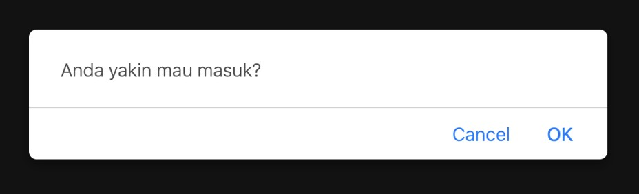

# JavaScript Dasar

## Sebelum Belajar

- HTML
- CSS

## Agenda

- Pengenalan JavaScript
- Tipe Data
- Variable
- Percabangan
- Perulangan
- Function
- Dan lain-lain

## #1 Pengenalan JavaScript

### Sejarah JavaScript

- JavaScript atau sering disingkat JS, pertama kali dibuat tahun 1995. Programmer di Netscape bernama Brandan Eich membuat sebuah bahasa pemrograman scripting untuk berjalan di Netscape Navigator Browser.
- Awalnya namanya adalah Mocha, lalu berubah menjadi LiveScript, dan akhirnya menjadi JavaScript.
- JavaScript dibuat agar halaman website yang sudah kita buat menggunakan HTML dan CSS bisa lebih interaktif
- JavaScript sekarang sudah mengalahkan Java Applet dan Flash sebagai bahasa pemrograman untuk membuat halaman web menjadi lebih interaktif, hal ini dikarenakan kemudahan bahasa nya dan juga secara default sekarang semua browser sudah bisa menjalankan JavaScript tanpa harus menginstall aplikasi tambahan seperti Java Applet dan Adobe Flash Player

### JavaScript di Server

- Awalnya JavaScript memang kebanyakan di gunakan untuk berjalan di client side (Browser)
- Namun akhir-akhir ini, semenjak keluar teknologi NodeJS yang bisa digunakan untuk menjalankan JavaScript tanpa browser, sekarang akhirnya JavaScript juga banyak digunakan untuk membuat aplikasi di Server
- Karena ini, akhirnya sekarang JavaScript dikenal dengan bahasa pemrograman FullStack (Backend dan Frontend) karena bisa digunakan untuk membuat aplikasi Backend dan aplikasi Frontend

### JavaScript dan ECMAScript

- Karena JavaScript sekarang hampir di adopsi oleh sebua aplikasi browser, akhirnya dibuatlah sebuah standarisasi yang bernama ECMAScript
- Organisasi yang melakukan standarisasi ECMAScript adalah ECMA International
- Sekarang dengan adanya standarisasi, kita bisa pastikan bahwa kode program JavaScript kita bisa jalan di semua browser, karena browser yang ingin mendukung JavaScript, harus mengikuti standarisasi ECMAScript
- Sekarang karena ECMAScript dan JavaScript sama, sekarang bisa dibilang ECMAScript dan JavaScript adalah dua nama untuk satu bahasa pemrograman yang sama
- <https://www.ecma-international.org/>

### JavaScript vs Java

- Pemula programmer sering salah tentang JavaScript dan Java. Ada yang mengira bahwa Java dan JavaScript adalah bahasa pemrograman yang sama, padahal itu berbeda.
- Java adalah bahasa pemrograman lain, tidak ada hubungannya dengan JavaScript
- Walaupun namanya ada kata "Java" nya, tapi dua bahasa pemrograman ini benar-benar berbeda, tidak ada hubungannya sama sekali
- Jika tertarik untuk belajar bahasa pemrograman Java, silahkan belajar disini : <https://www.programmerzamannow.com/video-tutorial-java/>

### Peralatan Development

- Saat kita belajar JavaScript, kita perlu menyiapkan beberapa perangkat lunak untuk membantu development
- Browser, ini sudah pasti, karena kita perlu menjalankan kode program JavaScript menggunakan Browser
- Text Editor atau Integrated Development Environment, ini digunakan untuk membuat kode program JavaScript

### Browser

- Google Chrome : <https://www.google.com/chrome/>
- Firefox : <https://www.mozilla.org/firefox/>
- Microsoft Edge : <https://www.microsoft.com/edge>
- Safari : <https://www.apple.com/safari/>
- Opera : <https://www.opera.com/>

### Text Editor atau IDE

- Visual Studio Code : <http://code.visualstudiocode.com/>
- Atom : <https://atom.io/>
- Sublime : <https://www.sublimetext.com/>
- WebStorm : <https://www.jetbrains.com/webstorm/>
- Nodepad++ : <https://notepad-plus-plus.org/>
- Textmate : <https://macromates.com/>
- GNU Emacs : <https://www.gnu.org/software/emacs/>
- GEdit : <https://wiki.gnome.org/Apps/Gedit>

## #2 Program Hello World

### Membuat Kode JavScript

- Ada beberapa cara untuk membuat kode JavaScript
- Bisa langsung di file HTML
- Atau bisa menggunakan file `.js` (ekstensi untuk JavaScript), lalu di include di dalam file HTML
- Pada praktek course ini kita akan menggunakan HTML langsung agar mudah membuat kode program nya

### Script JavaScript

```html
<!doctype html>
<html>
	<head>
		<meta charset="utf-8" />
		<meta name="viewport" content="width=device-width, initial-scale=1" />
		<title>Script JavaScript</title>
	</head>
	<body>
		<script>
			document.writeln("Hello World");
		</script>
	</body>
</html>
```

### Include Script JavaScript

```html
<!doctype html>
<html>
	<head>
		<meta charset="utf-8" />
		<meta name="viewport" content="width=device-width, initial-scale=1" />
		<title>Include Script JavaScript</title>
	</head>
	<body>
		<script src="scripts/hello-word.js"></script>
	</body>
</html>
```

### Titik Koma

- JavaScript mirip seperti bahasa pemrograman C/C++, dimana di akhir tiap statement kode program, kita perlu menambahkan `;` (titik koma)
- Namun, di JavaScript tanda `;` (titik koma) tidak wajib, jadi kita bisa menambahkan ataupun tidak.
- Sangat disarankan konsisten, jika ingin menggunakan titik koma, gunakan disemua tempat, jika tidak, jangan gunakan di semua tempat
- Saya sendiri lebih merekomendasikan menggunakan titik koma

## #2 Komentar

- Komentar adalah kode program yang tidak akan dieksekusi ketika dibaca
- Komentar biasanya digunakan sebagai informasi tambahan atau petunjuk
- Di JavaScript, kita bisa menambahkan kode komentar

### Kode: Komentar

```js
// Komentar satu baris
document.writeln(`<p>Hello World</p>`);

/*
Komentar ini bisa lebih dari satu baris loh, 
coba saja
*/
document.writeln(`<p>Hello World Lagi</p>`);
```

## #3 Tipe Data Number

- JavaScript hanya mendukung satu tipe data number, dimana tipe data number di JavaScript bisa berupa bilangan bulat atau bilangan desimal
- Tipe seperti di bahasa pemrograman lain yang biasanya membedakan tipe data number bilangan bulat dan bilangan desimal, di JavaScript semuanya disatukan

### Kode: Tipe Data Number

```html
<script>
	document.writeln(100);
	document.writeln("</br>");
	document.writeln(100.1);
</script>
```

### Number Notation

- JavaScript mendukung number notation, defaultnya ada basis 10, JavaScript juga mendukung binary, hexadecimal dan octal
- Hexadecimal : 0xFF
- Binary : 0b10101
- Octal : 0o10

## #4 Tipe Data Boolean

- Tipe data boolean adalah tipe data yang berisikan data kebenaran, artinya hanya ada dua data, benar dan salah (yes atau no)
- Benar di representasikan dengan kata kunci `true`, dan salah direpresentasikan dengan kata kunci `false`
- Walaupun tipe data boolean merupakan tipe data yang sangat sederhana, tapi tipe data boolean akan banyak digunakan di berbagai fitur pemrograman

### Kode: Tipe Data Boolean

```html
<script>
	document.writeln(true);
	document.writeln("</br>");
	document.writeln(false);
</script>
```

## #5 Tipe Data String

- Tipe data string atau text adalah tipe data yang berisikan kumpulan kosong atau lebih karakter
- Sebelumnya kita sudah pernah menggunakan string ketika membuat program hello world.
- Di JavaScript, untuk membuat data dengan tipe string, kita perlu menggunakan `"` (petik dua) atau `'` (petik satu) sebelum dan setelah isi text nya

### Kode: Tipe Data String

```html
<script>
	document.writeln("Eko Kurniawan Khannedy");
	document.writeln("</br>");
	document.writeln("Programmer Zaman Now");
</script>
```

### Manambah String

- Data string bisa digabung menggunakan operator `+` (plus)

### Kode: Menambah String

```html
<script>
	document.writeln("Nama : " + "Eko");
	document.writeln("</br>");
	document.writeln("Channel : " + "Programmer Zaman Now");
</script>
```

### Escape Sequence

- JavaScript mendukung escape sequence di string. Escape sequence merupakan karakter khusus, seperti `ENTER`, `TAB`, `"` (kutip dua), dan lain-lain. Berikut contoh escape sequence yang didukung oleh JavaScript di data string

| Symbol | Function |
| ------ | -------- |
| `\n`   | ENTER    |
| `\t`   | TAB      |
| `\'`   | `'`      |
| `\"`   | `"`      |
| `\\`   | `\`      |

### Kode: Escape Sequence

```html
<script>
	document.writeln("<textarea cols='100' rows='10'>");
	document.writeln("Eko \nKurniawan \nKhannedy");
	document.writeln("\\Home\\Khannedy");
	document.writeln('"Programmer Zaman Now"');
	document.writeln("'Belajar JavaScript'");
	document.writeln("</textarea>");
</script>
```

## #6 Variable

### Kode: Tanpa Variable

```html
<script>
	document.writeln("Eko Kurniawan Khannedy");
	document.writeln("</br>");
	document.writeln("Eko Kurniawan Khannedy");
	document.writeln("</br>");
	document.writeln("Eko Kurniawan Khannedy");
	document.writeln("</br>");
	document.writeln("Eko Kurniawan Khannedy");
	document.writeln("</br>");
	document.writeln("Eko Kurniawan Khannedy");
</script>
```

### Variable

- Variable adalah tempat untuk menyimpan data
- Dengan menyimpan data di variable, kita bisa menggunakannya lagi dengan menyebutkan nama variable nya
- Untuk membuat variable di JavaScript, kita bisa menggunakan kata kunci `var` diikuti dengan nama variable nya
- JavaScript adalah dynamic language, artinya variable di JavaScript tidak terpaku harus menggunakan satu tipe data, kita bisa mengubah-ubah tipe data di variable yang sama

### Kode: Variable

```html
<script>
	var fullName;
</script>
```

### Mengubah Value di Variable

- Setelah variable di deklarasikan, kita bisa mengubah value atau nilai di dalam variable tersebut
- Untuk mengubahnya, kita bisa menggunakan perintah nama variable diikuti dengan tanda `=` (sama dengan) lalu diikuti dengan value atau nilai nya

### Kode: Mengubah Value di Variable

```html
<script>
	var fillName;

	fullName = "Eko Kurniawan Khannedy";

	fullName = "Budi Nugraha";

	fullName = "Joko Suseno";
</script>
```

### Membuat Variable Langsung Dengan Value

- Di JavaScript juga kita bisa mendeklarasikan sebuah variable, langsung dengan isi value nya
- Caranya kita bisa menggunakan kata kunci var, diikuti nama variable, lalu diikuti dengan tanda `=` (sama dengan), dan di ikuti dengan value atau nilai nya

### Kode: Variable dan Value

```html
<script>
	var firstName = "Eko Kurniawan";
	var lastName = "Khannedy";
	var fullName = "Eko Kurniawan" + " " + "Khannedy";
</script>
```

### Mengakses Variable

- Salah satu keuntungan menggunakan variable adalah variable bisa digunakan kembali
- Hal ini akan mempermudah ketika membutuhkan data yang sama berkali-kali
- Untuk mengakses variable, kita cukup menyebutkan nama variable nya

### Kode: Mengakses Variable

```html
<script>
	var firstName = "Eko Kurniawan Khannedy";
	document.writeln(firstName);
	document.writeln("</br>");
	document.writeln(firstName);
	document.writeln("</br>");
	document.writeln(firstName);
</script>
```

### Kata Kunci let dan const

- Sebelum tahun 2015, kata kunci untuk membuat variable hanya bisa menggunakan kata kunci `var`
- Namun tahun 2015 sejak versi ECMAScript 2015, diperkenalkan kata kunci baru untuk membuat variable, `let` dan `const`
- JavaScript sekarang tidak direkomendasikan lagi menggunakan kata kunci `var` untuk membuat variable, namun diganti dengan let, hal ini dikarenakan ada masalah dari desain awal `var` (akan kita bahas di chapter tersendiri)

### Kode: Variable let

```html
<script>
	let firstName = "Eko Kurniawan Khannedy";
	document.writeln(firstName);
	document.writeln("</br>");
	document.writeln(firstName);
	document.writeln("</br>");
	document.writeln(firstName);
</script>
```

### Kata Kunci const

- Kata kunci let itu seperti kata kunci `var`, dimana data di variable tersebut bisa diubah-ubah sesuka kita
- Sedangkan kata kunci `const` berbeda, ketika sebuah variable sudah diisi di variable `const`, maka variable tersebut tidak bisa diubah lagi value nya
- Variable sejenis ini kadang dibilang juga constant

### Kode: Variable const

```html
<script>
	const application = "Belajar JavaScript Dasar";

	application = "Gak Mau Belajar"; // Error
</script>
```

## #7 Operator Matematika

- JavaScript mendukung banyak sekali operator Matematika untuk tipe data Number, seperti :
- Operator Aritmatika
- Operator Augmented Assignments
- Operator Unary
- Dan lain-lain

### Operator Aritmatika

| Operator | Keterangan  |
| -------- | ----------- |
| `+`      | Pertambahan |
| `-`      | Pengurangan |
| `*`      | Perkalian   |
| `**`     | Exponensial |
| `/`      | Pembagian   |
| `%`      | Sisa Bagi   |

### Kode: Operator Aritmatika

```html
<script>
	let result = 1 + 2;
	document.writeln("<p>1 + 2" + result + "</p>");
	let originalResult = result;

	result = result - 1;
	document.writeln("<p>" + originalResult + " - 1 = " + result + "</p>");
	let originalResult = result;

	result = result * 2;
	document.writeln("<p>" + originalResult + " * 2 = " + result + "</p>");
	let originalResult = result;
</script>
```

### Operator Augmented Assignments

| Operator Matematika     | Operator Augmented Assignments |
| ----------------------- | ------------------------------ |
| `result = result + 10`  | `result += 10`                 |
| `result = result - 10`  | `result -= 10`                 |
| `result = result * 10`  | `result *= 10`                 |
| `result = result ** 10` | `result **= 10`                |
| `result = result / 10`  | `result /= 10`                 |
| `result = result % 10`  | `result %= 10`                 |

### Kode: Operator Augmented Assignments

```html
<script>
	let result = 10;
	result += 10;
	document.writeln("<p>" + result + "</p>");

	result -= 10;
	document.writeln("<p>" + result + "</p>");

	result *= 10;
	document.writeln("<p>" + result + "</p>");
</script>
```

### Operator Unary

| Operator | Keterangan                    |
| -------- | ----------------------------- |
| `+`      | Menandakan nilai positif      |
| `-`      | Menandakan nilai negatif      |
| `++`     | Increment, menaikkan 1 angka  |
| `--`     | Decrement, menurunkan 1 angka |

### Kode: Operator Unary

```html
<script>
	let result = +1;
	document.writeln("<p>" + result + "</p>");

	result--;
	document.writeln("<p>" + result + "</p>");

	result++;
	document.writeln("<p>" + result + "</p>");

	result = -result;
	document.writeln("<p>" + result + "</p>");
</script>
```

## #8 Operator Perbandingan

- Operasi perbandingan adalah operasi untuk membandingkan dua buah data
- Operasi perbandingan adalah operasi yang menghasilkan nilai boolean (benar atau salah)
- Jika hasil operasinya adalah benar, maka nilainya adalah `true`
- Jika hasil operasinya adalah salah, maka nilainya adalah `false`

### Operator Perbandingan

| Operator | Keterangan                             |
| -------- | -------------------------------------- |
| `>`      | Lebih Dari                             |
| `<`      | Kurang Dari                            |
| `>=`     | Lebih Dari Sama Dengan                 |
| `<=`     | Kurang Dari Sama Dengan                |
| `==`     | Sama Dengan                            |
| `===`    | Sama Dengan dan Sama Tipe              |
| `!=`     | Tidak Sama Dengan                      |
| `!==`    | Tidak Sama Dengan atau Tidak Sama Tipe |

### Kode: Operasi Perbandingan

```html
<script>
	let result = 5 == "5";
	document.writeln("<p>" + result + "</p>");

	result = 5 === "5";
	document.writeln("<p>" + result + "</p>");

	result = 5 > 10;
	document.writeln("<p>" + result + "</p>");

	result = 5 < 10;
	document.writeln("<p>" + result + "</p>");
</script>
```

## #9 Operator Logika

- Operator logika adalah operator untuk dua buah data boolean
- Hasil dari operator logika adalah boolean lagi

### Operator Logika

| Operator | Keterangan |
| -------- | ---------- |
| `&&`     | Dan        |
| `\|\|`   | Atau       |
| `!`      | Kebalikan  |

### Operator &&

| Nilai | Operator | Nilai 2 | Hasil |
| ----- | -------- | ------- | ----- |
| true  | `&&`     | true    | true  |
| true  | `&&`     | false   | false |
| false | `&&`     | true    | false |
| false | `&&`     | false   | false |

### Operator `\|\|`

| Nilai | Operator | Nilai 2 | Hasil |
| ----- | -------- | ------- | ----- |
| true  | `\|\|`   | true    | true  |
| true  | `\|\|`   | false   | true  |
| false | `\|\|`   | true    | true  |
| false | `\|\|`   | false   | false |

### Operator Unary `!`

| Operator | Nilai 2 | Hasil |
| -------- | ------- | ----- |
| `!`      | true    | false |
| `!`      | false   | true  |

### Kode: Operator Logika

```html
<script>
	const nilaiUjian = 70;
	const nilaiAbensi = 70;

	const lulusUjian = nilaiUjian > 75;
	const lulusAbsensi = nilaiAbsensi > 75;

	const lulus = lulusUjian && lulusAbsensi;
	document.writeln("<p>" + lulus + "</p>");
</script>
```

## #10 Console

- JavaScript memiliki fitur untuk melakukan logging bernama Console
- Logging adalah mekanisme yang biasa dilakukan oleh programmer untuk menampilkan informasi dari aplikasi yang sedang berjalan, tanpa harus mengganggu alur kerja aplikasi dan juga interaksi user
- Untuk melakukan ini, kita bisa menggunakan fitur Console di JavaScript
- Untuk menggunakan Console, kita cukup gunakan perintah console di kode JavaScript

### Console Method

| Console Method       | Keterangan                               |
| -------------------- | ---------------------------------------- |
| `console.info(...)`  | Memberitahu informasi                    |
| `console.warn(...)`  | Memberitahu informasi peringatan         |
| `console.error(...)` | Memberitahu informasi error              |
| `console.table(...)` | Memberitahu informasi dalam bentuk table |

### Kode: Console

```html
<script>
	console.info("Hello World");
</script>
```

### Inspect Element di Google Chrome


## #11 String Template

- Kita sudah tahu bahwa untuk menambahkan string dengan data lain, kita bisa menggunakan operator `+` (plus)
- Namun pada kasus tertentu, penggunaan operator `+` (plus) sangat menyulitkan, apalagi jika dalam jumlah banyak
- JavaScript memiliki fitur yang bernama String Template, dimana kita bisa mensubtitusi data dari luar String ke dalam String, seperti mengambil data variable, atau bahkan melakukan operasi matematika
- Untuk menggunakan String Template, cara pembuatan String nya harus menggunakan `\`\` (backtick), bukan `'` (petik satu) atau `"` (petik dua)

### Kode: String Template

```html
<script>
	const template = "Name : ";
</script>
```

### Kode: Mengambil Variable

```html
<script>
	const name = "Eko Kurniawan Khannedy";
	const template = `Name : ${name}`;

	console.info(template);
</script>
```

### Kode: Expression di String Template

```html
<script>
	const name = "Eko Kurniawan Khannedy";
	const value = 80;

	const template = `Name : ${name}, Lulus : ${value > 75}`;

	console.info(template);
</script>
```

### Multi String

- String template juga bisa digunakan untuk membuat string multi line
- Kita cukup tambahkan enter di text nya

### Kode: Multiline String

```html
<script>
	let multiLineString = `
		Nama saya adalah eko Kurniawan
		Hello World
		Hahahahaha
		Test Ah
	`;

	document.writeln("<pre>");
	document.writeln(multiLineString);
	document.writeln("</pre>");
</script>
```

## #12 Konversi String dan Number

- Saat membuat aplikasi, kadang kita input dari pengguna selalu dalam bentuk String
- Sedangkan kita ingin mengelola datanya dalam bentuk Number
- Maka sangat disarankan untuk melakukan konversi tipe data

### Kode: Masalah Tanpa Konversi

```html
<script>
	const value1 = "1";
	const value2 = 1;
	const sum = value1 + value2;

	document.writeln(`<p>${sum}</p>`);
</script>
```

### Melakukan Konversi String dan Number

| Function           | Keterangan                                                       |
| ------------------ | ---------------------------------------------------------------- |
| parseInt(string)   | Mengkonversi dari string ke number (bilangan bulat)              |
| parseFloat(string) | Mengkonversi dari string ke number (bilangan pecahan)            |
| Number(string)     | Mengkonversi dari string ke number (bilangan bulat atau pecahan) |
| number.toString()  | Mengkonversi dari number ke String                               |

### Kode: Konversi String ke Number

```html
<script>
	document.writeln(`<p>${parseInt("1.1")}</p>`); // 1
	document.writeln(`<p>${parseFloat("1.1")}</p>`); // 1.1
	document.writeln(`<p>${Number("1.1")}</p>`); // 1.1
</script>
```

### NaN

- Bagaimana jika ternyata data string yang kita coba konversi ke number bukanlah data yang valid?
- Jika data string yang kita coba lakukan konversi bukan lah data valid, maka hasil dari konversi tersebut adalah `NaN` (Not a Number)
- `NaN` adalah number spesial yang menyebutkan bahwa ini bukanlah number
- Jika `NaN` dioperasikan dengan data number lainnya, maka hasilnya akan menjadi `NaN` lagi

### Kode: NaN

```html
<script>
	document.writeln(`<p>${parseInt("salah")}</p>`); // NaN
	document.writeln(`<p>${parseFlat("1.1text")}</p>`); // 1.1

	// Number() tidak akan mentolerir kesalahan pada data
	document.writeln(`<p>${Number("1.1ups")}</p>`); // NaN
	document.writeln(`<p>${Number("1x")}</p>`); // NaN
	document.writeln(`<p>${Number("bukan number")}</p>`); // NaN
</script>
```

### Kode: Operator Pada NaN

```html
<script>
	const value1 = Number("salah"); // NaN
	const value2 = 100;
	const sum = value1 + value2; // NaN

	document.writeln(`<p>${sum}</p>`);
</script>
```

### isNaN() Function

- Kadang kita ingin mengecek apakah sebuah number itu NaN atau bukan
- Untuk melakukan pengecekan tersebut, kita bisa menggunakan function isNaN(number)
- Hasil nya adalah berupa data boolean, `true` jika `NaN`, `false` jika bukan

## #13 Tipe Data Array

- Array adalah tipe data yang berisikan kumpulan data
- Array di JavaScript memiliki sifat dinamis, artinya datanya bisa bertambah dengan sendirinya saat kita memasukkan data ke dalam Array

### Diagram Array


### Kode: Membuat Array

```html
<script>
	let arrayKosong = [];

	let arrayNama = ["Eko", "Kurniawan", "Khannedy"];
</script>
```

### Cara Kerja Array

- Setiap data di Array akan disimpan dalam posisi berurutan, dimana urutan pertama dimulai dari nomor 0
- Setiap kita menambah data ke Array, otomatis data akan disimpan di urutan terakhir
- Urutan di Array, kita sebut dengan index

### Cara Kerja Array


### Kode: Menambah Array

```html
<script>
	const names = [];
	names.push("Eko");
	names.push("Kurniawan", "Khannedy");

	console.info(names);
</script>
```

### Operasi di Array

| Operasi                | Keterangan                                                 |
| ---------------------- | ---------------------------------------------------------- |
| `array.push(value)`    | Menambah data ke Array                                     |
| `array.length`         | Untuk mendapatkan panjang Array                            |
| `array[index]`         | Mendapat data di posisi index                              |
| `array[index] = value` | Mengubah data di posisi index                              |
| `delete [index]`       | Menghapus data di posisi index, namun index tidak bergeser |

### Kode: Operasi di Array

```html
<script>
	const names = [];
	names.push("Eko");
	names.push("Kurniawan", "Khannedy");

	console.table(names);

	names[0] = "Budi";

	console.table(names);
	console.info(names.length);
</script>
```

### Perlu Diingat

- Data di dalam Array tidak ada batasannya harus data apa
- Jadi kita bisa memasukkan data apapun ke dalam Array
- Bahkan kita juga bisa memasukkan Array ke dalam Array jika kita mau

## #14 Tipe Data Object

### Associative Array

- Di bahasa pemrograman lain seperti PHP, kita bisa menggunakan index beruba tipe data lain selain number, misal string
- Fitur ini biasanya disebut associative array atau hash
- Di JavaScript associative array tidak didukung.
- Jika kita memaksa memasukkan data bukan number di index Array, maka JavaScript akan merubah tipe data Array tersebut menjadi object, dan ini bisa berbahaya, karena beberapa operasi di array mungkin bisa berubah hasilnya

### Tipe Data Object

- Tipe data object adalah tipe data yang mirip dengan tipe data Array
- Yang membedakan adalah index pada tipe data object bisa menggunakan string
- Index di object biasanya disebut attributes atau properties, bukan index

### Kode: Membuat Object Kosong

```html
<script>
	const orang = {};
</script>
```

### Kode: Mengubah Property di Object

```html
<script>
	const orang = {};

	// Menambah atau Mengubah
	orang["nama"] = "Eko Kurniawan";
	orang["alamat"] = "Indonesia";
	orang["umur"] = 30;

	// Menghapus
	delete orang["umur"];

	console.table(orang);
</script>
```

### Kode: Membuat Object dengan Properties

```html
<script>
	const orang = {
		nama: "Eko Kurniawan",
		alamat: "Indonesia",
		umur: 30,
	};

	console.table(orang);
</script>
```

### Kode: Mengakses Property Object

```html
<script>
	const orang = {
		name: "Eko Kurniawan",
		alamat: "Indonesia",
		umur: 30,
	};

	console.info(`Name: ${orang.nama}`);
	console.info(`Alamat: ${orang.alamat}`);
	console.info(`Umur: ${orang.umur}`);
</script>
```

## #15 If Expression

- Dalam JavaScript, `if` adalah salah satu kata kunci yang digunakan untuk percabangan
- Percabangan artinya kita bisa mengeksekusi kode program tertentu ketika suatu kondisi terpenuhi
- Hampir di semua bahasa pemrograman mendukung `if` expression

### Kode: If Expression

```html
<script>
	const examValue = 90;

	if (examValue > 80) {
		document.writeln("<p>Good Job</p>");
	}
</script>
```

### Else Expression

- Blok if akan dieksekusi ketika kondisi `if` bernilai `true`
- Kadang kita ingin melakukan eksekusi program tertentu jika kondisi `if` bernilai `false`
- Hal ini bisa dilakukan menggunakan `else` expression

### Kode: Else Expression

```html
<script>
	const examValue = 90;

	if (examValue > 80) {
		document.writeln(`<p>Good Job</p>`);
	} else {
		document.writeln(`<p>Try Again Next Year</p>`);
	}
</script>
```

### Else If Expression

- Kadang dalam If, kita butuh membuat beberapa kondisi
- Kasus seperti ini, di JavaScript kita bisa menggunakan Else If expression

### Kode: Else If Expression

```html
<script>
	const examValue = 90;

	if (examValue > 80) {
		document.writeln("<p>Good Job</p>");
	} else if (examValue > 60) {
		document.writeln("<p>Not Bad</p>");
	} else {
		document.writeln("<p>Try Again Next Year</p>");
	}
</script>
```

## #16 Popup

### Alert, Prompt dan Confirm

- JavaScript memiliki fitur yang bernama alert, prompt dan confirm
- Alert digunakan untuk memberi peringatan berupa popup text di browser
- Prompt digunakan untuk meminta input string dari pengguna browser dalam bentuk popup input text
- Sedangkan confirm digunakan untuk meminta input boolean dari pengguna browser dalam bentuk popup input pilihan

### Kode: Alert

```html
<script>
	alert("Hello World");
</script>
```

### Hasil Alert


### Kode: Prompt

```html
<script>
	const name = prompt("Siapa Nama Anda?");

	alert(`Hello ${name}`);
</script>
```

### Hasil Prompt


### Kode: Confirm

```html
<script>
	const masuk = confirm("Anda yakin mau masuk?");
	if (masuk) {
		const name = prompt("Siapa Nama Anda?");
		alert(`Hello ${name}`);
	} else {
		alert("Bye bye");
	}
</script>
```

### Hasil Confirm



## #17 Undefined

- `undefined` adalah sebuah kata kunci di JavaScript
- `undefined` adalah sebuah tipe data
- Sebuah variable yang belum ditambahkan nilai, maka artinya variable tersebut merupakan tipe `undefined`
- Kadang untuk programmer JavaScript pemula `undefined` ini memang agak sedikit membingungkan
- `undefined` itu berbeda dengan `null` di bahasa pemrograman lain

### Kode: Undefined Variable

```html
<script>
	let name;
	if (name === undefined) {
		alert("UNDEFINED");
	} else {
		alert("DEFINED");
	}
</script>
```

### Kode: Undefined Array Value

```html
<script>
	const names = ["Eko", "Kurniawan"];

	if (names[2] === undefined) {
		alert("Hello World");
	} else {
		alert(`Hello ${names[2]}`);
	}
</script>
```

### Kode: Undefined Object Property

```html
<script>
	let person = {};

	if (person.name === undefined) {
		alert("Hello World");
	} else {
		alert(`Hello ${person.name}`);
	}
</script>
```

## #18 Null

- null merupakan representasi data kosong
- null berbeda dengan undefined, null berarti variable sudah ditambahkan value nya, hanya saja value nya null
- Sedangkan undefined adalah variable belum ditambahkan value apapun

### Kode: Null dan Undefined

```html
<script>
	let firstName = null;

	if (firstName === undefined) {
		alert("Hello Undefined");
	} else if (firstName === null) {
		alert("Hello Null");
	} else {
		alert(`Hello ${firstName}`);
	}
</script>
```

## #19 Switch Expression

- Kadang kita hanya butuh menggunakan kondisi sederhana di if statement, seperti hanya menggunakan perbandingan `==`
- Switch adalah statement percabangan yang sama dengan if, namun lebih sederhana cara pembuatannya
- Kondisi di switch statement hanya untuk perbandingan `==`

### Kode: Switch Statement

```html
<script>
	switch (nilai) {
		case "A":
			document.writeln("<p>Wow Anda lulus dengan baik</p>");
			break;
		case "B":
		case "C":
			document.writeln("<p>Anda lulus</p>");
			break;
		case "D":
			document.writeln("<p>Anda tidak lulus</p>");
			break;
		default:
			document.writeln("<p>Mungkin Anda salah Jurusan</p>");
	}
</script>
```

## #20 Operator typeof

- `typeof` merupakan operator yang bisa kita gunakan untuk melihat tipe data sebuah value atau variable
- Karena JavaScript merupakan dynamic langauge, jadi kadang kita perlu mengecek tipe data sebuah value atau variable menggunakan operator `typeof`
- Hasil dari operator `typeof` adalah string tipe datanya

### Type Operator

| Type      | Hasil Operator typof |
| --------- | -------------------- |
| Undefined | `"undefined"`        |
| Null      | `"object"`           |
| Boolean   | `"boolean"`          |
| Number    | `"number"`           |
| BigInt    | `"bigint"`           |
| String    | `"string"`           |
| Symbol    | `"symbol"`           |
| Functin   | `"function"`         |
| Lainnya   | `"object"`           |

### Kode: Operator typeof

```html
<script>
	let data;

	if (typeof data === "number") {
		alert("Number");
	} else if (typeof data === "string") {
		alert("String");
	} else if (typeof data === "boolean") {
		alert("Boolean");
	} else if (typeof data === "object") {
		alert("Object");
	}
</script>
```

## #21 In Operator

- In operator adalah operator yang bisa dilakukan untuk mengecek apakah sebuah property ada di dalam object atau tidak
- Jika property tersebut ada di object, maka hasilnya true, sedangkan jika tidak, maka hasilnya false
- Tidak hanya di object, In juga bisa digunakan untuk mengecek index di Array

### Kode: In Operator

```html
<script>
	const person = {
		firstName: "Eko",
		lastName: "Khannedy",
	};

	const result = "firstName" in person; // true
	document.writeln(`<p>${result}</p>`);
</script>
```

### Peringatan

- In operator hanya akan mengecek apakah sebuah property atau index ada atau tidak
- Jadi walaupun nilai property atau index nya `undefined` atau `null`, maka tetap akan dianggap ada

### Kode: In Operator Undefined/Null Property

```html
<script>
	const person = {
		lastName: undefined,
	};

	const result = "lastName" in person; // true
	document.writeln(`<p>${result}</p>`);

	const names = [null, "Kurniawan", null];
	const nameResult = 0 in names; // true
	document.writeln(`<p>${nameResult}</p>`);
</script>
```

## #22 Ternary Operator

- Ternary operator adalah operator sederhana dari if statement
- Ternary operator terdiri dari kondisi yang dievaluasi, jika menghasilkan `true` maka nilai pertama diambil, jika `false`, maka nilai kedua diambil

### Kode: Tanpa Ternary Operator

```html
<script>
	const nilai = 75;
	let ucapan;

	if (nilai >= 75) {
		ucapan = "Selamat Anda Lulus";
	} else {
		ucapan = "Silahkan Coba Lagi";
	}

	document.writeln(`<p>${ucapan}</p>`);
</script>
```

### Kode: Dengan Ternary Operator

```html
<script>
	const nilai = 60;
	const ucapan = nilai >= 75 ? "Selamat Anda Lulus" : "Silahkan Coba Lagi";

	document.writeln(`<p>${ucapan}</p>`);
</script>
```

## #23 Nullish Coalescing Operator

- Nullist value adalah `null` dan `undefined`
- Nullist coalescing operator (`??`) adalah operator mirip dengan ternary operator, yang membedakan adalah pada kondisi, jika bernilai `null` atau `undefined`, baru value default nya diambil

### Kode: Tanpa Nullish Coalescing Operator

```html
<script>
	let parameter;

	let data = parameter;
	if (data === undefined || data == null) {
		data = "Nilai Default";
	}

	alert(data);
</script>
```

### Kode: Nullish Coalescing Operator

```html
<script>
	let parameter;

	let data = parameter ?? "Nilai Default";

	alert(data);
</script>
```

## #24 Optional Chaining

- Optional chaining operator (`?`) merupakan operator yang digunakan untuk mengamankan ketika kita ingin mengakses property sebuah object dari data nullish
- Jika kita mencoba mengakses property dari sebuah object dari data nullish tanpa menggunakan optional chaining operator, maka akan terjadi error

### Kode: Error Mangakses Property Nullish

```html
<script>
	let person = {};

	alert(person.address.country);
</script>
```

### Error Mengakses Property Nullish


### Kode: Pengecekan Menggunakan If

```html
<script>
	let person = {};

	let say;
	if (person.address !== undefined && person.address !== null) {
		say = person.address.country;
	}

	alert(say);
</script>
```

### Kode: Menggunakan Optional Chaining

```html
<script>
	let person = {};
	alert(person?.address?.confirm);
</script>
```

## #25 Falsy dan Truthy

- Falsy atau kadang ditulis `falsey`, adalah value yang ketika dalam konteks boolean, dia dianggap `false`
- Ini adalah salah satu fitur unik dari JavaScript, yang berguna, namun kadang juga sering membingungkan
- Jadi di JavaScript, kondisi itu tidak hanya bisa boolean, tapi diluar boolean pun bisa, namun kita harus tahu beberapa data falsy, atau dianggap `false`

### Data Falsy

| Data dianggap Falsy | Keterangan                         |
| ------------------- | ---------------------------------- |
| `false`             | Boolean false                      |
| `0, -0`             | Number 0 dan -0 dianggap false     |
| `"",''`             | Semua string kosong dianggap false |
| `null`              | null dianggap false                |
| `undefined`         | undefined dianggap false           |
| `NaN`               | Not a Number dianggap false        |

### Truthy

- Truthy adalah kebalikan dari `falsy`, dimana data nya dianggap bernilai `true`
- Sederhana sekali sebenarnya untuk mengetahui sebuah data itu adalah truthy, yaitu data yang bukan bernilai `falsy`

### Kode: Faksy dan Truthy

```html
<script>
	let data = "";

	if (data) {
		alert("TRUE");
	} else {
		alert("FALSE");
	}
</script>
```

## #26 Operator Logika di Non Boolean

- Sebelumnya kita sudah tahu bahwa operator logika AND (`&&`) dan OR (`||`) digunakan untuk dua data boolean
- Namun berbeda di JavaScript, kita bisa menggunakan operator logika AND dan OR untuk tipe data non boolean

### Operator OR (`||`) di Non Boolean

- Operator logika OR (`||`), membaca dari kiri ke kanan.
- Operator ini akan mengambil nilai pertama yang truthy.
- Jika tidak ada satupun yang bernilai truthy, maka yang terakhir yang akan diambil

### Kode: Operator OR (`||`)

```html
<script>
	console.info("hello" || ""); // hello
	console.info("" || []); // []
	console.info("0" || "NOL"); // "0"
	console.info(0 || "NOL"); // NOL
	console.info(null || "NULL"); // NULL
	console.info(undefined || "UNDEFINED"); // NULL
</script>
```

### Operator AND (&&) di Non Boolean

- Operator logika AND (`||`), membaca dari kiri ke kanan.
- Operator ini akan mengambil nilai pertama yang falsy.
- Jika tidak ada satupun yang bernilai falsy, maka yang terakhir yang akan diambil

### Kode: Operator AND (&&)

```html
<script>
	console.info("hello" && ""); // ''
	console.info("" && []); // ""
	console.info("0" && "NOL"); // "NOL"
	console.info(0 && "NOL"); // 0
	console.info(null && "NULL"); // null
	console.info(undefined && "UNDEFINED"); // undefined
	console.info("undefined" && "null"); // null
</script>
```

## #27 For Loop

- For adalah salah satu kata kunci yang bisa digunakan untuk melakukan perulangan
- Blok kode yang terdapat di dalam for akan selalu diulangi selama kondisi for terpenuhi

### Sintak Perulangan For

```txt
for(init statement; kondisi; post statement){
	// block perulangan
}
```

- Init statement akan dieksekusi hanya sekali di awal sebelum perulangan
- Kondisi akan dilakukan pengecekan dalam setiap perulangan, jika true perulangan akan dilakukan, jika false perulangan akan berhenti
- Post statement akan dieksekusi setiap kali diakhir perulangan
- Init statement, Kondisi dan Post Statement tidak wajib diisi, jika Kondisi tidak diisi, berarti kondisi selalu bernilai `true`

### Kode: Perulangan Tanpa Henti

```html
<script>
	for (;;) {
		alert("For Loop");
	}
</script>
```

### Kode: Perulangan Dengan Kondisi

```html
<script>
	let counter = 1;
	for (; counter <= 10; ) {
		document.writeln(`<p>Perulangan ke ${counter}</p>`);
		counter++;
	}
</script>
```

### Kode: Perulangan Dengan Init Statement

```html
<script>
	for (let counter = 1; counter <= 10; ) {
		document.writeln(`<p>Perulangan ke ${counter}</p>`);
		counter++;
	}
</script>
```

### Kode: Perulangan Dengan Post Statement

```html
<script>
	for (let counter = 1; counter <= 10; counter++) {
		document.writeln(`<p>Perulangan ke ${counter}</p>`);
	}
</script>
```

## #28 While Loop

- While loop adalah versi perulangan yang lebih sederhana dibanding for loop
- Di while loop, hanya terdapat kondisi perulangan, tanpa ada init statement dan post statement

### Kode: While Loop

```html
<script>
	let counter = 1;
	while (counter <= 10) {
		document.writeln(`<p>Perulangan ke ${counter}</p>`);
		counter++;
	}
</script>
```

## #29 Do While Loop

- Do While loop adalah perulangan yang mirip dengan while
- Perbedaannya hanya pada pengecekan kondisi
- Pengecekan kondisi di while loop dilakukan di awal sebelum perulangan dilakukan, sedangkan di do while loop dilakukan setelah perulangan dilakukan
- Oleh karena itu dalam do while loop, minimal pasti sekali perulangan dilakukan walaupun kondisi tidak bernilai `true`

### Kode: Do While Loop

```html
<script>
	let counter = 1;
	do {
		document.writeln(`<p>Perulangan ke ${counter}</p>`);
		counter++;
	} while (counter <= 10);
</script>
```

## #30 Break dan Continue

- Pada switch statement, kita sudah mengenal kata kunci `break`, yaitu untuk menghentikan case dalam switch
- Sama dengan pada perulangan, break juga digunakan untuk menghentikan seluruh perulangan.
- Namun berbeda dengan continue, continue digunakan untuk menghentikan perulangan saat ini, lalu melanjutkan ke perulangan selanjutnya

### Kode: Break

```html
<script>
	let counter = 1;
	while (true) {
		document.writeln(`<p>Perulangan ke ${counter}</p>`);
		counter++;

		if (counter > 10) {
			break;
		}
	}
</script>
```

### Kode: Continue

```html
<script>
	for (let i = 1; i <= 100; i++) {
		if (i % 2 === 0) {
			continue;
		}
		document.writeln(`<p>Perulangan Ganjil ${i}</p>`);
	}
</script>
```

## #31 Label

- Label merupakan penanda yang bisa digunakan dengan kata kunci `break` dan `continue`
- Secara default saat kita melakukan break atau continue, dia akan melakukan terhadap perulangan dimana kode break dan continue itu digunakan
- Dengan menggunakan label, kita bisa melakukan break dan continue terhadap perulangan yang kita inginkan, asalkan pada perulangannya kita gunakan label
- Untuk membuat label, kita bisa gunakan nama label lalu diikuti dengan `:` (titik dua)

### Kode: Label

```html
<script>
	loopi: for (let i = 0; i < 100; i++) {
		loopj: for (let j = 0; j < 10; j++) {
			console.infp(`${i} - ${j}`);
		}
	}
</script>
```

### Kode: Continue atau Break di Label

```html
<script>
	loopi: for (let i = 0; i < 10; i++) {
		loopj: for (let j = 0; j < 100; j++) {
			if (j > 10) {
				continue loopi;
			}
			document.writeln(`<p>${i}-${j}</p>`);
		}
	}
</script>
```

## #32 For In

- For In merupakan perulangan for yang digunakan untuk mengiterasi seluruh data property di object atau index di array
- Walaupun for in bisa digunakan untuk Array, namun tidak direkomendasikan untuk Array, karena biasanya kita jarang sekali butuh data index untuk Array, kita bisa menggunakan For Of (yang dibahas setelah ini)

### Kode: For In di Object

```html
<script>
	const person = {
		firstName: "Eko",
		middleName: "Kurniawan",
		lastName: "Khannedy",
	};

	for (const property in person) {
		document.writeln(`<p>Property ${property} : ${person[property]}</p>`);
	}
</script>
```

### Kode: For In di Array

```html
<script>
	const names = ["Eko", "Kurniawan", "Khannedy"];

	for (const index in names) {
		document.writeln(`<p>Index ${index} | ${names[index]}</p>`);
	}
</script>
```

## #33 For Of

- Jika For In digunakan untuk melakukan iterasi property atau index, berbeda dengan For Of, ini digunakan untuk melakukan iterasi terhadap isi value dari iterable object, seperti Array, String dan lain-lain
- For of tidak bisa digunakan untuk melakukan iterasi data di object, karena object bukanlah iterable.

### Kode: For Of di Array

```html
<script>
	const names = ["Eko", "Kurniawan", "Khannedy"];

	for (const name of Names) {
		document.writeln(`<p>${name}</p>`);
	}
</script>
```

### Kode: For Of di String

```html
<script>
	const name = "Eko Kurniawan Khannedy";

	for (const char of name) {
		document.writeln(`<p>${char}</p>`);
	}
</script>
```

## #34 With Statement

- With statement merupakan fitur yang digunakan untuk menurunkan sebuah scope data
- Dengan menggunakan with statement, kita bisa mengakses property dalam sebuah data tanpa harus menyebut datanya

### Kode: Tanpa With Statement

```html
<script>
	const person = {
		firstName: "Eko",
		middleName: "Kurniawan",
		lastName: "Khannedy",
	};

	console.log(person.firstName);
	console.log(person.middleName);
	console.log(person.lastName);
</script>
```

### Kode: Dengan With Statement

```html
<script>
	const person = {
		firstName: "Eko",
		middleName: "Kurniawan",
		lastName: "Khannedy",
	};

	with (person) {
		console.log(firstName);
		console.log(middleName);
		console.log(lastName);
	}
</script>
```

### With Statement Tidak Direkomendasikan

- Walaupun fitur with statement ini sangat menarik
- Namun kebanyakan orang tidak merekomendasikan penggunaan with statement
- Hal ini dikarenakan with statement kadang membuat sebuah kode menjadi ambigu

### Kode: Ambigu di With Statement

```html
<script>
	const person = {
		firstName: "Eko",
		middleName: "Kurniawan",
		lastName: "Khannedy",
	};

	const firstName = "Budi";
	const lastName = "Nugraha";

	with (person) {
		console.log(firstName); // Niatnya ingin Budi
		console.log(middleName);
		console.log(lastName); // Niatnya ingin Nugraha
	}
</script>
```

## #35 Function

- Function adalah blok kode program yang akan berjalan saat kita panggil
- Sebelumnya kita sudah menggunakan function `writeln()` untuk menampilkan tulisan di html
- Untuk membuat function, kita bisa menggunakan kata kunci function, lalu diikuti dengan nama function, kurung `()` dan diakhiri dengan block kurung `{}`
- Kita bisa memanggil function dengan menggunakan nama function lalu diikuti dengan kurung `()`
- Di bahasa pemrograman lain, function juga disebut dengan method

### Kode: Function

```html
<script>
	// Membuat Function
	function sayHelloWorld() {
		document.writeln("<p>Hello World</p>");
	}

	// Memanggil Function
	sayHelloWorld();
	sayHelloWorld(); // boleh berkali-kali
</script>
```

## #36 Function Parameter

- Kita bisa mengirim informasi ke function yang ingin kita panggil
- Untuk melakukan hal tersebut, kita perlu menambahkan parameter atau argument di function yang sudah kita buat
- Parameter ditempatkan di dalam kurung `()` di deklarasi method
- Parameter bisa lebih dari satu, jika lebih dari satu, harus dipisah menggunakan tanda koma

### Kode: Function Parameter

```html
<script>
	// Membuat function dengan parameter
	function sayHello(firstName, lastName) {
		document.writeln(`<p>Hello ${firstName} ${lastName}</p>`);
	}

	// Memanggil function dengan parameter
	sayHello("Eko", "Khannedy");
	sayHello("Budi", "Nugraha");
</script>
```

## #37 Function Return Value

- Secara default, function itu tidak menghasilkan value apapun, namun jika kita ingin, kita bisa membuat sebuah function mengembalikan value
- Agar function bisa menghasilkan value, kita bisa menggunakan kata kunci `return` di dalam function nya.
- Dan di dalam block function, untuk menghasilkan nilai tersebut, kita harus menggunakan kata kunci `return`, lalu diikuti dengan data yang ingin kita hasilkan.
- Function hanya bisa mengembalikan satu data, jika kita ingin mengembalikan beberapa data sekaligus, kita bisa menggunakan Array sebagai `return` value nya

### Kode: Function Return Value

```html
<script>
	// Membuat function dengan parameter dan return value
	function sayHello(firstName, lastName) {
		const say = `Hello ${firstName} ${lastName}`;
		return say;
	}

	// Memanggil function dan menangkap return value nya
	const result = sayHello("Eko", "Khannedy");
	document.writeln(`<p>${result}</p>`);
</script>
```

### Kode: Function Return Value Lebih Dari Satu

```html
<script>
	function getFinalScore(value) {
		if (value > 90) {
			return "A";
		} else if (value > 80) {
			return "B";
		} else if (value > 70) {
			return "C";
		} else if (value > 60) {
			return "D";
		} else {
			return "E";
		}
	}
</script>
```

### Menghentikan Eksekusi dengan Return

- Saat kita menggunakan kata kunci `return`, maka kode setelah return tersebut tidak akan dieksekusi
- Kita bisa menggunakan return untuk menghentikan eksekusi sebuah function

### Kode: Menghentikan Eksekusi dengan Return

```html
<script>
	function isContains(array, searchValue) {
		for (const element of array) {
			if (element === searchValue) {
				return true;
			}
		}
		return false;
	}

	console.info(isContains([1, 2, 3, 4, 5, 6, 7, 8, 9, 10], 5));
</script>
```

## #38 Optional Parameter

- Secara default, parameter di function itu optional
- Artinya kita tidak wajib mengisi value nya ketika memanggil function
- Jika tidak ada value yang kita kirim ke parameter ketika memanggil function, maka secara otomatis parameter tersebut bernilai `undefined`

### Kode: Optional Parameter

```html
<script>
	function sayHello(firstName, middleName, lastName) {
		console.info(firstName);
		console.info(middleName);
		console.info(lastName);
	}

	sayHello("Eko");
</script>
```

## #39 Default Parameter

- Sekarang kita tahu bahwa parameter itu optional, artinya kita bisa tidak memberi value terhadap parameter
- Parameter juga bisa kita beri default value, artinya jika ketika kita tidak mengirim data ke parameter atau kita mengirim data undefined, maka secara otomatis parameter akan diisi oleh default value

### Kode: Default Parameter

```html
<script>
	function register(name, gender = "UNKNOWN") {
		console.info(name);
		console.info(gender);
	}

	register("Eko", "MALE");
	register("Budi");
	register("Joko", undefined);
</script>
```

## #40 Rest Parameter

- Rest Parameter adalah fitur dimana kita bisa mengirim data sebanyak-banyak nya pada satu parameter, dan secara otomatis akan di konversi menjadi Array
- Untuk membuat rest parameter, ada ketentuannya
- Rest parameter hanya boleh ada satu di function, tidak boleh lebih dari satu
- Rest parameter hanya boleh berada di posisi paling akhir, tidak boleh di depan atau di tengah, kecuali memang cuma ada 1 parameter
- Di bahasa pemrograman lain, ada juga yang bilang ini adalah variable argument

### Kode: Rest Parameter

```html
<script>
	function sum(name, ...data) {
		let total = 0;
		for (const item of total) {
			total += item;
		}
		console.info(`Total ${name} is ${total}`);
	}

	sum("Orange", 2, 3, 4, 5, 6, 7, 8);
	sum("Apple", 2, 3, 4, 7, 8);
	sum("Banana", 2, 3, 4, 5);
</script>
```

### Spread Syntax

- Kadang kita terlanjur memiliki data berupa Array
- Tapi untungnya kita juga bisa mengirim Array ke Rest Parameter
- Kita bisa gunakan `…` (titik tiga kali) diikuti dengan array nya ketika memanggil function
- Fitur ini dinamakan Spread Syntax

### Kode: Spread Syntax di Rest Parameter

```html
<script>
	function sum(name, ...data) {
		let total = 0;
		for (const item of data) {
			total += item;
		}
		console.info(`Total ${name} is ${total}`);
	}

	sum("Orange", ...[2, 3, 4, 5, 6, 7, 8]);
	sum("Apple", ...[3, 4, 5, 7, 8]);
	sum("Banana", ...[2, 5, 6, 7, 8]);
</script>
```

### Arguments Object

- Sebelum ada fitur rest parameter, di JavaScript sudah ada fitur yang bernama arguments object
- Ini adalah fitur dimana kita bisa mengambil semua parameter dalam bentuk array dengan menggunakan object bernama arguments
- arguments secara otomatis bisa digunakan di function
- Namun perlu diingat, bahwa untuk JavaScript saat ini, lebih baik disarankan menggunakan rest parameter dibanding arguments object

### Kode: Arguments Object

```html
<script>
	function oldSum() {
		let total = 0;
		for (const item of arguments) {
			total ++ itam;
		}
		console.info(`Total is ${total}`)
	}

	oldSum(1, 2, 3, 4, 5, 6, 7, 8, 9, 10);
</script>
```

## #41 Function Sebagai Value

- Function tidak hanya bisa digunakan sebagai kode program yang dieksekusi, tapi bisa juga sebagai value
- Artinya, function bisa disimpan di variable, bisa juga dikirim melalui parameter ke function lainnya

### Kode: Function di Variable

```html
<script>
	function sayHello(name) {
		console.info(`Hello ${name}`);
	}

	let say = sayHello;

	sayHello("Eko");
	say("Budi");
</script>
```

### Kode: Function di Parameter

```html
<script>
	let say = sayHello;

	function giveMeName(callback) {
		callback("Eko");
	}

	giveMeName(sayHello);
	giveMeName(say);
</script>
```

## #42 Anonymous FUnction

- Sebelumnya kita selalu membuat function dengan nama
- Kita juga bisa membuat function tanpa nama function, atau istilahnya adalah anonymous function
- Kita bisa buat anonymous function dalam sebuah variable atau bisa juga kita buat ketika mengisi parameter

### Kode: Anonymous Function di Variable

```html
<script>
	let say = function (name) {
		console.info(`Hello ${name}`);
	};

	say("Eko");
</script>
```

### Kode: Anonymous Function di Parameter

```html
<script>
	function giveMeName(callback) {
		callback("Eko");
	}

	giveMeName(function (name) {
		console.info(`Hello ${name}`);
	});
</script>
```

## #43 Function dalam Function

- Tidak ada batasan dimana kita bisa membuat function
- Termasuk jika kita ingin membuat function di dalam sebuah function, kita bisa melakukannya
- Function yang terdapat di dalam, kita sebut inner function
- Inner function hanya bisa diakses di tempat kita membuat function nya, tidak bisa diakses dari luar function nya

### Kode: Function dalam Function

```html
<script>
	function outer() {
		function inner() {
			console.info("Inner");
		}

		inner();
		inner();
	}

	outer();
	inner(); // ERROR can not access inner function
</script>
```

## #44 Scope

- Scope merupakan area akses sebuah data
- Ada dua jenis scope, global scope dan local scope.
- Setiap kita membuat function, maka kita akan membuat local scope untuk function tersebut
- Data di global scope bisa diakses dari local scope, namun data di local scope hanya bisa di akses di local scope tersebut atau di scope local dibawahnya (dalam kasus function dalam function)

### Kode: Global Scope

```html
<script>
	// global scope
	let counter = 0;

	function hitMe() {
		// local scope function hitMe
		counter++; // we can access
	}

	hitMe();
	hitMe();

	console.info(counter);
</script>
```

### Kode: Local Scope

```html
<script>
	function first() {
		let firstVariable = "First";
	}

	function second() {
		let secondVariable = "Second";
	}

	first();
	second();

	console.info(firstVariable); // can not access local scope
	console.info(secondVariable); // can not access local scope
</script>
```

### Kode: Nested Function Scope

```html
<script>
	function first() {
		let firstVariable = "First";

		function second() {
			console.info(firstVariable); // can access local scope first function
		}

		second();
	}

	first();
</script>
```

## #45 Recursive Function

- Recursive function adalah kemampuan function memanggil function dirinya sendiri
- Kadang memang ada banyak problem, yang lebih mudah diselesaikan menggunakan recursive function, seperti contohnya kasus factorial

### Kode: Factorial Loop

```html
<script>
	function factorial(value) {
		let result = 1;
		for (let i = 1; i <= value; i++) {
			result *= i;
		}
		return result;
	}
</script>
```

### Kode: Factorial Recursive

```html
<script>
	function factorialRecursive(value) {
		if (value === 1) {
			return 1;
		} else {
			return value * factorialRecursive(value - 1);
		}
	}
</script>
```

## #46 Function Generator

- Function generator adalah function yang digunakan untuk membuat data generator
- Generator adalah data yang bisa di interasi seperti Array
- Untuk membuat function generator, kita perlu menggunakan tanda `*` (bintang) setelah kata function
- Dan untuk mengembalikan data di tiap iterasi, kita bisa gunakan kata kunci `yield` diikuti datanya

### Kode: Function Generator Sederhana

```html
<script>
	function* createNames() {
		yield "Eko";
		yield "Kurniawan";
		yield "Khannedy";
	}

	const names = createNames();
	for (const name of names) {
		console.log(name);
	}
</script>
```

### Kode: Function Generator Kompleks

```html
<script>
	function* buatGanjil(value) {
		for (let i = 1; i <= value; i++) {
			if (i % 2 === 1) {
				yield i;
			}
		}
	}

	const angkaGanjil = buatGanjil(100);
	for (const angka of angkaGanjil) {
		console.info(angka);
	}
</script>
```

### Lazy Evaluation

- Generator itu sifatnya lazy
- Jadi artinya jika kita tidak data belum kita ambil dari generator, maka `yield` selanjutnya tidak akan di eksekusi

### Kode: Lazy Generator

```html
<script>
	function* buatGanjil(value) {
		for (let i = 1; i <= value; i++) {
			if (i % 2 === 1) {
				console.info(`Perulangan ke ${i}`);
				yield i;
			}
		}
	}

	const angkaGanjil = buatGanjil(100);
	console.info(angkaGanjil.next().value);
	console.info(angkaGanjil.next().value);
	console.info(angkaGanjil.next().value);
</script>
```

## #47 Arrow Function

- Arrow function adalah alternatif pembuatan function yang lebih sederhana dari function biasanya
- Namun terdapat limitasi dan juga tidak bisa digunakan di semua situasi
- Dinamakan arrow function karena menggunakan tanda `=>` (seperti panah)
  Berikut contoh beberapa kekurangan arrow function : - tidak memiliki fitur arguments object - tidak bisa menggunakan function generator - tidak bisa mengakses `this` (yang nanti akan dibahas di function di object) - tidak bisa mengakses `super` (yang nanti akan dibahas di JavaScript Object Oriented Programming)

### Kode: Membuat Arrow Function

```html
<script>
	const sayHello = (name) => {
		const say = `Hello ${name}`;
		console.info(say);
	};

	sayHello("Eko");
</script>
```

### Array Function Tanpa Block

- Jika sebuah arrow function isinya sederhana, misal hanya satu baris
- Kita bisa membuat arrow function tanpa harus menggunakan block

### Kode: Arrow Function Tanpa Block

```html
<script>
	const sayHello = (name) => console.info(`Hello ${name}`);

	sayHello("Eko");
</script>
```

### Arrow Function Return Value

- Arrow function bisa mengembalikan value, sama seperti function biasanya
- Jika menggunakan block, maka kita perlu menggunakan kata kunci `return`
- Jika tidak menggunakan block, kita tidak perlu menggunakan kata kunci `return`

### Kode: Arrow Function Return Value

```html
<script>
	const sum = (first, second) => first + second;

	console.info(sum(10, 10));
</script>
```

### Arrow Function Tanpa Kurung Parameter

- Jika parameter di arrow function hanya satu, kita bisa tidak menggunakan kurung pada parameter

### Kode: Arrow Function Tanpa Kurung Parameter

```html
<script>
	const sayHello = (name = console.info(`Hello ${name}`));
	sayHello("Eko");
</script>
```

### Kode: Arrow Function Sebagai Parameter

- Karena arrow function sama seperti anonymous function
- Jadi kita juga bisa menggunakan arrow function sebagai parameter di function lain

### Kode: Arrow Function Sebagai Parameter

```html
<script>
	function giveMeName(callback) {
		callback("Eko");
	}

	giveMeName((name) => console.info(`Hello ${name}`));
</script>
```

## #48 Closure

- Closure adalah kombinasi function dan bundel referensi ke data disekitarnya.
- Oke agak membingungkan memang, apalagi untuk yang baru pertama belajar
- Kita sudah tahu bahwa local scope tidak bisa diakses di luar scope nya
- Dengan kemampuan closure, kita bisa membuat sebuah function di local scope dan referensi ke data di sekitar local scope tersebut, keluar scope nya

### Kode: Closure

```html
<script>
	function createAdder(value) {
		const owner = "Eko";
		function add(param) {
			console.info(owner);
			return value + param;
		}
		return add;
	}

	const addTwo = createAdder(2);
	console.info(addTwo(10));
	console.info(addTwo(20));
</script>
```

## #49 Object Method

- Pada tipe data object, kita sudah membahas tentang property di object
- Karena sebenarnya function juga merupakan salah satu tipe data, jadi function pun sebenarnya bisa ditambahkan sebagai property di object
- Cara pembuatannya pun sama dengan function sebagai value
- Function di object kadang disebut juga sebagai Object Method

### Kode: Membuat Object dengan Method

```html
<script>
	const person = {
		name: "Eko",
		sayHello: function (name) {
			alert(`Hello ${name}`);
		},
	};

	person.sayHello("Budi");
</script>
```

### Kode: Menambah Method ke Object

```html
<script>
	const person = {
		name: "Eko",
	};

	person.sayHello = function (name) {
		alert(`Hello ${name}`);
	};

	person.sayHello("Budi");
</script>
```

## #50 Kata Kunci this

- Kata kunci `this` adalah referensi ke object milik siapa
- Tiap lokasi kata kunci `this`, bisa berbeda-beda referensi pemilik nya
- Dalam Object Method, `this` merupakan referensi ke object pemilik function nya
- Di global scope, `this` merupakan referensi ke global object (di browser biasanya Window)
- Dalam function, `this` merupakan referensi ke global object (di browser biasanya Window)
- Di function dengan strict mode (akan dibahas nanti), `this` adalah undefined
- Dalam event, `this` merupakan referensi ke element yang menerima event (dibahas di materi Document Object Model)

### Kode: this di Global Scope

```html
<script>
	console.info(this); // Window
</script>
```

### Kode: this di Function

```html
<script>
	function testThis() {
		console.info(this); // Window
	}

	testThis();
</script>
```

### Kode: this di Object Method

```html
<script>
	const person = {
		name: "Eko",
		sayHello: function (name) {
			// this = person
			console.info(`Hi ${name}, my name is ${this.name}`);
		},
	};

	person.sayHello("Budi");
</script>
```

## #51 Arrow Function di Object

- Sebelumnya kita sudah bahas tentang Arrow Function
- Arrow Function juga bisa kita gunakan di sebagai Object Method
- Namun perlu diketahui, Arrow Function tidak bisa digunakan untuk mengakses arguments object, function generator, kata kunci this dan kata kunci `super` (dibahas di materi JavaScript Object Oriented Programming)
- Jadi pastikan gunakan Arrow Function hanya memang ketika kita tidak butuh fitur-fitur diatas

### Kode: Arrow Function di Object Method

```html
<script>
	const person = {
		name: "Eko",
		sayHello: (name) => {
			console.info(`Hello ${name}`);
		},
	};

	person.sayHello("Budi");
</script>
```

### Kode: this di Arrow Function Object

```html
<script>
	const person = {
		name: "Eko",
		sayHello: (name) => {
			console.info(this); // Window
			console.info(`Hello ${name}, My Name if ${this.name}`);
		},
	};

	person.sayHello(`Budi`); // Hello Budi, My Name is
</script>
```

## #52 Getter dan Setter

- Getter dan Setter adalah kemampuan membuat function yang berbeda untuk mengambil data (Getter) dan mengubah data (Setter) pada sebuah property di Object
- Dengan menggunakan Getter dan Setter, kita bisa melakukan hal apapun dalam function sebelum sebuah property di akses atau diubah, misal menambah validasi dan lain-lain

### Kode: Getter

```html
<script>
	const person = {
		firstName: "Eko",
		lastName: "Kurniawan",
		get fullName() {
			return `${this.firstName} ${this.lastName}`;
		},
	};

	// otomatis memanggil get fullName()
	console.info(person.fullName);
</script>
```

### Kode: Setter

```html
<script>
	const person = {
		firstName: "Eko",
		lastName: "Kurniawan",
		get fullName() {
			return `${this.firstName} ${this.lastName}`;
		},
		set fullName(val) {
			const array = val.split(" ");
			this.firstName = array[0];
			this.lastName = array[1];
		},
	};

	person.fullName = "Budi Nugraha";
	console.info(person.firstName);
	console.info(person.lastName);
</script>
```

## #53 Masalah Variable var

- Sebelumnya sudah dijelaskan bahwa penggunaan `var` sudah tidak direkomendasikan lagi, dan diganti dengan `let`
- Pertanyaannya kenapa?
- Alasan `var` tidak direkomendasikan digunakan lagi adalah, karena `var` tidak memiliki block scope, artinya dia tidak mengikat ke local scope yang sebelumnya sudah kita bahas
- Karena masalah ini, `var` bisa tidak terprediksi
- Kita akan buat contoh penggunaan `var` dan `let`

### Kode: Menggunakan let

```html
<script>
	let i = 20;

	for (let i = 0; i < 10; i++) {
		console.log(`Local : ${i}`);
	}

	console.inf(`Global : ${i}`);
</script>
```

### Kode: Menggunakan var

```html
<script>
	var i = 20;

	for (var i = 0; i < 10; i++) {
		console.log(`Local : ${i}`);
	}

	console.inf(`Global : ${i}`);
</script>
```

## #54 Destructuring

- Destructuring adalah fitur yang bisa digunakan untuk membongkar value-value di array atau object ke dalam variable-variable
- Fitur ini sangat mempermudah kita ketika ingin mengambil data dari array atau object tanpa harus melakukan pengambilan data satu persatu

### Kode: Mengambil Data di Array

```html
<script>
	const names = ["Eko", "Kurniawan", "Khannedy"];
	const firstName = names[0];
	const middleName = names[1];
	const lastName = names[2];

	console.info(firstName);
	console.info(middleName);
	console.info(lastName);
</script>
```

### Kode: Destructuring Array

```html
<script>
	const names = ["Eko", "Kurniawan", "Khannedy", "Budi", "Eko"];

	const [firstName, middleName, lastName, ...others] = names;

	console.info(firstName);
	console.info(middleName);
	console.info(lastName);
	console.info(others);
</script>
```

### Kode: Mengambil Data di Object

```html
<script>
	const person = {
		firstName: "Eko",
		lastName: "Khannedy",
		address: {
			street: "Jalan Belum Jadi",
			city: "Jakarta",
			country: "Indonesia",
		},
		hobby: "Game",
		channel: "Programmer Zaman Now",
	};

	const firstName = person.firstName;
	const lastName = person.lastName;
</script>
```

### Kode: Destructuring Object

```html
<script>
	const { firstName, lastName, address, ...others } = person;
	console.info(firstName);
	console.info(lastName);
	console.info(address);
	console.info(others);
</script>
```

### Kode: Destructuring Nested Object

```html
<script>
	const {
		firstName,
		lastName,
		address: { country, city, street },
		...others
	} = person;
	console.info(firstName);
	console.info(lastName);
	console.info(country);
	console.info(city);
	console.info(street);
	console.info(others);
</script>
```

### Destructuring Function Parameter

- Destructuring tidak hanya bisa dilakukan di variable, tapi juga bisa dilakukan di function parameter
- Hal ini membuat kita mudah ketika ingin mengambil nested data dalam array atau object dalam function

### Kode: Destructuring di Function Parameter (1)

```html
<script>
	function displayPerson({ firstName, middleName, lastName }) {
		console.info(firstName);
		console.info(middleName);
		console.info(lastName);
	}

	const person = {
		firstName: "Eko",
		middleName: "Kurniawan",
		lastName: "Khannedy",
	};

	displayPerson(person);
</script>
```

### Kode: Destructuring di Function Parameter (2)

```html
<script>
	function sum([first, second]) {
		return first + second;
	}

	console.info(sum([10, 10]));
	console.info(sum([20, 10]));
</script>
```

### Default Value

- Yang paling menarik di destructuring adalah, kita bisa menambahkan default value
- Jadi misal kita kita melakukan destructuring terhadap array, ternyata tidak ada datanya, maka kita bisa menambahkan default value
- Begitu juga pada object, jika ternyata property nya tidak ada, maka kita bisa menambahkan default value

### Kode: Default Value Destructuring Array

```html
<script>
	const names = ["Eko", "Kurniawan"];
	const [firstName, middleName, lastName = "Khannedy"] = names;

	console.info(firstName);
	console.info(middleName);
	console.info(lastName);
</script>
```

### Kode: Default Value Destructuring Object

```html
<script>
	const person = {
		firstName: "Eko",
		lastName: "Khannedy",
	};

	const { firstName, middleName = "Kurniawan", lastName } = person;
	console.info(firstName);
	console.info(middleName);
	console.info(lastName);
</script>
```

### Menggunakan Nama Variable Lain

- Saat melakukan destructuring di Array, kita bisa dengan mudah membuat nama variable sesuka kita
- Namun pada saat melakukan destructuring, kita harus membuat nama variable sama dengan nama property
- Kita juga bisa menggunakan nama variable lain saat melakukan destructuring object jika kita mau

### Kode: Menggunakan Nama Variable Lain

```html
<script>
	const {
		firstName: namaDepan,
		middleName: namaTengah = "Kurniawan",
		lastName: namaBelakang,
	} = person;

	console.info(namaDepan);
	console.info(namaTengah);
	console.info(namaBelakang);
</script>
```

## #55 Strict Mode

- Saat kita menjalankan kode program JavaScript, secara default kode program kita berjalan dalam mode tidak `strict`, atau istilahnya `sloppy mode`
- Pada ECMAScript 5, diperkenalkan mode strict, dimana ketika strict mode dijalankan, maka akan merubah beberapa cara kerja di JavaScript, seperti :
  - Merubah beberapa JavaScript error dari yang tadinya silent error, menjadi `throw error` (terlihat)
  - Memperbaiki beberapa kesalahan engine JavaScript untuk optimisasi
  - Menolak beberapa kode perintah yang kedepannya akan digunakan di ECMAScript
- <https://developer.mozilla.org/en-US/docs/Web/JavaScript/Reference/Strict_mode/Transitioning_to_strict_mode>

### Cara Menyalakan Strict Mode

- Untuk menyalakan strict mode, kita bisa menambahkan `use strict` pada baris awal file javascript kita
- Atau bisa juga ditambahkan di awal function kita

### Kode: Strict Mode

```html
<script>
	function useStrictMode() {
		`use strict`;
		const person = {
			firstName: "EKo",
		};
		with (person) {
			console.info(firstName);
		}
	}

	useStrictMode();
</script>
```

## #56 Debugger

- Debugger digunakan untuk melakukan proses debugging
- Debugging adalah proses mencari bug (masalah) yang biasa terjadi di kode program kita
- Dengan debugger kita bisa menghentikan kode program di posisi yang kita inginkan (breakpoint), lalu melihat semua isi variable yang ada pada saat kode program sedang berhenti

### Kode: Debugger

```html
<script>
	function createFullName(firstName, middleName, lastName) {
		debugger;
		const fullName = `${firstName} ${middleName} ${lastName}`;
		return firstName;
	}

	createFullName("Eko", "Kurniawan", "Khannedy");
</script>
```

## #57 Materi Selanjutnya

- JavaScript Object Oriented Programming
- JavaScript Modules
- JavaScript Document Object Model
- JavaScript Async
- JavaScript Web API
