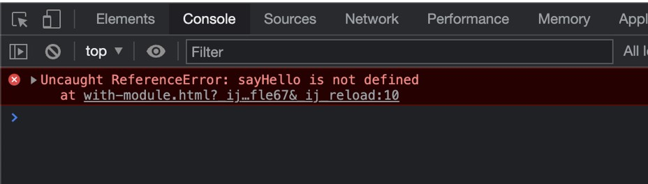

# JavaScript Modules

## Sebelum Belajar

- HTTP
- JavaScript Dasar
- JavaScript Object Oriented Programming
- JavaScript Standard Library

## Agenda

- Pengenalan JavaScript Module
- Live Server
- Tanpa Module vs Dengan Module
- Export dan Import
- Alias
- Export Default
- Module Object
- Dan lain-lain

## #1 Pengenalan JavaScript Modules

### Latar Belakang

- Dahulu kode program JavaScript biasanya dimulai dari kode yang kecil dan sedikit disetiap halaman, jadi jarang sekali kita akan menggunakan kode JavaScript dengan ukuran besar dalam satu halaman web
- Namun saat ini, kebutuhan web sudah berbeda, semenjak makin populernya framework-framework JavaScript untuk membuat FrontEnd, kebutuhkan pembuatan kode JavaScript semakin kompleks dan besar
- Oleh karena itu, sudah seharusnya saat ini, saat membuat kode JavaScript, kita perlu melakukan mekanisme memotong-motong kode JavaScript, sehingga tidak terlalu kompleks dan banyak dalam satu file JavaScript

### JavaScript Modules

- JavaScript Modules merupakan fitur dimana kita bisa membuat module (kode JavaScript yang bisa digunakan ulang) untuk kode JavaScript lain
- JavaScript Modules diawali pada teknologi bernama NodeJS, selanjutnya banyak library yang mengadopsi penggunaan JavaScript Modules di NodeJS agar bisa berjalan di Web Browser, seperti library CommonJS, AMD, RequireJS, dan lain-lain
- Namun untungnya, saat ini Browser modern sudah banyak mendukung JavaScript Modules, kecuali jika masih menggunakan Internet Explorer

### Import dan Export

- Secara garis besar, ada dua kata kunci yang digunakan dalam JavaScript Modules, yaitu `import` dan `export`
- `import` merupakan kata kunci yang digunakan untuk mengambil sesuatu dari module lain
- Sedangkan `export` merupakan kata kunci yang digunakan untuk memberitahu module lain, bagian mana yang ingin kita ekspose keluar, sehingga bisa di-import oleh module lain

## #2 Membuat Project

- Buat folder kosong `belajar-javascript-modules`

## #3 Live Server

- Saat kita menggunakan fitur JavaScript Module, sangat disarankan untuk menjalankan kode JavaScript kita dalam Web Server
- Hal ini karena spesifikasi dari JavaScript module meminta secara default kode JavaScript perlu di satu domain server yang sama, jika kita membuat file html menggunakan URL `file://`, maka dikhawatirkan akan terjadi error CORS (Cross Origin Resource Sharing)

### Visual Studio Code

- Jika menggunakan Visual Studio Code, disarankan untuk menginstall plugin Live Server : <https://marketplace.visualstudio.com/items?itemName=ritwickdey.LiveServer>
- Plugin Live Server ini bisa digunakan untuk menjalankan local web server, sehingga kita bisa mengakses kode web JavaScript kita menggunakan domain localhost

### JetBrains IDE

- Jika menggunakan JetBrains IDE, sudah terdapat fitur untuk membuka halaman web dalam local web server
- Tidak perlu menginstall plugin tambahan

## #4 Tanpa Module

- Sebelum kita membahas JavaScript Module, sekarang kita akan coba dulu tanpa menggunakan module
- Saat kita membuat file JavaScript, lalu kita load file JavaScript tersebut di web, secara default semua kode JavaScript di file tersebut bisa diakses, baik itu variable, function atau class

### Kode: JavaScript Library

```js
// library.js
function sayHello(name) {
	console.info(`Hello ${name}`);
}

function sayGoodBye(name) {
	console.info(`Good bye ${name}`);
}
```

### Kode: Menggunakan Library

```html
<!doctype html>
<html>
	<head>
		<meta charset="utf-8" />
		<meta name="viewport" content="width=device-width, initial-scale=1" />
		<title>Without Module</title>
		<script src="scripts/library.js"></script>
	</head>
	<body>
		<script>
			sayHello("Eko");
			sayGoodBye("Eko");
		</script>
	</body>
</html>
```

### Dengan Module

- Namun jika kita menggunakan module, kita bisa secara selektif memilih bagian kode mana yang ingin kita ekspos keluar
- Secara default kode yang kita buat menggunakan JavaScript Module tidak bisa digunakan dari luar file, kecuali kita memintanya untuk mengekspos keluar

## #5 Membuat Module

- Membuat module sangat sederhana, kita cukup membuat file JavaScript saja
- Yang membedakan adalah, saat kita akan meload file JavaScript dari HTML, kita tidak menggunakan type javascript lagi, melainkan menggunakan type module

### File .js dam .mjs

- Karena File JavaScript Module sebenarnya sama dengan JavaScript, kadang developer membedakan nama file untuk JavaScript Module menggunakan `.mjs`
- Hal ini sebenarnya tidak ada kewajiban, hanya saja agar mempermudah ketika tahapan development, kita bisa dengan mudah membedakan mana file JavaScript biasa, mana file JavaScript module hanya dengan extension file nya saja
- Pada kelas ini, kita akan tetap menggunakan file `.js` ketika membuat module, agar tidak membingungkan untuk pemula

### Kode: JavaScript Module

```js
// say.js

function sayHello(name) {
	console.log(`Hello ${name}`);
}

function sayGoodBye(name) {
	console.log(`Good Bye ${name}`);
}
```

### Kode: Load JavaScript Module

```html
<!doctype html>
<html>
	<head>
		<meta charset="utf-8" />
		<meta name="viewport" content="width=device-width, initial-scale=1" />
		<title>With Module</title>
		<script type="module" src="scripts.say.js"></script>
	</head>
	<body>
		<script>
			sayHello("Eko");
			sayGoodBye("Eko");
		</script>
	</body>
</html>
```

### Hasil JavaScript Module



### Kenapa Error?

- Secara default, saat kita menggunakan fitur JavaScript Module, semua kode (function, variable, class dan lain-lain) tidak akan di ekspos keluar module tersebut
- Jika kita ingin mengekspos kode tersebut, kita harus memberitahunya secara eksplisit

## #6 Export

- `export` merupakan kata kunci yang digunakan untuk mengekspos kode dari sebuah module
- export bisa ditambahkan diawal sebuah variable, function atau class

### Kode: Export Module

```js
// say.js
export function sayHello(name) {
	console.log(`Hello ${name}`);
}

export function sayGoodBye(name) {
	console.log(`Good Bye ${name}`);
}
```

## #7 Import

- Export digunakan untuk mengekspos kode di module, jika kita ingin menggunakan kode yang sudah di ekspos di module, kita bisa menggunakan kata kunci `import`
- Cara menggunakan kata kunci `import` adalah sebagai berikut :
- `import {namaFunction, namaVariable, NamaClass} from "lokasi-module.js"`
- Module hanya bisa digunakan di module lain, jadi pastikan ketika membuat script, kita harus menggunakan type `module`
- Saat menggunakan import, kita tidak perlu lagi menambahkan script module src satu per satu, karena sudah di handle oleh Browser secara otomatis ketika menggunakan module

### Kode: Import Module

```html
<script type="module">
	import { sayHello, sayGoodBye } from "./scripts/say.js";

	sayHello("Eko");
	sayGoodBye("Eko");
</script>
```

## #8 Variable di Module

- Salah satu hal yang membingungkan pada variable di JavaScript adalah ketika kita membuat variable di global scope, maka variable tersebut bisa diubah nilainya oleh file JavaScript lain
- Saat kita menggunakan module, ketika kita buat variable, maka variable tersebut hanya berada pada module tersebut, tidak bisa digunakan di module lain

### Kode: Variable di Module

```js
// variable.js
const name = "Eko Kurniawan Khannedy";
```

### Kode: Menggunakan Variable Module

```html
<!doctype html>
<html>
	<head>
		<meta charset="utf-8" />
		<meta name="viewport" content="width=device-width, initial-scale=1" />
		<title>Variable Module</title>
		<script type="module" src="scripts/variable.js"></script>
	</head>
	<body>
		<script type="module">
			console.info(name);
		</script>
	</body>
</html>
```

### Export Variable di Module

- Jika kita ingin mengekspos variable ke luar module, kita juga bisa menggunakan kata kunci `export` di awal deklarasi variable nya

```js
// variable.js
export const name = "Eko Kurniawan Khannedy";
```

### Kode: Import Variabel

```js
import { name } from "./scripts/variable.js";

console.info(name);
```

## #9 Class di Module

- Selain function dan juga variable, di module juga kita bisa menambahkan class
- Secara default, class tersebut hanya bisa diakses dari dalam module nya saja, tidak bisa diluar module
- Jika kita ingin mengekspos class yang kita buat, kita juga bisa menggunakan kata kunci `export` di awal deklarasi class nya

### Kode: Export Class di Module

```js
// class.js
export class Person {
	constructor(name) {
		this.name = name;
	}

	sayHello(name) {
		console.info(`Hello ${name}, my name is ${this.name}`);
	}
}
```

### Kode: Menggunakan Class di Module

```js
import { Person } from "./scripts/class.js";

const person = new Person("Eko");
person.sayHello("Joko");
```

### Export Multiple

- Sebelumnya kita selalu menggunakan kata kunci `export` diawal `variable`, `function` atau `class`
- Sebenarnya kita bisa menggunakan export sekaligus beberapa data sekaligus, caranya cukup gunakan perintah :
- `export { variable, function, class, danLainLain }`

### Kode: Export Multiple

```js
const company = "Programmer Zaman Now";

function sum(first, second) {
	return first + second;
}

class Company {}

export { company, sum, Company };
```

## #10 Alias

- Saat kita membuat aplikasi JavaScript, semakin lama kemungkinan module akan semakin banyak
- Dan bisa saja akan ada nama variable atau nama function atau nama class yang sama antar module
- Hal ini akan menyulitkan ketika ada module yang menggunakan beberapa module, namun ternyata variable, function atau class nya memiliki nama yang sama
- Untungnya, module memiliki fitur alias, dimana kita bisa mengubah nama variable, function atau class nya

### Alias di Export

- Kita dapat menggunakan alias ketika melakukan export di module
- Caranya menggunakan kata kunci `as`, lalu diikuti dengan nama alias :
- `export { variable as variableLain, function as functionLain, Class as ClassLain }`

### Kode: Alias di Export

```js
const company = "Programmer Zaman Now";

function sum(first, second) {
	return first + second;
}

class Company {

}

export { company as perusahaan, sum as total Company as Perusahaan };
```

### Alias di Import

- Atau rekomendasinya sebenarnya melakukan alias ketika melakukan import
- Sehingga ketika export, nama tidak perlu berubah
- Untuk melakukan alias ketika import, kita bisa gunakan kata kunci `as`, diikuti dengan nama alias :
- `import { function as functionLain } from "./module.js"`

### Kode: Alias di Import

```js
import {
	company as perusahaan,
	sum as total,
	Company as Perusahaan,
} from "./scripts/multiple.js";

console.info(perusahaan);
console.info(total(10, 10));
console.info(new Perusahaan());
```

## #11 Export Default

- Sampai saat ini, kita selalu melakukan export dengan nama, baik itu nama variable, function dan yang lainnya
- Ada juga fitur yang bernama export default, ini adalah fitur yang digunakan untuk mempermudah untuk membuat default data di module, dan membantu JavaScript agar kompatibel dengan `CommonJS` dan `AMD` module system

### Cara Export Default

- `export default namaFunction;`
- `export default function(){ ... }`
- `export default namaVariable;`
- `export default namaVariable = value;`
- `export default NamaClass;`
- `export default class { ... }`

### Cara Import Default

- `import aliasFunction from "./module-default.js"`
- `import {default as aliasVariable} from "./module-default.js"`
- `import aliasVariable from "./module-default.js"`
- `import {default as aliasVariable} from "./module-default.js"`
- `import AliasClass from "./module-default.js"`
- `import {default as AliasClass} from "./module-default.js"`

### Kode: Export Default Function

```js
// say-hello.js
export default function (name) {
	console.info(`Hello ${name}, from default export`);
}
```

### Kode: Import Default Function

```js
import sayHelloDefault from "./scripts/default-function.js";

sayHelloDefault("Eko");
```

### Kode: Export Default Variable

```js
export default name = "Eko";
```

### Kode: Import Default Variable

```js
import aliasName from "./scripts/default-variable.js";

console.info(aliasName);
```

### Kode: Export Default Class

```js
export default class {
	constructor(name) {
		this.name = name;
	}

	sayHi() {
		console.info(`Hi, My name is ${this.name}`);
	}
}
```

### Kode: Import Default Class

```js
import Person from "./scripts/default-class.js";

const person = new Person("Eko");
person.sayHi();
```

### Default dan Named Export

- Dalam satu module, kita bisa menggabungkan export default dan export named
- Yang tidak boleh adalah, dalam satu module, membuat lebih dari satu default
- Cara import default dan named secara bersamaan bisa menggunakan perintah :

- `import defaultAlias, {named1, named2} from "./module.js";`
- `import {default as defaultAlias, named1, named2} from "./module.js";`

### Kode: Export Default dan Named

```js
export const title = "Belajar JavaScript Module";

const content = "Content Belajar JavaScript Module";

const author = "Eko Kurniawan Khannedy";

export { content };
export default author;
```

### Kode: Import Default dan Named

```js
import authorName, { title, content } from "./scripts/default-and-named";

console.info(title);
console.info(content);
console.info(authorName);
```

### Rekomendasi

- Bedakan antara default dan named, karena jika digabungkan kadang akan membingungkan ketika melakukan import
- Sebisa mungkin selalu gunakan `export named` dibandingkan `export default`

## #12 Module Object

- Ketika sebuah module berisikan banyak sekali export data, maka melakukan import satu persatu akan terlihat berantakan
- Rekomendasinya ketika kita ingin mengimport module yang sangat banyak export data nya, gunakan `Module Object`
- Module Object sederhananya adalah object JavaScript yang berisi attribute hasil yang di export pada module
- Cara membuat module object bisa kita lakukan misal seperti ini :
- `import * as NamaModule from "./module.js"`
- Selanjutnya kita bisa gunakan `NamaModule` sebagai object untuk module tersebut

### Kode: Contoh Module

```js
export const firstName = "Eko";
export const middleName = "Kurniawan";
export const lastName = "Khannedy";

export function hello() {
	console.info(`Hello from Eko`);
}

export class Person {
	constructor() {
		this.name = "Eko";
	}
}
```

### Kode: Module Object

```html
<script type="module">
	import * as Eko from "./scripts/module-object.js";

	console.info(Eko.firstName);
	console.info(Eko.middleName);
	console.info(Eko.lastName);
	Eko.hello();

	const person = new Eko.Person();
	console.info(person.name);
</script>
```

## #13 Aggregating Modules

- Ada waktunya kadang kita ingin meng agregate beberapa module menjadi satu agar penggunaannya lebih sederhana
- Jika module sudah banyak, maka ketika butuh banyak kode dari banyak module, kita harus sebutkan nama module tersebut tiap kalo import
- Dengan melakukan aggregate, kita bisa membuat module aggregate, yang isinya menggabungkan export dari module lain
- Caranya sangat mudah, cukup gunakan perintah :
- `export {a, b, c} from "./module.js"`

### Kode: Aggregate Module

```js
export { Person } from "./class.js";
export { sayHello, sayGoodBye } from "./say.js";
export { sum } from "./multiple.js";
```

### Kode: Import Aggregate Module

```js
import { Person, sayHello, sayGoodBye, sum } from "./scripts/aggregate.js";

const person = new Person("Eko");
sayHello("Eko");
sayGoodBye("Eko");
console.info(sum(10, 10));
```

## #14 Dynamic Module Loading

- Saat kita menggunakan module dengan cara import, maka semua module akan di load
- Pada kenyataannya, kadang kita tidak ingin meload semua module diawal, kita ingin meload module ketika dibutuhkan saja, ini akan menghemat bandwith jaringan juga, karena kita tidak perlu download semua module diawal
- JavaScript mendukung dynamic module loading, caranya kita bisa menggunakan function `import()`, dimana hasilnya berupa `Promise<ModuleObject>` (Promise adalah materi yang kompleks, ini akan dibahas di kelas JavaScript Async)

### Kode: Module

```js
// alert.js
export function alertHello(name) {
	alert(`Hello ${name}`);
}
```

### Kode: Dynamic Module

```html
<!doctype html>
<html>
	<head>
		<meta charset="utf-8" />
		<meta name="viewport" content="width=device-width, initial-scale=1" />
		<title>Dynamic Module</title>
	</head>
	<body>
		<input type="text" id="name" />
		<input type="button" value="Say" id="sayButton" />
		<script type="module">
			document.getElementById("sayButton").onclick = function () {
				import("./scripts/slert.js").then((module) => {
					const name = document.getElementById("name").value;
					module.alertHello(name);
				});
			};
		</script>
	</body>
</html>
```

## #15 Materi Selanjutnya

- JavaScript Document Object Model
- JavaScript Async
- JavaScript Decorator
