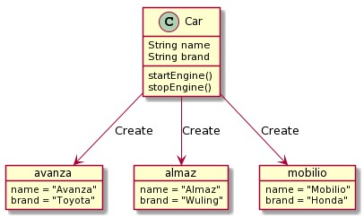
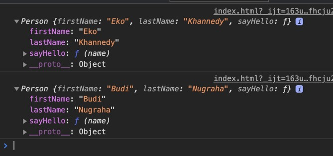
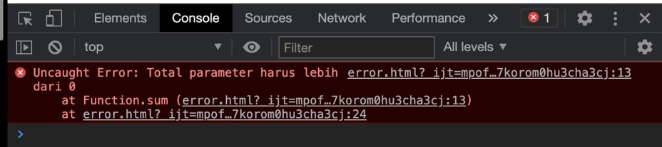

# JavaScript OOP

## Sebelum Belajar

- HTML
- CSS
- JavaScript Dasar

## Agenda

- Pengenalan Object Oriented Programming
- Class
- Object
- Inheritance
- Iterable dan Iterators
- Standard JavaScript Classes
- Dan lain-lain

## #1 Pengenalan Object Oriented Programming

### Apa itu Object Oriented Programming?

- Object Oriented Programming adalah sudut pandang bahasa pemrograman yang berkonsep `"objek"`
- Ada banyak sudut pandang bahasa pemrograman, namun OOP adalah yang sangat populer saat ini.
- Ada beberapa istilah yang perlu dimengerti dalam OOP, yaitu: `Object` dan `Class`

### Apa itu Object?

- Object adalah data yang berisi `field` / `properties` / `attributes` dan `method` / `function` / `behavior`

### Apa itu Class?

- Class adalah blueprint, prototype atau cetakan untuk membuat Object
- Class berisikan deklarasi semua properties dan functions yang dimiliki oleh Object
- Setiap Object selalu dibuat dari Class
- Dan sebuah Class bisa membuat Object tanpa batas

### Class dan Object : Person


### Class dan Object : Car



### OOP di JavaScript

- JavaScript sendiri sebenarnya sejak awal dibuat sebagai bahasa prosedural, bukan bahasa pemrograman berorientasi objek
- Oleh karena, implementasi OOP di JavaScript memang tidak sedetail bahasa pemrograman lain yang memang dari awal merupakan bahasa pemrograman OOP seperti Java atau C++

## #2 Membuat Constructor Function

- Sebenarnya kita sudah belajar tipe data object, dengan cara membuat variable dengan tipe data object
- Namun pembuatan object menggunakan tipe data object, akan membuat object yang selalu unik, sedangkan dalam OOP, biasanya kita akan membuat class sebagai cetakan, sehingga bisa membuat object dengan karakteristik yang sama berkali, kali, tanpa harus mendeklarasikan object berkali-kali seperti menggunakan tipe data object

### Kode: Membuat Object dengan Object

```js
const eko = {
	fistName: "Eko",
	lastName: "Khannedy",
};

const budi = {
	fistName: "Budi",
	lastName: "Nugraha",
};
```

### Membuat Constructor Function

- Sebelum EcmaScript versi 6, pembuatan class, biasanya menggunakan function. Hal ini dikarenakan sebenarnya JavaScript bukanlah bahasa pemrograman yang fokus ke OOP
- Untuk membuat class di JavaScript lama, kita bisa membuat function
- Function ini kita sebut dengan Constructor Function

### Kode: Constructor Function

```js
function Person() {}
```

### Membuat Object dari Constructor Function

- Setelah kita membuat class, jika kita ingin membuat object dari class tersebut, kita bisa menggunakan kata kunci `new`, lalu diikuti dengan nama constructor function nya

### Kode: Membuat Object

```js
function Person() {}

const eko = new Person();
const budi = new Person();
```

## #3 Property di Constructor Function

- Sebenarnya setelah kita membuat object, kita bisa dengan mudah menambahkan property ke dalam object tersebut hanya dengan menggunakan nama variable nya, diikuti tanda `titik` dan `nama` property
- Namun jika seperti itu, alhasil, constructor function yang sudah kita buat tidak terlalu berguna, karena property nya hanya ada di object yang kita tambahkan property
- Untuk menambahkan property di dalam semua object yang dibuat dari constructor function, kita bisa menggunakan kata kunci `this` lalu diikuti dengan nama property nya

### Kode: Property di Constructor Function

```js
function Person() {
	this.firstName = "";
	this.lastName = "";
}

const eko = new Person();
const budi = new Person();
```

## #4 Method di Constructor Function

- Sama seperti pada tipe data object biasanya, kita juga bisa menambahkan method di dalam constructor function
- Jika kita tambahkan method di constructor function, secara otomatis object yang dibuat akan memiliki method tersebut

### Kode: Method di Constructor Function

```js
function Person() {
	this.firstName = "";
	this.lastName = "";
	this.sayHello = function (name) {
		console.info(`Hello ${name}, my name is ${this.firstName]}`);
	}
}
```

## #5 Parameter di Constructor Function

- Karena dalam JavaScript, class adalah berbentuk function, jadi secara default, function tersebut bisa memiliki parameter
- Constructor function sama seperti function biasanya, bisa memiliki parameter, hal ini membuat ketika kita membuat object, kita bisa mengirim langsung data lewat parameter di constructor function tersebut

### Kode: Parameter di Constructor Function

```js
function Person(fistName, lastName) {
	this.firstName = firstName;
	this.lastName = lastName;
	this.sayHello = function (name) {
		console.info(`Hello ${name}, my name is ${this.firstName]}`);
	}
}
```

## #6 Constructor Inheritance

- Dalam constructor kita biasanya membuat property baik itu berisi value ataupun function
- Di dalam constructor, kita bisa memanggil constructor lain, dengan begitu kita bisa mewarisi semua property yang dibuat di constructor lain tersebut
- Untuk memanggil constructor lain, kita bisa menggunakan `NamaConstructor.call(this, parameter)`

### Kode: Constructor Inheritance

```js
function Employee(firstName) {
	this.firstName = firstName;
	this.sayHello = function (name) {
		console.info(`Hello ${name}, my name is ${this.firstName]}`);
	}
}

function Manager(firstName, lastName) {
	Employee.call(this, firstName);
	this.lastName = lastName;
}
```

## #7 Prototype

- JavaScript sebelumnya dikenal dengan pemrograman berbasis prototype
- Memang agak sedikit membingungkan, dan tidak dipungkiri, banyak sekali yang bingung dengan konsep prototype di JavaScript
- Pada chapter ini, kita akan bahas tentang konsep prototype

### Prototype Inheritance

- Saat kita membuat object dari constructor function, object tersebut disebut instance, semua property (baik itu value atau method), akan berada di dalam instance object nya
- Setiap kita membuat sebuah constructor function, maka secara otomatis akan dibuatkan prototype nya, misal ketika kita membuat constructor function Person, maka akan ada `Person.prototype`
- Saat kita membuat sebuah object instance, secara otomatis object tersebut adalah turunan dari `Constructor.prototype` nya
- Untuk mengakses prototype milih sebuah instance, kita bisa menggunakan `__proto__`

### Kode: Object Instance

```js
const eko = new Person("Eko", "Khannedy");
const budi = new Person("Budi", "Nugraha");

console.info(eko);
console.info(budi);
```

### Console: Object Instance



### Diagram Prototype


### Console: Object Instance Inheritance


### Menambah Property ke Prototype

- Property mirip object, dimana kita bisa menambah property baik itu value ataupun method
- Saat kita menambah sebuah property ke Prototype, secara otomatis, semua object instance yang turunan dari prototype tersebut akan memiliki property tersebut

### Kode: Menambah Property ke Instance Object

```js
const eko = new Person("Eko", "Khannedy");

// ini hanya untuk instance object eko
eko.sayBye = function () {
	console.info("Good Bye");
};
```

### Kode: Menambahkan Property ke Prototype

```js
Person.prototype.sayBye = function () {
	console.info("Good Bye");
};

Person.prototype.run = function () {
	console.info(`${this.firstName} is running`);
};
```

### Cara Kerja Prototype Inheritance

- Bagaimana bisa property di prototype diakses dari object instance?
- Ketika kita mengakses property di object instance, pertama akan di cek apakah di object tersebut terdapat property tersebut atau tidak, jika tidak, maka akan di cek di `__proto__` (prototype) nya, jika masih tidak ada, akan di cek lagi di `__proto__` (prototype) yang lebih tinggi, begitu seterusnya, sampai berakhir di Object Prototype

### Console: Prototype Inheritance


## #8 Prototype Inheritance

- Sekarang kita sudah tahu, bahwa prototype selalu memiliki parent, artinya dia adalah turunan, parent tertinggi adalah Object prototype
- Pertanyaannya bagaimana jika kita ingin melakukan inheritance ke Prototype lain?
- Hal ini juga bisa dilakukan, namun agak sedikit tricky, karena hal ini, sebenarnya untuk JavaScript modern, tidak direkomendasikan lagi praktek OOP menggunakan Prototype, karena di `ES6` sudah dikenalkan kata kunci `class` yang akan nanti dibahas di chapter tersendiri

### Kode: Prototype Inheritance Salah

```js
function Employee(name) {
	this.name = name;
}

function Manager(name) {
	this.name = name;
}

Manager.prototype = Employee.prototype;

Manager.prototype.sayHello = function (name) {
	console.info(`Hello ${name}, my name is Manager ${this.name]}`);
}

Employee.prototype.sayHello = function (name) {
	console.info(`Hello ${name}, my name is Employee ${this.name]}`);
}

const employee = new Employee('Budi');
employee.sayHello('Joko');

const manager = new Manager('Eko');
manager.sayHello('Joko');
```

### Diagram Prototype Inheritance Salah


### Kode: Prototype Inheritance Benar

```js
function Employee(name) {
	this.name = name;
}

function Manager(name) {
	this.name = name;
}

Manager.prototype = Object.create(Employee.prototype);

Manager.prototype.sayHello = function (name) {
	console.info(`Hello ${name}, my name is Manager ${this.name]}`);
}

Employee.prototype.sayHello = function (name) {
	console.info(`Hello ${name}, my name is Employee ${this.name]}`);
}

const employee = new Employee('Budi');
employee.sayHello('Joko');

const manager = new Manager('Eko');
manager.sayHello('Joko');
```

### Diagram: Prototype Inheritance Benar


## #9 Kata Kunci Class

- Sejak EcmaScript versi 6, diperkenalkan kata kunci baru, yaitu class, ini merupakan kata kunci yang digunakan untuk membuat class di JavaScript
- Dengan kata kunci `class`, kita tidak perlu lagi menggunakan constructor function untuk membuat class

### Kode: Membuat Class

```js
class Person {}

const eko = new Person();
console.info(eko);
```

## #10 Constructor di Class

- Karena bentuk constructor function mirip dengan function, jadi kita bisa menambah parameter pada constructor function, lantas bagaimana dengan class?
- Di class juga kita bisa menambah constructor, dimana dengan menggunakan constructor, kita juga bisa menambah parameter saat pertama kali membuat object nya
- Untuk membuat constructor di class, kita bisa menggunakan kata kunci `constructor`

### Kode: Constructor di Class

```js
class Person {
	constructor(name) {}
}

const eko = new Person("Eko");
console.info(eko);
```

## #11 Property di Class

- Sama seperti pada constructor function, dalam class pun kita bisa menambahkan property
- Karena hasil akhirnya adalah sebuah object, jadi menambahkan property di class bisa juga dilakukan di instance object nya

### Kode: Property di Class

```js
class Person {
	constructor(name) {
		this.name = name;
	}
}

const eko = new Person("Eko");
console.info(eko);
```

## #12 Method di Class

- Membuat method di class sebenarnya bisa dilakukan dengan cara seperti menambahkan method di constructor function
- Namun, hal tersebut sebenarnya menambahkan method ke dalam instance object
- Khusus untuk method sebaiknya kita menambahkan ke prototype, bukan ke instance object
- Untung nya di class, ada cara mudah menambahkan method dan secara otomatis ditambahkan ke prototype

### Kode: Method di Class

```js
class Person {
	constructor(name) {
		this.name = name;
	}

	sayHello(name) {
		console.info(`Hi ${name}, my name is ${this.name}`);
	}
}
```

### Console: Method di Prototype


## #13 Class Inheritance

- Sebelumnya kita sudah tahu bahwa prototype mendukung pewarisan, walaupun agak sedikit tricky cara pembuatannya
- Untungnya itu diperbaiki di `ES6` dengan fitur class nya
- Sebuah class bisa melakukan pewarisan dari class lainnya dengan menggunakan kata kunci `extends`
- Di JavaScript, class inheritance sama seperti prototype inheritance, hanya bisa memiliki satu parent class

### Kode: Class Inheritance

```js
class Employee {
	sayHello(name) {
		console.info(`Hi ${name}, my name is employee ${this.name}`);
	}
}

class Manager extends Employee {
	sayHello(name) {
		console.info(`Hi ${name}, my name is manager ${this.name}`);
	}
}

const budi = new Employee();
budi.name = "Budi";
budi.sayHello("Joko");

const eko = new Manager();
eko.name = "Eko";
eko.sayHello("Joko");
```

### Console: Class Inheritance


## #14 Super Constructor

- Class Inheritance sifatnya seperti Prototype Inheritance
- Bagaimana dengan Constructor Inheritance? Sebenarnya Constructor Inheritance hanyalah melakukan eksekusi constructor lain dengan tujuan agar property di constructor lain bisa ditambahkan ke instance object ini
- Dalam kasus ini, jika kita ingin mencapai hasil yang sama, kita bisa menggunakan kata kunci super di dalam constructor
- Kata kunci super digunakan untuk memanggil constructor super class
- Jika di child class kita membuat constructor, maka kita wajib memanggil parent constructor, walaupun di parent tidak ada constructor

### Kode: Super Constructor

```js
class Employee {
	constructor(fistName) {
		this.firstName = firstName;
	}

	sayHello(name) {
		console.info(`Hi ${name}, my name is employee ${this.firstName}`);
	}
}

class Manager extends Employee {
	constructor(firstName, lastName) {
		super(firstName);
		this.lastName = lastName;
	}

	sayHello(name) {
		console.info(`Hi ${name}, my name is manager ${this.firstName}`);
	}
}
```

## #15 Super Method

- Selain digunakan untuk memanggil constructor milih parent class, kata kunci `super` juga bisa digunakan untuk mengakses method parent class
- Caranya bisa menggunakan super titik nama function nya
- Dengan kata lain, super sebenarnya adalah reference ke parent prototype, mirip seperti `__proto__`

### Kode: Super Method

```js
class Shape {
	point() {
		console.info("Point Shape");
	}
}

class Circle extends Shape {
	point() {
		super.paint(); // memanggil point() method parent class
		console.info("Point Circle");
	}
}
```

## #16 Getter dan Setter di Class

- Class juga mendukung pembuatan getter dan setter
- Perlu diingat, getter dan setter ini akan berada di prototype, bukan di instance object

### Kode: Getter dan Setter

```js
class Person {
	constructor(firstName, lastName) {
		this.firstName = firstName;
		this.lastName = lastName;
	}

	get fullName() {
		return `${this.firstName} ${this.lastName}`;
	}

	set fullName(value) {
		const result = value.split(" ");
		this.firstName = result[0];
		this.lastName = result[1];
	}
}
```


### Public Class Field

- Biasanya, saat kita ingin menambahkan field (property yang berisi value), kita biasanya tambahkan di constructor
- Namun, ada proposal di EcmaScript yang mengajukan pembuatan public class field ditempatkan diluar constructor, selevel dengan penempatan method
- Proposal ini masih belum final, namun beberapa browser sudah mendukung nya
- <https://github.com/tc39/proposal-class-fields>

### Public Class Field

- Dalam proposal tersebut juga disebutkan bahwa EcmaScript akan mendukung access modifier `public` dan `private`
- Public artinya bisa diakses dari luar class, dan private hanya bisa diakses dari dalam class saja
- Private class field akan kita bahas di chapter selanjutnya
- Untuk membuat public class field, kita bisa langsung buat nama field dengan value nya selevel dengan method
- Jika kita tidak memasukkan value ke dalam field tersebut, artinya field tersebut memiliki value `undefined`

### Kode: Public Class Field

```js
class Customer {
	firstName;
	lastName;
	balance = 0;
}

const eko = new Customer();
console.info(eko);
```


### Kode: Public Class Field dan Constructor

```js
class Customer {
	firstName;
	lastName;
	balance = 0;

	constructor(fistName, lastName) {
		this.firstName = firstName;
		this.lastName = lastName;
	}
}

const eko = new Customer("Eko", "Kurniawan");
console.info(eko);
```


## #17 Private Class Field

- Secara default, saat kita menambahkan field, maka field tersebut bisa diakses dari manapun
- Jika kita ingin membuat field yang bersifat private (hanya bisa diakses di dalam class), kita bisa menggunakan tanda `#` sebelum nama field nya
- Ini dinamakan private class field, dan hanya bisa diakses dari dalam class saja

### Kode: Private Class Field

```js
class Counter {
	#counter = 0;

	increment() {
		this.#counter++;
	}

	decrement() {
		this.#counter--;
	}

	get() {
		return this.#counter;
	}
}

const counter = new Counter();
counter.increment();
counter.increment();
counter.increment();
counter.increment();
counter.increment();

console.info(counter.get());
```

## #18 Private Method

- Sama seperti field, terdapat proposal juga untuk menambah fitur private method di EcmaScript
- Dengan demikian, access modifier private juga bisa digunakan di method
  Caranya sama, dengan menambahkan tanda `#` diawal method, maka secara otomatis method tersebut adalah `private`
- Ingat fitur ini masih dalam tahapan, belum benar-benar menjadi standard EcmaScript, jadi mungkin tidak semua browser mendukung fitur ini
- <https://github.com/tc39/proposal-private-methods>

### Kode: Private Method

```js
class Person {
	say(name) {
		if (name) {
			this.#sayWithName(name);
		} else {
			this.sayWithoutName();
		}
	}

	#sayWithoutName() {
		console.info("Hello");
	}

	#sayWithName(name) {
		console.info(`Hello ${name}`);
	}
}

const eko = new Person();
eko.say("Budi");
```

## #19 Operator instanceof

- Kadang ada kasus kita ingin mengecek apakah sebuah object merupakan instance dari class tertentu atau bukan
- Kita tidak bisa menggunakan operator `typeof`, karena object dari class, jika kita gunakan operator typeof, hasilnya adalah `"object"`
- Operator instanceof akan menghasilkan boolean, true jika benar object tersebut adalah instance object nya, atau false jika bukan

### Kode: Operator instanceof

```js
class Employee {}

class Manager {}

const budi = new Employee();
const eko = new Manager();

console.info(budi instanceof Employee); // true
console.info(budi instanceof Manager); // false
console.info(eko instanceof Employee); // false
console.info(eko instanceof Manager); // true
```

### Operator instanceof di Class Inheritance

- Operator instanceof mendukung class inheritance, artinya `instanceof` juga bisa digunakan untuk mengecek, apakah sebuah object adalah instance dari class tertentu, atau turunan dari class tertentu?

### Kode: Operator instanceof di Inheritance

```js
class Employee {}

class Manager extends Employee {}

const budi = new Employee();
const eko = new Manager();

console.info(budi instanceof Employee); // true
console.info(budi instanceof Manager); // false

// true karena Manager adalah turunan dari Employee
console.info(eko instanceof Employee); // true
console.info(eko instanceof Manager); // true
```

## #20 Static Class Field

### Kata Kunci static

- `static` adalah kata kunci yang bisa kita tambahkan sebelum field atau method, biasannya ketika kita membuat field atau method, maka secara otomatis field akan menjadi property di instance object, dan method akan menjadi function di prototype
- Jika kita tambahkan static, maka hal itu tidak terjadi

### Static Class Field

- Jika kita tambahkan static dalam class field, secara otomatis field tersebut bukan lagi milik instance object, melainkan milik class nya itu sendiri
- Biasanya static digunakan jika kita ingin membuat utility field atau function
- Cara mengakses static class field pun tidak lagi lewat object, melainkan lewat class nya
- Static class field bisa diartikan sifatnya global, tidak peduli diakses dimana atau siapa yang mengakses, hasilnya akan sama

### Kode: Static Class Field

```js
class Configuration {
	static name = "Belajar JavaScript Dasar";
	static version = 1.0;
	static author = "Eko Kurniawan";
}
```

### Kode: Mengakses Static Class Field

```js
console.inf(Configuration.name);
console.inf(Configuration.version);
console.inf(Configuration.author);
```

## #21 Static Method

- Kata kunci `static` juga tidak hanya bisa ditambahkan di field, tapi juga di method
- Jika kita tambahkan di method, artinya method tersebut jadi milik class nya, bukan prototype
- Dan untuk mengakses method tersebut, kita juga bisa lakukan seperti mengakses static class field

### Kode: Static Method

```js
class MathUtil {
	static sum(...numbers) {
		let total = 0;
		for (const number of numbers) {
			total += number;
		}
		return total;
	}
}

const sum = MathUtil.sum(1, 1, 1, 1, 1);
console.info(sum);
```

## #22 Error

- Saat membuat aplikasi, sudah tentu kita tidak akan terhindar dari yang namanya error
- Di JavaScript, Error merupakan sesuatu yang sudah standar
- Banyak sekali class error di JavaScript, namun semua class error di JavaScript selalu berujung di class `Error`, artinya class Error adalah superclass untuk semua jenis error di JavaScript
- Contoh class error yang terdapat di JavaScript contohnya `SyntaxError`, `TypeError`, `EvalError`, dan lain-lain
- <https://developer.mozilla.org/en-US/docs/Web/JavaScript/Reference/Global_Objects/Error#error_types>

### Throw Error

- Saat kita membuat instance object dari class Error, tidak lantas otomatis terjadi error
- Kita perlu memberitahu program kita, bahwa kita akan mentrigger sebuah error terjadi, atau istilahnya adalah melempar error (throw error)
- Untuk melempar error, kita bisa gunakan kata kunci `throw`, diikuti dengan instance object error nya
- Jika terjadi error, maka otomatis kode program kita akan terhenti, dan kita bisa melihat detail errornya di console di aplikasi browser kita

### Kode: Throw Error

```js
class MathUtil {
	static sum(...numbers) {
		if (numbers.length === 0) {
			throw new Error("Total parameter harus lebih dari 0");
		}

		let result = 0;
		for (const number of numbers) {
			result += number;
		}
		return result;
	}
}

console.info(MathUtil.sum());
console.info(MathUtil.sum(1, 1, 1, 1, 1));
```

### Console: Throw Error



## #23 Error Handling

- Saat terjadi error di kode program JavaScript, kadang kita tidak ingin program kita berhenti
- Di JavaScript, kita bisa menangkap jika terjadi error
- Kita bisa menggunakan try catch statement untuk menangkap error
- Pada block try, kita akan mencoba mengakses kode program yang bisa menyebabkan error, dan jika terjadi error, block try akan berhenti dan otomatis masuk ke block catch
- Jika tidak terjadi error, block catch tidak akan dieksekusi

### Kode: Error Handling

```js
try {
	console.info(MathUtil.sum());
	console.info("Kode Block Try Akan Berhenti");
} catch (error) {
	console.error(`Terjadi error: ${error.message}`);
}

console.info("Kode Program Tidak Akana Berhenti");
```

### Kata Kunci finally

- Kadang kita ingin melakukan sesuatu entah itu terjadi error ataupun tidak
- Dalam try `catch,` kita bisa menambahkan block `finally`
- Block finally ini akan selalu dieksekusi setelah try catch selesai, entah terjadi error atau tidak, block finally akan selalu dieksekusi

### Kode: Kata Kunci finally

```js
try {
	console.info(MathUtil.sum());
	console.info("Kode Block Try Akan Berhenti");
} catch (error) {
	console.error(`Terjadi error: ${error.message}`);
} finally {
	console.info("Kode Program Selesai");
}
```

### Try Finally

- Kata kunci `finally` juga bisa digunakan tanpa perlu menggunakan catch
- Biasanya ini digunakan dalam kasus tertentu

### Kode: Try Finally

```js
class Counter {
	constructor() {
		this.value = 1;
	}

	next() {
		try {
			return this.value;
		} finally {
			this.value++;
		}
	}
}

const counter = new Counter();
console.info(counter.next());
console.info(counter.next());
console.info(counter.next());
console.info(counter.next());
console.info(counter.next());
```

## #24 Membuat Class Error Manual

- Walaupun JavaScript sudah memiliki standard class Error
- Namun alangkah baiknya, kita membedakan tiap jenis error
- Untuk membuat error sendiri secara manual sangatlah mudah, cukup membuat class turunan dari class Error
- Dan jangan lupa tambahkan parameter message, agar bisa dikirimkan ke parameter di constructor class Error

### Kode: Class ValidationError

```js
class ValidationError extends Error {
	constructor(message, field) {
		super(message);
		this.field = field;
	}
}
```

### Kode: Menggunakan ValidationError

```js
class MathUtil {
	static sum(...numbers) {
		if (numbers.length === 0) {
			throw new ValidationError(
				"Total parameter harus lebih dari 0",
				"numbers",
			);
		}

		let result = 0;
		for (const number of numbers) {
			result += number;
		}
		return result;
	}
}
```

### Kode: Try Catch

```js
try {
	console.info(MathUtil.sum());
} catch (error) {
	if (error instanceof ValidationError) {
		console.error(
			`Terjadi error di field ${error.field} dengan error : ${error.message}`,
		);
	} else {
		console.error(`Terjadi error : ${error.message}`);
	}
}
```

## #25 Iterable dan Iterator

- Salah satu fitur terbaru di `ES6` adalah `iterable`
- Iterable adalah spesial object yang memiliki standarisasi
- Dengan mengikuti standarisasi Iterable, secara otomatis kita bisa melakukan iterasi terdapat data tersebut dengan menggunakan perulangan `for...of`
- Contoh yang sudah mengikuti standarisasi Iterable adalah `string`, `Array`, `Object`, dan lain-lain

### Kode: Kontrak Iterable (dalam TypeScript)

```ts
interface Iterable<T> {
	[Symbol.iterator](): Iterator<T>;
}
```

### Kode: Kontrak Iterator (dalam TypeScript)

```ts
interface Iterator<t, TReturn = any, TNext = undefined> {
	// NOTE: 'next' is defined using a tuple to ensure we report the correct
	next(...args: [] | [TNext]): IteratorResult<T, TReturn>;
	return?(value?: TReturn): IteratorResult<T, TReturn>;
	throw?(e?: any): IteratorResult<T, TReturn>;
}
```

### Kontrak: IteratorResult (dalam TypeScript)

```ts
interface IteratorYieldResult<TYield> {
	done?: false;
	value: TYield;
}

interface IteratorReturnResult<TReturn> {
	done: true;
	value: TReturn;
}

type IteratorResult<T, TReturn = any> =
	| IteratorYieldResult<T>
	| IteratorReturnResult<TReturn>;
```

### Cara Kerja Iterable dan iterator

- Jika kita mengikuti kontrak Iterable, maka object yang kita buat akan bisa dilakukan iterasi menggunakan `for...of`
- Setiap kita melakukan perulangan, object Iterator akan dibuat
- Hal ini menjadi aman jika kita melakukan iterasi berulang-ulang, karena Iterator baru akan dibuat terus menerus

### Kode: Membuat Counter Iterator Result

```js
class CounterIteratorResult {
	constructor(value, done) {
		this.done = done;
		this.value = value;
	}
}
```

### Kode: Membuat Counter Iterator

```js
class CounterIterator {
	constructor(value, max) {
		this.value = value;
		this.max = max;
	}

	next() {
		try {
			if (this.value > this.max) {
				return new CounterIteratorResult(this.value, true);
			} else {
				return new CounterIteratorResult(this.value, false);
			}
		} finally {
			this.value++;
		}
	}
}
```

### Kode: Membuat Counter Iterable

```js
class Counter {
	constructor(value, max) {
		this.value = value;
		this.max = max;
	}

	[Symbol.iterator]() {
		return new CounterIterator(this.value, this.max);
	}
}
```

### Kode: Menggunakan Counter Iterable

```js
const counter = new Counter(1, 10);
for (const element of counter) {
	console.info(element);
}
```

## #26 Materi Selanjutnya

- JavaScript Standard Library
- JavaScript Modules
- JavaScript Document Object Model
- JavaScript Async
- JavaScript Web API
