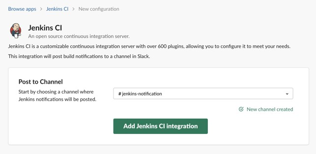
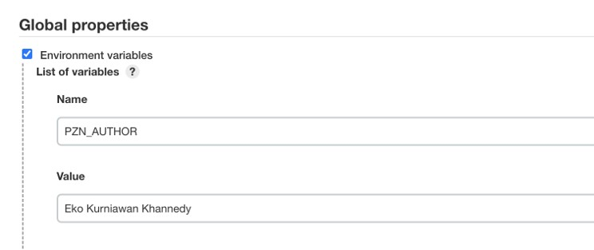
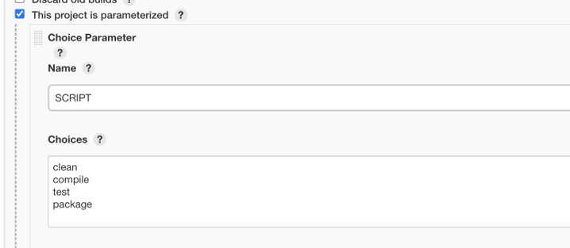

# Jenkins Dasar

## Sebelum Belajar

- Sudah Mengikuti Kelas Git dari Programmer Zaman Now
- Pernah Menggunakan Sistem Operasi Linux
- Pernah menggunakan VPS atau Cloud Compute

## Agenda

- Pengenalan Jenkins
- Menginstall Jenkins
- Job
- Integrasi dengan Git
- Credential
- Build Step
- Scheduled Job
- Dan lain-lain

## #1 Pengenalan Automation Server

### Sebelum Automation Server

- Dalam pengembangan perangkat lunak, koding hanyalah tahapan awal saja
- Setelah koding, masih banyak hal yang biasanya dilakukan oleh pengembang perangkat lunak sebelum aplikasi yang dibuat sampai ke production server
- Sebelum adanya Automation Server, biasanya semuanya dilakukan secara manual, namun resikonya adalah sering terjadi kesalahan dan tidak konsisten
- Contoh menjalankan unit test, download dependency aplikasi, setup database, membuat distribusi aplikasi, dan lain-lain
- Hal-hal diatas sangat kompleks jika harus dilakukan secara manual terus menerus

### Pengenalan Automation Server

- Automation Server adalah aplikasi yang bisa kita gunakan untuk melakukan proses otomatisasi perintah yang kita instruksikan
- Ada banyak sekali keuntungan yang kita dapatkan jika menggunakan Automation Server, dibanding manual dalam tahapan pengembangan perangkat lunak
- Automation Server mempercepat proses, karena kita tidak perlu menunggu di Laptop kita.
- Automation Server bisa berjalan konsisten, di Laptop programmer mungkin perangkat lunak bisa berbeda-beda
- Automation Server bisa berjalan secara otomatis, bisa memberitahu kita ketika terjadi kesalahan, dan lain-lain

### Contoh Automation Server

- Jenkins <https://www.jenkins.io/>
- Team City <https://www.jetbrains.com/teamcity/>
- GitLab CI/CD <https://docs.gitlab.com/ee/ci/>
- Github Action <https://github.com/features/actions>
- Atlassian Bamboo <https://www.atlassian.com/software/bamboo>
- Circle CI <https://circleci.com/>
- Travis CI <https://travis-ci.org/>
- Dan lain-lain

## #2 Pengenalan Jenkins

- Jenkins adalah Open Source Automation Server yang paling populer saat ini
- Sebelum Jenkins, awalnya project ini bernama Hudson
- Hudson dibuat menggunakan Java, dan pengembang inti dari Hudson kebanyakan bekerja di Sun Microsystem (pemiliki Java)
- Tahun 2011, terjadi sengketa setelah pembelian Sun Microsystem oleh Oracle, dan karena trademark Hudson dipegang oleh Oracle, akhirnya pengembang inti dari Hudson membuat project baru bernama Jenkins dari source code Hudson
- Hudson sendiri akhirnya di donasikan ke Eclipse Foundation tahun 2012 dan akhirnya pengembangannya berhenti tahun 2017
- <https://www.jenkins.io/>

### Jenkins Plugin

- Jenkins sendiri merupakan sebuah platform untuk Automation Server
- Kebanyakan fitur di Jenkins sendiri tersedia dalam bentuk plugin, bahkan kita bisa membuat plugin sendiri jika kita mau
- <https://plugins.jenkins.io/>

## #3 Menginstall Jenkins

Minimum

- 256 MB of RAM
- 1 GB of Drive Space

Recommended

- 4 GB+ of RAM
- 50 GB+ of Drive Space

### Software Requirement

- SSH
- Java 11 <http://jdk.java.net/archive/>
- Git <https://git-scm.com/>
- Web Browser

### Sistem Operasi Linux

- Pada kelas ini, kita akan menggunakan Linux sebagai sistem operasi yang menjalankan Jenkins nya
- Ini karena kebanyakan di perusahaan biasanya menggunakan Linux sebagai sistem operasi untuk Jenkins
- Tapi kita tetap bisa menggunakan sistem operasi apapun jika mau, karena Jenkins bisa berjalan di semua sistem operasi

### Setup Virtual Machine

- Pada kelas ini, kita akan setup dari awal menggunakan Virtual Machine
- Teman-teman bisa menggunakan VPS di penyedia layanan hosting, atau bisa menggunakan Virtual Machine Manager seperti VirtualBox di laptop, atau langsung menggunakan laptop sendiri jika menggunakan sistem operasi Linux

### Setup SSH

- Pastikan setup SSH terlebih dahulu di Laptop atau VM yang kita gunakan
- Gunakan perintah :
- `ssh-keygen`

### Menginstall Software Requirement

- Menginstall Java 11
- Menginstall Git

### Menginstall Jenkins

- Download War File Jenkins di <https://www.jenkins.io/download/>
- Jalankan Jenkins menggunakan perintah :
- `java -jar jenkins.war --httpPort=xxx`

## #4 Jenkins Data

- Jenkins tidak membutuhkan database untuk menyimpan seluruh konfigurasi dan datanya
- Jenkins akan secara otomatis membuat folder `.jenkins` di home directory sistem operasi kita
- Di folder tersebut lah, Jenkins akan menyimpan seluruh datanya
- Jika kita menghapus folder `.jenkins`, secara otomatis kita akan menghapus seluruh data Jenkins

### Membuat job

- Job adalah sebutan untuk tugas automation di Jenkins
- Saat kita menginstall Jenkins, tidak ada satupun Job sama sekali
- Kita bisa membuat Job di Jenkins menggunakan web Jenkins

## #5 Tampilan Membuat Job

## #6 Menginstall Git Plugin

- Secara default, Jenkins tidak tahu bagaimana cara mengambil kode program yang terdapat di Git
- Kita perlu menginstall Git Plugin terlebih dahulu
- Setelah menginstall Git Plugin, maka secara otomatis kita bisa menambahkan sumber kode dari git repository di Job yang sudah kita buat

### Tampilan Git Plugin

- `jenkins-dasar-02.jpg`

### Setup SSH di GITHUB

- Kita akan menggunakan Github sebagai Git Repository untuk menyimpan contoh project kita
- Oleh karena itu, kita perlu melakukan setup Github terlebih dahulu, agar Jenkins bisa mengambil kode program di Github
- Silahkan tambahkan SSH Public Key di VM Jenkins ke Github

### Tampilan Setup Git Key di Github

## #7 Credentials

- Saat kita melakukan koneksi ke Git, biasanya kita perlu credential SSH
- Jenkins sendiri bisa menggunakan bawaan dari sistem operasi nya, namun hal ini tidak disarankan
- Hal ini karena kedepannya ketika kita setup beberapa server untuk Jenkins, kemungkinan credential SSH nya bisa berbeda
- Oleh karena itu, ada baiknya semua informasi credential disimpan di Jenkins
- Jenkins sendiri memiliki fitur bernama Credentials, dimana kita bisa menyimpan credential, salah satunya credential untuk SSH

### Tampilan Credential

## #8 Integrasi dengan Git

- Setelah kita setup Git dengan Github, dan juga menambahkan Credential SSH ke Jenkins, sekarang kita bisa mulai integrasi Jenkins dengan Git di Github
- Namun sebelumnya, yang perlu kita lakukan adalah, pastikan memiliki project di Github yang bisa digunakan sebagai sumber kode untuk Jenkins Job yang sudah kita buat

### Contoh Project

- <https://github.com/ProgrammerZamanNow/belajar-spring-dasar>

### Konfigurasi Git di Job

## #9 Build Step

- Source Code Management menggunakan Git, hanyalah awal dari tahapan Job, biasanya Job itu akan menjalankan perintah-perintah yang diperlukan, atau dalam Jenkins dinamakan Build Step
- Di Jenkins, kita bisa melakukan konfigurasi Job untuk menambahkan Build Step yang kita mau, bisa lebih dari satu

### Menambah Build Step

## #10 Build History

- Jenkins menyimpan seluruh riwayat build yang kita lakukan, baik itu di sukses ataupun gagal
- Hal ini memungkinkan kita bisa melihat hasil build kita yang lama, sehingga bisa mempermudah kita ketika proses debugging
- Selain itu, Jenkins juga memiliki fitur trend, dimana bisa memperlihatkan statistic Build History kita

### Tampilan Build History Trend

## #11 Post Build Action

- Jenkins memiliki fitur bernama Post Build Action
- Fitur ini biasanya digunakan untuk memberitahu status sebuah Job ketika proses build selesai
- Misal, setelah sebuah Job selesai, kita ingin mengirim statusnya ke Email, Chat atau yang lainnya
- Contohnya, misal kita ingin mengirim status Job ke Slack, salah satu platform untuk Chat yang lumayan populer di dunia kerja

### Slack Notification Plugin

### Setup Slack Jenkins Integration

### Setup Jenkins Slack Credential

### Setup Jenkins Slack Configuration

### Konfigurasi Post Build Action

### Tampilan Contoh Slack Notification

## #12 Copy Job

- Saat membuat Job, kadang banyak sekali konfigurasi yang sama antara Job yang satu dengan Job yang lain, misal Build Step sama atau Post-Build Action yang sama
- Jenkins memiliki fitur yang bisa digunakan untuk membuat Job baru dengan cara copy dari Job yang sudah ada

### Tampilan Copy Job

## #13 Scheduled Job

- Secara default Job di Jenkins hanya akan berjalan jika kita melakukan trigger build secara manual
- Kadang ada kasus dimana kita ingin menjalankan Jenkins Job dengan scheduled yang pasti, misal tiap jam 12 malam, atau bahkan tiap jam, tiap menit, dan sebagainya
- Contoh kasus misal, kita ingin menjalankan backup database tiap jam 12 malam misalnya

### Build Periodically

- Untuk membuat Scheduled Job, kita cukup tambahkan informasi scheduled dalam bentuk waktu Cron pada bagian Build Periodically
- Secara otomatis, Jenkins akan menjalankan Job tersebut sesuai dengan scheduled Cron
- <https://crontab.guru/>

### Tampilan Build Triggers

### Tampilan History Scheduled Job

## #14 Poll SCM

- Saat menggunakan Scheduled Job menggunakan Cron, Job akan selalu di eksekusi ketika sudah waktunya sesuai dengan waktu Cron
- Kadang, ada kasus dimana kita ingin membuat Scheduled Job, namun hanya ingin menjalankan Job, ketika terjadi perubahan di Source Code saja
- Pada kasus ini, kita bisa menggunakan Poll SCM
- Poll SCM mirip dengan Scheduled Job, namun hanya akan menjalankan Job nya, ketika terjadi perubahan di Source Code, jika tidak ada perubahan, maka Job tidak akan dijalankan

### Tampilan Poll SCM

## #15 Disabled Job

- Saat kita tidak butuh Job lagi, ada dua hal yang bisa kita lakukan
- Menghapus Job, artinya Job dan semua konfigurasi akan hilang secara permanen, atau
- Men-disabled Job, artinya Job tidak akan aktif, namun konfigurasi dan Job tetap ada, dan kita bisa mengaktifkan nya lagi jika kita mau

### Tampilan Disabled Job

## #16 Jenkins Environment Variable

- Saat kita menggunakan Build Step berupa execute shell atau batch. Jenkins secara otomatis akan menambahkan environment variable yang berisikan informasi dari Job dan Jenkins nya itu sendiri
- Kadang pada beberapa kasus, kita sering butuh informasi dari Jenkins dan Job nya
- Kita bisa lihat semua env variable yang tersedia di Jenkins di halaman `JENKINS_URL/env-vars.html/`
- Untuk menggunakan env variable di shell atau batch, kita bisa gunakan tanda `${NAMA_ENV_VAR}`

### Contoh Menggunakan Env Variable

## #17 Global Environment Variable

- Selain menggunakan env variable yang disediakan oleh Jenkins, kita juga bisa menambahkan environment variable tambahan ke Jenkins
- Environment variable yang kita tambahkan secara otomatis akan teregistrasi secara global, dan bisa digunakan di semua Job
- Fitur ini sangat cocok ketika kita butuh data konfigurasi yang bisa diubah-ubah, tanpa harus mengubah Build Step setiap Job yang kita buat
- Untuk menambahkan environment variable, kita bisa menggunakan menu Manage Jenkins -> Configure System -> Global Properties -> Environment Variables

### Menambah Environment Variable

### Menggunakan Environment Variable

## #18 Build Parameter

- Saat membuat Job, kadang ada kasus dimana kita ingin meminta input data dari user sebelum menjalankan Job tersebut
- Misal ketika kita ingin menjalankan Job untuk deploy aplikasi, kita bisa meminta input dari user ingin di deploy kemana misalnya
- Jenkins memiliki fitur Build Parameter, dimana kita bisa meminta input data dari user sebelum menjalankan Job nya
- Terdapat banyak sekali jenis input data, seperti boolean, string, choice, secret, dan lain-lain
- Semua input data yang diberikan oleh user, secara otomatis bisa kita ambil seperti environment variable di Build Step

### Menambah Build Parameter

### Menggunakan Build Parameter

### Manjalankan Job

## #19 Discard Old Build

- Jenkins menyimpan semua history build di folder `.jenkins` di HOME directory
- Secara default, Jenkins akan menyimpan semua history Job selamanya, hal ini tidak baik terutama jika sampai kita lupa, maka server Jenkins bisa kehabisan ruang penyimpanan
- Jenkins memiliki fitur penghapusan riwayat build yang lama secara otomatis, baik itu menggunakan hari atau jumlah build
- Ketika kita menambahkan aturan ini, secara otomatis Jenkins akan melakukan pengecekan ketika selesai menjalankan Job

### Tampilan Discard Old Builds

## #20 Build Executor

- Jenkins menjalankan semua Job dalam Executor
- Secara default Jenkins memiliki 2 Executor yang digunakan untuk menjalankan Job
- Saat semua Executor sedang sibuk, maka Job yang akan dijalankan harus menunggu terlebih dahulu sampai Executor ada yang tidak sibuk
- Kita bisa mengubah jumlah Executor dari menu Manage Jenkins -> Configure Jenkins -> # of Executor
- Harap bijak menentukan jumlah Executor, karena semakin banyak proses Job yang berjalan secara paralel, semakin banyak pula resource CPU dan Memory yang akan dibutuhkan

## #21 User Management

- Saat pertama kita menginstall Jenkins, kita telah membuat User untuk login ke web Jenkins
- Jika kita ingin menambah user baru, kita bisa menggunakan menu Manage Jenkins -> Manage Users -> Create User

### Anonymous Read Only

- Secara default, hanya user yang sudah login yang bisa melihat semua Job di Jenkins
- Pada kasus misal ketika kita menggunakan Jenkins untuk project Open Source, ada baiknya kita membolehkan akses untuk Read Only ke Guest User
- Kita bisa mengaktifkan fitur ini di menu Manage Jenkins -> Configure Global Security -> Authorization -> Logged-in -> Allow Anonymous Read Access

### Tampilan Guest User

### Role Based Authorization Strategy

- Secara default, saat kita membuat user di Jenkins, user tersebut bisa melakukan apapun layaknya admin user
- Kadang kita ingin membatasi akses untuk user, sayangnya secara default di Jenkins kita tidak bisa melakukan ini
- Namun terdapat plugin Role Based Authorization Strategy yang bisa kita gunakan dalam kasus ini
- <https://plugins.jenkins.io/role-strategy/>

### Menginstall Role-Based Authorization Strategy

### Mengubah Authorization

### Manage and Assign Roles

### User Management Lainnya

- <https://plugins.jenkins.io/saml/>
- <https://plugins.jenkins.io/google-login/>
- <https://plugins.jenkins.io/github-oauth/>
- <https://plugins.jenkins.io/gitlab-oauth>
- Dan lain-lain <https://plugins.jenkins.io/ui/search/?labels=user>

## #22 Trigger Build Remotely

- Jenkins memiliki fitur dimana kita bisa meminta Jenkins untuk menjalankan Job secara Remote
- Remote dalam artinya tanpa harus membuka web Jenkins
- Fitur ini cocok sekali ketika misal kita membuat Bot, sehingga Bot tersebut bisa memerintah Jenkins untuk menjalankan Job yang kita minta
- Saat kita menggunakan fitur ini, kita perlu menggunakan Authentication Token, yaitu token yang perlu kita gunakan ketika kita akan menjalankan Job secara Remote

### Tampilan Trigger Build Remotely

## #23 View

- Saat Job sudah banyak, kadang kita ingin membuat grup yang berisikan kumpulan Job tertentu, di Jenkins fitur ini disebut View
- Kita bisa membuat View dari menu `(+)` yang terdapat di halaman Dashboard, lalu bisa memilih Job mana yang ingin kita tambahkan ke View tersebut

### Membuat View

### Hasil View

## #24 Nodes

- Saat kita menggunakan Jenkins, rekomendasinya sebenarnya tidak menjalankan Jenkins single Node, apalagi jika Job nya sudah sangat banyak
- Jenkins mendukung Nodes atau Agent, dimana kita bisa menambahkan Node Jenkins lainnya sehingga bisa digunakan untuk menjalankan Job
- Dengan menambahkan Node Jenkins, kita tidak perlu melakukan setup Job secara manual satu persatu di semua Node Jenkins, karena secara otomatis Jenkins akan mendistribusikan eksekusi Job nya ke semua Node
- Untuk menambah Node baru, kita bisa menggunakan menu Manage Jenkins -> Manage Nodes and Clouds -> New Node

### SSH Build Agent

- Saat kita menambah Node, terdapat banyak pilihan untuk terkoneksi dari Node master ke Node agent
- Salah satu yang aman adalah menggunakan SSH, namun secara default plugin nya tidak terinstall
- Jadi kita perlu menginstall plugin SSH Build Agent
- <https://plugins.jenkins.io/ssh-slaves/>

### Menginstall SSH Build Agent

### Menginstall VM Baru

- Sebelum menambah Node, silahkan install VM Baru, dan jangan lupa untuk menginstall Software Requirement yang dibutuhkan, Git dan Java 11

### Menambah Node Baru

### Setting SSH Agent

### Agent Log

### Agent Status

### Materi Selanjutnya

- Jenkins Pipeline
- Jenkins Docker
- Jenkins Github
- Jenkins GitLab
- Jenkins Bitbucket
- Jenkins Kubernetes
